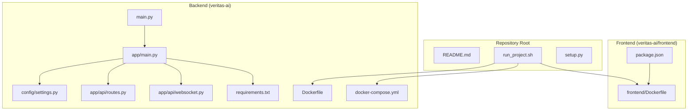
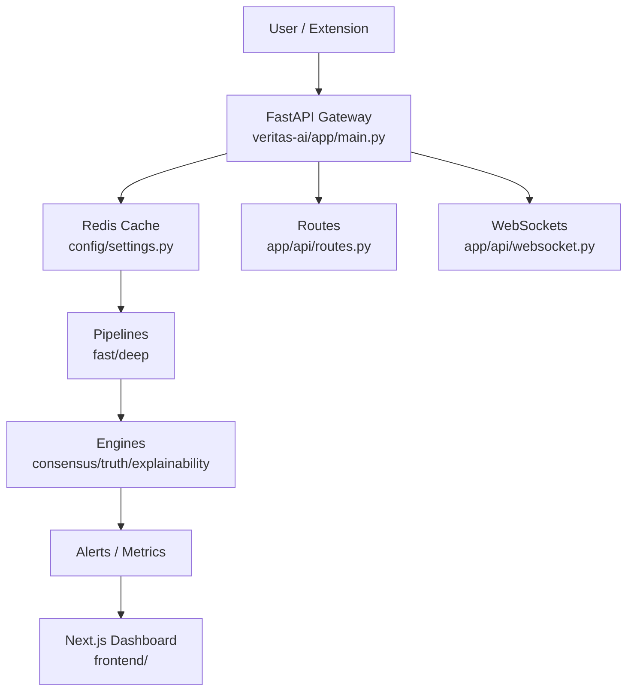
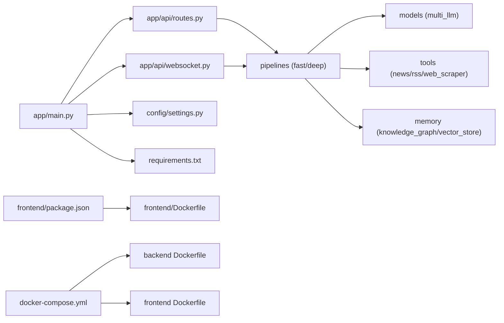

# Getting Started

<cite>
**Referenced Files in This Document**
- [README.md](file://README.md)
- [veritas-ai/README.md](file://veritas-ai/README.md)
- [run_project.sh](file://run_project.sh)
- [veritas-ai/docker-compose.yml](file://veritas-ai/docker-compose.yml)
- [veritas-ai/Dockerfile](file://veritas-ai/Dockerfile)
- [veritas-ai/frontend/Dockerfile](file://veritas-ai/frontend/Dockerfile)
- [veritas-ai/requirements.txt](file://veritas-ai/requirements.txt)
- [veritas-ai/main.py](file://veritas-ai/main.py)
- [veritas-ai/app/main.py](file://veritas-ai/app/main.py)
- [veritas-ai/config/settings.py](file://veritas-ai/config/settings.py)
- [veritas-ai/app/api/routes.py](file://veritas-ai/app/api/routes.py)
- [veritas-ai/app/api/websocket.py](file://veritas-ai/app/api/websocket.py)
- [veritas-ai/frontend/package.json](file://veritas-ai/frontend/package.json)
- [setup.py](file://setup.py)
</cite>

## Table of Contents
1. [Introduction](#introduction)
2. [Project Structure](#project-structure)
3. [Core Components](#core-components)
4. [Architecture Overview](#architecture-overview)
5. [Detailed Component Analysis](#detailed-component-analysis)
6. [Dependency Analysis](#dependency-analysis)
7. [Performance Considerations](#performance-considerations)
8. [Troubleshooting Guide](#troubleshooting-guide)
9. [Conclusion](#conclusion)
10. [Appendices](#appendices)

## Introduction
This guide helps you quickly set up and run Veritas AI locally for development. It covers environment prerequisites, Python virtual environment setup, dependency installation, local development server startup, Docker Compose deployment, and basic development workflow. It also includes IDE setup tips, debugging configuration, hot-reload capabilities, and verification steps to confirm a successful setup.

## Project Structure
Veritas AI is organized as a monorepo with a Python backend under veritas-ai/, a Next.js frontend under veritas-ai/frontend/, and supporting scripts and configurations at the repository root. Key areas contributors should know:
- Backend: FastAPI application with modular components under veritas-ai/app/, API routes under veritas-ai/app/api/, and configuration under veritas-ai/config/.
- Frontend: Next.js 14 dashboard under veritas-ai/frontend/.
- DevOps: Docker Compose orchestration under veritas-ai/docker-compose.yml, backend Dockerfile under veritas-ai/Dockerfile, and frontend Dockerfile under veritas-ai/frontend/Dockerfile.
- Scripts: Automated project setup under run_project.sh.

**Diagram sources**
- [run_project.sh:1-41](file://run_project.sh#L1-L41)
- [veritas-ai/docker-compose.yml:1-160](file://veritas-ai/docker-compose.yml#L1-L160)
- [veritas-ai/Dockerfile:1-81](file://veritas-ai/Dockerfile#L1-L81)
- [veritas-ai/frontend/Dockerfile:1-54](file://veritas-ai/frontend/Dockerfile#L1-L54)
- [veritas-ai/main.py:1-141](file://veritas-ai/main.py#L1-L141)
- [veritas-ai/app/main.py:1-208](file://veritas-ai/app/main.py#L1-L208)
- [veritas-ai/config/settings.py:1-83](file://veritas-ai/config/settings.py#L1-L83)
- [veritas-ai/app/api/routes.py:1-251](file://veritas-ai/app/api/routes.py#L1-L251)
- [veritas-ai/app/api/websocket.py:1-253](file://veritas-ai/app/api/websocket.py#L1-L253)
- [veritas-ai/requirements.txt:1-42](file://veritas-ai/requirements.txt#L1-L42)
- [veritas-ai/frontend/package.json:1-27](file://veritas-ai/frontend/package.json#L1-L27)

**Section sources**
- [README.md:63-92](file://README.md#L63-L92)
- [veritas-ai/README.md:63-92](file://veritas-ai/README.md#L63-L92)
- [run_project.sh:1-41](file://run_project.sh#L1-L41)
- [veritas-ai/docker-compose.yml:1-160](file://veritas-ai/docker-compose.yml#L1-L160)
- [veritas-ai/Dockerfile:1-81](file://veritas-ai/Dockerfile#L1-L81)
- [veritas-ai/frontend/Dockerfile:1-54](file://veritas-ai/frontend/Dockerfile#L1-L54)
- [veritas-ai/requirements.txt:1-42](file://veritas-ai/requirements.txt#L1-L42)
- [veritas-ai/main.py:1-141](file://veritas-ai/main.py#L1-L141)
- [veritas-ai/app/main.py:1-208](file://veritas-ai/app/main.py#L1-L208)
- [veritas-ai/config/settings.py:1-83](file://veritas-ai/config/settings.py#L1-L83)
- [veritas-ai/app/api/routes.py:1-251](file://veritas-ai/app/api/routes.py#L1-L251)
- [veritas-ai/app/api/websocket.py:1-253](file://veritas-ai/app/api/websocket.py#L1-L253)
- [veritas-ai/frontend/package.json:1-27](file://veritas-ai/frontend/package.json#L1-L27)
- [setup.py:1-9](file://setup.py#L1-L9)

## Core Components
- Backend entry points:
  - Legacy entry point: veritas-ai/main.py runs the old architecture and re-exports the new app.
  - New clean entry point: veritas-ai/app/main.py creates the FastAPI app with startup/shutdown lifecycle, middleware, and routers.
- Configuration: veritas-ai/config/settings.py loads environment variables for models, databases, caches, and runtime tuning.
- API surface:
  - REST endpoints: veritas-ai/app/api/routes.py defines health, query, verification, streaming authorization, history, feedback, alerts, trends, metrics, and cache controls.
  - WebSocket endpoints: veritas-ai/app/api/websocket.py provides streaming and voice pipelines.
- Frontend: Next.js 14 dashboard under veritas-ai/frontend/ with build and dev scripts.
- Dependencies: veritas-ai/requirements.txt lists core frameworks, AI/ML libraries, infrastructure, and voice tools.

Quick references:
- Backend startup: [veritas-ai/app/main.py:106-111](file://veritas-ai/app/main.py#L106-L111)
- Health endpoint: [veritas-ai/app/api/routes.py:86-97](file://veritas-ai/app/api/routes.py#L86-L97)
- WebSocket streaming: [veritas-ai/app/api/websocket.py:63-165](file://veritas-ai/app/api/websocket.py#L63-L165)
- Frontend scripts: [veritas-ai/frontend/package.json:5-9](file://veritas-ai/frontend/package.json#L5-L9)

**Section sources**
- [veritas-ai/app/main.py:106-111](file://veritas-ai/app/main.py#L106-L111)
- [veritas-ai/app/api/routes.py:86-97](file://veritas-ai/app/api/routes.py#L86-L97)
- [veritas-ai/app/api/websocket.py:63-165](file://veritas-ai/app/api/websocket.py#L63-L165)
- [veritas-ai/frontend/package.json:5-9](file://veritas-ai/frontend/package.json#L5-L9)

## Architecture Overview
The system uses an event-driven, multi-agent architecture with a FastAPI gateway, optional Redis cache, internal event bus, and specialized agents. The frontend Next.js dashboard consumes the API and WebSocket endpoints.

**Diagram sources**
- [veritas-ai/app/main.py:106-111](file://veritas-ai/app/main.py#L106-L111)
- [veritas-ai/config/settings.py:55-59](file://veritas-ai/config/settings.py#L55-L59)
- [veritas-ai/app/api/routes.py:18-251](file://veritas-ai/app/api/routes.py#L18-L251)
- [veritas-ai/app/api/websocket.py:19-253](file://veritas-ai/app/api/websocket.py#L19-L253)

## Detailed Component Analysis

### Environment Setup and Prerequisites
- Python 3.9+ is required for the backend.
- Node.js 18+ is required for the frontend.
- Docker and Docker Compose are recommended for a production-ready local stack.
- Optional: Ollama for local LLM inference; Neo4j, ChromaDB, and Redis for knowledge graph, vector storage, and caching.

Verification steps:
- Confirm Python version meets requirements.
- Confirm Node.js version meets requirements.
- Confirm Docker and Docker Compose are installed and running.

**Section sources**
- [README.md:6, 137-143:6-143](file://README.md#L6-L143)
- [veritas-ai/README.md:6, 137-143:6-143](file://veritas-ai/README.md#L6-L143)

### Step-by-Step: Local Development (Manual)
- Create and activate a Python virtual environment.
- Install backend dependencies from veritas-ai/requirements.txt.
- Start the backend using the new entry point: uvicorn app.main:app.
- Navigate to the frontend directory and install dependencies.
- Start the frontend development server.

References:
- Virtual environment activation and dependency installation: [README.md:65-79](file://README.md#L65-L79)
- Backend entry point: [veritas-ai/app/main.py:106-111](file://veritas-ai/app/main.py#L106-L111)
- Frontend scripts: [veritas-ai/frontend/package.json:5-9](file://veritas-ai/frontend/package.json#L5-L9)

**Section sources**
- [README.md:65-79](file://README.md#L65-L79)
- [veritas-ai/app/main.py:106-111](file://veritas-ai/app/main.py#L106-L111)
- [veritas-ai/frontend/package.json:5-9](file://veritas-ai/frontend/package.json#L5-L9)

### Step-by-Step: Docker Compose Deployment
- Ensure Docker is installed and running.
- From the repository root, run the convenience script to build and start all services in detached mode.
- Verify services health and access points:
  - Backend API health: http://localhost:8001/api/v1/health
  - Frontend dashboard: http://localhost:3000
  - Neo4j browser: http://localhost:7474
- Use docker compose logs -f to follow service logs.

References:
- Convenience script: [run_project.sh:17-31](file://run_project.sh#L17-L31)
- Backend service ports and environment: [veritas-ai/docker-compose.yml:5-48](file://veritas-ai/docker-compose.yml#L5-L48)
- Frontend service ports and build args: [veritas-ai/docker-compose.yml:52-67](file://veritas-ai/docker-compose.yml#L52-L67)
- Backend Dockerfile entrypoint: [veritas-ai/Dockerfile:79-81](file://veritas-ai/Dockerfile#L79-L81)
- Frontend Dockerfile production runner: [veritas-ai/frontend/Dockerfile:46-54](file://veritas-ai/frontend/Dockerfile#L46-L54)

**Section sources**
- [run_project.sh:17-31](file://run_project.sh#L17-L31)
- [veritas-ai/docker-compose.yml:5-48](file://veritas-ai/docker-compose.yml#L5-L48)
- [veritas-ai/docker-compose.yml:52-67](file://veritas-ai/docker-compose.yml#L52-L67)
- [veritas-ai/Dockerfile:79-81](file://veritas-ai/Dockerfile#L79-L81)
- [veritas-ai/frontend/Dockerfile:46-54](file://veritas-ai/frontend/Dockerfile#L46-L54)

### Configuration and Environment Variables
Key runtime settings are loaded from environment variables via veritas-ai/config/settings.py:
- Model selection and endpoints (OLLAMA_BASE_URL, MODEL_NAME, ROUTER_MODEL, FAST_MODEL)
- Vector DB (CHROMA_PERSIST_DIRECTORY, EMBEDDING_MODEL, RETRIEVAL_K)
- Redis (REDIS_HOST, REDIS_PORT, REDIS_DB)
- Knowledge Graph (NEO4J_URI, NEO4J_USER, NEO4J_PASSWORD)
- CORS and streaming toggles
- Pipeline timeouts and limits

References:
- Settings class and defaults: [veritas-ai/config/settings.py:13-83](file://veritas-ai/config/settings.py#L13-L83)

**Section sources**
- [veritas-ai/config/settings.py:13-83](file://veritas-ai/config/settings.py#L13-L83)

### API Endpoints and Verification
Common endpoints to verify your setup:
- GET /api/v1/health: Confirms backend is healthy.
- POST /api/v1/query: Direct query endpoint (no auth).
- POST /api/v1/verify-news: Public verification endpoint (requires API key).
- GET /api/v1/history: Query history (requires API key).
- POST /api/v1/feedback: Submit user feedback (requires API key).
- GET /api/v1/alerts: Active alerts (requires API key).
- GET /api/v1/predictive-trends: Trend predictions (requires API key).
- POST /api/v1/stream-analysis: Get WebSocket tunnel URL (requires API key).
- GET /api/v1/metrics: System metrics.
- POST /api/v1/cache/clear: Clear caches.

References:
- Routes definition: [veritas-ai/app/api/routes.py:86-251](file://veritas-ai/app/api/routes.py#L86-L251)

**Section sources**
- [veritas-ai/app/api/routes.py:86-251](file://veritas-ai/app/api/routes.py#L86-L251)

### WebSocket Streaming and Voice Pipelines
- Streaming: /ws/stream accepts {"query": "...", "deep": false} and streams progress updates until completion.
- Voice: /ws/voice accepts audio bytes, transcribes, runs the pipeline, synthesizes speech, and returns both text and audio.

References:
- WebSocket routing: [veritas-ai/app/api/websocket.py:63-165](file://veritas-ai/app/api/websocket.py#L63-L165)
- Voice pipeline: [veritas-ai/app/api/websocket.py:169-253](file://veritas-ai/app/api/websocket.py#L169-L253)

**Section sources**
- [veritas-ai/app/api/websocket.py:63-165](file://veritas-ai/app/api/websocket.py#L63-L165)
- [veritas-ai/app/api/websocket.py:169-253](file://veritas-ai/app/api/websocket.py#L169-L253)

### Frontend Development Server
- Install dependencies: npm install
- Start development server: npm run dev
- Access the dashboard at http://localhost:3000

References:
- Frontend scripts: [veritas-ai/frontend/package.json:5-9](file://veritas-ai/frontend/package.json#L5-L9)

**Section sources**
- [veritas-ai/frontend/package.json:5-9](file://veritas-ai/frontend/package.json#L5-L9)

### IDE Setup Recommendations
- Python: Configure interpreter to the virtual environment created during setup.
- FastAPI/Uvicorn: Add a debug configuration to launch app.main:app with host 0.0.0.0 and port 8000.
- Next.js: Use Node.js 18+ interpreter; configure dev script to run npm run dev.
- Hot reload: Both backend (uvicorn reloader) and frontend (Next.js dev server) support hot reloading.

References:
- Backend entry point: [veritas-ai/app/main.py:106-111](file://veritas-ai/app/main.py#L106-L111)
- Frontend scripts: [veritas-ai/frontend/package.json:5-9](file://veritas-ai/frontend/package.json#L5-L9)

**Section sources**
- [veritas-ai/app/main.py:106-111](file://veritas-ai/app/main.py#L106-L111)
- [veritas-ai/frontend/package.json:5-9](file://veritas-ai/frontend/package.json#L5-L9)

### Development Workflow: From Clone to First Run
- Clone the repository.
- Change to the veritas-ai directory and run the convenience script to start all services.
- Verify backend health, frontend availability, and Neo4j browser.
- Use curl or a REST client to hit /api/v1/health and /api/v1/query.
- For frontend, open http://localhost:3000 and verify the dashboard loads.

References:
- Convenience script: [run_project.sh:17-31](file://run_project.sh#L17-L31)
- Backend health endpoint: [veritas-ai/app/api/routes.py:86-97](file://veritas-ai/app/api/routes.py#L86-L97)

**Section sources**
- [run_project.sh:17-31](file://run_project.sh#L17-L31)
- [veritas-ai/app/api/routes.py:86-97](file://veritas-ai/app/api/routes.py#L86-L97)

## Dependency Analysis
The backend relies on a cohesive set of libraries for framework, AI/ML, infrastructure, and voice capabilities. The frontend uses Next.js 14 with React and Tailwind CSS.

**Diagram sources**
- [veritas-ai/app/main.py:203-207](file://veritas-ai/app/main.py#L203-L207)
- [veritas-ai/app/api/routes.py:13-14](file://veritas-ai/app/api/routes.py#L13-L14)
- [veritas-ai/app/api/websocket.py:12-13](file://veritas-ai/app/api/websocket.py#L12-L13)
- [veritas-ai/config/settings.py:13-83](file://veritas-ai/config/settings.py#L13-L83)
- [veritas-ai/requirements.txt:1-42](file://veritas-ai/requirements.txt#L1-L42)
- [veritas-ai/frontend/package.json:1-27](file://veritas-ai/frontend/package.json#L1-L27)
- [veritas-ai/docker-compose.yml:1-160](file://veritas-ai/docker-compose.yml#L1-L160)
- [veritas-ai/Dockerfile:1-81](file://veritas-ai/Dockerfile#L1-L81)
- [veritas-ai/frontend/Dockerfile:1-54](file://veritas-ai/frontend/Dockerfile#L1-L54)

**Section sources**
- [veritas-ai/requirements.txt:1-42](file://veritas-ai/requirements.txt#L1-L42)
- [veritas-ai/frontend/package.json:1-27](file://veritas-ai/frontend/package.json#L1-L27)
- [veritas-ai/docker-compose.yml:1-160](file://veritas-ai/docker-compose.yml#L1-L160)
- [veritas-ai/Dockerfile:1-81](file://veritas-ai/Dockerfile#L1-L81)
- [veritas-ai/frontend/Dockerfile:1-54](file://veritas-ai/frontend/Dockerfile#L1-L54)

## Performance Considerations
- Startup optimization: The new app initializes cache and databases concurrently and preloads models in the background to minimize cold start latency.
- Caching: Redis-backed cache with configurable TTL and max entries; fallback to local cache if Redis is unavailable.
- Timeouts: Global request timeout and per-pipeline timeouts are enforced to maintain responsiveness.
- Streaming: WebSocket endpoints provide progress updates and chunked responses for long-running analyses.

References:
- Startup and cache initialization: [veritas-ai/app/main.py:33-101](file://veritas-ai/app/main.py#L33-L101)
- Settings timeouts and cache params: [veritas-ai/config/settings.py:21-29](file://veritas-ai/config/settings.py#L21-L29)

**Section sources**
- [veritas-ai/app/main.py:33-101](file://veritas-ai/app/main.py#L33-L101)
- [veritas-ai/config/settings.py:21-29](file://veritas-ai/config/settings.py#L21-L29)

## Troubleshooting Guide
Common issues and resolutions:
- Docker not installed or not running:
  - Ensure Docker and Docker Compose are installed and the daemon is running.
  - Use the convenience script to build and start services.
- Port conflicts:
  - Backend API runs on 8000 inside containers; exposed as 8001 on host.
  - Frontend runs on 3000 inside containers; exposed as 3000 on host.
  - Neo4j browser runs on 7474; ChromaDB on 8200; Redis on 6379; Ollama on 11435 on host.
- Health checks fail:
  - Wait for all dependent services to become healthy before accessing the API.
  - Use docker compose logs -f to inspect service logs.
- API key required:
  - Some endpoints require X-API-KEY header; ensure requests include the header.
- Frontend not loading:
  - Confirm Node.js 18+ is installed and run npm install followed by npm run dev.

References:
- Convenience script and ports: [run_project.sh:17-31](file://run_project.sh#L17-L31)
- Backend ports and healthcheck: [veritas-ai/docker-compose.yml:11-47](file://veritas-ai/docker-compose.yml#L11-L47)
- Frontend ports and healthcheck: [veritas-ai/docker-compose.yml:61-67](file://veritas-ai/docker-compose.yml#L61-L67)
- API key requirement: [veritas-ai/app/api/routes.py:23-31](file://veritas-ai/app/api/routes.py#L23-L31)

**Section sources**
- [run_project.sh:17-31](file://run_project.sh#L17-L31)
- [veritas-ai/docker-compose.yml:11-47](file://veritas-ai/docker-compose.yml#L11-L47)
- [veritas-ai/docker-compose.yml:61-67](file://veritas-ai/docker-compose.yml#L61-L67)
- [veritas-ai/app/api/routes.py:23-31](file://veritas-ai/app/api/routes.py#L23-L31)

## Conclusion
You now have the essentials to set up Veritas AI locally, choose between manual Python execution and Docker Compose, and verify your environment. Use the provided references to navigate the codebase, configure environment variables, and explore the API and WebSocket endpoints. For deeper exploration, review the backend entry point, configuration, and API route definitions.

## Appendices

### Quick Start Examples
- Manual backend:
  - Activate virtual environment and install dependencies.
  - Start backend with uvicorn pointing to app.main:app.
- Manual frontend:
  - Install dependencies and start dev server.
- Docker Compose:
  - Run the convenience script to start all services in detached mode.

References:
- Manual steps: [README.md:65-79](file://README.md#L65-L79)
- Docker Compose steps: [run_project.sh:17-31](file://run_project.sh#L17-L31)

**Section sources**
- [README.md:65-79](file://README.md#L65-L79)
- [run_project.sh:17-31](file://run_project.sh#L17-L31)