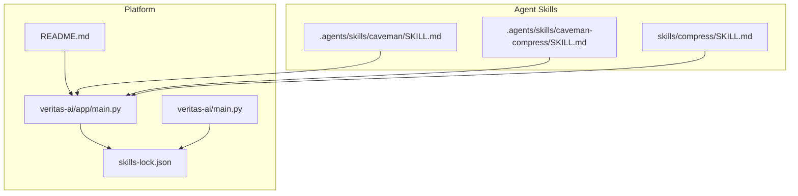
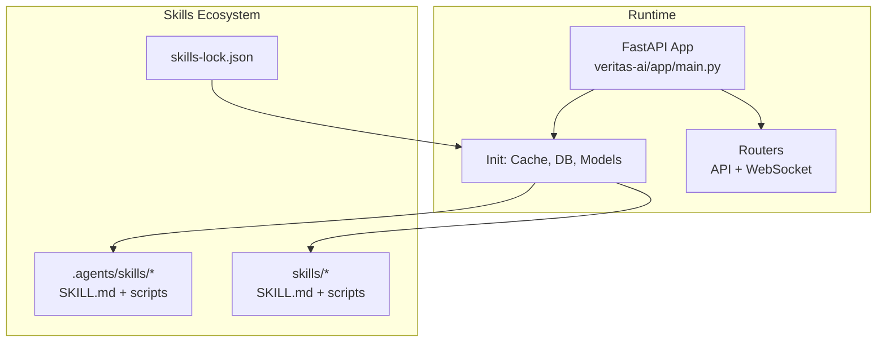
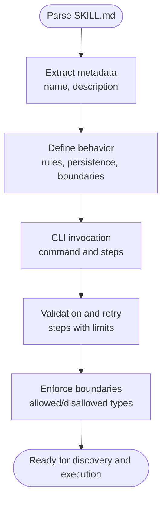
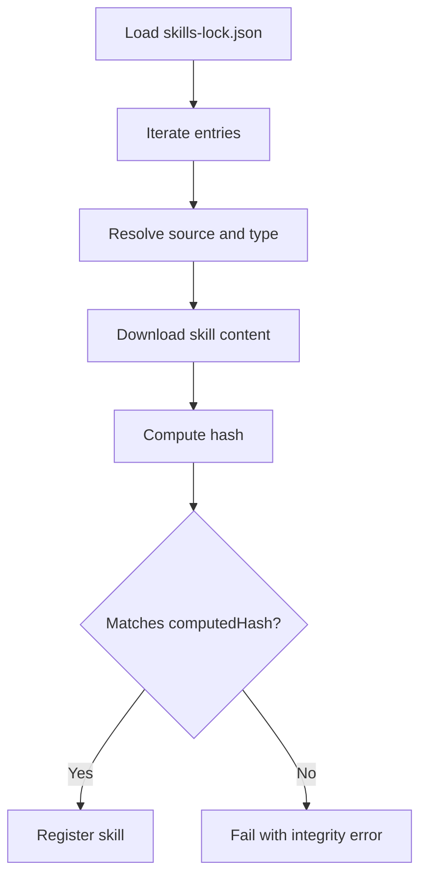
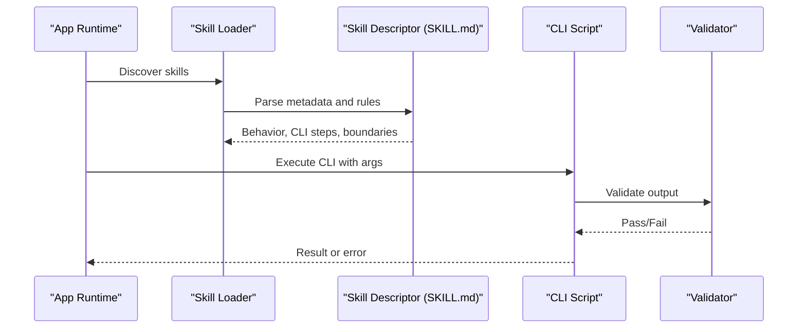
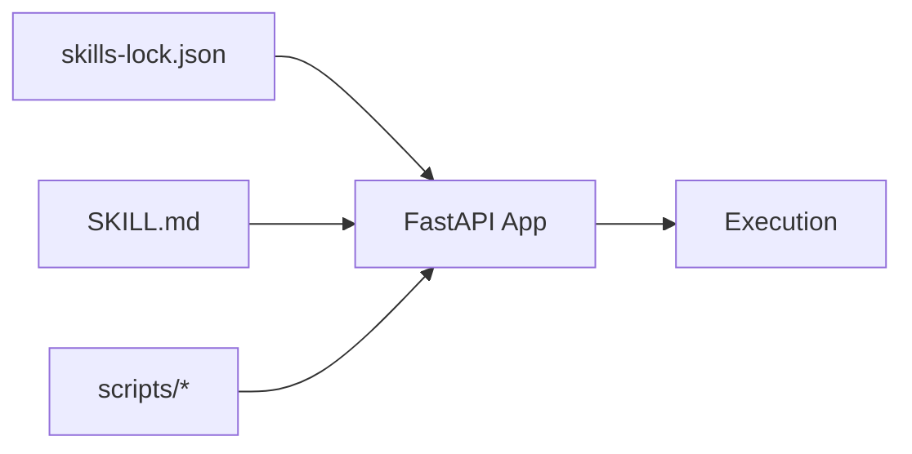

# Skills Extension Framework

<cite>
**Referenced Files in This Document**
- [skills-lock.json](file://skills-lock.json)
- [README.md](file://README.md)
- [main.py](file://veritas-ai/main.py)
- [app/main.py](file://veritas-ai/app/main.py)
- [.agents/skills/caveman/SKILL.md](file://.agents/skills/caveman/SKILL.md)
- [.agents/skills/caveman-compress/SKILL.md](file://.agents/skills/caveman-compress/SKILL.md)
- [.agents/skills/compress/SKILL.md](file://.agents/skills/compress/SKILL.md)
</cite>

## Table of Contents
1. [Introduction](#introduction)
2. [Project Structure](#project-structure)
3. [Core Components](#core-components)
4. [Architecture Overview](#architecture-overview)
5. [Detailed Component Analysis](#detailed-component-analysis)
6. [Dependency Analysis](#dependency-analysis)
7. [Performance Considerations](#performance-considerations)
8. [Troubleshooting Guide](#troubleshooting-guide)
9. [Conclusion](#conclusion)
10. [Appendices](#appendices)

## Introduction
This document explains the Veritas AI skills extension framework that enables modular, discoverable, and versioned capabilities for agents. It covers the skills ecosystem architecture, the distinction between .agents/skills and skills directories, the SKILL.md specification, skills-lock.json dependency management, skill creation patterns, discovery/loading/execution workflows, examples of existing skills, testing and benchmarking, performance optimization, packaging and distribution, and authoring guidelines for documentation, parameters, and error handling.

## Project Structure
Veritas AI organizes skills in two primary locations:
- .agents/skills: Agent-specific skills with human-readable SKILL.md descriptors and optional scripts for CLI-driven actions.
- skills: Top-level directory for additional skills and resources managed by the platform.

Key files and roles:
- skills-lock.json: Lockfile for skills registry entries with source, type, and computed hash for integrity.
- README.md: High-level overview of the platform and capabilities.
- veritas-ai/main.py and veritas-ai/app/main.py: Application entry points and lifecycle management for the API server.

**Diagram sources**
- [app/main.py:1-208](file://veritas-ai/app/main.py#L1-L208)
- [main.py:1-141](file://veritas-ai/main.py#L1-L141)
- [README.md:1-157](file://README.md#L1-L157)
- [skills-lock.json:1-36](file://skills-lock.json#L1-L36)
- [.agents/skills/caveman/SKILL.md:1-67](file://.agents/skills/caveman/SKILL.md#L1-L67)
- [.agents/skills/caveman-compress/SKILL.md:1-112](file://.agents/skills/caveman-compress/SKILL.md#L1-L112)
- [.agents/skills/compress/SKILL.md:1-200](file://.agents/skills/compress/SKILL.md#L1-L200)

**Section sources**
- [README.md:1-157](file://README.md#L1-L157)
- [app/main.py:1-208](file://veritas-ai/app/main.py#L1-L208)
- [main.py:1-141](file://veritas-ai/main.py#L1-L141)
- [skills-lock.json:1-36](file://skills-lock.json#L1-L36)

## Core Components
- Skills registry and lockfile: skills-lock.json defines the canonical set of skills, their sources, and integrity hashes. This ensures reproducible and secure skill deployments.
- Agent skill descriptors: SKILL.md files define metadata, behavior, triggers, boundaries, and rules for agent skills. They also describe CLI invocation patterns and validation steps.
- Application lifecycle: The FastAPI app initializes caches, databases, and background model preloads, and exposes routers for API and WebSocket endpoints.

Key responsibilities:
- Discovery and loading: Skills are discovered from .agents/skills and skills directories; metadata is parsed from SKILL.md.
- Execution: Agent skills may include CLI entry points and validation routines to ensure correctness and safety.
- Consistency: skills-lock.json enforces deterministic versions and integrity checks.

**Section sources**
- [skills-lock.json:1-36](file://skills-lock.json#L1-L36)
- [.agents/skills/caveman/SKILL.md:1-67](file://.agents/skills/caveman/SKILL.md#L1-L67)
- [.agents/skills/caveman-compress/SKILL.md:1-112](file://.agents/skills/caveman-compress/SKILL.md#L1-L112)
- [app/main.py:31-102](file://veritas-ai/app/main.py#L31-L102)

## Architecture Overview
The skills framework integrates with the Veritas AI runtime as follows:
- Application startup initializes core services and mounts API/WebSocket routers.
- Skills are loaded from .agents/skills and skills directories.
- Agent skills may expose CLI entry points described in SKILL.md for external invocation.
- Integrity and versioning are enforced via skills-lock.json.

**Diagram sources**
- [app/main.py:31-102](file://veritas-ai/app/main.py#L31-L102)
- [skills-lock.json:1-36](file://skills-lock.json#L1-L36)
- [.agents/skills/caveman/SKILL.md:1-67](file://.agents/skills/caveman/SKILL.md#L1-L67)
- [.agents/skills/caveman-compress/SKILL.md:1-112](file://.agents/skills/caveman-compress/SKILL.md#L1-L112)
- [.agents/skills/compress/SKILL.md:1-200](file://.agents/skills/compress/SKILL.md#L1-L200)

## Detailed Component Analysis

### SKILL.md Specification and Metadata
SKILL.md defines:
- name: Unique skill identifier.
- description: Human-readable purpose and trigger conditions.
- Behavior and rules: Persistence, boundaries, and patterns.
- CLI invocation: Command-line interface usage and process steps.
- Validation and retry: Validation steps and retry limits.
- Boundaries: Allowed and disallowed file types and content rules.

Examples:
- caveman: Defines intensity levels, persistence, and boundaries for compressed communication modes.
- caveman-compress: Describes compression rules, CLI usage, validation, and boundaries for memory files.

**Diagram sources**
- [.agents/skills/caveman/SKILL.md:1-67](file://.agents/skills/caveman/SKILL.md#L1-L67)
- [.agents/skills/caveman-compress/SKILL.md:1-112](file://.agents/skills/caveman-compress/SKILL.md#L1-L112)

**Section sources**
- [.agents/skills/caveman/SKILL.md:1-67](file://.agents/skills/caveman/SKILL.md#L1-L67)
- [.agents/skills/caveman-compress/SKILL.md:1-112](file://.agents/skills/caveman-compress/SKILL.md#L1-L112)

### skills-lock.json Management
skills-lock.json manages:
- version: Lockfile version for compatibility.
- skills: Skill entries with:
  - source: Origin of the skill (e.g., GitHub repository).
  - sourceType: Type of source (e.g., github).
  - computedHash: Integrity hash for tamper detection.

Usage:
- During deployment, the platform reads skills-lock.json to resolve and validate skills.
- Integrity checks compare computedHash against downloaded content to ensure consistency.

**Diagram sources**
- [skills-lock.json:1-36](file://skills-lock.json#L1-L36)

**Section sources**
- [skills-lock.json:1-36](file://skills-lock.json#L1-L36)

### Skill Discovery, Loading, and Execution Workflows
Discovery and loading:
- Discover skills from .agents/skills and skills directories.
- Parse SKILL.md to extract metadata and behavior.
- Optionally locate CLI entry points adjacent to SKILL.md.

Execution:
- For CLI-enabled skills, execute the described command with validated arguments.
- Apply validation and retry logic as defined in SKILL.md.
- Enforce boundaries to protect code and binary files.

**Diagram sources**
- [.agents/skills/caveman-compress/SKILL.md:20-36](file://.agents/skills/caveman-compress/SKILL.md#L20-L36)
- [app/main.py:31-102](file://veritas-ai/app/main.py#L31-L102)

**Section sources**
- [.agents/skills/caveman-compress/SKILL.md:20-36](file://.agents/skills/caveman-compress/SKILL.md#L20-L36)
- [app/main.py:31-102](file://veritas-ai/app/main.py#L31-L102)

### Examples of Existing Skills

#### caveman
- Purpose: Ultra-compressed communication mode with intensity levels.
- Behavior: Active persistence across turns, auto-clarity boundaries, and mode switching.
- Boundaries: Preserves code and normal mode transitions.

**Section sources**
- [.agents/skills/caveman/SKILL.md:1-67](file://.agents/skills/caveman/SKILL.md#L1-L67)

#### caveman-compress
- Purpose: Compress natural language memory files into caveman format.
- CLI: python3 -m scripts <absolute_filepath>.
- Process: Detect type, call compression, validate output, cherry-pick fixes, retry up to twice, preserve backups.
- Boundaries: Only compress prose; preserve code blocks, URLs, file paths, commands, and technical terms.

**Section sources**
- [.agents/skills/caveman-compress/SKILL.md:1-112](file://.agents/skills/caveman-compress/SKILL.md#L1-L112)

#### compress (top-level)
- Purpose: Top-level compress skill descriptor indicating similar compression behavior and CLI usage patterns.

**Section sources**
- [.agents/skills/compress/SKILL.md:1-200](file://.agents/skills/compress/SKILL.md#L1-L200)

### Creating New Skills: Guidelines and Patterns
- Directory placement:
  - Place agent-centric skills under .agents/skills/<skill_name>/ with SKILL.md.
  - Place top-level skills under skills/<skill_name>/ with SKILL.md.
- SKILL.md structure:
  - name and description for identification and purpose.
  - Behavior and rules sections for persistence, boundaries, and patterns.
  - CLI invocation and process steps for automation.
  - Validation and retry logic with clear boundaries.
- CLI interfaces:
  - Include a scripts directory with __main__.py and supporting modules (cli.py, compress.py, detect.py, validate.py, benchmark.py).
  - Document command-line usage and argument expectations in SKILL.md.
- Validation mechanisms:
  - Implement detect.py to classify content types.
  - Implement compress.py to apply compression rules.
  - Implement validate.py to verify output quality.
  - Implement benchmark.py to measure performance metrics.
- Parameter validation and error handling:
  - Validate inputs and enforce boundaries.
  - Return structured errors with actionable messages.
  - Respect boundaries to avoid modifying protected file types.

**Section sources**
- [.agents/skills/caveman-compress/SKILL.md:20-36](file://.agents/skills/caveman-compress/SKILL.md#L20-L36)
- [.agents/skills/caveman/SKILL.md:1-67](file://.agents/skills/caveman/SKILL.md#L1-L67)

### Testing Procedures and Benchmarking
- Unit-level:
  - Test detect.py for accurate content classification.
  - Test compress.py for rule enforcement and boundary preservation.
  - Test validate.py for output correctness and error detection.
- Integration-level:
  - Execute CLI via python3 -m scripts <absolute_filepath> and assert expected outcomes.
  - Simulate retry logic and error recovery scenarios.
- Benchmarking:
  - Use benchmark.py to measure compression ratio, latency, and throughput.
  - Track performance regressions across versions.

**Section sources**
- [.agents/skills/caveman-compress/SKILL.md:20-36](file://.agents/skills/caveman-compress/SKILL.md#L20-L36)

### Performance Optimization
- Preload models during startup to minimize cold-start latency.
- Use background tasks for non-blocking initialization.
- Apply timeouts and rate limiting to protect the system.
- Optimize compression rules to reduce token usage without sacrificing fidelity.

**Section sources**
- [app/main.py:60-88](file://veritas-ai/app/main.py#L60-L88)
- [main.py:76-96](file://veritas-ai/main.py#L76-L96)

### Packaging, Distribution, and Integration
- Packaging:
  - Include SKILL.md and scripts directory with the skill.
  - Maintain computedHash in skills-lock.json for integrity.
- Distribution:
  - Publish skills to sources listed in skills-lock.json (e.g., GitHub).
  - Ensure sourceType matches the distribution mechanism.
- Integration:
  - Mount routers and initialize services in the application entry point.
  - Discover and load skills at startup or on-demand.

**Section sources**
- [skills-lock.json:1-36](file://skills-lock.json#L1-L36)
- [app/main.py:200-208](file://veritas-ai/app/main.py#L200-L208)
- [main.py:121-123](file://veritas-ai/main.py#L121-L123)

### Documentation, Parameter Validation, and Error Handling Patterns
- Documentation:
  - Clearly specify triggers, behavior, and boundaries in SKILL.md.
  - Provide examples and expected outputs.
- Parameter validation:
  - Validate file paths and types before processing.
  - Enforce boundaries to prevent unintended modifications.
- Error handling:
  - Return structured errors with context and retry guidance.
  - Preserve original files on failure and create backups when applicable.

**Section sources**
- [.agents/skills/caveman-compress/SKILL.md:32-36](file://.agents/skills/caveman-compress/SKILL.md#L32-L36)
- [app/main.py:126-175](file://veritas-ai/app/main.py#L126-L175)

## Dependency Analysis
The skills framework depends on:
- Application lifecycle: FastAPI app initialization and router mounting.
- Registry: skills-lock.json for deterministic skill resolution and integrity.
- Agent skills: SKILL.md descriptors and optional CLI scripts.

**Diagram sources**
- [skills-lock.json:1-36](file://skills-lock.json#L1-L36)
- [.agents/skills/caveman/SKILL.md:1-67](file://.agents/skills/caveman/SKILL.md#L1-L67)
- [.agents/skills/caveman-compress/SKILL.md:1-112](file://.agents/skills/caveman-compress/SKILL.md#L1-L112)
- [app/main.py:200-208](file://veritas-ai/app/main.py#L200-L208)

**Section sources**
- [skills-lock.json:1-36](file://skills-lock.json#L1-L36)
- [app/main.py:200-208](file://veritas-ai/app/main.py#L200-L208)

## Performance Considerations
- Startup optimization: Parallel initialization of cache and databases; background model preload.
- Request handling: Global timeout middleware and exception handlers to maintain responsiveness.
- Token efficiency: Use skills like caveman and caveman-compress to reduce input costs.

**Section sources**
- [app/main.py:31-102](file://veritas-ai/app/main.py#L31-L102)
- [main.py:125-134](file://veritas-ai/main.py#L125-L134)

## Troubleshooting Guide
Common issues and resolutions:
- Integrity failures: If computedHash does not match, re-download or update the skill entry.
- CLI errors: Validate arguments and ensure absolute file paths; check detect/validate stages.
- Boundary violations: Confirm file types are allowed; backups should be preserved on failure.
- Application errors: Use global exception handlers and timeouts to capture and log issues.

**Section sources**
- [skills-lock.json:1-36](file://skills-lock.json#L1-L36)
- [.agents/skills/caveman-compress/SKILL.md:32-36](file://.agents/skills/caveman-compress/SKILL.md#L32-L36)
- [app/main.py:126-175](file://veritas-ai/app/main.py#L126-L175)

## Conclusion
The Veritas AI skills extension framework provides a robust, modular, and secure way to extend agent capabilities. With SKILL.md descriptors, skills-lock.json integrity management, and clear CLI and validation patterns, developers can create, test, benchmark, and distribute skills that integrate seamlessly with the platform’s runtime.

## Appendices
- Example skills:
  - caveman: Intensity-based compression with persistence.
  - caveman-compress: CLI-driven compression with validation and retry.
  - compress: Top-level compression skill descriptor.

**Section sources**
- [.agents/skills/caveman/SKILL.md:1-67](file://.agents/skills/caveman/SKILL.md#L1-L67)
- [.agents/skills/caveman-compress/SKILL.md:1-112](file://.agents/skills/caveman-compress/SKILL.md#L1-L112)
- [.agents/skills/compress/SKILL.md:1-200](file://.agents/skills/compress/SKILL.md#L1-L200)