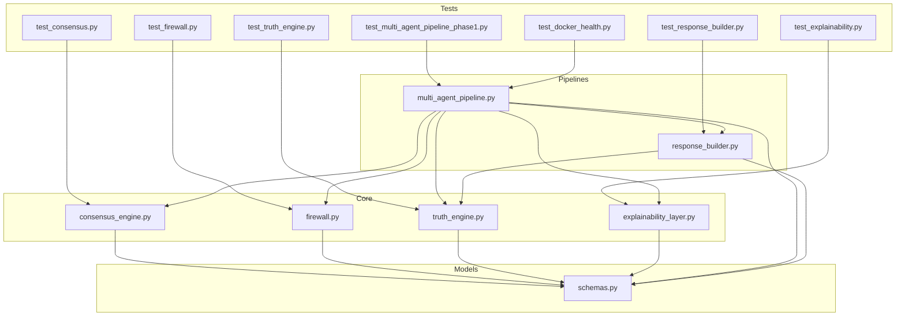
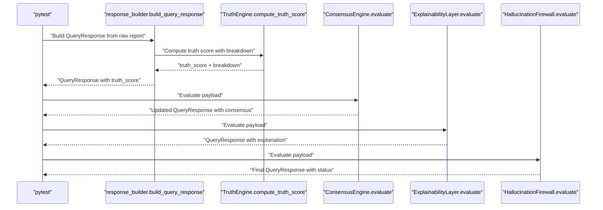
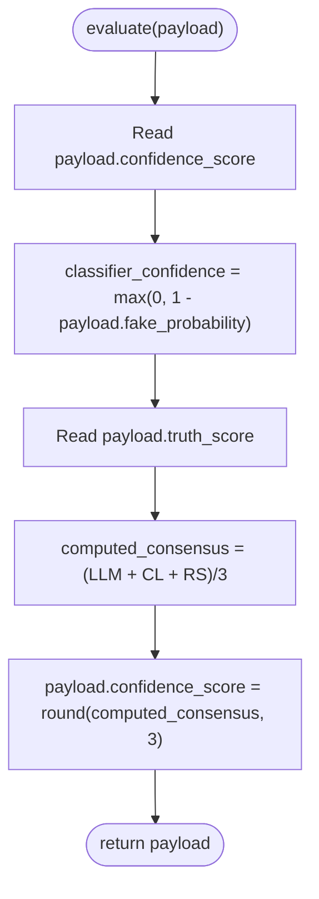
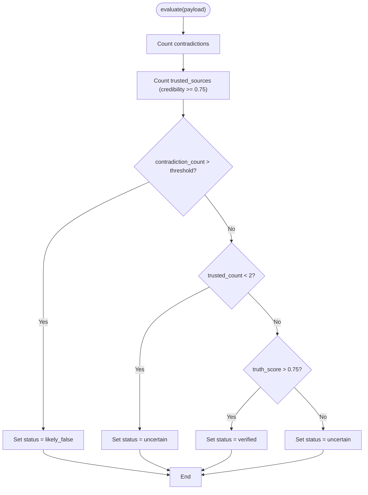
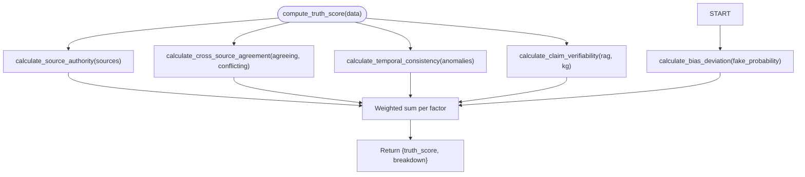
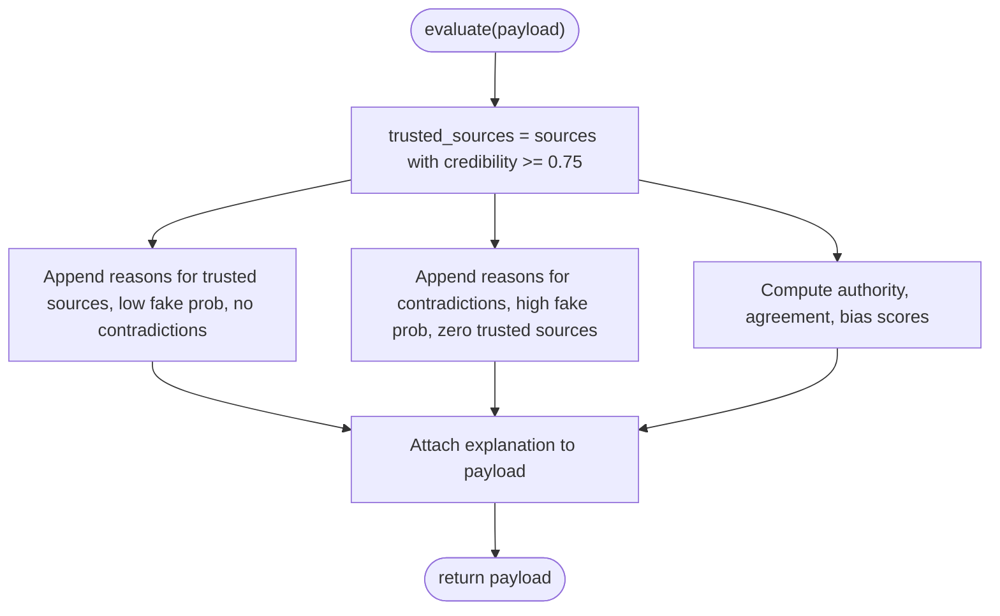
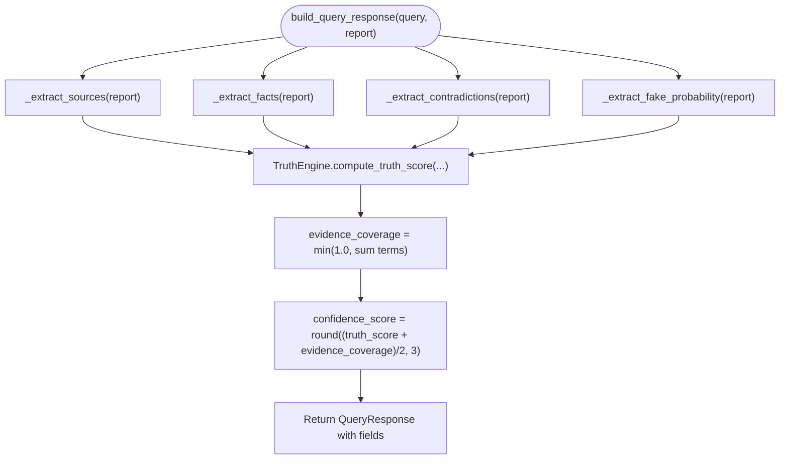
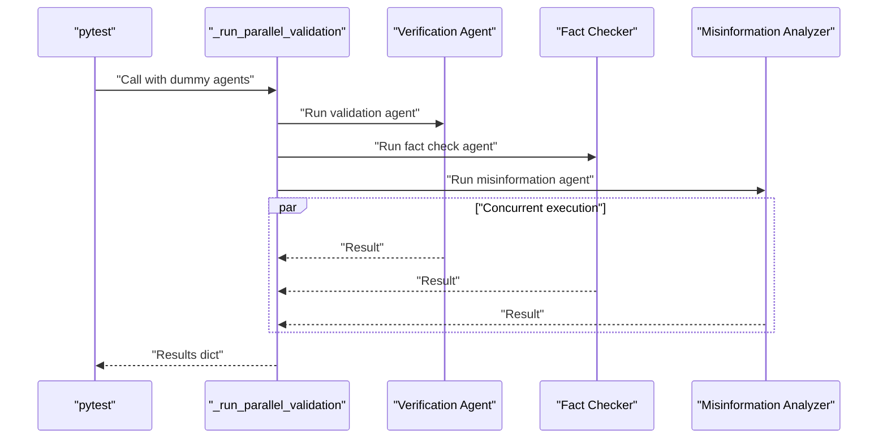
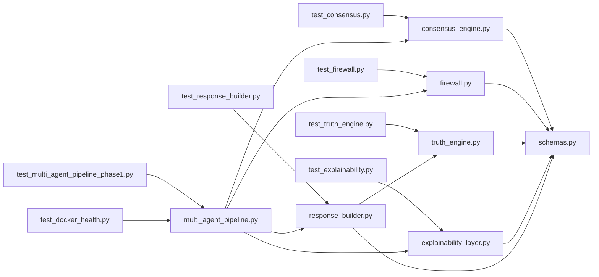
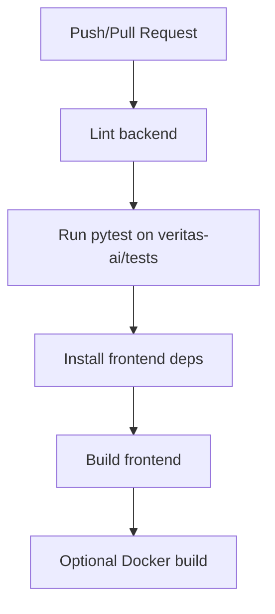

# Testing Framework

<cite>
**Referenced Files in This Document**
- [test_consensus.py](file://veritas-ai/tests/test_consensus.py)
- [test_firewall.py](file://veritas-ai/tests/test_firewall.py)
- [test_response_builder.py](file://veritas-ai/tests/test_response_builder.py)
- [test_truth_engine.py](file://veritas-ai/tests/test_truth_engine.py)
- [test_explainability.py](file://veritas-ai/tests/test_explainability.py)
- [test_multi_agent_pipeline_phase1.py](file://veritas-ai/tests/test_multi_agent_pipeline_phase1.py)
- [test_docker_health.py](file://veritas-ai/tests/test_docker_health.py)
- [consensus_engine.py](file://veritas-ai/core/consensus_engine.py)
- [firewall.py](file://veritas-ai/core/firewall.py)
- [response_builder.py](file://veritas-ai/pipelines/response_builder.py)
- [truth_engine.py](file://veritas-ai/core/truth_engine.py)
- [explainability_layer.py](file://veritas-ai/core/explainability_layer.py)
- [multi_agent_pipeline.py](file://veritas-ai/pipelines/multi_agent_pipeline.py)
- [schemas.py](file://veritas-ai/models/schemas.py)
- [ci.yml](file://.github/workflows/ci.yml)
- [main.yml](file://veritas-ai/.github/workflows/main.yml)
- [requirements.txt](file://veritas-ai/requirements.txt)
</cite>

## Table of Contents
1. [Introduction](#introduction)
2. [Project Structure](#project-structure)
3. [Core Components](#core-components)
4. [Architecture Overview](#architecture-overview)
5. [Detailed Component Analysis](#detailed-component-analysis)
6. [Dependency Analysis](#dependency-analysis)
7. [Performance Considerations](#performance-considerations)
8. [Troubleshooting Guide](#troubleshooting-guide)
9. [Conclusion](#conclusion)
10. [Appendices](#appendices)

## Introduction
This document describes the testing framework for Veritas AI, focusing on comprehensive methodologies for unit, integration, and pipeline-level testing. It explains how consensus engines, multi-agent pipelines, response builders, and truth engines are validated, outlines CI/CD testing pipelines, and provides best practices for mocks, test data management, performance and load testing, and debugging. It also documents execution commands, reporting mechanisms, and continuous integration triggers.

## Project Structure
The testing suite resides under veritas-ai/tests and validates core modules under veritas-ai/core, veritas-ai/pipelines, and veritas-ai/models. The CI/CD workflows are defined under .github/workflows and veritas-ai/.github/workflows.



**Diagram sources**
- [test_consensus.py:1-21](file://veritas-ai/tests/test_consensus.py#L1-L21)
- [test_firewall.py:1-43](file://veritas-ai/tests/test_firewall.py#L1-L43)
- [test_response_builder.py:1-32](file://veritas-ai/tests/test_response_builder.py#L1-L32)
- [test_truth_engine.py:1-37](file://veritas-ai/tests/test_truth_engine.py#L1-L37)
- [test_explainability.py:1-32](file://veritas-ai/tests/test_explainability.py#L1-L32)
- [test_multi_agent_pipeline_phase1.py:1-46](file://veritas-ai/tests/test_multi_agent_pipeline_phase1.py#L1-L46)
- [test_docker_health.py:1-27](file://veritas-ai/tests/test_docker_health.py#L1-L27)
- [consensus_engine.py:1-26](file://veritas-ai/core/consensus_engine.py#L1-L26)
- [firewall.py:1-47](file://veritas-ai/core/firewall.py#L1-L47)
- [truth_engine.py:1-117](file://veritas-ai/core/truth_engine.py#L1-L117)
- [explainability_layer.py:1-52](file://veritas-ai/core/explainability_layer.py#L1-L52)
- [multi_agent_pipeline.py:1-379](file://veritas-ai/pipelines/multi_agent_pipeline.py#L1-L379)
- [response_builder.py:1-145](file://veritas-ai/pipelines/response_builder.py#L1-L145)
- [schemas.py:1-88](file://veritas-ai/models/schemas.py#L1-L88)

**Section sources**
- [test_consensus.py:1-21](file://veritas-ai/tests/test_consensus.py#L1-L21)
- [test_firewall.py:1-43](file://veritas-ai/tests/test_firewall.py#L1-L43)
- [test_response_builder.py:1-32](file://veritas-ai/tests/test_response_builder.py#L1-L32)
- [test_truth_engine.py:1-37](file://veritas-ai/tests/test_truth_engine.py#L1-L37)
- [test_explainability.py:1-32](file://veritas-ai/tests/test_explainability.py#L1-L32)
- [test_multi_agent_pipeline_phase1.py:1-46](file://veritas-ai/tests/test_multi_agent_pipeline_phase1.py#L1-L46)
- [test_docker_health.py:1-27](file://veritas-ai/tests/test_docker_health.py#L1-L27)
- [consensus_engine.py:1-26](file://veritas-ai/core/consensus_engine.py#L1-L26)
- [firewall.py:1-47](file://veritas-ai/core/firewall.py#L1-L47)
- [truth_engine.py:1-117](file://veritas-ai/core/truth_engine.py#L1-L117)
- [explainability_layer.py:1-52](file://veritas-ai/core/explainability_layer.py#L1-L52)
- [multi_agent_pipeline.py:1-379](file://veritas-ai/pipelines/multi_agent_pipeline.py#L1-L379)
- [response_builder.py:1-145](file://veritas-ai/pipelines/response_builder.py#L1-L145)
- [schemas.py:1-88](file://veritas-ai/models/schemas.py#L1-L88)

## Core Components
This section summarizes the primary components under test and their roles in the QA process.

- Consensus Engine: Aggregates confidence metrics from LLM, classifier, and rule-based truth layers.
- Firewall: Applies deterministic thresholds to prevent likely false or insufficient evidence claims from passing.
- Truth Engine: Computes a weighted truth score from multiple factors and logs breakdowns.
- Explainability Layer: Produces human-readable explanations and confidence breakdowns.
- Response Builder: Parses raw reports, extracts sources, contradictions, and fake probability, and constructs QueryResponse.
- Multi-Agent Pipeline: Orchestrates parallel agent validations, caches, and builds the final response through consensus, explainability, and firewall stages.
- Schemas: Defines typed data contracts for inputs and outputs across components.

**Section sources**
- [consensus_engine.py:1-26](file://veritas-ai/core/consensus_engine.py#L1-L26)
- [firewall.py:1-47](file://veritas-ai/core/firewall.py#L1-L47)
- [truth_engine.py:1-117](file://veritas-ai/core/truth_engine.py#L1-L117)
- [explainability_layer.py:1-52](file://veritas-ai/core/explainability_layer.py#L1-L52)
- [response_builder.py:1-145](file://veritas-ai/pipelines/response_builder.py#L1-L145)
- [multi_agent_pipeline.py:1-379](file://veritas-ai/pipelines/multi_agent_pipeline.py#L1-L379)
- [schemas.py:1-88](file://veritas-ai/models/schemas.py#L1-L88)

## Architecture Overview
The testing architecture mirrors the runtime pipeline: tests validate individual units (engines and layers), integration tests validate the multi-agent pipeline orchestration, and health tests validate containerized service availability.



**Diagram sources**
- [test_response_builder.py:1-32](file://veritas-ai/tests/test_response_builder.py#L1-L32)
- [test_consensus.py:1-21](file://veritas-ai/tests/test_consensus.py#L1-L21)
- [test_explainability.py:1-32](file://veritas-ai/tests/test_explainability.py#L1-L32)
- [test_firewall.py:1-43](file://veritas-ai/tests/test_firewall.py#L1-L43)
- [response_builder.py:111-145](file://veritas-ai/pipelines/response_builder.py#L111-L145)
- [truth_engine.py:78-117](file://veritas-ai/core/truth_engine.py#L78-L117)
- [consensus_engine.py:8-26](file://veritas-ai/core/consensus_engine.py#L8-L26)
- [explainability_layer.py:13-52](file://veritas-ai/core/explainability_layer.py#L13-L52)
- [firewall.py:13-47](file://veritas-ai/core/firewall.py#L13-L47)

## Detailed Component Analysis

### Consensus Engine Tests
- Validates numerical averaging of LLM confidence, inverted fake probability, and truth score.
- Ensures deterministic rounding and payload mutation.



**Diagram sources**
- [consensus_engine.py:8-26](file://veritas-ai/core/consensus_engine.py#L8-L26)

**Section sources**
- [test_consensus.py:8-21](file://veritas-ai/tests/test_consensus.py#L8-L21)
- [consensus_engine.py:1-26](file://veritas-ai/core/consensus_engine.py#L1-L26)

### Firewall Tests
- Tests three decision paths: likely_false, uncertain, and verified.
- Uses thresholds for contradictions and trusted sources.



**Diagram sources**
- [firewall.py:13-47](file://veritas-ai/core/firewall.py#L13-L47)

**Section sources**
- [test_firewall.py:8-43](file://veritas-ai/tests/test_firewall.py#L8-L43)
- [firewall.py:1-47](file://veritas-ai/core/firewall.py#L1-L47)

### Truth Engine Tests
- Validates source authority computation and weighted truth score breakdown.
- Confirms rounding and observability logging hook presence.



**Diagram sources**
- [truth_engine.py:78-117](file://veritas-ai/core/truth_engine.py#L78-L117)

**Section sources**
- [test_truth_engine.py:9-37](file://veritas-ai/tests/test_truth_engine.py#L9-L37)
- [truth_engine.py:1-117](file://veritas-ai/core/truth_engine.py#L1-L117)

### Explainability Layer Tests
- Verifies explanation arrays and confidence breakdown creation.
- Ensures presence of “why_true” and “why_false” reasons and authority/agreement/bias mappings.



**Diagram sources**
- [explainability_layer.py:13-52](file://veritas-ai/core/explainability_layer.py#L13-L52)

**Section sources**
- [test_explainability.py:8-32](file://veritas-ai/tests/test_explainability.py#L8-L32)
- [explainability_layer.py:1-52](file://veritas-ai/core/explainability_layer.py#L1-L52)

### Response Builder Tests
- Validates extraction of sources, fake probability, facts, and contradictions.
- Ensures placeholder detection and summary logic.



**Diagram sources**
- [response_builder.py:111-145](file://veritas-ai/pipelines/response_builder.py#L111-L145)

**Section sources**
- [test_response_builder.py:9-32](file://veritas-ai/tests/test_response_builder.py#L9-L32)
- [response_builder.py:1-145](file://veritas-ai/pipelines/response_builder.py#L1-L145)

### Multi-Agent Pipeline Phase 1 Tests
- Validates concurrent execution of parallel validation agents.
- Uses monkeypatch to stub agent execution and asserts timing and results.



**Diagram sources**
- [test_multi_agent_pipeline_phase1.py:26-46](file://veritas-ai/tests/test_multi_agent_pipeline_phase1.py#L26-L46)
- [multi_agent_pipeline.py:146-207](file://veritas-ai/pipelines/multi_agent_pipeline.py#L146-L207)

**Section sources**
- [test_multi_agent_pipeline_phase1.py:1-46](file://veritas-ai/tests/test_multi_agent_pipeline_phase1.py#L1-L46)
- [multi_agent_pipeline.py:1-379](file://veritas-ai/pipelines/multi_agent_pipeline.py#L1-L379)

### Docker Health Tests
- Validates FastAPI health endpoint and WebSocket connectivity.
- Uses environment variables for base URLs.

```mermaid
flowchart TD
Start(["test_fastapi_health()"]) --> REQ["HTTP GET /api/v1/health"]
REQ --> OK{"Status 200?"}
OK --> |Yes| PASS["Pass"]
OK --> |No| FAIL["Fail"]
Start2(["test_websocket_health()"]) --> WS["Connect ws://.../ws/stream"]
WS --> SEND["Send '{"query": " "}'"]
SEND --> RECV["Receive message"]
RECV --> ERR{"Contains error status?"}
ERR --> |Yes| PASS2["Pass"]
ERR --> |No| FAIL2["Fail"]
```

**Diagram sources**
- [test_docker_health.py:9-27](file://veritas-ai/tests/test_docker_health.py#L9-L27)

**Section sources**
- [test_docker_health.py:1-27](file://veritas-ai/tests/test_docker_health.py#L1-L27)

## Dependency Analysis
The tests depend on the core modules and schemas. The multi-agent pipeline integrates response building, consensus, explainability, and firewall. The CI/CD workflows run backend tests and frontend builds.



**Diagram sources**
- [test_consensus.py:1-21](file://veritas-ai/tests/test_consensus.py#L1-L21)
- [test_firewall.py:1-43](file://veritas-ai/tests/test_firewall.py#L1-L43)
- [test_response_builder.py:1-32](file://veritas-ai/tests/test_response_builder.py#L1-L32)
- [test_truth_engine.py:1-37](file://veritas-ai/tests/test_truth_engine.py#L1-L37)
- [test_explainability.py:1-32](file://veritas-ai/tests/test_explainability.py#L1-L32)
- [test_multi_agent_pipeline_phase1.py:1-46](file://veritas-ai/tests/test_multi_agent_pipeline_phase1.py#L1-L46)
- [test_docker_health.py:1-27](file://veritas-ai/tests/test_docker_health.py#L1-L27)
- [consensus_engine.py:1-26](file://veritas-ai/core/consensus_engine.py#L1-L26)
- [firewall.py:1-47](file://veritas-ai/core/firewall.py#L1-L47)
- [response_builder.py:1-145](file://veritas-ai/pipelines/response_builder.py#L1-L145)
- [truth_engine.py:1-117](file://veritas-ai/core/truth_engine.py#L1-L117)
- [explainability_layer.py:1-52](file://veritas-ai/core/explainability_layer.py#L1-L52)
- [multi_agent_pipeline.py:1-379](file://veritas-ai/pipelines/multi_agent_pipeline.py#L1-L379)
- [schemas.py:1-88](file://veritas-ai/models/schemas.py#L1-L88)

**Section sources**
- [schemas.py:1-88](file://veritas-ai/models/schemas.py#L1-L88)
- [requirements.txt:30-33](file://veritas-ai/requirements.txt#L30-L33)

## Performance Considerations
- Concurrency: The multi-agent pipeline uses asyncio.gather to run validations concurrently. Tests validate that parallel runs complete within expected time windows.
- Caching: The pipeline caches agent outputs to reduce latency; tests can leverage this by reusing identical inputs to validate cache hits.
- Asynchronous execution: CrewAI tasks are executed asynchronously with timeouts; tests should avoid long-running operations and use mocking to simulate delays.
- Observability: The truth engine logs breakdowns; tests can assert expected breakdown values to validate scoring stability.

[No sources needed since this section provides general guidance]

## Troubleshooting Guide
- Backend tests fail due to missing dependencies: Ensure dependencies are installed as per the CI/CD steps.
- WebSocket health test fails: Verify environment variables for base URLs and container networking.
- Concurrency test flaky timing: Adjust thresholds slightly or increase tolerance in assertions.
- Mock strategies: Use monkeypatch to replace asynchronous agent runners with controlled coroutines returning deterministic outputs.
- Debugging failed tests: Run pytest with verbose output and short tracebacks to quickly locate failing assertions.

**Section sources**
- [main.yml:29-30](file://veritas-ai/.github/workflows/main.yml#L29-L30)
- [ci.yml:1-6](file://.github/workflows/ci.yml#L1-L6)
- [test_multi_agent_pipeline_phase1.py:26-46](file://veritas-ai/tests/test_multi_agent_pipeline_phase1.py#L26-L46)
- [test_docker_health.py:6-27](file://veritas-ai/tests/test_docker_health.py#L6-L27)

## Conclusion
The Veritas AI testing framework combines unit tests for engines and layers, integration tests for the multi-agent pipeline, and health checks for containerized services. The CI/CD pipelines automate linting, backend testing, frontend builds, and optional Docker builds. Adhering to the outlined best practices ensures robust, maintainable, and performant validation across all components.

[No sources needed since this section summarizes without analyzing specific files]

## Appendices

### CI/CD Testing Pipeline Configuration
- Backend jobs:
  - Lint and test backend Python code.
  - Build backend and frontend Docker images.
  - Conditional deployment on main branch.
- Frontend jobs:
  - Install Node.js dependencies.
  - Build frontend assets.



**Diagram sources**
- [main.yml:10-59](file://veritas-ai/.github/workflows/main.yml#L10-L59)
- [ci.yml:1-6](file://.github/workflows/ci.yml#L1-L6)

**Section sources**
- [main.yml:1-59](file://veritas-ai/.github/workflows/main.yml#L1-L59)
- [ci.yml:1-6](file://.github/workflows/ci.yml#L1-L6)

### Automated Testing Workflows
- Trigger conditions:
  - On pushes to main and develop.
  - On pull requests targeting main.
- Steps:
  - Checkout code.
  - Set up Python and install backend dependencies.
  - Run backend tests with pytest.
  - Set up Node.js and install frontend dependencies.
  - Build frontend.
  - Optional Docker build step.

**Section sources**
- [ci.yml:1-6](file://.github/workflows/ci.yml#L1-L6)
- [main.yml:3-8](file://veritas-ai/.github/workflows/main.yml#L3-L8)

### Test Execution Commands
- Backend tests:
  - Run pytest on veritas-ai/tests.
- Frontend:
  - Install dependencies and build under veritas-ai/frontend.

**Section sources**
- [ci.yml:2-5](file://.github/workflows/ci.yml#L2-L5)
- [main.yml:20-30](file://veritas-ai/.github/workflows/main.yml#L20-L30)

### Reporting Mechanisms
- pytest with verbose output and short traceback for concise failure reporting.
- CI/CD logs capture linting, test runs, and build outputs.

**Section sources**
- [main.yml:26-30](file://veritas-ai/.github/workflows/main.yml#L26-L30)

### Writing New Tests
- Unit tests:
  - Place near the module under test in veritas-ai/tests.
  - Use fixtures sparingly; prefer direct instantiation of engines/layers.
  - Assert deterministic outputs and side effects (e.g., logging hooks).
- Integration tests:
  - Validate multi-agent orchestration and response assembly.
  - Use monkeypatch to stub external calls and enforce timeouts.
- Mock strategies:
  - Replace async agent runners with coroutines returning fixed strings.
  - Patch Redis cache to bypass infrastructure dependencies.
- Test data management:
  - Keep synthetic reports minimal and deterministic.
  - Use schema models to construct QueryResponse instances with explicit fields.

**Section sources**
- [test_multi_agent_pipeline_phase1.py:26-46](file://veritas-ai/tests/test_multi_agent_pipeline_phase1.py#L26-L46)
- [response_builder.py:111-145](file://veritas-ai/pipelines/response_builder.py#L111-L145)
- [schemas.py:14-26](file://veritas-ai/models/schemas.py#L14-L26)

### Coverage and Edge Cases
- Coverage:
  - Aim for high unit coverage of engines and layers.
  - Ensure integration tests cover critical paths (cache miss, cache hit, timeouts).
- Edge cases:
  - Empty or placeholder sources.
  - High/low fake probabilities.
  - Zero trusted sources, multiple contradictions.
  - Temporal anomalies and sparse evidence.

**Section sources**
- [test_response_builder.py:25-32](file://veritas-ai/tests/test_response_builder.py#L25-L32)
- [test_firewall.py:18-28](file://veritas-ai/tests/test_firewall.py#L18-L28)
- [truth_engine.py:53-70](file://veritas-ai/core/truth_engine.py#L53-L70)

### Examples: Firewall, Explainability Layer, Alert Engine
- Firewall:
  - Likely false: high contradictions.
  - Uncertain: insufficient trusted sources.
  - Verified: sufficient trusted sources and truth score threshold met.
- Explainability Layer:
  - Builds “why_true” and “why_false” arrays and confidence breakdown.
- Alert Engine:
  - Triggers alerts after firewall evaluation; tests can validate event bus publishing and recording.

**Section sources**
- [test_firewall.py:8-43](file://veritas-ai/tests/test_firewall.py#L8-L43)
- [test_explainability.py:8-32](file://veritas-ai/tests/test_explainability.py#L8-L32)
- [multi_agent_pipeline.py:324-331](file://veritas-ai/pipelines/multi_agent_pipeline.py#L324-L331)