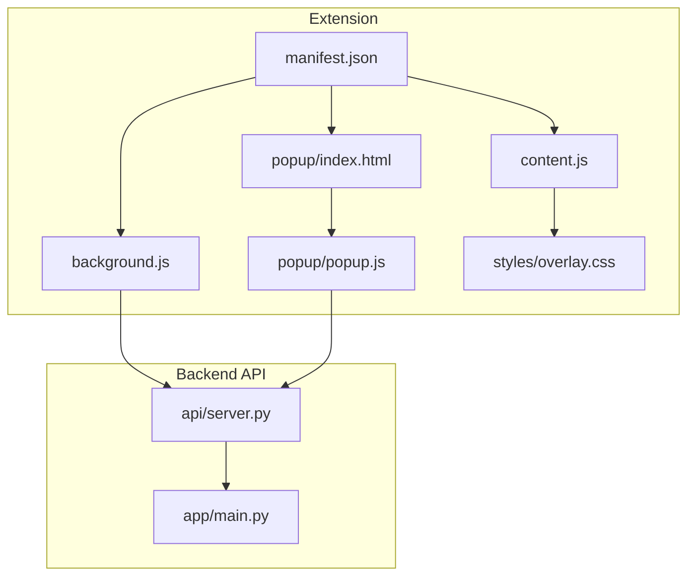
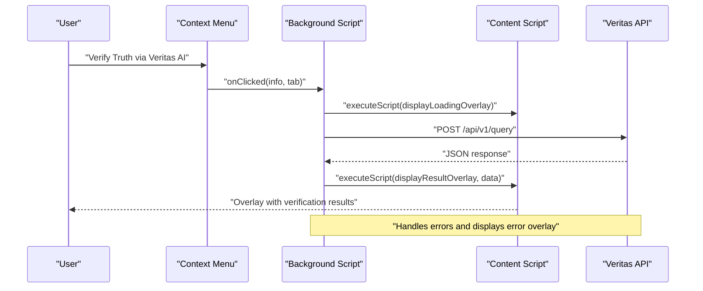
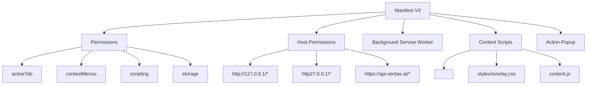
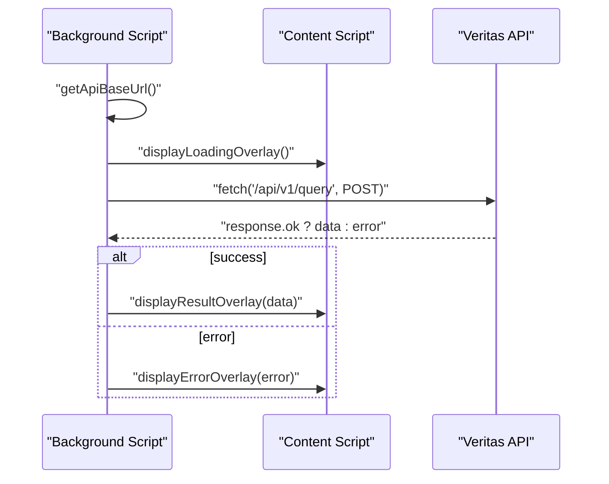
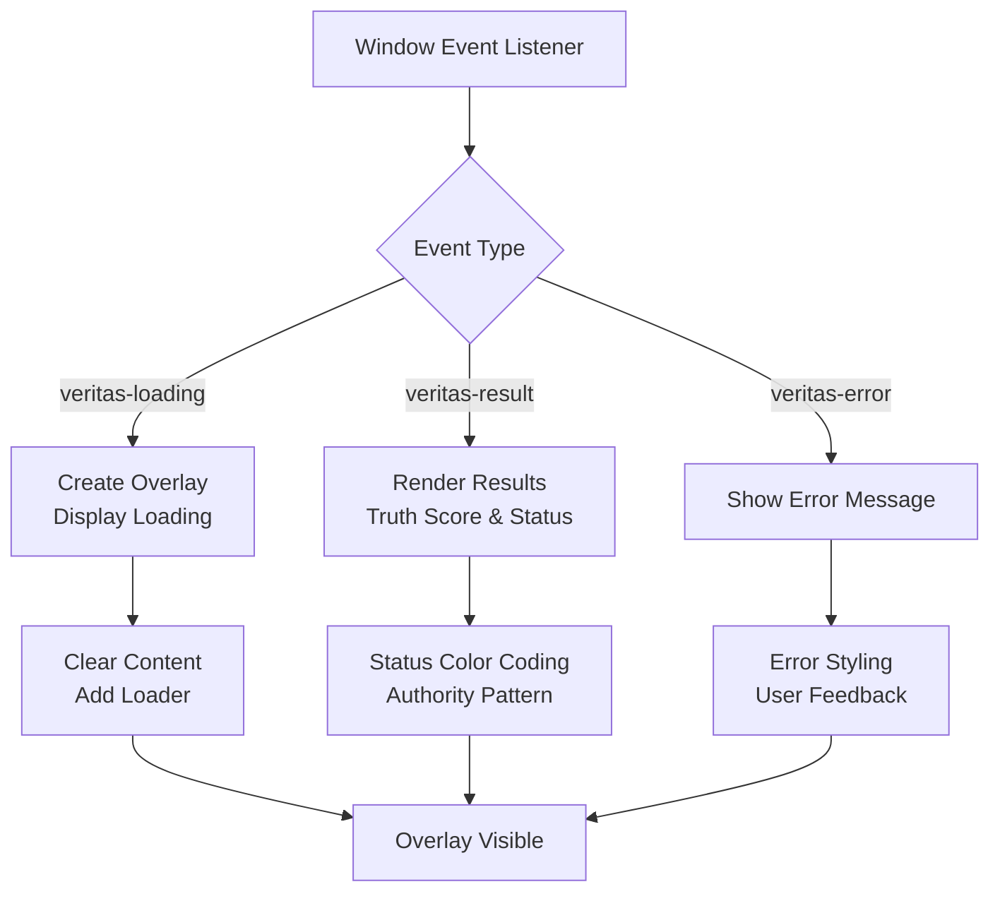
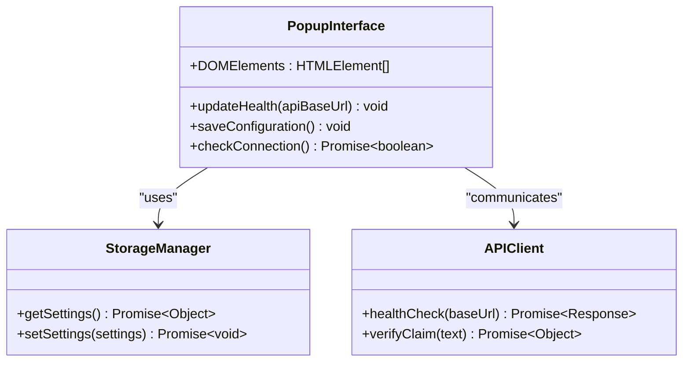
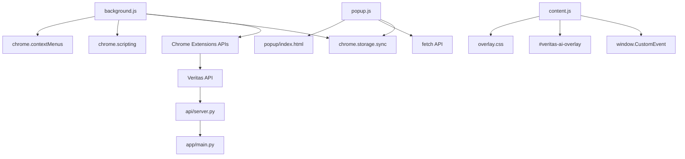

# Chrome Extension Interface

<cite>
**Referenced Files in This Document**
- [manifest.json](file://veritas-ai/extension/manifest.json)
- [background.js](file://veritas-ai/extension/background.js)
- [content.js](file://veritas-ai/extension/content.js)
- [index.html](file://veritas-ai/extension/popup/index.html)
- [popup.js](file://veritas-ai/extension/popup/popup.js)
- [overlay.css](file://veritas-ai/extension/styles/overlay.css)
- [server.py](file://veritas-ai/api/server.py)
- [main.py](file://veritas-ai/app/main.py)
- [README.md](file://veritas-ai/README.md)
</cite>

## Table of Contents
1. [Introduction](#introduction)
2. [Project Structure](#project-structure)
3. [Core Components](#core-components)
4. [Architecture Overview](#architecture-overview)
5. [Detailed Component Analysis](#detailed-component-analysis)
6. [Dependency Analysis](#dependency-analysis)
7. [Performance Considerations](#performance-considerations)
8. [Security Considerations](#security-considerations)
9. [Installation and Compatibility](#installation-and-compatibility)
10. [Troubleshooting Guide](#troubleshooting-guide)
11. [Conclusion](#conclusion)

## Introduction
This document provides comprehensive technical documentation for the Chrome extension interface of Veritas AI, focusing on browser integration and contextual truth verification. The extension enables users to verify claims from any highlighted text on web pages through a secure, non-intrusive overlay system. It consists of three primary components:
- Background script for persistent service management and context menu integration
- Content script for page interaction and overlay rendering
- Popup interface for direct user access and configuration

The extension communicates with the Veritas AI backend via a secure API, supporting both local development and remote deployment environments.

## Project Structure
The extension is organized under the `veritas-ai/extension/` directory with clear separation of concerns:
- Manifest configuration defines permissions, background service worker, content scripts, and UI components
- Background script manages context menus, API communication, and overlay injection
- Content script handles overlay lifecycle, styling, and user interactions
- Popup interface provides configuration and health monitoring
- Overlay CSS ensures consistent, non-intrusive presentation

**Diagram sources**
- [manifest.json:1-32](file://veritas-ai/extension/manifest.json#L1-L32)
- [background.js:1-67](file://veritas-ai/extension/background.js#L1-L67)
- [content.js:1-137](file://veritas-ai/extension/content.js#L1-L137)
- [index.html:1-52](file://veritas-ai/extension/popup/index.html#L1-L52)
- [popup.js:1-37](file://veritas-ai/extension/popup/popup.js#L1-L37)
- [overlay.css:1-58](file://veritas-ai/extension/styles/overlay.css#L1-L58)
- [server.py:81-94](file://veritas-ai/api/server.py#L81-L94)
- [main.py:106-111](file://veritas-ai/app/main.py#L106-L111)

**Section sources**
- [manifest.json:1-32](file://veritas-ai/extension/manifest.json#L1-L32)
- [README.md:87-92](file://veritas-ai/README.md#L87-L92)

## Core Components
This section details the three core components of the extension and their responsibilities.

### Background Script
The background script serves as the persistent service manager for the extension:
- Creates and manages the context menu for text selection verification
- Handles API communication with the Veritas AI backend
- Injects overlay control functions into web pages via content scripts
- Manages user configuration storage and retrieval

Key responsibilities include:
- Context menu creation and click handling
- API base URL configuration management
- Overlay control injection using Chrome scripting APIs
- Error handling and user feedback through overlay displays

### Content Script
The content script manages the overlay system for displaying truth verification results:
- Creates and manages the overlay element with close functionality
- Renders loading states, verification results, and error messages
- Applies dynamic styling based on verification outcomes
- Provides non-intrusive positioning and animations

The script implements a modular overlay system with distinct states for loading, success, and error scenarios.

### Popup Interface
The popup interface provides direct user access and configuration:
- Configuration form for API base URL with validation
- Connection status monitoring with visual indicators
- Health checks against the backend API
- Persistent storage of user preferences

**Section sources**
- [background.js:1-67](file://veritas-ai/extension/background.js#L1-L67)
- [content.js:1-137](file://veritas-ai/extension/content.js#L1-L137)
- [index.html:1-52](file://veritas-ai/extension/popup/index.html#L1-L52)
- [popup.js:1-37](file://veritas-ai/extension/popup/popup.js#L1-L37)

## Architecture Overview
The extension follows a distributed architecture with clear separation of concerns:

**Diagram sources**
- [background.js:16-53](file://veritas-ai/extension/background.js#L16-L53)
- [content.js:46-128](file://veritas-ai/extension/content.js#L46-L128)
- [server.py:81-85](file://veritas-ai/api/server.py#L81-L85)

The architecture ensures secure communication through:
- Manifest-defined permissions and host permissions
- Content script isolation boundaries
- Cross-origin communication via controlled API endpoints
- User-controlled configuration storage

## Detailed Component Analysis

### Manifest Configuration
The manifest defines the extension's capabilities and integration points:
- Manifest version 3 for modern Chrome support
- Permissions: activeTab, contextMenus, scripting, storage
- Host permissions: localhost, 127.0.0.1, and production API domains
- Background service worker for persistent operation
- Content scripts for all URLs with overlay CSS
- Action button with popup interface

**Diagram sources**
- [manifest.json:6-31](file://veritas-ai/extension/manifest.json#L6-L31)

**Section sources**
- [manifest.json:1-32](file://veritas-ai/extension/manifest.json#L1-L32)

### Background Script Implementation
The background script implements the core verification workflow:

**Diagram sources**
- [background.js:16-53](file://veritas-ai/extension/background.js#L16-L53)

Key implementation patterns include:
- Asynchronous API communication with error handling
- Dynamic overlay control injection via Chrome scripting
- Configuration management using Chrome storage sync
- Event-driven architecture for context menu interactions

**Section sources**
- [background.js:1-67](file://veritas-ai/extension/background.js#L1-L67)

### Content Script Overlay System
The content script manages the overlay lifecycle and rendering:

**Diagram sources**
- [content.js:46-136](file://veritas-ai/extension/content.js#L46-L136)

Overlay features include:
- Non-intrusive positioning (fixed top-right corner)
- Backdrop blur effects and glass-morphism styling
- Animated entrance transitions
- Close button functionality
- Responsive typography and spacing

**Section sources**
- [content.js:1-137](file://veritas-ai/extension/content.js#L1-L137)
- [overlay.css:1-58](file://veritas-ai/extension/styles/overlay.css#L1-L58)

### Popup Interface Design
The popup interface provides user configuration and health monitoring:

**Diagram sources**
- [index.html:1-52](file://veritas-ai/extension/popup/index.html#L1-L52)
- [popup.js:1-37](file://veritas-ai/extension/popup/popup.js#L1-L37)

**Section sources**
- [index.html:1-52](file://veritas-ai/extension/popup/index.html#L1-L52)
- [popup.js:1-37](file://veritas-ai/extension/popup/popup.js#L1-L37)

## Dependency Analysis
The extension components have well-defined dependencies and minimal coupling:

**Diagram sources**
- [background.js:16-53](file://veritas-ai/extension/background.js#L16-L53)
- [content.js:46-136](file://veritas-ai/extension/content.js#L46-L136)
- [popup.js:9-23](file://veritas-ai/extension/popup/popup.js#L9-L23)
- [server.py:81-94](file://veritas-ai/api/server.py#L81-L94)
- [main.py:106-111](file://veritas-ai/app/main.py#L106-L111)

**Section sources**
- [background.js:1-67](file://veritas-ai/extension/background.js#L1-L67)
- [content.js:1-137](file://veritas-ai/extension/content.js#L1-L137)
- [popup.js:1-37](file://veritas-ai/extension/popup/popup.js#L1-L37)

## Performance Considerations
The extension is designed for optimal performance and user experience:

- Overlay rendering uses efficient DOM manipulation with minimal reflows
- Content script implements lazy overlay creation to avoid unnecessary DOM nodes
- Background script uses asynchronous operations to prevent UI blocking
- CSS animations utilize hardware acceleration for smooth transitions
- API calls implement rate limiting and error handling to prevent cascading failures

## Security Considerations
The extension implements multiple security measures:

### Content Script Isolation
- Content scripts operate in isolated contexts separate from page scripts
- Access to page DOM is restricted to overlay manipulation
- No direct access to page variables or functions

### Cross-Origin Communication
- Controlled host permissions for localhost and production domains
- HTTPS enforcement for production API endpoints
- CORS configuration in backend API for trusted origins

### User Permission Management
- Explicit permissions declared in manifest
- User consent required for tab access and storage
- Configuration stored locally using Chrome storage sync

### API Security
- Backend implements rate limiting and request timeouts
- Health checks prevent connection to unresponsive endpoints
- Error handling prevents information leakage

**Section sources**
- [manifest.json:6-16](file://veritas-ai/extension/manifest.json#L6-L16)
- [background.js:25-35](file://veritas-ai/extension/background.js#L25-L35)
- [main.py:116-123](file://veritas-ai/app/main.py#L116-L123)

## Installation and Compatibility
The extension supports modern Chrome versions and provides straightforward installation:

### Installation Steps
1. Open `chrome://extensions/` in Chrome
2. Enable **Developer Mode**
3. Click **Load unpacked** and select the `veritas-ai/extension/` folder
4. Verify the extension appears in the extensions bar

### Compatibility Requirements
- Chrome 88+ for Manifest V3 support
- Modern CSS features for overlay styling
- Web API support for Custom Events and fetch

### Update Mechanisms
- Manual updates via developer mode reload
- Version 1.0 currently deployed
- Future updates will maintain backward compatibility

**Section sources**
- [README.md:87-92](file://veritas-ai/README.md#L87-L92)
- [manifest.json:2](file://veritas-ai/extension/manifest.json#L2)

## Troubleshooting Guide
Common issues and solutions:

### Extension Not Loading
- Verify Developer Mode is enabled in chrome://extensions/
- Check for console errors in the background script
- Ensure manifest.json is valid and located in extension root

### Verification Failing
- Check API base URL configuration in popup
- Verify backend service is running on specified port
- Review network tab for CORS or timeout errors

### Overlay Not Appearing
- Confirm content script is injected on target pages
- Check overlay CSS is loaded and not blocked
- Verify no conflicting CSS styles on target pages

### Context Menu Issues
- Restart Chrome to refresh context menu registration
- Check context menu permissions in extension settings
- Verify text selection triggers context menu properly

**Section sources**
- [popup.js:9-23](file://veritas-ai/extension/popup/popup.js#L9-L23)
- [content.js:25-44](file://veritas-ai/extension/content.js#L25-L44)
- [background.js:8-14](file://veritas-ai/extension/background.js#L8-L14)

## Conclusion
The Veritas AI Chrome extension provides a robust, secure, and user-friendly interface for contextual truth verification. Its architecture balances performance with security through:
- Clear separation of concerns across background, content, and popup components
- Secure communication channels with proper permission management
- Non-intrusive overlay system with consistent styling
- Comprehensive error handling and user feedback mechanisms

The extension successfully integrates with the broader Veritas AI ecosystem while maintaining independence and reliability as a standalone browser tool.