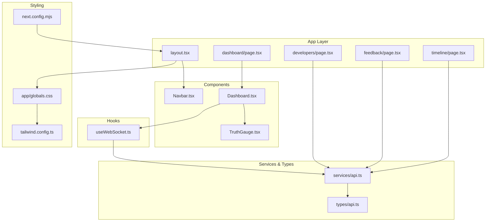
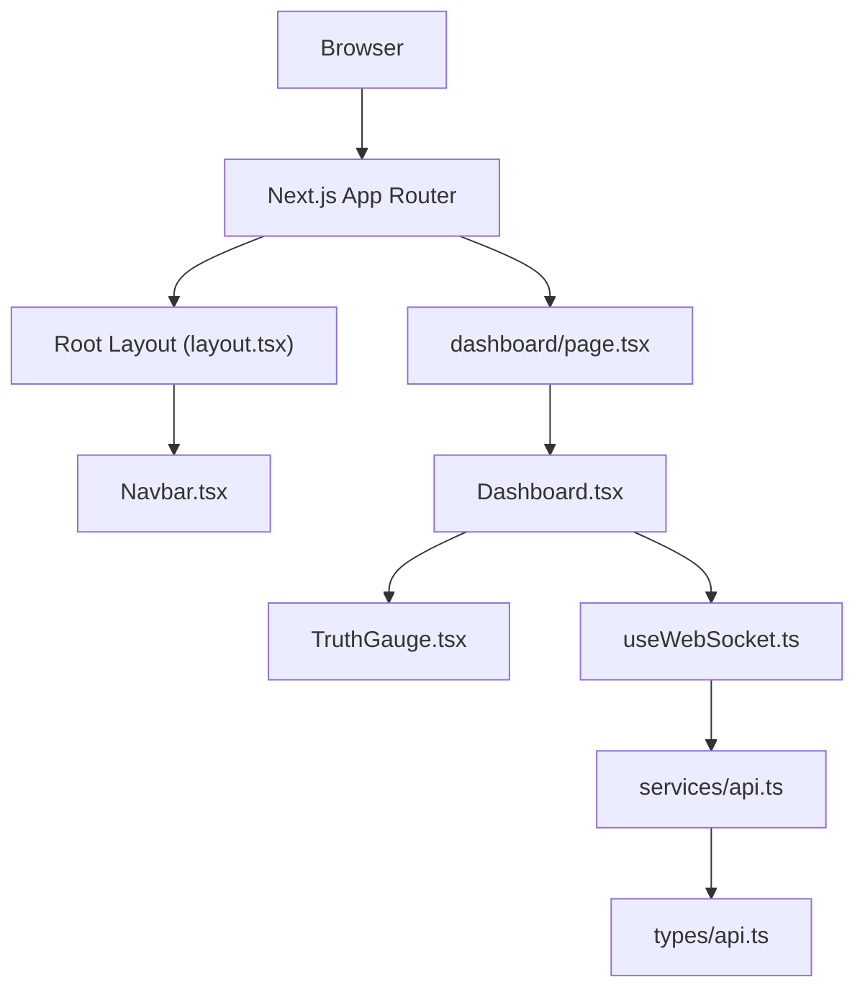
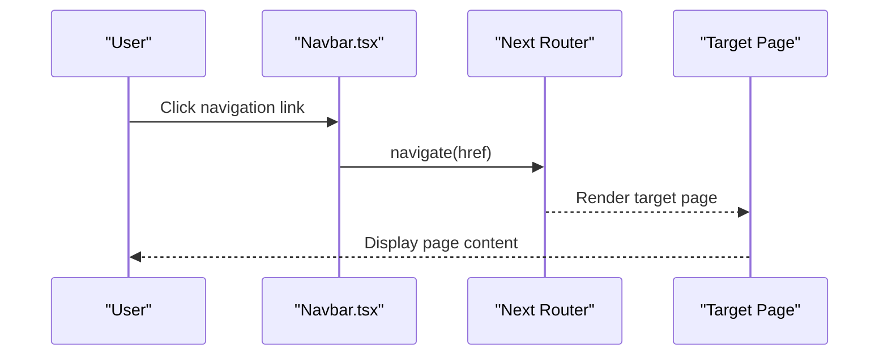
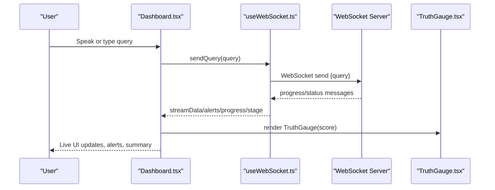
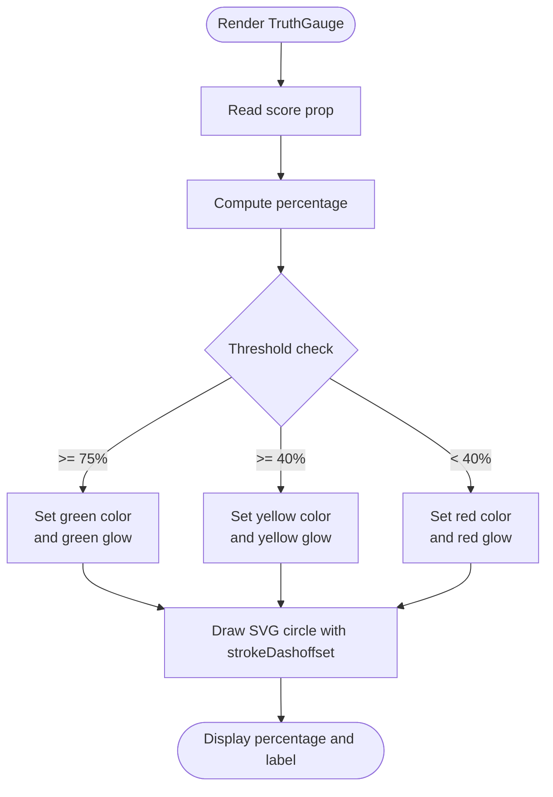
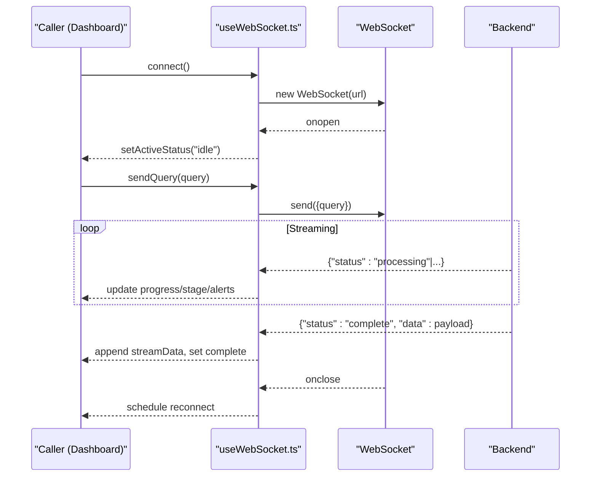
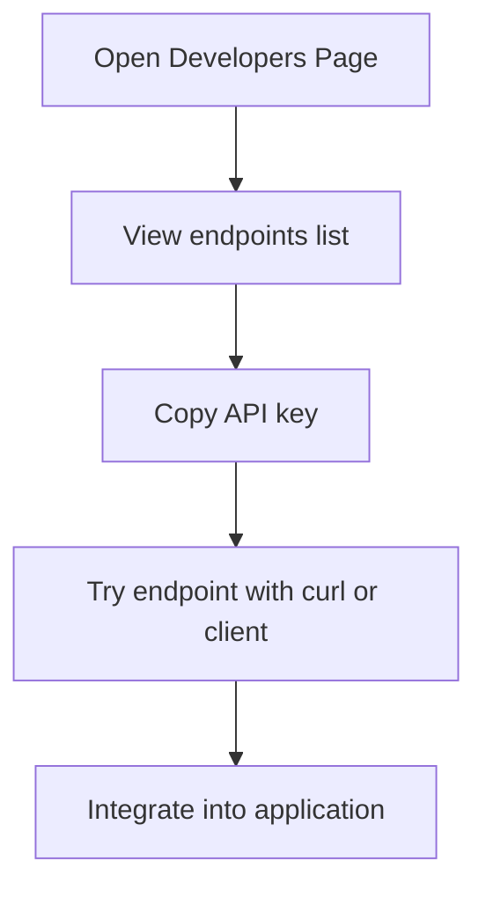
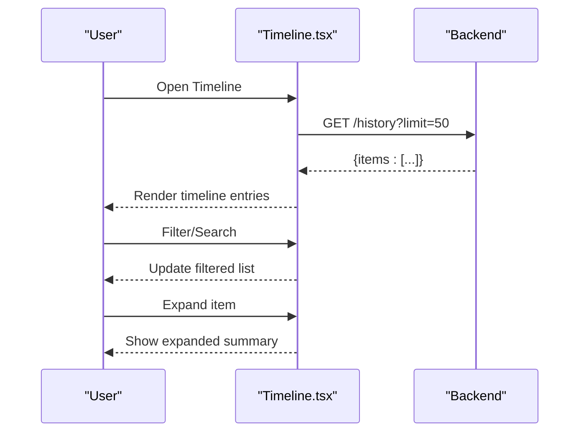
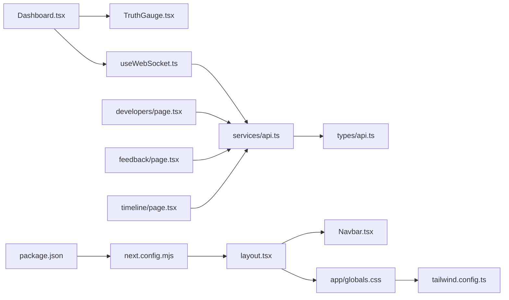

# Dashboard Application

<cite>
**Referenced Files in This Document**
- [layout.tsx](file://veritas-ai/frontend/app/layout.tsx)
- [page.tsx (Dashboard)](file://veritas-ai/frontend/app/dashboard/page.tsx)
- [Dashboard.tsx](file://veritas-ai/frontend/components/Dashboard.tsx)
- [TruthGauge.tsx](file://veritas-ai/frontend/components/TruthGauge.tsx)
- [useWebSocket.ts](file://veritas-ai/frontend/hooks/useWebSocket.ts)
- [page.tsx (Developers)](file://veritas-ai/frontend/app/developers/page.tsx)
- [page.tsx (Feedback)](file://veritas-ai/frontend/app/feedback/page.tsx)
- [page.tsx (Timeline)](file://veritas-ai/frontend/app/timeline/page.tsx)
- [Navbar.tsx](file://veritas-ai/frontend/components/Navbar.tsx)
- [api.ts](file://veritas-ai/frontend/services/api.ts)
- [api.ts (types)](file://veritas-ai/frontend/types/api.ts)
- [globals.css](file://veritas-ai/frontend/app/globals.css)
- [next.config.mjs](file://veritas-ai/frontend/next.config.mjs)
- [tailwind.config.ts](file://veritas-ai/frontend/tailwind.config.ts)
- [package.json](file://veritas-ai/frontend/package.json)
</cite>

## Table of Contents
1. [Introduction](#introduction)
2. [Project Structure](#project-structure)
3. [Core Components](#core-components)
4. [Architecture Overview](#architecture-overview)
5. [Detailed Component Analysis](#detailed-component-analysis)
6. [Dependency Analysis](#dependency-analysis)
7. [Performance Considerations](#performance-considerations)
8. [Troubleshooting Guide](#troubleshooting-guide)
9. [Conclusion](#conclusion)
10. [Appendices](#appendices)

## Introduction
This document describes the Next.js dashboard application for the Veritas AI platform. It focuses on the main dashboard interface and specialized pages, covering the global layout and navigation, real-time truth scoring visualization, claim analysis interface, trend monitoring displays, the TruthGauge component, WebSocket integration via a custom hook, and the developers, feedback, and timeline pages. It also documents responsive design patterns, grid layouts, and component composition strategies used across the dashboard ecosystem.

## Project Structure
The dashboard is a Next.js application with a strict file-per-page structure under the app directory, shared components in components/, reusable hooks in hooks/, typed API contracts in types/, and service utilities in services/. Tailwind CSS provides styling and glassmorphism effects, while TypeScript ensures type safety.

**Diagram sources**
- [layout.tsx:1-25](file://veritas-ai/frontend/app/layout.tsx#L1-L25)
- [page.tsx (Dashboard):1-17](file://veritas-ai/frontend/app/dashboard/page.tsx#L1-L17)
- [page.tsx (Developers):1-153](file://veritas-ai/frontend/app/developers/page.tsx#L1-L153)
- [page.tsx (Feedback):1-175](file://veritas-ai/frontend/app/feedback/page.tsx#L1-L175)
- [page.tsx (Timeline):1-128](file://veritas-ai/frontend/app/timeline/page.tsx#L1-L128)
- [Navbar.tsx:1-52](file://veritas-ai/frontend/components/Navbar.tsx#L1-L52)
- [Dashboard.tsx:1-312](file://veritas-ai/frontend/components/Dashboard.tsx#L1-L312)
- [TruthGauge.tsx:1-52](file://veritas-ai/frontend/components/TruthGauge.tsx#L1-L52)
- [useWebSocket.ts:1-143](file://veritas-ai/frontend/hooks/useWebSocket.ts#L1-L143)
- [api.ts:1-32](file://veritas-ai/frontend/services/api.ts#L1-L32)
- [api.ts (types):1-66](file://veritas-ai/frontend/types/api.ts#L1-L66)
- [globals.css:1-85](file://veritas-ai/frontend/app/globals.css#L1-L85)
- [tailwind.config.ts:1-24](file://veritas-ai/frontend/tailwind.config.ts#L1-L24)
- [next.config.mjs:1-8](file://veritas-ai/frontend/next.config.mjs#L1-L8)

**Section sources**
- [layout.tsx:1-25](file://veritas-ai/frontend/app/layout.tsx#L1-L25)
- [globals.css:1-85](file://veritas-ai/frontend/app/globals.css#L1-L85)
- [tailwind.config.ts:1-24](file://veritas-ai/frontend/tailwind.config.ts#L1-L24)
- [next.config.mjs:1-8](file://veritas-ai/frontend/next.config.mjs#L1-L8)
- [package.json:1-27](file://veritas-ai/frontend/package.json#L1-L27)

## Core Components
- Global Layout and Navigation: The root layout defines the HTML shell, global CSS, and embeds the fixed navbar. The navbar provides navigation across dashboard, timeline, feedback, and developers pages.
- Dashboard Page: Renders the main interactive interface for claim analysis with voice input, real-time progress, alerts, and truth visualization.
- TruthGauge: A reusable SVG-based gauge that visualizes truth scores with color-coded confidence thresholds.
- WebSocket Hook: Provides real-time streaming via WebSocket, managing connection lifecycle, reconnection, and state for progress, alerts, and results.
- Specialized Pages: Developers page for API reference and pricing, Feedback page for user insights, Timeline page for historical analysis.

**Section sources**
- [layout.tsx:1-25](file://veritas-ai/frontend/app/layout.tsx#L1-L25)
- [Navbar.tsx:1-52](file://veritas-ai/frontend/components/Navbar.tsx#L1-L52)
- [page.tsx (Dashboard):1-17](file://veritas-ai/frontend/app/dashboard/page.tsx#L1-L17)
- [Dashboard.tsx:1-312](file://veritas-ai/frontend/components/Dashboard.tsx#L1-L312)
- [TruthGauge.tsx:1-52](file://veritas-ai/frontend/components/TruthGauge.tsx#L1-L52)
- [useWebSocket.ts:1-143](file://veritas-ai/frontend/hooks/useWebSocket.ts#L1-L143)
- [page.tsx (Developers):1-153](file://veritas-ai/frontend/app/developers/page.tsx#L1-L153)
- [page.tsx (Feedback):1-175](file://veritas-ai/frontend/app/feedback/page.tsx#L1-L175)
- [page.tsx (Timeline):1-128](file://veritas-ai/frontend/app/timeline/page.tsx#L1-L128)

## Architecture Overview
The dashboard follows a layered architecture:
- Presentation Layer: Next.js app directory pages and shared components.
- Domain Layer: Dashboard logic orchestrates WebSocket messages, speech recognition, and voice synthesis.
- Integration Layer: Services encapsulate API base URLs and helpers; types define contracts for WebSocket and HTTP payloads.
- Infrastructure: Tailwind CSS for styling, Next.js runtime, and browser APIs (WebSocket, SpeechRecognition, SpeechSynthesis).

**Diagram sources**
- [layout.tsx:1-25](file://veritas-ai/frontend/app/layout.tsx#L1-L25)
- [Navbar.tsx:1-52](file://veritas-ai/frontend/components/Navbar.tsx#L1-L52)
- [page.tsx (Dashboard):1-17](file://veritas-ai/frontend/app/dashboard/page.tsx#L1-L17)
- [Dashboard.tsx:1-312](file://veritas-ai/frontend/components/Dashboard.tsx#L1-L312)
- [TruthGauge.tsx:1-52](file://veritas-ai/frontend/components/TruthGauge.tsx#L1-L52)
- [useWebSocket.ts:1-143](file://veritas-ai/frontend/hooks/useWebSocket.ts#L1-L143)
- [api.ts:1-32](file://veritas-ai/frontend/services/api.ts#L1-L32)
- [api.ts (types):1-66](file://veritas-ai/frontend/types/api.ts#L1-L66)

## Detailed Component Analysis

### Layout and Navigation
- Root layout sets metadata, global CSS, and renders the Navbar and page content inside a grid-pattern background.
- Navbar provides a fixed top bar with links to Home, Intelligence (dashboard), Timeline, Feedback, and API (developers), highlighting the active route.

**Diagram sources**
- [layout.tsx:1-25](file://veritas-ai/frontend/app/layout.tsx#L1-L25)
- [Navbar.tsx:1-52](file://veritas-ai/frontend/components/Navbar.tsx#L1-L52)

**Section sources**
- [layout.tsx:1-25](file://veritas-ai/frontend/app/layout.tsx#L1-L25)
- [Navbar.tsx:1-52](file://veritas-ai/frontend/components/Navbar.tsx#L1-L52)

### Dashboard Page and Claim Analysis Interface
- The dashboard page wraps the Dashboard component with a centered container and a title area.
- Dashboard orchestrates:
  - Voice input via Web Speech Recognition (continuous, interim results).
  - Manual text input with Enter-to-execute.
  - Real-time progress bar and stage indicators driven by WebSocket messages.
  - Alerts display for anomalies.
  - Truth visualization using TruthGauge and confidence breakdown cards.
  - Summary rendering and “Why True/False” explanations.

**Diagram sources**
- [page.tsx (Dashboard):1-17](file://veritas-ai/frontend/app/dashboard/page.tsx#L1-L17)
- [Dashboard.tsx:1-312](file://veritas-ai/frontend/components/Dashboard.tsx#L1-L312)
- [useWebSocket.ts:1-143](file://veritas-ai/frontend/hooks/useWebSocket.ts#L1-L143)
- [TruthGauge.tsx:1-52](file://veritas-ai/frontend/components/TruthGauge.tsx#L1-L52)

**Section sources**
- [page.tsx (Dashboard):1-17](file://veritas-ai/frontend/app/dashboard/page.tsx#L1-L17)
- [Dashboard.tsx:1-312](file://veritas-ai/frontend/components/Dashboard.tsx#L1-L312)

### TruthGauge Component
- Renders a circular SVG gauge representing the truth score percentage.
- Color transitions based on thresholds:
  - Green for high confidence.
  - Yellow for moderate confidence.
  - Red for low confidence.
- Uses animated stroke dashoffset to visualize progress and applies drop shadows for a glowing effect.

**Diagram sources**
- [TruthGauge.tsx:1-52](file://veritas-ai/frontend/components/TruthGauge.tsx#L1-L52)

**Section sources**
- [TruthGauge.tsx:1-52](file://veritas-ai/frontend/components/TruthGauge.tsx#L1-L52)

### WebSocket Integration via useWebSocket Hook
- Establishes and manages a WebSocket connection to the backend streaming endpoint.
- Handles:
  - Connection open/close/reconnect with exponential backoff.
  - Parsing incoming messages and routing to appropriate state:
    - Processing stages and progress.
    - Complete results.
    - Alerts.
    - Errors.
  - Sending queries and resetting state before transmission.
- Exposes streamData, alerts, activeStatus, error, progress, currentStage, and sendQuery to consumers.

**Diagram sources**
- [useWebSocket.ts:1-143](file://veritas-ai/frontend/hooks/useWebSocket.ts#L1-L143)
- [api.ts:1-32](file://veritas-ai/frontend/services/api.ts#L1-L32)
- [api.ts (types):56-66](file://veritas-ai/frontend/types/api.ts#L56-L66)

**Section sources**
- [useWebSocket.ts:1-143](file://veritas-ai/frontend/hooks/useWebSocket.ts#L1-L143)
- [api.ts:1-32](file://veritas-ai/frontend/services/api.ts#L1-L32)
- [api.ts (types):56-66](file://veritas-ai/frontend/types/api.ts#L56-L66)

### Developers Page (API Integration)
- Presents API endpoints, authentication requirements, and example payloads.
- Includes a pricing tiers section and a quick start curl example.
- Uses API base URL from services/api.ts.

**Diagram sources**
- [page.tsx (Developers):1-153](file://veritas-ai/frontend/app/developers/page.tsx#L1-L153)
- [api.ts:18-19](file://veritas-ai/frontend/services/api.ts#L18-L19)

**Section sources**
- [page.tsx (Developers):1-153](file://veritas-ai/frontend/app/developers/page.tsx#L1-L153)
- [api.ts:1-32](file://veritas-ai/frontend/services/api.ts#L1-L32)

### Feedback Page (User Insights)
- Collects user feedback on verification results with original query, original score, user flag, optional corrected score, and comments.
- Submits to the backend feedback endpoint and shows a success state.

**Diagram sources**
- [page.tsx (Feedback):1-175](file://veritas-ai/frontend/app/feedback/page.tsx#L1-L175)
- [api.ts:18-19](file://veritas-ai/frontend/services/api.ts#L18-L19)

**Section sources**
- [page.tsx (Feedback):1-175](file://veritas-ai/frontend/app/feedback/page.tsx#L1-L175)
- [api.ts:1-32](file://veritas-ai/frontend/services/api.ts#L1-L32)

### Timeline Page (Historical Analysis)
- Loads historical verification entries from the backend and displays them in a vertical timeline.
- Supports filtering by query text and expanding entries to show summaries.
- Uses status-specific styling and percent formatting.

**Diagram sources**
- [page.tsx (Timeline):1-128](file://veritas-ai/frontend/app/timeline/page.tsx#L1-L128)
- [api.ts:18-19](file://veritas-ai/frontend/services/api.ts#L18-L19)
- [api.ts (types):42-54](file://veritas-ai/frontend/types/api.ts#L42-L54)

**Section sources**
- [page.tsx (Timeline):1-128](file://veritas-ai/frontend/app/timeline/page.tsx#L1-L128)
- [api.ts:1-32](file://veritas-ai/frontend/services/api.ts#L1-L32)
- [api.ts (types):42-54](file://veritas-ai/frontend/types/api.ts#L42-L54)

## Dependency Analysis
- Component Coupling:
  - Dashboard depends on TruthGauge, useWebSocket, and browser speech APIs.
  - useWebSocket depends on services/api.ts for WebSocket URL and types/api.ts for message contracts.
  - Pages depend on services/api.ts for API base URL and types for typing.
- Styling Cohesion:
  - globals.css centralizes theme tokens, glassmorphism, gradients, ambient glows, grid pattern, and animations.
  - tailwind.config.ts extends color palette aligned with the theme.
- Build and Runtime:
  - next.config.mjs configures standalone output and disables strict mode.
  - package.json lists Next.js, React, Tailwind, Lucide icons, and Recharts.

**Diagram sources**
- [Dashboard.tsx:1-312](file://veritas-ai/frontend/components/Dashboard.tsx#L1-L312)
- [TruthGauge.tsx:1-52](file://veritas-ai/frontend/components/TruthGauge.tsx#L1-L52)
- [useWebSocket.ts:1-143](file://veritas-ai/frontend/hooks/useWebSocket.ts#L1-L143)
- [api.ts:1-32](file://veritas-ai/frontend/services/api.ts#L1-L32)
- [api.ts (types):1-66](file://veritas-ai/frontend/types/api.ts#L1-L66)
- [layout.tsx:1-25](file://veritas-ai/frontend/app/layout.tsx#L1-L25)
- [Navbar.tsx:1-52](file://veritas-ai/frontend/components/Navbar.tsx#L1-L52)
- [page.tsx (Developers):1-153](file://veritas-ai/frontend/app/developers/page.tsx#L1-L153)
- [page.tsx (Feedback):1-175](file://veritas-ai/frontend/app/feedback/page.tsx#L1-L175)
- [page.tsx (Timeline):1-128](file://veritas-ai/frontend/app/timeline/page.tsx#L1-L128)
- [globals.css:1-85](file://veritas-ai/frontend/app/globals.css#L1-L85)
- [tailwind.config.ts:1-24](file://veritas-ai/frontend/tailwind.config.ts#L1-L24)
- [next.config.mjs:1-8](file://veritas-ai/frontend/next.config.mjs#L1-L8)
- [package.json:1-27](file://veritas-ai/frontend/package.json#L1-L27)

**Section sources**
- [Dashboard.tsx:1-312](file://veritas-ai/frontend/components/Dashboard.tsx#L1-L312)
- [useWebSocket.ts:1-143](file://veritas-ai/frontend/hooks/useWebSocket.ts#L1-L143)
- [api.ts:1-32](file://veritas-ai/frontend/services/api.ts#L1-L32)
- [api.ts (types):1-66](file://veritas-ai/frontend/types/api.ts#L1-L66)
- [globals.css:1-85](file://veritas-ai/frontend/app/globals.css#L1-L85)
- [tailwind.config.ts:1-24](file://veritas-ai/frontend/tailwind.config.ts#L1-L24)
- [next.config.mjs:1-8](file://veritas-ai/frontend/next.config.mjs#L1-L8)
- [package.json:1-27](file://veritas-ai/frontend/package.json#L1-L27)

## Performance Considerations
- WebSocket Efficiency:
  - Reconnection with exponential backoff prevents resource thrashing on transient failures.
  - Resetting state before sending queries avoids stale UI updates.
- Rendering Optimizations:
  - TruthGauge uses SVG and minimal DOM updates; consider memoizing props if reused frequently.
  - Dashboard batches UI updates from WebSocket messages; avoid unnecessary re-renders by keeping payloads normalized.
- Network Resilience:
  - API base URL normalization and protocol detection ensure compatibility across environments.
- Styling:
  - Glassmorphism and backdrop filters are visually intensive; ensure GPU acceleration is available and avoid excessive blur on lower-end devices.

[No sources needed since this section provides general guidance]

## Troubleshooting Guide
- WebSocket Not Connecting:
  - Verify WS_BASE_URL resolves to the correct backend address and scheme (ws/wss).
  - Check for CORS and reverse proxy configuration on the backend.
- No Real-Time Updates:
  - Confirm the backend emits processing, complete, and alert messages with correct status fields.
  - Inspect browser console for JSON parse errors or onclose/onerror events.
- Voice Recognition Issues:
  - Ensure SpeechRecognition is available and enabled; handle fallbacks gracefully.
  - Check microphone permissions and device availability.
- Timeline Loading Errors:
  - Validate /history endpoint availability and response shape match HistoryResponse.
- Styling Glitches:
  - Confirm Tailwind content paths include components and app directories.
  - Ensure globals.css is imported in layout.tsx and theme colors align with tailwind.config.ts.

**Section sources**
- [useWebSocket.ts:1-143](file://veritas-ai/frontend/hooks/useWebSocket.ts#L1-L143)
- [api.ts:1-32](file://veritas-ai/frontend/services/api.ts#L1-L32)
- [page.tsx (Timeline):1-128](file://veritas-ai/frontend/app/timeline/page.tsx#L1-L128)
- [globals.css:1-85](file://veritas-ai/frontend/app/globals.css#L1-L85)
- [tailwind.config.ts:1-24](file://veritas-ai/frontend/tailwind.config.ts#L1-L24)

## Conclusion
The dashboard integrates a modern, responsive UI with real-time streaming, voice-enabled interaction, and comprehensive truth visualization. The modular component architecture, centralized services, and robust WebSocket handling enable scalable development and maintenance. Specialized pages for developers, feedback, and timeline complement the core dashboard, delivering a complete analytical and integrative platform.

[No sources needed since this section summarizes without analyzing specific files]

## Appendices

### Responsive Design Patterns and Grid Layouts
- Container Utilities:
  - Centered containers with max-width and horizontal padding for readability.
  - Grid layouts adapt from single-column on small screens to multi-column on larger screens (e.g., confidence breakdown cards).
- Typography and Spacing:
  - Consistent use of font weights and spacing tokens for visual hierarchy.
- Interactive Elements:
  - Hover and active states with subtle transitions and glow effects.
- Animations:
  - Fade-in and slide-in animations for content appearance.

**Section sources**
- [Dashboard.tsx:228-310](file://veritas-ai/frontend/components/Dashboard.tsx#L228-L310)
- [page.tsx (Developers):113-135](file://veritas-ai/frontend/app/developers/page.tsx#L113-L135)
- [page.tsx (Timeline):77-124](file://veritas-ai/frontend/app/timeline/page.tsx#L77-L124)
- [globals.css:1-85](file://veritas-ai/frontend/app/globals.css#L1-L85)

### Component Composition Strategies
- Orchestration:
  - Dashboard composes TruthGauge, useWebSocket, and browser APIs to deliver a cohesive experience.
- Reusability:
  - TruthGauge is self-contained and reusable across pages.
- Type Safety:
  - Strongly typed WebSocketMessage and QueryResponse reduce runtime errors.
- Styling Consistency:
  - Shared CSS utilities (glass, gradient-text, ambient-glow) unify the look and feel.

**Section sources**
- [Dashboard.tsx:1-312](file://veritas-ai/frontend/components/Dashboard.tsx#L1-L312)
- [TruthGauge.tsx:1-52](file://veritas-ai/frontend/components/TruthGauge.tsx#L1-L52)
- [api.ts (types):56-66](file://veritas-ai/frontend/types/api.ts#L56-L66)
- [globals.css:20-34](file://veritas-ai/frontend/app/globals.css#L20-L34)