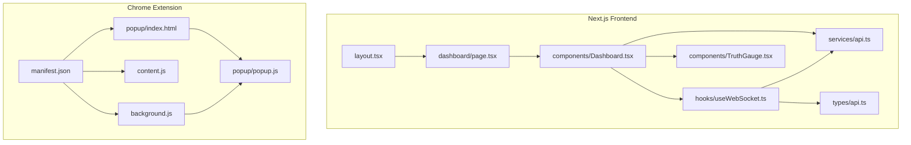
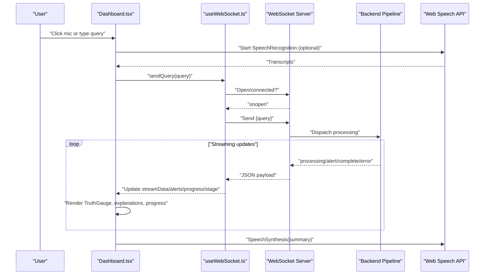
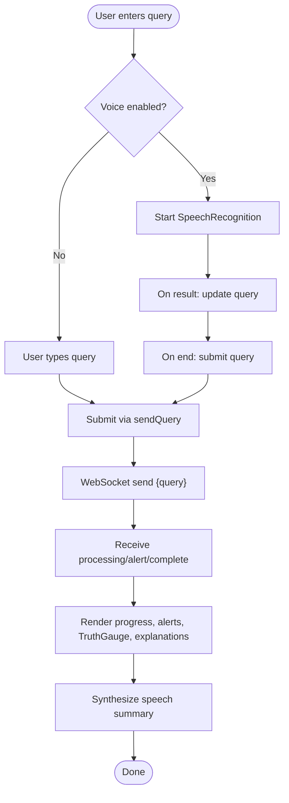
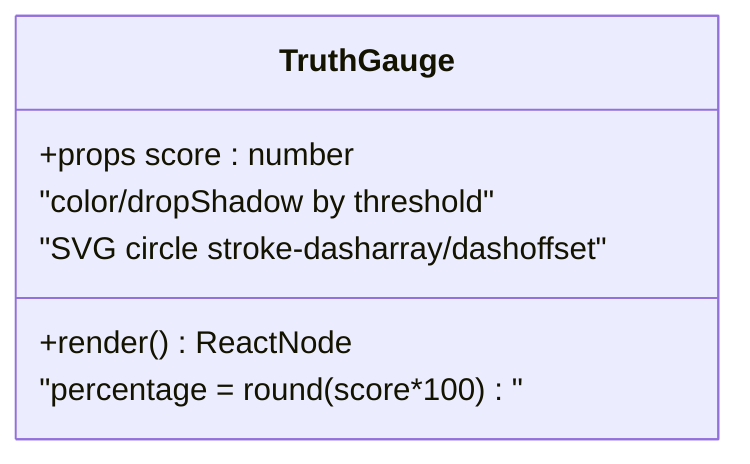
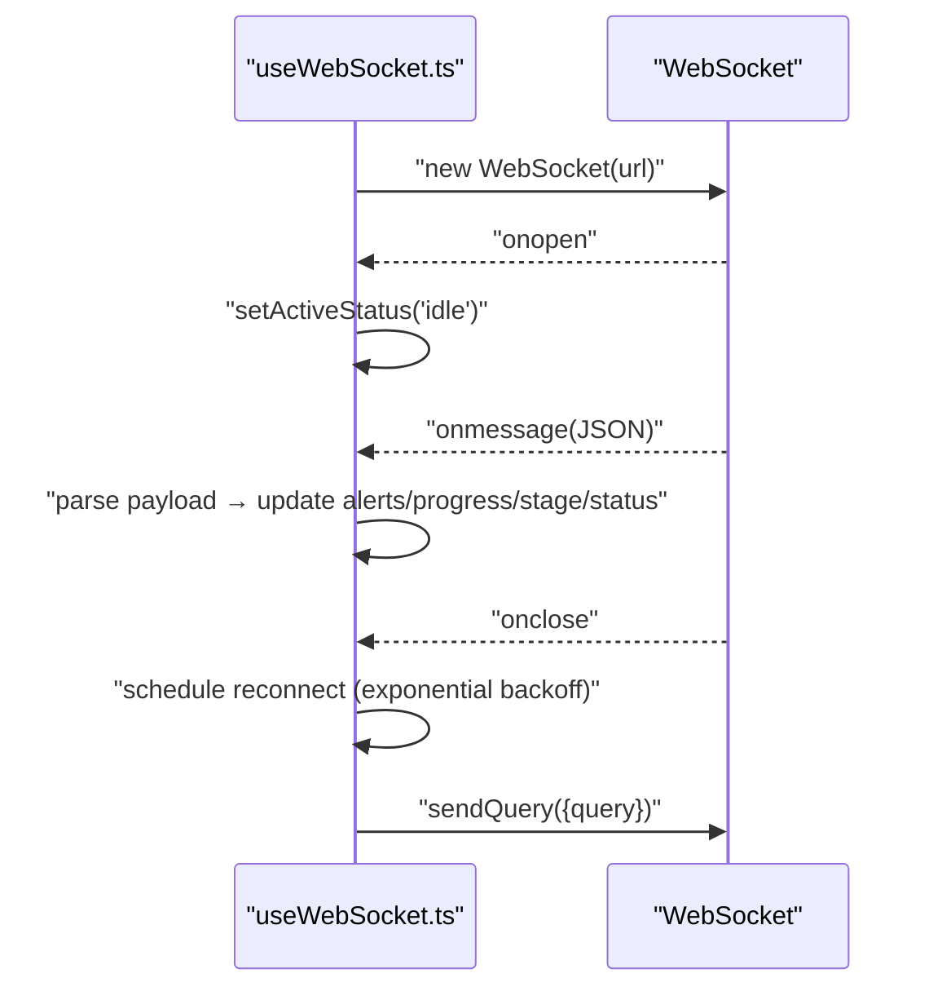
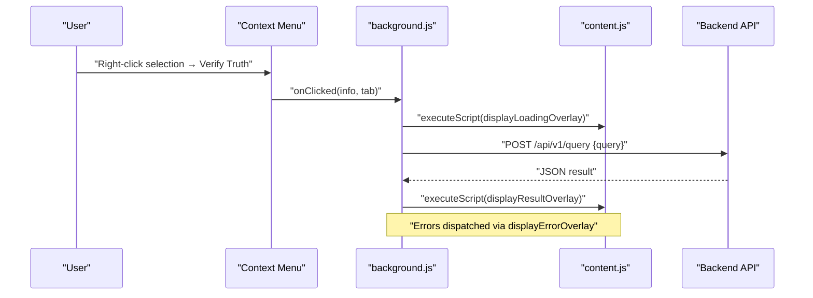
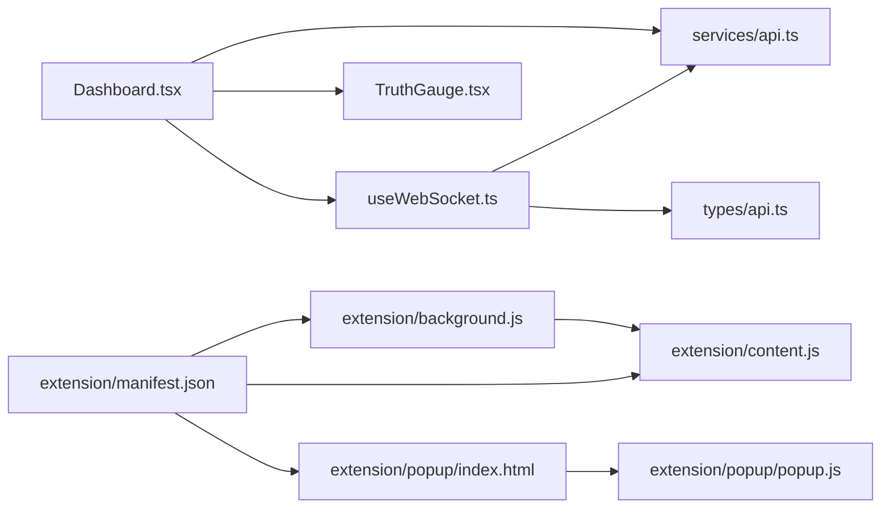

# Frontend Interface

<cite>
**Referenced Files in This Document**
- [Dashboard.tsx](file://veritas-ai/frontend/components/Dashboard.tsx)
- [TruthGauge.tsx](file://veritas-ai/frontend/components/TruthGauge.tsx)
- [useWebSocket.ts](file://veritas-ai/frontend/hooks/useWebSocket.ts)
- [api.ts](file://veritas-ai/frontend/services/api.ts)
- [page.tsx](file://veritas-ai/frontend/app/dashboard/page.tsx)
- [layout.tsx](file://veritas-ai/frontend/app/layout.tsx)
- [api.ts](file://veritas-ai/frontend/types/api.ts)
- [manifest.json](file://veritas-ai/extension/manifest.json)
- [content.js](file://veritas-ai/extension/content.js)
- [background.js](file://veritas-ai/extension/background.js)
- [popup.js](file://veritas-ai/extension/popup/popup.js)
- [index.html](file://veritas-ai/extension/popup/index.html)
- [tts_engine.py](file://veritas-ai/voice/tts_engine.py)
- [voice_manager.py](file://veritas-ai/voice/voice_manager.py)
</cite>

## Table of Contents
1. [Introduction](#introduction)
2. [Project Structure](#project-structure)
3. [Core Components](#core-components)
4. [Architecture Overview](#architecture-overview)
5. [Detailed Component Analysis](#detailed-component-analysis)
6. [Dependency Analysis](#dependency-analysis)
7. [Performance Considerations](#performance-considerations)
8. [Troubleshooting Guide](#troubleshooting-guide)
9. [Conclusion](#conclusion)
10. [Appendices](#appendices)

## Introduction
This document describes the frontend interface systems for Veritas AI’s Next.js dashboard and Chrome extension. It covers the dashboard’s real-time truth scoring visualization, claim analysis interface, and trend monitoring displays; the voice-first interface built with the Web Speech API for hands-free interaction; the Chrome extension architecture including content scripts, background services, and popup configuration; component composition patterns, state management strategies, and real-time data synchronization; the TruthGauge component for confidence visualization; and the navigation system. It also addresses responsive design considerations, accessibility compliance, cross-browser compatibility, WebSocket integration for real-time updates, and the API service layer for backend communication.

## Project Structure
The frontend is organized into:
- Next.js app pages and components under veritas-ai/frontend
- Shared services, hooks, and types
- Chrome extension assets under veritas-ai/extension

**Diagram sources**
- [layout.tsx:11-24](file://veritas-ai/frontend/app/layout.tsx#L11-L24)
- [page.tsx:1-17](file://veritas-ai/frontend/app/dashboard/page.tsx#L1-L17)
- [Dashboard.tsx:1-312](file://veritas-ai/frontend/components/Dashboard.tsx#L1-L312)
- [TruthGauge.tsx:1-52](file://veritas-ai/frontend/components/TruthGauge.tsx#L1-L52)
- [useWebSocket.ts:1-143](file://veritas-ai/frontend/hooks/useWebSocket.ts#L1-L143)
- [api.ts:1-32](file://veritas-ai/frontend/services/api.ts#L1-L32)
- [api.ts:1-66](file://veritas-ai/frontend/types/api.ts#L1-L66)
- [manifest.json:1-32](file://veritas-ai/extension/manifest.json#L1-L32)
- [background.js:1-67](file://veritas-ai/extension/background.js#L1-L67)
- [content.js:1-137](file://veritas-ai/extension/content.js#L1-L137)
- [index.html:1-52](file://veritas-ai/extension/popup/index.html#L1-L52)
- [popup.js:1-37](file://veritas-ai/extension/popup/popup.js#L1-L37)

**Section sources**
- [layout.tsx:11-24](file://veritas-ai/frontend/app/layout.tsx#L11-L24)
- [page.tsx:1-17](file://veritas-ai/frontend/app/dashboard/page.tsx#L1-L17)
- [manifest.json:1-32](file://veritas-ai/extension/manifest.json#L1-L32)

## Core Components
- Dashboard: Orchestrates voice input, WebSocket streaming, progress stages, alerts, and rendering of truth scoring and explanations.
- TruthGauge: Visualizes the verification confidence score as a dynamic SVG gauge.
- useWebSocket: Provides WebSocket connection lifecycle, reconnection logic, and state for stream data, alerts, progress, and stage.
- API service: Resolves runtime protocol and host for HTTP and WebSocket endpoints and exposes helpers like percent formatting and health checks.
- Types: Defines QueryResponse, AlertItem, HistoryEntry, and WebSocketMessage shapes for consistent data contracts.
- Chrome Extension: Manifest declares permissions and scripts; background service handles context menu actions and API requests; content script renders overlays; popup configures backend base URL and checks health.

Key responsibilities:
- Real-time truth scoring visualization: Dashboard streams QueryResponse payloads and renders TruthGauge and explanation panels.
- Claim analysis interface: Voice input toggles SpeechRecognition; synthesized speech summarizes results.
- Trend monitoring displays: Alerts array is rendered as anomaly cards with severity differentiation.
- Voice-first interface: Web Speech API integration for continuous dictation and synthesis.
- Extension architecture: Content script overlays, background service worker, and popup configuration UI.

**Section sources**
- [Dashboard.tsx:21-312](file://veritas-ai/frontend/components/Dashboard.tsx#L21-L312)
- [TruthGauge.tsx:3-52](file://veritas-ai/frontend/components/TruthGauge.tsx#L3-L52)
- [useWebSocket.ts:15-143](file://veritas-ai/frontend/hooks/useWebSocket.ts#L15-L143)
- [api.ts:1-32](file://veritas-ai/frontend/services/api.ts#L1-L32)
- [api.ts:19-66](file://veritas-ai/frontend/types/api.ts#L19-L66)
- [manifest.json:6-31](file://veritas-ai/extension/manifest.json#L6-L31)
- [background.js:8-53](file://veritas-ai/extension/background.js#L8-L53)
- [content.js:46-137](file://veritas-ai/extension/content.js#L46-L137)
- [popup.js:9-36](file://veritas-ai/extension/popup/popup.js#L9-L36)

## Architecture Overview
The frontend integrates three primary flows:
- Next.js Dashboard with WebSocket streaming for live truth scoring and alerts
- Voice-first UI leveraging Web Speech Recognition and Speech Synthesis
- Chrome Extension with content script overlays and background service worker

**Diagram sources**
- [Dashboard.tsx:33-117](file://veritas-ai/frontend/components/Dashboard.tsx#L33-L117)
- [useWebSocket.ts:29-99](file://veritas-ai/frontend/hooks/useWebSocket.ts#L29-L99)
- [api.ts:13-19](file://veritas-ai/frontend/services/api.ts#L13-L19)

## Detailed Component Analysis

### Dashboard Component
Responsibilities:
- Manage voice input via SpeechRecognition and toggle listening state
- Send queries over WebSocket using the shared hook
- Render progress stages and a progress bar
- Display alerts and anomaly cards
- Render TruthGauge and explanation panels
- Provide synthesized speech summaries via SpeechSynthesis

Implementation highlights:
- Uses a staged progress bar mapped to processing phases
- Renders TruthGauge with the latest QueryResponse truth score
- Conditionally renders explanation panels for “Why True” and “Why False”
- Integrates voice-to-text and text-to-speech flows

**Diagram sources**
- [Dashboard.tsx:33-117](file://veritas-ai/frontend/components/Dashboard.tsx#L33-L117)
- [useWebSocket.ts:117-131](file://veritas-ai/frontend/hooks/useWebSocket.ts#L117-L131)

**Section sources**
- [Dashboard.tsx:21-312](file://veritas-ai/frontend/components/Dashboard.tsx#L21-L312)

### TruthGauge Component
Responsibilities:
- Visualize the truth score as a circular SVG gauge with color-coded segments
- Animate stroke dashoffset based on score percentage

Implementation highlights:
- Computes radius and circumference for SVG arcs
- Dynamically sets color and drop shadow based on score thresholds
- Displays percentage and label centered within the gauge

**Diagram sources**
- [TruthGauge.tsx:3-52](file://veritas-ai/frontend/components/TruthGauge.tsx#L3-L52)

**Section sources**
- [TruthGauge.tsx:1-52](file://veritas-ai/frontend/components/TruthGauge.tsx#L1-L52)

### useWebSocket Hook
Responsibilities:
- Establish and manage a WebSocket connection
- Parse incoming messages and update state for streamData, alerts, progress, stage, and error
- Implement exponential backoff reconnection
- Expose sendQuery to dispatch queries

Implementation highlights:
- Maintains ref flags for processing state and controlled reconnection
- Handles open, message, close, error, and onmessage parsing
- Resets and normalizes state per query submission

**Diagram sources**
- [useWebSocket.ts:29-99](file://veritas-ai/frontend/hooks/useWebSocket.ts#L29-L99)
- [useWebSocket.ts:117-131](file://veritas-ai/frontend/hooks/useWebSocket.ts#L117-L131)

**Section sources**
- [useWebSocket.ts:1-143](file://veritas-ai/frontend/hooks/useWebSocket.ts#L1-L143)

### API Service Layer
Responsibilities:
- Resolve runtime protocol/host for HTTP and WebSocket endpoints
- Normalize base URLs and expose percent formatting and health check helpers

Implementation highlights:
- Derives protocol from window location and port from env or defaults
- Provides WS_BASE_URL and formatPercent for consistent UI formatting

**Section sources**
- [api.ts:1-32](file://veritas-ai/frontend/services/api.ts#L1-L32)

### Types and Contracts
Responsibilities:
- Define QueryResponse shape for truth scoring, explanations, and metadata
- Define AlertItem for anomaly notifications
- Define WebSocketMessage for streaming statuses and payloads

Implementation highlights:
- Centralized TypeScript interfaces ensure consistent data contracts across components and hooks

**Section sources**
- [api.ts:19-66](file://veritas-ai/frontend/types/api.ts#L19-L66)

### Chrome Extension Architecture
Responsibilities:
- Manifest: Declares permissions, host permissions, background service worker, content scripts, and action popup
- Background: Registers context menu, executes content script to show loading, posts selection text to backend, injects result/error overlays
- Content Script: Listens for custom events to render overlays with status, truth score, bias, summary, and authority breakdown
- Popup: Allows configuring backend base URL, saving to storage, and checking health

**Diagram sources**
- [manifest.json:6-31](file://veritas-ai/extension/manifest.json#L6-L31)
- [background.js:16-53](file://veritas-ai/extension/background.js#L16-L53)
- [content.js:46-137](file://veritas-ai/extension/content.js#L46-L137)

**Section sources**
- [manifest.json:1-32](file://veritas-ai/extension/manifest.json#L1-L32)
- [background.js:1-67](file://veritas-ai/extension/background.js#L1-L67)
- [content.js:1-137](file://veritas-ai/extension/content.js#L1-L137)
- [index.html:1-52](file://veritas-ai/extension/popup/index.html#L1-L52)
- [popup.js:1-37](file://veritas-ai/extension/popup/popup.js#L1-L37)

### Voice-First Interface (Web Speech API)
Responsibilities:
- Continuous speech recognition for hands-free input
- Text-to-speech synthesis for vocalized summaries
- Graceful error handling and state transitions

Implementation highlights:
- Uses SpeechRecognition and SpeechSynthesis APIs
- Manages recognition lifecycle and error states
- Selects preferred voice by name pattern when available

**Section sources**
- [Dashboard.tsx:33-117](file://veritas-ai/frontend/components/Dashboard.tsx#L33-L117)

### Navigation System
Responsibilities:
- Root layout composes the Navbar and wraps pages
- Dashboard page renders the main dashboard container

**Section sources**
- [layout.tsx:11-24](file://veritas-ai/frontend/app/layout.tsx#L11-L24)
- [page.tsx:4-16](file://veritas-ai/frontend/app/dashboard/page.tsx#L4-L16)

## Dependency Analysis
Component and module relationships:
- Dashboard depends on useWebSocket, TruthGauge, API service, and types
- useWebSocket depends on API service for endpoint resolution and consumes typed WebSocketMessage
- Extension manifest governs background and content scripts; background interacts with popup and content scripts

**Diagram sources**
- [Dashboard.tsx:1-8](file://veritas-ai/frontend/components/Dashboard.tsx#L1-L8)
- [useWebSocket.ts:1-13](file://veritas-ai/frontend/hooks/useWebSocket.ts#L1-L13)
- [api.ts:1-32](file://veritas-ai/frontend/services/api.ts#L1-L32)
- [api.ts:56-66](file://veritas-ai/frontend/types/api.ts#L56-L66)
- [manifest.json:17-31](file://veritas-ai/extension/manifest.json#L17-L31)
- [background.js:1-67](file://veritas-ai/extension/background.js#L1-L67)
- [content.js:1-137](file://veritas-ai/extension/content.js#L1-L137)
- [index.html:1-52](file://veritas-ai/extension/popup/index.html#L1-L52)
- [popup.js:1-37](file://veritas-ai/extension/popup/popup.js#L1-L37)

**Section sources**
- [Dashboard.tsx:1-8](file://veritas-ai/frontend/components/Dashboard.tsx#L1-L8)
- [useWebSocket.ts:1-13](file://veritas-ai/frontend/hooks/useWebSocket.ts#L1-L13)
- [api.ts:1-32](file://veritas-ai/frontend/services/api.ts#L1-L32)
- [api.ts:56-66](file://veritas-ai/frontend/types/api.ts#L56-L66)
- [manifest.json:17-31](file://veritas-ai/extension/manifest.json#L17-L31)
- [background.js:1-67](file://veritas-ai/extension/background.js#L1-L67)
- [content.js:1-137](file://veritas-ai/extension/content.js#L1-L137)
- [index.html:1-52](file://veritas-ai/extension/popup/index.html#L1-L52)
- [popup.js:1-37](file://veritas-ai/extension/popup/popup.js#L1-L37)

## Performance Considerations
- WebSocket streaming minimizes latency by incrementally updating UI during processing stages.
- TruthGauge animation uses SVG stroke dashoffset with smooth transitions.
- Voice synthesis cancels previous utterances to avoid overlapping speech.
- Content script overlays are lightweight DOM injections triggered by custom events.
- Exponential backoff reduces server load during reconnection attempts.

[No sources needed since this section provides general guidance]

## Troubleshooting Guide
Common issues and remedies:
- WebSocket not connected: The hook sets an error state and prevents sending queries; verify WS_BASE_URL and backend connectivity.
- SpeechRecognition errors: The dashboard logs errors and resets listening state; ensure browser supports the API and site is served over HTTPS in secure contexts.
- Extension context menu not working: Confirm permissions and host permissions in the manifest; verify background service worker registration.
- Popup health status offline: Adjust API base URL in popup and confirm backend health endpoint availability.

**Section sources**
- [useWebSocket.ts:72-99](file://veritas-ai/frontend/hooks/useWebSocket.ts#L72-L99)
- [Dashboard.tsx:65-89](file://veritas-ai/frontend/components/Dashboard.tsx#L65-L89)
- [manifest.json:6-16](file://veritas-ai/extension/manifest.json#L6-L16)
- [popup.js:9-23](file://veritas-ai/extension/popup/popup.js#L9-L23)

## Conclusion
The Veritas AI frontend combines a real-time Next.js dashboard with a voice-first interface and a robust Chrome extension. The dashboard leverages WebSocket streaming, a TruthGauge for confidence visualization, and a structured progress stage display. The extension enables quick verification via context menus and content script overlays. Together, these systems deliver a responsive, accessible, and cross-browser-compatible interface for truth verification workflows.

[No sources needed since this section summarizes without analyzing specific files]

## Appendices

### Responsive Design Considerations
- Dashboard uses Tailwind-based responsive grids and spacing; adjust breakpoints for mobile and tablet layouts.
- TruthGauge scales to fit within its container; ensure adequate viewport sizing on smaller screens.
- Voice controls adapt to input width; maintain minimum touch targets for accessibility.

[No sources needed since this section provides general guidance]

### Accessibility Compliance
- Use semantic HTML and ARIA roles where appropriate.
- Ensure sufficient color contrast for progress indicators and severity cards.
- Provide keyboard navigation support for input fields and buttons.
- Announce dynamic content updates for screen reader users.

[No sources needed since this section provides general guidance]

### Cross-Browser Compatibility
- Web Speech API availability varies; the dashboard gracefully handles missing APIs and disables voice features when unsupported.
- Extension permissions and host permissions are declared in the manifest for Chrome-based browsers.

**Section sources**
- [Dashboard.tsx:36-71](file://veritas-ai/frontend/components/Dashboard.tsx#L36-L71)
- [manifest.json:6-16](file://veritas-ai/extension/manifest.json#L6-L16)

### Backend Communication and Voice Engines
- The backend includes a TTS engine and voice manager for audio processing, complementing the frontend’s Web Speech API integration.

**Section sources**
- [tts_engine.py:12-29](file://veritas-ai/voice/tts_engine.py#L12-L29)
- [voice_manager.py:11-37](file://veritas-ai/voice/voice_manager.py#L11-L37)