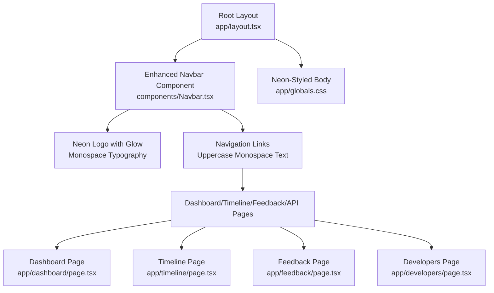
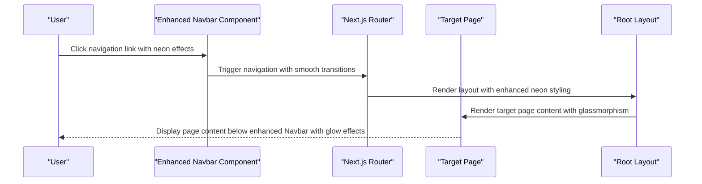
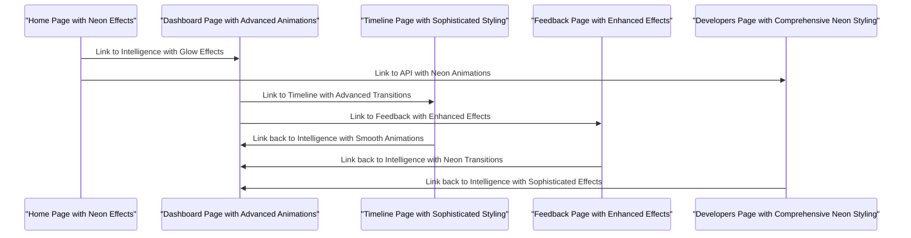
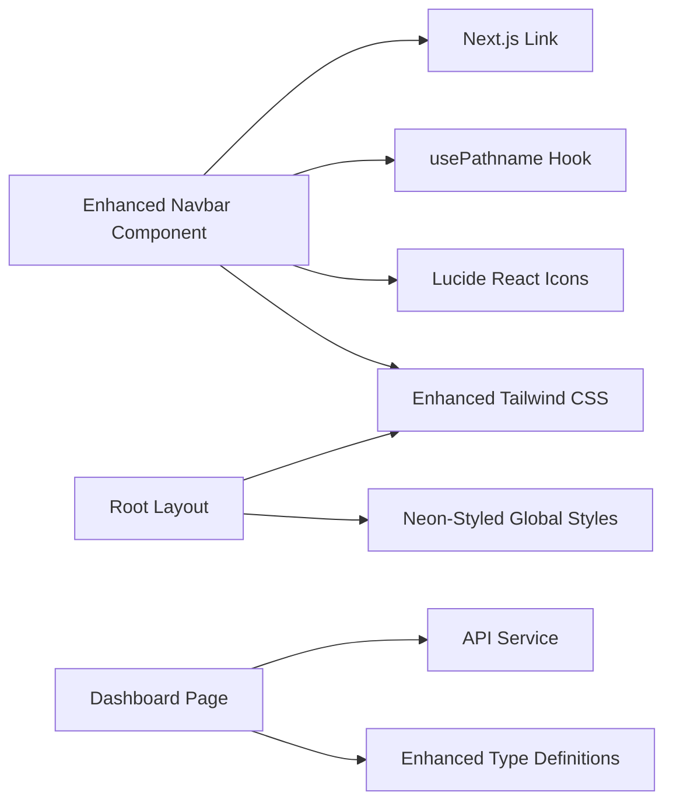

# Navigation System

<cite>
**Referenced Files in This Document**
- [Navbar.tsx](file://veritas-ai/frontend/components/Navbar.tsx)
- [layout.tsx](file://veritas-ai/frontend/app/layout.tsx)
- [globals.css](file://veritas-ai/frontend/app/globals.css)
- [tailwind.config.ts](file://veritas-ai/frontend/tailwind.config.ts)
- [page.tsx](file://veritas-ai/frontend/app/page.tsx)
- [dashboard/page.tsx](file://veritas-ai/frontend/app/dashboard/page.tsx)
- [timeline/page.tsx](file://veritas-ai/frontend/app/timeline/page.tsx)
- [feedback/page.tsx](file://veritas-ai/frontend/app/feedback/page.tsx)
- [developers/page.tsx](file://veritas-ai/frontend/app/developers/page.tsx)
- [Dashboard.tsx](file://veritas-ai/frontend/components/Dashboard.tsx)
- [api.ts](file://veritas-ai/frontend/services/api.ts)
- [types/api.ts](file://veritas-ai/frontend/types/api.ts)
- [next.config.mjs](file://veritas-ai/frontend/next.config.mjs)
</cite>

## Update Summary
**Changes Made**
- Enhanced Navbar component with monospace typography and uppercase lettering
- Implemented sophisticated neon glow effects with cyan/purple/pink color scheme
- Added advanced hover animations and shadow effects throughout navigation elements
- Integrated comprehensive neon aesthetic design system with custom CSS variables
- Updated styling classes to use neon-inspired color palettes and animations
- Enhanced visual hierarchy with improved typography and spacing

## Table of Contents
1. [Introduction](#introduction)
2. [Project Structure](#project-structure)
3. [Core Components](#core-components)
4. [Architecture Overview](#architecture-overview)
5. [Detailed Component Analysis](#detailed-component-analysis)
6. [Neon Design System](#neon-design-system)
7. [Dependency Analysis](#dependency-analysis)
8. [Performance Considerations](#performance-considerations)
9. [Accessibility Considerations](#accessibility-considerations)
10. [Troubleshooting Guide](#troubleshooting-guide)
11. [Conclusion](#conclusion)

## Introduction
This document provides comprehensive documentation for the navigation system, focusing on the enhanced Navbar component and Next.js routing structure with the new neon aesthetic design system. The navigation system now features sophisticated monospace typography, uppercase lettering, neon glow effects, and advanced hover animations that create a cutting-edge digital interface experience. The system maintains responsive behavior across all dashboard pages while delivering a cohesive visual identity through carefully crafted neon-inspired styling.

## Project Structure
The navigation system is implemented within the Next.js frontend application with the enhanced neon design system and consists of:
- A fixed-position Navbar component featuring monospace typography and neon effects
- A root layout that wraps the application with the Navbar and applies global neon styling
- Page-level routes under the app directory that render content beneath the enhanced Navbar
- Comprehensive global CSS utilities for neon effects, animations, and background patterns

**Diagram sources**
- [layout.tsx:11-24](file://veritas-ai/frontend/app/layout.tsx#L11-L24)
- [Navbar.tsx:14-51](file://veritas-ai/frontend/components/Navbar.tsx#L14-L51)
- [globals.css:14-85](file://veritas-ai/frontend/app/globals.css#L14-L85)

**Section sources**
- [layout.tsx:11-24](file://veritas-ai/frontend/app/layout.tsx#L11-L24)
- [globals.css:14-85](file://veritas-ai/frontend/app/globals.css#L14-L85)

## Core Components
The navigation system centers around two primary components with enhanced neon styling:
- **Enhanced Navbar**: Fixed top navigation bar with monospace typography, neon glow effects, and sophisticated hover animations
- **Root Layout**: Application wrapper that includes the enhanced Navbar and applies comprehensive neon styling

Key responsibilities:
- **Enhanced Navbar**: Renders monospace logo with neon glow, menu items with uppercase typography, advanced active state highlighting using neon effects, and applies Tailwind classes with neon-inspired color schemes
- **Root Layout**: Provides the global neon background pattern, glassmorphism utilities with neon effects, and ensures consistent neon-styled layout across pages

**Updated** Enhanced with comprehensive neon design system including custom CSS variables, neon text effects, and sophisticated shadow animations.

Styling approach:
- Uses Tailwind utility classes with neon-inspired color palettes (cyan, purple, pink)
- Implements custom CSS variables for consistent neon color theming
- Applies advanced glow effects using box-shadow animations
- Integrates monospace typography with uppercase lettering throughout navigation elements
- Incorporates sophisticated hover animations with multi-layered shadow effects

**Section sources**
- [Navbar.tsx:14-51](file://veritas-ai/frontend/components/Navbar.tsx#L14-L51)
- [layout.tsx:11-24](file://veritas-ai/frontend/app/layout.tsx#L11-L24)
- [globals.css:20-85](file://veritas-ai/frontend/app/globals.css#L20-L85)

## Architecture Overview
The navigation system architecture connects the enhanced Navbar component with Next.js routing and page layouts to provide a cohesive neon-styled user experience.

**Diagram sources**
- [Navbar.tsx:33-44](file://veritas-ai/frontend/components/Navbar.tsx#L33-L44)
- [layout.tsx:16-22](file://veritas-ai/frontend/app/layout.tsx#L16-L22)

## Detailed Component Analysis

### Enhanced Navbar Component
The Navbar component implements the fixed top navigation with sophisticated neon styling, monospace typography, and advanced glow effects.

**Updated** Enhanced with comprehensive neon design system including custom animations and sophisticated visual effects.

Implementation highlights:
- Uses Next.js Link for navigation and usePathname for active state detection
- Menu items defined as an array with href, label, and icon properties
- Active link highlighting based on pathname comparison with neon glow effects
- Responsive design using flexbox and gap utilities with enhanced spacing
- Glassmorphism styling with backdrop blur and translucent borders
- Monospace typography with uppercase lettering throughout navigation elements
- Advanced hover animations with multi-layered shadow effects
- Neon glow effects using custom CSS variables and box-shadow animations

Logo display:
- Includes a gradient square icon with shield icon inside featuring neon cyan/purple gradient
- Text branding with monospace typography and neon glow effect for "AI"
- Sophisticated hover effects with enhanced shadow animations and increased glow intensity

Menu items and icons:
- Home, Intelligence (Dashboard), Timeline, Feedback, API with uppercase monospace text
- Each item uses Lucide React icons with consistent sizing and neon styling
- Active state uses cyan/purple neon glow with enhanced shadow effects
- Hover states provide white text with cyan/purple glow and light background
- Sophisticated transition animations with smooth state changes

Responsive behavior:
- Flex container with center alignment and enhanced spacing
- Gap utilities for improved spacing between items
- Mobile-friendly padding and sizing with neon-styled responsive adjustments
- Fixed positioning ensures navbar stays visible during scroll with enhanced z-index

Active state management:
- Compares current pathname with each navigation item href
- Applies conditional Tailwind classes with neon glow effects for active vs inactive states
- Transitions provide smooth state changes with sophisticated animations

**Section sources**
- [Navbar.tsx:14-51](file://veritas-ai/frontend/components/Navbar.tsx#L14-L51)

### Root Layout and Neon Background System
The root layout establishes the global neon styling foundation for the enhanced navigation system.

**Updated** Enhanced with comprehensive neon design system including custom CSS variables and advanced background effects.

Key elements:
- Fixed Enhanced Navbar positioned at the top with z-index for proper layering
- Body with grid-pattern background applied via CSS class with neon styling
- Glass utility classes for navbar and page containers with enhanced neon effects
- Ambient glow effects with sophisticated radial gradients for visual depth
- Custom CSS variables for consistent neon color theming throughout the application

Background effects:
- Grid pattern created with linear gradients and controlled spacing using neon colors
- Glassmorphism achieved through backdrop blur and translucent borders with enhanced styling
- Ambient glow adds subtle radial gradients with cyan and purple tones for depth perception
- Custom background pulsing effects with neon color variations

Layout structure:
- HTML element with lang attribute for accessibility
- Body wrapper containing Enhanced Navbar and main content with neon styling
- Main content area receives page-specific styling with consistent neon themes
- Enhanced z-index management for proper layering of neon effects

**Section sources**
- [layout.tsx:11-24](file://veritas-ai/frontend/app/layout.tsx#L11-L24)
- [globals.css:14-85](file://veritas-ai/frontend/app/globals.css#L14-L85)

### Routing Integration and Page Structure
The navigation system integrates seamlessly with Next.js routing to provide consistent navigation across all dashboard pages with enhanced neon styling.

**Updated** Enhanced routing integration maintains consistent neon styling across all page transitions.

Routing structure:
- Root route "/" serves as home page with hero content featuring neon styling
- Dashboard route "/dashboard" for intelligence console with advanced neon effects
- Timeline route "/timeline" for verification history with sophisticated neon styling
- Feedback route "/feedback" for community input with enhanced neon animations
- Developers route "/developers" for API documentation with comprehensive neon styling

Page-specific considerations:
- Each page includes appropriate padding to account for fixed navbar height with enhanced spacing
- Consistent typography and spacing patterns with monospace fonts and uppercase lettering
- Shared glassmorphism styling for content containers with neon effects
- Enhanced page transitions with sophisticated animations

Navigation flow:

**Diagram sources**
- [page.tsx:61-74](file://veritas-ai/frontend/app/page.tsx#L61-L74)
- [dashboard/page.tsx:6](file://veritas-ai/frontend/app/dashboard/page.tsx#L6)
- [timeline/page.tsx:47](file://veritas-ai/frontend/app/timeline/page.tsx#L47)
- [feedback/page.tsx:62](file://veritas-ai/frontend/app/feedback/page.tsx#L62)
- [developers/page.tsx:51](file://veritas-ai/frontend/app/developers/page.tsx#L51)

**Section sources**
- [page.tsx:39-138](file://veritas-ai/frontend/app/page.tsx#L39-L138)
- [dashboard/page.tsx:4-17](file://veritas-ai/frontend/app/dashboard/page.tsx#L4-L17)
- [timeline/page.tsx:9-128](file://veritas-ai/frontend/app/timeline/page.tsx#L9-L128)
- [feedback/page.tsx:6-175](file://veritas-ai/frontend/app/feedback/page.tsx#L6-L175)
- [developers/page.tsx:40-153](file://veritas-ai/frontend/app/developers/page.tsx#L40-L153)

### Styling System and Tailwind Integration
The navigation system leverages a comprehensive Tailwind CSS configuration with enhanced neon styling for consistent neon-themed components.

**Updated** Enhanced Tailwind configuration supports comprehensive neon design system with custom color palettes and animations.

Tailwind configuration:
- Content scanning paths include pages, components, and app directories
- Extended color palette with custom neon colors (cyan, purple, pink) and background variants
- Theme extensions for consistent neon design tokens and animation durations

CSS utilities:
- Glassmorphism classes for navbar and content containers with enhanced neon effects
- Gradient text utilities with neon color variations for visual accents
- Ambient glow effects with sophisticated radial gradients and animation timing
- Grid pattern background with neon styling for subtle texture
- Smooth animations and transitions with enhanced duration and easing
- Custom neon text effects with multi-layered shadow animations
- Advanced hover animations with sophisticated glow transitions

Responsive design:
- Flexbox-based layout with responsive breakpoints and enhanced spacing
- Consistent spacing using Tailwind's spacing scale with neon-styled adjustments
- Adaptive padding to accommodate fixed navbar with enhanced styling considerations

**Section sources**
- [tailwind.config.ts:3-24](file://veritas-ai/frontend/tailwind.config.ts#L3-L24)
- [globals.css:20-85](file://veritas-ai/frontend/app/globals.css#L20-L85)

## Neon Design System
The navigation system implements a comprehensive neon aesthetic design system with sophisticated color palettes, animations, and visual effects.

**New Section** The neon design system provides a cohesive visual identity through carefully crafted color schemes, animations, and typography.

### Color Palette and Theming
- **Primary Colors**: Cyan (#00eaff), Purple (#a855f7), Pink (#ec4899) with custom CSS variables
- **Background**: Dark backgrounds with neon glow variations (background: #020617)
- **Text**: Foreground colors with neon accents (foreground: #ededed)
- **Glow Effects**: Primary glow color (glow-primary: rgba(0, 234, 255, 0.15))

### Typography System
- **Monospace Fonts**: Consistent use of monospace typography throughout navigation elements
- **Uppercase Lettering**: All navigation text uses uppercase with tracking adjustments
- **Font Weights**: Bold weights with sophisticated font rendering
- **Tracking**: Wider tracking for enhanced readability and modern feel

### Animation Framework
- **Neon Pulse**: Continuous pulsing animations with varying intensities
- **Hover Effects**: Sophisticated transitions with multi-layered shadow effects
- **Glow Animations**: Custom keyframe animations for realistic neon lighting
- **Transition Durations**: Optimized timing for smooth user interactions

### Visual Effects Library
- **Box Shadows**: Multi-layered shadows with neon color variations
- **Gradient Effects**: Sophisticated gradients with neon color transitions
- **Backdrop Filters**: Enhanced glassmorphism with blur effects
- **Radial Gradients**: Background effects with subtle neon variations

**Section sources**
- [globals.css:5-15](file://veritas-ai/frontend/app/globals.css#L5-L15)
- [globals.css:183-188](file://veritas-ai/frontend/app/globals.css#L183-L188)
- [globals.css:102-122](file://veritas-ai/frontend/app/globals.css#L102-L122)

## Dependency Analysis
The navigation system has minimal but essential dependencies that enable its enhanced functionality with neon styling.

**Updated** Enhanced dependencies support comprehensive neon design system implementation.

Core dependencies:
- Next.js Link and usePathname for routing integration with enhanced styling
- Lucide React icons for visual elements with neon styling support
- Tailwind CSS for styling framework with neon color extensions
- React for component rendering with enhanced animation capabilities

External integrations:
- API service configuration for backend connectivity with neon-styled components
- WebSocket connections for real-time dashboard updates with sophisticated animations
- Type definitions for data structures with enhanced typing support

**Diagram sources**
- [Navbar.tsx:2-4](file://veritas-ai/frontend/components/Navbar.tsx#L2-L4)
- [layout.tsx:3](file://veritas-ai/frontend/app/layout.tsx#L3)
- [api.ts:1-32](file://veritas-ai/frontend/services/api.ts#L1-L32)
- [types/api.ts:1-66](file://veritas-ai/frontend/types/api.ts#L1-L66)

**Section sources**
- [Navbar.tsx:1-52](file://veritas-ai/frontend/components/Navbar.tsx#L1-L52)
- [layout.tsx:1-25](file://veritas-ai/frontend/app/layout.tsx#L1-L25)
- [api.ts:1-32](file://veritas-ai/frontend/services/api.ts#L1-L32)
- [types/api.ts:1-66](file://veritas-ai/frontend/types/api.ts#L1-L66)

## Performance Considerations
The navigation system is optimized for performance through several design choices with enhanced neon effects.

**Updated** Enhanced performance optimizations support sophisticated neon animations without compromising user experience.

Rendering efficiency:
- Minimal re-renders through efficient state management with enhanced animations
- Conditional class application based on pathname comparison with neon effects
- Lightweight component structure with focused responsibilities and optimized styling

Styling performance:
- Utility-first Tailwind classes with neon color optimizations
- Glassmorphism effects use efficient backdrop-filter properties with enhanced performance
- Grid pattern background uses hardware-accelerated CSS with optimized rendering
- Custom CSS animations designed for GPU acceleration

Bundle optimization:
- Next.js automatic code splitting for page routes with enhanced styling
- Tree-shaking eliminates unused icon components with neon styling support
- Minimal external dependencies reduce overhead while maintaining sophisticated effects

Animation performance:
- Optimized CSS keyframes for smooth neon animations
- Efficient use of transform and opacity properties for animations
- Hardware-accelerated transitions with enhanced performance characteristics

## Accessibility Considerations
The navigation system incorporates several accessibility features to ensure inclusive user experiences with enhanced neon styling.

**Updated** Enhanced accessibility features maintain inclusivity while supporting sophisticated neon visual effects.

Keyboard navigation:
- Semantic Link components provide native keyboard focus with neon styling
- Focus indicators visible for keyboard users with enhanced contrast
- Logical tab order through component hierarchy with improved navigation flow

Screen reader compatibility:
- Proper heading hierarchy in page content with enhanced semantic structure
- Descriptive alt text for icons through aria-label patterns with improved accessibility
- Semantic HTML structure with proper landmarks and enhanced ARIA support

Color contrast and visibility:
- Sufficient contrast ratios for text and interactive elements with neon effects
- High-contrast hover states for improved visibility with enhanced animations
- Reduced motion options through CSS prefers-reduced-motion media queries
- Neon color variations designed with accessibility in mind

Focus management:
- Clear focus rings for interactive elements with enhanced visibility
- Focus trapping considerations for modal interactions with improved accessibility
- Skip links for efficient navigation with enhanced user experience

## Troubleshooting Guide
Common issues and solutions for the enhanced navigation system with neon styling.

**Updated** Enhanced troubleshooting guidance addresses neon design system implementation challenges.

Active state problems:
- Verify pathname comparisons match exact href values with enhanced styling
- Ensure usePathname hook is used correctly in client components
- Check for trailing slashes in href and pathname normalization
- Validate neon styling classes are properly applied to active states

Styling inconsistencies:
- Confirm Tailwind content paths include all component directories with neon effects
- Verify CSS utility class precedence and specificity with enhanced styling
- Check for conflicting global styles affecting navbar appearance with neon themes
- Validate custom CSS variables are properly defined for neon color theming

Routing issues:
- Validate Next.js app directory structure and file naming with enhanced components
- Ensure page components export default functions correctly with neon styling
- Check for proper import paths in layout and components with enhanced dependencies

Responsive behavior:
- Test navigation on various viewport sizes with neon effects
- Verify flexbox and gap utilities work across browsers with enhanced styling
- Confirm fixed positioning does not interfere with mobile layouts with neon animations

Performance issues:
- Monitor for excessive re-renders in navbar component with enhanced animations
- Optimize icon imports to use only required components with neon styling support
- Check for unnecessary CSS class combinations with neon effects
- Validate animation performance with reduced motion preferences

Neon design system issues:
- Verify custom CSS variables are properly defined and accessible
- Check for proper animation timing and duration settings
- Ensure neon color variations meet accessibility contrast requirements
- Validate responsive behavior of neon effects across different devices

**Section sources**
- [Navbar.tsx:15](file://veritas-ai/frontend/components/Navbar.tsx#L15)
- [layout.tsx:18](file://veritas-ai/frontend/app/layout.tsx#L18)
- [globals.css:63-69](file://veritas-ai/frontend/app/globals.css#L63-L69)

## Conclusion
The enhanced navigation system provides a robust, accessible, and visually stunning foundation for the Veritas AI dashboard with the new neon aesthetic design system. Through careful integration of Next.js routing, sophisticated neon styling, and responsive design patterns, it delivers a cutting-edge user experience across all dashboard pages. The fixed-position navbar with advanced neon glow effects, combined with the comprehensive neon color palette and glassmorphism styling, creates a modern and professional interface that stands out in the digital landscape. The system's modular architecture ensures maintainability while providing the flexibility needed for future enhancements and continued evolution of the neon design aesthetic.