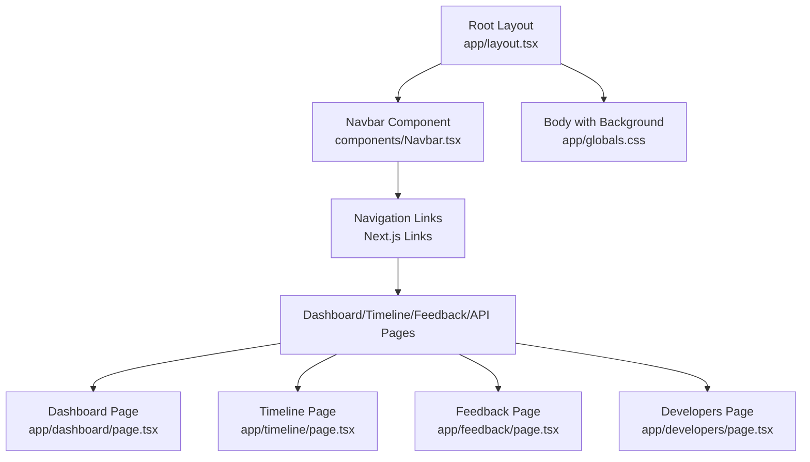
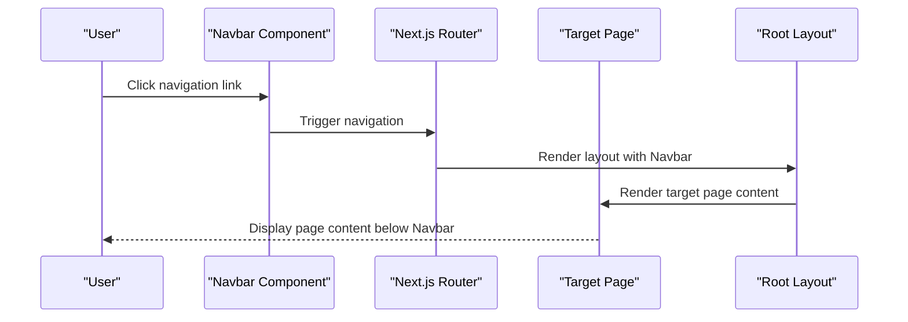
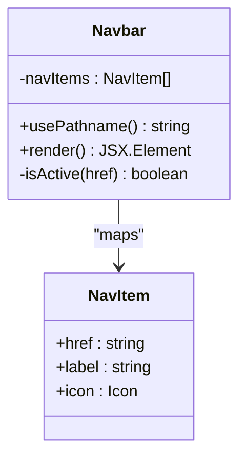
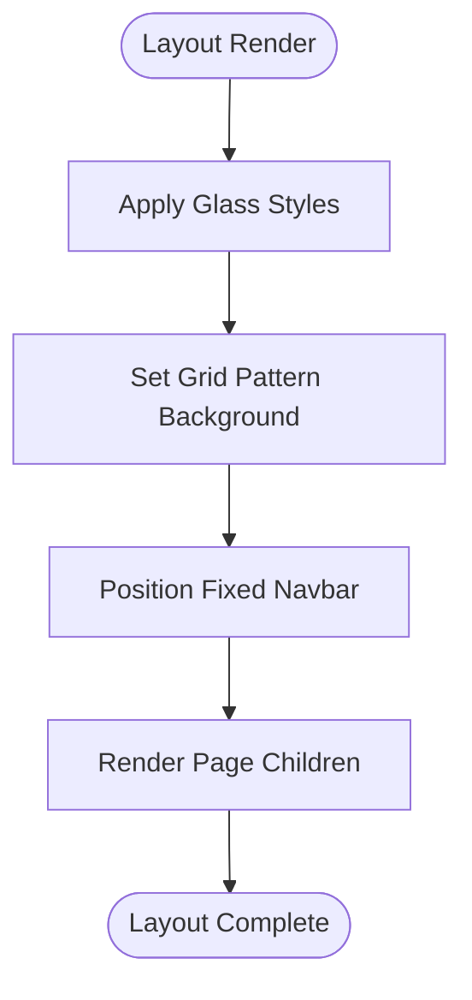
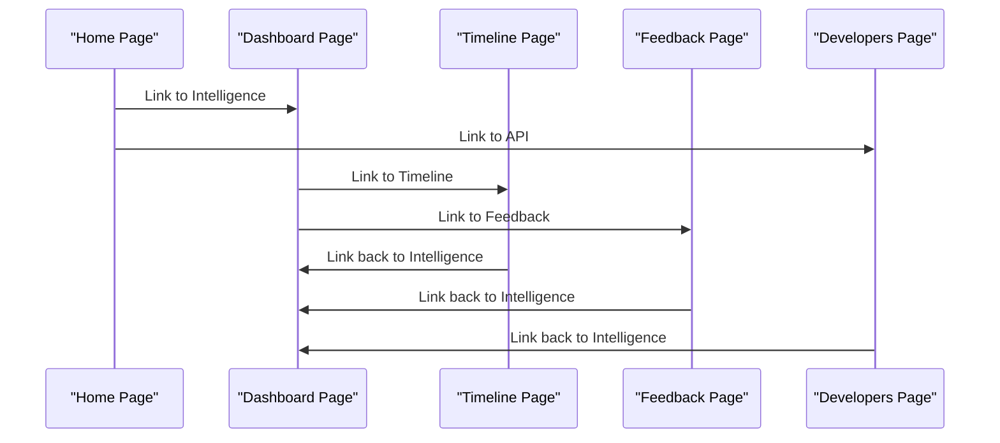
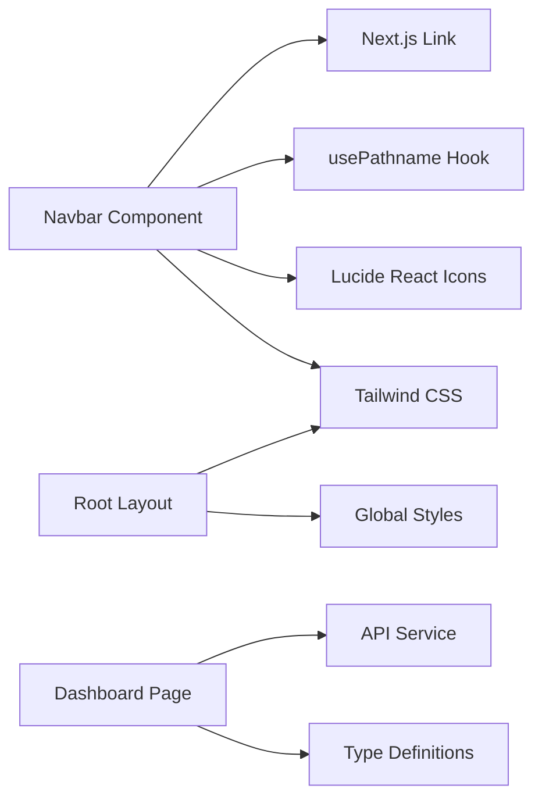

# Navigation System

<cite>
**Referenced Files in This Document**
- [Navbar.tsx](file://veritas-ai/frontend/components/Navbar.tsx)
- [layout.tsx](file://veritas-ai/frontend/app/layout.tsx)
- [globals.css](file://veritas-ai/frontend/app/globals.css)
- [tailwind.config.ts](file://veritas-ai/frontend/tailwind.config.ts)
- [page.tsx](file://veritas-ai/frontend/app/page.tsx)
- [dashboard/page.tsx](file://veritas-ai/frontend/app/dashboard/page.tsx)
- [timeline/page.tsx](file://veritas-ai/frontend/app/timeline/page.tsx)
- [feedback/page.tsx](file://veritas-ai/frontend/app/feedback/page.tsx)
- [developers/page.tsx](file://veritas-ai/frontend/app/developers/page.tsx)
- [Dashboard.tsx](file://veritas-ai/frontend/components/Dashboard.tsx)
- [api.ts](file://veritas-ai/frontend/services/api.ts)
- [types/api.ts](file://veritas-ai/frontend/types/api.ts)
- [next.config.mjs](file://veritas-ai/frontend/next.config.mjs)
</cite>

## Table of Contents
1. [Introduction](#introduction)
2. [Project Structure](#project-structure)
3. [Core Components](#core-components)
4. [Architecture Overview](#architecture-overview)
5. [Detailed Component Analysis](#detailed-component-analysis)
6. [Dependency Analysis](#dependency-analysis)
7. [Performance Considerations](#performance-considerations)
8. [Accessibility Considerations](#accessibility-considerations)
9. [Troubleshooting Guide](#troubleshooting-guide)
10. [Conclusion](#conclusion)

## Introduction
This document provides comprehensive documentation for the navigation system, focusing on the Navbar component and the Next.js routing structure. It explains how the navigation bar displays the logo, renders menu items, integrates with Next.js routing, manages active states, applies Tailwind CSS styling, and maintains responsive behavior across all dashboard pages. It also covers the grid-pattern background effect, state management for active links, and accessibility considerations for keyboard navigation and screen reader compatibility.

## Project Structure
The navigation system is implemented within the Next.js frontend application and consists of:
- A fixed-position Navbar component that appears on all pages
- A root layout that wraps the application with the Navbar and sets global styles
- Page-level routes under the app directory that render content beneath the Navbar
- Global CSS utilities for styling and background effects

**Diagram sources**
- [layout.tsx:11-24](file://veritas-ai/frontend/app/layout.tsx#L11-L24)
- [Navbar.tsx:14-51](file://veritas-ai/frontend/components/Navbar.tsx#L14-L51)
- [globals.css:14-85](file://veritas-ai/frontend/app/globals.css#L14-L85)

**Section sources**
- [layout.tsx:11-24](file://veritas-ai/frontend/app/layout.tsx#L11-L24)
- [globals.css:14-85](file://veritas-ai/frontend/app/globals.css#L14-L85)

## Core Components
The navigation system centers around two primary components:
- Navbar: Fixed top navigation bar with logo, menu items, and active state highlighting
- Root Layout: Application wrapper that includes the Navbar and applies global styles

Key responsibilities:
- Navbar: Renders logo, menu items, handles active link highlighting using Next.js pathname, and applies Tailwind classes for styling and responsiveness
- Root Layout: Provides the global background pattern, glassmorphism utilities, and ensures consistent layout across pages

Styling approach:
- Uses Tailwind utility classes for responsive design, active state transitions, and glassmorphism effects
- Applies a grid-pattern background via a global CSS class
- Integrates gradient text utilities and ambient glow effects for visual enhancement

Routing integration:
- Uses Next.js Link components for navigation between pages
- Utilizes Next.js usePathname hook to determine active navigation state
- Ensures consistent navigation experience across all dashboard pages

**Section sources**
- [Navbar.tsx:14-51](file://veritas-ai/frontend/components/Navbar.tsx#L14-L51)
- [layout.tsx:11-24](file://veritas-ai/frontend/app/layout.tsx#L11-L24)
- [globals.css:20-85](file://veritas-ai/frontend/app/globals.css#L20-L85)

## Architecture Overview
The navigation system architecture connects the Navbar component with Next.js routing and page layouts to provide a cohesive user experience.

**Diagram sources**
- [Navbar.tsx:33-44](file://veritas-ai/frontend/components/Navbar.tsx#L33-L44)
- [layout.tsx:16-22](file://veritas-ai/frontend/app/layout.tsx#L16-L22)

## Detailed Component Analysis

### Navbar Component
The Navbar component implements the fixed top navigation with logo display, menu items, and responsive behavior.

Implementation highlights:
- Uses Next.js Link for navigation and usePathname for active state detection
- Menu items defined as an array with href, label, and icon properties
- Active link highlighting based on pathname comparison
- Responsive design using flexbox and gap utilities
- Glassmorphism styling with backdrop blur and translucent borders

Logo display:
- Includes a gradient square icon with a shield icon inside
- Text branding with gradient accent for "AI"
- Hover effects with dynamic shadows for interactive feedback

Menu items and icons:
- Home, Intelligence (Dashboard), Timeline, Feedback, API
- Each item uses Lucide React icons with consistent sizing
- Active state uses blue tint with subtle glow effect
- Hover states provide white text and light background

Responsive behavior:
- Flex container with center alignment
- Gap utilities for spacing between items
- Mobile-friendly padding and sizing
- Fixed positioning ensures navbar stays visible during scroll

Active state management:
- Compares current pathname with each navigation item href
- Applies conditional Tailwind classes for active vs inactive states
- Transitions provide smooth state changes

**Diagram sources**
- [Navbar.tsx:6-12](file://veritas-ai/frontend/components/Navbar.tsx#L6-L12)
- [Navbar.tsx:30-46](file://veritas-ai/frontend/components/Navbar.tsx#L30-L46)

**Section sources**
- [Navbar.tsx:14-51](file://veritas-ai/frontend/components/Navbar.tsx#L14-L51)

### Root Layout and Background System
The root layout establishes the global styling foundation for the navigation system.

Key elements:
- Fixed Navbar positioned at the top with z-index for proper layering
- Body with grid-pattern background applied via CSS class
- Glass utility classes for navbar and page containers
- Ambient glow effects for visual depth

Background effects:
- Grid pattern created with linear gradients and controlled spacing
- Glassmorphism achieved through backdrop blur and translucent borders
- Ambient glow adds subtle radial gradients for depth perception

Layout structure:
- HTML element with lang attribute for accessibility
- Body wrapper containing Navbar and main content
- Main content area receives page-specific styling

**Diagram sources**
- [layout.tsx:16-22](file://veritas-ai/frontend/app/layout.tsx#L16-L22)
- [globals.css:63-69](file://veritas-ai/frontend/app/globals.css#L63-L69)
- [globals.css:20-26](file://veritas-ai/frontend/app/globals.css#L20-L26)

**Section sources**
- [layout.tsx:11-24](file://veritas-ai/frontend/app/layout.tsx#L11-L24)
- [globals.css:14-85](file://veritas-ai/frontend/app/globals.css#L14-L85)

### Routing Integration and Page Structure
The navigation system integrates seamlessly with Next.js routing to provide consistent navigation across all dashboard pages.

Routing structure:
- Root route "/" serves as home page with hero content
- Dashboard route "/dashboard" for intelligence console
- Timeline route "/timeline" for verification history
- Feedback route "/feedback" for community input
- Developers route "/developers" for API documentation

Page-specific considerations:
- Each page includes appropriate padding to account for fixed navbar height
- Consistent typography and spacing patterns
- Shared glassmorphism styling for content containers

Navigation flow:

**Diagram sources**
- [page.tsx:61-74](file://veritas-ai/frontend/app/page.tsx#L61-L74)
- [dashboard/page.tsx:6](file://veritas-ai/frontend/app/dashboard/page.tsx#L6)
- [timeline/page.tsx:47](file://veritas-ai/frontend/app/timeline/page.tsx#L47)
- [feedback/page.tsx:62](file://veritas-ai/frontend/app/feedback/page.tsx#L62)
- [developers/page.tsx:51](file://veritas-ai/frontend/app/developers/page.tsx#L51)

**Section sources**
- [page.tsx:39-138](file://veritas-ai/frontend/app/page.tsx#L39-L138)
- [dashboard/page.tsx:4-17](file://veritas-ai/frontend/app/dashboard/page.tsx#L4-L17)
- [timeline/page.tsx:9-128](file://veritas-ai/frontend/app/timeline/page.tsx#L9-L128)
- [feedback/page.tsx:6-175](file://veritas-ai/frontend/app/feedback/page.tsx#L6-L175)
- [developers/page.tsx:40-153](file://veritas-ai/frontend/app/developers/page.tsx#L40-L153)

### Styling System and Tailwind Integration
The navigation system leverages a comprehensive Tailwind CSS configuration for consistent styling across components.

Tailwind configuration:
- Content scanning paths include pages, components, and app directories
- Extended color palette with custom background, foreground, and primary colors
- Theme extensions for consistent design tokens

CSS utilities:
- Glassmorphism classes for navbar and content containers
- Gradient text utilities for visual accents
- Ambient glow effects with radial gradients
- Grid pattern background for subtle texture
- Smooth animations and transitions

Responsive design:
- Flexbox-based layout with responsive breakpoints
- Consistent spacing using Tailwind's spacing scale
- Adaptive padding to accommodate fixed navbar

**Section sources**
- [tailwind.config.ts:3-24](file://veritas-ai/frontend/tailwind.config.ts#L3-L24)
- [globals.css:20-85](file://veritas-ai/frontend/app/globals.css#L20-L85)

## Dependency Analysis
The navigation system has minimal but essential dependencies that enable its functionality.

Core dependencies:
- Next.js Link and usePathname for routing integration
- Lucide React icons for visual elements
- Tailwind CSS for styling framework
- React for component rendering

External integrations:
- API service configuration for backend connectivity
- WebSocket connections for real-time dashboard updates
- Type definitions for data structures

**Diagram sources**
- [Navbar.tsx:2-4](file://veritas-ai/frontend/components/Navbar.tsx#L2-L4)
- [layout.tsx:3](file://veritas-ai/frontend/app/layout.tsx#L3)
- [api.ts:1-32](file://veritas-ai/frontend/services/api.ts#L1-L32)
- [types/api.ts:1-66](file://veritas-ai/frontend/types/api.ts#L1-L66)

**Section sources**
- [Navbar.tsx:1-52](file://veritas-ai/frontend/components/Navbar.tsx#L1-L52)
- [layout.tsx:1-25](file://veritas-ai/frontend/app/layout.tsx#L1-L25)
- [api.ts:1-32](file://veritas-ai/frontend/services/api.ts#L1-L32)
- [types/api.ts:1-66](file://veritas-ai/frontend/types/api.ts#L1-L66)

## Performance Considerations
The navigation system is optimized for performance through several design choices:

Rendering efficiency:
- Minimal re-renders through efficient state management
- Conditional class application based on pathname comparison
- Lightweight component structure with focused responsibilities

Styling performance:
- Utility-first Tailwind classes minimize CSS bundle size
- Glassmorphism effects use efficient backdrop-filter properties
- Grid pattern background uses hardware-accelerated CSS

Bundle optimization:
- Next.js automatic code splitting for page routes
- Tree-shaking eliminates unused icon components
- Minimal external dependencies reduce overhead

## Accessibility Considerations
The navigation system incorporates several accessibility features to ensure inclusive user experiences:

Keyboard navigation:
- Semantic Link components provide native keyboard focus
- Focus indicators visible for keyboard users
- Logical tab order through component hierarchy

Screen reader compatibility:
- Proper heading hierarchy in page content
- Descriptive alt text for icons through aria-label patterns
- Semantic HTML structure with proper landmarks

Color contrast and visibility:
- Sufficient contrast ratios for text and interactive elements
- High-contrast hover states for improved visibility
- Reduced motion options through CSS prefers-reduced-motion media queries

Focus management:
- Clear focus rings for interactive elements
- Focus trapping considerations for modal interactions
- Skip links for efficient navigation

## Troubleshooting Guide
Common issues and solutions for the navigation system:

Active state problems:
- Verify pathname comparisons match exact href values
- Ensure usePathname hook is used correctly in client components
- Check for trailing slashes in href and pathname normalization

Styling inconsistencies:
- Confirm Tailwind content paths include all component directories
- Verify CSS utility class precedence and specificity
- Check for conflicting global styles affecting navbar appearance

Routing issues:
- Validate Next.js app directory structure and file naming
- Ensure page components export default functions correctly
- Check for proper import paths in layout and components

Responsive behavior:
- Test navigation on various viewport sizes
- Verify flexbox and gap utilities work across browsers
- Confirm fixed positioning does not interfere with mobile layouts

Performance issues:
- Monitor for excessive re-renders in navbar component
- Optimize icon imports to use only required components
- Check for unnecessary CSS class combinations

**Section sources**
- [Navbar.tsx:15](file://veritas-ai/frontend/components/Navbar.tsx#L15)
- [layout.tsx:18](file://veritas-ai/frontend/app/layout.tsx#L18)
- [globals.css:63-69](file://veritas-ai/frontend/app/globals.css#L63-L69)

## Conclusion
The navigation system provides a robust, accessible, and visually appealing foundation for the Veritas AI dashboard. Through careful integration of Next.js routing, Tailwind CSS styling, and responsive design patterns, it delivers a consistent user experience across all dashboard pages. The fixed-position navbar with active state highlighting, combined with the grid-pattern background and glassmorphism effects, creates a modern and professional interface. The system's modular architecture ensures maintainability while providing the flexibility needed for future enhancements.