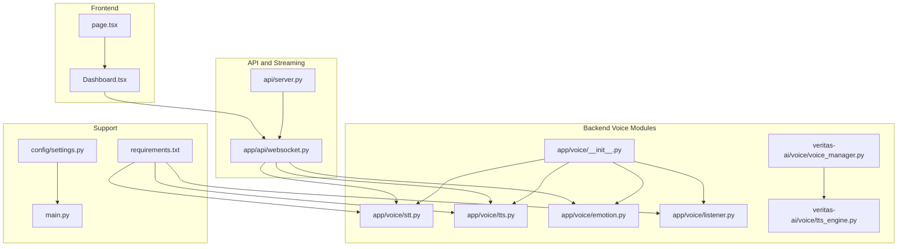
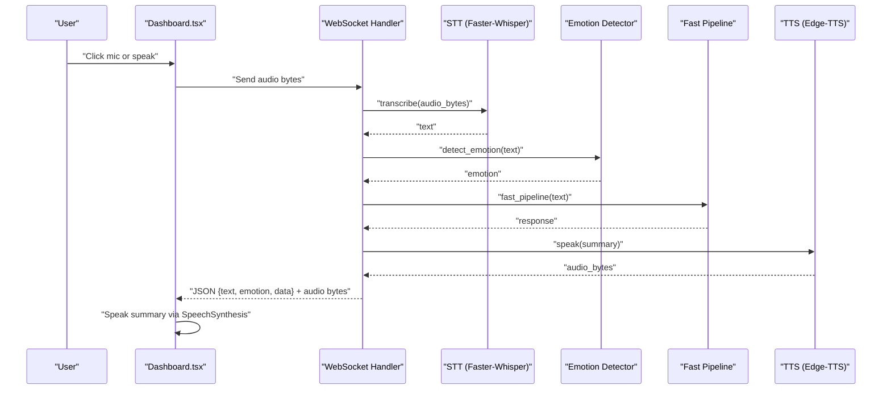
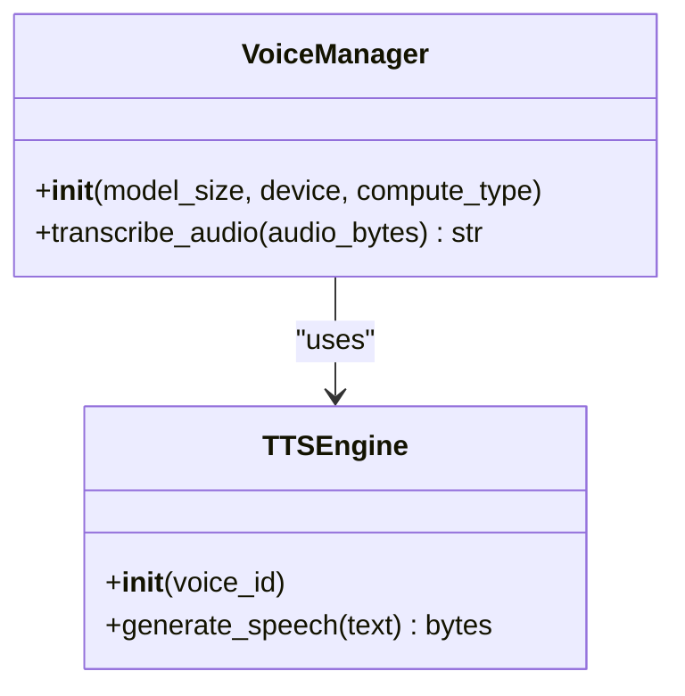
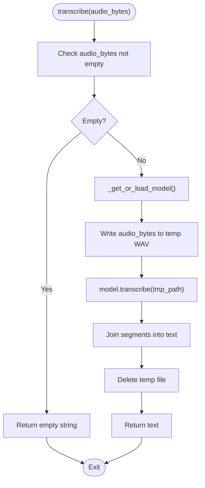
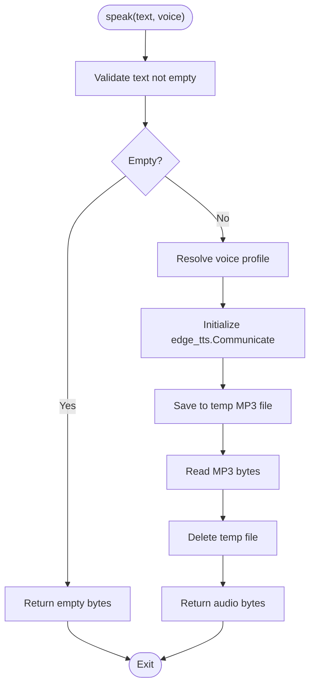
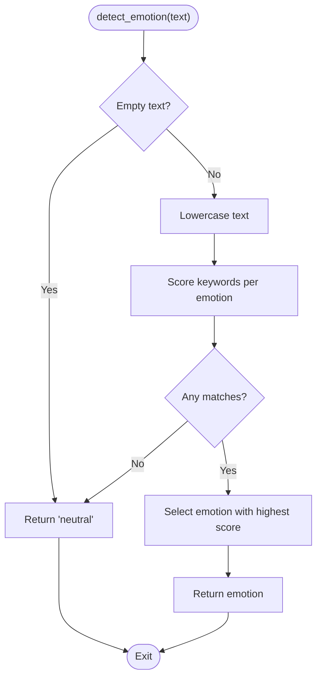
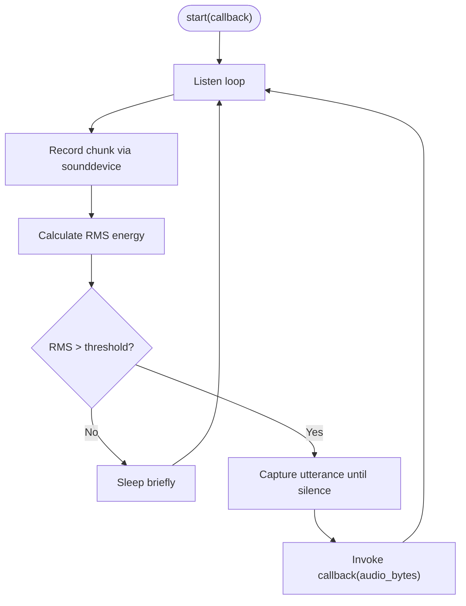
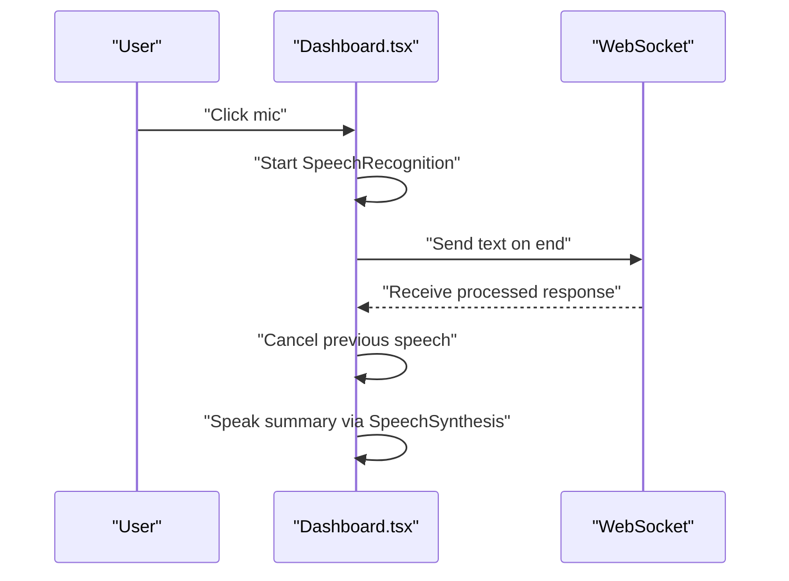
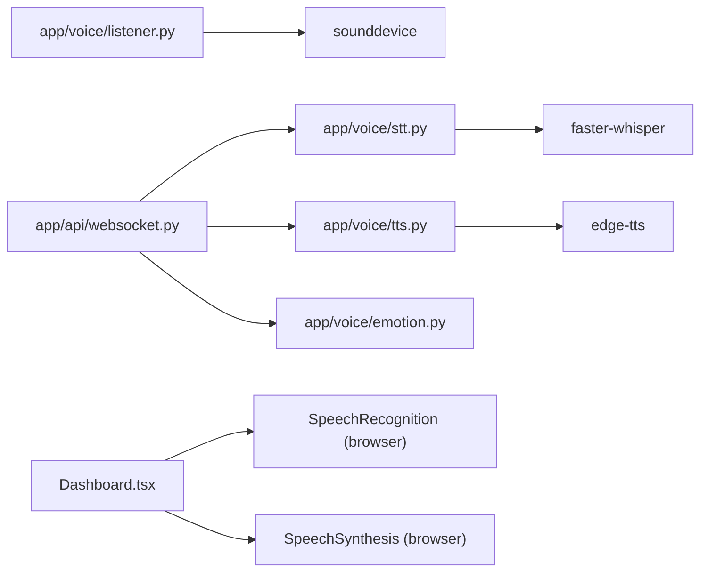

# Voice Interaction Interface

<cite>
**Referenced Files in This Document**
- [voice_manager.py](file://veritas-ai/voice/voice_manager.py)
- [tts_engine.py](file://veritas-ai/voice/tts_engine.py)
- [stt.py](file://veritas-ai/app/voice/stt.py)
- [tts.py](file://veritas-ai/app/voice/tts.py)
- [emotion.py](file://veritas-ai/app/voice/emotion.py)
- [listener.py](file://veritas-ai/app/voice/listener.py)
- [__init__.py](file://veritas-ai/app/voice/__init__.py)
- [websocket.py](file://veritas-ai/app/api/websocket.py)
- [server.py](file://veritas-ai/api/server.py)
- [Dashboard.tsx](file://veritas-ai/frontend/components/Dashboard.tsx)
- [page.tsx](file://veritas-ai/frontend/app/dashboard/page.tsx)
- [requirements.txt](file://veritas-ai/requirements.txt)
- [settings.py](file://veritas-ai/config/settings.py)
- [main.py](file://veritas-ai/main.py)
</cite>

## Table of Contents
1. [Introduction](#introduction)
2. [Project Structure](#project-structure)
3. [Core Components](#core-components)
4. [Architecture Overview](#architecture-overview)
5. [Detailed Component Analysis](#detailed-component-analysis)
6. [Dependency Analysis](#dependency-analysis)
7. [Performance Considerations](#performance-considerations)
8. [Troubleshooting Guide](#troubleshooting-guide)
9. [Conclusion](#conclusion)
10. [Appendices](#appendices)

## Introduction
This document describes the voice interaction interface system designed for hands-free operation and speech-based user interaction. It focuses on the VoiceManager class as the central coordinator for speech-to-text (STT), text-to-speech (TTS), and emotion detection. It also documents the Listener component for continuous audio capture and wake word detection, along with browser compatibility, microphone permissions, and audio quality optimization. Finally, it explains integration patterns with the main dashboard interface, and how voice commands trigger UI actions and data queries.

## Project Structure
The voice system spans backend Python modules under app/voice and veritas-ai/voice, a frontend dashboard component, and supporting API endpoints and WebSocket handlers.

**Diagram sources**
- [Dashboard.tsx:1-312](file://veritas-ai/frontend/components/Dashboard.tsx#L1-L312)
- [page.tsx:1-16](file://veritas-ai/frontend/app/dashboard/page.tsx#L1-L16)
- [stt.py:1-60](file://veritas-ai/app/voice/stt.py#L1-L60)
- [tts.py:1-68](file://veritas-ai/app/voice/tts.py#L1-L68)
- [emotion.py:1-53](file://veritas-ai/app/voice/emotion.py#L1-L53)
- [listener.py:1-169](file://veritas-ai/app/voice/listener.py#L1-L169)
- [__init__.py:1-19](file://veritas-ai/app/voice/__init__.py#L1-L19)
- [voice_manager.py:1-38](file://veritas-ai/voice/voice_manager.py#L1-L38)
- [tts_engine.py:1-30](file://veritas-ai/voice/tts_engine.py#L1-L30)
- [websocket.py:214-252](file://veritas-ai/app/api/websocket.py#L214-L252)
- [server.py:146-151](file://veritas-ai/api/server.py#L146-L151)
- [requirements.txt:1-42](file://veritas-ai/requirements.txt#L1-L42)
- [settings.py:1-83](file://veritas-ai/config/settings.py#L1-L83)
- [main.py:1-141](file://veritas-ai/main.py#L1-L141)

**Section sources**
- [requirements.txt:35-39](file://veritas-ai/requirements.txt#L35-L39)
- [settings.py:70-79](file://veritas-ai/config/settings.py#L70-L79)
- [main.py:76-96](file://veritas-ai/main.py#L76-L96)

## Core Components
- VoiceManager: Central coordinator for STT and TTS operations, with optional Faster-Whisper integration and a dedicated TTS engine.
- STT Engine (Faster-Whisper): Real-time transcription using a lightweight model with lazy loading and thread pooling.
- TTS Engine (Edge-TTS): Asynchronous speech synthesis with configurable voice profiles and temporary file handling.
- Emotion Detection: Keyword-based emotion classification mapped to TTS voice adjustments.
- Listener: Continuous microphone capture with energy-based wake detection and utterance recording.
- Frontend Dashboard: Integrates browser SpeechRecognition for mic-based input and SpeechSynthesis for spoken summaries.

**Section sources**
- [voice_manager.py:11-38](file://veritas-ai/voice/voice_manager.py#L11-L38)
- [stt.py:15-60](file://veritas-ai/app/voice/stt.py#L15-L60)
- [tts.py:32-68](file://veritas-ai/app/voice/tts.py#L32-L68)
- [emotion.py:26-53](file://veritas-ai/app/voice/emotion.py#L26-L53)
- [listener.py:11-169](file://veritas-ai/app/voice/listener.py#L11-L169)
- [Dashboard.tsx:33-91](file://veritas-ai/frontend/components/Dashboard.tsx#L33-L91)

## Architecture Overview
The voice pipeline integrates frontend SpeechRecognition with backend STT/TTS and emotion detection. The WebSocket endpoint orchestrates the full voice flow: receive audio, transcribe, detect emotion, run the fast pipeline, synthesize speech, and stream both text and audio back to the client.

**Diagram sources**
- [Dashboard.tsx:33-91](file://veritas-ai/frontend/components/Dashboard.tsx#L33-L91)
- [websocket.py:214-252](file://veritas-ai/app/api/websocket.py#L214-L252)
- [stt.py:52-60](file://veritas-ai/app/voice/stt.py#L52-L60)
- [emotion.py:26-47](file://veritas-ai/app/voice/emotion.py#L26-L47)
- [tts.py:32-68](file://veritas-ai/app/voice/tts.py#L32-L68)

## Detailed Component Analysis

### VoiceManager (Backend Coordinator)
- Purpose: Provides a unified interface for STT and TTS operations, with optional Faster-Whisper model initialization and thread-safe transcription.
- Key behaviors:
  - Lazy model loading with graceful fallback when Faster-Whisper is unavailable.
  - Asynchronous transcription using a thread pool to avoid blocking the event loop.
  - Simple API for downstream components.

**Diagram sources**
- [voice_manager.py:11-38](file://veritas-ai/voice/voice_manager.py#L11-L38)
- [tts_engine.py:12-30](file://veritas-ai/voice/tts_engine.py#L12-L30)

**Section sources**
- [voice_manager.py:11-38](file://veritas-ai/voice/voice_manager.py#L11-L38)
- [tts_engine.py:12-30](file://veritas-ai/voice/tts_engine.py#L12-L30)

### STT Engine (Faster-Whisper)
- Purpose: Real-time speech-to-text using a lightweight Whisper model.
- Key behaviors:
  - Lazy-loading of the model on first use with thread-safe locking.
  - Synchronous transcription executed in a thread pool to keep the event loop responsive.
  - Temporary file handling for audio input and cleanup after transcription.

**Diagram sources**
- [stt.py:52-60](file://veritas-ai/app/voice/stt.py#L52-L60)
- [stt.py:30-50](file://veritas-ai/app/voice/stt.py#L30-L50)
- [stt.py:15-27](file://veritas-ai/app/voice/stt.py#L15-L27)

**Section sources**
- [stt.py:15-60](file://veritas-ai/app/voice/stt.py#L15-L60)

### TTS Engine (Edge-TTS)
- Purpose: Asynchronous text-to-speech generation with configurable voice profiles.
- Key behaviors:
  - Uses Edge-TTS to produce MP3 audio asynchronously.
  - Manages temporary files and cleans up after synthesis.
  - Supports dynamic voice selection via profile names.

**Diagram sources**
- [tts.py:32-68](file://veritas-ai/app/voice/tts.py#L32-L68)

**Section sources**
- [tts.py:32-68](file://veritas-ai/app/voice/tts.py#L32-L68)

### Emotion Detection
- Purpose: Classify detected emotion from text using keyword matching and map to voice adjustments.
- Key behaviors:
  - Keyword-based scoring across predefined emotion categories.
  - Neutral default when no keywords match.
  - Voice adjustment parameters returned for TTS tuning.

**Diagram sources**
- [emotion.py:26-47](file://veritas-ai/app/voice/emotion.py#L26-L47)

**Section sources**
- [emotion.py:26-53](file://veritas-ai/app/voice/emotion.py#L26-L53)

### Listener (Continuous Audio Capture)
- Purpose: Background microphone listener with energy-based wake detection and utterance capture.
- Key behaviors:
  - Configurable energy threshold, silence timeout, sample rate, and chunk size.
  - Records audio chunks, detects wake via RMS energy, captures full utterance until silence.
  - Runs in a background task and exposes a callback for captured audio bytes.

**Diagram sources**
- [listener.py:73-117](file://veritas-ai/app/voice/listener.py#L73-L117)
- [listener.py:118-160](file://veritas-ai/app/voice/listener.py#L118-L160)

**Section sources**
- [listener.py:11-169](file://veritas-ai/app/voice/listener.py#L11-L169)

### Frontend Dashboard Integration
- Purpose: Provide a hands-free experience via browser SpeechRecognition and SpeechSynthesis.
- Key behaviors:
  - Toggle microphone button to start/stop browser-based speech recognition.
  - Stream recognized text to the backend via WebSocket.
  - Automatically speak synthesized summaries using SpeechSynthesis.

**Diagram sources**
- [Dashboard.tsx:33-91](file://veritas-ai/frontend/components/Dashboard.tsx#L33-L91)
- [Dashboard.tsx:101-117](file://veritas-ai/frontend/components/Dashboard.tsx#L101-L117)

**Section sources**
- [Dashboard.tsx:33-91](file://veritas-ai/frontend/components/Dashboard.tsx#L33-L91)
- [Dashboard.tsx:101-117](file://veritas-ai/frontend/components/Dashboard.tsx#L101-L117)

## Dependency Analysis
- Backend voice modules depend on external libraries:
  - Faster-Whisper for STT.
  - Edge-TTS for TTS.
  - SoundDevice for local microphone capture.
- Frontend depends on browser APIs:
  - SpeechRecognition for mic-based input.
  - SpeechSynthesis for spoken summaries.
- API endpoints and WebSocket handlers orchestrate the voice pipeline.

**Diagram sources**
- [stt.py:20-26](file://veritas-ai/app/voice/stt.py#L20-L26)
- [tts.py:44-61](file://veritas-ai/app/voice/tts.py#L44-L61)
- [listener.py:76-80](file://veritas-ai/app/voice/listener.py#L76-L80)
- [Dashboard.tsx:36-41](file://veritas-ai/frontend/components/Dashboard.tsx#L36-L41)
- [Dashboard.tsx:103-113](file://veritas-ai/frontend/components/Dashboard.tsx#L103-L113)
- [websocket.py:214-252](file://veritas-ai/app/api/websocket.py#L214-L252)

**Section sources**
- [requirements.txt:35-39](file://veritas-ai/requirements.txt#L35-L39)
- [Dashboard.tsx:36-41](file://veritas-ai/frontend/components/Dashboard.tsx#L36-L41)
- [Dashboard.tsx:103-113](file://veritas-ai/frontend/components/Dashboard.tsx#L103-L113)

## Performance Considerations
- STT latency:
  - Faster-Whisper model is loaded lazily and reused; transcription runs in a thread pool to avoid blocking.
  - Using a smaller model size reduces latency at the cost of accuracy.
- TTS throughput:
  - Edge-TTS writes to a temporary file; ensure efficient cleanup and avoid frequent disk I/O.
  - Voice selection is immediate; avoid unnecessary reinitialization.
- Listener efficiency:
  - Tune energy threshold and chunk size to balance responsiveness and CPU usage.
  - Silence detection prevents unnecessary recording and improves user experience.
- Frontend responsiveness:
  - SpeechRecognition operates in the browser; ensure continuous mode and interim results for fluid UX.
  - SpeechSynthesis is synchronous; cancel ongoing utterances before starting new ones.

[No sources needed since this section provides general guidance]

## Troubleshooting Guide
- STT disabled:
  - If Faster-Whisper is not installed, transcription returns empty text and logs a warning.
  - Install the dependency to enable STT.
- TTS failures:
  - If Edge-TTS is missing, TTS returns empty bytes and logs an error.
  - Install the dependency and ensure network connectivity for audio generation.
- Microphone access:
  - Listener requires sounddevice; installation errors are logged and the listener stops.
  - Ensure proper OS-level microphone permissions and device availability.
- Browser SpeechRecognition/SpeechSynthesis:
  - Not all browsers support these APIs; the frontend checks for vendor-prefixed implementations.
  - Some environments restrict microphone access; prompt users to grant permissions.
- WebSocket voice pipeline:
  - Errors during transcription, emotion detection, or TTS are caught and reported as JSON error messages.
  - Audio streaming follows the JSON message; verify audio length indicates successful synthesis.

**Section sources**
- [voice_manager.py:16-18](file://veritas-ai/voice/voice_manager.py#L16-L18)
- [stt.py:24-26](file://veritas-ai/app/voice/stt.py#L24-L26)
- [tts.py:59-61](file://veritas-ai/app/voice/tts.py#L59-L61)
- [listener.py:77-80](file://veritas-ai/app/voice/listener.py#L77-L80)
- [Dashboard.tsx:36-41](file://veritas-ai/frontend/components/Dashboard.tsx#L36-L41)
- [Dashboard.tsx:103-113](file://veritas-ai/frontend/components/Dashboard.tsx#L103-L113)
- [websocket.py:242-247](file://veritas-ai/app/api/websocket.py#L242-L247)

## Conclusion
The voice interaction interface combines robust backend STT/TTS engines with a responsive frontend to deliver a hands-free experience. The VoiceManager and related components coordinate transcription, emotion-aware voice synthesis, and continuous audio capture. Integration with the dashboard enables seamless voice-driven queries and spoken responses, while careful attention to dependencies, browser compatibility, and performance ensures reliable operation across environments.

[No sources needed since this section summarizes without analyzing specific files]

## Appendices

### Integration Patterns with Dashboard
- Voice commands:
  - Browser-based SpeechRecognition sends recognized text to the WebSocket endpoint.
  - Backend processes the text, synthesizes speech, and streams both text and audio to the client.
- UI actions:
  - The dashboard toggles microphone state and disables execution during processing.
  - On receiving a response, it speaks the summary using SpeechSynthesis.

**Section sources**
- [Dashboard.tsx:33-91](file://veritas-ai/frontend/components/Dashboard.tsx#L33-L91)
- [Dashboard.tsx:101-117](file://veritas-ai/frontend/components/Dashboard.tsx#L101-L117)
- [websocket.py:214-252](file://veritas-ai/app/api/websocket.py#L214-L252)

### Voice Profiles and Emotion Mapping
- Voice profiles:
  - Backend supports multiple voice profiles selectable at runtime.
- Emotion mapping:
  - Emotion keywords map to voice adjustments for rate and pitch.

**Section sources**
- [tts.py:10-16](file://veritas-ai/app/voice/tts.py#L10-L16)
- [emotion.py:17-23](file://veritas-ai/app/voice/emotion.py#L17-L23)