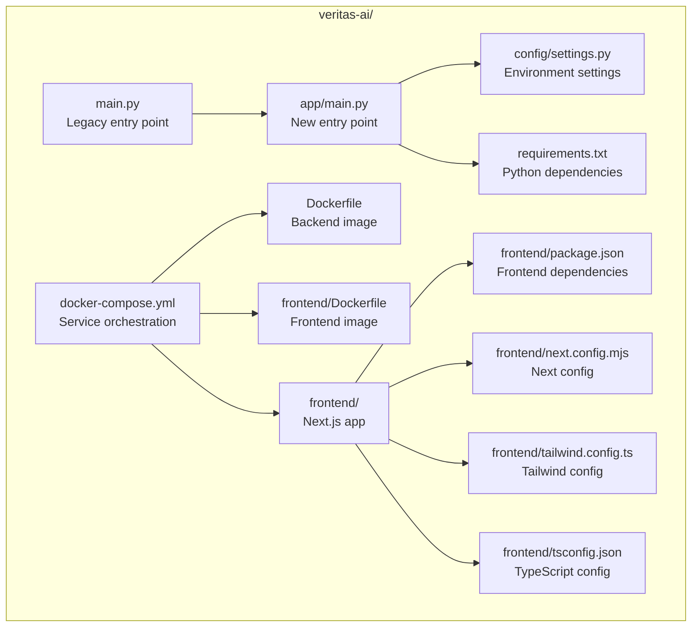
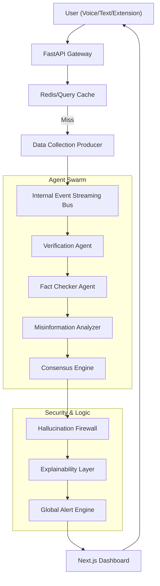
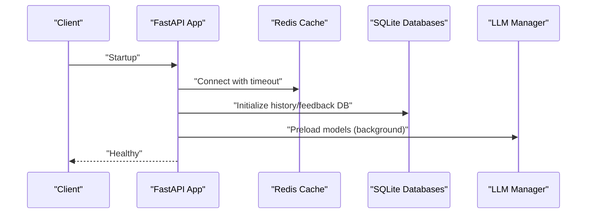
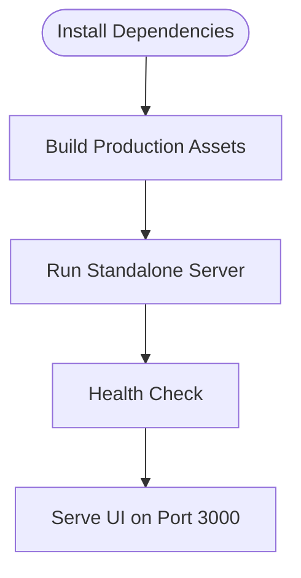
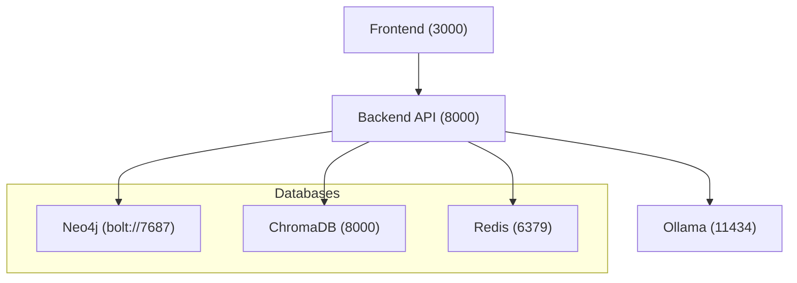
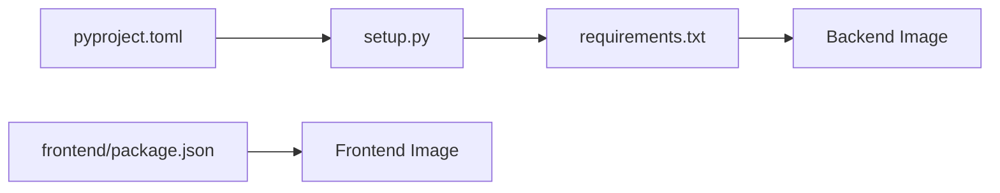

# Getting Started

<cite>
**Referenced Files in This Document**
- [README.md](file://veritas-ai/README.md)
- [docker-compose.yml](file://veritas-ai/docker-compose.yml)
- [Dockerfile](file://veritas-ai/Dockerfile)
- [requirements.txt](file://veritas-ai/requirements.txt)
- [run_project.sh](file://run_project.sh)
- [setup.py](file://setup.py)
- [pyproject.toml](file://pyproject.toml)
- [main.py](file://veritas-ai/main.py)
- [app/main.py](file://veritas-ai/app/main.py)
- [config/settings.py](file://veritas-ai/config/settings.py)
- [frontend/package.json](file://veritas-ai/frontend/package.json)
- [frontend/Dockerfile](file://veritas-ai/frontend/Dockerfile)
- [frontend/next.config.mjs](file://veritas-ai/frontend/next.config.mjs)
- [frontend/tailwind.config.ts](file://veritas-ai/frontend/tailwind.config.ts)
- [frontend/tsconfig.json](file://veritas-ai/frontend/tsconfig.json)
</cite>

## Table of Contents
1. [Introduction](#introduction)
2. [Project Structure](#project-structure)
3. [Core Components](#core-components)
4. [Architecture Overview](#architecture-overview)
5. [Detailed Component Analysis](#detailed-component-analysis)
6. [Dependency Analysis](#dependency-analysis)
7. [Performance Considerations](#performance-considerations)
8. [Troubleshooting Guide](#troubleshooting-guide)
9. [Conclusion](#conclusion)
10. [Appendices](#appendices)

## Introduction
This guide helps you deploy Veritas AI rapidly for development and production. It covers:
- Manual local setup using Python virtual environments and Node.js
- Docker-based production deployment with Docker Compose
- Backend services, frontend Next.js application, and database dependencies
- Verification steps and troubleshooting for common issues

Veritas AI is a production-grade, asynchronous event-driven intelligence platform for real-time news verification and misinformation analysis.

**Section sources**
- [README.md:13-18](file://veritas-ai/README.md#L13-L18)

## Project Structure
The repository is organized around a modular backend (Python/FastAPI), a Next.js frontend, and supporting infrastructure (Neo4j, ChromaDB, Redis, Ollama). Docker Compose orchestrates all services.

**Diagram sources**
- [main.py:1-141](file://veritas-ai/main.py#L1-L141)
- [app/main.py:1-208](file://veritas-ai/app/main.py#L1-L208)
- [config/settings.py:1-83](file://veritas-ai/config/settings.py#L1-L83)
- [requirements.txt:1-42](file://veritas-ai/requirements.txt#L1-L42)
- [Dockerfile:1-81](file://veritas-ai/Dockerfile#L1-L81)
- [docker-compose.yml:1-160](file://veritas-ai/docker-compose.yml#L1-L160)
- [frontend/Dockerfile:1-54](file://veritas-ai/frontend/Dockerfile#L1-L54)
- [frontend/package.json:1-27](file://veritas-ai/frontend/package.json#L1-L27)
- [frontend/next.config.mjs:1-8](file://veritas-ai/frontend/next.config.mjs#L1-L8)
- [frontend/tailwind.config.ts:1-24](file://veritas-ai/frontend/tailwind.config.ts#L1-L24)
- [frontend/tsconfig.json:1-28](file://veritas-ai/frontend/tsconfig.json#L1-L28)

**Section sources**
- [README.md:63-92](file://veritas-ai/README.md#L63-L92)
- [docker-compose.yml:1-160](file://veritas-ai/docker-compose.yml#L1-L160)

## Core Components
- Backend API (FastAPI): Entry points and lifecycle management are defined in both legacy and new modules. The new entry point is recommended for production.
- Configuration: Environment-driven settings for models, databases, and runtime behavior.
- Dependencies: Python packages pinned for stability; Node.js packages for the frontend.
- Docker: Multi-stage builds for secure, minimal containers with health checks.
- Frontend: Next.js 14 with TypeScript, Tailwind CSS, and a standalone output for production.

Key capabilities include multi-agent verification, predictive trends, knowledge graph, RLHF feedback loop, voice-first interface, and a Chrome extension.

**Section sources**
- [README.md:19-30](file://veritas-ai/README.md#L19-L30)
- [app/main.py:106-208](file://veritas-ai/app/main.py#L106-L208)
- [config/settings.py:13-83](file://veritas-ai/config/settings.py#L13-L83)
- [requirements.txt:1-42](file://veritas-ai/requirements.txt#L1-L42)
- [frontend/package.json:1-27](file://veritas-ai/frontend/package.json#L1-L27)

## Architecture Overview
The system follows an event-driven, asynchronous architecture with a FastAPI gateway, Redis cache, internal event bus, agent swarm, and a Next.js dashboard.

**Diagram sources**
- [README.md:37-59](file://veritas-ai/README.md#L37-L59)

## Detailed Component Analysis

### Backend Services (Python/FastAPI)
- Entry points:
  - Legacy: [main.py:137-141](file://veritas-ai/main.py#L137-L141)
  - New (recommended): [app/main.py:106-208](file://veritas-ai/app/main.py#L106-L208)
- Lifecycle:
  - Startup: cache initialization, database initialization, background model preload
  - Shutdown: cleanup tasks and cache close
- Health endpoint: [app/main.py:125-135](file://veritas-ai/app/main.py#L125-L135)
- Configuration:
  - Environment variables for models, databases, and runtime behavior
  - CORS, timeouts, rate limiting, and error handling middleware
- Dependencies:
  - FastAPI, Uvicorn, LangChain ecosystem, ChromaDB, Neo4j, Redis, Playwright, Transformers, Torch, WebSockets, and more

**Diagram sources**
- [app/main.py:33-101](file://veritas-ai/app/main.py#L33-L101)

**Section sources**
- [app/main.py:31-102](file://veritas-ai/app/main.py#L31-L102)
- [config/settings.py:13-83](file://veritas-ai/config/settings.py#L13-L83)
- [requirements.txt:1-42](file://veritas-ai/requirements.txt#L1-L42)

### Frontend Next.js Application
- Framework: Next.js 14 with TypeScript and Tailwind CSS
- Build configuration: Standalone output for efficient containerization
- Environment injection: Build args for API and WebSocket base URLs
- Dependencies: React, Next, Tailwind, Charting, and TypeScript tooling

**Diagram sources**
- [frontend/Dockerfile:1-54](file://veritas-ai/frontend/Dockerfile#L1-L54)
- [frontend/next.config.mjs:1-8](file://veritas-ai/frontend/next.config.mjs#L1-L8)
- [frontend/package.json:1-27](file://veritas-ai/frontend/package.json#L1-L27)

**Section sources**
- [frontend/package.json:1-27](file://veritas-ai/frontend/package.json#L1-L27)
- [frontend/next.config.mjs:1-8](file://veritas-ai/frontend/next.config.mjs#L1-L8)
- [frontend/tailwind.config.ts:1-24](file://veritas-ai/frontend/tailwind.config.ts#L1-L24)
- [frontend/tsconfig.json:1-28](file://veritas-ai/frontend/tsconfig.json#L1-L28)

### Database and Infrastructure Dependencies
- Neo4j: Knowledge Graph storage with APOC plugin
- ChromaDB: Vector database for retrieval
- Redis: Session cache and query cache
- Ollama: Local LLM inference server
- SQLite: Lightweight session and feedback stores initialized at runtime

**Diagram sources**
- [docker-compose.yml:72-141](file://veritas-ai/docker-compose.yml#L72-L141)

**Section sources**
- [docker-compose.yml:72-141](file://veritas-ai/docker-compose.yml#L72-L141)

## Dependency Analysis
- Python packaging:
  - Distribution metadata and package discovery
  - Project-level dependencies pinned for reproducibility
- Backend containerization:
  - Multi-stage build for reduced footprint
  - Non-root user, system dependencies for audio/browser support
- Frontend containerization:
  - Separated stages for dependencies, build, and runtime
  - Standalone output for minimal runtime image

**Diagram sources**
- [pyproject.toml:1-23](file://pyproject.toml#L1-L23)
- [setup.py:1-9](file://setup.py#L1-L9)
- [requirements.txt:1-42](file://veritas-ai/requirements.txt#L1-L42)
- [frontend/package.json:1-27](file://veritas-ai/frontend/package.json#L1-L27)

**Section sources**
- [pyproject.toml:1-23](file://pyproject.toml#L1-L23)
- [setup.py:1-9](file://setup.py#L1-L9)
- [requirements.txt:1-42](file://veritas-ai/requirements.txt#L1-L42)
- [frontend/package.json:1-27](file://veritas-ai/frontend/package.json#L1-L27)

## Performance Considerations
- Fast startup: Parallel initialization of cache and databases; background model preload
- Timeouts: Configurable pipeline and agent task timeouts
- Caching: Redis-backed with graceful fallback; SQLite initialization on demand
- Container resources: Redis configured with memory limits; Playwright installed for optional web scraping

**Section sources**
- [app/main.py:33-101](file://veritas-ai/app/main.py#L33-L101)
- [config/settings.py:20-28](file://veritas-ai/config/settings.py#L20-L28)
- [Dockerfile:109-123](file://veritas-ai/docker-compose.yml#L109-L123)

## Troubleshooting Guide
Common setup issues and resolutions:

- Docker not installed
  - Symptom: Failure to start services
  - Resolution: Install Docker and retry the Docker Compose workflow
  - Reference: [run_project.sh:17-40](file://run_project.sh#L17-L40)

- Backend health check fails
  - Symptom: UI shows unhealthy backend
  - Resolution: Verify environment variables and service dependencies; check logs
  - Reference: [docker-compose.yml:42-47](file://veritas-ai/docker-compose.yml#L42-L47), [app/main.py:125-135](file://veritas-ai/app/main.py#L125-L135)

- Port conflicts
  - Symptom: Ports already in use
  - Resolution: Change exposed ports in docker-compose.yml or stop conflicting services
  - Reference: [docker-compose.yml:11-12](file://veritas-ai/docker-compose.yml#L11-L12), [docker-compose.yml:61-62](file://veritas-ai/docker-compose.yml#L61-L62)

- Database connectivity
  - Symptom: Neo4j/Redis/Chroma not reachable
  - Resolution: Confirm credentials and health checks; ensure volumes are mounted
  - Reference: [docker-compose.yml:79-92](file://veritas-ai/docker-compose.yml#L79-L92), [docker-compose.yml:119-123](file://veritas-ai/docker-compose.yml#L119-L123), [docker-compose.yml:101-106](file://veritas-ai/docker-compose.yml#L101-L106)

- Environment variables
  - Symptom: Unexpected behavior or missing features
  - Resolution: Review settings.py defaults and override via environment variables
  - Reference: [config/settings.py:13-83](file://veritas-ai/config/settings.py#L13-L83)

- Frontend build/runtime errors
  - Symptom: Build failures or runtime warnings
  - Resolution: Ensure Node.js version compatibility and rebuild with injected API URLs
  - Reference: [frontend/Dockerfile:19-25](file://veritas-ai/frontend/Dockerfile#L19-L25), [frontend/package.json:1-27](file://veritas-ai/frontend/package.json#L1-L27)

**Section sources**
- [run_project.sh:17-40](file://run_project.sh#L17-L40)
- [docker-compose.yml:42-47](file://veritas-ai/docker-compose.yml#L42-L47)
- [app/main.py:125-135](file://veritas-ai/app/main.py#L125-L135)
- [docker-compose.yml:11-12](file://veritas-ai/docker-compose.yml#L11-L12)
- [docker-compose.yml:61-62](file://veritas-ai/docker-compose.yml#L61-L62)
- [docker-compose.yml:79-92](file://veritas-ai/docker-compose.yml#L79-L92)
- [docker-compose.yml:119-123](file://veritas-ai/docker-compose.yml#L119-L123)
- [docker-compose.yml:101-106](file://veritas-ai/docker-compose.yml#L101-L106)
- [config/settings.py:13-83](file://veritas-ai/config/settings.py#L13-L83)
- [frontend/Dockerfile:19-25](file://veritas-ai/frontend/Dockerfile#L19-L25)
- [frontend/package.json:1-27](file://veritas-ai/frontend/package.json#L1-L27)

## Conclusion
You now have the essentials to deploy Veritas AI quickly:
- Local development with Python virtual environments and Node.js
- Production-ready Docker Compose deployment
- Verified endpoints and environment configuration
- Troubleshooting guidance for common issues

Proceed to the next steps to verify your installation and explore the dashboard.

## Appendices

### A. Step-by-Step Installation

- Prerequisites
  - Python 3.9+ and pip
  - Node.js 18+ and npm
  - Docker and Docker Compose

- Manual local setup
  - Backend
    - Create and activate a Python virtual environment
    - Install dependencies from requirements.txt
    - Run the new entry point via Uvicorn
    - References: [requirements.txt:1-42](file://veritas-ai/requirements.txt#L1-L42), [app/main.py:106-208](file://veritas-ai/app/main.py#L106-L208)
  - Frontend
    - Install dependencies from frontend/package.json
    - Run the development server
    - References: [frontend/package.json:1-27](file://veritas-ai/frontend/package.json#L1-L27)

- Docker-based deployment
  - Build and start all services with Docker Compose
  - Access backend health, frontend UI, and database dashboards
  - References: [docker-compose.yml:1-160](file://veritas-ai/docker-compose.yml#L1-L160), [run_project.sh:17-40](file://run_project.sh#L17-L40)

**Section sources**
- [README.md:65-92](file://veritas-ai/README.md#L65-L92)
- [requirements.txt:1-42](file://veritas-ai/requirements.txt#L1-L42)
- [frontend/package.json:1-27](file://veritas-ai/frontend/package.json#L1-L27)
- [docker-compose.yml:1-160](file://veritas-ai/docker-compose.yml#L1-L160)
- [run_project.sh:17-40](file://run_project.sh#L17-L40)

### B. Verification Steps

- Backend health
  - Endpoint: GET /api/v1/health
  - Expected: Status healthy and service info
  - Reference: [app/main.py:125-135](file://veritas-ai/app/main.py#L125-L135)

- Frontend availability
  - UI: http://localhost:3000
  - Health check included in frontend Dockerfile
  - Reference: [frontend/Dockerfile:50-51](file://veritas-ai/frontend/Dockerfile#L50-L51)

- Database dashboards
  - Neo4j: http://localhost:7474
  - Redis: http://localhost:6379
  - ChromaDB: http://localhost:8200
  - Reference: [docker-compose.yml:76-106](file://veritas-ai/docker-compose.yml#L76-L106)

**Section sources**
- [app/main.py:125-135](file://veritas-ai/app/main.py#L125-L135)
- [frontend/Dockerfile:50-51](file://veritas-ai/frontend/Dockerfile#L50-L51)
- [docker-compose.yml:76-106](file://veritas-ai/docker-compose.yml#L76-L106)

### C. Environment Variables Reference

- Core runtime
  - PIPELINE_TIMEOUT_SECONDS, AGENT_TASK_TIMEOUT_SECONDS, CACHE_TTL_SECONDS, CACHE_MAX_ENTRIES
- Public URLs
  - PUBLIC_API_BASE_URL, PUBLIC_WS_BASE_URL
- Models
  - OLLAMA_BASE_URL, MODEL_NAME, ROUTER_MODEL, FAST_MODEL, EMBEDDING_MODEL, RETRIEVAL_K
- Databases
  - NEO4J_URI, NEO4J_USER, NEO4J_PASSWORD, REDIS_HOST, REDIS_PORT, REDIS_DB, CHROMA_PERSIST_DIRECTORY
- Security and performance
  - CORS_ORIGINS_RAW, MAX_PARALLEL_TOOLS, ENABLE_STREAMING, STREAM_CHUNK_SIZE

**Section sources**
- [config/settings.py:20-76](file://veritas-ai/config/settings.py#L20-L76)