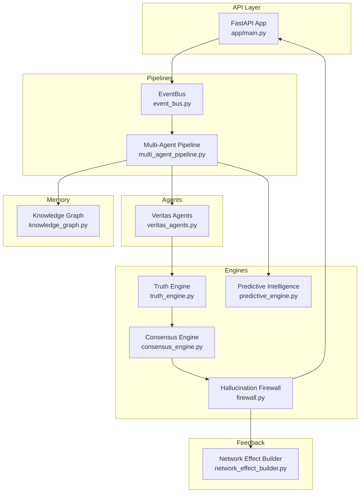
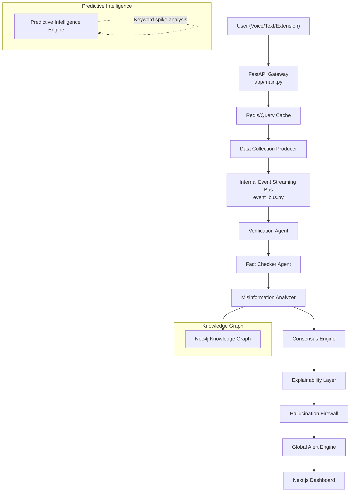
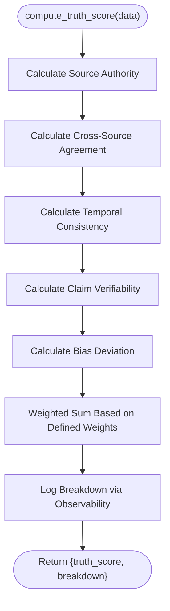
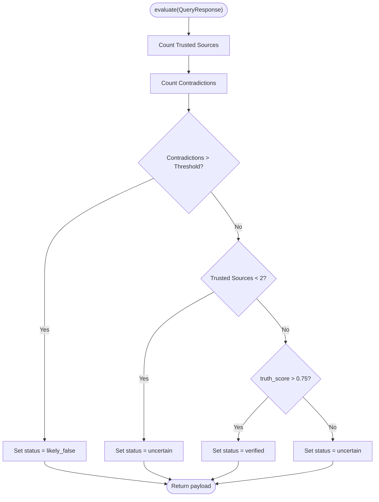
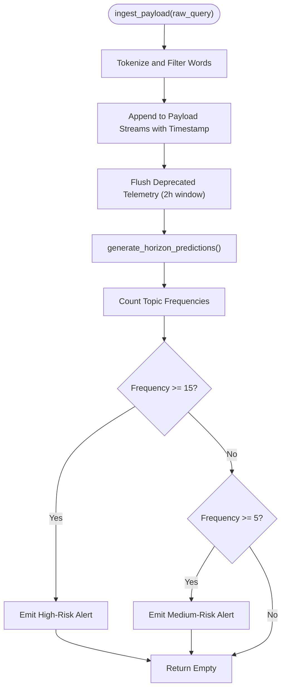
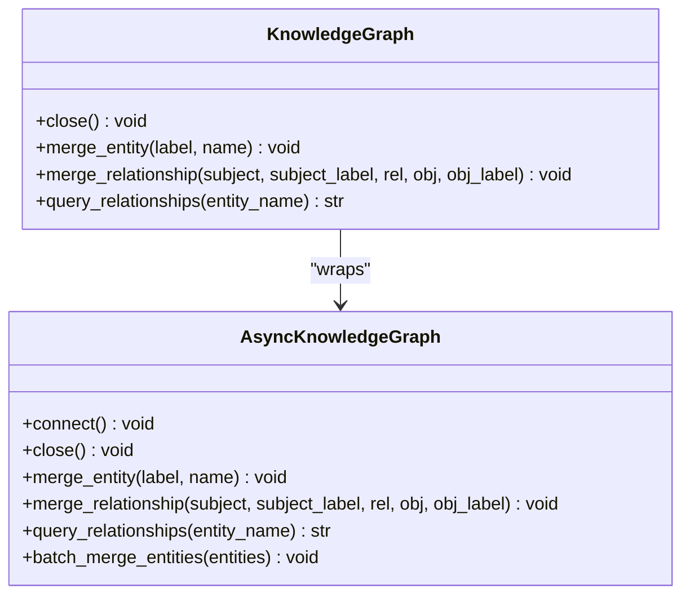
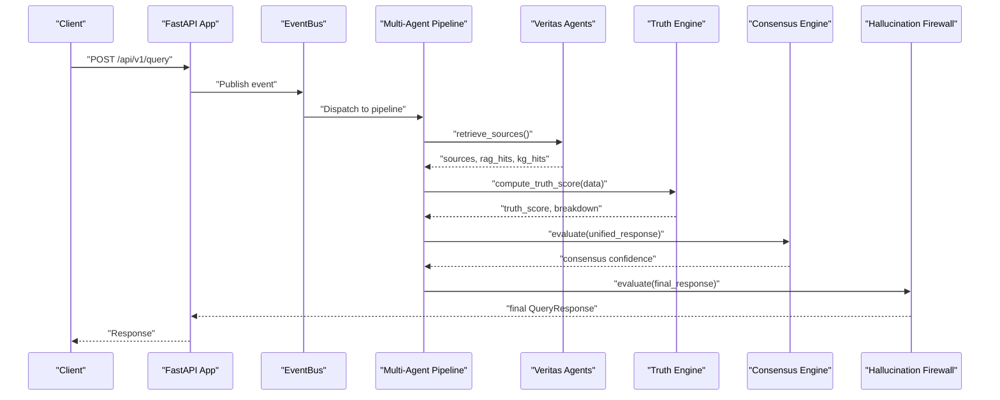
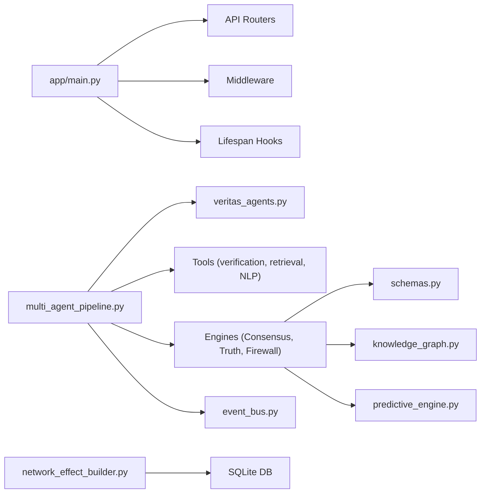

# Project Overview

<cite>
**Referenced Files in This Document**
- [README.md](file://veritas-ai/README.md)
- [main.py](file://veritas-ai/main.py)
- [app/main.py](file://veritas-ai/app/main.py)
- [multi_agent_pipeline.py](file://veritas-ai/pipelines/multi_agent_pipeline.py)
- [event_bus.py](file://veritas-ai/pipelines/event_bus.py)
- [veritas_agents.py](file://veritas-ai/agents/veritas_agents.py)
- [truth_engine.py](file://veritas-ai/core/truth_engine.py)
- [validation_engine.py](file://veritas-ai/core/validation_engine.py)
- [consensus_engine.py](file://veritas-ai/core/consensus_engine.py)
- [firewall.py](file://veritas-ai/core/firewall.py)
- [predictive_engine.py](file://veritas-ai/core/predictive_engine.py)
- [knowledge_graph.py](file://veritas-ai/memory/knowledge_graph.py)
- [schemas.py](file://veritas-ai/models/schemas.py)
- [network_effect_builder.py](file://veritas-ai/feedback/network_effect_builder.py)
</cite>

## Table of Contents
1. [Introduction](#introduction)
2. [Project Structure](#project-structure)
3. [Core Components](#core-components)
4. [Architecture Overview](#architecture-overview)
5. [Detailed Component Analysis](#detailed-component-analysis)
6. [Dependency Analysis](#dependency-analysis)
7. [Performance Considerations](#performance-considerations)
8. [Troubleshooting Guide](#troubleshooting-guide)
9. [Conclusion](#conclusion)

## Introduction
Veritas AI is an AI-powered truth engine platform designed to operate as a real-time, multi-agent intelligence system for fake news detection and misinformation analysis. Its purpose is to verify claims, expose misleading narratives, and provide mathematical precision in truth scoring. The platform emphasizes:
- Mathematical precision verification via a dedicated Truth Engine
- Real-time collaborative agents orchestrated through an event-driven pipeline
- Production-grade deployment readiness with Docker and scalable infrastructure
- Predictive intelligence capabilities to anticipate misinformation trends
- A hallucination firewall to guard against unverified or contradictory outputs

These capabilities are reflected consistently across the codebase under terms such as “hallucination firewall,” “predictive trends,” and “knowledge graph.”

## Project Structure
The repository is organized into modular components that support a layered, event-driven architecture:
- Core engines: Truth Engine, Consensus Engine, Predictive Intelligence, Hallucination Firewall, and Knowledge Graph
- Pipelines: Multi-agent orchestration and event bus for asynchronous processing
- Agents: Lightweight async utilities that the pipelines call
- API and Frontend: FastAPI gateway and Next.js dashboard
- Feedback and RLHF: Network effect builder for continuous learning
- Tools and utilities: NLP, verification, retrieval, and web scraping tools

**Diagram sources**
- [app/main.py:106-208](file://veritas-ai/app/main.py#L106-L208)
- [event_bus.py:6-74](file://veritas-ai/pipelines/event_bus.py#L6-L74)
- [multi_agent_pipeline.py:209-332](file://veritas-ai/pipelines/multi_agent_pipeline.py#L209-L332)
- [veritas_agents.py:7-44](file://veritas-ai/agents/veritas_agents.py#L7-L44)
- [truth_engine.py:3-117](file://veritas-ai/core/truth_engine.py#L3-L117)
- [consensus_engine.py:3-26](file://veritas-ai/core/consensus_engine.py#L3-L26)
- [firewall.py:4-47](file://veritas-ai/core/firewall.py#L4-L47)
- [predictive_engine.py:5-63](file://veritas-ai/core/predictive_engine.py#L5-L63)
- [knowledge_graph.py:12-160](file://veritas-ai/memory/knowledge_graph.py#L12-L160)
- [network_effect_builder.py:24-80](file://veritas-ai/feedback/network_effect_builder.py#L24-L80)

**Section sources**
- [README.md:33-59](file://veritas-ai/README.md#L33-L59)
- [app/main.py:106-208](file://veritas-ai/app/main.py#L106-L208)
- [event_bus.py:6-74](file://veritas-ai/pipelines/event_bus.py#L6-L74)
- [multi_agent_pipeline.py:209-332](file://veritas-ai/pipelines/multi_agent_pipeline.py#L209-L332)

## Core Components
- Truth Engine: Computes a multi-factor mathematical truth score using weighted criteria such as source authority, cross-source agreement, temporal consistency, claim verifiability, and bias deviation.
- Consensus Engine: Unifies confidence from LLM inference, classifier validation, and deterministic rule metrics into a deterministic consensus score.
- Hallucination Firewall: Applies strict thresholds to override statuses based on contradiction counts, trusted source thresholds, and truth score thresholds.
- Predictive Intelligence Engine: Detects emerging misinformation trends by analyzing keyword spikes and generating predictive alerts.
- Knowledge Graph: Async Neo4j-backed entity-relationship storage for graph validation and logical fallacy detection.
- Multi-Agent Pipeline: Orchestrates research, parallel validation, and response building with caching and event streaming.
- Event Bus: Asynchronous message broker enabling decoupled, in-memory streaming between pipeline stages.
- Veritas Agents: Lightweight async utilities for retrieval, validation, and response generation.
- Network Effect Builder: Aggregates user feedback into RLHF datasets for model refinement.

**Section sources**
- [truth_engine.py:3-117](file://veritas-ai/core/truth_engine.py#L3-L117)
- [consensus_engine.py:3-26](file://veritas-ai/core/consensus_engine.py#L3-L26)
- [firewall.py:4-47](file://veritas-ai/core/firewall.py#L4-L47)
- [predictive_engine.py:5-63](file://veritas-ai/core/predictive_engine.py#L5-L63)
- [knowledge_graph.py:12-160](file://veritas-ai/memory/knowledge_graph.py#L12-L160)
- [multi_agent_pipeline.py:209-332](file://veritas-ai/pipelines/multi_agent_pipeline.py#L209-L332)
- [event_bus.py:6-74](file://veritas-ai/pipelines/event_bus.py#L6-L74)
- [veritas_agents.py:7-44](file://veritas-ai/agents/veritas_agents.py#L7-L44)
- [network_effect_builder.py:24-80](file://veritas-ai/feedback/network_effect_builder.py#L24-L80)

## Architecture Overview
Veritas AI follows a topological, event-driven stream architecture to achieve sub-2-second latency for complex multi-pass verifications. The system integrates:
- An API gateway (FastAPI) with CORS, rate limiting, and health checks
- An internal event bus for asynchronous streaming
- A multi-agent pipeline that runs research, parallel validations, and response building
- Engines for truth scoring, consensus, and hallucination firewall
- Predictive intelligence for early warning
- Knowledge Graph for entity relationship mapping
- Feedback loop for RLHF-driven improvements

**Diagram sources**
- [README.md:37-59](file://veritas-ai/README.md#L37-L59)
- [app/main.py:106-208](file://veritas-ai/app/main.py#L106-L208)
- [event_bus.py:6-74](file://veritas-ai/pipelines/event_bus.py#L6-L74)
- [multi_agent_pipeline.py:209-332](file://veritas-ai/pipelines/multi_agent_pipeline.py#L209-L332)
- [predictive_engine.py:5-63](file://veritas-ai/core/predictive_engine.py#L5-L63)
- [knowledge_graph.py:12-160](file://veritas-ai/memory/knowledge_graph.py#L12-L160)

## Detailed Component Analysis

### Truth Engine
The Truth Engine computes a multi-factor mathematical truth score by combining:
- Source authority (based on domain characteristics)
- Cross-source agreement (consensus ratio)
- Temporal consistency (penalization for sudden shifts)
- Claim verifiability (hits in RAG and Knowledge Graph)
- Bias deviation (inverse of fake news probability)

It returns a final score and a breakdown for observability and explainability.

**Diagram sources**
- [truth_engine.py:78-117](file://veritas-ai/core/truth_engine.py#L78-L117)

**Section sources**
- [truth_engine.py:3-117](file://veritas-ai/core/truth_engine.py#L3-L117)
- [validation_engine.py:9-18](file://veritas-ai/core/validation_engine.py#L9-L18)

### Hallucination Firewall
The Hallucination Firewall enforces strict overrides:
- If contradiction count exceeds threshold → status = likely_false
- If trusted source count below threshold → status = uncertain
- If truth score exceeds threshold → status = verified

This ensures outputs remain grounded in verified facts.

**Diagram sources**
- [firewall.py:13-47](file://veritas-ai/core/firewall.py#L13-L47)

**Section sources**
- [firewall.py:4-47](file://veritas-ai/core/firewall.py#L4-L47)

### Predictive Intelligence Engine
The Predictive Intelligence Engine tracks keyword topics over a sliding window and generates alerts for emerging misinformation trends:
- Ingest payloads and extract tokens
- Maintain recent activity within a time window
- Compute frequency counts and emit alerts for high/medium risk topics

**Diagram sources**
- [predictive_engine.py:14-62](file://veritas-ai/core/predictive_engine.py#L14-L62)

**Section sources**
- [predictive_engine.py:5-63](file://veritas-ai/core/predictive_engine.py#L5-L63)

### Knowledge Graph
The Knowledge Graph provides async Neo4j-backed entity-relationship mapping with:
- Allowed labels and relationships
- Merge operations for entities and relationships
- Relationship queries and batch merging
- Async driver lifecycle management

**Diagram sources**
- [knowledge_graph.py:12-160](file://veritas-ai/memory/knowledge_graph.py#L12-L160)

**Section sources**
- [knowledge_graph.py:12-160](file://veritas-ai/memory/knowledge_graph.py#L12-L160)

### Multi-Agent Pipeline and Event Bus
The multi-agent pipeline orchestrates:
- Research phase with caching
- Parallel validation across verification, fact-checking, and misinformation analysis
- Response building, consensus, explainability, and firewall enforcement
- Alert generation and event streaming

The event bus enables asynchronous, decoupled communication between pipeline stages.

**Diagram sources**
- [app/main.py:106-208](file://veritas-ai/app/main.py#L106-L208)
- [event_bus.py:31-50](file://veritas-ai/pipelines/event_bus.py#L31-L50)
- [multi_agent_pipeline.py:209-332](file://veritas-ai/pipelines/multi_agent_pipeline.py#L209-L332)
- [veritas_agents.py:7-44](file://veritas-ai/agents/veritas_agents.py#L7-L44)
- [truth_engine.py:78-117](file://veritas-ai/core/truth_engine.py#L78-L117)
- [consensus_engine.py:8-25](file://veritas-ai/core/consensus_engine.py#L8-L25)
- [firewall.py:13-47](file://veritas-ai/core/firewall.py#L13-L47)

**Section sources**
- [multi_agent_pipeline.py:209-332](file://veritas-ai/pipelines/multi_agent_pipeline.py#L209-L332)
- [event_bus.py:6-74](file://veritas-ai/pipelines/event_bus.py#L6-L74)
- [veritas_agents.py:7-44](file://veritas-ai/agents/veritas_agents.py#L7-L44)

### Practical Examples
- Detecting misinformation about elections:
  - A user submits a claim related to election integrity.
  - The pipeline gathers sources, runs parallel validations, computes a truth score, applies the hallucination firewall, and returns a verified or uncertain status with a confidence score.
- Verifying scientific claims:
  - A query about a planetary condition is evaluated using RAG hits and Knowledge Graph relationships to confirm or contradict the claim.
- Early warning of coordinated campaigns:
  - The Predictive Intelligence Engine detects unusual keyword spikes and emits alerts for trending topics, enabling preemptive monitoring.

**Section sources**
- [multi_agent_pipeline.py:209-332](file://veritas-ai/pipelines/multi_agent_pipeline.py#L209-L332)
- [predictive_engine.py:33-62](file://veritas-ai/core/predictive_engine.py#L33-L62)
- [schemas.py:14-26](file://veritas-ai/models/schemas.py#L14-L26)

## Dependency Analysis
Key dependencies and relationships:
- The API app depends on routers, middleware, and lifespan management for startup/shutdown.
- The multi-agent pipeline depends on agents, tools, engines, and the event bus.
- Engines depend on schemas for typed responses and on each other for layered processing.
- The Knowledge Graph depends on Neo4j configuration and settings.
- The Network Effect Builder depends on SQLite for feedback aggregation.

**Diagram sources**
- [app/main.py:106-208](file://veritas-ai/app/main.py#L106-L208)
- [multi_agent_pipeline.py:209-332](file://veritas-ai/pipelines/multi_agent_pipeline.py#L209-L332)
- [veritas_agents.py:7-44](file://veritas-ai/agents/veritas_agents.py#L7-L44)
- [schemas.py:14-26](file://veritas-ai/models/schemas.py#L14-L26)
- [knowledge_graph.py:12-160](file://veritas-ai/memory/knowledge_graph.py#L12-L160)
- [predictive_engine.py:5-63](file://veritas-ai/core/predictive_engine.py#L5-L63)
- [network_effect_builder.py:24-80](file://veritas-ai/feedback/network_effect_builder.py#L24-L80)

**Section sources**
- [app/main.py:106-208](file://veritas-ai/app/main.py#L106-L208)
- [multi_agent_pipeline.py:209-332](file://veritas-ai/pipelines/multi_agent_pipeline.py#L209-L332)

## Performance Considerations
- Fast startup and graceful degradation:
  - Redis cache initialization with timeouts and fallback to local cache
  - Lazy initialization of heavy modules and explicit SQLite initialization
  - Background model preloading to avoid blocking requests
- Parallelism and concurrency:
  - Async event bus and semaphore-controlled agent execution
  - Parallel validation across multiple agents
- Caching:
  - Agent output caching with TTL to reduce repeated computation
- Latency targets:
  - Topological event-driven stream architecture designed for sub-2-second latency

**Section sources**
- [app/main.py:33-101](file://veritas-ai/app/main.py#L33-L101)
- [multi_agent_pipeline.py:50-53](file://veritas-ai/pipelines/multi_agent_pipeline.py#L50-L53)
- [multi_agent_pipeline.py:74-92](file://veritas-ai/pipelines/multi_agent_pipeline.py#L74-L92)
- [README.md:35](file://veritas-ai/README.md#L35)

## Troubleshooting Guide
- Health checks:
  - Use the health endpoint to verify service status and version.
- Logging and observability:
  - Application-level logging configured at startup; exceptions are handled centrally to prevent crashes.
- Rate limiting and timeouts:
  - Global rate limiting and per-request timeout middleware to protect resources.
- Error responses:
  - Typed error schemas for consistent client handling.

**Section sources**
- [app/main.py:125-175](file://veritas-ai/app/main.py#L125-L175)
- [schemas.py:85-88](file://veritas-ai/models/schemas.py#L85-L88)

## Conclusion
Veritas AI delivers a production-ready, real-time multi-agent intelligence platform that combines mathematical precision, collaborative agents, and predictive insights to combat misinformation. Its event-driven architecture, hallucination firewall, and knowledge graph enable robust, explainable truth assessments, while the RLHF feedback loop ensures continuous improvement. Stakeholders benefit from actionable insights and early warnings, and developers can rely on a scalable, modular foundation for deployment and extension.