# Agent Coordination System

<cite>
**Referenced Files in This Document**
- [README.md](file://README.md)
- [main.py](file://main.py)
- [app/main.py](file://app/main.py)
- [agents/query_agent.py](file://agents/query_agent.py)
- [agents/veritas_agents.py](file://agents/veritas_agents.py)
- [core/router.py](file://core/router.py)
- [pipelines/multi_agent_pipeline.py](file://pipelines/multi_agent_pipeline.py)
- [core/consensus_engine.py](file://core/consensus_engine.py)
- [core/validation_engine.py](file://core/validation_engine.py)
- [core/truth_engine.py](file://core/truth_engine.py)
- [core/firewall.py](file://core/firewall.py)
- [core/explainability_layer.py](file://core/explainability_layer.py)
- [models/schemas.py](file://models/schemas.py)
- [pipelines/event_bus.py](file://pipelines/event_bus.py)
- [tools/base_tools.py](file://tools/base_tools.py)
</cite>

## Table of Contents
1. [Introduction](#introduction)
2. [Project Structure](#project-structure)
3. [Core Components](#core-components)
4. [Architecture Overview](#architecture-overview)
5. [Detailed Component Analysis](#detailed-component-analysis)
6. [Dependency Analysis](#dependency-analysis)
7. [Performance Considerations](#performance-considerations)
8. [Troubleshooting Guide](#troubleshooting-guide)
9. [Conclusion](#conclusion)
10. [Appendices](#appendices)

## Introduction
This document describes the multi-agent coordination system of Veritas AI, focusing on the agent swarm architecture that collaborates to verify claims in real time. The system orchestrates specialized agents through a central coordination engine, enabling collaborative reasoning and verification across query agents, truth verification agents, and tool-using agents. It documents agent lifecycle management, inter-agent communication protocols, consensus mechanisms for conflicting results, specialization patterns, tool integration, decision-making workflows, conflict resolution strategies, resource management, load balancing, performance optimization, training integration, result aggregation, and quality assurance.

## Project Structure
The repository organizes the system into modular components:
- API entry points and lifecycle management
- Routing and path selection
- Multi-agent pipeline orchestration
- Core engines for validation, truth scoring, explainability, and safety
- Tool integrations and schemas
- Event bus for asynchronous messaging

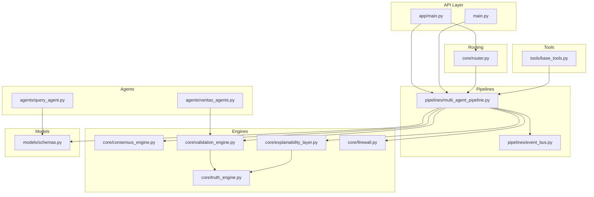

**Diagram sources**
- [app/main.py:1-208](file://app/main.py#L1-L208)
- [main.py:1-141](file://main.py#L1-L141)
- [core/router.py:1-182](file://core/router.py#L1-L182)
- [pipelines/multi_agent_pipeline.py:1-379](file://pipelines/multi_agent_pipeline.py#L1-L379)
- [pipelines/event_bus.py:1-74](file://pipelines/event_bus.py#L1-L74)
- [agents/query_agent.py:1-47](file://agents/query_agent.py#L1-L47)
- [agents/veritas_agents.py:1-44](file://agents/veritas_agents.py#L1-L44)
- [core/consensus_engine.py:1-26](file://core/consensus_engine.py#L1-L26)
- [core/validation_engine.py:1-18](file://core/validation_engine.py#L1-L18)
- [core/truth_engine.py:1-117](file://core/truth_engine.py#L1-L117)
- [core/explainability_layer.py:1-52](file://core/explainability_layer.py#L1-L52)
- [core/firewall.py:1-47](file://core/firewall.py#L1-L47)
- [models/schemas.py:1-88](file://models/schemas.py#L1-L88)
- [tools/base_tools.py:1-10](file://tools/base_tools.py#L1-L10)

**Section sources**
- [README.md:13-59](file://README.md#L13-L59)
- [app/main.py:106-208](file://app/main.py#L106-L208)
- [main.py:76-141](file://main.py#L76-L141)

## Core Components
- Query Router and Classifier: Instant classification of queries into simple, factual, or complex categories; cache-first routing with metrics.
- Multi-Agent Pipeline: Orchestrates research, parallel validation, and response building with caching and timeouts.
- Engines:
  - Truth Engine: Computes multi-factor truth scores from weighted criteria.
  - Validation Engine: Wraps truth computation in a non-blocking executor.
  - Consensus Engine: Aggregates LLM, classifier, and rule-based signals.
  - Explainability Layer: Produces human-readable explanations and breakdowns.
  - Hallucination Firewall: Applies hard safety thresholds to clamp unsafe outputs.
- Event Bus: Asynchronous pub/sub for alerts and streaming.
- Schemas: Strongly typed request/response models for consistency.
- Tools: Pluggable tool abstractions for retrieval and verification.

**Section sources**
- [core/router.py:83-182](file://core/router.py#L83-L182)
- [pipelines/multi_agent_pipeline.py:209-379](file://pipelines/multi_agent_pipeline.py#L209-L379)
- [core/truth_engine.py:3-117](file://core/truth_engine.py#L3-L117)
- [core/validation_engine.py:9-18](file://core/validation_engine.py#L9-L18)
- [core/consensus_engine.py:8-26](file://core/consensus_engine.py#L8-L26)
- [core/explainability_layer.py:13-52](file://core/explainability_layer.py#L13-L52)
- [core/firewall.py:13-47](file://core/firewall.py#L13-L47)
- [models/schemas.py:14-26](file://models/schemas.py#L14-L26)
- [pipelines/event_bus.py:6-74](file://pipelines/event_bus.py#L6-L74)
- [tools/base_tools.py:3-10](file://tools/base_tools.py#L3-L10)

## Architecture Overview
The system follows an event-driven, asynchronous architecture with a central coordinator:
- API receives queries and routes them via the router to either a fast path or the full multi-agent pipeline.
- The multi-agent pipeline executes research and parallel validations, then builds a response through consensus, explainability, and firewall layers.
- Alerts are emitted asynchronously via the event bus.
- Schemas define the canonical data model for all components.

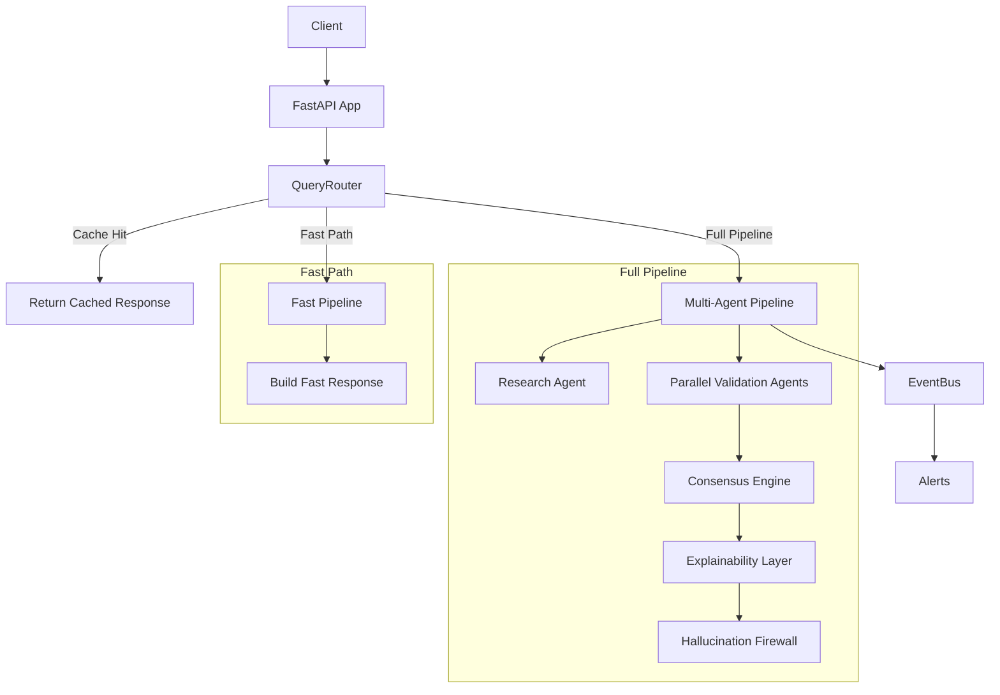

**Diagram sources**
- [core/router.py:99-182](file://core/router.py#L99-L182)
- [pipelines/multi_agent_pipeline.py:209-332](file://pipelines/multi_agent_pipeline.py#L209-L332)
- [core/consensus_engine.py:8-26](file://core/consensus_engine.py#L8-L26)
- [core/explainability_layer.py:13-52](file://core/explainability_layer.py#L13-L52)
- [core/firewall.py:13-47](file://core/firewall.py#L13-L47)
- [pipelines/event_bus.py:31-50](file://pipelines/event_bus.py#L31-L50)

## Detailed Component Analysis

### Query Router and Path Selection
- Classifies queries using regex patterns and trigger words; supports simple, factual, and complex categories.
- Implements cache-first routing with local and Redis layers; records latency metrics per route.
- Decides between fast path (single-agent LLM) and full pipeline (multi-agent swarm).

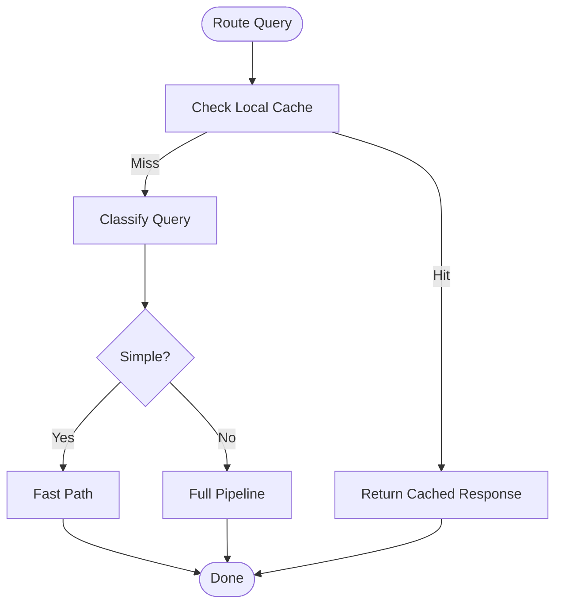

**Diagram sources**
- [core/router.py:99-136](file://core/router.py#L99-L136)

**Section sources**
- [core/router.py:51-82](file://core/router.py#L51-L82)
- [core/router.py:83-151](file://core/router.py#L83-L151)

### Multi-Agent Pipeline Orchestration
- Deduplicates in-flight queries and coordinates research and parallel validations.
- Uses CrewAI tasks with a semaphore to cap concurrent tool usage.
- Caches agent outputs and research results to reduce latency.
- Builds final response through response builder, consensus, explainability, and firewall.

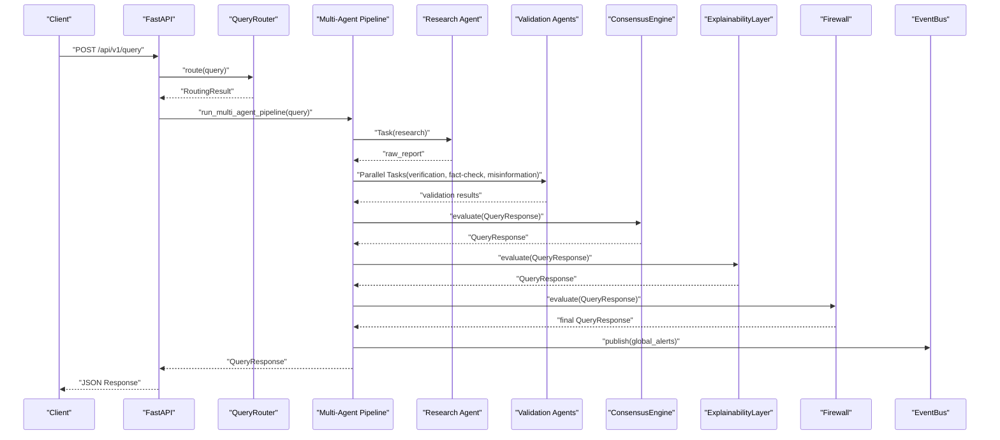

**Diagram sources**
- [pipelines/multi_agent_pipeline.py:209-332](file://pipelines/multi_agent_pipeline.py#L209-L332)
- [core/consensus_engine.py:8-26](file://core/consensus_engine.py#L8-L26)
- [core/explainability_layer.py:13-52](file://core/explainability_layer.py#L13-L52)
- [core/firewall.py:13-47](file://core/firewall.py#L13-L47)
- [pipelines/event_bus.py:31-50](file://pipelines/event_bus.py#L31-L50)

**Section sources**
- [pipelines/multi_agent_pipeline.py:107-298](file://pipelines/multi_agent_pipeline.py#L107-L298)

### Specialization Patterns and Agent Roles
- Query Agent (single-agent): Zero-shot generation with structured output for fast/simple queries.
- Veritas Agents (lightweight utilities): Retrieve sources, validate claims, and generate responses for fast/deep pipelines.
- Research Agent: Gathers raw facts and sources.
- Validation Agents (parallel):
  - Verification Agent: Source credibility and evidence integrity.
  - Fact Checker: Claim-by-claim fact-checking.
  - Misinformation Analyzer: Risk and manipulation indicators.
- Tool-using Agents: Operate via CrewAI tasks with pluggable tools.

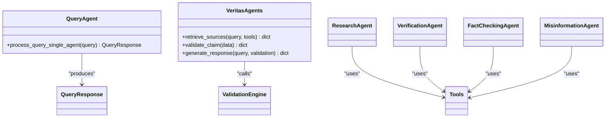

**Diagram sources**
- [agents/query_agent.py:7-47](file://agents/query_agent.py#L7-L47)
- [agents/veritas_agents.py:7-41](file://agents/veritas_agents.py#L7-L41)
- [pipelines/multi_agent_pipeline.py:146-206](file://pipelines/multi_agent_pipeline.py#L146-L206)

**Section sources**
- [agents/query_agent.py:7-47](file://agents/query_agent.py#L7-L47)
- [agents/veritas_agents.py:7-41](file://agents/veritas_agents.py#L7-L41)
- [pipelines/multi_agent_pipeline.py:146-206](file://pipelines/multi_agent_pipeline.py#L146-L206)

### Tool Integration Patterns
- Tools are decorated and integrated as CrewAI tasks; placeholders exist for web search and scraping.
- Tool usage is rate-limited via a semaphore to balance load across agent types.
- Caching of tool outputs reduces repeated work.

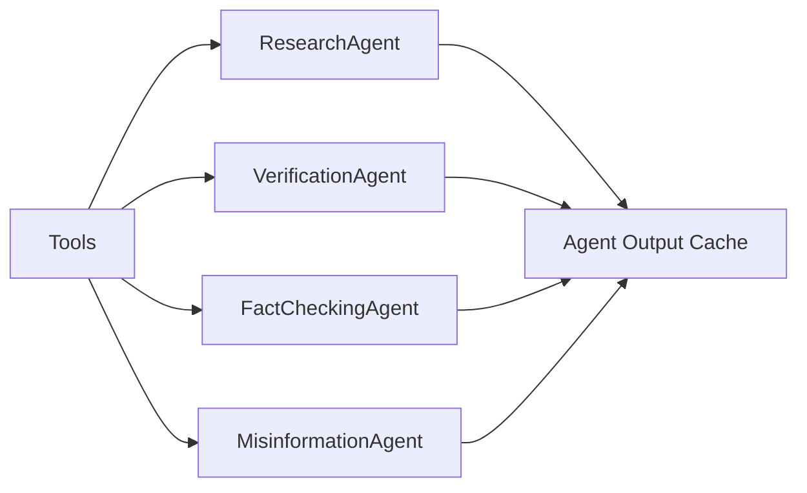

**Diagram sources**
- [pipelines/multi_agent_pipeline.py:146-206](file://pipelines/multi_agent_pipeline.py#L146-L206)
- [tools/base_tools.py:3-10](file://tools/base_tools.py#L3-L10)

**Section sources**
- [pipelines/multi_agent_pipeline.py:52-92](file://pipelines/multi_agent_pipeline.py#L52-L92)
- [tools/base_tools.py:3-10](file://tools/base_tools.py#L3-L10)

### Inter-Agent Communication Protocols
- Centralized coordination via the multi-agent pipeline.
- Asynchronous event bus for publishing alerts and streaming updates.
- Progress callbacks and futures coordinate in-flight deduplication.

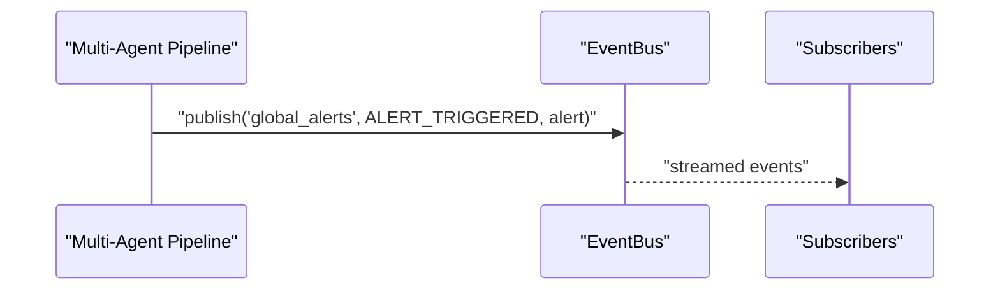

**Diagram sources**
- [pipelines/multi_agent_pipeline.py:324-331](file://pipelines/multi_agent_pipeline.py#L324-L331)
- [pipelines/event_bus.py:31-50](file://pipelines/event_bus.py#L31-L50)

**Section sources**
- [pipelines/event_bus.py:6-74](file://pipelines/event_bus.py#L6-L74)

### Consensus Mechanisms and Conflict Resolution
- Consensus Engine averages three confidence signals: LLM confidence, classifier confidence, and rule-based truth score.
- Explainability Layer translates raw signals into human-readable explanations and breakdowns.
- Hallucination Firewall applies hard thresholds to clamp unsafe outputs (e.g., insufficient trusted sources, contradictions, or truth thresholds).

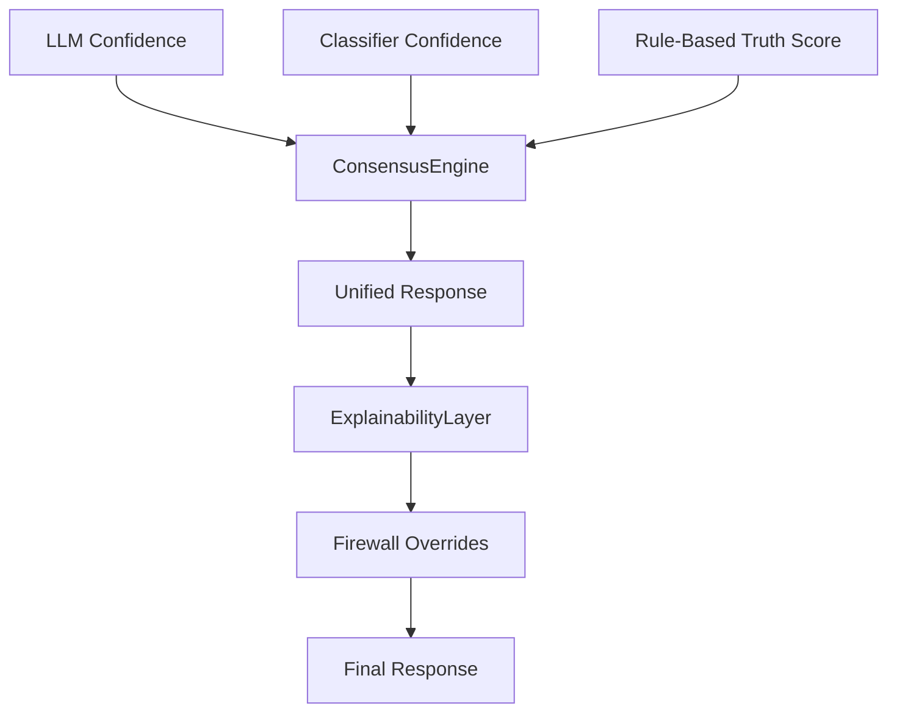

**Diagram sources**
- [core/consensus_engine.py:8-26](file://core/consensus_engine.py#L8-L26)
- [core/explainability_layer.py:13-52](file://core/explainability_layer.py#L13-L52)
- [core/firewall.py:13-47](file://core/firewall.py#L13-L47)

**Section sources**
- [core/consensus_engine.py:8-26](file://core/consensus_engine.py#L8-L26)
- [core/explainability_layer.py:13-52](file://core/explainability_layer.py#L13-L52)
- [core/firewall.py:13-47](file://core/firewall.py#L13-L47)

### Truth Scoring and Validation Workflow
- Validation Engine delegates truth scoring to Truth Engine in a thread pool to remain non-blocking.
- Truth Engine computes a weighted score across source authority, cross-source agreement, temporal consistency, verifiability, and bias deviation.
- Validation results feed into the consensus and explainability layers.

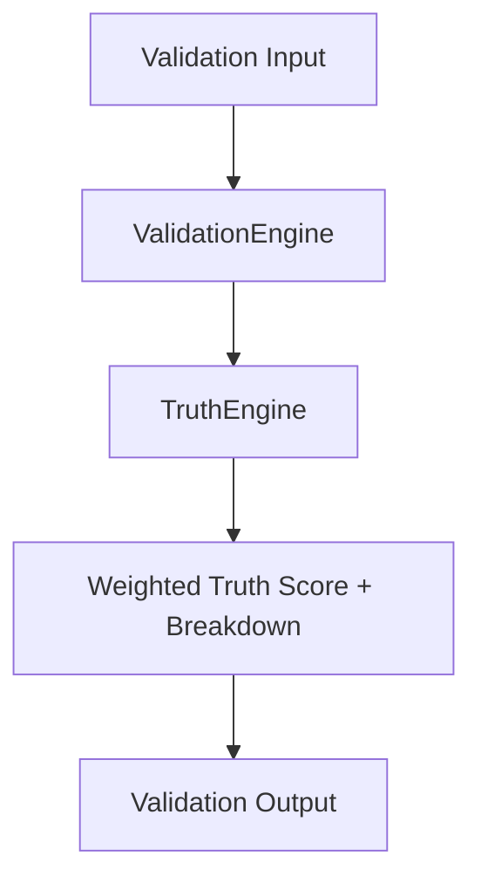

**Diagram sources**
- [core/validation_engine.py:9-18](file://core/validation_engine.py#L9-L18)
- [core/truth_engine.py:78-117](file://core/truth_engine.py#L78-L117)

**Section sources**
- [core/validation_engine.py:9-18](file://core/validation_engine.py#L9-L18)
- [core/truth_engine.py:9-117](file://core/truth_engine.py#L9-L117)

### Agent Lifecycle Management and Resource Control
- Semaphore controls concurrent tool usage to balance load across agent types.
- Caching of research and agent outputs reduces repeated computation.
- In-flight query deduplication prevents redundant work.
- Graceful fallbacks and timeouts protect the system under load.

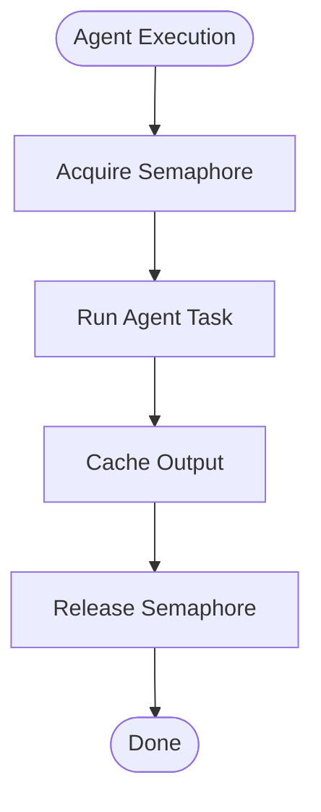

**Diagram sources**
- [pipelines/multi_agent_pipeline.py:52-92](file://pipelines/multi_agent_pipeline.py#L52-L92)
- [pipelines/multi_agent_pipeline.py:138-143](file://pipelines/multi_agent_pipeline.py#L138-L143)

**Section sources**
- [pipelines/multi_agent_pipeline.py:52-92](file://pipelines/multi_agent_pipeline.py#L52-L92)
- [pipelines/multi_agent_pipeline.py:221-229](file://pipelines/multi_agent_pipeline.py#L221-L229)

### Result Aggregation and Quality Assurance
- Response builder consolidates raw report and validation outputs.
- Consensus layer harmonizes diverse signals.
- Explainability layer enriches with why-true/why-false and breakdowns.
- Firewall enforces safety thresholds to guarantee quality.

**Section sources**
- [pipelines/multi_agent_pipeline.py:300-332](file://pipelines/multi_agent_pipeline.py#L300-L332)
- [core/consensus_engine.py:8-26](file://core/consensus_engine.py#L8-L26)
- [core/explainability_layer.py:13-52](file://core/explainability_layer.py#L13-L52)
- [core/firewall.py:13-47](file://core/firewall.py#L13-L47)

## Dependency Analysis
The system exhibits clear layering:
- API depends on routing and pipelines.
- Pipelines depend on engines, event bus, and schemas.
- Engines depend on schemas and each other (validation -> truth).
- Tools plug into agents via CrewAI tasks.

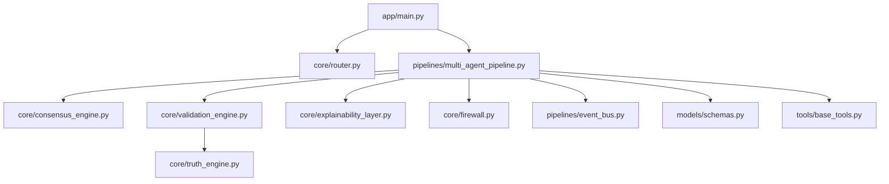

**Diagram sources**
- [app/main.py:106-208](file://app/main.py#L106-L208)
- [core/router.py:99-182](file://core/router.py#L99-L182)
- [pipelines/multi_agent_pipeline.py:209-332](file://pipelines/multi_agent_pipeline.py#L209-L332)
- [core/validation_engine.py:9-18](file://core/validation_engine.py#L9-L18)
- [core/truth_engine.py:78-117](file://core/truth_engine.py#L78-L117)
- [core/consensus_engine.py:8-26](file://core/consensus_engine.py#L8-L26)
- [core/explainability_layer.py:13-52](file://core/explainability_layer.py#L13-L52)
- [core/firewall.py:13-47](file://core/firewall.py#L13-L47)
- [pipelines/event_bus.py:31-50](file://pipelines/event_bus.py#L31-L50)
- [models/schemas.py:14-26](file://models/schemas.py#L14-L26)
- [tools/base_tools.py:3-10](file://tools/base_tools.py#L3-L10)

**Section sources**
- [app/main.py:106-208](file://app/main.py#L106-L208)
- [pipelines/multi_agent_pipeline.py:209-332](file://pipelines/multi_agent_pipeline.py#L209-L332)

## Performance Considerations
- Fast startup: Redis cache initialization with timeouts, lazy DB initialization, and background model preloading.
- Parallelism: Semaphore-based concurrency control for tool usage; asyncio.gather for parallel validations.
- Caching: Local TTL cache plus Redis-backed cache for queries and agent outputs.
- Timeouts: CrewAI execution wrapped in timeouts; request-level timeout middleware.
- Metrics: Router tracks average latency per route for fast-path vs full pipeline.

[No sources needed since this section provides general guidance]

## Troubleshooting Guide
- Router metrics: Inspect average latency per route to identify hotspots.
- Pipeline errors: PipelineError raised on timeouts or exceptions; fallback response returned.
- Firewall overrides: Review thresholds for trusted sources and contradictions to diagnose overly conservative or permissive behavior.
- Validation throughput: Monitor thread-pool usage and adjust concurrency limits.
- Event bus: Ensure subscribers are registered and messages are being published to topics.

**Section sources**
- [core/router.py:142-149](file://core/router.py#L142-L149)
- [pipelines/multi_agent_pipeline.py:34-72](file://pipelines/multi_agent_pipeline.py#L34-L72)
- [core/firewall.py:13-47](file://core/firewall.py#L13-L47)
- [pipelines/event_bus.py:62-71](file://pipelines/event_bus.py#L62-L71)

## Conclusion
Veritas AI’s multi-agent coordination system combines fast-path single-agent inference with a robust multi-agent swarm. The central router selects optimal paths, while the pipeline orchestrates research and parallel validations, aggregates results through consensus, and enforces safety via explainability and firewall layers. Asynchronous eventing and caching enable sub-two-second latency for complex verifications, while semaphores and timeouts manage resources and prevent overload. The system’s modular design supports tool integration, training feedback loops, and continuous quality improvements.

[No sources needed since this section summarizes without analyzing specific files]

## Appendices

### API Surface and Data Contracts
- QueryResponse defines the canonical output schema, including truth score, confidence, status, and explanations.
- Schemas enforce strong typing across the system.

**Section sources**
- [models/schemas.py:14-26](file://models/schemas.py#L14-L26)