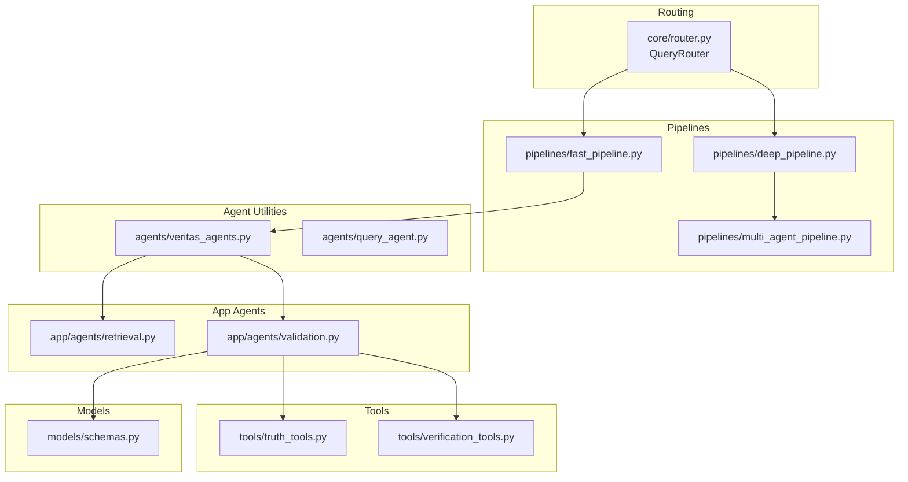
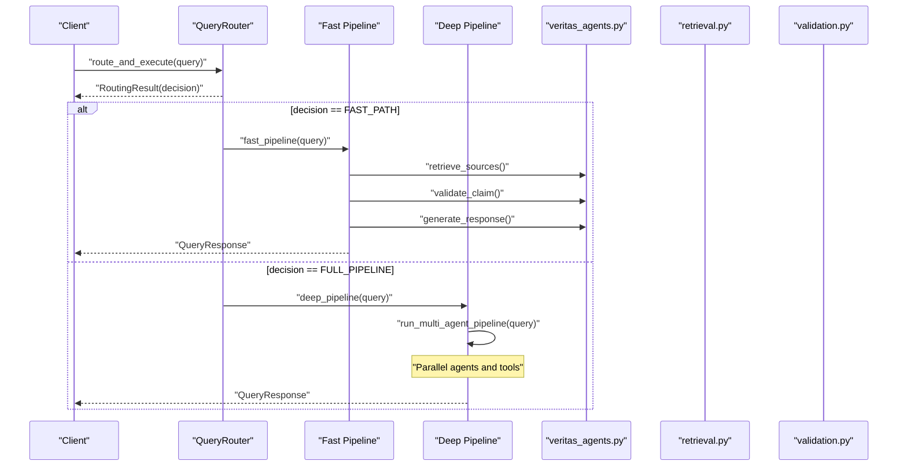
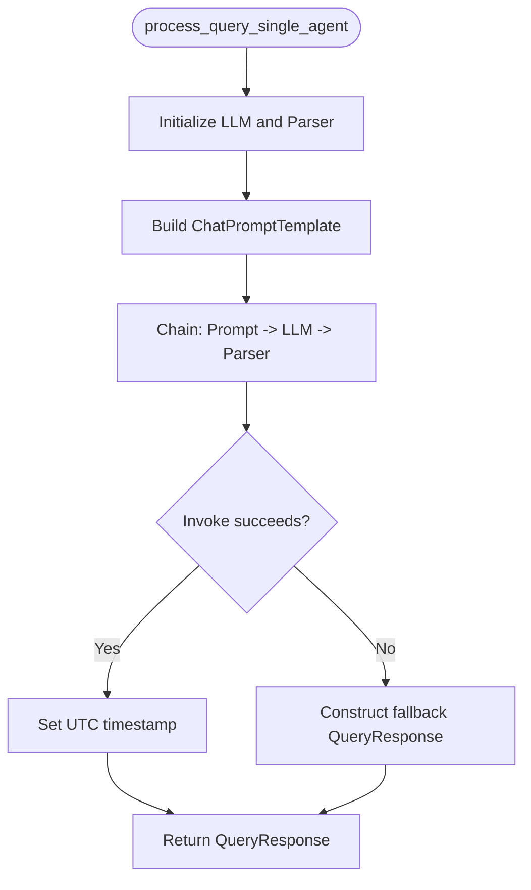
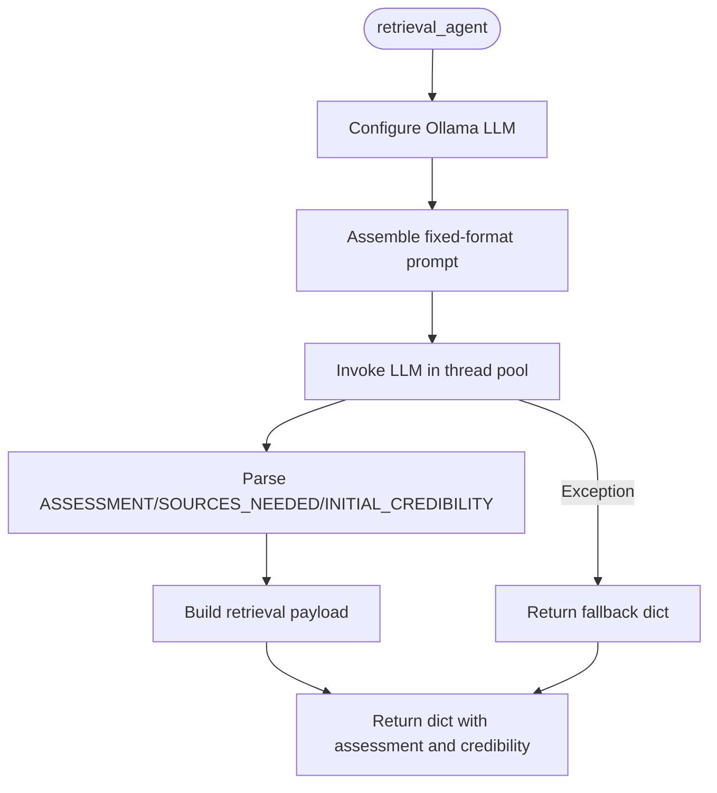
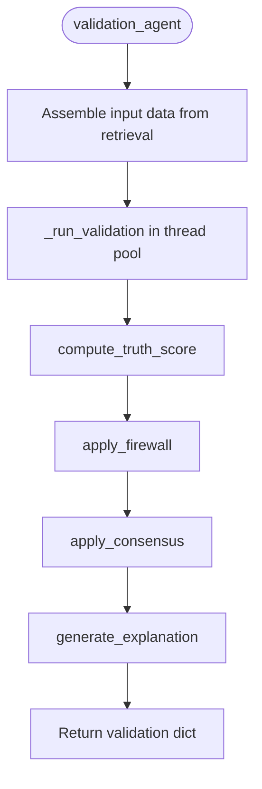
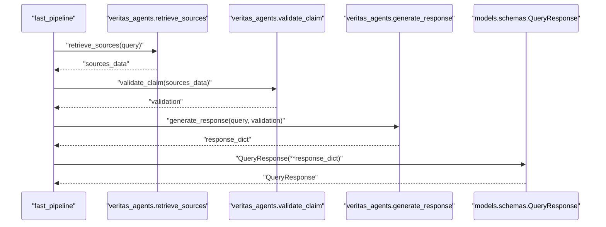
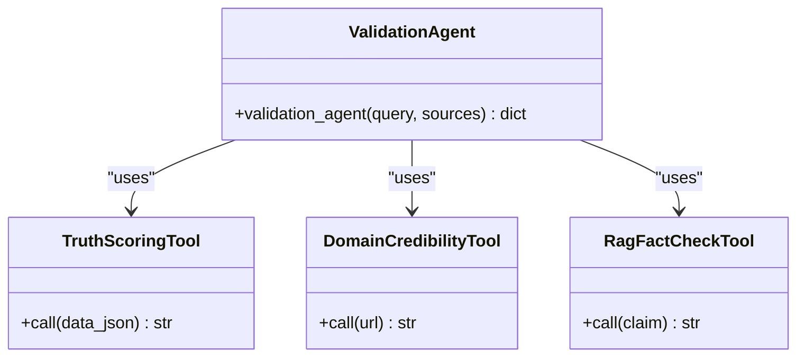
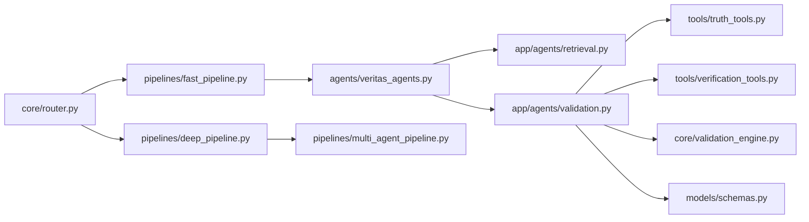

# Agent Types and Specializations

<cite>
**Referenced Files in This Document**
- [query_agent.py](file://veritas-ai/agents/query_agent.py)
- [veritas_agents.py](file://veritas-ai/agents/veritas_agents.py)
- [retrieval.py](file://veritas-ai/app/agents/retrieval.py)
- [validation.py](file://veritas-ai/app/agents/validation.py)
- [fast_pipeline.py](file://veritas-ai/pipelines/fast_pipeline.py)
- [deep_pipeline.py](file://veritas-ai/pipelines/deep_pipeline.py)
- [multi_agent_pipeline.py](file://veritas-ai/pipelines/multi_agent_pipeline.py)
- [router.py](file://veritas-ai/core/router.py)
- [schemas.py](file://veritas-ai/models/schemas.py)
- [validation_engine.py](file://veritas-ai/core/validation_engine.py)
- [truth_tools.py](file://veritas-ai/tools/truth_tools.py)
- [verification_tools.py](file://veritas-ai/tools/verification_tools.py)
</cite>

## Table of Contents
1. [Introduction](#introduction)
2. [Project Structure](#project-structure)
3. [Core Components](#core-components)
4. [Architecture Overview](#architecture-overview)
5. [Detailed Component Analysis](#detailed-component-analysis)
6. [Dependency Analysis](#dependency-analysis)
7. [Performance Considerations](#performance-considerations)
8. [Troubleshooting Guide](#troubleshooting-guide)
9. [Conclusion](#conclusion)

## Introduction
This document explains the agent types and specializations within the Veritas AI system. It focuses on:
- Query agents for information retrieval
- Truth verification agents for fact-checking
- Tool-using agents for specialized operations
It also covers role-based specialization patterns, agent capabilities, use cases, selection criteria, routing mechanisms, performance characteristics, lifecycle management, resource allocation, and scaling considerations. Integration patterns with the coordination engine and pipelines are included.

## Project Structure
Veritas AI organizes agent logic across lightweight async utilities, dedicated agent modules, and pipelines that orchestrate retrieval, validation, and response generation. The routing engine selects between fast and full pipelines based on query characteristics.



**Diagram sources**
- [router.py:83-151](file://veritas-ai/core/router.py#L83-L151)
- [fast_pipeline.py:8-21](file://veritas-ai/pipelines/fast_pipeline.py#L8-L21)
- [deep_pipeline.py:7-16](file://veritas-ai/pipelines/deep_pipeline.py#L7-L16)
- [multi_agent_pipeline.py:209-298](file://veritas-ai/pipelines/multi_agent_pipeline.py#L209-L298)
- [veritas_agents.py:7-41](file://veritas-ai/agents/veritas_agents.py#L7-L41)
- [retrieval.py:36-100](file://veritas-ai/app/agents/retrieval.py#L36-L100)
- [validation.py:278-313](file://veritas-ai/app/agents/validation.py#L278-L313)
- [truth_tools.py:5-28](file://veritas-ai/tools/truth_tools.py#L5-L28)
- [verification_tools.py:5-51](file://veritas-ai/tools/verification_tools.py#L5-L51)
- [schemas.py:14-25](file://veritas-ai/models/schemas.py#L14-L25)

**Section sources**
- [router.py:83-151](file://veritas-ai/core/router.py#L83-L151)
- [fast_pipeline.py:8-21](file://veritas-ai/pipelines/fast_pipeline.py#L8-L21)
- [deep_pipeline.py:7-16](file://veritas-ai/pipelines/deep_pipeline.py#L7-L16)
- [veritas_agents.py:7-41](file://veritas-ai/agents/veritas_agents.py#L7-L41)
- [retrieval.py:36-100](file://veritas-ai/app/agents/retrieval.py#L36-L100)
- [validation.py:278-313](file://veritas-ai/app/agents/validation.py#L278-L313)
- [multi_agent_pipeline.py:209-298](file://veritas-ai/pipelines/multi_agent_pipeline.py#L209-L298)
- [schemas.py:14-25](file://veritas-ai/models/schemas.py#L14-L25)

## Core Components
- Query Agent (single-agent): Processes a user query with a lightweight LLM to produce a structured response aligned with the QueryResponse schema.
- Retrieval Agent (async): Identifies initial sources and assesses claim verifiability, returning a structured payload for downstream validation.
- Validation Agent (async): Computes a truth score, applies firewall overrides, merges confidence, and generates an explanation.
- Fast Pipeline: Minimal retrieval and validation using lightweight utilities and a fast response generator.
- Deep Pipeline: Executes the multi-agent pipeline for comprehensive verification and analysis.
- Tools: Truth scoring and verification tools that evaluate domain credibility and RAG-backed fact-checking.

**Section sources**
- [query_agent.py:7-46](file://veritas-ai/agents/query_agent.py#L7-L46)
- [retrieval.py:36-100](file://veritas-ai/app/agents/retrieval.py#L36-L100)
- [validation.py:278-313](file://veritas-ai/app/agents/validation.py#L278-L313)
- [fast_pipeline.py:8-21](file://veritas-ai/pipelines/fast_pipeline.py#L8-L21)
- [deep_pipeline.py:7-16](file://veritas-ai/pipelines/deep_pipeline.py#L7-L16)
- [truth_tools.py:5-28](file://veritas-ai/tools/truth_tools.py#L5-L28)
- [verification_tools.py:5-51](file://veritas-ai/tools/verification_tools.py#L5-L51)

## Architecture Overview
The system routes queries to either a fast or full pipeline. The fast pipeline uses lightweight utilities for retrieval, validation, and response generation. The deep pipeline coordinates multiple specialized agents and tools to deliver a comprehensive assessment.



**Diagram sources**
- [router.py:153-181](file://veritas-ai/core/router.py#L153-L181)
- [fast_pipeline.py:8-21](file://veritas-ai/pipelines/fast_pipeline.py#L8-L21)
- [deep_pipeline.py:7-16](file://veritas-ai/pipelines/deep_pipeline.py#L7-L16)
- [veritas_agents.py:7-41](file://veritas-ai/agents/veritas_agents.py#L7-L41)
- [retrieval.py:36-100](file://veritas-ai/app/agents/retrieval.py#L36-L100)
- [validation.py:278-313](file://veritas-ai/app/agents/validation.py#L278-L313)

## Detailed Component Analysis

### Query Agent (Information Retrieval)
- Role: Single-agent routine that transforms a user query into a structured QueryResponse using a lightweight LLM.
- Capabilities:
  - Asynchronous LLM invocation
  - Structured output parsing aligned with QueryResponse schema
  - Graceful fallback on parsing errors
- Use Cases:
  - Rapid, structured summaries for straightforward queries
  - Initial triage before deeper analysis
- Lifecycle:
  - Initialization of LLM and parser
  - Prompt assembly and chain execution
  - Timestamp normalization and error handling
- Performance:
  - Optimized for low-latency single-call processing



**Diagram sources**
- [query_agent.py:7-46](file://veritas-ai/agents/query_agent.py#L7-L46)

**Section sources**
- [query_agent.py:7-46](file://veritas-ai/agents/query_agent.py#L7-L46)
- [schemas.py:14-25](file://veritas-ai/models/schemas.py#L14-L25)

### Retrieval Agent (Source Discovery and Credibility)
- Role: Async retrieval and initial credibility scoring for a query.
- Capabilities:
  - Domain authority scoring based on TLD/media/social patterns
  - Structured assessment with initial credibility estimate
  - Fallback behavior on failure
- Use Cases:
  - Pre-validation intake for fast pipeline
  - Source-type guidance for multi-agent orchestration
- Integration:
  - Returns a dictionary consumed by validation agent
  - Can be extended to integrate with vector stores and web scraping



**Diagram sources**
- [retrieval.py:36-100](file://veritas-ai/app/agents/retrieval.py#L36-L100)

**Section sources**
- [retrieval.py:36-100](file://veritas-ai/app/agents/retrieval.py#L36-L100)

### Validation Agent (Truth Scoring, Firewall, Consensus, Explainability)
- Role: Compute truth score, apply deterministic firewall overrides, merge confidence, and generate explanations.
- Capabilities:
  - Weighted scoring across source authority, cross-source agreement, temporal consistency, verifiability, and bias deviation
  - Firewall logic that can override scores based on contradictions and sourcing thresholds
  - Consensus merging of LLM, classifier, and rule-based confidence
  - Human-readable explanation with “why_true/why_false” and breakdown
- Use Cases:
  - Deterministic, auditable truth assessments
  - Risk-aware decision-making with overrides
- Integration:
  - Consumes retrieval payload and produces enriched validation result
  - Leverages shared TruthEngine via thread pool to remain non-blocking



**Diagram sources**
- [validation.py:278-313](file://veritas-ai/app/agents/validation.py#L278-L313)

**Section sources**
- [validation.py:92-126](file://veritas-ai/app/agents/validation.py#L92-L126)
- [validation.py:161-198](file://veritas-ai/app/agents/validation.py#L161-L198)
- [validation.py:203-212](file://veritas-ai/app/agents/validation.py#L203-L212)
- [validation.py:217-273](file://veritas-ai/app/agents/validation.py#L217-L273)
- [validation_engine.py:9-17](file://veritas-ai/core/validation_engine.py#L9-L17)

### Fast Pipeline (Minimal Retrieval and Validation)
- Role: Optimized path for simple queries under strict latency targets.
- Steps:
  - Retrieve sources (stub or future RAG integration)
  - Validate claim using ValidationEngine via thread pool
  - Generate concise response dictionary
  - Convert to QueryResponse model
- Performance:
  - Designed to complete under 2 seconds



**Diagram sources**
- [fast_pipeline.py:8-21](file://veritas-ai/pipelines/fast_pipeline.py#L8-L21)
- [veritas_agents.py:7-41](file://veritas-ai/agents/veritas_agents.py#L7-L41)
- [schemas.py:14-25](file://veritas-ai/models/schemas.py#L14-L25)

**Section sources**
- [fast_pipeline.py:8-21](file://veritas-ai/pipelines/fast_pipeline.py#L8-L21)
- [veritas_agents.py:7-41](file://veritas-ai/agents/veritas_agents.py#L7-L41)

### Deep Pipeline (Multi-Agent Orchestration)
- Role: Full analysis using CrewAI agents and parallel validations.
- Steps:
  - Deduplicate in-flight queries
  - Research: gather raw report via researcher agent and tools
  - Parallel validation: run verification, fact-checking, and misinformation agents concurrently
  - Response building: consensus, explainability, firewall, and alerts
- Scaling:
  - Semaphore controls parallel tool usage
  - Caching reduces repeated computations
  - Event bus supports alert publishing

```mermaid
sequenceDiagram
participant DP as "deep_pipeline"
participant MAP as "run_multi_agent_pipeline"
participant Res as "Research Agent"
participant Par as "Parallel Validators"
participant RB as "Response Builder"
DP->>MAP : "run_multi_agent_pipeline(query)"
MAP->>Res : "Gather raw report"
Res-->>MAP : "raw_report"
MAP->>Par : "Run verification/fact-check/misinformation in parallel"
Par-->>MAP : "validation results"
MAP->>RB : "_build_final_response"
RB-->>DP : "QueryResponse"
```

**Diagram sources**
- [deep_pipeline.py:7-16](file://veritas-ai/pipelines/deep_pipeline.py#L7-L16)
- [multi_agent_pipeline.py:209-298](file://veritas-ai/pipelines/multi_agent_pipeline.py#L209-L298)

**Section sources**
- [deep_pipeline.py:7-16](file://veritas-ai/pipelines/deep_pipeline.py#L7-L16)
- [multi_agent_pipeline.py:209-298](file://veritas-ai/pipelines/multi_agent_pipeline.py#L209-L298)

### Tool-Using Agents (Specialized Operations)
- Truth Scoring Engine Tool: Computes a unified truth score from structured inputs using the TruthEngine.
- Domain Credibility Evaluator Tool: Heuristic-based evaluation of source credibility by domain.
- RAG Fact Checker Tool: Asynchronously retrieves relevant context from a vector database for a given claim.



**Diagram sources**
- [truth_tools.py:5-28](file://veritas-ai/tools/truth_tools.py#L5-L28)
- [verification_tools.py:5-51](file://veritas-ai/tools/verification_tools.py#L5-L51)
- [validation.py:278-313](file://veritas-ai/app/agents/validation.py#L278-L313)

**Section sources**
- [truth_tools.py:5-28](file://veritas-ai/tools/truth_tools.py#L5-L28)
- [verification_tools.py:5-51](file://veritas-ai/tools/verification_tools.py#L5-L51)
- [validation.py:278-313](file://veritas-ai/app/agents/validation.py#L278-L313)

## Dependency Analysis
- Routing determines whether to execute the fast or full pipeline.
- Fast pipeline depends on lightweight utilities for retrieval, validation, and response generation.
- Deep pipeline orchestrates multiple agents and tools, coordinating concurrency and caching.
- Validation agent integrates with shared engines and tools to produce a deterministic assessment.



**Diagram sources**
- [router.py:83-151](file://veritas-ai/core/router.py#L83-L151)
- [fast_pipeline.py:8-21](file://veritas-ai/pipelines/fast_pipeline.py#L8-L21)
- [deep_pipeline.py:7-16](file://veritas-ai/pipelines/deep_pipeline.py#L7-L16)
- [veritas_agents.py:7-41](file://veritas-ai/agents/veritas_agents.py#L7-L41)
- [retrieval.py:36-100](file://veritas-ai/app/agents/retrieval.py#L36-L100)
- [validation.py:278-313](file://veritas-ai/app/agents/validation.py#L278-L313)
- [truth_tools.py:5-28](file://veritas-ai/tools/truth_tools.py#L5-L28)
- [verification_tools.py:5-51](file://veritas-ai/tools/verification_tools.py#L5-L51)
- [validation_engine.py:9-17](file://veritas-ai/core/validation_engine.py#L9-L17)
- [schemas.py:14-25](file://veritas-ai/models/schemas.py#L14-L25)

**Section sources**
- [router.py:83-151](file://veritas-ai/core/router.py#L83-L151)
- [fast_pipeline.py:8-21](file://veritas-ai/pipelines/fast_pipeline.py#L8-L21)
- [deep_pipeline.py:7-16](file://veritas-ai/pipelines/deep_pipeline.py#L7-L16)
- [veritas_agents.py:7-41](file://veritas-ai/agents/veritas_agents.py#L7-L41)
- [retrieval.py:36-100](file://veritas-ai/app/agents/retrieval.py#L36-L100)
- [validation.py:278-313](file://veritas-ai/app/agents/validation.py#L278-L313)
- [truth_tools.py:5-28](file://veritas-ai/tools/truth_tools.py#L5-L28)
- [verification_tools.py:5-51](file://veritas-ai/tools/verification_tools.py#L5-L51)
- [validation_engine.py:9-17](file://veritas-ai/core/validation_engine.py#L9-L17)
- [schemas.py:14-25](file://veritas-ai/models/schemas.py#L14-L25)

## Performance Considerations
- Fast Path:
  - Minimizes latency by avoiding heavy orchestration and leveraging lightweight utilities.
  - Suitable for simple queries and rapid responses.
- Deep Path:
  - Parallelism across agents improves throughput for complex queries.
  - Semaphore-based throttling prevents resource exhaustion.
  - Caching reduces repeated computations for research and agent outputs.
- Validation:
  - CPU-bound scoring runs in a thread pool to keep the event loop responsive.
- Routing:
  - Local and Redis caching accelerates repeated queries.
  - Classifier quickly categorizes queries to select the optimal path.

[No sources needed since this section provides general guidance]

## Troubleshooting Guide
- Retrieval Agent Failures:
  - Falls back to a structured dict with default credibility and disabled retrieval flag.
- Validation Agent Overrides:
  - Firewall can override truth scores based on contradiction counts and trusted source thresholds.
- Multi-Agent Pipeline Errors:
  - Raises a pipeline-specific error on timeouts or exceptions; returns a fallback QueryResponse.
- Tool Inputs:
  - Truth scoring tool expects a strict JSON structure; invalid inputs return explicit error messages.

**Section sources**
- [retrieval.py:90-100](file://veritas-ai/app/agents/retrieval.py#L90-L100)
- [validation.py:174-198](file://veritas-ai/app/agents/validation.py#L174-L198)
- [multi_agent_pipeline.py:34-71](file://veritas-ai/pipelines/multi_agent_pipeline.py#L34-L71)
- [truth_tools.py:20-28](file://veritas-ai/tools/truth_tools.py#L20-L28)

## Conclusion
Veritas AI employs a layered agent architecture:
- Query agents deliver structured summaries for straightforward requests.
- Retrieval and validation agents provide deterministic, explainable assessments.
- Tool-using agents specialize in domain credibility and RAG-backed fact-checking.
Routing selects the appropriate pipeline, while caching, semaphores, and thread pools manage performance and scalability. The design balances speed and depth to serve diverse use cases effectively.