# Consensus and Decision Making

<cite>
**Referenced Files in This Document**
- [consensus_engine.py](file://veritas-ai/core/consensus_engine.py)
- [validation_engine.py](file://veritas-ai/core/validation_engine.py)
- [truth_engine.py](file://veritas-ai/core/truth_engine.py)
- [firewall.py](file://veritas-ai/core/firewall.py)
- [explainability_layer.py](file://veritas-ai/core/explainability_layer.py)
- [schemas.py](file://veritas-ai/models/schemas.py)
- [response_builder.py](file://veritas-ai/pipelines/response_builder.py)
- [multi_agent_pipeline.py](file://veritas-ai/pipelines/multi_agent_pipeline.py)
- [validation.py](file://veritas-ai/app/agents/validation.py)
- [alert_engine.py](file://veritas-ai/core/alert_engine.py)
- [event_bus.py](file://veritas-ai/pipelines/event_bus.py)
- [veritas_agents.py](file://veritas-ai/agents/veritas_agents.py)
- [test_consensus.py](file://veritas-ai/tests/test_consensus.py)
</cite>

## Table of Contents
1. [Introduction](#introduction)
2. [Project Structure](#project-structure)
3. [Core Components](#core-components)
4. [Architecture Overview](#architecture-overview)
5. [Detailed Component Analysis](#detailed-component-analysis)
6. [Dependency Analysis](#dependency-analysis)
7. [Performance Considerations](#performance-considerations)
8. [Troubleshooting Guide](#troubleshooting-guide)
9. [Conclusion](#conclusion)

## Introduction
This document explains the consensus and decision-making mechanisms in the multi-agent system. It covers how the system aggregates results from multiple agents, resolves conflicts among contradictory findings, and produces a unified decision. It also details the validation engine’s role in ensuring result quality, the scoring systems for truth and reliability, and the trust metrics used for agent selection. Finally, it describes decision thresholds, confidence scoring, uncertainty handling, consensus workflows, edge cases, and performance optimization techniques for large-scale agent coordination.

## Project Structure
The consensus and decision-making pipeline spans several modules:
- Core engines: TruthEngine, ConsensusEngine, HallucinationFirewall, ExplainabilityLayer, AlertEngine
- Pipelines: Multi-agent pipeline orchestrating parallel agents and response building
- Schemas: Typed data structures for inputs and outputs
- Agents: Lightweight async utilities for retrieval, validation, and response generation
- Utilities: Event bus, validation engine wrapper, and response builder

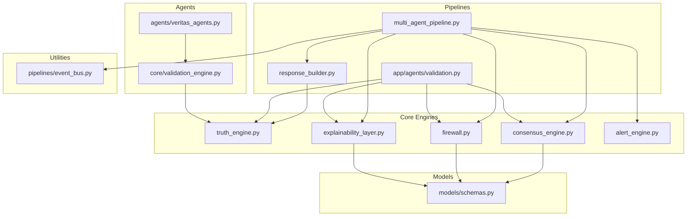

**Diagram sources**
- [multi_agent_pipeline.py](file://veritas-ai/pipelines/multi_agent_pipeline.py)
- [response_builder.py](file://veritas-ai/pipelines/response_builder.py)
- [validation.py](file://veritas-ai/app/agents/validation.py)
- [truth_engine.py](file://veritas-ai/core/truth_engine.py)
- [consensus_engine.py](file://veritas-ai/core/consensus_engine.py)
- [firewall.py](file://veritas-ai/core/firewall.py)
- [explainability_layer.py](file://veritas-ai/core/explainability_layer.py)
- [alert_engine.py](file://veritas-ai/core/alert_engine.py)
- [schemas.py](file://veritas-ai/models/schemas.py)
- [veritas_agents.py](file://veritas-ai/agents/veritas_agents.py)
- [validation_engine.py](file://veritas-ai/core/validation_engine.py)
- [event_bus.py](file://veritas-ai/pipelines/event_bus.py)

**Section sources**
- [multi_agent_pipeline.py](file://veritas-ai/pipelines/multi_agent_pipeline.py)
- [response_builder.py](file://veritas-ai/pipelines/response_builder.py)
- [validation.py](file://veritas-ai/app/agents/validation.py)
- [truth_engine.py](file://veritas-ai/core/truth_engine.py)
- [consensus_engine.py](file://veritas-ai/core/consensus_engine.py)
- [firewall.py](file://veritas-ai/core/firewall.py)
- [explainability_layer.py](file://veritas-ai/core/explainability_layer.py)
- [alert_engine.py](file://veritas-ai/core/alert_engine.py)
- [schemas.py](file://veritas-ai/models/schemas.py)
- [veritas_agents.py](file://veritas-ai/agents/veritas_agents.py)
- [validation_engine.py](file://veritas-ai/core/validation_engine.py)
- [event_bus.py](file://veritas-ai/pipelines/event_bus.py)

## Core Components
- TruthEngine: Computes a multi-factor truth score from source authority, cross-source agreement, temporal consistency, claim verifiability, and bias deviation. Returns a weighted composite score and a breakdown.
- ConsensusEngine: Aggregates three confidence signals—LLM baseline, classifier-derived confidence, and rule-based truth score—into a unified confidence score.
- HallucinationFirewall: Applies deterministic thresholds to clamp status and prevent unsafe outputs (e.g., insufficient trusted sources, contradictions, or low truth thresholds).
- ExplainabilityLayer: Produces human-readable explanations (“why true/false”) and a confidence breakdown for auditability.
- AlertEngine: Emits structured alerts for high-contrast contradictions, fake news probability spikes, low truth scores, and temporal anomalies.
- ResponseBuilder: Parses raw agent outputs, extracts sources, facts, contradictions, and fake probability; computes truth score and initial confidence; constructs a typed QueryResponse.
- Multi-Agent Pipeline: Orchestrates parallel agents, caches intermediate results, builds the final response, applies consensus, explainability, and firewall, and emits alerts.
- Validation Engine Wrapper: Runs the TruthEngine in a thread pool to avoid blocking the event loop.
- Schemas: Defines QueryResponse and Source models with typed fields for trust metrics and status.

**Section sources**
- [truth_engine.py](file://veritas-ai/core/truth_engine.py)
- [consensus_engine.py](file://veritas-ai/core/consensus_engine.py)
- [firewall.py](file://veritas-ai/core/firewall.py)
- [explainability_layer.py](file://veritas-ai/core/explainability_layer.py)
- [alert_engine.py](file://veritas-ai/core/alert_engine.py)
- [response_builder.py](file://veritas-ai/pipelines/response_builder.py)
- [multi_agent_pipeline.py](file://veritas-ai/pipelines/multi_agent_pipeline.py)
- [validation_engine.py](file://veritas-ai/core/validation_engine.py)
- [schemas.py](file://veritas-ai/models/schemas.py)

## Architecture Overview
The system integrates multiple agents and engines to produce a robust, explainable, and auditable decision. The flow below maps the actual code paths.

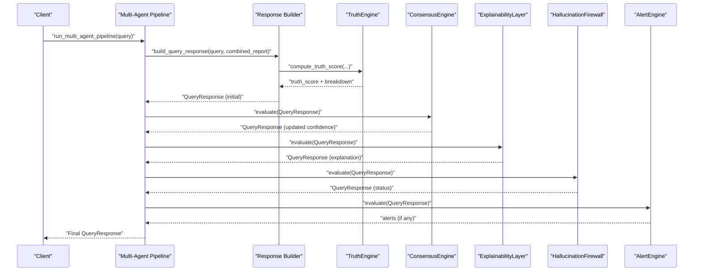

**Diagram sources**
- [multi_agent_pipeline.py](file://veritas-ai/pipelines/multi_agent_pipeline.py)
- [response_builder.py](file://veritas-ai/pipelines/response_builder.py)
- [truth_engine.py](file://veritas-ai/core/truth_engine.py)
- [consensus_engine.py](file://veritas-ai/core/consensus_engine.py)
- [explainability_layer.py](file://veritas-ai/core/explainability_layer.py)
- [firewall.py](file://veritas-ai/core/firewall.py)
- [alert_engine.py](file://veritas-ai/core/alert_engine.py)

## Detailed Component Analysis

### Consensus Engine
- Purpose: Merge three confidence signals into a unified score.
- Inputs: LLM confidence score, classifier-derived confidence (inverted fake probability), and truth score.
- Method: Arithmetic mean across the three inputs; rounds to three decimals.
- Output: Mutates the QueryResponse confidence score.

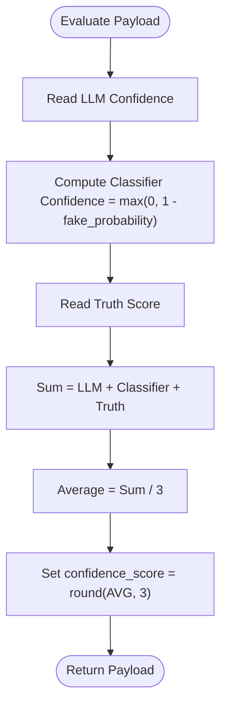

**Diagram sources**
- [consensus_engine.py](file://veritas-ai/core/consensus_engine.py)

**Section sources**
- [consensus_engine.py](file://veritas-ai/core/consensus_engine.py)
- [test_consensus.py](file://veritas-ai/tests/test_consensus.py)

### Truth Engine
- Purpose: Compute a multi-factor truth score using weighted components.
- Factors:
  - Source authority: Domain-based credibility mapping.
  - Cross-source agreement: Ratio of agreeing to total sources.
  - Temporal consistency: Penalty for temporal anomalies.
  - Claim verifiability: Based on RAG and KG hits.
  - Bias deviation: Inverse of fake news probability.
- Output: Final truth score and a breakdown dictionary.

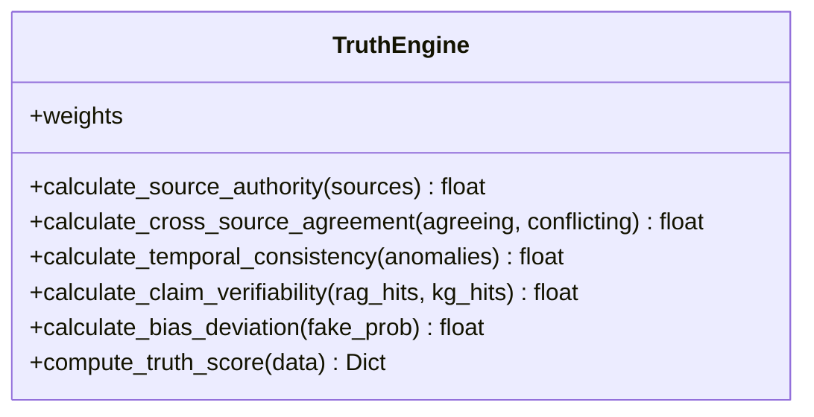

**Diagram sources**
- [truth_engine.py](file://veritas-ai/core/truth_engine.py)

**Section sources**
- [truth_engine.py](file://veritas-ai/core/truth_engine.py)
- [response_builder.py](file://veritas-ai/pipelines/response_builder.py)
- [validation.py](file://veritas-ai/app/agents/validation.py)

### Hallucination Firewall
- Purpose: Apply deterministic thresholds to ensure safety and reliability.
- Thresholds:
  - Contradictions: If count exceeds a threshold, mark as likely false.
  - Trusted sources: If fewer than two high-credibility sources, mark as uncertain.
  - Truth threshold: If truth score exceeds 0.75, mark as verified.
- Output: Mutates QueryResponse status.

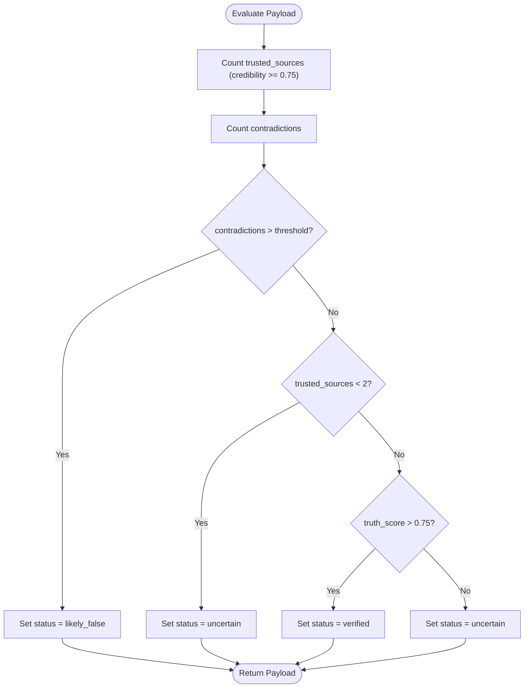

**Diagram sources**
- [firewall.py](file://veritas-ai/core/firewall.py)

**Section sources**
- [firewall.py](file://veritas-ai/core/firewall.py)
- [validation.py](file://veritas-ai/app/agents/validation.py)

### Explainability Layer
- Purpose: Produce human-readable explanations and a confidence breakdown.
- Explanations:
  - Why true: Trusted sources, low fake probability, no contradictions.
  - Why false: Presence of contradictions, high fake probability, zero trusted sources.
- Breakdown: Authority, agreement, and bias components derived from truth factors.

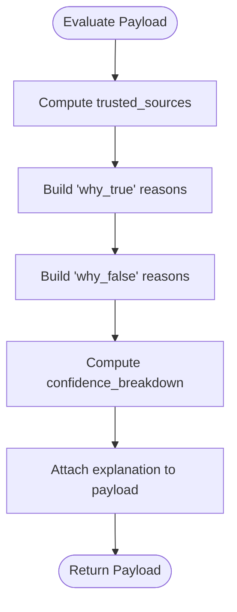

**Diagram sources**
- [explainability_layer.py](file://veritas-ai/core/explainability_layer.py)

**Section sources**
- [explainability_layer.py](file://veritas-ai/core/explainability_layer.py)
- [validation.py](file://veritas-ai/app/agents/validation.py)

### Alert Engine
- Purpose: Detect and emit structured alerts for anomalies.
- Triggers:
  - High contradiction count.
  - Elevated fake news probability.
  - Low truth score.
  - Temporal anomaly keywords in summary.
- Output: List of alert dictionaries.

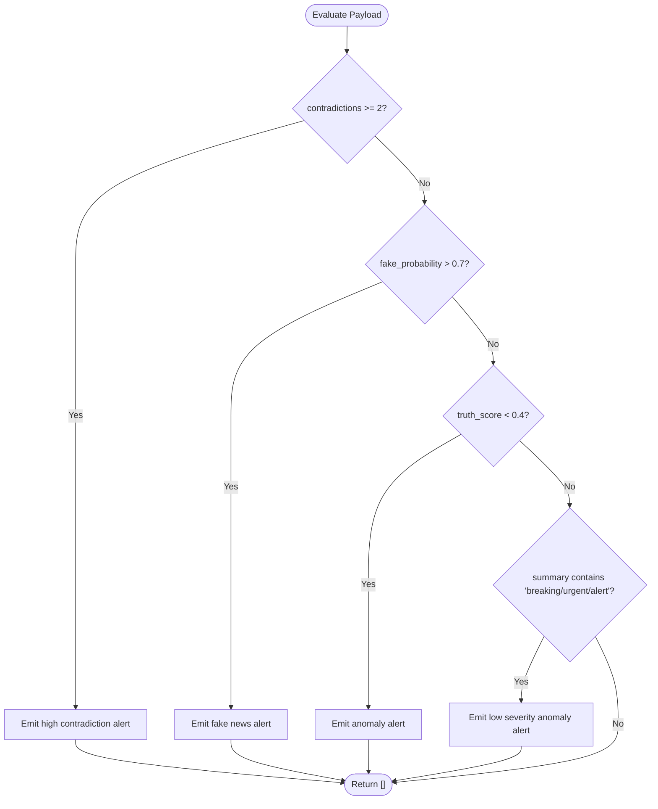

**Diagram sources**
- [alert_engine.py](file://veritas-ai/core/alert_engine.py)

**Section sources**
- [alert_engine.py](file://veritas-ai/core/alert_engine.py)

### Response Builder
- Purpose: Parse raw agent outputs and construct a typed QueryResponse.
- Extraction:
  - Sources: URLs parsed and scored by domain.
  - Facts: Sentence extraction and deduplication.
  - Contradictions: Keyword-based detection.
  - Fake probability: Regex-based extraction from agent output.
- Scoring:
  - Truth score computed via TruthEngine.
  - Initial confidence combines truth score and evidence coverage.
- Output: QueryResponse with summary, facts, sources, contradictions, fake probability, confidence score, truth score, status, and timestamp.

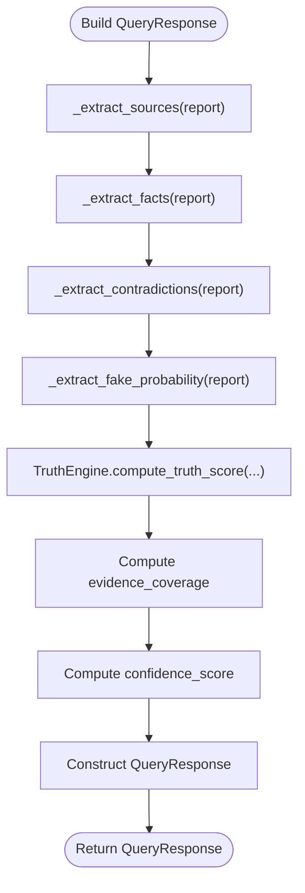

**Diagram sources**
- [response_builder.py](file://veritas-ai/pipelines/response_builder.py)

**Section sources**
- [response_builder.py](file://veritas-ai/pipelines/response_builder.py)

### Multi-Agent Pipeline
- Purpose: Orchestrate parallel agents, cache intermediate results, and finalize the response.
- Phases:
  - Research: Gather raw evidence.
  - Parallel validation: Run verification, fact-checking, and misinformation analysis concurrently.
  - Response building: Build QueryResponse, apply consensus, explainability, and firewall.
  - Alerts: Emit alerts if triggered.
- Concurrency: Uses asyncio.gather and semaphores to limit parallelism and cache outputs.

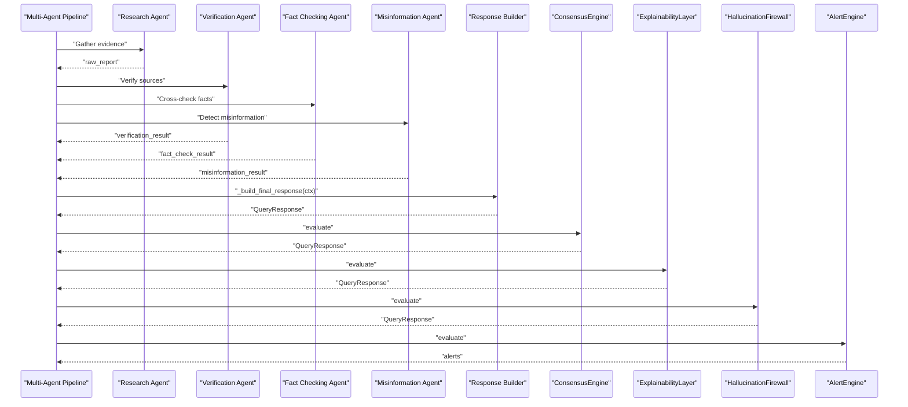

**Diagram sources**
- [multi_agent_pipeline.py](file://veritas-ai/pipelines/multi_agent_pipeline.py)

**Section sources**
- [multi_agent_pipeline.py](file://veritas-ai/pipelines/multi_agent_pipeline.py)

### Validation Engine Wrapper
- Purpose: Run CPU-intensive truth scoring in a thread pool to avoid blocking the event loop.
- Behavior: Wraps TruthEngine.compute_truth_score and returns the same structure.

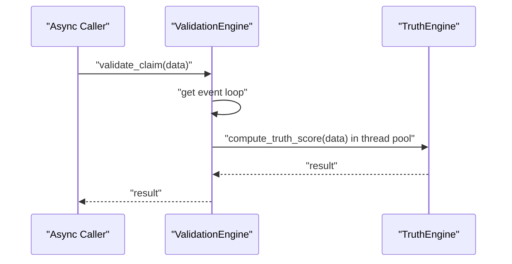

**Diagram sources**
- [validation_engine.py](file://veritas-ai/core/validation_engine.py)

**Section sources**
- [validation_engine.py](file://veritas-ai/core/validation_engine.py)

### Schemas
- QueryResponse: Typed model for the final decision with fields for confidence, truth score, status, explanation, and sources.
- Source: Typed model for source URLs with credibility score and type.

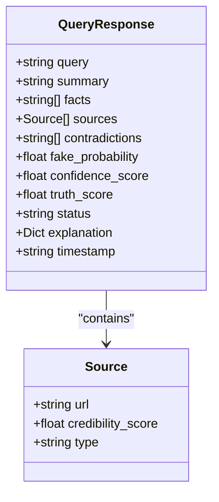

**Diagram sources**
- [schemas.py](file://veritas-ai/models/schemas.py)

**Section sources**
- [schemas.py](file://veritas-ai/models/schemas.py)

## Dependency Analysis
- Cohesion: Each engine encapsulates a single responsibility (truth scoring, consensus, firewall, explainability, alerts).
- Coupling:
  - ResponseBuilder depends on TruthEngine and schemas.
  - Multi-Agent Pipeline composes ResponseBuilder, ConsensusEngine, ExplainabilityLayer, HallucinationFirewall, and AlertEngine.
  - Validation Engine Wrapper depends on TruthEngine.
  - App-level validation agent composes TruthEngine, Firewall, Consensus, and Explainability.
- External dependencies: Async concurrency primitives, Redis cache, CrewAI agents (optional), and event bus.

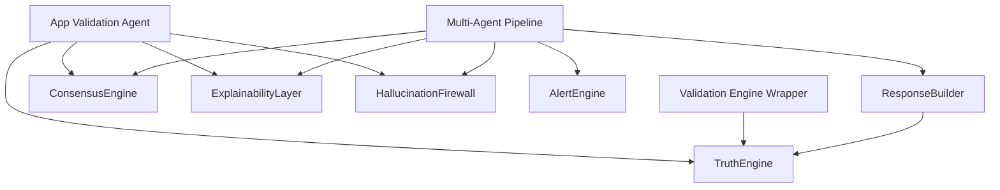

**Diagram sources**
- [response_builder.py](file://veritas-ai/pipelines/response_builder.py)
- [truth_engine.py](file://veritas-ai/core/truth_engine.py)
- [multi_agent_pipeline.py](file://veritas-ai/pipelines/multi_agent_pipeline.py)
- [consensus_engine.py](file://veritas-ai/core/consensus_engine.py)
- [explainability_layer.py](file://veritas-ai/core/explainability_layer.py)
- [firewall.py](file://veritas-ai/core/firewall.py)
- [alert_engine.py](file://veritas-ai/core/alert_engine.py)
- [validation_engine.py](file://veritas-ai/core/validation_engine.py)
- [validation.py](file://veritas-ai/app/agents/validation.py)

**Section sources**
- [response_builder.py](file://veritas-ai/pipelines/response_builder.py)
- [truth_engine.py](file://veritas-ai/core/truth_engine.py)
- [multi_agent_pipeline.py](file://veritas-ai/pipelines/multi_agent_pipeline.py)
- [consensus_engine.py](file://veritas-ai/core/consensus_engine.py)
- [explainability_layer.py](file://veritas-ai/core/explainability_layer.py)
- [firewall.py](file://veritas-ai/core/firewall.py)
- [alert_engine.py](file://veritas-ai/core/alert_engine.py)
- [validation_engine.py](file://veritas-ai/core/validation_engine.py)
- [validation.py](file://veritas-ai/app/agents/validation.py)

## Performance Considerations
- Concurrency:
  - Use asyncio.gather for parallel agent execution and semaphores to cap parallel tool usage.
  - Offload CPU-heavy computations (e.g., TruthEngine) to thread pools to avoid blocking the event loop.
- Caching:
  - Cache agent outputs and research results using Redis with TTL to reduce repeated work.
- Lightweight fast path:
  - A fast pipeline uses a single agent and a lightweight model for quick responses.
- Event-driven orchestration:
  - Use an in-memory event bus to decouple producers and consumers, reducing coupling and enabling scalability.

[No sources needed since this section provides general guidance]

## Troubleshooting Guide
- Empty or invalid query:
  - The pipeline raises a specific error when the query is empty or deduplicated; ensure normalization and deduplication occur before execution.
- Timeout during agent execution:
  - The pipeline wraps CrewAI kickoff in a timeout; handle timeouts and exceptions gracefully and return a fallback response.
- Unsafe outputs:
  - The firewall clamps status to “uncertain” or “likely_false” under specific thresholds; review source credibility and contradiction counts.
- Alerts:
  - Review emitted alerts for contradictions, fake news probability, low truth scores, and temporal anomalies to diagnose issues.
- Testing:
  - Unit tests validate consensus calculations; use them to verify expected behavior after changes.

**Section sources**
- [multi_agent_pipeline.py](file://veritas-ai/pipelines/multi_agent_pipeline.py)
- [firewall.py](file://veritas-ai/core/firewall.py)
- [alert_engine.py](file://veritas-ai/core/alert_engine.py)
- [test_consensus.py](file://veritas-ai/tests/test_consensus.py)

## Conclusion
The system employs a layered approach to consensus and decision-making:
- TruthEngine provides a robust, weighted truth score.
- ConsensusEngine unifies multiple confidence signals into a single score.
- HallucinationFirewall enforces safety thresholds.
- ExplainabilityLayer ensures transparency and auditability.
- AlertEngine detects anomalies and triggers notifications.
- Multi-Agent Pipeline coordinates agents, caches results, and applies the full stack to produce a final, explainable decision.

This design balances accuracy, safety, and performance, with clear thresholds and mechanisms for uncertainty handling and large-scale coordination.