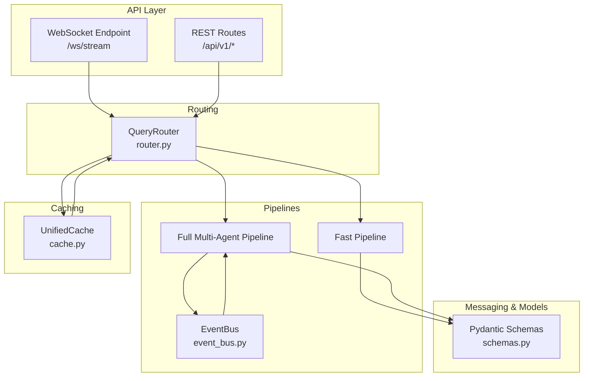
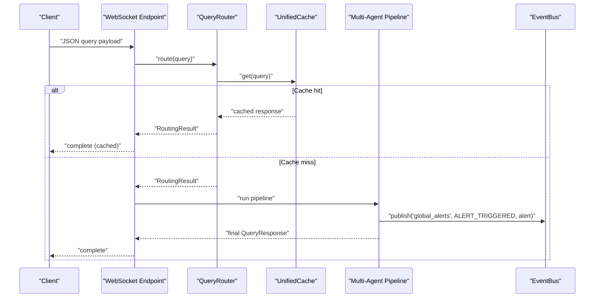
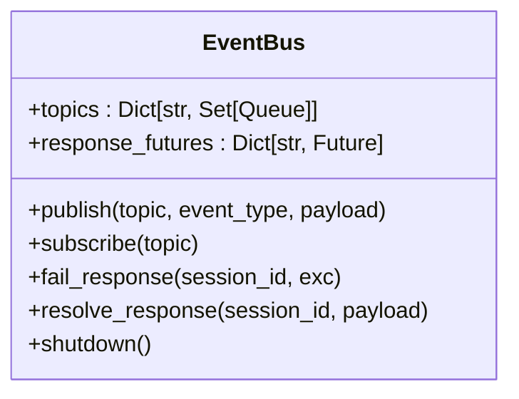
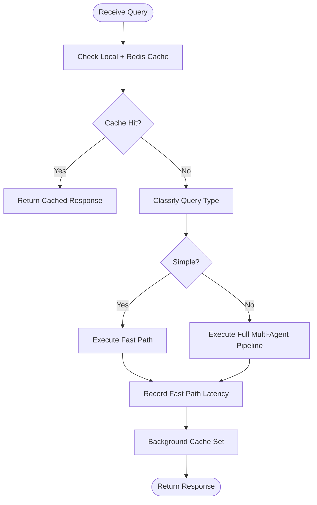
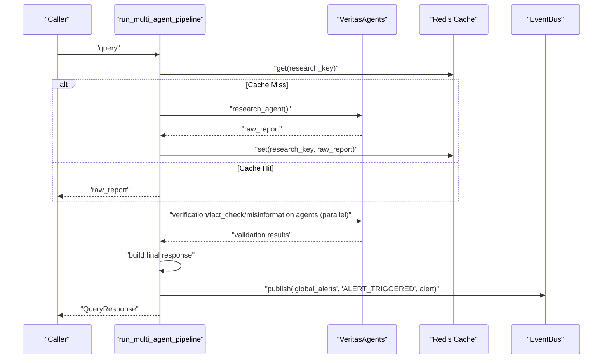
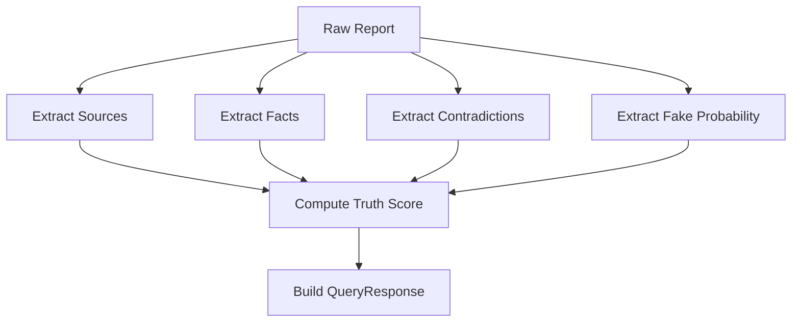
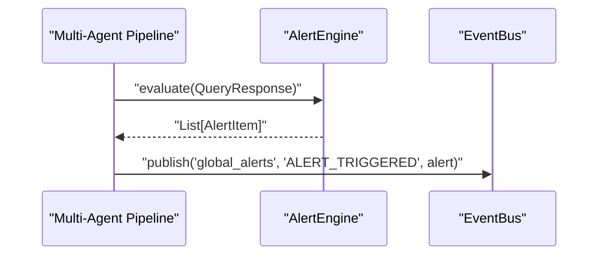
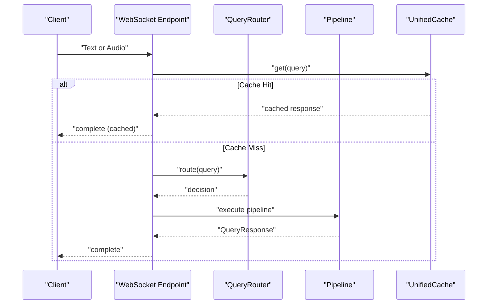
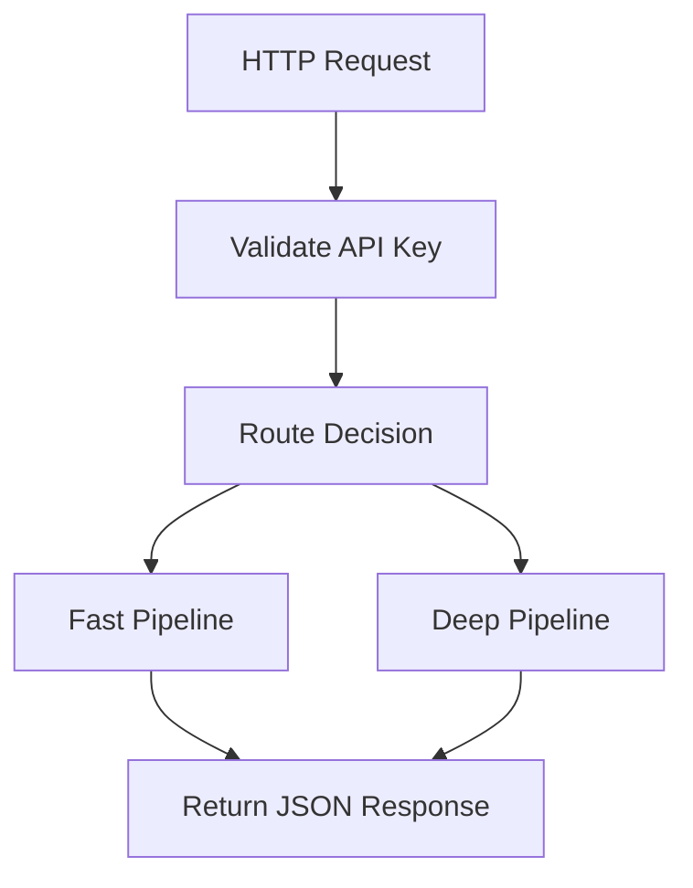
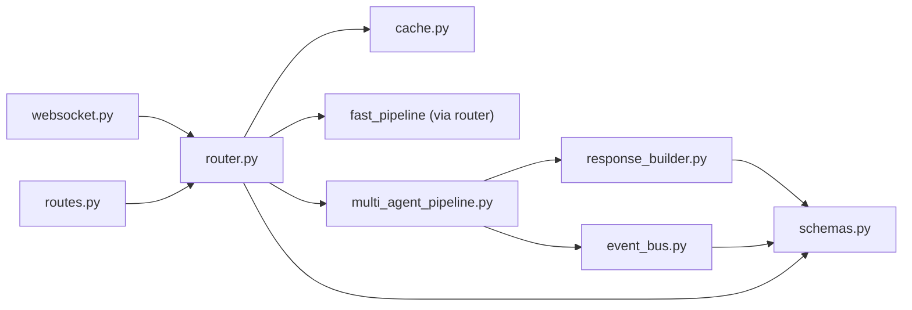

# Inter-Agent Communication Protocols

<cite>
**Referenced Files in This Document**
- [event_bus.py](file://veritas-ai/pipelines/event_bus.py)
- [multi_agent_pipeline.py](file://veritas-ai/pipelines/multi_agent_pipeline.py)
- [router.py](file://veritas-ai/core/router.py)
- [websocket.py](file://veritas-ai/app/api/websocket.py)
- [schemas.py](file://veritas-ai/models/schemas.py)
- [response_builder.py](file://veritas-ai/pipelines/response_builder.py)
- [alert_engine.py](file://veritas-ai/core/alert_engine.py)
- [routes.py](file://veritas-ai/app/api/routes.py)
- [veritas_agents.py](file://veritas-ai/agents/veritas_agents.py)
- [validation_engine.py](file://veritas-ai/core/validation_engine.py)
- [consensus_engine.py](file://veritas-ai/core/consensus_engine.py)
- [cache.py](file://veritas-ai/app/core/cache.py)
</cite>

## Table of Contents
1. [Introduction](#introduction)
2. [Project Structure](#project-structure)
3. [Core Components](#core-components)
4. [Architecture Overview](#architecture-overview)
5. [Detailed Component Analysis](#detailed-component-analysis)
6. [Dependency Analysis](#dependency-analysis)
7. [Performance Considerations](#performance-considerations)
8. [Troubleshooting Guide](#troubleshooting-guide)
9. [Conclusion](#conclusion)

## Introduction
This document describes the inter-agent communication protocols and messaging systems used by the system. It focuses on the message passing architecture, event-driven communication patterns, and asynchronous coordination mechanisms between agents. It explains routing protocols, message serialization formats, and communication channels used for agent-to-agent interaction. It also details the event bus implementation, pub-sub patterns, and message queuing systems, along with protocol specifications for different message types, error handling strategies, and reliability mechanisms. Network considerations, latency optimization, and fault tolerance in distributed agent communication are addressed.

## Project Structure
The inter-agent communication spans several layers:
- API layer: WebSocket and REST endpoints that accept client requests and orchestrate pipelines.
- Routing layer: Query classification and routing to either a fast or full pipeline.
- Pipeline layer: Multi-agent orchestration and parallel validation, with event emission for alerts.
- Messaging layer: An in-memory event bus implementing pub-sub semantics for internal agent events.
- Serialization layer: Pydantic models defining message formats for requests, responses, and alerts.
- Caching layer: Unified cache with local and Redis tiers to reduce latency and improve throughput.

**Diagram sources**
- [websocket.py:63-165](file://veritas-ai/app/api/websocket.py#L63-L165)
- [routes.py:100-128](file://veritas-ai/app/api/routes.py#L100-L128)
- [router.py:83-151](file://veritas-ai/core/router.py#L83-L151)
- [multi_agent_pipeline.py:209-298](file://veritas-ai/pipelines/multi_agent_pipeline.py#L209-L298)
- [event_bus.py:6-73](file://veritas-ai/pipelines/event_bus.py#L6-L73)
- [schemas.py:14-26](file://veritas-ai/models/schemas.py#L14-L26)
- [cache.py:15-172](file://veritas-ai/app/core/cache.py#L15-L172)

**Section sources**
- [websocket.py:1-253](file://veritas-ai/app/api/websocket.py#L1-L253)
- [routes.py:1-251](file://veritas-ai/app/api/routes.py#L1-L251)
- [router.py:1-182](file://veritas-ai/core/router.py#L1-L182)
- [multi_agent_pipeline.py:1-379](file://veritas-ai/pipelines/multi_agent_pipeline.py#L1-L379)
- [event_bus.py:1-74](file://veritas-ai/pipelines/event_bus.py#L1-L74)
- [schemas.py:1-88](file://veritas-ai/models/schemas.py#L1-L88)
- [cache.py:1-172](file://veritas-ai/app/core/cache.py#L1-L172)

## Core Components
- Event Bus: An in-memory pub-sub mechanism for internal agent-to-agent event propagation and alert broadcasting.
- Query Router: Classifies incoming queries and selects the appropriate pipeline path (fast vs. full), with integrated caching.
- Pipelines: Fast and full pipelines that coordinate agent tasks asynchronously, publish alerts, and produce standardized responses.
- Message Formats: Pydantic models define the structure for requests, responses, and alerts.
- Caching: Unified two-tier cache (local + Redis) to accelerate repeated queries and reduce downstream load.

Key responsibilities:
- Asynchronous coordination: Pipelines use asyncio primitives (gather, semaphores, futures) to run validations in parallel and manage timeouts.
- Pub-sub: The event bus publishes typed events to topics; consumers subscribe and iterate over messages.
- Serialization: All messages conform to Pydantic models for robustness and validation.
- Reliability: Graceful fallbacks (e.g., Redis unavailability), cancellation-safe shutdown, and progress callbacks for streaming clients.

**Section sources**
- [event_bus.py:6-73](file://veritas-ai/pipelines/event_bus.py#L6-L73)
- [router.py:83-151](file://veritas-ai/core/router.py#L83-L151)
- [multi_agent_pipeline.py:146-206](file://veritas-ai/pipelines/multi_agent_pipeline.py#L146-L206)
- [schemas.py:14-26](file://veritas-ai/models/schemas.py#L14-L26)
- [cache.py:15-172](file://veritas-ai/app/core/cache.py#L15-L172)

## Architecture Overview
The system implements a hybrid event-driven architecture:
- Clients send queries via WebSocket or REST.
- The router classifies and routes to a path; it consults a unified cache for hits.
- The selected pipeline executes asynchronously, emitting events and building a standardized response.
- The event bus distributes internal events to interested subscribers.

**Diagram sources**
- [websocket.py:63-165](file://veritas-ai/app/api/websocket.py#L63-L165)
- [router.py:99-136](file://veritas-ai/core/router.py#L99-L136)
- [cache.py:66-95](file://veritas-ai/app/core/cache.py#L66-L95)
- [multi_agent_pipeline.py:209-298](file://veritas-ai/pipelines/multi_agent_pipeline.py#L209-L298)
- [event_bus.py:31-50](file://veritas-ai/pipelines/event_bus.py#L31-L50)

## Detailed Component Analysis

### Event Bus Implementation (Pub-Sub)
The event bus provides:
- Topic-based routing: Publishers emit messages to named topics.
- Subscriber registration: Subscribers receive a dedicated queue and iterate over messages until unsubscribed.
- Response coordination: Futures keyed by session_id enable request-response coordination across asynchronous tasks.
- Shutdown safety: Cancels pending futures and clears internal state.

Message format:
- Each published message is a dictionary containing a type and a payload.
- Subscribers iterate over messages and process them synchronously per subscription.

**Diagram sources**
- [event_bus.py:6-73](file://veritas-ai/pipelines/event_bus.py#L6-L73)

**Section sources**
- [event_bus.py:6-73](file://veritas-ai/pipelines/event_bus.py#L6-L73)

### Query Routing and Path Selection
The router classifies queries and decides whether to serve from cache, run the fast path, or execute the full pipeline. It maintains metrics for each route and logs decision latencies.

**Diagram sources**
- [router.py:99-136](file://veritas-ai/core/router.py#L99-L136)
- [router.py:153-180](file://veritas-ai/core/router.py#L153-L180)

**Section sources**
- [router.py:51-82](file://veritas-ai/core/router.py#L51-L82)
- [router.py:83-151](file://veritas-ai/core/router.py#L83-L151)
- [router.py:153-180](file://veritas-ai/core/router.py#L153-L180)

### Multi-Agent Pipeline Coordination
The multi-agent pipeline coordinates:
- Parallel validation agents using asyncio.gather.
- Per-agent caching with Redis.
- Session-level deduplication and shared futures for in-flight queries.
- Alert emission via the event bus upon triggering.

**Diagram sources**
- [multi_agent_pipeline.py:209-298](file://veritas-ai/pipelines/multi_agent_pipeline.py#L209-L298)
- [multi_agent_pipeline.py:146-206](file://veritas-ai/pipelines/multi_agent_pipeline.py#L146-L206)
- [event_bus.py:31-50](file://veritas-ai/pipelines/event_bus.py#L31-L50)

**Section sources**
- [multi_agent_pipeline.py:107-144](file://veritas-ai/pipelines/multi_agent_pipeline.py#L107-L144)
- [multi_agent_pipeline.py:209-298](file://veritas-ai/pipelines/multi_agent_pipeline.py#L209-L298)
- [event_bus.py:31-50](file://veritas-ai/pipelines/event_bus.py#L31-L50)

### Message Serialization and Response Building
Responses are built from agent outputs and validated against Pydantic models. The response builder extracts facts, sources, contradictions, and computes scores.

**Diagram sources**
- [response_builder.py:111-145](file://veritas-ai/pipelines/response_builder.py#L111-L145)
- [schemas.py:14-26](file://veritas-ai/models/schemas.py#L14-L26)

**Section sources**
- [response_builder.py:17-98](file://veritas-ai/pipelines/response_builder.py#L17-L98)
- [schemas.py:14-26](file://veritas-ai/models/schemas.py#L14-L26)

### Alerting and Event Publishing
Alerts are generated from the final response and published to the event bus. Consumers can subscribe to the alerts topic to react to anomalies.

**Diagram sources**
- [multi_agent_pipeline.py:300-332](file://veritas-ai/pipelines/multi_agent_pipeline.py#L300-L332)
- [alert_engine.py:26-66](file://veritas-ai/core/alert_engine.py#L26-L66)
- [event_bus.py:31-50](file://veritas-ai/pipelines/event_bus.py#L31-L50)

**Section sources**
- [alert_engine.py:20-66](file://veritas-ai/core/alert_engine.py#L20-L66)
- [multi_agent_pipeline.py:300-332](file://veritas-ai/pipelines/multi_agent_pipeline.py#L300-L332)

### WebSocket Streaming and Real-Time Updates
The WebSocket endpoint streams progress updates and returns the final response. It supports both text queries and voice pipelines.

**Diagram sources**
- [websocket.py:63-165](file://veritas-ai/app/api/websocket.py#L63-L165)
- [router.py:99-136](file://veritas-ai/core/router.py#L99-L136)
- [cache.py:66-95](file://veritas-ai/app/core/cache.py#L66-L95)

**Section sources**
- [websocket.py:63-165](file://veritas-ai/app/api/websocket.py#L63-L165)

### REST API and Authorization
REST endpoints provide health checks, query resolution, feedback, and alert retrieval. Authentication is enforced via API keys.

**Diagram sources**
- [routes.py:100-128](file://veritas-ai/app/api/routes.py#L100-L128)
- [routes.py:198-210](file://veritas-ai/app/api/routes.py#L198-L210)

**Section sources**
- [routes.py:23-42](file://veritas-ai/app/api/routes.py#L23-L42)
- [routes.py:100-128](file://veritas-ai/app/api/routes.py#L100-L128)
- [routes.py:198-210](file://veritas-ai/app/api/routes.py#L198-L210)

## Dependency Analysis
Inter-component dependencies:
- WebSocket and REST endpoints depend on the router and pipelines.
- The router depends on the cache layer.
- The multi-agent pipeline depends on the event bus for alert publishing and on the response builder for final output.
- The event bus is a standalone component used internally by the pipeline.
- Pydantic schemas define the contract for all messages.

**Diagram sources**
- [websocket.py:63-165](file://veritas-ai/app/api/websocket.py#L63-L165)
- [routes.py:100-128](file://veritas-ai/app/api/routes.py#L100-L128)
- [router.py:99-136](file://veritas-ai/core/router.py#L99-L136)
- [multi_agent_pipeline.py:209-298](file://veritas-ai/pipelines/multi_agent_pipeline.py#L209-L298)
- [event_bus.py:31-50](file://veritas-ai/pipelines/event_bus.py#L31-L50)
- [response_builder.py:111-145](file://veritas-ai/pipelines/response_builder.py#L111-L145)
- [schemas.py:14-26](file://veritas-ai/models/schemas.py#L14-L26)
- [cache.py:15-172](file://veritas-ai/app/core/cache.py#L15-L172)

**Section sources**
- [websocket.py:1-253](file://veritas-ai/app/api/websocket.py#L1-L253)
- [routes.py:1-251](file://veritas-ai/app/api/routes.py#L1-L251)
- [router.py:1-182](file://veritas-ai/core/router.py#L1-L182)
- [multi_agent_pipeline.py:1-379](file://veritas-ai/pipelines/multi_agent_pipeline.py#L1-L379)
- [event_bus.py:1-74](file://veritas-ai/pipelines/event_bus.py#L1-L74)
- [response_builder.py:1-145](file://veritas-ai/pipelines/response_builder.py#L1-L145)
- [schemas.py:1-88](file://veritas-ai/models/schemas.py#L1-L88)
- [cache.py:1-172](file://veritas-ai/app/core/cache.py#L1-L172)

## Performance Considerations
- Parallelism: The full pipeline runs multiple validation agents concurrently using asyncio.gather and a semaphore to bound parallelism.
- Caching: Unified cache (local + Redis) reduces latency and downstream load; cache hits bypass expensive computations.
- Fast Path: Simple queries are routed to a single-pass fast pipeline to minimize latency.
- Async I/O: The event bus and pipelines rely on asyncio queues and futures to avoid blocking.
- Graceful degradation: If Redis is unavailable, the cache falls back to local-only operation.
- Timeout handling: Agent execution is wrapped with timeouts to prevent stalls.

Recommendations:
- Monitor cache hit rates and tune TTLs and capacities.
- Adjust semaphore limits to balance throughput and resource usage.
- Use structured progress callbacks to keep clients informed during long-running operations.
- Consider externalizing the event bus to a durable message broker for persistence and horizontal scaling.

[No sources needed since this section provides general guidance]

## Troubleshooting Guide
Common issues and strategies:
- Cache failures: If Redis is unreachable, the system continues operating with local cache only. Verify connectivity and credentials.
- Pipeline timeouts: Agent execution timeouts raise a pipeline-specific error; adjust timeout values or simplify tasks.
- WebSocket disconnects: The WebSocket handler catches disconnects and logs errors; ensure client reconnection logic.
- Alert delivery: If alerts are not observed, verify the subscription topic and that the pipeline emits alerts on conditions.
- Response validation: If clients receive malformed responses, ensure the response builder and schemas remain aligned.

Operational checks:
- Health endpoints: Use the health route to verify cache availability and hit rate.
- Metrics: Retrieve cache metrics and route decision timings from the metrics endpoint.
- Logs: Inspect logs for routing decisions, cache operations, and pipeline exceptions.

**Section sources**
- [cache.py:43-65](file://veritas-ai/app/core/cache.py#L43-L65)
- [websocket.py:161-165](file://veritas-ai/app/api/websocket.py#L161-L165)
- [routes.py:86-97](file://veritas-ai/app/api/routes.py#L86-L97)
- [multi_agent_pipeline.py:62-71](file://veritas-ai/pipelines/multi_agent_pipeline.py#L62-L71)

## Conclusion
The system’s inter-agent communication is built around an event-driven, asynchronous architecture. The event bus enables internal pub-sub messaging for alerts and coordination. The router and caching layer optimize latency by selecting the fastest viable path and serving repeated queries from cache. The pipelines coordinate agent tasks in parallel, serialize outputs using Pydantic models, and provide robust error handling and graceful degradation. Together, these components deliver a scalable, observable, and resilient communication framework for agent-to-agent interaction.