# Tool Integration Framework

<cite>
**Referenced Files in This Document**
- [base_tools.py](file://veritas-ai/tools/base_tools.py)
- [web_scraper.py](file://veritas-ai/tools/web_scraper.py)
- [news_api.py](file://veritas-ai/tools/news_api.py)
- [verification_tools.py](file://veritas-ai/tools/verification_tools.py)
- [kg_tools.py](file://veritas-ai/tools/kg_tools.py)
- [nlp_tools.py](file://veritas-ai/tools/nlp_tools.py)
- [rss_reader.py](file://veritas-ai/tools/rss_reader.py)
- [truth_tools.py](file://veritas-ai/tools/truth_tools.py)
- [knowledge_graph.py](file://veritas-ai/memory/knowledge_graph.py)
- [retrieval_pipeline.py](file://veritas-ai/pipelines/retrieval_pipeline.py)
- [settings.py](file://veritas-ai/config/settings.py)
- [router.py](file://veritas-ai/core/router.py)
- [vector_store.py](file://veritas-ai/memory/vector_store.py)
- [security.py](file://veritas-ai/core/security.py)
- [firewall.py](file://veritas-ai/core/firewall.py)
</cite>

## Table of Contents
1. [Introduction](#introduction)
2. [Project Structure](#project-structure)
3. [Core Components](#core-components)
4. [Architecture Overview](#architecture-overview)
5. [Detailed Component Analysis](#detailed-component-analysis)
6. [Dependency Analysis](#dependency-analysis)
7. [Performance Considerations](#performance-considerations)
8. [Troubleshooting Guide](#troubleshooting-guide)
9. [Conclusion](#conclusion)
10. [Appendices](#appendices)

## Introduction
This document describes the tool integration framework enabling agents to interact with external services and resources. It covers the base tool interface, tool registration mechanisms, execution patterns, discovery, dependency injection, resource management, and security controls. It also documents tool wrappers for web scraping, news APIs, verification services, knowledge graph operations, NLP-based content analysis, RSS feeds, and truth scoring, along with configuration, error handling, performance optimization, and reliability monitoring.

## Project Structure
The tool integration framework is organized around a set of LangChain-compatible tools under the tools module, backed by memory, retrieval, configuration, and security infrastructure.

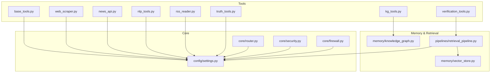

**Diagram sources**
- [base_tools.py:1-10](file://veritas-ai/tools/base_tools.py#L1-L10)
- [web_scraper.py:1-35](file://veritas-ai/tools/web_scraper.py#L1-L35)
- [news_api.py:1-48](file://veritas-ai/tools/news_api.py#L1-L48)
- [verification_tools.py:1-52](file://veritas-ai/tools/verification_tools.py#L1-L52)
- [kg_tools.py:1-50](file://veritas-ai/tools/kg_tools.py#L1-L50)
- [nlp_tools.py:1-52](file://veritas-ai/tools/nlp_tools.py#L1-L52)
- [rss_reader.py:1-26](file://veritas-ai/tools/rss_reader.py#L1-L26)
- [truth_tools.py:1-29](file://veritas-ai/tools/truth_tools.py#L1-L29)
- [knowledge_graph.py:1-160](file://veritas-ai/memory/knowledge_graph.py#L1-L160)
- [retrieval_pipeline.py:1-112](file://veritas-ai/pipelines/retrieval_pipeline.py#L1-L112)
- [vector_store.py:1-27](file://veritas-ai/memory/vector_store.py#L1-L27)
- [settings.py:1-83](file://veritas-ai/config/settings.py#L1-L83)
- [router.py:1-182](file://veritas-ai/core/router.py#L1-L182)
- [security.py:1-129](file://veritas-ai/core/security.py#L1-L129)
- [firewall.py:1-47](file://veritas-ai/core/firewall.py#L1-L47)

**Section sources**
- [settings.py:1-83](file://veritas-ai/config/settings.py#L1-L83)
- [router.py:1-182](file://veritas-ai/core/router.py#L1-L182)

## Core Components
- Base tool interface: Tools are decorated with a LangChain decorator and expose typed parameters and string return values. They encapsulate external service interactions behind a uniform interface.
- Tool registration: Tools are Python modules that define decorated functions; they are automatically discoverable as part of the module structure.
- Execution patterns:
  - Synchronous tools operate inline and return strings.
  - Asynchronous tools leverage async/await and integrate with retrieval and graph operations.
- Discovery: Tools are discovered by importing the tools package and invoking tool functions by name.
- Dependency injection: Tools rely on configuration via a centralized settings object and inject dependencies such as HTTP clients, embedding stores, and graph drivers.
- Resource management: Browser instances for scraping are managed with try/finally blocks; graph connections use a singleton driver with pooling and explicit close semantics.

**Section sources**
- [base_tools.py:1-10](file://veritas-ai/tools/base_tools.py#L1-L10)
- [web_scraper.py:1-35](file://veritas-ai/tools/web_scraper.py#L1-L35)
- [news_api.py:1-48](file://veritas-ai/tools/news_api.py#L1-L48)
- [verification_tools.py:1-52](file://veritas-ai/tools/verification_tools.py#L1-L52)
- [kg_tools.py:1-50](file://veritas-ai/tools/kg_tools.py#L1-L50)
- [nlp_tools.py:1-52](file://veritas-ai/tools/nlp_tools.py#L1-L52)
- [rss_reader.py:1-26](file://veritas-ai/tools/rss_reader.py#L1-L26)
- [truth_tools.py:1-29](file://veritas-ai/tools/truth_tools.py#L1-L29)
- [settings.py:1-83](file://veritas-ai/config/settings.py#L1-L83)
- [knowledge_graph.py:1-160](file://veritas-ai/memory/knowledge_graph.py#L1-L160)

## Architecture Overview
The tool integration framework composes LangChain-compatible tools with retrieval and knowledge graph capabilities, governed by a central router and secured by API key validation and rate limiting.

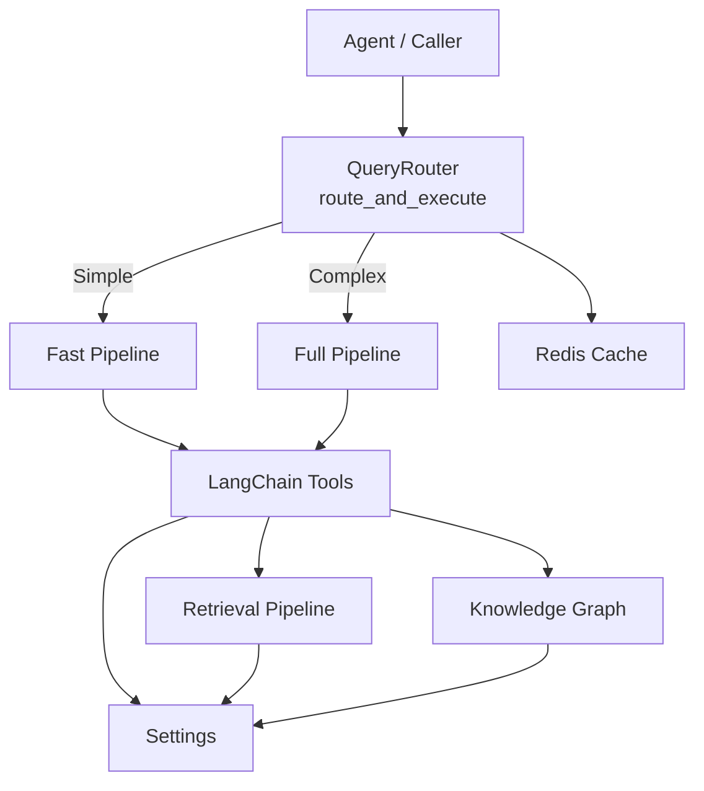

**Diagram sources**
- [router.py:83-182](file://veritas-ai/core/router.py#L83-L182)
- [retrieval_pipeline.py:48-72](file://veritas-ai/pipelines/retrieval_pipeline.py#L48-L72)
- [knowledge_graph.py:25-43](file://veritas-ai/memory/knowledge_graph.py#L25-L43)
- [settings.py:1-83](file://veritas-ai/config/settings.py#L1-L83)

## Detailed Component Analysis

### Base Tool Interface and Registration
- Tools are defined as decorated functions that accept typed parameters and return strings. This provides a uniform signature for agent invocation.
- Registration is implicit through module import; the LangChain decorator exposes tool metadata and names.

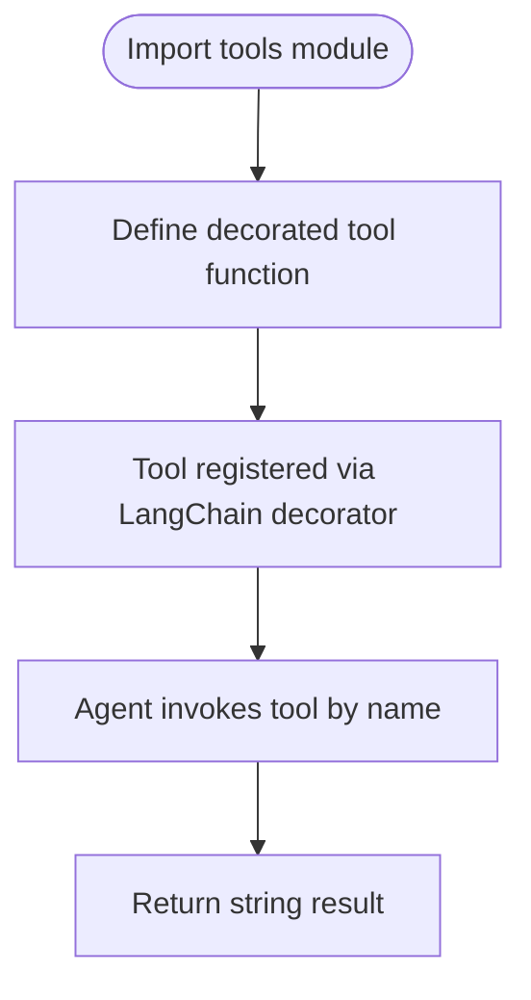

**Diagram sources**
- [base_tools.py:1-10](file://veritas-ai/tools/base_tools.py#L1-L10)

**Section sources**
- [base_tools.py:1-10](file://veritas-ai/tools/base_tools.py#L1-L10)

### Web Scraping Tool
- Uses a headless browser to navigate a URL, waits for DOM readiness, and extracts main content using heuristics for article/main/body selectors.
- Implements robust error handling and ensures browser cleanup in a finally block.

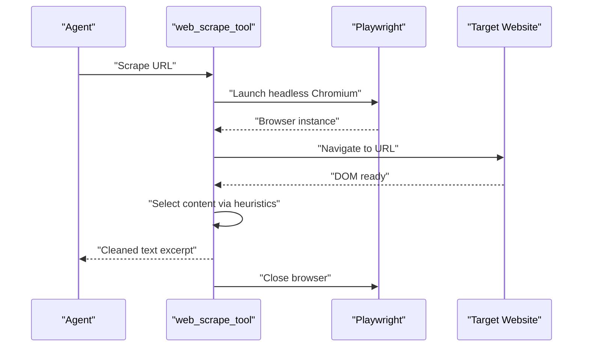

**Diagram sources**
- [web_scraper.py:4-35](file://veritas-ai/tools/web_scraper.py#L4-L35)

**Section sources**
- [web_scraper.py:1-35](file://veritas-ai/tools/web_scraper.py#L1-L35)

### News API Tool
- Supports two providers via configuration-driven selection:
  - Provider 1: Uses a configured API key to query a modern news API.
  - Provider 2: Uses a configured API key to query a legacy news API.
- Formats results into a compact string listing titles, descriptions, and URLs, with graceful fallback messaging when no provider is configured.

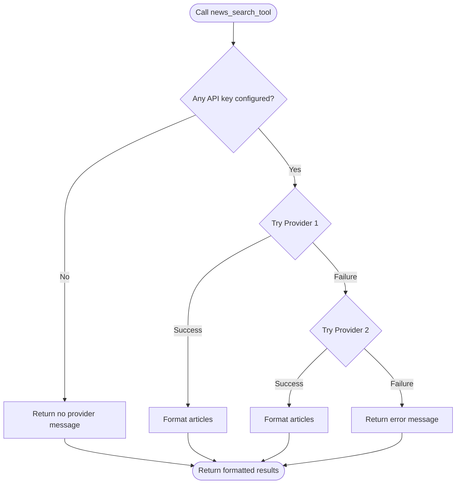

**Diagram sources**
- [news_api.py:18-48](file://veritas-ai/tools/news_api.py#L18-L48)

**Section sources**
- [news_api.py:1-48](file://veritas-ai/tools/news_api.py#L1-L48)
- [settings.py:60-67](file://veritas-ai/config/settings.py#L60-L67)

### Verification Tools
- Domain Credibility Evaluator: Parses a URL and assigns a score and category based on domain heuristics (official, media, social, unknown).
- RAG Fact Checker: Performs asynchronous retrieval of relevant context from a vector database and compiles evidence with relevance scores.

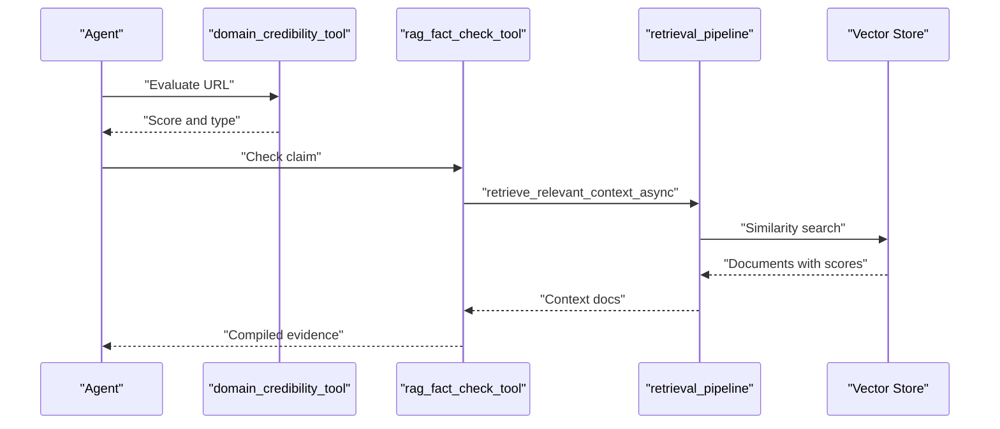

**Diagram sources**
- [verification_tools.py:5-52](file://veritas-ai/tools/verification_tools.py#L5-L52)
- [retrieval_pipeline.py:48-72](file://veritas-ai/pipelines/retrieval_pipeline.py#L48-L72)

**Section sources**
- [verification_tools.py:1-52](file://veritas-ai/tools/verification_tools.py#L1-L52)
- [retrieval_pipeline.py:1-112](file://veritas-ai/pipelines/retrieval_pipeline.py#L1-L112)

### Knowledge Graph Tools
- Knowledge Graph Entity Builder: Accepts structured JSON and merges entities and relationships into the graph asynchronously, with strict label and relationship validation.
- Knowledge Graph Validator: Queries the graph for relationships of a given entity and returns a formatted mapping.

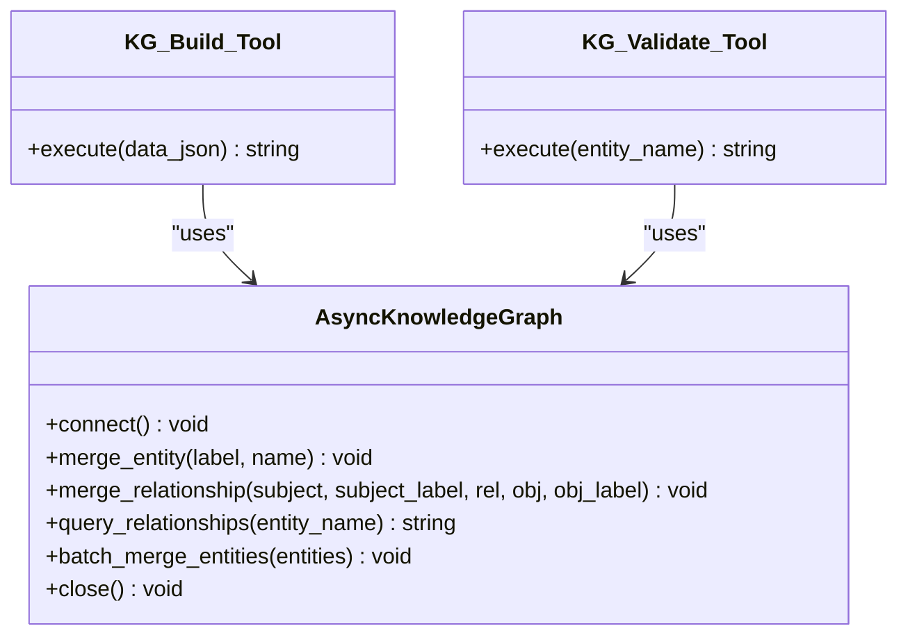

**Diagram sources**
- [kg_tools.py:5-50](file://veritas-ai/tools/kg_tools.py#L5-L50)
- [knowledge_graph.py:12-132](file://veritas-ai/memory/knowledge_graph.py#L12-L132)

**Section sources**
- [kg_tools.py:1-50](file://veritas-ai/tools/kg_tools.py#L1-L50)
- [knowledge_graph.py:1-160](file://veritas-ai/memory/knowledge_graph.py#L1-L160)

### NLP Tools
- Fake News Detector: Lazily loads a transformer-based classifier and evaluates textual content, returning classification labels and confidences. Includes truncation to fit model constraints and graceful degradation when the model is unavailable.

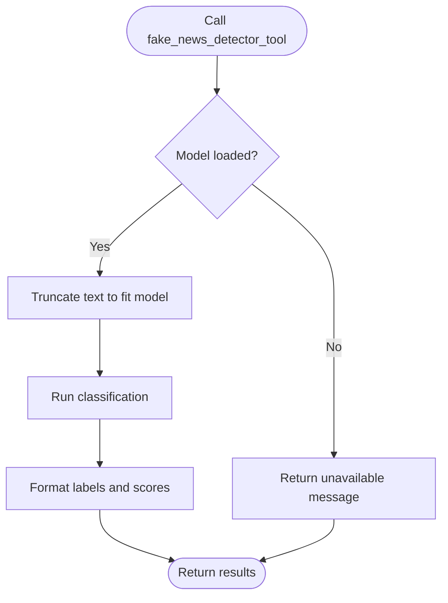

**Diagram sources**
- [nlp_tools.py:27-52](file://veritas-ai/tools/nlp_tools.py#L27-L52)

**Section sources**
- [nlp_tools.py:1-52](file://veritas-ai/tools/nlp_tools.py#L1-L52)

### RSS Reader Tool
- Parses an RSS feed URL, extracts up to three latest entries, and returns a formatted string with titles, links, and summaries. Includes error handling for malformed feeds.

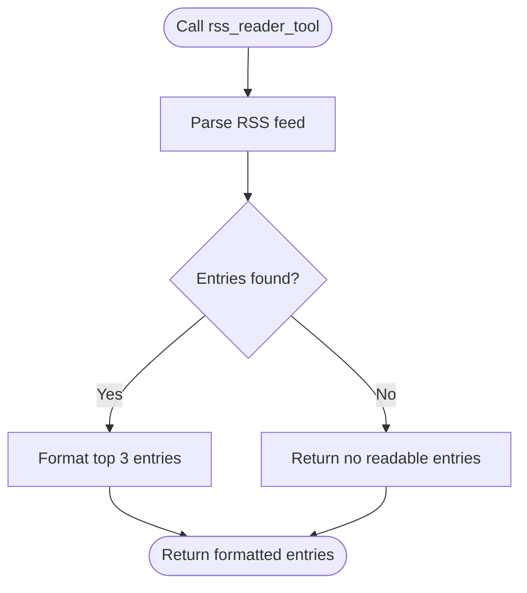

**Diagram sources**
- [rss_reader.py:4-26](file://veritas-ai/tools/rss_reader.py#L4-L26)

**Section sources**
- [rss_reader.py:1-26](file://veritas-ai/tools/rss_reader.py#L1-L26)

### Truth Scoring Tool
- Accepts a JSON payload containing structured intelligence constraints and computes a unified truth score via a dedicated engine, returning a serialized result.

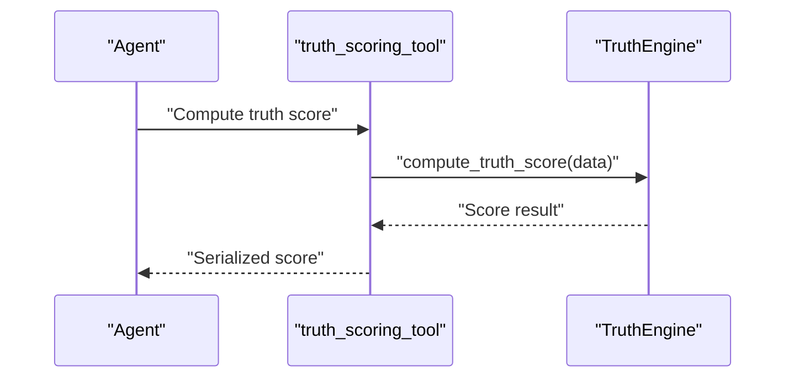

**Diagram sources**
- [truth_tools.py:5-29](file://veritas-ai/tools/truth_tools.py#L5-L29)

**Section sources**
- [truth_tools.py:1-29](file://veritas-ai/tools/truth_tools.py#L1-L29)

### Retrieval Pipeline and Vector Store
- Provides cached access to vector store and embeddings, supports similarity search with optional filters, and offers async retrieval with Redis caching and batching.

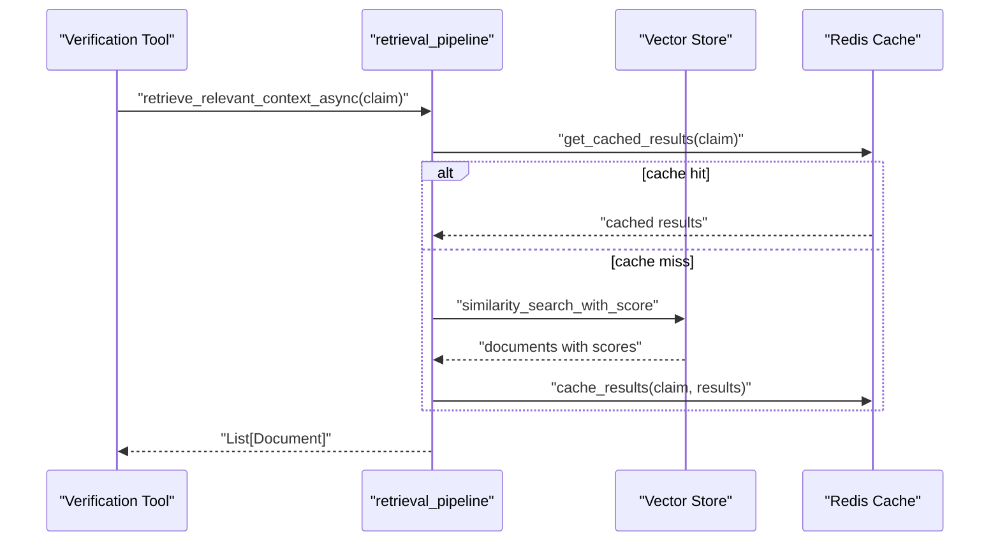

**Diagram sources**
- [retrieval_pipeline.py:48-72](file://veritas-ai/pipelines/retrieval_pipeline.py#L48-L72)
- [vector_store.py:1-27](file://veritas-ai/memory/vector_store.py#L1-L27)

**Section sources**
- [retrieval_pipeline.py:1-112](file://veritas-ai/pipelines/retrieval_pipeline.py#L1-L112)
- [vector_store.py:1-27](file://veritas-ai/memory/vector_store.py#L1-L27)

### Router and Execution Orchestration
- Classifies queries into simple, factual, or complex categories and routes them to appropriate pipelines. Implements local and Redis caching, metrics collection, and unified execution entry points.

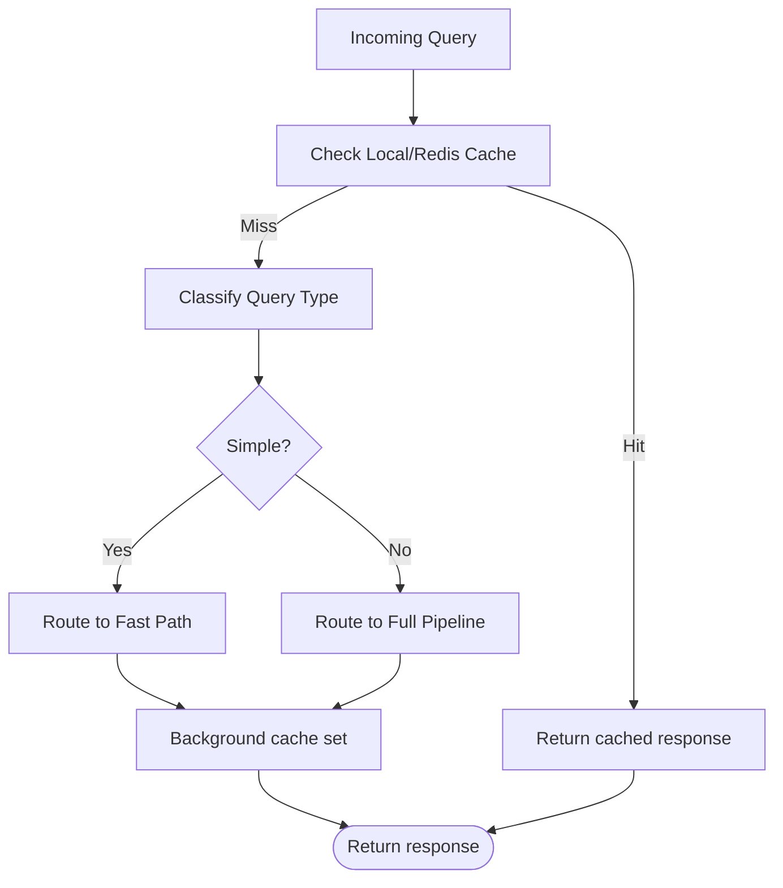

**Diagram sources**
- [router.py:83-182](file://veritas-ai/core/router.py#L83-L182)

**Section sources**
- [router.py:1-182](file://veritas-ai/core/router.py#L1-L182)

### Security and Rate Limiting
- API key validation enforces fixed-window rate limiting per tier, with configurable limits and hourly reset windows. Provides utilities to generate new keys and secure endpoint access.

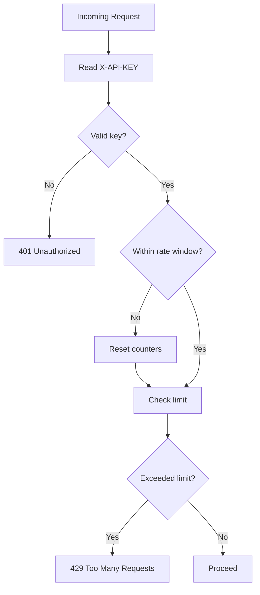

**Diagram sources**
- [security.py:51-84](file://veritas-ai/core/security.py#L51-L84)

**Section sources**
- [security.py:1-129](file://veritas-ai/core/security.py#L1-L129)

### Firewall for Reliability
- Applies deterministic rules to clamp statuses based on contradiction counts, trusted source thresholds, and truth scores, preventing unverified outputs from propagating.

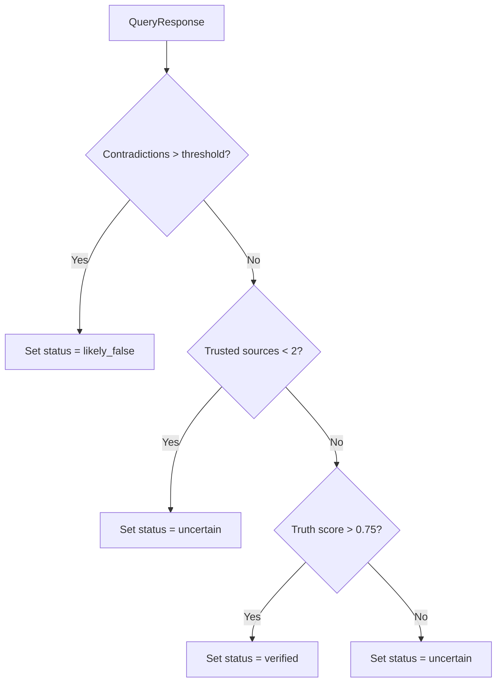

**Diagram sources**
- [firewall.py:13-46](file://veritas-ai/core/firewall.py#L13-L46)

**Section sources**
- [firewall.py:1-47](file://veritas-ai/core/firewall.py#L1-L47)

## Dependency Analysis
- Tools depend on configuration for credentials and timeouts.
- Retrieval pipeline depends on vector store initialization and Redis caching.
- Knowledge graph tools depend on AsyncKnowledgeGraph singleton and Neo4j connectivity.
- Router orchestrates tool execution and integrates caching and classification.
- Security and firewall provide cross-cutting concerns for access control and output validation.

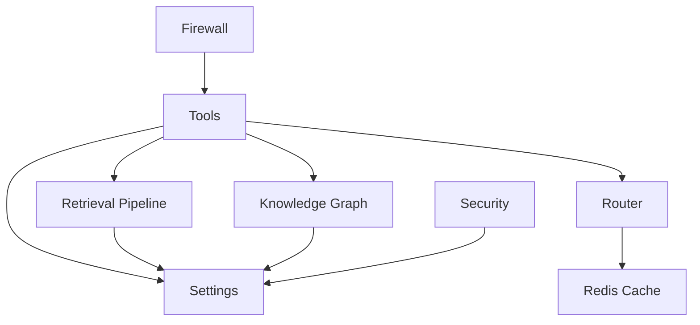

**Diagram sources**
- [settings.py:1-83](file://veritas-ai/config/settings.py#L1-L83)
- [router.py:1-182](file://veritas-ai/core/router.py#L1-L182)
- [retrieval_pipeline.py:1-112](file://veritas-ai/pipelines/retrieval_pipeline.py#L1-L112)
- [knowledge_graph.py:1-160](file://veritas-ai/memory/knowledge_graph.py#L1-L160)
- [security.py:1-129](file://veritas-ai/core/security.py#L1-L129)
- [firewall.py:1-47](file://veritas-ai/core/firewall.py#L1-L47)

**Section sources**
- [settings.py:1-83](file://veritas-ai/config/settings.py#L1-L83)
- [router.py:1-182](file://veritas-ai/core/router.py#L1-L182)
- [retrieval_pipeline.py:1-112](file://veritas-ai/pipelines/retrieval_pipeline.py#L1-L112)
- [knowledge_graph.py:1-160](file://veritas-ai/memory/knowledge_graph.py#L1-L160)
- [security.py:1-129](file://veritas-ai/core/security.py#L1-L129)
- [firewall.py:1-47](file://veritas-ai/core/firewall.py#L1-L47)

## Performance Considerations
- Caching: Results are cached in-memory and Redis to reduce repeated work. Async retrieval leverages executor pools to keep I/O non-blocking.
- Concurrency: Async tools and graph operations minimize blocking. Settings include a maximum parallel tools limit to cap concurrency.
- Resource pooling: Graph driver uses connection pooling and verifies connectivity on first use.
- Truncation and limits: Text truncation prevents oversized inputs for NLP models; retrieval limits bound result sets.
- Streaming: Optional streaming and chunk sizes can be tuned for throughput.

[No sources needed since this section provides general guidance]

## Troubleshooting Guide
- Tool failures:
  - Web scraping: Ensure the target site is reachable and responsive; check timeouts and selector heuristics.
  - News APIs: Verify API keys and network connectivity; confirm provider availability.
  - Knowledge Graph: Confirm Neo4j URI, credentials, and connectivity; check allowed labels and relationships.
  - Retrieval: Validate vector store persistence directory and embedding model configuration.
- Security:
  - API key errors: Confirm presence of the X-API-KEY header and validity; check rate limit windows.
  - Rate limiting: Monitor request counts and reset windows; adjust tiers as needed.
- Reliability:
  - Firewall overrides: Review contradiction thresholds and trusted source counts to tune output stability.

**Section sources**
- [web_scraper.py:10-35](file://veritas-ai/tools/web_scraper.py#L10-L35)
- [news_api.py:25-47](file://veritas-ai/tools/news_api.py#L25-L47)
- [knowledge_graph.py:25-43](file://veritas-ai/memory/knowledge_graph.py#L25-L43)
- [retrieval_pipeline.py:15-26](file://veritas-ai/pipelines/retrieval_pipeline.py#L15-L26)
- [security.py:51-84](file://veritas-ai/core/security.py#L51-L84)
- [firewall.py:13-46](file://veritas-ai/core/firewall.py#L13-L46)

## Conclusion
The tool integration framework provides a cohesive, extensible foundation for agent-driven interactions with external services. It standardizes tool interfaces, manages dependencies and resources, and incorporates robust security, caching, and reliability controls. The modular design allows incremental enhancements, such as replacing placeholders with real APIs and expanding tool coverage.

[No sources needed since this section summarizes without analyzing specific files]

## Appendices

### Tool Configuration Options
- API keys: Configure provider credentials for news APIs and graph connectivity.
- Retriever: Tune retrieval K and embedding model settings.
- Caching: Adjust cache TTL and max entries for optimal latency vs. freshness.
- Parallelism: Control maximum parallel tools to balance throughput and resource usage.
- Security: Set API tier limits and reset windows; configure CORS origins.

**Section sources**
- [settings.py:20-83](file://veritas-ai/config/settings.py#L20-L83)