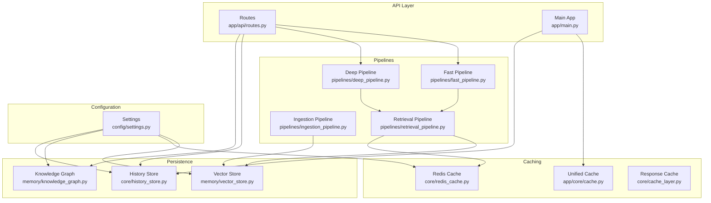
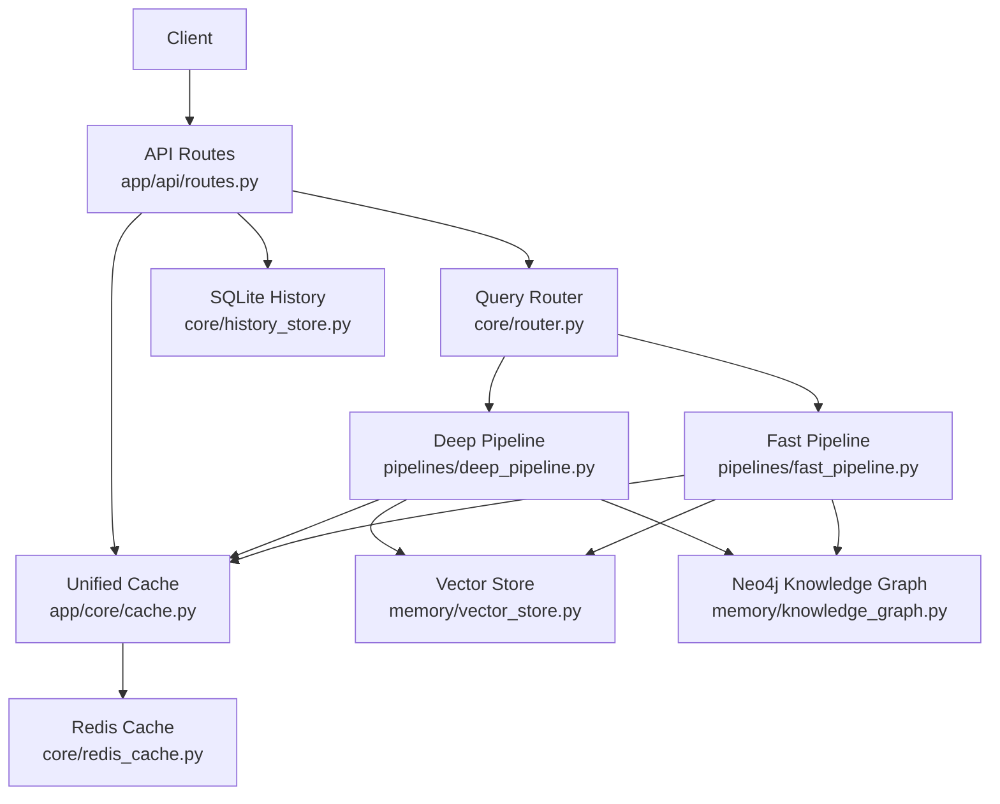
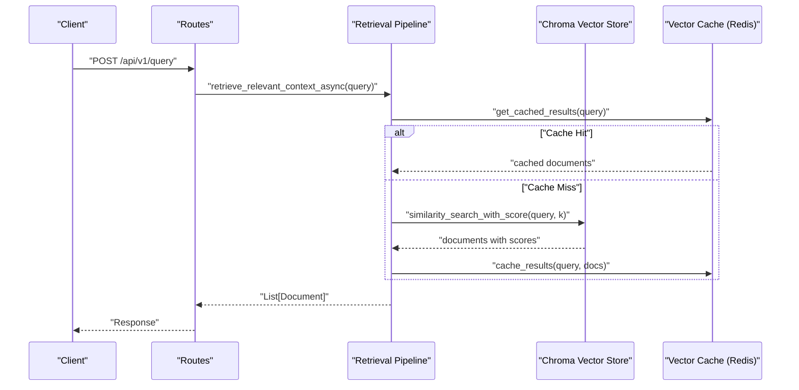
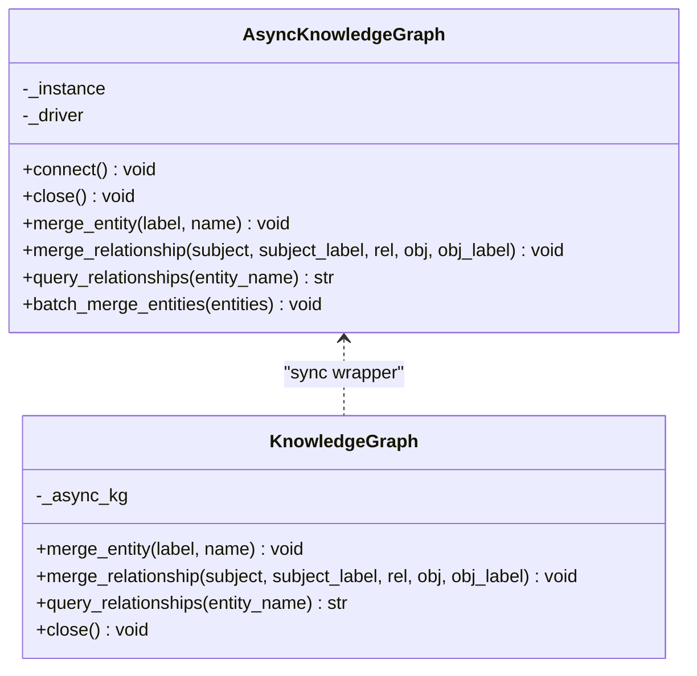
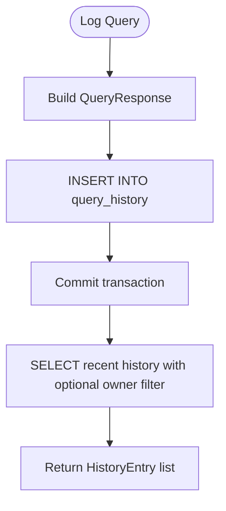
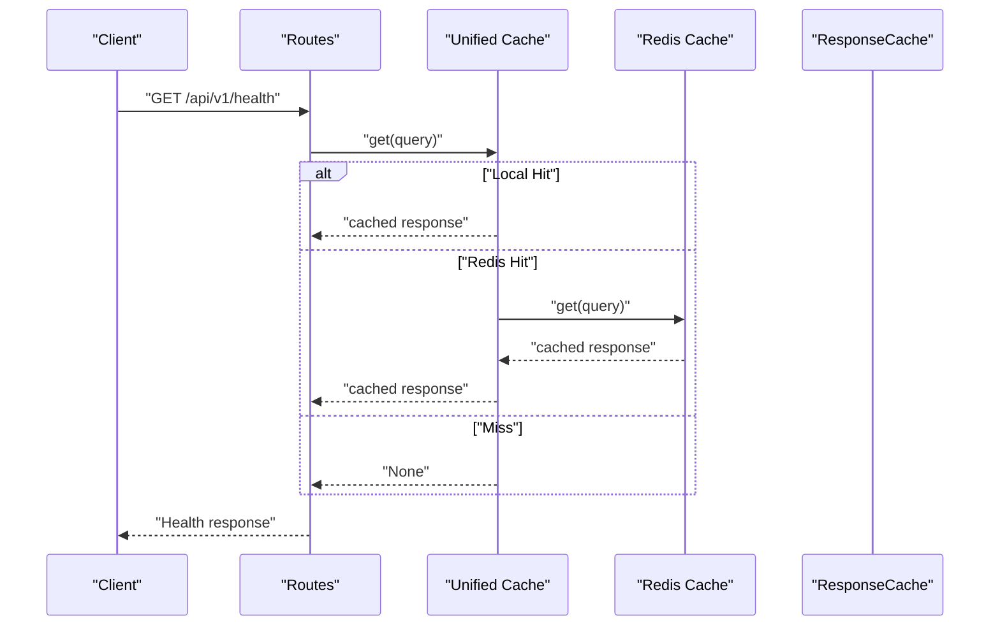
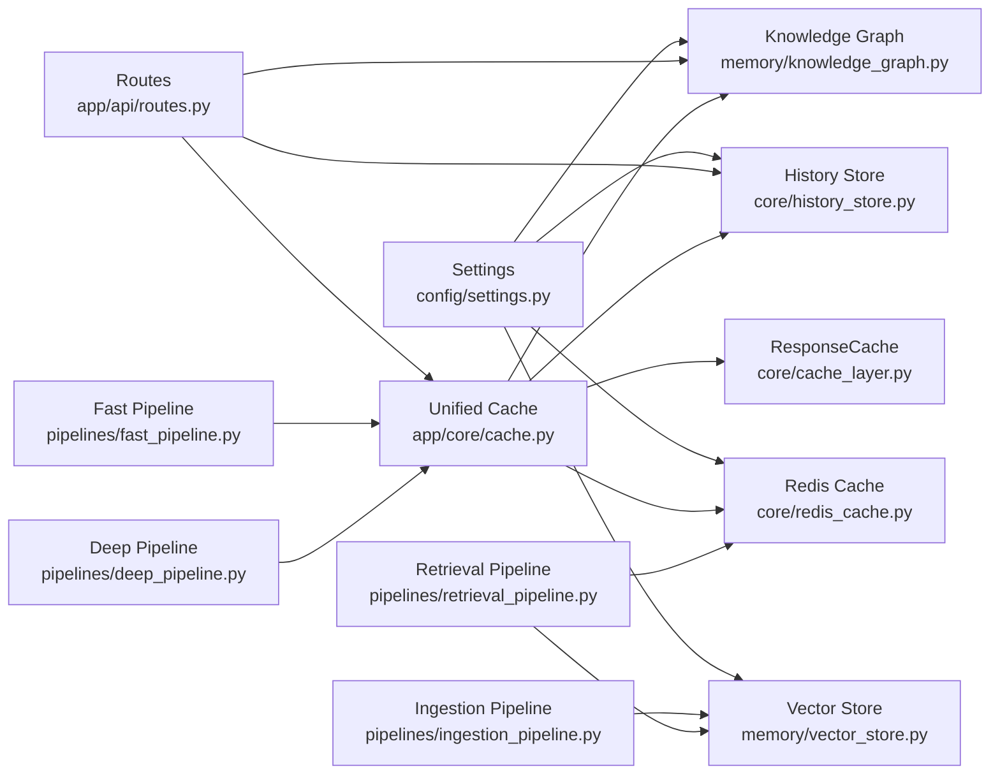

# Data Storage Infrastructure

<cite>
**Referenced Files in This Document**
- [vector_store.py](file://veritas-ai/memory/vector_store.py)
- [knowledge_graph.py](file://veritas-ai/memory/knowledge_graph.py)
- [redis_cache.py](file://veritas-ai/core/redis_cache.py)
- [cache_layer.py](file://veritas-ai/core/cache_layer.py)
- [history_store.py](file://veritas-ai/core/history_store.py)
- [settings.py](file://veritas-ai/config/settings.py)
- [ingestion_pipeline.py](file://veritas-ai/pipelines/ingestion_pipeline.py)
- [retrieval_pipeline.py](file://veritas-ai/pipelines/retrieval_pipeline.py)
- [schemas.py](file://veritas-ai/models/schemas.py)
- [main.py](file://veritas-ai/app/main.py)
- [routes.py](file://veritas-ai/app/api/routes.py)
- [cache.py](file://veritas-ai/app/core/cache.py)
- [fast_pipeline.py](file://veritas-ai/pipelines/fast_pipeline.py)
- [deep_pipeline.py](file://veritas-ai/pipelines/deep_pipeline.py)
- [docker-compose.yml](file://docker-compose.yml)
- [Dockerfile](file://Dockerfile)
</cite>

## Table of Contents
1. [Introduction](#introduction)
2. [Project Structure](#project-structure)
3. [Core Components](#core-components)
4. [Architecture Overview](#architecture-overview)
5. [Detailed Component Analysis](#detailed-component-analysis)
6. [Dependency Analysis](#dependency-analysis)
7. [Performance Considerations](#performance-considerations)
8. [Troubleshooting Guide](#troubleshooting-guide)
9. [Conclusion](#conclusion)
10. [Appendices](#appendices)

## Introduction
This document describes the distributed data storage infrastructure of Veritas AI. The system combines multiple storage tiers to support fast retrieval, semantic search, knowledge graph construction, and durable history tracking. The primary tiers are:
- Redis cache (distributed, shared across workers)
- ChromaDB vector store (persistent, for semantic similarity search)
- Neo4j knowledge graph (entities and relationships)
- SQLite session cache (query history persistence)

The document explains data persistence patterns, caching strategies, data lifecycle management, vector embedding storage, knowledge graph construction and querying, historical data retention, cache coherency, synchronization patterns, backup/recovery, performance optimization, capacity planning, migration strategies, privacy controls, access patterns, and integration with external data sources.

## Project Structure
The storage-related components are organized by functional layer:
- Memory and persistence: vector store, knowledge graph, history store
- Caching: unified cache, Redis cache, response cache
- Pipelines: ingestion and retrieval pipelines
- Configuration: settings
- API and application lifecycle: main app, routes, pipelines

**Diagram sources**
- [routes.py:1-251](file://veritas-ai/app/api/routes.py#L1-L251)
- [main.py:1-208](file://veritas-ai/app/main.py#L1-L208)
- [fast_pipeline.py:1-22](file://veritas-ai/pipelines/fast_pipeline.py#L1-L22)
- [deep_pipeline.py:1-17](file://veritas-ai/pipelines/deep_pipeline.py#L1-L17)
- [ingestion_pipeline.py:1-38](file://veritas-ai/pipelines/ingestion_pipeline.py#L1-L38)
- [retrieval_pipeline.py:1-112](file://veritas-ai/pipelines/retrieval_pipeline.py#L1-L112)
- [cache.py:1-172](file://veritas-ai/app/core/cache.py#L1-L172)
- [redis_cache.py:1-232](file://veritas-ai/core/redis_cache.py#L1-L232)
- [cache_layer.py:1-41](file://veritas-ai/core/cache_layer.py#L1-L41)
- [vector_store.py:1-27](file://veritas-ai/memory/vector_store.py#L1-L27)
- [knowledge_graph.py:1-160](file://veritas-ai/memory/knowledge_graph.py#L1-L160)
- [history_store.py:1-106](file://veritas-ai/core/history_store.py#L1-L106)
- [settings.py:1-83](file://veritas-ai/config/settings.py#L1-L83)

**Section sources**
- [routes.py:1-251](file://veritas-ai/app/api/routes.py#L1-L251)
- [main.py:1-208](file://veritas-ai/app/main.py#L1-L208)
- [settings.py:1-83](file://veritas-ai/config/settings.py#L1-L83)

## Core Components
- Vector Store: initializes a persistent Chroma collection with Ollama embeddings for semantic similarity search and retrieval.
- Redis Cache: distributed cache with local in-memory fallback, supports query and vector result caching with TTL.
- Knowledge Graph: async Neo4j client with entity and relationship merging, connectivity verification, and relationship queries.
- History Store: SQLite-backed query history with WAL mode and configurable limits.
- Unified Cache: two-tier cache (local TTL + Redis) with graceful fallback and statistics.
- Retrieval Pipeline: retrieves context from vector store with optional Redis caching and batching.
- Ingestion Pipeline: splits documents and adds chunks to the vector store in batches.
- Settings: centralized configuration for Redis, Chroma, Neo4j, and other runtime parameters.

**Section sources**
- [vector_store.py:1-27](file://veritas-ai/memory/vector_store.py#L1-L27)
- [redis_cache.py:1-232](file://veritas-ai/core/redis_cache.py#L1-L232)
- [knowledge_graph.py:1-160](file://veritas-ai/memory/knowledge_graph.py#L1-L160)
- [history_store.py:1-106](file://veritas-ai/core/history_store.py#L1-L106)
- [cache.py:1-172](file://veritas-ai/app/core/cache.py#L1-L172)
- [retrieval_pipeline.py:1-112](file://veritas-ai/pipelines/retrieval_pipeline.py#L1-L112)
- [ingestion_pipeline.py:1-38](file://veritas-ai/pipelines/ingestion_pipeline.py#L1-L38)
- [settings.py:1-83](file://veritas-ai/config/settings.py#L1-L83)

## Architecture Overview
The system follows a multi-tiered storage architecture:
- Ingestion writes to ChromaDB (vector store) via the ingestion pipeline.
- Retrieval reads from ChromaDB and optionally caches results in Redis.
- Knowledge Graph maintains entities and relationships in Neo4j for strictness checks and contextual enrichment.
- History Store persists query results in SQLite for audit and analytics.
- Unified Cache provides low-latency, distributed caching with local fallback.

**Diagram sources**
- [routes.py:1-251](file://veritas-ai/app/api/routes.py#L1-L251)
- [fast_pipeline.py:1-22](file://veritas-ai/pipelines/fast_pipeline.py#L1-L22)
- [deep_pipeline.py:1-17](file://veritas-ai/pipelines/deep_pipeline.py#L1-L17)
- [cache.py:1-172](file://veritas-ai/app/core/cache.py#L1-L172)
- [redis_cache.py:1-232](file://veritas-ai/core/redis_cache.py#L1-L232)
- [vector_store.py:1-27](file://veritas-ai/memory/vector_store.py#L1-L27)
- [knowledge_graph.py:1-160](file://veritas-ai/memory/knowledge_graph.py#L1-L160)
- [history_store.py:1-106](file://veritas-ai/core/history_store.py#L1-L106)

## Detailed Component Analysis

### Vector Embedding Storage and Semantic Search
- Embedding model and base URL are configured centrally.
- Vector store initialization ensures persistence directory exists and creates a named collection with the embedding function.
- Retrieval pipeline supports similarity search with scores, optional filters, and batching.

**Diagram sources**
- [retrieval_pipeline.py:1-112](file://veritas-ai/pipelines/retrieval_pipeline.py#L1-L112)
- [redis_cache.py:166-223](file://veritas-ai/core/redis_cache.py#L166-L223)
- [vector_store.py:1-27](file://veritas-ai/memory/vector_store.py#L1-L27)

**Section sources**
- [vector_store.py:1-27](file://veritas-ai/memory/vector_store.py#L1-L27)
- [retrieval_pipeline.py:1-112](file://veritas-ai/pipelines/retrieval_pipeline.py#L1-L112)
- [ingestion_pipeline.py:1-38](file://veritas-ai/pipelines/ingestion_pipeline.py#L1-L38)
- [settings.py:50-54](file://veritas-ai/config/settings.py#L50-L54)

### Knowledge Graph Construction and Querying
- AsyncKnowledgeGraph manages a singleton Neo4j driver with connection pooling and connectivity verification.
- Supports entity merging with allowed labels and relationship merging with allowed relationship types.
- Provides relationship queries with a limited result set and safe error handling.

**Diagram sources**
- [knowledge_graph.py:1-160](file://veritas-ai/memory/knowledge_graph.py#L1-L160)

**Section sources**
- [knowledge_graph.py:1-160](file://veritas-ai/memory/knowledge_graph.py#L1-L160)
- [settings.py:64-67](file://veritas-ai/config/settings.py#L64-L67)

### Session History and Retention
- SQLite history database is initialized with WAL mode and tuned pragmas for durability and performance.
- Schema includes timestamps, query text, status, truth/confidence scores, summary, and owner email.
- Retention is controlled by a configurable maximum number of items and optional owner filtering.

**Diagram sources**
- [history_store.py:1-106](file://veritas-ai/core/history_store.py#L1-L106)
- [schemas.py:71-83](file://veritas-ai/models/schemas.py#L71-L83)

**Section sources**
- [history_store.py:1-106](file://veritas-ai/core/history_store.py#L1-L106)
- [schemas.py:14-26](file://veritas-ai/models/schemas.py#L14-L26)
- [settings.py:27-27](file://veritas-ai/config/settings.py#L27-L27)

### Caching Strategies and Coherency
- Unified Cache: local TTL cache plus Redis with graceful fallback; tracks hits, misses, and sets.
- ResponseCache: lightweight TTL cache keyed by normalized query hashes.
- RedisCache: dual-layer cache with local dictionary and Redis; supports TTL, clear by prefix, and stats.
- VectorCache: specialized cache for vector retrieval results keyed by normalized query hashes.
- Retrieval pipeline uses VectorCache to short-circuit expensive similarity searches.

**Diagram sources**
- [cache.py:1-172](file://veritas-ai/app/core/cache.py#L1-L172)
- [redis_cache.py:1-232](file://veritas-ai/core/redis_cache.py#L1-L232)
- [cache_layer.py:1-41](file://veritas-ai/core/cache_layer.py#L1-L41)

**Section sources**
- [cache.py:1-172](file://veritas-ai/app/core/cache.py#L1-L172)
- [redis_cache.py:1-232](file://veritas-ai/core/redis_cache.py#L1-L232)
- [cache_layer.py:1-41](file://veritas-ai/core/cache_layer.py#L1-L41)
- [retrieval_pipeline.py:48-72](file://veritas-ai/pipelines/retrieval_pipeline.py#L48-L72)

### Data Lifecycle Management
- Ingestion: documents are split and added to Chroma in batches; embedding generation occurs via Ollama.
- Retrieval: documents retrieved from Chroma; optional Redis caching of results.
- Knowledge Graph: entities and relationships merged asynchronously; queries return limited relationships.
- History: query results logged to SQLite; retrieval supports pagination and owner scoping.

**Section sources**
- [ingestion_pipeline.py:1-38](file://veritas-ai/pipelines/ingestion_pipeline.py#L1-L38)
- [retrieval_pipeline.py:1-112](file://veritas-ai/pipelines/retrieval_pipeline.py#L1-L112)
- [knowledge_graph.py:1-160](file://veritas-ai/memory/knowledge_graph.py#L1-L160)
- [history_store.py:1-106](file://veritas-ai/core/history_store.py#L1-L106)

### Backup and Recovery Procedures
- ChromaDB: volume mounted for persistence; backups should snapshot the Chroma data directory.
- Redis: append-only enabled with limited memory policy; backups via snapshotting or exporting.
- Neo4j: volume mounted for data and logs; backups via Neo4j snapshot or dump utilities.
- SQLite: history database stored under the data directory; backups via filesystem snapshots or SQL export.

**Section sources**
- [docker-compose.yml:97-141](file://docker-compose.yml#L97-L141)
- [Dockerfile:62-63](file://Dockerfile#L62-L63)

## Dependency Analysis
The following diagram shows key dependencies among storage and pipeline components:

**Diagram sources**
- [settings.py:1-83](file://veritas-ai/config/settings.py#L1-L83)
- [vector_store.py:1-27](file://veritas-ai/memory/vector_store.py#L1-L27)
- [redis_cache.py:1-232](file://veritas-ai/core/redis_cache.py#L1-L232)
- [knowledge_graph.py:1-160](file://veritas-ai/memory/knowledge_graph.py#L1-L160)
- [history_store.py:1-106](file://veritas-ai/core/history_store.py#L1-L106)
- [routes.py:1-251](file://veritas-ai/app/api/routes.py#L1-L251)
- [cache.py:1-172](file://veritas-ai/app/core/cache.py#L1-L172)
- [cache_layer.py:1-41](file://veritas-ai/core/cache_layer.py#L1-L41)
- [fast_pipeline.py:1-22](file://veritas-ai/pipelines/fast_pipeline.py#L1-L22)
- [deep_pipeline.py:1-17](file://veritas-ai/pipelines/deep_pipeline.py#L1-L17)
- [ingestion_pipeline.py:1-38](file://veritas-ai/pipelines/ingestion_pipeline.py#L1-L38)
- [retrieval_pipeline.py:1-112](file://veritas-ai/pipelines/retrieval_pipeline.py#L1-L112)

**Section sources**
- [routes.py:1-251](file://veritas-ai/app/api/routes.py#L1-L251)
- [settings.py:1-83](file://veritas-ai/config/settings.py#L1-L83)

## Performance Considerations
- Redis connection timeouts and graceful fallback reduce latency spikes.
- Local TTL cache reduces hot-path Redis calls; combined with Redis for cross-worker sharing.
- Vector retrieval caching avoids repeated similarity searches for identical queries.
- SQLite WAL mode and tuned pragmas improve write throughput and crash safety.
- Chroma batch ingestion prevents embedding pipeline contention and CPU saturation.
- Container resource limits (e.g., Redis maxmemory) constrain memory footprint.

[No sources needed since this section provides general guidance]

## Troubleshooting Guide
Common issues and remedies:
- Redis connectivity failures: Unified Cache logs warnings and falls back to local cache; verify host/port and network policies.
- Neo4j connection errors: Async driver verifies connectivity; check URI, credentials, and service health.
- SQLite busy/wal issues: WAL mode and timeouts are configured; ensure no concurrent exclusive locks and sufficient disk space.
- Vector cache misses: Verify Redis availability and key normalization; confirm TTL and prefixes.
- Health endpoint: returns cache stats and availability; use for quick diagnostics.

**Section sources**
- [cache.py:43-64](file://veritas-ai/app/core/cache.py#L43-L64)
- [redis_cache.py:30-56](file://veritas-ai/core/redis_cache.py#L30-L56)
- [knowledge_graph.py:25-43](file://veritas-ai/memory/knowledge_graph.py#L25-L43)
- [history_store.py:15-20](file://veritas-ai/core/history_store.py#L15-L20)
- [routes.py:86-97](file://veritas-ai/app/api/routes.py#L86-L97)

## Conclusion
Veritas AI’s distributed storage infrastructure balances performance, scalability, and reliability across four tiers: Redis for distributed caching, ChromaDB for vector embeddings and semantic search, Neo4j for structured knowledge graphs, and SQLite for durable history tracking. The retrieval and ingestion pipelines integrate these tiers with robust caching, graceful fallbacks, and operational safeguards. The configuration-driven design enables easy tuning and deployment across environments.

[No sources needed since this section summarizes without analyzing specific files]

## Appendices

### Data Privacy Controls and Access Patterns
- Owner-scoped history: queries can be associated with an owner email, enabling per-user visibility controls.
- Authentication: API endpoints require an API key header; owner email is derived from the key.
- Public endpoints: anonymous access is configurable; sensitive endpoints enforce API key validation.

**Section sources**
- [routes.py:23-42](file://veritas-ai/app/api/routes.py#L23-L42)
- [routes.py:147-160](file://veritas-ai/app/api/routes.py#L147-L160)
- [history_store.py:46-63](file://veritas-ai/core/history_store.py#L46-L63)
- [settings.py:29-32](file://veritas-ai/config/settings.py#L29-L32)

### Integration with External Data Sources
- News and RSS feeds: tools are available for collecting external content; ingestion pipeline can process fetched documents.
- Web scraping: optional browser automation is supported in the container environment.

**Section sources**
- [docker-compose.yml:125-141](file://docker-compose.yml#L125-L141)

### Storage Capacity Planning and Migration Strategies
- ChromaDB: mount persistent volume for the collection directory; plan disk growth based on embedding dimensionality and document counts.
- Redis: configure maxmemory and eviction policy; monitor hit rates and latency; scale vertically or horizontally as needed.
- Neo4j: allocate disk for data and logs; plan indices and constraints for frequent queries.
- SQLite: monitor size growth and archive old entries; consider partitioning or periodic purges.

**Section sources**
- [docker-compose.yml:97-141](file://docker-compose.yml#L97-L141)
- [Dockerfile:62-63](file://Dockerfile#L62-L63)