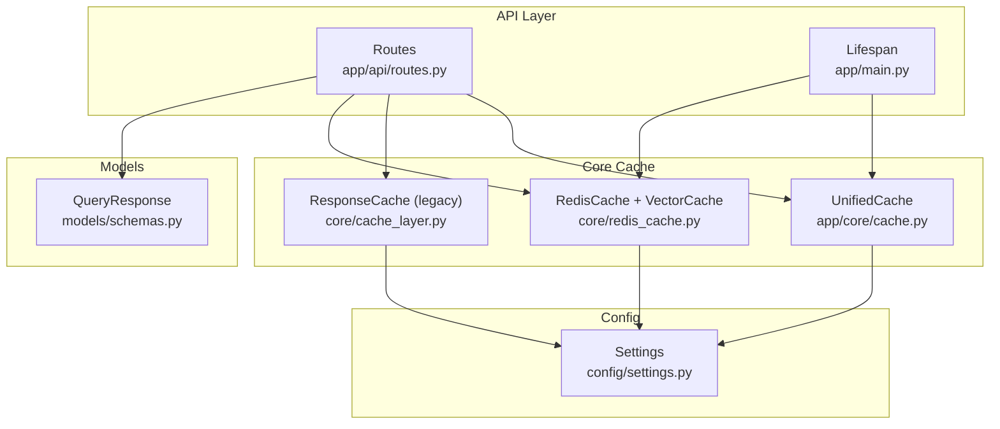
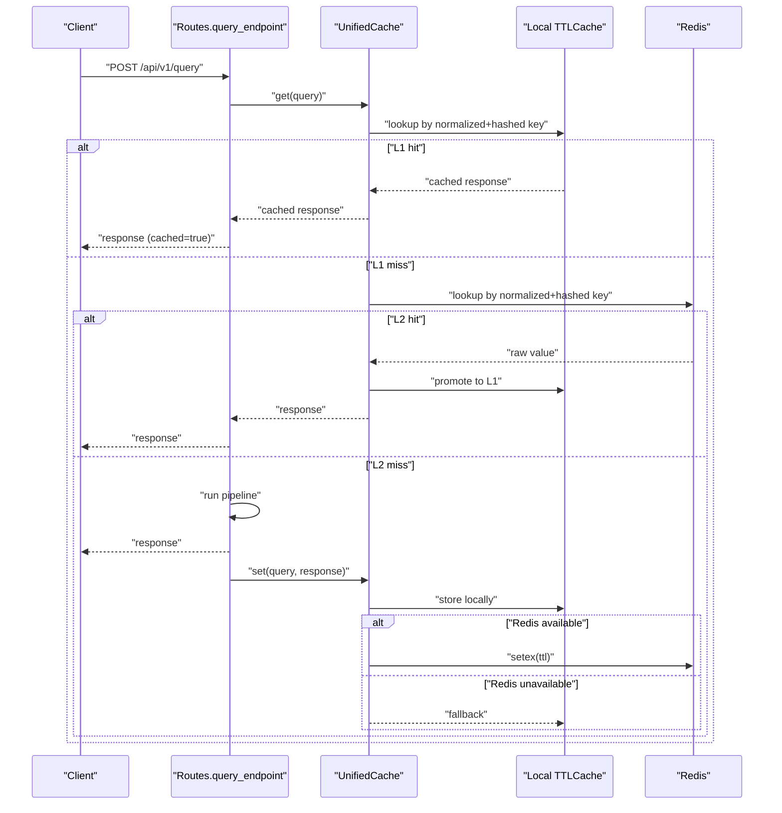
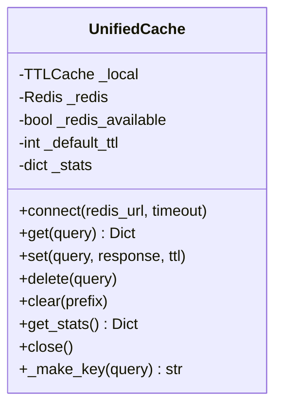
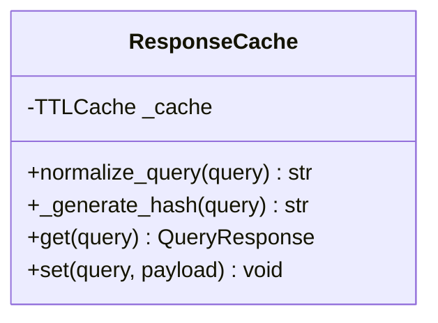
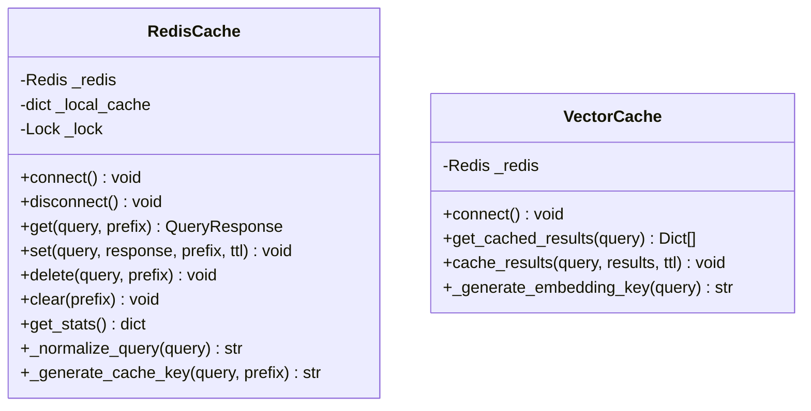
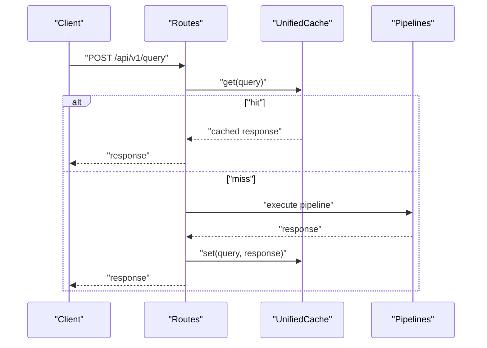
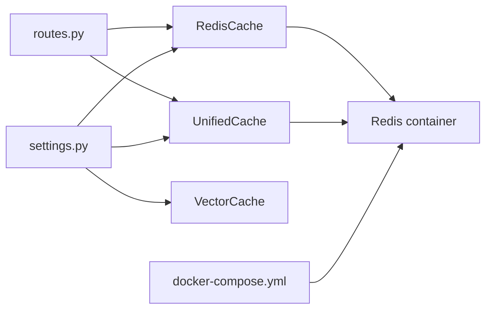

# Distributed Caching Layer

<cite>
**Referenced Files in This Document**
- [cache.py](file://veritas-ai/app/core/cache.py)
- [redis_cache.py](file://veritas-ai/core/redis_cache.py)
- [cache_layer.py](file://veritas-ai/core/cache_layer.py)
- [routes.py](file://veritas-ai/app/api/routes.py)
- [main.py](file://veritas-ai/app/main.py)
- [settings.py](file://veritas-ai/config/settings.py)
- [schemas.py](file://veritas-ai/models/schemas.py)
- [requirements.txt](file://veritas-ai/requirements.txt)
- [docker-compose.yml](file://veritas-ai/docker-compose.yml)
- [Dockerfile](file://veritas-ai/Dockerfile)
</cite>

## Table of Contents
1. [Introduction](#introduction)
2. [Project Structure](#project-structure)
3. [Core Components](#core-components)
4. [Architecture Overview](#architecture-overview)
5. [Detailed Component Analysis](#detailed-component-analysis)
6. [Dependency Analysis](#dependency-analysis)
7. [Performance Considerations](#performance-considerations)
8. [Troubleshooting Guide](#troubleshooting-guide)
9. [Conclusion](#conclusion)
10. [Appendices](#appendices)

## Introduction
This document describes Veritas AI’s distributed caching infrastructure, focusing on a dual-layer caching architecture that combines an in-memory TTL cache with a Redis-backed distributed cache. It explains the unified cache interface, key normalization and hashing, TTL expiration handling, graceful degradation, cache invalidation, and operational metrics. It also covers deployment configurations, monitoring, and troubleshooting strategies for reliable, horizontally scalable caching.

## Project Structure
The caching layer spans several modules:
- Unified cache abstraction for local and Redis tiers
- Legacy TTL cache and Redis cache implementations
- API integration for cache-aware query resolution
- Configuration and deployment artifacts

**Diagram sources**
- [routes.py:46-81](file://veritas-ai/app/api/routes.py#L46-L81)
- [main.py:33-40](file://veritas-ai/app/main.py#L33-L40)
- [cache.py:15-172](file://veritas-ai/app/core/cache.py#L15-L172)
- [cache_layer.py:10-41](file://veritas-ai/core/cache_layer.py#L10-L41)
- [redis_cache.py:18-232](file://veritas-ai/core/redis_cache.py#L18-L232)
- [settings.py:13-83](file://veritas-ai/config/settings.py#L13-L83)
- [schemas.py:14-26](file://veritas-ai/models/schemas.py#L14-L26)

**Section sources**
- [routes.py:1-251](file://veritas-ai/app/api/routes.py#L1-L251)
- [main.py:1-208](file://veritas-ai/app/main.py#L1-L208)
- [cache.py:1-172](file://veritas-ai/app/core/cache.py#L1-L172)
- [cache_layer.py:1-41](file://veritas-ai/core/cache_layer.py#L1-L41)
- [redis_cache.py:1-232](file://veritas-ai/core/redis_cache.py#L1-L232)
- [settings.py:1-83](file://veritas-ai/config/settings.py#L1-L83)
- [schemas.py:1-88](file://veritas-ai/models/schemas.py#L1-L88)

## Core Components
- UnifiedCache: Dual-layer cache with local TTLCache and Redis backend, supporting graceful degradation, hit-rate tracking, and TTL propagation.
- ResponseCache: Legacy in-memory TTL cache with SHA-256 key normalization and TTL expiration.
- RedisCache + VectorCache: Async Redis client with local in-process cache, key normalization, TTL, and invalidation helpers.
- API integration: Routes check cache before invoking pipelines and cache results afterward.
- Configuration: Centralized settings for cache TTL, capacity, and Redis host/port.

Key responsibilities:
- Key normalization and hashing for deterministic cache keys
- TTL enforcement and expiration propagation
- Local promotion on Redis hits
- Graceful degradation when Redis is unavailable
- Cache invalidation via delete/clear operations
- Operational metrics for hit rates and availability

**Section sources**
- [cache.py:15-172](file://veritas-ai/app/core/cache.py#L15-L172)
- [cache_layer.py:10-41](file://veritas-ai/core/cache_layer.py#L10-L41)
- [redis_cache.py:18-232](file://veritas-ai/core/redis_cache.py#L18-L232)
- [routes.py:46-81](file://veritas-ai/app/api/routes.py#L46-L81)
- [settings.py:25-26](file://veritas-ai/config/settings.py#L25-L26)

## Architecture Overview
The system implements a two-tier cache:
- L1: Local in-memory TTL cache (bounded, fast)
- L2: Redis distributed cache (shared across workers, persistent)

**Diagram sources**
- [routes.py:100-111](file://veritas-ai/app/api/routes.py#L100-L111)
- [cache.py:66-115](file://veritas-ai/app/core/cache.py#L66-L115)

**Section sources**
- [routes.py:46-81](file://veritas-ai/app/api/routes.py#L46-L81)
- [cache.py:15-172](file://veritas-ai/app/core/cache.py#L15-L172)

## Detailed Component Analysis

### UnifiedCache: Dual-Tier Cache
- Purpose: Provide a single cache interface with local and Redis tiers, enabling graceful degradation and unified TTL handling.
- Key normalization: Normalizes queries and computes a short SHA-256-based key prefix for determinism.
- Hit promotion: On Redis hit, promotes to local cache to reduce repeated remote calls.
- Stats: Tracks local hits, Redis hits, misses, sets, and computed hit rate.
- TTL propagation: Uses configured TTL for Redis setex operations; local TTL controlled separately.

**Diagram sources**
- [cache.py:15-172](file://veritas-ai/app/core/cache.py#L15-L172)

**Section sources**
- [cache.py:15-172](file://veritas-ai/app/core/cache.py#L15-L172)

### ResponseCache: Legacy In-Memory TTL Cache
- Purpose: Lightweight in-memory cache with TTL eviction for bounded memory usage.
- Key generation: Normalizes query and hashes to a fixed-length key.
- TTL handling: Uses TTLCache with settings-driven TTL and capacity.

**Diagram sources**
- [cache_layer.py:10-41](file://veritas-ai/core/cache_layer.py#L10-L41)

**Section sources**
- [cache_layer.py:10-41](file://veritas-ai/core/cache_layer.py#L10-L41)

### RedisCache + VectorCache: Distributed Cache
- Purpose: Async Redis client with local in-process cache for fast local reads and distributed writes.
- Key normalization: Normalizes query and creates a short SHA-256 suffix for compact keys.
- TTL handling: Uses setex with configurable TTL; stores timestamp in serialized payload.
- Invalidation: Supports delete and clear operations; clear scans by pattern.
- Stats: Reports local cache size and Redis connectivity; attempts to read Redis stats.

**Diagram sources**
- [redis_cache.py:18-232](file://veritas-ai/core/redis_cache.py#L18-L232)

**Section sources**
- [redis_cache.py:18-232](file://veritas-ai/core/redis_cache.py#L18-L232)

### API Integration and Pipeline Flow
- Routes check cache before running pipelines and cache results after successful computation.
- Health and metrics endpoints surface cache availability and hit rate.

**Diagram sources**
- [routes.py:46-81](file://veritas-ai/app/api/routes.py#L46-L81)
- [cache.py:66-115](file://veritas-ai/app/core/cache.py#L66-L115)

**Section sources**
- [routes.py:46-81](file://veritas-ai/app/api/routes.py#L46-L81)
- [routes.py:86-97](file://veritas-ai/app/api/routes.py#L86-L97)
- [routes.py:236-243](file://veritas-ai/app/api/routes.py#L236-L243)

## Dependency Analysis
- UnifiedCache depends on settings for TTL and capacity and uses redis.asyncio for distributed storage.
- RedisCache and VectorCache depend on settings for Redis host/port and use asyncio primitives for concurrency.
- Routes integrate cache operations into request lifecycle.
- Docker Compose provisions Redis and binds it to the backend service.

**Diagram sources**
- [settings.py:55-59](file://veritas-ai/config/settings.py#L55-L59)
- [cache.py:43-64](file://veritas-ai/app/core/cache.py#L43-L64)
- [redis_cache.py:30-52](file://veritas-ai/core/redis_cache.py#L30-L52)
- [routes.py:10-12](file://veritas-ai/app/api/routes.py#L10-L12)
- [docker-compose.yml:108-124](file://veritas-ai/docker-compose.yml#L108-L124)

**Section sources**
- [settings.py:13-83](file://veritas-ai/config/settings.py#L13-L83)
- [requirements.txt:27](file://veritas-ai/requirements.txt#L27)
- [docker-compose.yml:108-124](file://veritas-ai/docker-compose.yml#L108-L124)

## Performance Considerations
- Hit ratio optimization:
  - Normalize queries consistently to maximize cache hits.
  - Use UnifiedCache to leverage both local and distributed caches.
  - Monitor hit rate via metrics endpoint and adjust TTL and capacity accordingly.
- Memory management:
  - Local TTL cache is bounded; tune CACHE_MAX_ENTRIES and CACHE_TTL_SECONDS.
  - Redis maxmemory policy configured to evict least-recently used keys.
- Cache warming:
  - Warm hot queries by pre-executing representative workloads and storing results.
  - Use batched set operations where appropriate to reduce overhead.
- Latency reduction:
  - Prefer local cache hits; promote Redis hits to local tier.
  - Keep pipelines fast to minimize time-to-cache-write.

[No sources needed since this section provides general guidance]

## Troubleshooting Guide
Common issues and resolutions:
- Redis connectivity failures:
  - Symptoms: Warning logs indicating Redis connection failure; fallback to local-only cache.
  - Actions: Verify REDIS_HOST and REDIS_PORT; confirm Redis health; check firewall/network policies.
- Cache misses despite repeated queries:
  - Causes: Query normalization differences (extra whitespace, casing).
  - Actions: Ensure consistent query formatting; verify normalization logic.
- High misses and low hit rate:
  - Causes: Low TTL, small capacity, or frequent cache invalidation.
  - Actions: Increase CACHE_TTL_SECONDS and CACHE_MAX_ENTRIES; review clear/delete usage.
- Invalidation anomalies:
  - Causes: Prefix mismatches or Redis scan patterns.
  - Actions: Use consistent prefixes; confirm clear operations and patterns.
- Health and metrics:
  - Use /api/v1/health and /api/v1/metrics to inspect cache availability and hit rate.

**Section sources**
- [cache.py:61-64](file://veritas-ai/app/core/cache.py#L61-L64)
- [redis_cache.py:47-51](file://veritas-ai/core/redis_cache.py#L47-L51)
- [routes.py:86-97](file://veritas-ai/app/api/routes.py#L86-L97)
- [routes.py:236-243](file://veritas-ai/app/api/routes.py#L236-L243)

## Conclusion
Veritas AI’s caching layer combines a fast local TTL cache with a Redis-backed distributed cache to deliver low-latency, horizontally scalable caching. The unified cache interface ensures graceful degradation, robust TTL handling, and actionable metrics. By tuning normalization, TTL, and capacity, and leveraging clear invalidation patterns, teams can achieve high hit rates and predictable performance across deployments.

[No sources needed since this section summarizes without analyzing specific files]

## Appendices

### Configuration Examples
- Environment variables for cache and Redis:
  - CACHE_TTL_SECONDS: TTL for cached responses
  - CACHE_MAX_ENTRIES: Maximum number of entries in local cache
  - REDIS_HOST, REDIS_PORT, REDIS_DB: Redis connection parameters
- Docker Compose:
  - Redis service configured with persistence and memory limits
  - Backend service depends on Redis health

**Section sources**
- [settings.py:25-26](file://veritas-ai/config/settings.py#L25-L26)
- [settings.py:55-59](file://veritas-ai/config/settings.py#L55-L59)
- [docker-compose.yml:108-124](file://veritas-ai/docker-compose.yml#L108-L124)

### Monitoring and Metrics
- Health endpoint: Reports cache availability and hit rate
- Metrics endpoint: Provides cache statistics including hit counts, misses, and computed hit rate

**Section sources**
- [routes.py:86-97](file://veritas-ai/app/api/routes.py#L86-L97)
- [routes.py:236-243](file://veritas-ai/app/api/routes.py#L236-L243)
- [cache.py:144-155](file://veritas-ai/app/core/cache.py#L144-L155)