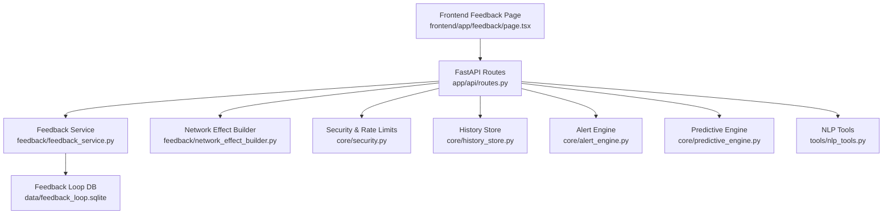
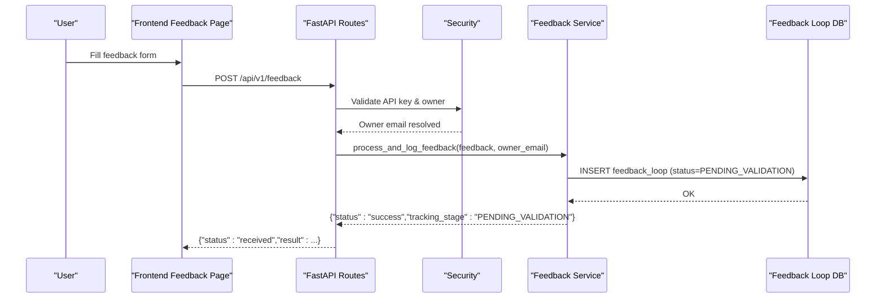
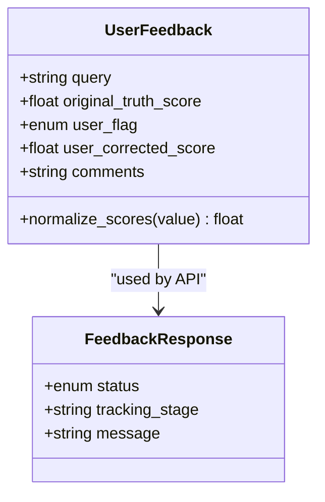
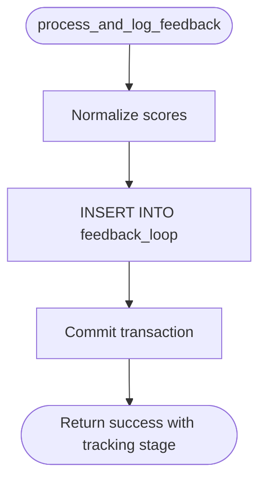
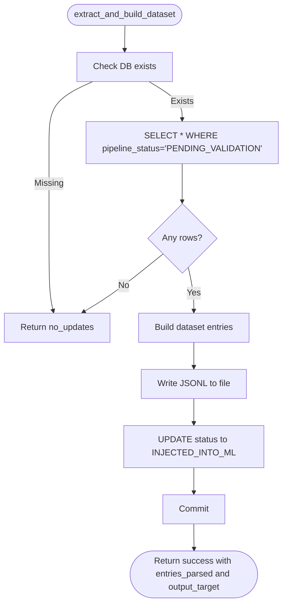
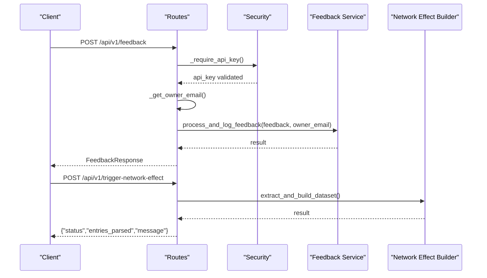
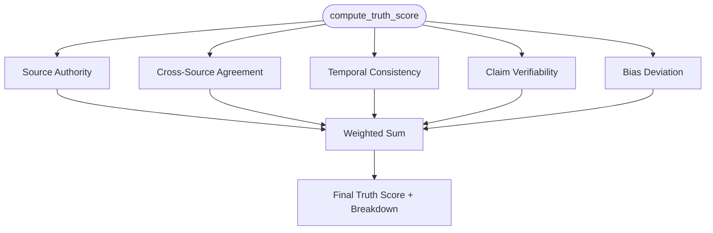
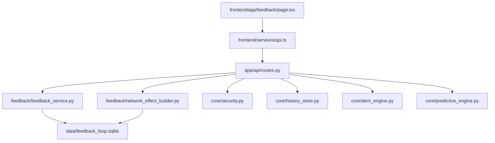

# Feedback Data Infrastructure

<cite>
**Referenced Files in This Document**
- [feedback_service.py](file://veritas-ai/feedback/feedback_service.py)
- [network_effect_builder.py](file://veritas-ai/feedback/network_effect_builder.py)
- [routes.py](file://veritas-ai/app/api/routes.py)
- [server.py](file://veritas-ai/api/server.py)
- [schemas.py](file://veritas-ai/models/schemas.py)
- [history_store.py](file://veritas-ai/core/history_store.py)
- [security.py](file://veritas-ai/core/security.py)
- [event_bus.py](file://veritas-ai/pipelines/event_bus.py)
- [page.tsx](file://veritas-ai/frontend/app/feedback/page.tsx)
- [api.ts](file://veritas-ai/frontend/services/api.ts)
- [truth_engine.py](file://veritas-ai/core/truth_engine.py)
- [alert_engine.py](file://veritas-ai/core/alert_engine.py)
- [predictive_engine.py](file://veritas-ai/core/predictive_engine.py)
- [nlp_tools.py](file://veritas-ai/tools/nlp_tools.py)
</cite>

## Table of Contents
1. [Introduction](#introduction)
2. [Project Structure](#project-structure)
3. [Core Components](#core-components)
4. [Architecture Overview](#architecture-overview)
5. [Detailed Component Analysis](#detailed-component-analysis)
6. [Dependency Analysis](#dependency-analysis)
7. [Performance Considerations](#performance-considerations)
8. [Troubleshooting Guide](#troubleshooting-guide)
9. [Conclusion](#conclusion)
10. [Appendices](#appendices)

## Introduction
This document describes Veritas AI’s feedback data collection and processing infrastructure. It covers how user feedback is captured, validated, stored, and transformed into training datasets for model improvement. It also documents the network effect builder that aggregates feedback into RLHF-ready datasets, the feedback data models and storage patterns, real-time processing pipelines, scoring and trend analysis mechanisms, and privacy controls around consent and anonymization. Finally, it outlines practical integration examples for model training, user experience optimization, and community-building features.

## Project Structure
The feedback infrastructure spans several layers:
- Frontend: a feedback form submits user disagreement signals and optional corrections.
- API: FastAPI endpoints accept feedback, enforce authentication and rate limits, and delegate to feedback services.
- Feedback Services: SQLite-backed ingestion and dataset extraction for RLHF.
- Data Stores: separate SQLite stores for query history and feedback loop.
- Analytics Engines: alerting and predictive trend detection.
- NLP Tools: optional fake news classification to enrich truth scoring.

**Diagram sources**
- [page.tsx:1-41](file://veritas-ai/frontend/app/feedback/page.tsx#L1-L41)
- [routes.py:162-195](file://veritas-ai/app/api/routes.py#L162-L195)
- [feedback_service.py:68-94](file://veritas-ai/feedback/feedback_service.py#L68-L94)
- [network_effect_builder.py:24-79](file://veritas-ai/feedback/network_effect_builder.py#L24-L79)
- [history_store.py:46-102](file://veritas-ai/core/history_store.py#L46-L102)
- [security.py:51-129](file://veritas-ai/core/security.py#L51-L129)
- [alert_engine.py:26-66](file://veritas-ai/core/alert_engine.py#L26-L66)
- [predictive_engine.py:33-59](file://veritas-ai/core/predictive_engine.py#L33-L59)
- [nlp_tools.py:27-51](file://veritas-ai/tools/nlp_tools.py#L27-L51)

**Section sources**
- [routes.py:162-195](file://veritas-ai/app/api/routes.py#L162-L195)
- [feedback_service.py:15-94](file://veritas-ai/feedback/feedback_service.py#L15-L94)
- [network_effect_builder.py:24-79](file://veritas-ai/feedback/network_effect_builder.py#L24-L79)
- [history_store.py:23-102](file://veritas-ai/core/history_store.py#L23-L102)
- [security.py:51-129](file://veritas-ai/core/security.py#L51-L129)

## Core Components
- Feedback ingestion model and validator: defines the shape of feedback submissions, normalizes truth scores, and persists records with ownership metadata.
- Network effect builder: extracts validated feedback entries and writes a JSONL dataset for RLHF fine-tuning, updating pipeline status.
- API endpoints: expose feedback submission and dataset aggregation, enforcing authentication and rate limits.
- Data stores: separate SQLite tables for feedback loop and query history, enabling per-user ownership scoping.
- Analytics engines: alert engine detects anomalies in model outputs; predictive engine identifies emerging misinformation trends.
- NLP tools: optional transformer-based fake news classifier to inform truth scoring.

**Section sources**
- [feedback_service.py:15-94](file://veritas-ai/feedback/feedback_service.py#L15-L94)
- [network_effect_builder.py:24-79](file://veritas-ai/feedback/network_effect_builder.py#L24-L79)
- [routes.py:162-195](file://veritas-ai/app/api/routes.py#L162-L195)
- [schemas.py:34-38](file://veritas-ai/models/schemas.py#L34-L38)
- [history_store.py:23-102](file://veritas-ai/core/history_store.py#L23-L102)
- [alert_engine.py:26-66](file://veritas-ai/core/alert_engine.py#L26-L66)
- [predictive_engine.py:33-59](file://veritas-ai/core/predictive_engine.py#L33-L59)
- [nlp_tools.py:27-51](file://veritas-ai/tools/nlp_tools.py#L27-L51)

## Architecture Overview
The feedback loop integrates user input with model improvement via a controlled pipeline:
- Users submit feedback through the frontend.
- API validates and authenticates requests, resolves owner identity, and logs feedback.
- Feedback is stored in a feedback loop database with a pipeline status.
- An operator-triggered job extracts pending feedback, builds a dataset, and marks entries as injected.
- Optional analytics and NLP augment truth scoring and alerting.

**Diagram sources**
- [page.tsx:16-41](file://veritas-ai/frontend/app/feedback/page.tsx#L16-L41)
- [routes.py:162-178](file://veritas-ai/app/api/routes.py#L162-L178)
- [security.py:87-113](file://veritas-ai/core/security.py#L87-L113)
- [feedback_service.py:68-94](file://veritas-ai/feedback/feedback_service.py#L68-L94)

## Detailed Component Analysis

### Feedback Data Models and Validation
- UserFeedback model enforces:
  - Required fields: query, original_truth_score, user_flag.
  - Optional fields: user_corrected_score, comments.
  - Score normalization: converts 1..100 scale to 0..1 range and clamps to valid bounds.
- FeedbackResponse model standardizes API responses for feedback operations.

**Diagram sources**
- [feedback_service.py:15-31](file://veritas-ai/feedback/feedback_service.py#L15-L31)
- [schemas.py:34-38](file://veritas-ai/models/schemas.py#L34-L38)

**Section sources**
- [feedback_service.py:15-31](file://veritas-ai/feedback/feedback_service.py#L15-L31)
- [schemas.py:34-38](file://veritas-ai/models/schemas.py#L34-L38)

### Feedback Ingestion and Storage
- Initializes a feedback_loop table with fields for timestamps, query, scores, flags, comments, pipeline status, and owner_email.
- Inserts feedback with PENDING_VALIDATION status and UTC timestamp.
- Uses WAL mode and tuned synchronous settings for durability and performance.

**Diagram sources**
- [feedback_service.py:68-94](file://veritas-ai/feedback/feedback_service.py#L68-L94)

**Section sources**
- [feedback_service.py:39-66](file://veritas-ai/feedback/feedback_service.py#L39-L66)
- [feedback_service.py:68-94](file://veritas-ai/feedback/feedback_service.py#L68-L94)

### Network Effect Builder (Dataset Extraction)
- Extracts all feedback entries with PENDING_VALIDATION.
- Builds a JSONL dataset with metadata_id, origin_timestamp, input_prompt, model_output_score, human_preference_score, disagreement_label, and human_context.
- Updates pipeline_status to INJECTED_INTO_ML for processed records.
- Produces a timestamped dataset filename for downstream ML ingestion.

**Diagram sources**
- [network_effect_builder.py:24-79](file://veritas-ai/feedback/network_effect_builder.py#L24-L79)

**Section sources**
- [network_effect_builder.py:24-79](file://veritas-ai/feedback/network_effect_builder.py#L24-L79)

### API Endpoints and Real-Time Pipelines
- Feedback submission endpoint:
  - Validates API key and resolves owner_email.
  - Constructs UserFeedback and delegates to process_and_log_feedback.
  - Returns standardized FeedbackResponse.
- Dataset aggregation endpoint:
  - Requires API key.
  - Triggers extract_and_build_dataset and returns status and metadata.

**Diagram sources**
- [routes.py:162-195](file://veritas-ai/app/api/routes.py#L162-L195)
- [feedback_service.py:68-94](file://veritas-ai/feedback/feedback_service.py#L68-L94)
- [network_effect_builder.py:24-79](file://veritas-ai/feedback/network_effect_builder.py#L24-L79)
- [security.py:51-113](file://veritas-ai/core/security.py#L51-L113)

**Section sources**
- [routes.py:162-195](file://veritas-ai/app/api/routes.py#L162-L195)
- [server.py:158-179](file://veritas-ai/api/server.py#L158-L179)
- [security.py:51-113](file://veritas-ai/core/security.py#L51-L113)

### Data Privacy, Consent, and Anonymization
- Ownership scoping: owner_email is attached to both feedback and history entries, enabling per-user isolation.
- Authentication: API key enforcement via core/security.py ensures consent-managed access to sensitive endpoints.
- Minimal identifiers: feedback submissions exclude personally identifiable information; timestamps and anonymous flags are used for analysis.
- Consent management: API key presence implies consent; fallback to public owner_email occurs when absent.

**Section sources**
- [feedback_service.py:54-55](file://veritas-ai/feedback/feedback_service.py#L54-L55)
- [history_store.py:35-36](file://veritas-ai/core/history_store.py#L35-L36)
- [routes.py:34-42](file://veritas-ai/app/api/routes.py#L34-L42)
- [security.py:51-113](file://veritas-ai/core/security.py#L51-L113)

### Scoring Algorithms and Impact Measurement
- Truth scoring: combines source authority, cross-source agreement, temporal consistency, verifiability, and bias deviation into a composite truth score with breakdown.
- Bias deviation: inverses fake news probability to penalize misleading content.
- Impact measurement:
  - Feedback loop status tracking (PENDING_VALIDATION → INJECTED_INTO_ML).
  - Predictive trends: keyword spike detection in 2-hour sliding window to identify misinformation campaigns.
  - Alerts: anomaly detection for contradictions, fake news probability, and narrative shifts.

**Diagram sources**
- [truth_engine.py:78-116](file://veritas-ai/core/truth_engine.py#L78-L116)

**Section sources**
- [truth_engine.py:44-116](file://veritas-ai/core/truth_engine.py#L44-L116)
- [alert_engine.py:26-66](file://veritas-ai/core/alert_engine.py#L26-L66)
- [predictive_engine.py:33-59](file://veritas-ai/core/predictive_engine.py#L33-L59)

### Trend Analysis and Community Building
- Predictive trends: identifies emerging topics with elevated keyword frequency to preempt coordinated inauthentic behavior.
- Community signals: feedback aggregation enables social proof indicators (e.g., corrected scores, disagreement labels) to guide user trust and engagement.

**Section sources**
- [predictive_engine.py:33-59](file://veritas-ai/core/predictive_engine.py#L33-L59)
- [network_effect_builder.py:47-56](file://veritas-ai/feedback/network_effect_builder.py#L47-L56)

### Integration Examples
- Model training: RLHF-ready JSONL datasets produced by the network effect builder feed supervised fine-tuning pipelines.
- User experience optimization: truth score breakdown and sentiment-aware voice adjustments improve perceived accuracy and tone.
- Community building: aggregated feedback and trending topics inform moderation and content curation workflows.

**Section sources**
- [network_effect_builder.py:24-79](file://veritas-ai/feedback/network_effect_builder.py#L24-L79)
- [truth_engine.py:78-116](file://veritas-ai/core/truth_engine.py#L78-L116)
- [nlp_tools.py:27-51](file://veritas-ai/tools/nlp_tools.py#L27-L51)

## Dependency Analysis
- Feedback ingestion depends on:
  - SQLite-backed feedback_loop table.
  - Pydantic models for validation.
  - API authentication and owner resolution.
- Network effect builder depends on:
  - Feedback loop table and pipeline status.
  - JSONL writer for dataset export.
- API layer orchestrates:
  - Security, feedback service, and dataset builder.
  - Optional analytics engines for alerts and trends.
- Frontend integrates:
  - API base URL and WebSocket base URL for connectivity.

**Diagram sources**
- [feedback_service.py:39-66](file://veritas-ai/feedback/feedback_service.py#L39-L66)
- [network_effect_builder.py:24-79](file://veritas-ai/feedback/network_effect_builder.py#L24-L79)
- [routes.py:162-195](file://veritas-ai/app/api/routes.py#L162-L195)
- [security.py:51-113](file://veritas-ai/core/security.py#L51-L113)
- [history_store.py:23-102](file://veritas-ai/core/history_store.py#L23-L102)
- [alert_engine.py:26-66](file://veritas-ai/core/alert_engine.py#L26-L66)
- [predictive_engine.py:33-59](file://veritas-ai/core/predictive_engine.py#L33-L59)
- [page.tsx:1-41](file://veritas-ai/frontend/app/feedback/page.tsx#L1-L41)
- [api.ts:1-32](file://veritas-ai/frontend/services/api.ts#L1-L32)

**Section sources**
- [routes.py:162-195](file://veritas-ai/app/api/routes.py#L162-L195)
- [feedback_service.py:39-66](file://veritas-ai/feedback/feedback_service.py#L39-L66)
- [network_effect_builder.py:24-79](file://veritas-ai/feedback/network_effect_builder.py#L24-L79)
- [security.py:51-113](file://veritas-ai/core/security.py#L51-L113)
- [history_store.py:23-102](file://veritas-ai/core/history_store.py#L23-L102)
- [alert_engine.py:26-66](file://veritas-ai/core/alert_engine.py#L26-L66)
- [predictive_engine.py:33-59](file://veritas-ai/core/predictive_engine.py#L33-L59)
- [page.tsx:1-41](file://veritas-ai/frontend/app/feedback/page.tsx#L1-L41)
- [api.ts:1-32](file://veritas-ai/frontend/services/api.ts#L1-L32)

## Performance Considerations
- Database tuning: WAL mode and NORMAL synchronous settings balance durability and throughput for feedback ingestion.
- Asynchronous logging: history logging is offloaded to threads to avoid blocking API responses.
- Rate limiting: enforced at the API gateway to prevent abuse and ensure fair usage.
- Lightweight extraction: JSONL writing is batched per extracted record to minimize memory overhead.

[No sources needed since this section provides general guidance]

## Troubleshooting Guide
- Feedback submission errors:
  - Validate API key presence and correctness.
  - Confirm feedback payload matches UserFeedback schema.
  - Inspect database initialization and connection timeouts.
- Dataset extraction issues:
  - Ensure feedback_loop contains PENDING_VALIDATION records.
  - Verify write permissions for the data directory and timestamped dataset path.
- Alerts and trends:
  - Review recent alerts for contradiction and fake news spikes.
  - Check predictive engine sliding window and keyword frequency thresholds.

**Section sources**
- [security.py:51-113](file://veritas-ai/core/security.py#L51-L113)
- [feedback_service.py:68-94](file://veritas-ai/feedback/feedback_service.py#L68-L94)
- [network_effect_builder.py:24-79](file://veritas-ai/feedback/network_effect_builder.py#L24-L79)
- [alert_engine.py:26-66](file://veritas-ai/core/alert_engine.py#L26-L66)
- [predictive_engine.py:33-59](file://veritas-ai/core/predictive_engine.py#L33-L59)

## Conclusion
Veritas AI’s feedback infrastructure provides a robust, privacy-conscious pipeline for capturing user disagreement signals, normalizing truth scores, and transforming feedback into RLHF datasets. The system integrates authentication, ownership scoping, and real-time analytics to support model improvement, user experience optimization, and community resilience against misinformation.

[No sources needed since this section summarizes without analyzing specific files]

## Appendices

### API Definitions
- POST /api/v1/feedback
  - Description: Submit user feedback with query, original truth score, flag, optional corrected score, and comments.
  - Authentication: X-API-KEY header required.
  - Response: FeedbackResponse with status and tracking stage.
- POST /api/v1/trigger-network-effect
  - Description: Trigger dataset extraction for PENDING_VALIDATION feedback.
  - Authentication: X-API-KEY header required.
  - Response: Status and dataset metadata.

**Section sources**
- [routes.py:162-195](file://veritas-ai/app/api/routes.py#L162-L195)
- [schemas.py:34-38](file://veritas-ai/models/schemas.py#L34-L38)

### Data Models Summary
- UserFeedback: query, original_truth_score, user_flag, user_corrected_score, comments.
- FeedbackResponse: status, tracking_stage, message.
- HistoryEntry: id, timestamp, query, status, truth_score, summary.

**Section sources**
- [feedback_service.py:15-31](file://veritas-ai/feedback/feedback_service.py#L15-L31)
- [schemas.py:34-38](file://veritas-ai/models/schemas.py#L34-L38)
- [schemas.py:71-82](file://veritas-ai/models/schemas.py#L71-L82)