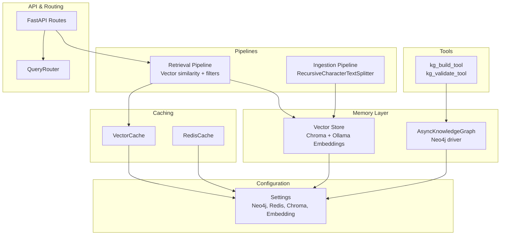
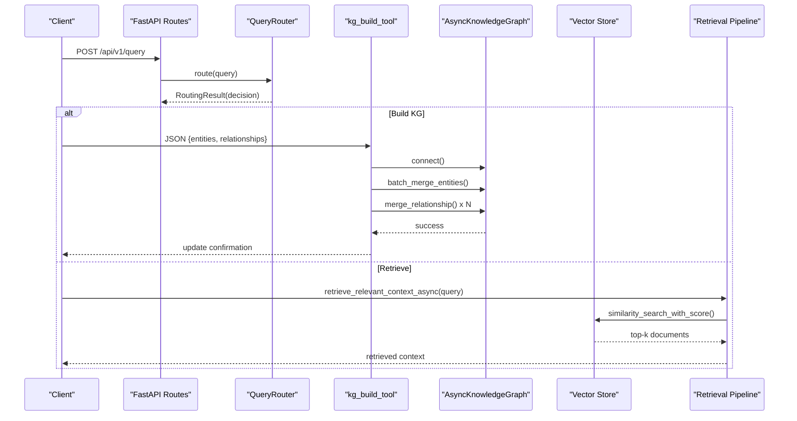
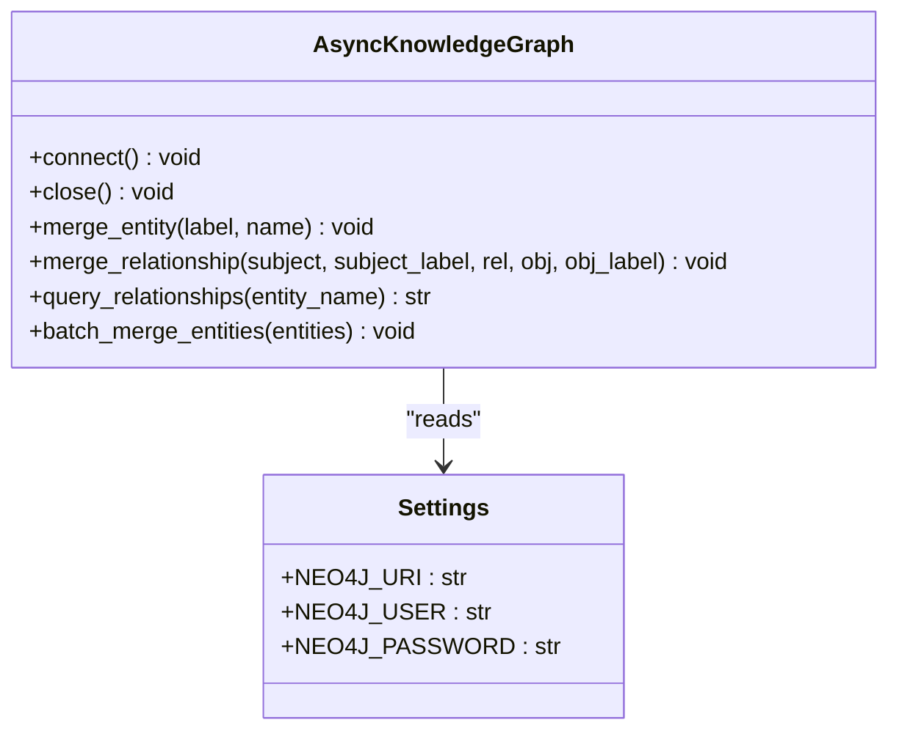
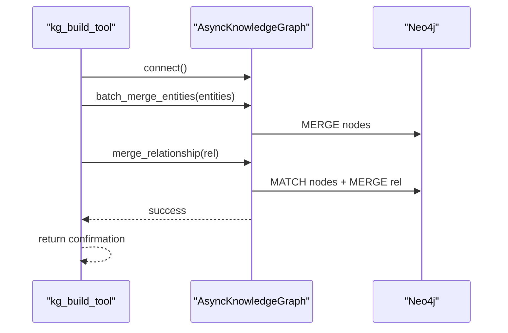
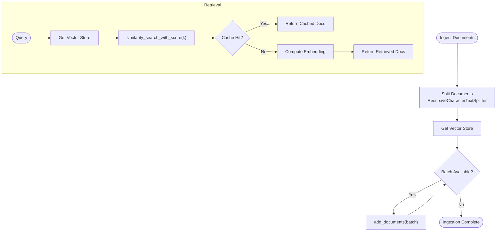
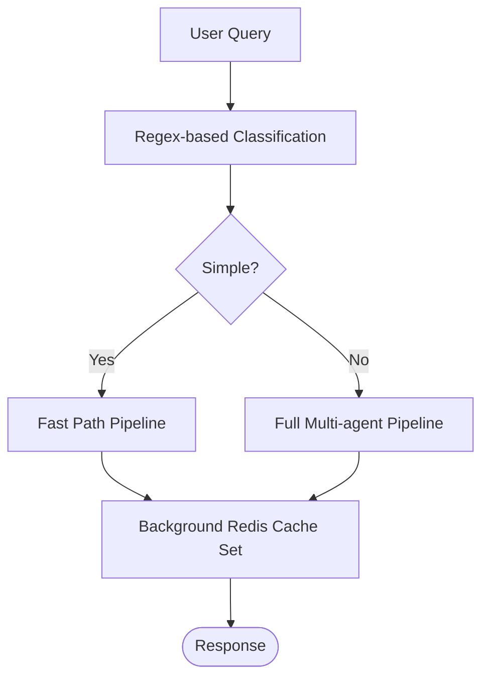
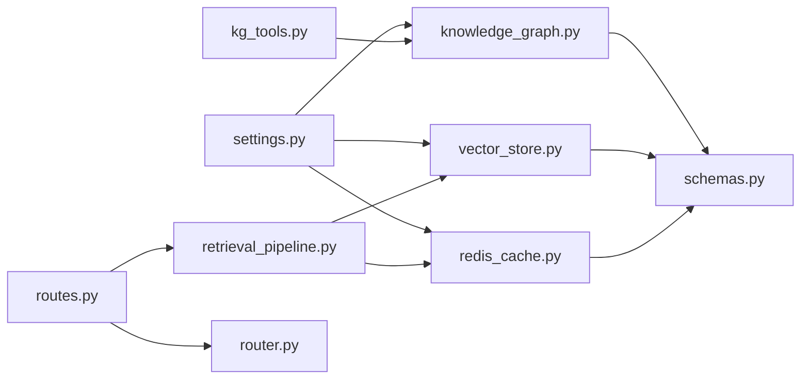

# Knowledge Graph Storage

<cite>
**Referenced Files in This Document**
- [knowledge_graph.py](file://veritas-ai/memory/knowledge_graph.py)
- [kg_tools.py](file://veritas-ai/tools/kg_tools.py)
- [vector_store.py](file://veritas-ai/memory/vector_store.py)
- [ingestion_pipeline.py](file://veritas-ai/pipelines/ingestion_pipeline.py)
- [retrieval_pipeline.py](file://veritas-ai/pipelines/retrieval_pipeline.py)
- [settings.py](file://veritas-ai/config/settings.py)
- [redis_cache.py](file://veritas-ai/core/redis_cache.py)
- [schemas.py](file://veritas-ai/models/schemas.py)
- [routes.py](file://veritas-ai/app/api/routes.py)
- [router.py](file://veritas-ai/core/router.py)
</cite>

## Table of Contents
1. [Introduction](#introduction)
2. [Project Structure](#project-structure)
3. [Core Components](#core-components)
4. [Architecture Overview](#architecture-overview)
5. [Detailed Component Analysis](#detailed-component-analysis)
6. [Dependency Analysis](#dependency-analysis)
7. [Performance Considerations](#performance-considerations)
8. [Troubleshooting Guide](#troubleshooting-guide)
9. [Conclusion](#conclusion)
10. [Appendices](#appendices)

## Introduction
This document describes the knowledge graph storage architecture used by Veritas AI. It focuses on the Neo4j integration for semantic knowledge representation, graph data modeling, and relationship management. It also covers node and edge creation patterns, property management, graph traversal, and the knowledge extraction pipeline. The document explains how the system integrates vector search for hybrid retrieval, and outlines query optimization, Cypher patterns, analytics capabilities, schema evolution, consistency guarantees, and partitioning strategies.

## Project Structure
The knowledge graph stack spans several modules:
- Memory layer: Neo4j-backed asynchronous knowledge graph and vector store abstractions
- Pipelines: Document ingestion and retrieval pipelines
- Tools: LangChain tools for building and validating the knowledge graph
- Configuration: Environment-driven settings for Neo4j, Redis, and vector store
- Caching: Local and Redis-backed caches for query and vector results
- API and routing: Fast and deep pipelines, and query classification

**Diagram sources**
- [knowledge_graph.py:12-132](file://veritas-ai/memory/knowledge_graph.py#L12-L132)
- [vector_store.py:15-26](file://veritas-ai/memory/vector_store.py#L15-L26)
- [ingestion_pipeline.py:7-33](file://veritas-ai/pipelines/ingestion_pipeline.py#L7-L33)
- [retrieval_pipeline.py:29-92](file://veritas-ai/pipelines/retrieval_pipeline.py#L29-L92)
- [kg_tools.py:5-49](file://veritas-ai/tools/kg_tools.py#L5-L49)
- [settings.py:64-67](file://veritas-ai/config/settings.py#L64-L67)
- [redis_cache.py:18-222](file://veritas-ai/core/redis_cache.py#L18-L222)
- [routes.py:100-111](file://veritas-ai/app/api/routes.py#L100-L111)
- [router.py:83-136](file://veritas-ai/core/router.py#L83-L136)

**Section sources**
- [knowledge_graph.py:12-132](file://veritas-ai/memory/knowledge_graph.py#L12-L132)
- [vector_store.py:15-26](file://veritas-ai/memory/vector_store.py#L15-L26)
- [ingestion_pipeline.py:7-33](file://veritas-ai/pipelines/ingestion_pipeline.py#L7-L33)
- [retrieval_pipeline.py:29-92](file://veritas-ai/pipelines/retrieval_pipeline.py#L29-L92)
- [kg_tools.py:5-49](file://veritas-ai/tools/kg_tools.py#L5-L49)
- [settings.py:64-67](file://veritas-ai/config/settings.py#L64-L67)
- [redis_cache.py:18-222](file://veritas-ai/core/redis_cache.py#L18-L222)
- [routes.py:100-111](file://veritas-ai/app/api/routes.py#L100-L111)
- [router.py:83-136](file://veritas-ai/core/router.py#L83-L136)

## Core Components
- AsyncKnowledgeGraph: Async Neo4j client with connection pooling, entity and relationship creation, and traversal queries. It enforces allowed labels and relationships and supports batch entity merging.
- kg_build_tool and kg_validate_tool: LangChain tools to insert structured entities/relationships into the graph and to validate relationships for a given node.
- Vector Store: Chroma-backed persistent vector store with Ollama embeddings, used for hybrid retrieval.
- Retrieval Pipeline: Vector similarity search with optional metadata filtering, caching, and batching.
- Ingestion Pipeline: Asynchronous document chunking and batched insertion into the vector store.
- Configuration: Centralized settings for Neo4j credentials, Redis, Chroma persistence, and embedding model.
- Caching: Dual-layer cache (local + Redis) for query responses and vector results.
- API and Routing: FastAPI routes and a query router that decides between fast-path and full pipeline based on query classification.

**Section sources**
- [knowledge_graph.py:12-132](file://veritas-ai/memory/knowledge_graph.py#L12-L132)
- [kg_tools.py:5-49](file://veritas-ai/tools/kg_tools.py#L5-L49)
- [vector_store.py:15-26](file://veritas-ai/memory/vector_store.py#L15-L26)
- [retrieval_pipeline.py:29-92](file://veritas-ai/pipelines/retrieval_pipeline.py#L29-L92)
- [ingestion_pipeline.py:7-33](file://veritas-ai/pipelines/ingestion_pipeline.py#L7-L33)
- [settings.py:64-67](file://veritas-ai/config/settings.py#L64-L67)
- [redis_cache.py:18-222](file://veritas-ai/core/redis_cache.py#L18-L222)
- [routes.py:100-111](file://veritas-ai/app/api/routes.py#L100-L111)
- [router.py:83-136](file://veritas-ai/core/router.py#L83-L136)

## Architecture Overview
The system integrates two complementary knowledge stores:
- Structural knowledge graph in Neo4j for explicit semantic relationships and graph traversal.
- Vector knowledge base in Chroma for dense semantic retrieval and hybrid search.

**Diagram sources**
- [routes.py:100-111](file://veritas-ai/app/api/routes.py#L100-L111)
- [router.py:99-136](file://veritas-ai/core/router.py#L99-L136)
- [kg_tools.py:5-49](file://veritas-ai/tools/kg_tools.py#L5-L49)
- [knowledge_graph.py:25-86](file://veritas-ai/memory/knowledge_graph.py#L25-L86)
- [retrieval_pipeline.py:48-92](file://veritas-ai/pipelines/retrieval_pipeline.py#L48-L92)
- [vector_store.py:15-26](file://veritas-ai/memory/vector_store.py#L15-L26)

## Detailed Component Analysis

### Neo4j Knowledge Graph Integration
- Driver lifecycle: Singleton async driver with connection pooling and connectivity verification.
- Schema constraints: Allowed labels and relationships are enforced at ingestion time.
- Entity creation: MERGE semantics ensure idempotent node creation.
- Relationship creation: MATCH + MERGE ensures both nodes exist before linking.
- Traversal: Basic outbound relationship traversal with label and type inspection.
- Batch operations: Parallelized batch merging of entities to reduce overhead.

**Diagram sources**
- [knowledge_graph.py:25-132](file://veritas-ai/memory/knowledge_graph.py#L25-L132)
- [settings.py:64-67](file://veritas-ai/config/settings.py#L64-L67)

**Section sources**
- [knowledge_graph.py:25-132](file://veritas-ai/memory/knowledge_graph.py#L25-L132)
- [settings.py:64-67](file://veritas-ai/config/settings.py#L64-L67)

### Knowledge Extraction and Validation Tools
- kg_build_tool: Accepts a strict JSON payload with entities and relationships, connects to the graph, performs batch entity merges, then merges each relationship.
- kg_validate_tool: Connects to the graph and returns a human-readable string of explicit relationships for a given entity.

**Diagram sources**
- [kg_tools.py:5-49](file://veritas-ai/tools/kg_tools.py#L5-L49)
- [knowledge_graph.py:114-131](file://veritas-ai/memory/knowledge_graph.py#L114-L131)

**Section sources**
- [kg_tools.py:5-49](file://veritas-ai/tools/kg_tools.py#L5-L49)
- [knowledge_graph.py:114-131](file://veritas-ai/memory/knowledge_graph.py#L114-L131)

### Vector Store and Hybrid Retrieval
- Vector store initialization: Creates a persistent Chroma collection with Ollama embeddings.
- Ingestion pipeline: Recursively splits documents and inserts in batches using threads to avoid blocking the event loop.
- Retrieval pipeline: Supports similarity search with scores, optional metadata filtering, caching, and batch retrieval.

**Diagram sources**
- [ingestion_pipeline.py:7-33](file://veritas-ai/pipelines/ingestion_pipeline.py#L7-L33)
- [vector_store.py:15-26](file://veritas-ai/memory/vector_store.py#L15-L26)
- [retrieval_pipeline.py:29-92](file://veritas-ai/pipelines/retrieval_pipeline.py#L29-L92)
- [redis_cache.py:195-218](file://veritas-ai/core/redis_cache.py#L195-L218)

**Section sources**
- [vector_store.py:15-26](file://veritas-ai/memory/vector_store.py#L15-L26)
- [ingestion_pipeline.py:7-33](file://veritas-ai/pipelines/ingestion_pipeline.py#L7-L33)
- [retrieval_pipeline.py:29-92](file://veritas-ai/pipelines/retrieval_pipeline.py#L29-L92)
- [redis_cache.py:195-218](file://veritas-ai/core/redis_cache.py#L195-L218)

### Query Routing and Execution
- QueryRouter: Classifies queries as simple, factual, or complex using regex patterns and heuristics, then selects fast-path or full pipeline.
- FastAPI routes: Provide health, query resolution, and auxiliary endpoints; integrate with caching and history logging.

**Diagram sources**
- [router.py:51-136](file://veritas-ai/core/router.py#L51-L136)
- [routes.py:46-81](file://veritas-ai/app/api/routes.py#L46-L81)

**Section sources**
- [router.py:51-136](file://veritas-ai/core/router.py#L51-L136)
- [routes.py:46-81](file://veritas-ai/app/api/routes.py#L46-L81)

## Dependency Analysis
- Memory layer depends on configuration for Neo4j and vector store settings.
- Retrieval pipeline depends on vector store and Redis cache for performance.
- Tools depend on the memory layer for graph operations.
- API depends on routing and retrieval pipelines.

**Diagram sources**
- [settings.py:64-67](file://veritas-ai/config/settings.py#L64-L67)
- [knowledge_graph.py:25-132](file://veritas-ai/memory/knowledge_graph.py#L25-L132)
- [vector_store.py:15-26](file://veritas-ai/memory/vector_store.py#L15-L26)
- [redis_cache.py:18-222](file://veritas-ai/core/redis_cache.py#L18-L222)
- [kg_tools.py:5-49](file://veritas-ai/tools/kg_tools.py#L5-L49)
- [retrieval_pipeline.py:29-92](file://veritas-ai/pipelines/retrieval_pipeline.py#L29-L92)
- [routes.py:100-111](file://veritas-ai/app/api/routes.py#L100-L111)
- [router.py:83-136](file://veritas-ai/core/router.py#L83-L136)
- [schemas.py:14-26](file://veritas-ai/models/schemas.py#L14-L26)

**Section sources**
- [settings.py:64-67](file://veritas-ai/config/settings.py#L64-L67)
- [knowledge_graph.py:25-132](file://veritas-ai/memory/knowledge_graph.py#L25-L132)
- [vector_store.py:15-26](file://veritas-ai/memory/vector_store.py#L15-L26)
- [redis_cache.py:18-222](file://veritas-ai/core/redis_cache.py#L18-L222)
- [kg_tools.py:5-49](file://veritas-ai/tools/kg_tools.py#L5-L49)
- [retrieval_pipeline.py:29-92](file://veritas-ai/pipelines/retrieval_pipeline.py#L29-L92)
- [routes.py:100-111](file://veritas-ai/app/api/routes.py#L100-L111)
- [router.py:83-136](file://veritas-ai/core/router.py#L83-L136)
- [schemas.py:14-26](file://veritas-ai/models/schemas.py#L14-L26)

## Performance Considerations
- Async I/O: Neo4j and vector operations are performed asynchronously to avoid blocking.
- Connection pooling: Neo4j driver uses a configurable pool size and acquisition timeout.
- Batch operations: Entities are merged in batches; retrieval uses batched executor runs.
- Caching: Dual-layer caching reduces repeated computation and network calls.
- Chunking: Documents are split into manageable chunks to prevent embedding collisions and CPU bottlenecks.
- Metadata filtering: Vector retriever supports filters to narrow results and improve relevance.

[No sources needed since this section provides general guidance]

## Troubleshooting Guide
- Neo4j connectivity: Verify URI, user, and password in settings; check logs for connection errors.
- Unsupported labels/relationships: Ensure entity labels and relationship types match allowed sets.
- Vector store persistence: Confirm the persistence directory exists and is writable.
- Redis availability: If Redis is unavailable, the system falls back to local cache; monitor hit rates.
- Tool payloads: kg_build_tool expects strict JSON; malformed payloads will be rejected.

**Section sources**
- [settings.py:64-67](file://veritas-ai/config/settings.py#L64-L67)
- [knowledge_graph.py:48-75](file://veritas-ai/memory/knowledge_graph.py#L48-L75)
- [vector_store.py:20-26](file://veritas-ai/memory/vector_store.py#L20-L26)
- [redis_cache.py:30-51](file://veritas-ai/core/redis_cache.py#L30-L51)
- [kg_tools.py:34-37](file://veritas-ai/tools/kg_tools.py#L34-L37)

## Conclusion
Veritas AI’s knowledge graph storage combines a Neo4j-backed structural graph with a Chroma vector store to enable both precise semantic reasoning and scalable retrieval. The system emphasizes async operations, batching, and caching to achieve responsiveness. Tools and pipelines support automated ingestion and validation of knowledge, while configuration enables environment-specific tuning. The current schema is constrained to a small set of labels and relationships, enabling controlled growth and predictable performance.

[No sources needed since this section summarizes without analyzing specific files]

## Appendices

### Graph Data Modeling and Property Management
- Nodes: Labeled with Person, Organization, Event, Location; keyed by name.
- Relationships: Limited to ANNOUNCED, OCCURRED_AT, AFFILIATED_WITH, REPORTED_BY.
- Properties: Name is the primary property; additional properties can be added to nodes and relationships as needed.
- Constraints: Enforced at ingestion time; unsupported labels/relationships are rejected.

**Section sources**
- [knowledge_graph.py:8-9](file://veritas-ai/memory/knowledge_graph.py#L8-L9)
- [knowledge_graph.py:45-86](file://veritas-ai/memory/knowledge_graph.py#L45-L86)

### Graph Traversal and Cypher Patterns
- Merge entities: MERGE on label and name.
- Merge relationships: MATCH existing nodes then MERGE the relationship.
- Traverse relationships: MATCH (n {name:$name})-[r]->(m) RETURN labels, type, and neighbor name.
- Limit traversals: Apply LIMIT to control result cardinality.

**Section sources**
- [knowledge_graph.py:52-112](file://veritas-ai/memory/knowledge_graph.py#L52-L112)

### Knowledge Extraction Pipeline
- Input: Structured JSON with entities and relationships.
- Processing: Batch merge entities; iterate and merge relationships.
- Output: Confirmation string indicating successful updates.

**Section sources**
- [kg_tools.py:5-49](file://veritas-ai/tools/kg_tools.py#L5-L49)
- [knowledge_graph.py:114-131](file://veritas-ai/memory/knowledge_graph.py#L114-L131)

### Graph Analytics and Query Optimization
- Analytics: Use RETURN clauses to aggregate labels, types, counts, and paths.
- Optimization: Prefer MATCH + MERGE for idempotent writes; leverage LIMIT in traversals; cache frequent queries; batch writes.

**Section sources**
- [knowledge_graph.py:92-112](file://veritas-ai/memory/knowledge_graph.py#L92-L112)
- [redis_cache.py:18-222](file://veritas-ai/core/redis_cache.py#L18-L222)

### Schema Evolution and Consistency Guarantees
- Controlled evolution: Expand allowed labels/relationships gradually; maintain validation.
- Consistency: MERGE semantics ensure idempotency; batch operations reduce partial failures.
- Partitioning: Consider Neo4j partitions or separate databases for large-scale graphs; use labels to scope queries.

**Section sources**
- [knowledge_graph.py:8-9](file://veritas-ai/memory/knowledge_graph.py#L8-L9)
- [knowledge_graph.py:52-86](file://veritas-ai/memory/knowledge_graph.py#L52-L86)

### Hybrid Retrieval with Vector Search
- Embeddings: Ollama embeddings integrated with Chroma.
- Ingestion: Chunked documents inserted in batches.
- Retrieval: Similarity search with optional filters; cached results stored in Redis.

**Section sources**
- [vector_store.py:8-26](file://veritas-ai/memory/vector_store.py#L8-L26)
- [ingestion_pipeline.py:7-33](file://veritas-ai/pipelines/ingestion_pipeline.py#L7-L33)
- [retrieval_pipeline.py:29-92](file://veritas-ai/pipelines/retrieval_pipeline.py#L29-L92)
- [redis_cache.py:195-218](file://veritas-ai/core/redis_cache.py#L195-L218)