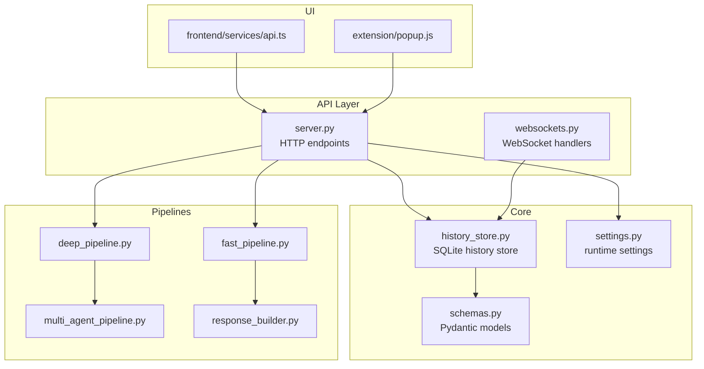
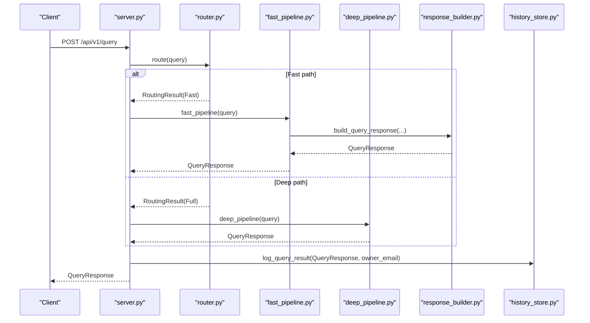
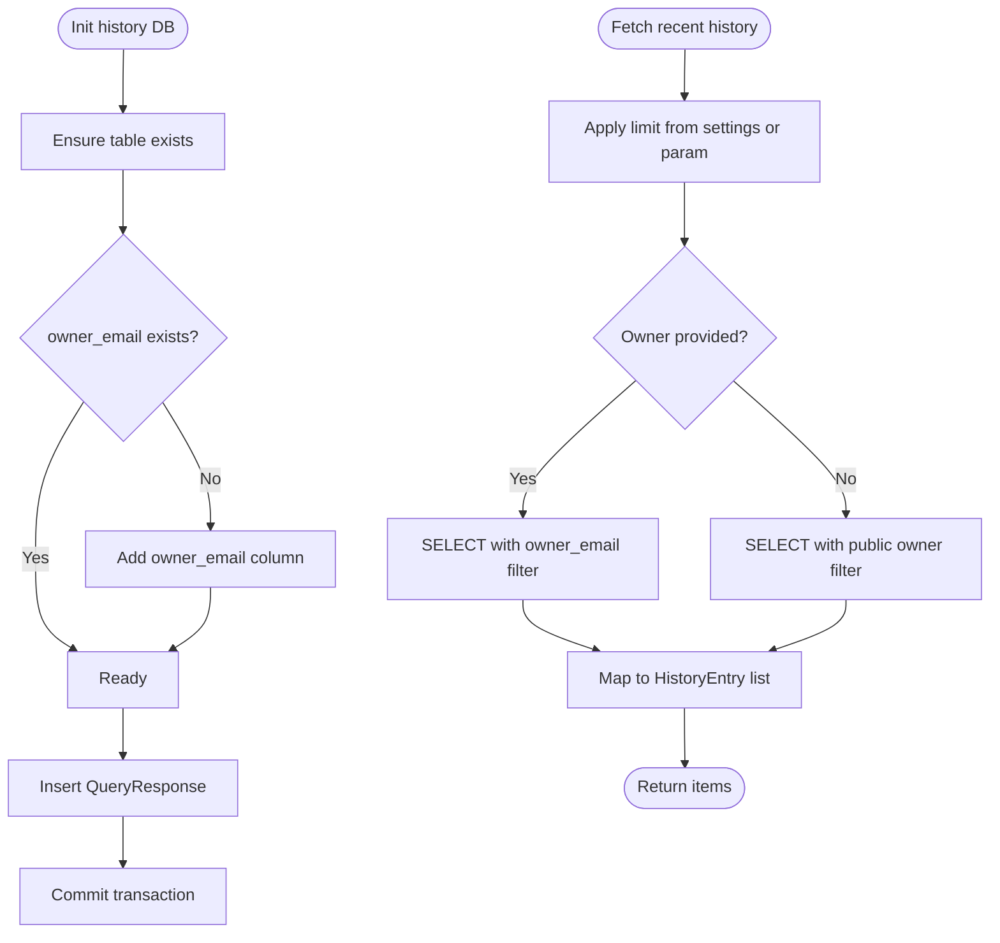
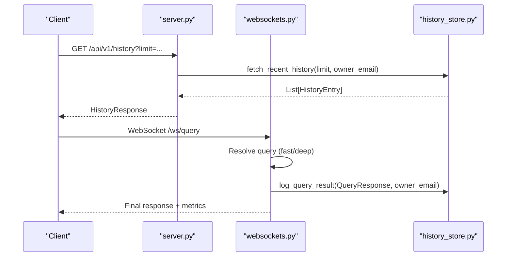
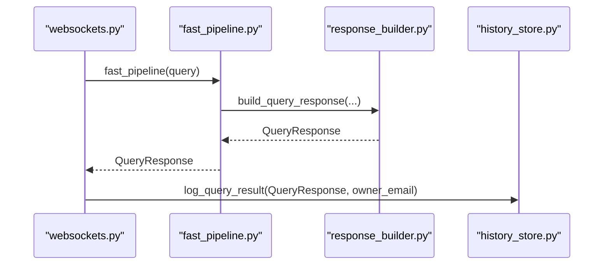
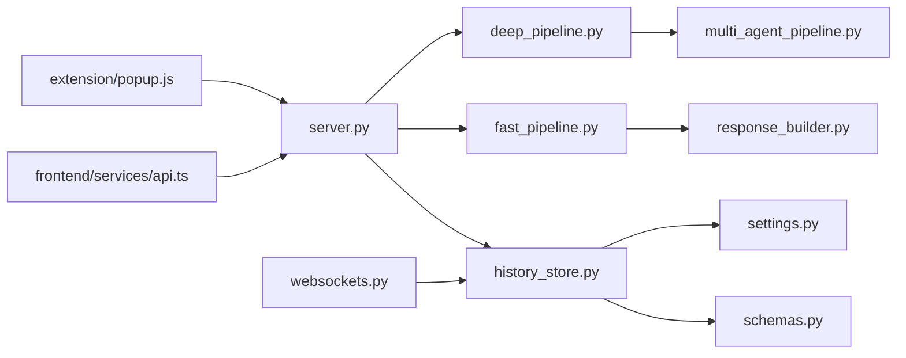

# Session History Persistence

<cite>
**Referenced Files in This Document**
- [history_store.py](file://veritas-ai/core/history_store.py)
- [schemas.py](file://veritas-ai/models/schemas.py)
- [settings.py](file://veritas-ai/config/settings.py)
- [server.py](file://veritas-ai/api/server.py)
- [websockets.py](file://veritas-ai/api/websockets.py)
- [fast_pipeline.py](file://veritas-ai/pipelines/fast_pipeline.py)
- [deep_pipeline.py](file://veritas-ai/pipelines/deep_pipeline.py)
- [multi_agent_pipeline.py](file://veritas-ai/pipelines/multi_agent_pipeline.py)
- [response_builder.py](file://veritas-ai/pipelines/response_builder.py)
- [router.py](file://veritas-ai/core/router.py)
- [popup.js](file://veritas-ai/extension/popup/popup.js)
- [api.ts](file://veritas-ai/frontend/services/api.ts)
</cite>

## Table of Contents
1. [Introduction](#introduction)
2. [Project Structure](#project-structure)
3. [Core Components](#core-components)
4. [Architecture Overview](#architecture-overview)
5. [Detailed Component Analysis](#detailed-component-analysis)
6. [Dependency Analysis](#dependency-analysis)
7. [Performance Considerations](#performance-considerations)
8. [Troubleshooting Guide](#troubleshooting-guide)
9. [Conclusion](#conclusion)
10. [Appendices](#appendices)

## Introduction
This document explains Veritas AI’s session history and conversation persistence system. It focuses on the SQLite-based session storage architecture, conversation thread management, and message history tracking. It documents the session lifecycle, data serialization formats, temporal query capabilities, conversation state management, context preservation across sessions, history pruning policies, query optimization for historical data retrieval, backup and restore procedures, data archival strategies, session security, data retention policies, compliance considerations, examples of session restoration, conversation analysis, and integration with the agent response pipeline.

## Project Structure
The session history subsystem spans several modules:
- Core persistence: SQLite-backed history store with a single table for query history
- Data models: Pydantic models define the serialized history entry and query response formats
- API integration: FastAPI endpoints and WebSocket handlers log and retrieve history
- Pipelines: Fast and deep pipelines produce the structured QueryResponse payloads logged to history
- Configuration: Settings control history limits and other runtime behaviors
- Frontend and extension: Clients consume history via API and WebSockets

**Diagram sources**
- [server.py](file://veritas-ai/api/server.py)
- [websockets.py](file://veritas-ai/api/websockets.py)
- [history_store.py](file://veritas-ai/core/history_store.py)
- [settings.py](file://veritas-ai/config/settings.py)
- [schemas.py](file://veritas-ai/models/schemas.py)
- [fast_pipeline.py](file://veritas-ai/pipelines/fast_pipeline.py)
- [deep_pipeline.py](file://veritas-ai/pipelines/deep_pipeline.py)
- [multi_agent_pipeline.py](file://veritas-ai/pipelines/multi_agent_pipeline.py)
- [response_builder.py](file://veritas-ai/pipelines/response_builder.py)
- [api.ts](file://veritas-ai/frontend/services/api.ts)
- [popup.js](file://veritas-ai/extension/popup/popup.js)

**Section sources**
- [history_store.py](file://veritas-ai/core/history_store.py)
- [schemas.py](file://veritas-ai/models/schemas.py)
- [settings.py](file://veritas-ai/config/settings.py)
- [server.py](file://veritas-ai/api/server.py)
- [websockets.py](file://veritas-ai/api/websockets.py)
- [fast_pipeline.py](file://veritas-ai/pipelines/fast_pipeline.py)
- [deep_pipeline.py](file://veritas-ai/pipelines/deep_pipeline.py)
- [multi_agent_pipeline.py](file://veritas-ai/pipelines/multi_agent_pipeline.py)
- [response_builder.py](file://veritas-ai/pipelines/response_builder.py)
- [api.ts](file://veritas-ai/frontend/services/api.ts)
- [popup.js](file://veritas-ai/extension/popup/popup.js)

## Core Components
- SQLite history store: Creates and maintains a persistent table for query history, with WAL mode and NORMAL sync for durability and performance. It supports owner scoping via an owner_email column and provides recent history retrieval with configurable limits.
- Pydantic models: Define the QueryResponse payload shape and the HistoryEntry projection used for history listings. These models ensure consistent serialization and deserialization across the system.
- API endpoints: Expose GET /history for retrieving recent entries and POST /query for initiating queries that are logged upon completion. WebSocket endpoints also log results during streaming.
- Pipelines: Produce QueryResponse objects that include timestamps, scores, summaries, and statuses. These are logged to history immediately after pipeline completion.
- Configuration: HISTORY_MAX_ITEMS controls the default limit for recent history queries.

Key responsibilities:
- Persistence: Insertion of QueryResponse records into SQLite
- Retrieval: Fetch recent history with optional owner filtering
- Serialization: Pydantic models ensure consistent data shapes
- Lifecycle: Logging occurs after pipeline completion; retrieval occurs via API/WebSockets

**Section sources**
- [history_store.py](file://veritas-ai/core/history_store.py)
- [schemas.py](file://veritas-ai/models/schemas.py)
- [settings.py](file://veritas-ai/config/settings.py)
- [server.py](file://veritas-ai/api/server.py)
- [websockets.py](file://veritas-ai/api/websockets.py)

## Architecture Overview
The session history architecture integrates the agent response pipeline with the history store and exposes retrieval via HTTP and WebSocket APIs.

**Diagram sources**
- [server.py](file://veritas-ai/api/server.py)
- [router.py](file://veritas-ai/core/router.py)
- [fast_pipeline.py](file://veritas-ai/pipelines/fast_pipeline.py)
- [deep_pipeline.py](file://veritas-ai/pipelines/deep_pipeline.py)
- [response_builder.py](file://veritas-ai/pipelines/response_builder.py)
- [history_store.py](file://veritas-ai/core/history_store.py)

## Detailed Component Analysis

### SQLite History Store
The history store manages a single table for query history with the following characteristics:
- Table schema includes identity, timestamp, query text, status, truth score, confidence score, summary, and owner_email
- Owner scoping allows private vs public history visibility
- WAL mode and NORMAL synchronous mode improve concurrency and durability
- Initialization ensures the table exists and adds owner_email if missing
- Logging inserts a new record for each QueryResponse
- Retrieval fetches recent entries with optional owner filter and configurable limit

**Diagram sources**
- [history_store.py](file://veritas-ai/core/history_store.py)
- [settings.py](file://veritas-ai/config/settings.py)

**Section sources**
- [history_store.py](file://veritas-ai/core/history_store.py)
- [settings.py](file://veritas-ai/config/settings.py)

### Data Models and Serialization
- QueryResponse: Produced by pipelines; includes query, summary, facts, sources, contradictions, fake probability, confidence score, truth score, status, and timestamp
- HistoryEntry: Projection used for listing recent history; includes id, timestamp, query, status, truth_score, and summary
- HistoryResponse: Wrapper for history listings

Serialization and deserialization are handled by Pydantic, ensuring consistent shapes across API boundaries and persistence.

**Section sources**
- [schemas.py](file://veritas-ai/models/schemas.py)

### API Integration and Session Lifecycle
- HTTP endpoint POST /api/v1/query resolves a query via fast or deep pipeline and logs the resulting QueryResponse to history
- HTTP endpoint GET /api/v1/history retrieves recent history with optional owner scoping and limit
- WebSocket endpoint /ws/query streams progress and returns the final QueryResponse, logging it upon completion
- WebSocket endpoint /ws/voice handles voice-to-speech workflows, including transcription, fast pipeline resolution, and speech synthesis, logging the final QueryResponse

**Diagram sources**
- [server.py](file://veritas-ai/api/server.py)
- [websockets.py](file://veritas-ai/api/websockets.py)
- [history_store.py](file://veritas-ai/core/history_store.py)

**Section sources**
- [server.py](file://veritas-ai/api/server.py)
- [websockets.py](file://veritas-ai/api/websockets.py)

### Conversation Thread Management and Message History Tracking
- The history store persists a flat list of query results with timestamps. There is no explicit thread ID or parent-child relationship between messages.
- Threads are implicitly managed by clients who group entries by owner_email and chronological order.
- The HistoryEntry model exposes timestamp and id, enabling clients to sort and paginate conversations.

**Section sources**
- [history_store.py](file://veritas-ai/core/history_store.py)
- [schemas.py](file://veritas-ai/models/schemas.py)

### Temporal Query Capabilities
- Recent history retrieval supports:
  - Limit parameter (validated 1–100)
  - Optional owner_email filter for private/public visibility
  - Default limit from settings (HISTORY_MAX_ITEMS)
- The underlying query orders by id descending to approximate recency.

**Section sources**
- [server.py](file://veritas-ai/api/server.py)
- [history_store.py](file://veritas-ai/core/history_store.py)
- [settings.py](file://veritas-ai/config/settings.py)

### Conversation State Management and Context Preservation
- The system does not maintain cross-query context in history. Each QueryResponse is stored independently.
- Context preservation across sessions relies on clients reconstructing context from prior history entries and managing conversation windows.
- The owner_email field enables per-user isolation of histories, supporting session-like grouping.

**Section sources**
- [history_store.py](file://veritas-ai/core/history_store.py)
- [schemas.py](file://veritas-ai/models/schemas.py)

### History Pruning Policies
- The code does not implement automatic pruning of historical entries.
- To control storage growth, adjust HISTORY_MAX_ITEMS and enforce client-side limits on retrieved history.
- Manual cleanup can be performed by administrators using SQL operations against the SQLite file.

**Section sources**
- [history_store.py](file://veritas-ai/core/history_store.py)
- [settings.py](file://veritas-ai/config/settings.py)

### Query Optimization for Historical Data Retrieval
- Current retrieval uses ORDER BY id DESC with LIMIT. Consider adding an index on timestamp for time-based queries if temporal filters become common.
- Owner filtering uses equality on owner_email; ensure appropriate indexing if scaling to large datasets.
- Batch retrieval is supported via limit and owner filters; pagination can be implemented client-side by iterating ids.

**Section sources**
- [history_store.py](file://veritas-ai/core/history_store.py)
- [settings.py](file://veritas-ai/config/settings.py)

### Backup and Restore Procedures
- Backup: Copy the SQLite file located at veritas-ai/data/query_history.sqlite while the system is idle or shut down to avoid corruption.
- Restore: Replace the SQLite file with a backed-up copy and restart the service. Ensure file permissions and ownership are preserved.
- Archival: Archive old history files periodically and prune manually if needed.

**Section sources**
- [history_store.py](file://veritas-ai/core/history_store.py)

### Data Archival Strategies
- Archive older entries by exporting via API and storing in external systems.
- Consider partitioning by date or owner_email for large-scale deployments.
- Retain only the most recent N entries based on HISTORY_MAX_ITEMS to cap storage.

**Section sources**
- [server.py](file://veritas-ai/api/server.py)
- [settings.py](file://veritas-ai/config/settings.py)

### Session Security, Data Retention, and Compliance
- Owner scoping: owner_email defaults to public; authenticated requests can set owner_email to a user-specific value, enabling per-user privacy.
- Access control: API endpoints require API keys for protected routes; WebSocket authorization is enforced via session_auth query parameter.
- Retention: No built-in retention policy; configure HISTORY_MAX_ITEMS and implement administrative pruning.
- Compliance: Ensure data minimization and user consent for personal data. Consider anonymizing or pseudonymizing owner_email identifiers.

**Section sources**
- [server.py](file://veritas-ai/api/server.py)
- [websockets.py](file://veritas-ai/api/websockets.py)
- [history_store.py](file://veritas-ai/core/history_store.py)
- [settings.py](file://veritas-ai/config/settings.py)

### Examples

#### Session Restoration
- Retrieve recent history for a user:
  - Endpoint: GET /api/v1/history?limit=25
  - Include API key header for user-scoped retrieval
  - Use owner_email derived from the API key to filter results
- Reconstruct a conversation:
  - Sort entries by timestamp/id
  - Group by owner_email to isolate sessions
  - Paginate by id to handle large histories

**Section sources**
- [server.py](file://veritas-ai/api/server.py)
- [history_store.py](file://veritas-ai/core/history_store.py)

#### Conversation Analysis
- Analyze trends by extracting truth_score and confidence_score distributions from HistoryEntry items.
- Filter by owner_email to focus on a specific user’s history.
- Export lists for external analytics tools.

**Section sources**
- [history_store.py](file://veritas-ai/core/history_store.py)
- [schemas.py](file://veritas-ai/models/schemas.py)

#### Integration with Agent Response Pipeline
- Fast pipeline: Produces QueryResponse; logged via asyncio.to_thread to history_store
- Deep pipeline: Produces QueryResponse; logged similarly
- WebSocket handlers: Log final QueryResponse after pipeline completion

**Diagram sources**
- [websockets.py](file://veritas-ai/api/websockets.py)
- [fast_pipeline.py](file://veritas-ai/pipelines/fast_pipeline.py)
- [response_builder.py](file://veritas-ai/pipelines/response_builder.py)
- [history_store.py](file://veritas-ai/core/history_store.py)

**Section sources**
- [websockets.py](file://veritas-ai/api/websockets.py)
- [fast_pipeline.py](file://veritas-ai/pipelines/fast_pipeline.py)
- [response_builder.py](file://veritas-ai/pipelines/response_builder.py)
- [history_store.py](file://veritas-ai/core/history_store.py)

## Dependency Analysis
The following diagram shows key dependencies among modules involved in session history persistence.

**Diagram sources**
- [history_store.py](file://veritas-ai/core/history_store.py)
- [schemas.py](file://veritas-ai/models/schemas.py)
- [settings.py](file://veritas-ai/config/settings.py)
- [server.py](file://veritas-ai/api/server.py)
- [websockets.py](file://veritas-ai/api/websockets.py)
- [fast_pipeline.py](file://veritas-ai/pipelines/fast_pipeline.py)
- [deep_pipeline.py](file://veritas-ai/pipelines/deep_pipeline.py)
- [multi_agent_pipeline.py](file://veritas-ai/pipelines/multi_agent_pipeline.py)
- [response_builder.py](file://veritas-ai/pipelines/response_builder.py)
- [api.ts](file://veritas-ai/frontend/services/api.ts)
- [popup.js](file://veritas-ai/extension/popup/popup.js)

**Section sources**
- [history_store.py](file://veritas-ai/core/history_store.py)
- [schemas.py](file://veritas-ai/models/schemas.py)
- [settings.py](file://veritas-ai/config/settings.py)
- [server.py](file://veritas-ai/api/server.py)
- [websockets.py](file://veritas-ai/api/websockets.py)
- [fast_pipeline.py](file://veritas-ai/pipelines/fast_pipeline.py)
- [deep_pipeline.py](file://veritas-ai/pipelines/deep_pipeline.py)
- [multi_agent_pipeline.py](file://veritas-ai/pipelines/multi_agent_pipeline.py)
- [response_builder.py](file://veritas-ai/pipelines/response_builder.py)
- [api.ts](file://veritas-ai/frontend/services/api.ts)
- [popup.js](file://veritas-ai/extension/popup/popup.js)

## Performance Considerations
- Asynchronous logging: Queries are logged in a background thread to avoid blocking the main pipeline
- SQLite tuning: WAL mode and NORMAL synchronous mode balance durability and throughput
- Caching: Redis cache reduces repeated computation and speeds up response delivery
- Limits: HISTORY_MAX_ITEMS caps memory and I/O during retrieval
- Recommendations:
  - Add an index on timestamp if temporal queries become frequent
  - Monitor SQLite file size and implement manual pruning or archival
  - Consider partitioning or offloading historical data to a data warehouse for analytics

[No sources needed since this section provides general guidance]

## Troubleshooting Guide
- History table not found:
  - Ensure initialization ran; the module initializes the table on import
- Missing owner_email column:
  - The initializer attempts to add the column; verify database permissions
- Slow history retrieval:
  - Consider adding an index on timestamp or owner_email
  - Reduce limit or enable client-side pagination
- WebSocket history logging errors:
  - Verify that QueryResponse is constructed correctly and owner_email is set
- API key required:
  - Some endpoints require API keys; ensure proper header or query parameter is provided

**Section sources**
- [history_store.py](file://veritas-ai/core/history_store.py)
- [server.py](file://veritas-ai/api/server.py)
- [websockets.py](file://veritas-ai/api/websockets.py)

## Conclusion
Veritas AI’s session history persistence is centered on a lightweight SQLite store that logs QueryResponse payloads produced by the fast and deep pipelines. The system supports owner-scoped visibility, recent history retrieval with configurable limits, and asynchronous logging to minimize latency. While there is no built-in pruning or advanced temporal querying, the design provides a solid foundation for building conversation threads, implementing retention policies, and integrating with the broader agent response pipeline. Administrators can manage storage growth through configuration and manual maintenance, and clients can leverage owner_email scoping for privacy and compliance.

[No sources needed since this section summarizes without analyzing specific files]

## Appendices

### API Endpoints Related to History
- GET /api/v1/history
  - Query parameters: limit (1–100), optional Authorization header for user-scoped retrieval
  - Returns: HistoryResponse with items as HistoryEntry
- POST /api/v1/query
  - Body: QueryRequest
  - Returns: QueryResponse; logs to history automatically
- WebSocket /ws/query
  - Streams progress and returns final QueryResponse; logs to history
- WebSocket /ws/voice
  - Handles voice workflows; logs final QueryResponse

**Section sources**
- [server.py](file://veritas-ai/api/server.py)
- [websockets.py](file://veritas-ai/api/websockets.py)