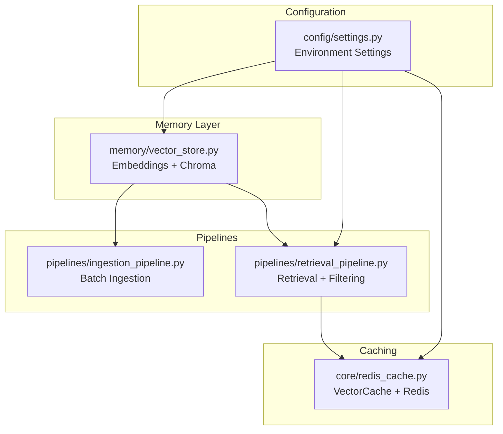
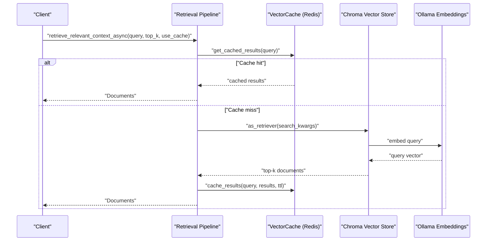
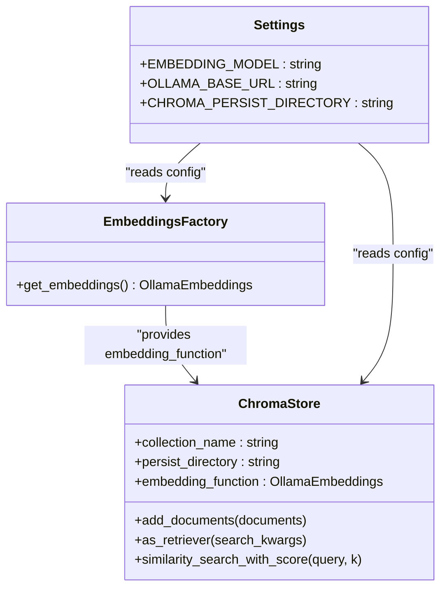
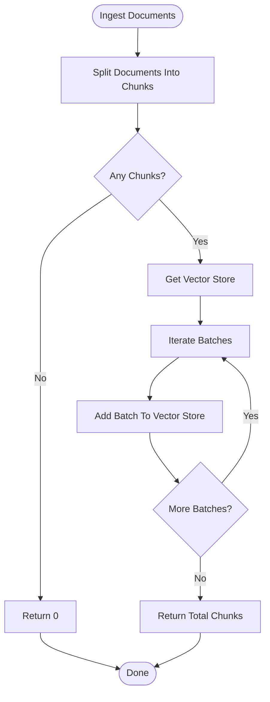
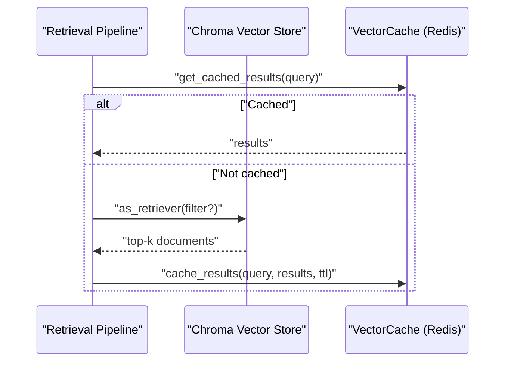
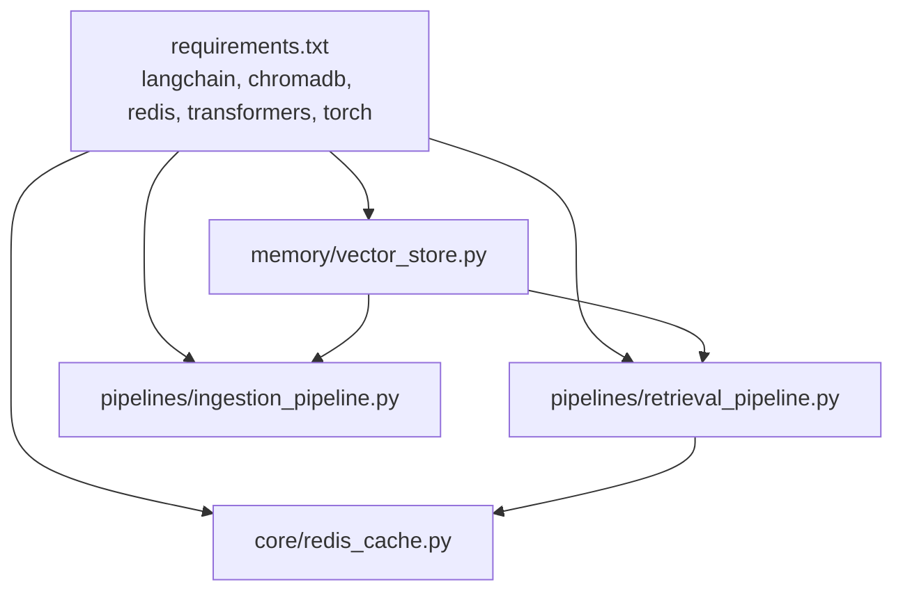

# Vector Embedding Storage

<cite>
**Referenced Files in This Document**
- [vector_store.py](file://veritas-ai/memory/vector_store.py)
- [retrieval_pipeline.py](file://veritas-ai/pipelines/retrieval_pipeline.py)
- [ingestion_pipeline.py](file://veritas-ai/pipelines/ingestion_pipeline.py)
- [redis_cache.py](file://veritas-ai/core/redis_cache.py)
- [settings.py](file://veritas-ai/config/settings.py)
- [schemas.py](file://veritas-ai/models/schemas.py)
- [requirements.txt](file://veritas-ai/requirements.txt)
</cite>

## Table of Contents
1. [Introduction](#introduction)
2. [Project Structure](#project-structure)
3. [Core Components](#core-components)
4. [Architecture Overview](#architecture-overview)
5. [Detailed Component Analysis](#detailed-component-analysis)
6. [Dependency Analysis](#dependency-analysis)
7. [Performance Considerations](#performance-considerations)
8. [Troubleshooting Guide](#troubleshooting-guide)
9. [Conclusion](#conclusion)
10. [Appendices](#appendices)

## Introduction
This document describes Veritas AI’s vector embedding storage system with a focus on ChromaDB-backed semantic vector storage, embedding generation workflows, and similarity search capabilities. It explains how vector dimensions are managed through the selected embedding model, how embeddings are generated locally via Ollama, and how retrieval integrates with metadata filtering and caching. It also covers ingestion batching for large-scale embeddings, query vector transformation, similarity scoring, result ranking, and operational maintenance considerations such as persistence and caching.

## Project Structure
The vector embedding system spans three primary areas:
- Memory layer: embedding and vector store initialization
- Pipelines: ingestion and retrieval workflows
- Caching: Redis-backed vector result caching

**Diagram sources**
- [vector_store.py:1-27](file://veritas-ai/memory/vector_store.py#L1-L27)
- [ingestion_pipeline.py:1-38](file://veritas-ai/pipelines/ingestion_pipeline.py#L1-L38)
- [retrieval_pipeline.py:1-112](file://veritas-ai/pipelines/retrieval_pipeline.py#L1-L112)
- [redis_cache.py:166-232](file://veritas-ai/core/redis_cache.py#L166-L232)
- [settings.py:13-83](file://veritas-ai/config/settings.py#L13-L83)

**Section sources**
- [vector_store.py:1-27](file://veritas-ai/memory/vector_store.py#L1-L27)
- [ingestion_pipeline.py:1-38](file://veritas-ai/pipelines/ingestion_pipeline.py#L1-L38)
- [retrieval_pipeline.py:1-112](file://veritas-ai/pipelines/retrieval_pipeline.py#L1-L112)
- [redis_cache.py:166-232](file://veritas-ai/core/redis_cache.py#L166-L232)
- [settings.py:13-83](file://veritas-ai/config/settings.py#L13-L83)

## Core Components
- Embedding generation: Ollama-based embeddings configured via environment settings
- Vector store: Chroma collection with persistent storage and local embedding function
- Retrieval: Semantic similarity search with optional metadata filters and score returns
- Ingestion: Chunking and batched insertion of documents into the vector store
- Caching: Redis-backed cache for vector search results keyed by normalized query hashes

Key configuration parameters:
- Embedding model name and Ollama base URL
- Chroma persist directory and collection name
- Retrieval top-k parameter
- Redis host/port/db for caching

**Section sources**
- [vector_store.py:8-26](file://veritas-ai/memory/vector_store.py#L8-L26)
- [settings.py:42-59](file://veritas-ai/config/settings.py#L42-L59)
- [retrieval_pipeline.py:29-45](file://veritas-ai/pipelines/retrieval_pipeline.py#L29-L45)
- [ingestion_pipeline.py:7-33](file://veritas-ai/pipelines/ingestion_pipeline.py#L7-L33)
- [redis_cache.py:166-219](file://veritas-ai/core/redis_cache.py#L166-L219)

## Architecture Overview
The system integrates LangChain’s Chroma vector store with Ollama embeddings and adds a Redis cache for retrieval results. Ingestion uses recursive character splitting and batches inserts to avoid resource contention. Retrieval supports top-k selection, optional metadata filtering, and asynchronous execution with thread pool offloading for CPU-bound operations.

**Diagram sources**
- [retrieval_pipeline.py:48-72](file://veritas-ai/pipelines/retrieval_pipeline.py#L48-L72)
- [redis_cache.py:195-219](file://veritas-ai/core/redis_cache.py#L195-L219)
- [vector_store.py:15-26](file://veritas-ai/memory/vector_store.py#L15-L26)
- [vector_store.py:8-13](file://veritas-ai/memory/vector_store.py#L8-L13)

## Detailed Component Analysis

### Embedding Generation and Vector Store Initialization
- Embeddings are produced by Ollama using a configurable model and base URL.
- Chroma initializes a persistent collection with a fixed collection name and embedding function.
- Persistence is ensured by creating the persist directory if missing.

**Diagram sources**
- [vector_store.py:8-26](file://veritas-ai/memory/vector_store.py#L8-L26)
- [settings.py:42-59](file://veritas-ai/config/settings.py#L42-L59)

**Section sources**
- [vector_store.py:8-26](file://veritas-ai/memory/vector_store.py#L8-L26)
- [settings.py:42-59](file://veritas-ai/config/settings.py#L42-L59)

### Ingestion Pipeline: Chunking and Batch Insertion
- Documents are split into overlapping chunks using a recursive character splitter.
- Chunks are inserted in batches to the vector store using a thread pool to avoid blocking the event loop.
- Batch size is configurable and defaults to a moderate value to balance throughput and memory.

**Diagram sources**
- [ingestion_pipeline.py:7-33](file://veritas-ai/pipelines/ingestion_pipeline.py#L7-L33)

**Section sources**
- [ingestion_pipeline.py:7-33](file://veritas-ai/pipelines/ingestion_pipeline.py#L7-L33)

### Retrieval Pipeline: Similarity Search and Metadata Filtering
- Retrieves top-k documents for a query using Chroma’s retriever interface.
- Supports returning similarity scores alongside documents.
- Supports metadata filtering via retriever search kwargs.
- Asynchronous retrieval with optional Redis caching of results keyed by normalized query hash.

**Diagram sources**
- [retrieval_pipeline.py:48-92](file://veritas-ai/pipelines/retrieval_pipeline.py#L48-L92)
- [redis_cache.py:195-219](file://veritas-ai/core/redis_cache.py#L195-L219)

**Section sources**
- [retrieval_pipeline.py:29-45](file://veritas-ai/pipelines/retrieval_pipeline.py#L29-L45)
- [retrieval_pipeline.py:75-92](file://veritas-ai/pipelines/retrieval_pipeline.py#L75-L92)
- [retrieval_pipeline.py:48-72](file://veritas-ai/pipelines/retrieval_pipeline.py#L48-L72)

### Vector Dimension Management and Embedding Model Selection
- Vector dimensions are determined by the selected embedding model. The system reads the model name and base URL from configuration and passes them to the Ollama embeddings wrapper.
- The embedding model can be changed via environment variables, enabling experimentation with different embedding sizes and quality characteristics.

**Section sources**
- [vector_store.py:8-13](file://veritas-ai/memory/vector_store.py#L8-L13)
- [settings.py:42-59](file://veritas-ai/config/settings.py#L42-L59)

### Similarity Search and Ranking
- Similarity search returns both documents and associated scores, enabling downstream ranking and filtering.
- Top-k selection is configurable and defaults to a small number suitable for concise retrieval.

**Section sources**
- [retrieval_pipeline.py:39-45](file://veritas-ai/pipelines/retrieval_pipeline.py#L39-L45)
- [settings.py:50-54](file://veritas-ai/config/settings.py#L50-L54)

### Metadata Filtering
- Retrieval supports passing a filter dictionary to Chroma’s retriever, allowing filtering by stored metadata fields.

**Section sources**
- [retrieval_pipeline.py:75-92](file://veritas-ai/pipelines/retrieval_pipeline.py#L75-L92)

### Batch Processing for Large-Scale Embeddings
- Ingestion uses a configurable batch size to insert chunks in batches, reducing memory pressure and avoiding CPU bottlenecks during embedding generation.

**Section sources**
- [ingestion_pipeline.py:28-33](file://veritas-ai/pipelines/ingestion_pipeline.py#L28-L33)

### Query Vector Transformation and Caching
- Queries are normalized and hashed to form cache keys for vector search results.
- Results are cached in Redis with a TTL, and retrieved asynchronously.

**Section sources**
- [retrieval_pipeline.py:95-98](file://veritas-ai/pipelines/retrieval_pipeline.py#L95-L98)
- [redis_cache.py:190-219](file://veritas-ai/core/redis_cache.py#L190-L219)

### Integration with Retrieval Pipeline
- Retrieval functions integrate with the broader pipeline by returning LangChain Document objects enriched with metadata, suitable for downstream processing.

**Section sources**
- [retrieval_pipeline.py:29-45](file://veritas-ai/pipelines/retrieval_pipeline.py#L29-L45)
- [schemas.py:14-26](file://veritas-ai/models/schemas.py#L14-L26)

## Dependency Analysis
External dependencies relevant to vector storage and retrieval:
- LangChain ecosystem for embeddings and vector stores
- ChromaDB for local vector database
- Redis for caching
- Ollama for local embedding generation

**Diagram sources**
- [requirements.txt:7-28](file://veritas-ai/requirements.txt#L7-L28)
- [vector_store.py:3-4](file://veritas-ai/memory/vector_store.py#L3-L4)
- [retrieval_pipeline.py:8](file://veritas-ai/pipelines/retrieval_pipeline.py#L8)
- [ingestion_pipeline.py:4-5](file://veritas-ai/pipelines/ingestion_pipeline.py#L4-L5)
- [redis_cache.py:8](file://veritas-ai/core/redis_cache.py#L8)

**Section sources**
- [requirements.txt:7-28](file://veritas-ai/requirements.txt#L7-L28)

## Performance Considerations
- Embedding model selection: Choose an embedding model appropriate for your corpus size and accuracy needs; larger models may increase latency but improve recall.
- Batch sizing: Tune batch size during ingestion to balance throughput and memory usage; monitor CPU and memory under load.
- Retrieval top-k: Lower values reduce latency but may drop relevant results; higher values improve recall at the cost of latency.
- Caching: Enable caching for repeated queries to reduce embedding and vector search overhead; adjust TTL based on data volatility.
- Thread pool offloading: Retrieval uses thread pool execution for CPU-bound operations; ensure adequate thread pool capacity for concurrent requests.
- Persistence: Ensure sufficient disk space in the Chroma persist directory; monitor growth and schedule periodic compaction if supported by the backend.

[No sources needed since this section provides general guidance]

## Troubleshooting Guide
Common issues and remedies:
- Ollama connectivity failures: Verify the Ollama base URL and that the embedding model is available; check network connectivity and firewall rules.
- Redis unavailability: If Redis is down, the system falls back to local caching; ensure Redis is reachable or disable vector caching.
- Empty or unexpected results: Confirm the vector store has ingested documents and that the collection name matches expectations.
- Slow retrieval: Reduce top-k, enable caching, or switch to a smaller embedding model; profile CPU-bound operations.
- Persistence errors: Ensure the persist directory exists and is writable; check filesystem permissions and available space.

**Section sources**
- [redis_cache.py:30-56](file://veritas-ai/core/redis_cache.py#L30-L56)
- [vector_store.py:20-26](file://veritas-ai/memory/vector_store.py#L20-L26)
- [settings.py:42-59](file://veritas-ai/config/settings.py#L42-L59)

## Conclusion
Veritas AI’s vector embedding storage leverages ChromaDB for persistent semantic vector storage and Ollama for local embedding generation. The retrieval pipeline offers flexible similarity search with optional metadata filtering and caching for improved performance. Ingestion is optimized for large-scale document processing through chunking and batching. Configuration-driven model selection and environment variables enable straightforward customization and deployment across diverse environments.

[No sources needed since this section summarizes without analyzing specific files]

## Appendices

### Configuration Options for Vector Storage
- Embedding model and Ollama base URL
- Chroma persist directory and collection name
- Retrieval top-k
- Redis host, port, and database

**Section sources**
- [settings.py:42-59](file://veritas-ai/config/settings.py#L42-L59)