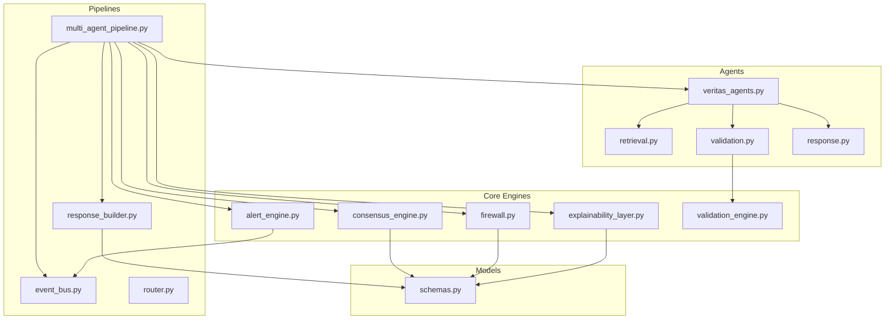
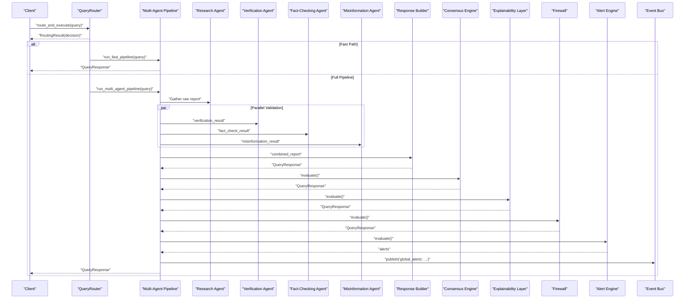
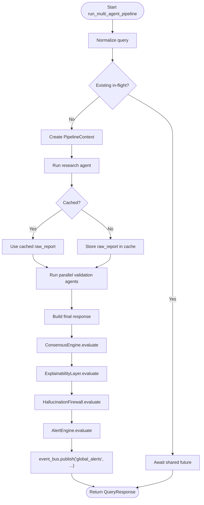
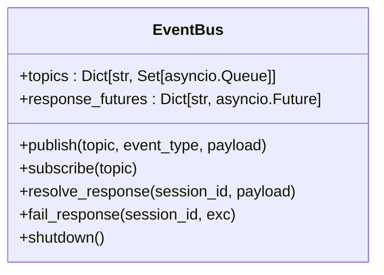
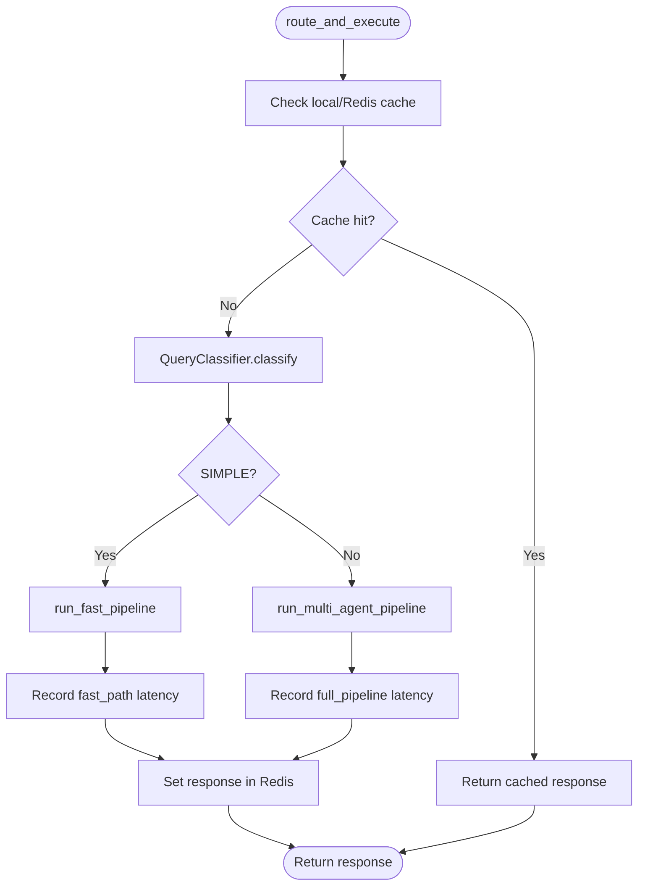
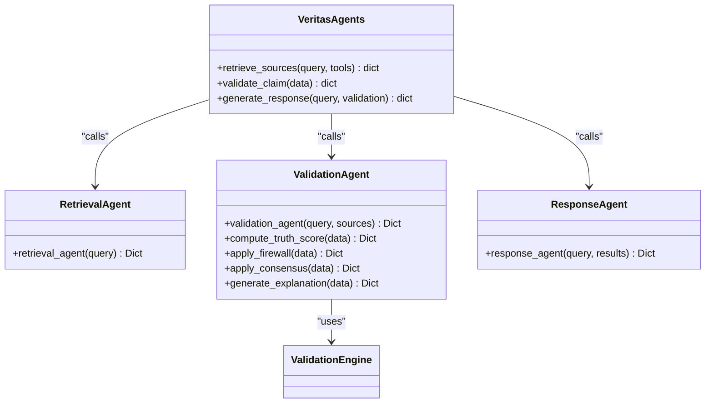
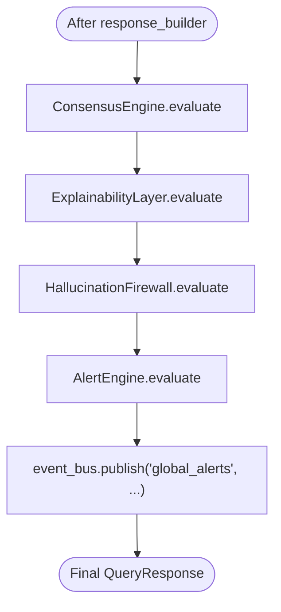
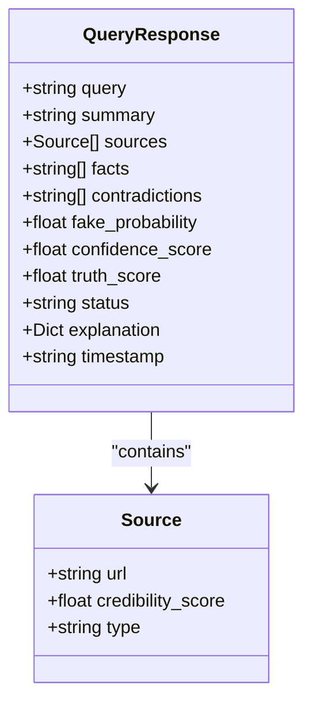
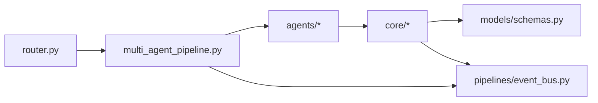

# Agent Collaboration & Coordination

<cite>
**Referenced Files in This Document**
- [multi_agent_pipeline.py](file://veritas-ai/pipelines/multi_agent_pipeline.py)
- [event_bus.py](file://veritas-ai/pipelines/event_bus.py)
- [router.py](file://veritas-ai/core/router.py)
- [consensus_engine.py](file://veritas-ai/core/consensus_engine.py)
- [alert_engine.py](file://veritas-ai/core/alert_engine.py)
- [firewall.py](file://veritas-ai/core/firewall.py)
- [explainability_layer.py](file://veritas-ai/core/explainability_layer.py)
- [response_builder.py](file://veritas-ai/pipelines/response_builder.py)
- [schemas.py](file://veritas-ai/models/schemas.py)
- [validation_engine.py](file://veritas-ai/core/validation_engine.py)
- [validation.py](file://veritas-ai/app/agents/validation.py)
- [retrieval.py](file://veritas-ai/app/agents/retrieval.py)
- [response.py](file://veritas-ai/app/agents/response.py)
- [veritas_agents.py](file://veritas-ai/agents/veritas_agents.py)
</cite>

## Table of Contents
1. [Introduction](#introduction)
2. [Project Structure](#project-structure)
3. [Core Components](#core-components)
4. [Architecture Overview](#architecture-overview)
5. [Detailed Component Analysis](#detailed-component-analysis)
6. [Dependency Analysis](#dependency-analysis)
7. [Performance Considerations](#performance-considerations)
8. [Troubleshooting Guide](#troubleshooting-guide)
9. [Conclusion](#conclusion)

## Introduction
This document explains the multi-agent collaboration system embedded in the event-driven pipeline. It focuses on how agents coordinate through the event bus, share context and intermediate results, and execute specialized tasks in parallel. It also documents agent lifecycle management, inter-agent communication protocols, conflict resolution mechanisms, and consensus-building processes. Finally, it covers coordination patterns for complex verifications, resource sharing strategies, load balancing approaches, examples of agent specialization, workflow orchestration, and failure recovery in distributed agent scenarios.

## Project Structure
The multi-agent collaboration spans several modules:
- Pipelines: orchestrate end-to-end workflows, manage concurrency, and coordinate agents.
- Core engines: provide consensus, explainability, firewall, and alerting.
- Agents: retrieval, validation, and response agents implement specialized tasks.
- Models: define the canonical QueryResponse schema used across the system.
- Event bus: enables asynchronous, decoupled communication between components.

**Diagram sources**
- [multi_agent_pipeline.py](file://veritas-ai/pipelines/multi_agent_pipeline.py)
- [event_bus.py](file://veritas-ai/pipelines/event_bus.py)
- [router.py](file://veritas-ai/core/router.py)
- [consensus_engine.py](file://veritas-ai/core/consensus_engine.py)
- [alert_engine.py](file://veritas-ai/core/alert_engine.py)
- [firewall.py](file://veritas-ai/core/firewall.py)
- [explainability_layer.py](file://veritas-ai/core/explainability_layer.py)
- [response_builder.py](file://veritas-ai/pipelines/response_builder.py)
- [schemas.py](file://veritas-ai/models/schemas.py)
- [validation_engine.py](file://veritas-ai/core/validation_engine.py)
- [validation.py](file://veritas-ai/app/agents/validation.py)
- [retrieval.py](file://veritas-ai/app/agents/retrieval.py)
- [response.py](file://veritas-ai/app/agents/response.py)
- [veritas_agents.py](file://veritas-ai/agents/veritas_agents.py)

**Section sources**
- [multi_agent_pipeline.py](file://veritas-ai/pipelines/multi_agent_pipeline.py)
- [event_bus.py](file://veritas-ai/pipelines/event_bus.py)
- [router.py](file://veritas-ai/core/router.py)
- [schemas.py](file://veritas-ai/models/schemas.py)

## Core Components
- Multi-agent pipeline orchestrator: coordinates research, parallel validation, and response building; manages deduplication of in-flight queries and timeouts.
- Event bus: asynchronous pub/sub broker enabling decoupled communication and alert propagation.
- Router: classifies queries and selects fast-path or full pipeline execution.
- Engines: consensus, firewall, explainability, and alerting layers transform raw agent outputs into a final, auditable response.
- Agents: retrieval, validation, and response agents encapsulate specialized logic and produce structured outputs compatible with the schema.

Key responsibilities:
- Context propagation: PipelineContext carries session_id, query, and intermediate results across stages.
- Parallelism: asyncio.gather executes multiple validation agents concurrently.
- Caching: hash-based caching reduces repeated computation; Redis-backed cache supports TTL.
- Progress reporting: optional callbacks emit stage transitions.
- Failure handling: centralized exceptions are caught, a fallback response is produced, and futures are resolved.

**Section sources**
- [multi_agent_pipeline.py](file://veritas-ai/pipelines/multi_agent_pipeline.py)
- [event_bus.py](file://veritas-ai/pipelines/event_bus.py)
- [router.py](file://veritas-ai/core/router.py)
- [consensus_engine.py](file://veritas-ai/core/consensus_engine.py)
- [firewall.py](file://veritas-ai/core/firewall.py)
- [explainability_layer.py](file://veritas-ai/core/explainability_layer.py)
- [alert_engine.py](file://veritas-ai/core/alert_engine.py)
- [response_builder.py](file://veritas-ai/pipelines/response_builder.py)
- [schemas.py](file://veritas-ai/models/schemas.py)

## Architecture Overview
The system follows an event-driven, multi-stage pipeline:
- Query routing: Router decides fast-path versus full pipeline.
- Research: A single agent gathers raw evidence and sources.
- Parallel validation: Three specialized agents (verification, fact-checking, misinformation) run concurrently.
- Response building: Extracted facts, sources, contradictions, and scores are merged into a canonical response.
- Consensus: Engines unify LLM, classifier, and rule-based signals.
- Explainability and firewall: Human-readable explanations and deterministic overrides refine the final output.
- Alerts: Anomaly detection emits structured alerts propagated via the event bus.

**Diagram sources**
- [router.py](file://veritas-ai/core/router.py)
- [multi_agent_pipeline.py](file://veritas-ai/pipelines/multi_agent_pipeline.py)
- [event_bus.py](file://veritas-ai/pipelines/event_bus.py)
- [response_builder.py](file://veritas-ai/pipelines/response_builder.py)
- [consensus_engine.py](file://veritas-ai/core/consensus_engine.py)
- [explainability_layer.py](file://veritas-ai/core/explainability_layer.py)
- [firewall.py](file://veritas-ai/core/firewall.py)
- [alert_engine.py](file://veritas-ai/core/alert_engine.py)

## Detailed Component Analysis

### Multi-Agent Pipeline Orchestration
Responsibilities:
- Deduplicate in-flight queries using a dictionary keyed by normalized query.
- Manage per-session futures to return the same result for concurrent requests.
- Execute research and parallel validations with progress callbacks.
- Construct final response using response builder, then apply consensus, explainability, and firewall layers.
- Publish alerts to the event bus when triggered.

Concurrency and caching:
- Async semaphore limits concurrent tool usage.
- Hash-based caching stores agent outputs with TTL.
- asyncio.gather runs validation agents in parallel.

Failure handling:
- Central try/except catches exceptions, constructs a fallback response, resolves the shared future, and returns the fallback.

**Diagram sources**
- [multi_agent_pipeline.py](file://veritas-ai/pipelines/multi_agent_pipeline.py)
- [event_bus.py](file://veritas-ai/pipelines/event_bus.py)
- [consensus_engine.py](file://veritas-ai/core/consensus_engine.py)
- [explainability_layer.py](file://veritas-ai/core/explainability_layer.py)
- [firewall.py](file://veritas-ai/core/firewall.py)
- [alert_engine.py](file://veritas-ai/core/alert_engine.py)

**Section sources**
- [multi_agent_pipeline.py](file://veritas-ai/pipelines/multi_agent_pipeline.py)

### Event Bus
The EventBus provides:
- Topic-based pub/sub with asyncio.Queue-backed subscribers.
- Response future resolution and cancellation for session-scoped RPC-like semantics.
- Graceful shutdown that cancels pending futures and clears internal state.

Usage in collaboration:
- Final alert emissions are published to a global topic for downstream consumers.

**Diagram sources**
- [event_bus.py](file://veritas-ai/pipelines/event_bus.py)

**Section sources**
- [event_bus.py](file://veritas-ai/pipelines/event_bus.py)

### Router and Query Classification
Responsibilities:
- Classify queries into SIMPLE, FACTUAL, or COMPLEX categories using pattern matching and heuristics.
- Route to fast-path for SIMPLE queries, otherwise run the full multi-agent pipeline.
- Maintain local and Redis caches for previously computed responses.
- Record latency metrics per route decision.

**Diagram sources**
- [router.py](file://veritas-ai/core/router.py)

**Section sources**
- [router.py](file://veritas-ai/core/router.py)

### Agents and Specializations
- Retrieval agent: synthesizes initial assessment, identifies needed source types, and estimates initial credibility.
- Validation agent: computes truth score, applies firewall, consensus, and explainability; runs CPU-bound logic in a thread pool.
- Response agent: merges retrieval and validation outputs into a canonical response structure.
- Lightweight utilities: retrieve_sources, validate_claim, generate_response serve as async helpers for fast-path and deep-path pipelines.

**Diagram sources**
- [retrieval.py](file://veritas-ai/app/agents/retrieval.py)
- [validation.py](file://veritas-ai/app/agents/validation.py)
- [response.py](file://veritas-ai/app/agents/response.py)
- [validation_engine.py](file://veritas-ai/core/validation_engine.py)
- [veritas_agents.py](file://veritas-ai/agents/veritas_agents.py)

**Section sources**
- [retrieval.py](file://veritas-ai/app/agents/retrieval.py)
- [validation.py](file://veritas-ai/app/agents/validation.py)
- [response.py](file://veritas-ai/app/agents/response.py)
- [validation_engine.py](file://veritas-ai/core/validation_engine.py)
- [veritas_agents.py](file://veritas-ai/agents/veritas_agents.py)

### Consensus, Explainability, Firewall, and Alerting
- ConsensusEngine: averages LLM confidence, classifier confidence, and rule-based truth score to produce a unified confidence.
- ExplainabilityLayer: generates human-readable explanations and confidence breakdowns.
- HallucinationFirewall: enforces deterministic overrides to prevent unsafe outputs.
- AlertEngine: detects anomalies and emits structured alerts.

**Diagram sources**
- [consensus_engine.py](file://veritas-ai/core/consensus_engine.py)
- [explainability_layer.py](file://veritas-ai/core/explainability_layer.py)
- [firewall.py](file://veritas-ai/core/firewall.py)
- [alert_engine.py](file://veritas-ai/core/alert_engine.py)
- [event_bus.py](file://veritas-ai/pipelines/event_bus.py)

**Section sources**
- [consensus_engine.py](file://veritas-ai/core/consensus_engine.py)
- [explainability_layer.py](file://veritas-ai/core/explainability_layer.py)
- [firewall.py](file://veritas-ai/core/firewall.py)
- [alert_engine.py](file://veritas-ai/core/alert_engine.py)

### Response Building and Schema
The response builder extracts facts, sources, contradictions, and fake probability from raw reports, then computes truth scores and confidence. The final response conforms to the canonical schema.

**Diagram sources**
- [response_builder.py](file://veritas-ai/pipelines/response_builder.py)
- [schemas.py](file://veritas-ai/models/schemas.py)

**Section sources**
- [response_builder.py](file://veritas-ai/pipelines/response_builder.py)
- [schemas.py](file://veritas-ai/models/schemas.py)

## Dependency Analysis
The collaboration relies on clear separation of concerns:
- Pipelines depend on agents, engines, and the event bus.
- Agents depend on engines and thread pools for CPU-bound work.
- Engines depend on the schema for input/output contracts.
- Router depends on caches and classification heuristics.

**Diagram sources**
- [router.py](file://veritas-ai/core/router.py)
- [multi_agent_pipeline.py](file://veritas-ai/pipelines/multi_agent_pipeline.py)
- [event_bus.py](file://veritas-ai/pipelines/event_bus.py)
- [validation.py](file://veritas-ai/app/agents/validation.py)
- [consensus_engine.py](file://veritas-ai/core/consensus_engine.py)
- [schemas.py](file://veritas-ai/models/schemas.py)

**Section sources**
- [router.py](file://veritas-ai/core/router.py)
- [multi_agent_pipeline.py](file://veritas-ai/pipelines/multi_agent_pipeline.py)
- [event_bus.py](file://veritas-ai/pipelines/event_bus.py)
- [validation.py](file://veritas-ai/app/agents/validation.py)
- [consensus_engine.py](file://veritas-ai/core/consensus_engine.py)
- [schemas.py](file://veritas-ai/models/schemas.py)

## Performance Considerations
- Concurrency control: a semaphore limits parallel tool usage to prevent resource exhaustion.
- Caching: hash-based caching of agent outputs and research results reduces redundant computation; TTL ensures freshness.
- Thread pool execution: CPU-intensive scoring runs off the event loop to avoid blocking.
- Asynchronous gather: parallel validation agents execute concurrently to reduce latency.
- Load balancing: the semaphore and TTL cache distribute load across the system.

[No sources needed since this section provides general guidance]

## Troubleshooting Guide
Common issues and remedies:
- Timeout during agent execution: The pipeline raises a pipeline-specific error and falls back to a conservative response.
- Duplicate in-flight queries: The system deduplicates and returns the same result via a shared future.
- Cache failures: Redis cache operations are guarded; failures are ignored to keep the pipeline resilient.
- Alert emission: Alerts are recorded locally and published to the event bus; verify subscription and topic routing.
- Firewall overrides: If too few trusted sources or contradictions exceed thresholds, the status may be downgraded to “uncertain” or “likely_false.”

**Section sources**
- [multi_agent_pipeline.py](file://veritas-ai/pipelines/multi_agent_pipeline.py)
- [event_bus.py](file://veritas-ai/pipelines/event_bus.py)
- [alert_engine.py](file://veritas-ai/core/alert_engine.py)
- [firewall.py](file://veritas-ai/core/firewall.py)

## Conclusion
The multi-agent collaboration system integrates asynchronous orchestration, specialized agents, and robust post-processing layers to deliver accurate, explainable, and safe truth assessments. The event bus decouples components, while routers and caches optimize throughput. Engines enforce consensus, explainability, and safety via deterministic rules. Together, these patterns enable scalable, fault-tolerant, and auditable agent workflows suitable for complex verifications and distributed deployments.