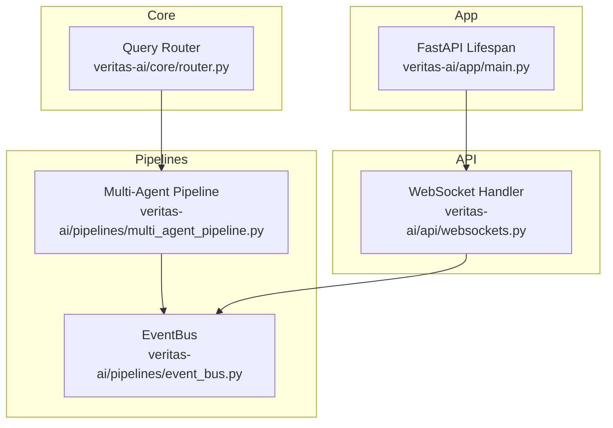
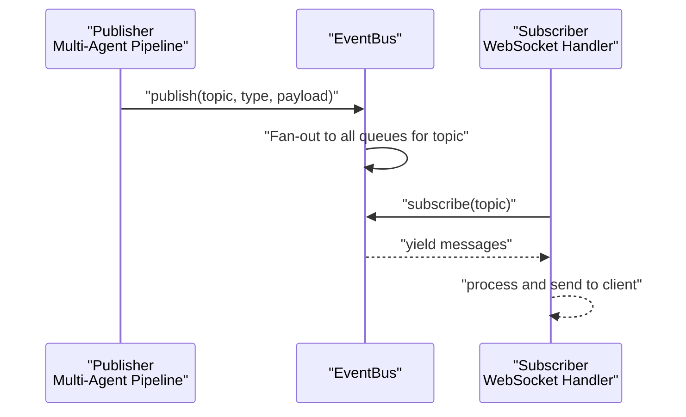
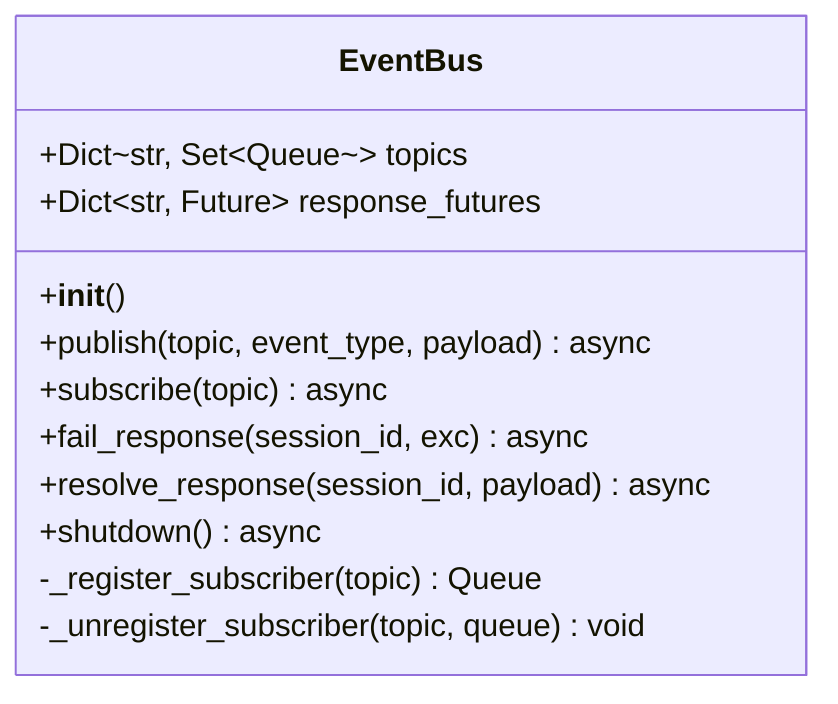
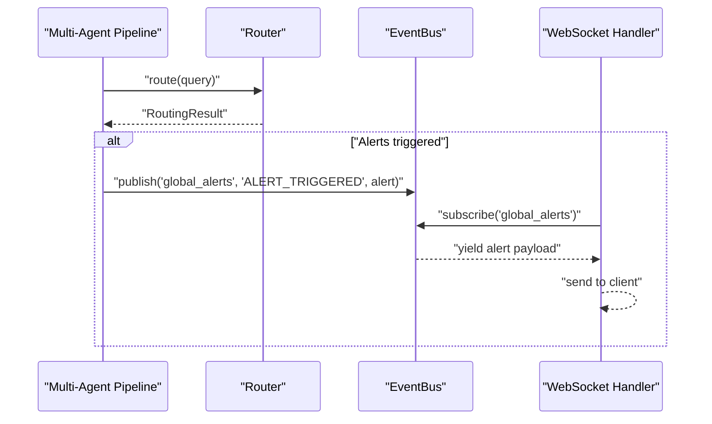
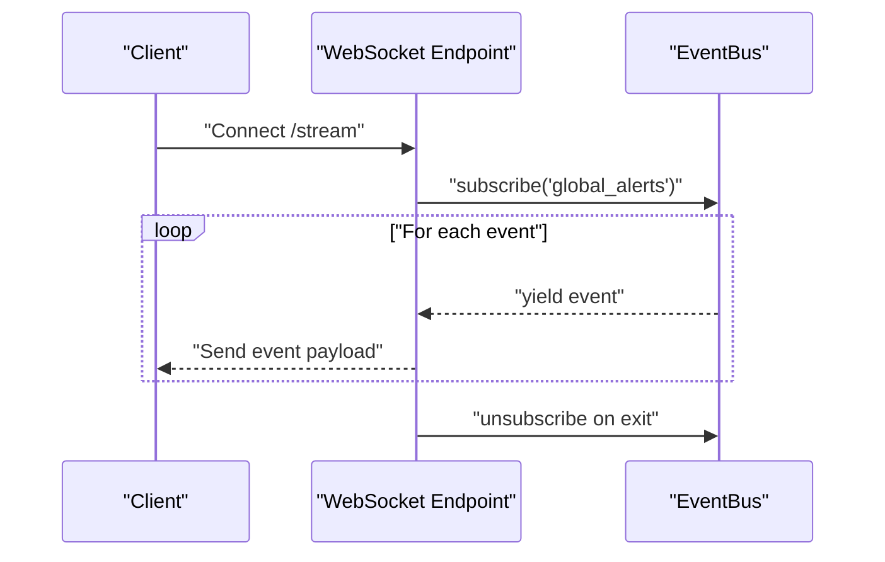
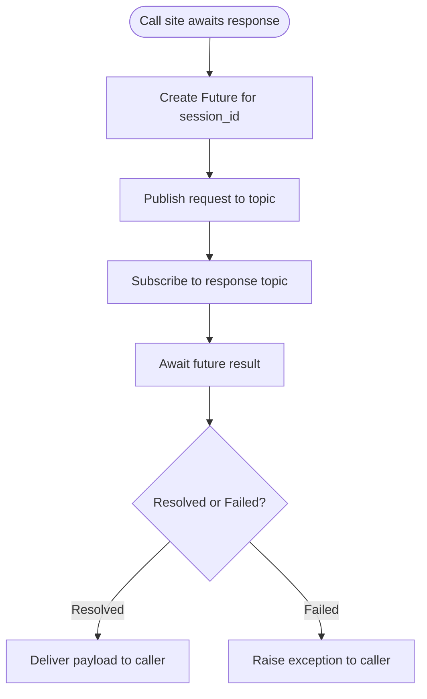
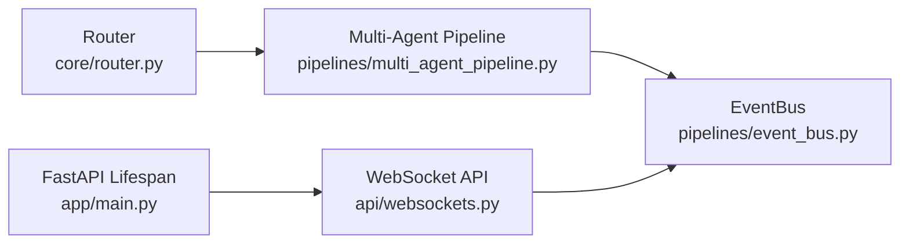

# EventBus Core

<cite>
**Referenced Files in This Document**
- [event_bus.py](file://veritas-ai/pipelines/event_bus.py)
- [multi_agent_pipeline.py](file://veritas-ai/pipelines/multi_agent_pipeline.py)
- [websockets.py](file://veritas-ai/api/websockets.py)
- [router.py](file://veritas-ai/core/router.py)
- [main.py](file://veritas-ai/app/main.py)
</cite>

## Table of Contents
1. [Introduction](#introduction)
2. [Project Structure](#project-structure)
3. [Core Components](#core-components)
4. [Architecture Overview](#architecture-overview)
5. [Detailed Component Analysis](#detailed-component-analysis)
6. [Dependency Analysis](#dependency-analysis)
7. [Performance Considerations](#performance-considerations)
8. [Troubleshooting Guide](#troubleshooting-guide)
9. [Conclusion](#conclusion)

## Introduction
This document describes the EventBus core component of Veritas AI’s event-driven architecture. The EventBus implements an asynchronous message broker that replaces synchronous, blocking execution with a decoupled publisher-subscriber model. It supports topic-based routing, in-memory queues backed by asyncio, and a response coordination mechanism via futures. The system is designed for low-latency streaming and graceful shutdown, integrating with WebSocket clients and multi-agent pipelines.

## Project Structure
The EventBus resides in the pipelines module and is consumed by the WebSocket API and the multi-agent pipeline. The router module participates in the broader streaming pipeline by triggering alerts that are published to the bus.

**Diagram sources**
- [event_bus.py](file://veritas-ai/pipelines/event_bus.py)
- [multi_agent_pipeline.py](file://veritas-ai/pipelines/multi_agent_pipeline.py)
- [websockets.py](file://veritas-ai/api/websockets.py)
- [router.py](file://veritas-ai/core/router.py)
- [main.py](file://veritas-ai/app/main.py)

**Section sources**
- [event_bus.py](file://veritas-ai/pipelines/event_bus.py)
- [multi_agent_pipeline.py](file://veritas-ai/pipelines/multi_agent_pipeline.py)
- [websockets.py](file://veritas-ai/api/websockets.py)
- [router.py](file://veritas-ai/core/router.py)
- [main.py](file://veritas-ai/app/main.py)

## Core Components
- EventBus: An in-memory, topic-based async message broker built on asyncio queues. It supports:
  - Topic registration and fan-out publishing
  - Subscriber registration and consumption via async iteration
  - Response coordination via futures keyed by session identifiers
  - Graceful shutdown that cancels pending futures and clears internal state
- Multi-Agent Pipeline: Publishes alert events to a dedicated topic and coordinates pipeline stages.
- WebSocket API: Subscribes to the alert topic to stream events to connected clients.
- Router: Provides routing decisions that influence when and how alerts are generated and published.

Key implementation references:
- EventBus class and methods: [event_bus.py](file://veritas-ai/pipelines/event_bus.py)
- Publishing alerts from pipeline: [multi_agent_pipeline.py](file://veritas-ai/pipelines/multi_agent_pipeline.py)
- Streaming alerts to clients: [websockets.py](file://veritas-ai/api/websockets.py)
- Router decision flow: [router.py](file://veritas-ai/core/router.py)

**Section sources**
- [event_bus.py](file://veritas-ai/pipelines/event_bus.py)
- [multi_agent_pipeline.py](file://veritas-ai/pipelines/multi_agent_pipeline.py)
- [websockets.py](file://veritas-ai/api/websockets.py)
- [router.py](file://veritas-ai/core/router.py)

## Architecture Overview
The EventBus enables a publish-subscribe pattern across components:
- Publishers (e.g., the multi-agent pipeline) emit structured events with a topic, type, and payload.
- Subscribers (e.g., WebSocket handlers) asynchronously consume events from the bus.
- Response coordination uses futures keyed by session identifiers to resolve or fail requests.

**Diagram sources**
- [multi_agent_pipeline.py](file://veritas-ai/pipelines/multi_agent_pipeline.py)
- [event_bus.py](file://veritas-ai/pipelines/event_bus.py)
- [websockets.py](file://veritas-ai/api/websockets.py)

## Detailed Component Analysis

### EventBus Class
The EventBus maintains:
- Topics mapped to sets of asyncio queues (fan-out distribution)
- Response futures keyed by session identifiers for request-response coordination

Core behaviors:
- Topic-based routing: Messages are delivered to all queues registered under a topic.
- Subscription lifecycle: Registers a new queue for a topic, yields messages until cancelled, then unregisters.
- Response coordination: Resolves or fails a future for a given session identifier if present and not yet done.
- Graceful shutdown: Cancels pending response futures, suppresses cancellation errors, and clears internal state.

**Diagram sources**
- [event_bus.py](file://veritas-ai/pipelines/event_bus.py)

**Section sources**
- [event_bus.py](file://veritas-ai/pipelines/event_bus.py)

### Publishing Alerts from the Multi-Agent Pipeline
The pipeline publishes alert events to a global topic after detecting triggers. This integrates with the router’s decision-making and downstream consumers.

**Diagram sources**
- [multi_agent_pipeline.py](file://veritas-ai/pipelines/multi_agent_pipeline.py)
- [router.py](file://veritas-ai/core/router.py)
- [event_bus.py](file://veritas-ai/pipelines/event_bus.py)
- [websockets.py](file://veritas-ai/api/websockets.py)

**Section sources**
- [multi_agent_pipeline.py](file://veritas-ai/pipelines/multi_agent_pipeline.py)
- [router.py](file://veritas-ai/core/router.py)
- [websockets.py](file://veritas-ai/api/websockets.py)

### Subscription and Streaming to Clients
WebSocket endpoints subscribe to the alert topic and stream events to connected clients. The subscription loop yields messages until cancelled, ensuring proper cleanup.

**Diagram sources**
- [websockets.py](file://veritas-ai/api/websockets.py)
- [event_bus.py](file://veritas-ai/pipelines/event_bus.py)

**Section sources**
- [websockets.py](file://veritas-ai/api/websockets.py)
- [event_bus.py](file://veritas-ai/pipelines/event_bus.py)

### Response Coordination with Futures
The EventBus exposes response resolution helpers to coordinate request-response flows keyed by session identifiers. Futures are resolved or failed based on upstream outcomes.

**Diagram sources**
- [event_bus.py](file://veritas-ai/pipelines/event_bus.py)

**Section sources**
- [event_bus.py](file://veritas-ai/pipelines/event_bus.py)

## Dependency Analysis
- EventBus depends on asyncio primitives for concurrency and queue fan-out.
- The multi-agent pipeline depends on EventBus for alert publication and on the router for decision-making.
- The WebSocket API depends on EventBus for alert subscription and on the app’s lifespan for lifecycle management.

**Diagram sources**
- [router.py](file://veritas-ai/core/router.py)
- [multi_agent_pipeline.py](file://veritas-ai/pipelines/multi_agent_pipeline.py)
- [event_bus.py](file://veritas-ai/pipelines/event_bus.py)
- [websockets.py](file://veritas-ai/api/websockets.py)
- [main.py](file://veritas-ai/app/main.py)

**Section sources**
- [router.py](file://veritas-ai/core/router.py)
- [multi_agent_pipeline.py](file://veritas-ai/pipelines/multi_agent_pipeline.py)
- [event_bus.py](file://veritas-ai/pipelines/event_bus.py)
- [websockets.py](file://veritas-ai/api/websockets.py)
- [main.py](file://veritas-ai/app/main.py)

## Performance Considerations
- Concurrency model: Uses asyncio queues and tasks to avoid blocking I/O and to fan out messages to multiple subscribers efficiently.
- Memory management: Queues are bounded by default asyncio.Queue semantics; subscribers must continuously consume to prevent backlog growth. On shutdown, the bus clears internal state to release references.
- Latency characteristics: Fan-out publishing iterates over registered queues; the number of subscribers directly impacts per-event overhead. Keep subscriptions scoped to topics and minimize unnecessary subscribers.
- Backpressure: Consumers must call task_done after processing to signal queue capacity. The provided subscription loop handles this automatically.
- Graceful shutdown: Pending response futures are cancelled and awaited with error suppression to ensure clean termination without leaking resources.

[No sources needed since this section provides general guidance]

## Troubleshooting Guide
Common issues and resolutions:
- Subscribers not receiving messages:
  - Verify the subscription topic matches the publisher topic.
  - Ensure the subscription loop continues running and is not cancelled prematurely.
- Slow or stalled consumers:
  - Confirm task_done is called after processing each message.
  - Reduce the number of subscribers or fan-out to the topic.
- Stuck during shutdown:
  - Ensure response futures are resolved or failed before shutdown.
  - Confirm the global EventBus shutdown is invoked at application teardown.
- WebSocket disconnects:
  - The WebSocket handler cancels the alert task on exceptions; confirm proper error handling and logging.

Operational references:
- Subscription loop and cleanup: [event_bus.py](file://veritas-ai/pipelines/event_bus.py)
- WebSocket alert streaming and task cancellation: [websockets.py](file://veritas-ai/api/websockets.py)
- Pipeline alert publishing: [multi_agent_pipeline.py](file://veritas-ai/pipelines/multi_agent_pipeline.py)
- Application lifespan and shutdown hooks: [main.py](file://veritas-ai/app/main.py)

**Section sources**
- [event_bus.py](file://veritas-ai/pipelines/event_bus.py)
- [websockets.py](file://veritas-ai/api/websockets.py)
- [multi_agent_pipeline.py](file://veritas-ai/pipelines/multi_agent_pipeline.py)
- [main.py](file://veritas-ai/app/main.py)

## Conclusion
The EventBus provides a lightweight, in-memory, topic-based publish-subscribe backbone for Veritas AI’s event-driven architecture. It leverages asyncio for efficient fan-out delivery, supports response coordination via futures, and integrates cleanly with WebSocket clients and multi-agent pipelines. Proper subscription lifecycle management and graceful shutdown ensure robust operation under production loads.