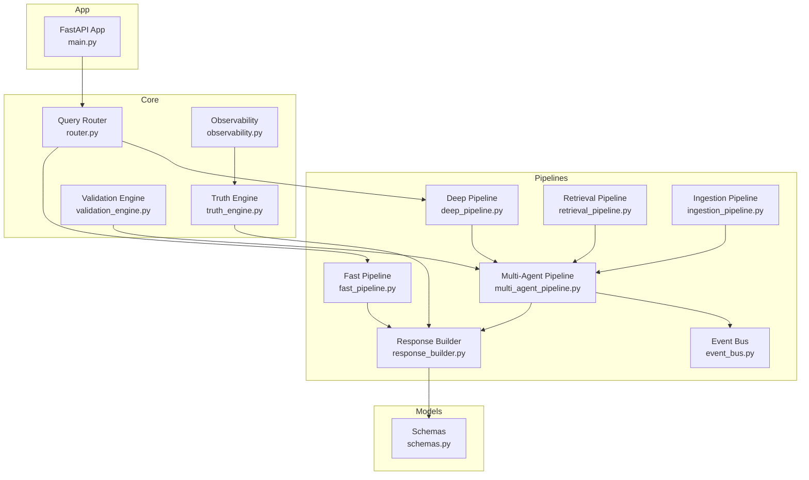
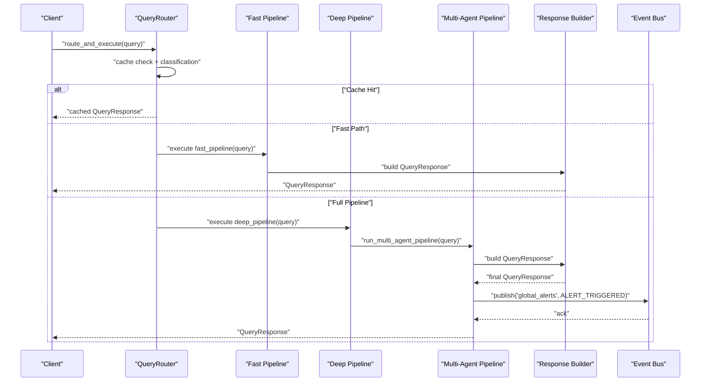
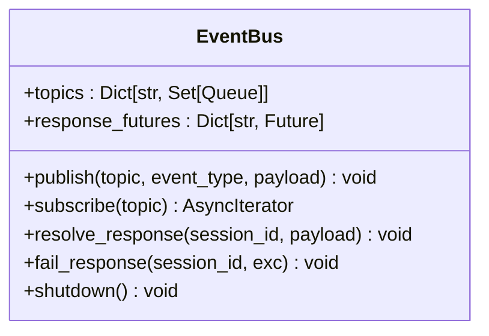
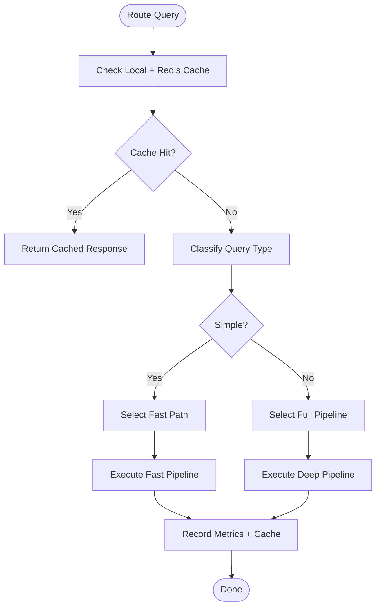
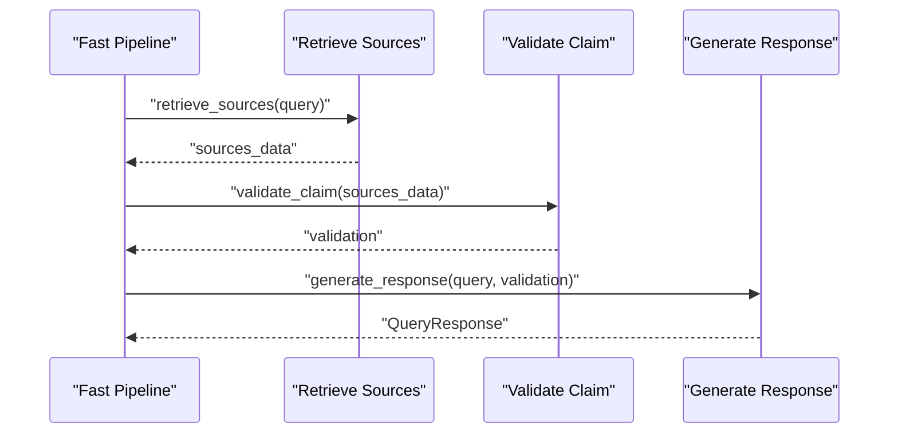
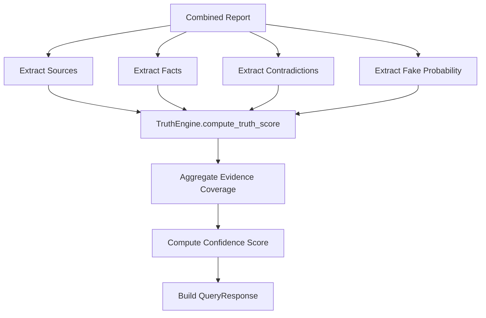
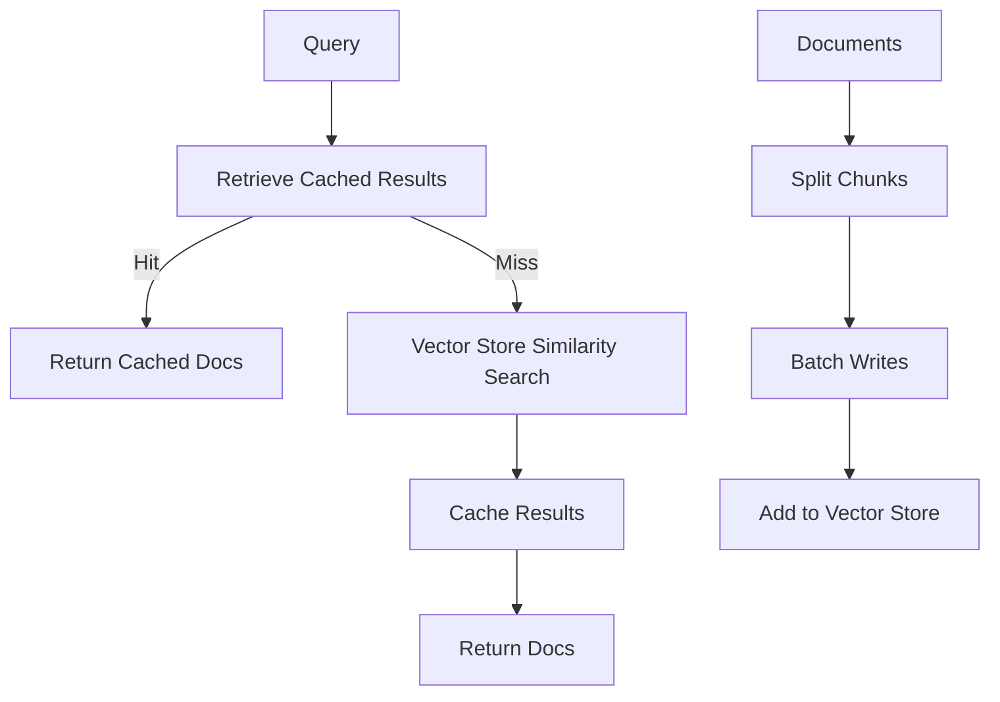
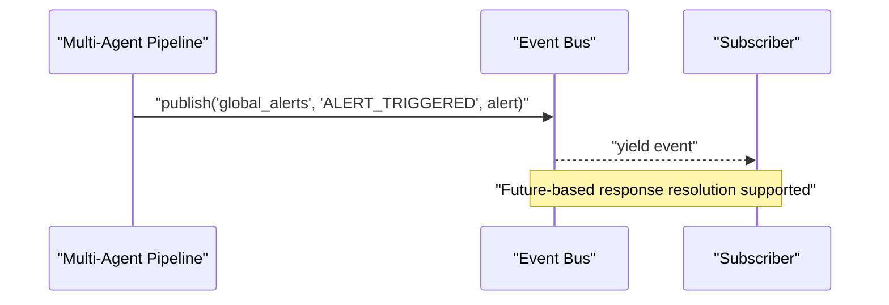
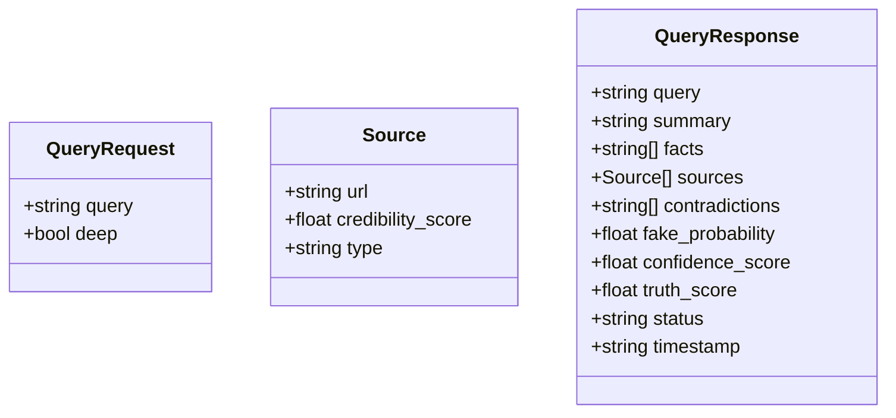
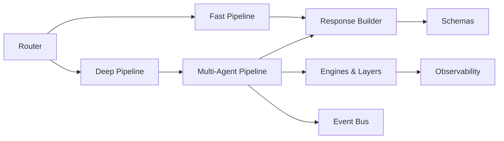

# Event-Driven Pipeline

<cite>
**Referenced Files in This Document**
- [event_bus.py](file://veritas-ai/pipelines/event_bus.py)
- [fast_pipeline.py](file://veritas-ai/pipelines/fast_pipeline.py)
- [deep_pipeline.py](file://veritas-ai/pipelines/deep_pipeline.py)
- [multi_agent_pipeline.py](file://veritas-ai/pipelines/multi_agent_pipeline.py)
- [ingestion_pipeline.py](file://veritas-ai/pipelines/ingestion_pipeline.py)
- [response_builder.py](file://veritas-ai/pipelines/response_builder.py)
- [retrieval_pipeline.py](file://veritas-ai/pipelines/retrieval_pipeline.py)
- [router.py](file://veritas-ai/core/router.py)
- [observability.py](file://veritas-ai/core/observability.py)
- [validation_engine.py](file://veritas-ai/core/validation_engine.py)
- [truth_engine.py](file://veritas-ai/core/truth_engine.py)
- [schemas.py](file://veritas-ai/models/schemas.py)
- [main.py](file://veritas-ai/app/main.py)
</cite>

## Table of Contents
1. [Introduction](#introduction)
2. [Project Structure](#project-structure)
3. [Core Components](#core-components)
4. [Architecture Overview](#architecture-overview)
5. [Detailed Component Analysis](#detailed-component-analysis)
6. [Dependency Analysis](#dependency-analysis)
7. [Performance Considerations](#performance-considerations)
8. [Troubleshooting Guide](#troubleshooting-guide)
9. [Conclusion](#conclusion)

## Introduction
This document describes the event-driven pipeline system powering Veritas AI’s asynchronous, multi-pass verification workflows. The system targets sub-two-second latency for fast-path queries while enabling deep, multi-agent verification for complex claims. It implements an event bus pattern for internal messaging, a smart router for path selection, and robust state management across pipeline stages. The document also covers serialization/deserialization of events, error propagation, performance characteristics, scalability, orchestration, fault tolerance, and monitoring integration points.

## Project Structure
The pipeline system spans several modules:
- Pipelines: event bus, fast and deep pipelines, multi-agent orchestration, ingestion, retrieval, and response building
- Core: router, engines (truth, validation), observability, and caches
- Models: Pydantic schemas for requests and responses
- App: FastAPI entrypoint, lifecycle management, middleware, and error handling



**Diagram sources**
- [event_bus.py:1-74](file://veritas-ai/pipelines/event_bus.py#L1-L74)
- [fast_pipeline.py:1-22](file://veritas-ai/pipelines/fast_pipeline.py#L1-L22)
- [deep_pipeline.py:1-17](file://veritas-ai/pipelines/deep_pipeline.py#L1-L17)
- [multi_agent_pipeline.py:1-379](file://veritas-ai/pipelines/multi_agent_pipeline.py#L1-L379)
- [response_builder.py:1-145](file://veritas-ai/pipelines/response_builder.py#L1-L145)
- [retrieval_pipeline.py:1-112](file://veritas-ai/pipelines/retrieval_pipeline.py#L1-L112)
- [ingestion_pipeline.py:1-38](file://veritas-ai/pipelines/ingestion_pipeline.py#L1-L38)
- [router.py:1-182](file://veritas-ai/core/router.py#L1-L182)
- [truth_engine.py:1-117](file://veritas-ai/core/truth_engine.py#L1-L117)
- [validation_engine.py:1-18](file://veritas-ai/core/validation_engine.py#L1-L18)
- [observability.py:1-75](file://veritas-ai/core/observability.py#L1-L75)
- [schemas.py:1-88](file://veritas-ai/models/schemas.py#L1-L88)
- [main.py:1-208](file://veritas-ai/app/main.py#L1-L208)

**Section sources**
- [main.py:106-208](file://veritas-ai/app/main.py#L106-L208)
- [router.py:83-182](file://veritas-ai/core/router.py#L83-L182)

## Core Components
- Event Bus: In-memory async pub/sub broker for internal event streaming and response resolution
- Router: Classifies queries and selects fast vs deep pipeline paths with caching and metrics
- Multi-Agent Pipeline: Orchestrates research, parallel validations, and response building with caching and timeouts
- Response Builder: Extracts facts, sources, contradictions, and computes truth/confidence scores
- Retrieval and Ingestion Pipelines: Async retrieval with caching and batched ingestion
- Engines and Observability: Truth scoring, validation, and drift monitoring

**Section sources**
- [event_bus.py:6-74](file://veritas-ai/pipelines/event_bus.py#L6-L74)
- [router.py:83-182](file://veritas-ai/core/router.py#L83-L182)
- [multi_agent_pipeline.py:209-379](file://veritas-ai/pipelines/multi_agent_pipeline.py#L209-L379)
- [response_builder.py:111-145](file://veritas-ai/pipelines/response_builder.py#L111-L145)
- [retrieval_pipeline.py:29-112](file://veritas-ai/pipelines/retrieval_pipeline.py#L29-L112)
- [ingestion_pipeline.py:7-38](file://veritas-ai/pipelines/ingestion_pipeline.py#L7-L38)
- [truth_engine.py:3-117](file://veritas-ai/core/truth_engine.py#L3-L117)
- [observability.py:6-75](file://veritas-ai/core/observability.py#L6-L75)

## Architecture Overview
The system separates concerns across routing, pipelines, and response construction. The router decides whether to serve cached results, run a fast path, or execute the full multi-agent pipeline. The fast path minimizes retrieval and validation steps to meet sub-two-second SLAs. The deep path executes a full multi-agent workflow, emitting alerts and persisting results. An event bus coordinates internal messaging and response resolution.



**Diagram sources**
- [router.py:153-182](file://veritas-ai/core/router.py#L153-L182)
- [fast_pipeline.py:8-22](file://veritas-ai/pipelines/fast_pipeline.py#L8-L22)
- [deep_pipeline.py:7-17](file://veritas-ai/pipelines/deep_pipeline.py#L7-L17)
- [multi_agent_pipeline.py:209-332](file://veritas-ai/pipelines/multi_agent_pipeline.py#L209-L332)
- [response_builder.py:111-145](file://veritas-ai/pipelines/response_builder.py#L111-L145)
- [event_bus.py:31-74](file://veritas-ai/pipelines/event_bus.py#L31-L74)

## Detailed Component Analysis

### Event Bus Pattern
The event bus provides an in-memory, async pub/sub mechanism to decouple producers and consumers. Topics are sets of queues; publishers broadcast messages to all subscribers. It supports response resolution via futures keyed by session identifiers and graceful shutdown that cancels in-flight futures.



**Diagram sources**
- [event_bus.py:6-74](file://veritas-ai/pipelines/event_bus.py#L6-L74)

**Section sources**
- [event_bus.py:31-74](file://veritas-ai/pipelines/event_bus.py#L31-L74)

### Router and Path Selection
The router classifies queries using regex heuristics and selects among cache hit, fast path, or full pipeline. It maintains local and Redis caches, records latency metrics per route, and returns a routing result alongside the chosen path.



**Diagram sources**
- [router.py:99-182](file://veritas-ai/core/router.py#L99-L182)

**Section sources**
- [router.py:83-182](file://veritas-ai/core/router.py#L83-L182)

### Fast Pipeline
The fast pipeline performs minimal retrieval and validation, returning a concise response designed to complete under two seconds. It orchestrates retrieval, validation, and response generation asynchronously.



**Diagram sources**
- [fast_pipeline.py:8-22](file://veritas-ai/pipelines/fast_pipeline.py#L8-L22)

**Section sources**
- [fast_pipeline.py:8-22](file://veritas-ai/pipelines/fast_pipeline.py#L8-L22)

### Deep Pipeline and Multi-Agent Orchestration
The deep pipeline delegates to the multi-agent pipeline, which:
- Deduplicates in-flight queries
- Runs research with caching
- Executes parallel validations (verification, fact-checking, misinformation)
- Builds a final response using consensus, explainability, and firewall layers
- Emits alerts via the event bus

```mermaid
sequenceDiagram
participant DP as "Deep Pipeline"
participant MAP as "Multi-Agent Pipeline"
participant Res as "Research Agent"
participant Par as "Parallel Validators"
participant RB as "Response Builder"
participant CE as "Consensus Engine"
participant EL as "Explainability Layer"
participant FW as "Firewall"
participant BUS as "Event Bus"
DP->>MAP : "run_multi_agent_pipeline(query)"
MAP->>Res : "gather evidence (cached or fresh)"
Res-->>MAP : "raw_report"
MAP->>Par : "run verification, fact-check, misinformation"
Par-->>MAP : "validation results"
MAP->>RB : "build_query_response(query, combined_report)"
RB->>CE : "evaluate"
CE->>EL : "evaluate"
EL->>FW : "evaluate"
FW-->>MAP : "final QueryResponse"
MAP->>BUS : "publish('global_alerts', ALERT_TRIGGERED)"
BUS-->>MAP : "ack"
MAP-->>DP : "QueryResponse"
```

**Diagram sources**
- [deep_pipeline.py:7-17](file://veritas-ai/pipelines/deep_pipeline.py#L7-L17)
- [multi_agent_pipeline.py:209-332](file://veritas-ai/pipelines/multi_agent_pipeline.py#L209-L332)
- [event_bus.py:31-74](file://veritas-ai/pipelines/event_bus.py#L31-L74)

**Section sources**
- [multi_agent_pipeline.py:209-332](file://veritas-ai/pipelines/multi_agent_pipeline.py#L209-L332)

### Response Building and Scoring
The response builder extracts facts, contradictions, and sources, computes a fake probability, and uses the truth engine to derive a truth score. It aggregates evidence coverage and confidence, returning a structured QueryResponse.



**Diagram sources**
- [response_builder.py:111-145](file://veritas-ai/pipelines/response_builder.py#L111-L145)
- [truth_engine.py:78-117](file://veritas-ai/core/truth_engine.py#L78-L117)

**Section sources**
- [response_builder.py:17-145](file://veritas-ai/pipelines/response_builder.py#L17-L145)
- [truth_engine.py:3-117](file://veritas-ai/core/truth_engine.py#L3-L117)

### Retrieval and Ingestion Pipelines
The retrieval pipeline caches results and uses vector similarity search with optional filters. The ingestion pipeline splits documents and batches writes to the vector store using threads to avoid blocking the event loop.



**Diagram sources**
- [retrieval_pipeline.py:29-112](file://veritas-ai/pipelines/retrieval_pipeline.py#L29-L112)
- [ingestion_pipeline.py:7-38](file://veritas-ai/pipelines/ingestion_pipeline.py#L7-L38)

**Section sources**
- [retrieval_pipeline.py:29-112](file://veritas-ai/pipelines/retrieval_pipeline.py#L29-L112)
- [ingestion_pipeline.py:7-38](file://veritas-ai/pipelines/ingestion_pipeline.py#L7-L38)

### Internal Messaging and Alerting
The multi-agent pipeline publishes global alerts to the event bus when triggered. Consumers can subscribe to topics and stream events asynchronously. The event bus resolves response futures for session-aware coordination.



**Diagram sources**
- [multi_agent_pipeline.py:330](file://veritas-ai/pipelines/multi_agent_pipeline.py#L330)
- [event_bus.py:31-74](file://veritas-ai/pipelines/event_bus.py#L31-L74)

**Section sources**
- [multi_agent_pipeline.py:324-332](file://veritas-ai/pipelines/multi_agent_pipeline.py#L324-L332)
- [event_bus.py:31-74](file://veritas-ai/pipelines/event_bus.py#L31-L74)

### Serialization and Deserialization
Requests and responses are modeled with Pydantic. The QueryRequest carries the query and a flag to opt into deep analysis. QueryResponse encapsulates the final evaluation, including sources, facts, contradictions, and computed scores.



**Diagram sources**
- [schemas.py:10-26](file://veritas-ai/models/schemas.py#L10-L26)

**Section sources**
- [schemas.py:10-26](file://veritas-ai/models/schemas.py#L10-L26)

## Dependency Analysis
The pipeline components exhibit clear separation of concerns:
- Router depends on caches and engines to decide the path
- Fast and deep pipelines depend on response builders and agents
- Multi-agent pipeline integrates retrieval, validation, response building, and alerting
- Engines and observability are reused across pipelines



**Diagram sources**
- [router.py:153-182](file://veritas-ai/core/router.py#L153-L182)
- [fast_pipeline.py:8-22](file://veritas-ai/pipelines/fast_pipeline.py#L8-L22)
- [deep_pipeline.py:7-17](file://veritas-ai/pipelines/deep_pipeline.py#L7-L17)
- [multi_agent_pipeline.py:209-332](file://veritas-ai/pipelines/multi_agent_pipeline.py#L209-L332)
- [response_builder.py:111-145](file://veritas-ai/pipelines/response_builder.py#L111-L145)
- [truth_engine.py:78-117](file://veritas-ai/core/truth_engine.py#L78-L117)
- [observability.py:45-72](file://veritas-ai/core/observability.py#L45-L72)
- [event_bus.py:31-74](file://veritas-ai/pipelines/event_bus.py#L31-L74)
- [schemas.py:10-26](file://veritas-ai/models/schemas.py#L10-L26)

**Section sources**
- [router.py:83-182](file://veritas-ai/core/router.py#L83-L182)
- [multi_agent_pipeline.py:209-332](file://veritas-ai/pipelines/multi_agent_pipeline.py#L209-L332)

## Performance Considerations
- Latency Targets
  - Fast path: designed to complete under two seconds by minimizing retrieval and validation
  - Deep path: comprehensive multi-agent verification with parallel validations
- Throughput and Concurrency
  - Parallel validations execute concurrently with semaphores to bound resource usage
  - Async retrieval and ingestion reduce blocking and improve batching
- Caching
  - Local TTL cache and Redis-backed cache accelerate repeated queries
  - Agent outputs and retrieval results are cached with TTL
- Serialization Overhead
  - Pydantic models enable efficient serialization/deserialization for API and internal messaging
- Observability
  - Metrics logging and drift detection help maintain quality and stability over time

[No sources needed since this section provides general guidance]

## Troubleshooting Guide
- Timeout Handling
  - Global middleware enforces request timeouts and returns standardized error responses
- Graceful Degradation
  - Cache initialization falls back to local-only mode if Redis is unavailable
  - Background model preloading continues even if initial startup fails
- Error Propagation
  - Multi-agent pipeline catches exceptions, constructs a fallback response, and returns it
  - Event bus can resolve/fail response futures to propagate errors to callers
- Monitoring Integration
  - Truth score computations are logged with breakdowns; drift detection writes anomaly logs
  - Router metrics track latency per route for performance insights

**Section sources**
- [main.py:127-167](file://veritas-ai/app/main.py#L127-L167)
- [main.py:33-68](file://veritas-ai/app/main.py#L33-L68)
- [multi_agent_pipeline.py:289-294](file://veritas-ai/pipelines/multi_agent_pipeline.py#L289-L294)
- [event_bus.py:52-74](file://veritas-ai/pipelines/event_bus.py#L52-L74)
- [observability.py:45-72](file://veritas-ai/core/observability.py#L45-L72)
- [router.py:138-149](file://veritas-ai/core/router.py#L138-L149)

## Conclusion
Veritas AI’s event-driven pipeline combines a smart router, fast and deep execution paths, and robust internal messaging to achieve sub-two-second latency for simple queries while supporting comprehensive multi-pass verification. The system emphasizes asynchronous processing, caching, and observability to ensure reliability, scalability, and maintainability. The modular design allows incremental improvements and targeted optimizations across retrieval, validation, and response construction.