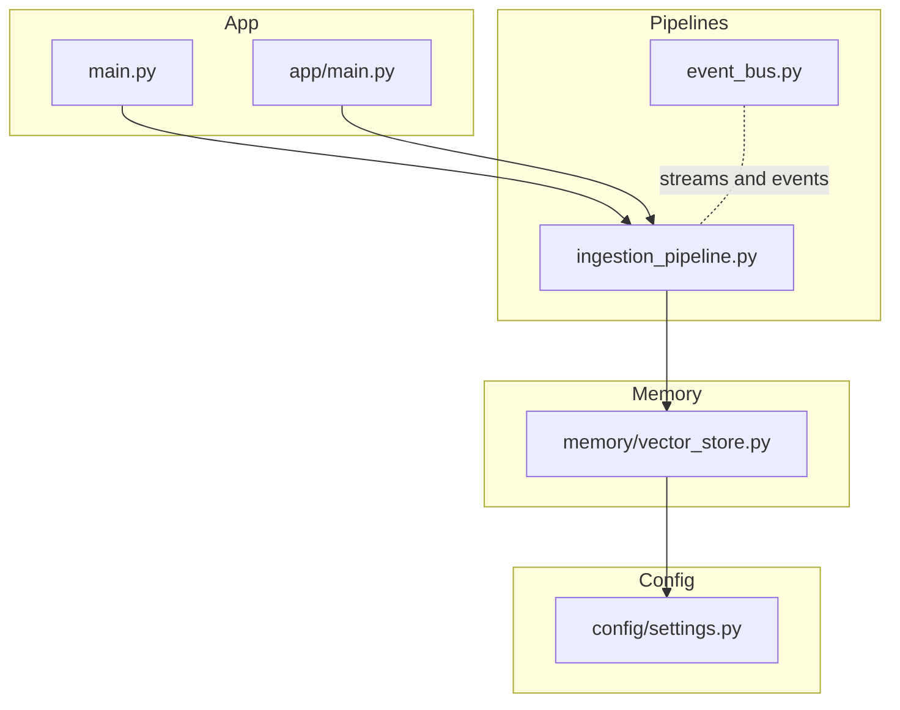
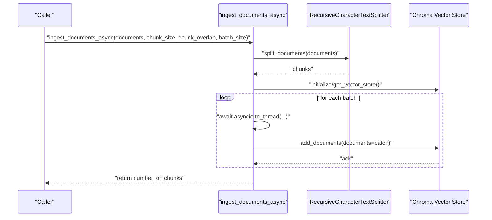
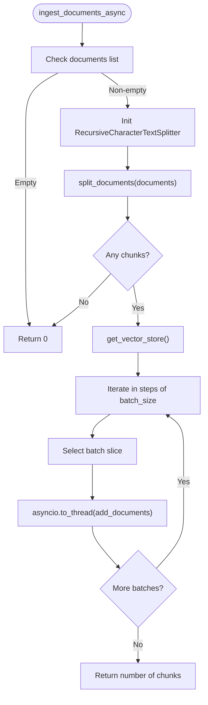
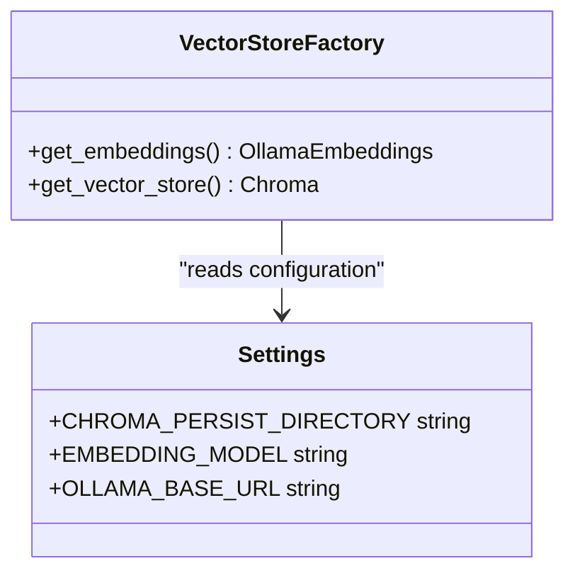
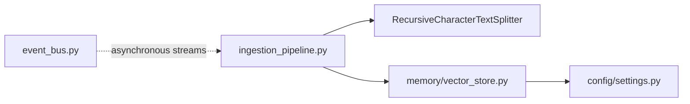

# Ingestion Pipeline

<cite>
**Referenced Files in This Document**
- [ingestion_pipeline.py](file://veritas-ai/pipelines/ingestion_pipeline.py)
- [vector_store.py](file://veritas-ai/memory/vector_store.py)
- [settings.py](file://veritas-ai/config/settings.py)
- [schemas.py](file://veritas-ai/models/schemas.py)
- [event_bus.py](file://veritas-ai/pipelines/event_bus.py)
- [main.py](file://veritas-ai/main.py)
- [app/main.py](file://veritas-ai/app/main.py)
</cite>

## Table of Contents
1. [Introduction](#introduction)
2. [Project Structure](#project-structure)
3. [Core Components](#core-components)
4. [Architecture Overview](#architecture-overview)
5. [Detailed Component Analysis](#detailed-component-analysis)
6. [Dependency Analysis](#dependency-analysis)
7. [Performance Considerations](#performance-considerations)
8. [Troubleshooting Guide](#troubleshooting-guide)
9. [Conclusion](#conclusion)

## Introduction
This document describes the Ingestion Pipeline responsible for asynchronously ingesting raw documents into a vector store. It covers the end-to-end flow from document preprocessing and text chunking to batched insertion, the async-to-thread execution model, memory management strategies, error handling for large documents, and integration with the vector store backend. It also provides performance tuning guidelines, memory usage patterns, and monitoring metrics for ingestion throughput.

## Project Structure
The ingestion pipeline is implemented as a standalone async function that orchestrates:
- Text splitting using a configurable splitter
- Vector store initialization
- Batched insertion via a thread pool to keep the event loop responsive

Key files involved:
- Pipelines: ingestion_pipeline.py
- Vector store: memory/vector_store.py
- Configuration: config/settings.py
- Schemas: models/schemas.py
- Event bus: pipelines/event_bus.py
- Application entry points: main.py and app/main.py

**Diagram sources**
- [ingestion_pipeline.py:1-38](file://veritas-ai/pipelines/ingestion_pipeline.py#L1-L38)
- [vector_store.py:1-27](file://veritas-ai/memory/vector_store.py#L1-L27)
- [settings.py:1-83](file://veritas-ai/config/settings.py#L1-L83)
- [event_bus.py:1-74](file://veritas-ai/pipelines/event_bus.py#L1-L74)
- [main.py:1-141](file://veritas-ai/main.py#L1-L141)
- [app/main.py:1-208](file://veritas-ai/app/main.py#L1-L208)

**Section sources**
- [ingestion_pipeline.py:1-38](file://veritas-ai/pipelines/ingestion_pipeline.py#L1-L38)
- [vector_store.py:1-27](file://veritas-ai/memory/vector_store.py#L1-L27)
- [settings.py:1-83](file://veritas-ai/config/settings.py#L1-L83)
- [event_bus.py:1-74](file://veritas-ai/pipelines/event_bus.py#L1-L74)
- [main.py:1-141](file://veritas-ai/main.py#L1-L141)
- [app/main.py:1-208](file://veritas-ai/app/main.py#L1-L208)

## Core Components
- Asynchronous ingestion function: orchestrates chunking and batched insertion.
- Vector store factory: initializes the Chroma vector store with configured embeddings.
- Configuration: exposes chunk size, overlap, batch size, and persistence settings.
- Schemas: defines the Document type used by the ingestion pipeline.
- Event bus: provides asynchronous event streaming infrastructure (used elsewhere in the system).
- Application lifecycle: integrates ingestion into startup/shutdown and sets timeouts.

Key responsibilities:
- Preprocess documents by splitting into chunks with configurable size and overlap.
- Insert chunks in batches to the vector store using a thread pool to avoid blocking the event loop.
- Return the total number of chunks ingested.

**Section sources**
- [ingestion_pipeline.py:7-38](file://veritas-ai/pipelines/ingestion_pipeline.py#L7-L38)
- [vector_store.py:15-27](file://veritas-ai/memory/vector_store.py#L15-L27)
- [settings.py:50-54](file://veritas-ai/config/settings.py#L50-L54)
- [schemas.py:5-26](file://veritas-ai/models/schemas.py#L5-L26)
- [event_bus.py:6-74](file://veritas-ai/pipelines/event_bus.py#L6-L74)
- [main.py:69-74](file://veritas-ai/main.py#L69-L74)
- [app/main.py:70-102](file://veritas-ai/app/main.py#L70-L102)

## Architecture Overview
The ingestion pipeline follows an async boundary around I/O-bound operations. It uses:
- Async function with a sync wrapper for convenience
- Recursive character-based text splitting
- Thread pool execution for vector store writes
- Configurable chunk size, overlap, and batch size

**Diagram sources**
- [ingestion_pipeline.py:7-38](file://veritas-ai/pipelines/ingestion_pipeline.py#L7-L38)
- [vector_store.py:15-27](file://veritas-ai/memory/vector_store.py#L15-L27)

## Detailed Component Analysis

### Asynchronous Ingestion Function
Responsibilities:
- Validate input and short-circuit on empty lists.
- Configure the text splitter with chunk size, overlap, and separator order.
- Split documents into chunks.
- Initialize the vector store.
- Iterate over chunks in fixed-size batches.
- Offload each batch insertion to a thread to keep the event loop responsive.
- Return the total number of chunks inserted.

Execution model:
- Uses asyncio.to_thread to move blocking vector store writes off the event loop.
- Provides a synchronous wrapper for non-async callers.

Error handling:
- Empty input returns early.
- Empty chunks after splitting returns early.
- Exceptions during vector store operations propagate to the caller.

**Diagram sources**
- [ingestion_pipeline.py:7-38](file://veritas-ai/pipelines/ingestion_pipeline.py#L7-L38)

**Section sources**
- [ingestion_pipeline.py:7-38](file://veritas-ai/pipelines/ingestion_pipeline.py#L7-L38)

### Vector Store Backend
Responsibilities:
- Provide embeddings configured via settings.
- Initialize a persistent Chroma collection with a given embedding function and persist directory.
- Expose a factory method to obtain the vector store instance.

Integration:
- Called by the ingestion pipeline to insert documents.
- Persists data to disk in the configured directory.

**Diagram sources**
- [vector_store.py:8-27](file://veritas-ai/memory/vector_store.py#L8-L27)
- [settings.py:50-54](file://veritas-ai/config/settings.py#L50-L54)

**Section sources**
- [vector_store.py:8-27](file://veritas-ai/memory/vector_store.py#L8-L27)
- [settings.py:50-54](file://veritas-ai/config/settings.py#L50-L54)

### Configuration and Parameters
Key parameters exposed by settings:
- Chunk size and overlap for text splitting.
- Batch size for vector store insertion.
- Embedding model and base URL for embeddings.
- Persist directory for Chroma.

Usage:
- Ingestion function accepts chunk_size, chunk_overlap, and batch_size as parameters.
- Vector store reads embedding and persistence settings from configuration.

**Section sources**
- [settings.py:50-54](file://veritas-ai/config/settings.py#L50-L54)
- [ingestion_pipeline.py:16-31](file://veritas-ai/pipelines/ingestion_pipeline.py#L16-L31)

### Application Lifecycle Integration
- The ingestion pipeline is not directly invoked in the provided entry points.
- The application lifecycles initialize caches, databases, and background tasks but do not trigger ingestion.
- The ingestion function can be called from external orchestration or batch jobs.

**Section sources**
- [main.py:69-74](file://veritas-ai/main.py#L69-L74)
- [app/main.py:70-102](file://veritas-ai/app/main.py#L70-L102)

## Dependency Analysis
- ingestion_pipeline.py depends on:
  - LangChain’s RecursiveCharacterTextSplitter for chunking
  - memory/vector_store.get_vector_store for the vector store instance
- vector_store.py depends on:
  - settings for embedding model, base URL, and persist directory
  - Chroma and OllamaEmbeddings for the vector store backend
- settings.py centralizes configuration for the ingestion pipeline parameters and vector store settings
- event_bus.py provides asynchronous messaging infrastructure used elsewhere in the system

**Diagram sources**
- [ingestion_pipeline.py:4-5](file://veritas-ai/pipelines/ingestion_pipeline.py#L4-L5)
- [vector_store.py:6-13](file://veritas-ai/memory/vector_store.py#L6-L13)
- [settings.py:50-54](file://veritas-ai/config/settings.py#L50-L54)
- [event_bus.py:31-50](file://veritas-ai/pipelines/event_bus.py#L31-L50)

**Section sources**
- [ingestion_pipeline.py:4-5](file://veritas-ai/pipelines/ingestion_pipeline.py#L4-L5)
- [vector_store.py:6-13](file://veritas-ai/memory/vector_store.py#L6-L13)
- [settings.py:50-54](file://veritas-ai/config/settings.py#L50-L54)
- [event_bus.py:31-50](file://veritas-ai/pipelines/event_bus.py#L31-L50)

## Performance Considerations
- Chunk sizing and overlap:
  - Larger chunk_size reduces fragmentation but increases embedding cost and context limits.
  - chunk_overlap helps preserve semantic continuity across chunk boundaries.
- Batch size:
  - Larger batch_size improves write throughput but increases memory usage and risk of transient failures.
  - Smaller batch_size reduces memory footprint and improves resilience to partial failures.
- Async-to-thread execution:
  - Using asyncio.to_thread prevents the event loop from being blocked by vector store writes, maintaining responsiveness.
- Memory management:
  - Process documents in batches; avoid loading all chunks into memory at once.
  - Monitor memory during ingestion of very large documents; consider reducing batch_size or chunk_size.
- Throughput monitoring:
  - Track the number of chunks ingested per unit time.
  - Measure latency per batch and adjust batch_size accordingly.
- Persistence and disk IO:
  - Ensure sufficient disk space and I/O bandwidth for Chroma persistence.
  - Tune persist_directory location for optimal disk performance.

[No sources needed since this section provides general guidance]

## Troubleshooting Guide
Common issues and mitigations:
- No documents provided:
  - The function returns early; verify upstream document preparation.
- Empty chunks after splitting:
  - Validate input documents and splitter separators; adjust chunk_size or separators.
- Vector store write errors:
  - Inspect exceptions raised by the vector store backend; retry failed batches with smaller batch_size.
- Large document ingestion:
  - Reduce chunk_size and/or batch_size; increase system memory; monitor disk IO.
- Timeout concerns:
  - The ingestion function itself is not bound by a timeout; ensure higher-level orchestration enforces deadlines if needed.

**Section sources**
- [ingestion_pipeline.py:13-24](file://veritas-ai/pipelines/ingestion_pipeline.py#L13-L24)
- [ingestion_pipeline.py:31](file://veritas-ai/pipelines/ingestion_pipeline.py#L31)

## Conclusion
The Ingestion Pipeline provides a robust, asynchronous mechanism to preprocess documents, split them into manageable chunks, and persist them into a vector store using batched, thread-offloaded writes. Its configuration-driven design allows tuning for performance and reliability, while the async-to-thread model ensures responsiveness. Properly sized chunk and batch parameters, combined with careful memory and disk management, enable efficient ingestion at scale.