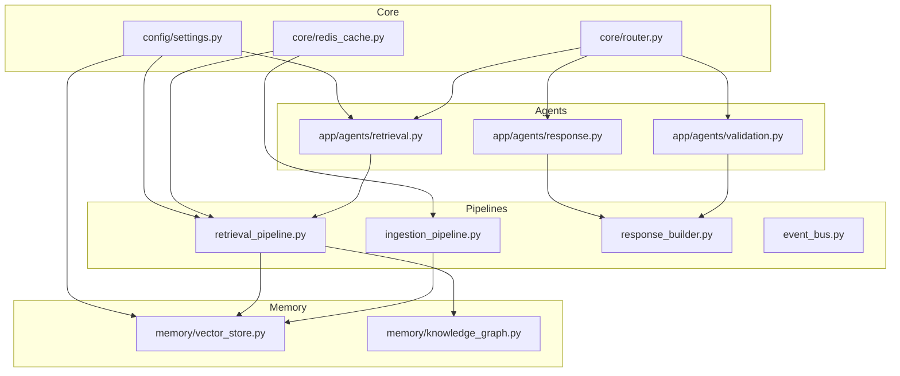
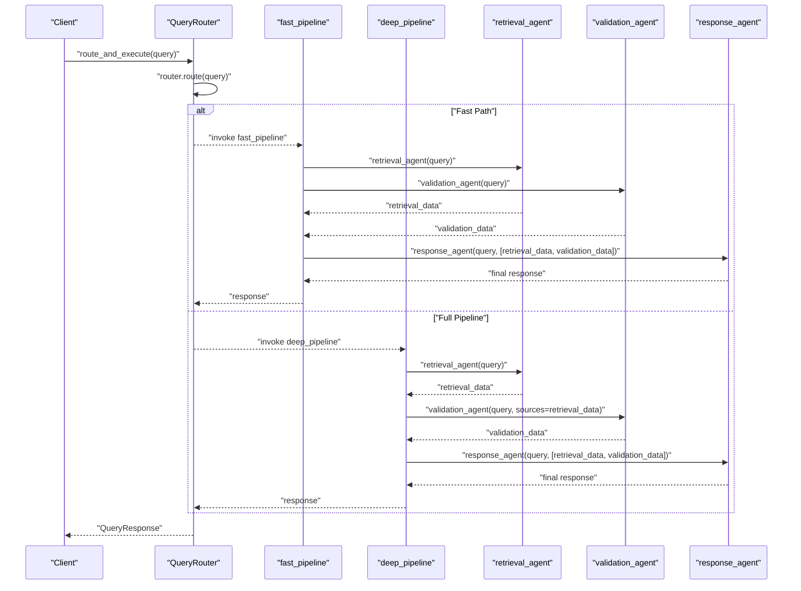
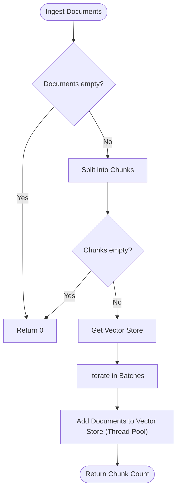
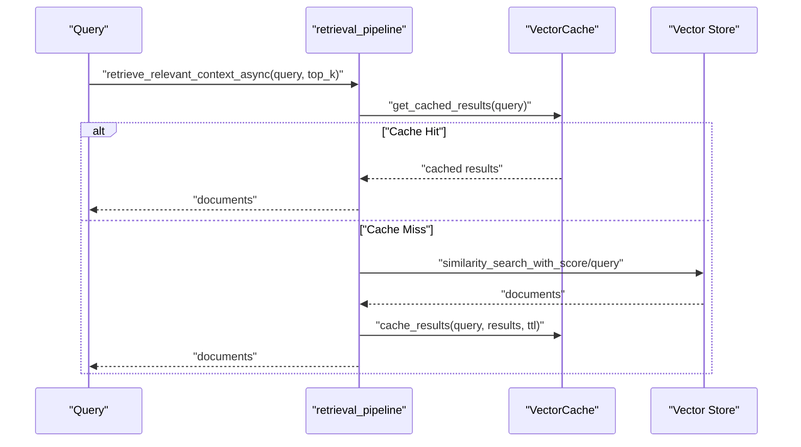
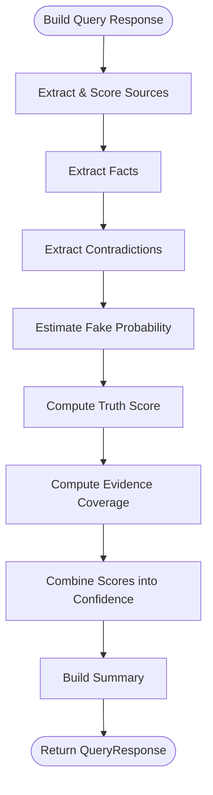
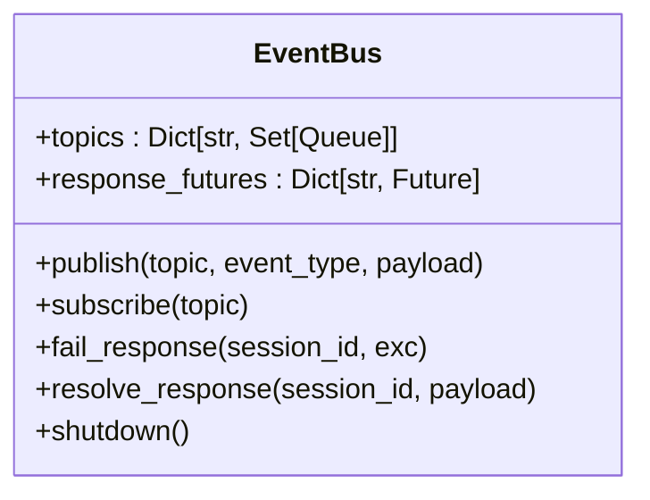
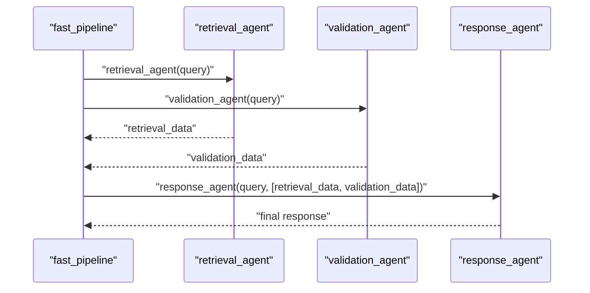
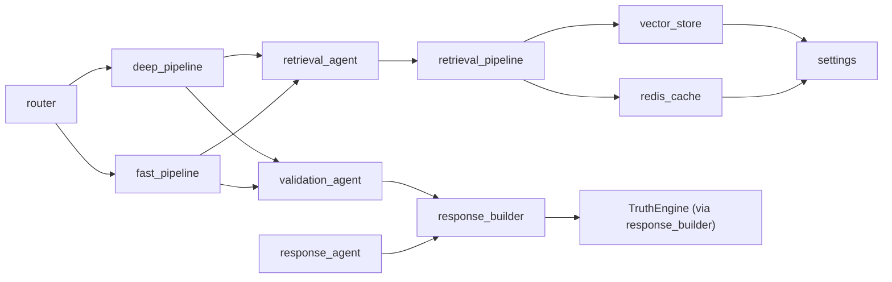

# Pipeline Processing Stages

<cite>
**Referenced Files in This Document**
- [ingestion_pipeline.py](file://veritas-ai/pipelines/ingestion_pipeline.py)
- [retrieval_pipeline.py](file://veritas-ai/pipelines/retrieval_pipeline.py)
- [response_builder.py](file://veritas-ai/pipelines/response_builder.py)
- [event_bus.py](file://veritas-ai/pipelines/event_bus.py)
- [deep_pipeline.py](file://veritas-ai/app/pipeline/deep_pipeline.py)
- [fast_pipeline.py](file://veritas-ai/app/pipeline/fast_pipeline.py)
- [vector_store.py](file://veritas-ai/memory/vector_store.py)
- [knowledge_graph.py](file://veritas-ai/memory/knowledge_graph.py)
- [settings.py](file://veritas-ai/config/settings.py)
- [router.py](file://veritas-ai/core/router.py)
- [retrieval.py](file://veritas-ai/app/agents/retrieval.py)
- [validation.py](file://veritas-ai/app/agents/validation.py)
- [response.py](file://veritas-ai/app/agents/response.py)
- [redis_cache.py](file://veritas-ai/core/redis_cache.py)
</cite>

## Table of Contents
1. [Introduction](#introduction)
2. [Project Structure](#project-structure)
3. [Core Components](#core-components)
4. [Architecture Overview](#architecture-overview)
5. [Detailed Component Analysis](#detailed-component-analysis)
6. [Dependency Analysis](#dependency-analysis)
7. [Performance Considerations](#performance-considerations)
8. [Troubleshooting Guide](#troubleshooting-guide)
9. [Conclusion](#conclusion)

## Introduction
This document explains the sequential processing stages within Veritas AI’s event-driven pipeline system. It covers:
- Ingestion Pipeline: data acquisition and preprocessing into the vector store
- Retrieval Pipeline: knowledge graph and vector store interactions for context retrieval
- Response Builder: synthesis of verified information into coherent outputs
It also details event flow, data transformations, error handling, state persistence, stage-specific configurations, performance optimizations, monitoring integration points, orchestration, dependency management, and fault tolerance.

## Project Structure
The pipeline system is organized around three primary stages and supporting infrastructure:
- Pipelines: ingestion, retrieval, response building, and event bus
- Agents: retrieval, validation, and response agents
- Memory: vector store and knowledge graph
- Core: routing, caching, and configuration
- Configuration: environment-driven settings

**Diagram sources**
- [ingestion_pipeline.py:1-38](file://veritas-ai/pipelines/ingestion_pipeline.py#L1-L38)
- [retrieval_pipeline.py:1-112](file://veritas-ai/pipelines/retrieval_pipeline.py#L1-L112)
- [response_builder.py:1-145](file://veritas-ai/pipelines/response_builder.py#L1-L145)
- [event_bus.py:1-74](file://veritas-ai/pipelines/event_bus.py#L1-L74)
- [retrieval.py:1-101](file://veritas-ai/app/agents/retrieval.py#L1-L101)
- [validation.py:1-314](file://veritas-ai/app/agents/validation.py#L1-L314)
- [response.py:1-73](file://veritas-ai/app/agents/response.py#L1-L73)
- [vector_store.py:1-27](file://veritas-ai/memory/vector_store.py#L1-L27)
- [knowledge_graph.py:1-160](file://veritas-ai/memory/knowledge_graph.py#L1-L160)
- [router.py:1-182](file://veritas-ai/core/router.py#L1-L182)
- [redis_cache.py:1-232](file://veritas-ai/core/redis_cache.py#L1-L232)
- [settings.py:1-83](file://veritas-ai/config/settings.py#L1-L83)

**Section sources**
- [ingestion_pipeline.py:1-38](file://veritas-ai/pipelines/ingestion_pipeline.py#L1-L38)
- [retrieval_pipeline.py:1-112](file://veritas-ai/pipelines/retrieval_pipeline.py#L1-L112)
- [response_builder.py:1-145](file://veritas-ai/pipelines/response_builder.py#L1-L145)
- [event_bus.py:1-74](file://veritas-ai/pipelines/event_bus.py#L1-L74)
- [retrieval.py:1-101](file://veritas-ai/app/agents/retrieval.py#L1-L101)
- [validation.py:1-314](file://veritas-ai/app/agents/validation.py#L1-L314)
- [response.py:1-73](file://veritas-ai/app/agents/response.py#L1-L73)
- [vector_store.py:1-27](file://veritas-ai/memory/vector_store.py#L1-L27)
- [knowledge_graph.py:1-160](file://veritas-ai/memory/knowledge_graph.py#L1-L160)
- [router.py:1-182](file://veritas-ai/core/router.py#L1-L182)
- [redis_cache.py:1-232](file://veritas-ai/core/redis_cache.py#L1-L232)
- [settings.py:1-83](file://veritas-ai/config/settings.py#L1-L83)

## Core Components
- Ingestion Pipeline: splits raw documents into chunks and persists them to the vector store in batches using async threads to avoid blocking.
- Retrieval Pipeline: retrieves relevant context from the vector store with optional caching and filtering; supports async batch retrieval and executor-based retrieval to keep the event loop responsive.
- Response Builder: extracts facts, sources, contradictions, and fake probability from reports, computes truth and confidence scores, and constructs a structured QueryResponse.
- Event Bus: asynchronous in-memory message broker enabling decoupled event streaming and response resolution for sessions.
- Agents: retrieval agent identifies source types and initial credibility; validation agent computes truth scores, applies firewall rules, consensus, and explainability; response agent merges outputs into a final response.
- Memory: vector store backed by Chroma with Ollama embeddings; knowledge graph with Neo4j async driver and connection pooling.
- Core: router classifies queries and selects fast or full pipeline paths; Redis cache provides distributed caching for queries and vector results; settings centralizes environment-driven configuration.

**Section sources**
- [ingestion_pipeline.py:7-37](file://veritas-ai/pipelines/ingestion_pipeline.py#L7-L37)
- [retrieval_pipeline.py:29-111](file://veritas-ai/pipelines/retrieval_pipeline.py#L29-L111)
- [response_builder.py:111-144](file://veritas-ai/pipelines/response_builder.py#L111-L144)
- [event_bus.py:6-73](file://veritas-ai/pipelines/event_bus.py#L6-L73)
- [retrieval.py:36-100](file://veritas-ai/app/agents/retrieval.py#L36-L100)
- [validation.py:278-313](file://veritas-ai/app/agents/validation.py#L278-L313)
- [response.py:32-72](file://veritas-ai/app/agents/response.py#L32-L72)
- [vector_store.py:8-26](file://veritas-ai/memory/vector_store.py#L8-L26)
- [knowledge_graph.py:25-131](file://veritas-ai/memory/knowledge_graph.py#L25-L131)
- [router.py:83-151](file://veritas-ai/core/router.py#L83-L151)
- [redis_cache.py:18-231](file://veritas-ai/core/redis_cache.py#L18-L231)
- [settings.py:20-76](file://veritas-ai/config/settings.py#L20-L76)

## Architecture Overview
The system orchestrates a routing layer that decides between fast and full pipelines. The fast pipeline runs retrieval and validation concurrently, while the deep pipeline sequences retrieval followed by validation and then response building. The retrieval stage interacts with the vector store and optionally the knowledge graph. The response builder synthesizes validated information into a structured output.

**Diagram sources**
- [router.py:153-181](file://veritas-ai/core/router.py#L153-L181)
- [fast_pipeline.py:13-48](file://veritas-ai/app/pipeline/fast_pipeline.py#L13-L48)
- [deep_pipeline.py:13-42](file://veritas-ai/app/pipeline/deep_pipeline.py#L13-L42)
- [retrieval.py:36-100](file://veritas-ai/app/agents/retrieval.py#L36-L100)
- [validation.py:278-313](file://veritas-ai/app/agents/validation.py#L278-L313)
- [response.py:32-72](file://veritas-ai/app/agents/response.py#L32-L72)

## Detailed Component Analysis

### Ingestion Pipeline
- Role: Acquire raw documents and preprocess them into chunks suitable for embedding and storage.
- Processing:
  - Uses a recursive character splitter to segment documents.
  - Retrieves a vector store instance and writes chunks in batches using a thread pool to avoid blocking the event loop.
- Error handling: Returns early if input is empty or chunking yields no results; relies on underlying vector store exceptions for invalid states.
- Configuration: chunk_size, chunk_overlap, and batch_size are tunable parameters exposed in the ingestion function.
- Persistence: Writes to a persistent Chroma collection named “veritas_knowledge_base” under the configured persist directory.

**Diagram sources**
- [ingestion_pipeline.py:7-37](file://veritas-ai/pipelines/ingestion_pipeline.py#L7-L37)
- [vector_store.py:15-26](file://veritas-ai/memory/vector_store.py#L15-L26)

**Section sources**
- [ingestion_pipeline.py:7-37](file://veritas-ai/pipelines/ingestion_pipeline.py#L7-L37)
- [vector_store.py:15-26](file://veritas-ai/memory/vector_store.py#L15-L26)

### Retrieval Pipeline
- Role: Retrieve relevant context for a query from the vector store, optionally using Redis caching and filters.
- Processing:
  - Retrieves cached vector store and embeddings instances once per process to reduce overhead.
  - Supports retrieving with scores, filtering by metadata, and batching multiple queries asynchronously.
  - Uses Redis-backed vector cache to store and retrieve previous similarity search results keyed by normalized query hashes.
- Error handling: Gracefully handles missing cache entries and returns empty lists for failed tasks in batch retrieval.
- Configuration: top-k defaults to a configurable value; chunk size and overlap are used by downstream ingestion; Redis host/port/db are configurable.
- Persistence: Vector results are cached in Redis with a TTL; vector store persists embeddings in a persistent Chroma directory.

**Diagram sources**
- [retrieval_pipeline.py:48-72](file://veritas-ai/pipelines/retrieval_pipeline.py#L48-L72)
- [redis_cache.py:166-218](file://veritas-ai/core/redis_cache.py#L166-L218)
- [vector_store.py:15-26](file://veritas-ai/memory/vector_store.py#L15-L26)

**Section sources**
- [retrieval_pipeline.py:29-111](file://veritas-ai/pipelines/retrieval_pipeline.py#L29-L111)
- [redis_cache.py:166-218](file://veritas-ai/core/redis_cache.py#L166-L218)
- [vector_store.py:15-26](file://veritas-ai/memory/vector_store.py#L15-L26)
- [settings.py:50-58](file://veritas-ai/config/settings.py#L50-L58)

### Response Builder
- Role: Synthesize verified information into a coherent QueryResponse.
- Processing:
  - Extracts URLs, deduplicates, and scores sources by domain type and TLD.
  - Identifies facts, contradictions, and fake probability from report text.
  - Computes truth score and confidence using a combination of truth engine metrics and evidence coverage.
  - Builds a summary based on retrieved assessment, validation status, and available evidence.
- Error handling: Gracefully handles missing sources and sparse evidence; returns conservative summaries when insufficient data is present.
- Configuration: No stage-specific parameters; relies on truth engine constants and report heuristics.

**Diagram sources**
- [response_builder.py:111-144](file://veritas-ai/pipelines/response_builder.py#L111-L144)

**Section sources**
- [response_builder.py:17-144](file://veritas-ai/pipelines/response_builder.py#L17-L144)

### Event Bus
- Role: Decouple producers and consumers via an in-memory asynchronous message broker.
- Features:
  - Publishes events to topics with type and payload.
  - Subscribes to topics and yields messages sequentially.
  - Resolves or fails response futures by session ID.
  - Provides graceful shutdown by canceling pending futures and clearing state.
- Usage: Enables streaming and session-aware response coordination in event-driven flows.

**Diagram sources**
- [event_bus.py:6-73](file://veritas-ai/pipelines/event_bus.py#L6-L73)

**Section sources**
- [event_bus.py:31-70](file://veritas-ai/pipelines/event_bus.py#L31-L70)

### Agents and Pipelines Orchestration
- Retrieval Agent: Generates an initial assessment, identifies source types needed, and estimates initial credibility using a local LLM.
- Validation Agent: Computes truth score, applies firewall overrides, consensus, and explainability; produces a structured validation result.
- Response Agent: Merges retrieval and validation outputs into a final response dictionary with explanation and timestamps.
- Fast Pipeline: Runs retrieval and validation concurrently; aggregates results and invokes response agent.
- Deep Pipeline: Runs retrieval first, then validation informed by retrieval results, then response building.

**Diagram sources**
- [fast_pipeline.py:24-43](file://veritas-ai/app/pipeline/fast_pipeline.py#L24-L43)
- [retrieval.py:36-100](file://veritas-ai/app/agents/retrieval.py#L36-L100)
- [validation.py:278-313](file://veritas-ai/app/agents/validation.py#L278-L313)
- [response.py:32-72](file://veritas-ai/app/agents/response.py#L32-L72)

**Section sources**
- [retrieval.py:36-100](file://veritas-ai/app/agents/retrieval.py#L36-L100)
- [validation.py:278-313](file://veritas-ai/app/agents/validation.py#L278-L313)
- [response.py:32-72](file://veritas-ai/app/agents/response.py#L32-L72)
- [fast_pipeline.py:13-48](file://veritas-ai/app/pipeline/fast_pipeline.py#L13-L48)
- [deep_pipeline.py:13-42](file://veritas-ai/app/pipeline/deep_pipeline.py#L13-L42)

## Dependency Analysis
- Coupling:
  - Retrieval pipeline depends on vector store and Redis vector cache; retrieval agent depends on Ollama for initial assessment.
  - Validation agent depends on truth engine computations and firewall rules; response agent depends on response builder logic.
  - Router coordinates pipeline selection and caches responses via Redis.
- Cohesion:
  - Each stage encapsulates a single responsibility: ingestion, retrieval, validation, response building, and event streaming.
- External dependencies:
  - Vector store: Chroma with Ollama embeddings
  - Knowledge graph: Neo4j async driver
  - Caching: Redis for distributed cache and vector cache
  - Configuration: Pydantic settings loaded from environment

**Diagram sources**
- [retrieval.py:36-100](file://veritas-ai/app/agents/retrieval.py#L36-L100)
- [retrieval_pipeline.py:29-111](file://veritas-ai/pipelines/retrieval_pipeline.py#L29-L111)
- [validation.py:278-313](file://veritas-ai/app/agents/validation.py#L278-L313)
- [response.py:32-72](file://veritas-ai/app/agents/response.py#L32-L72)
- [response_builder.py:111-144](file://veritas-ai/pipelines/response_builder.py#L111-L144)
- [router.py:153-181](file://veritas-ai/core/router.py#L153-L181)
- [fast_pipeline.py:13-48](file://veritas-ai/app/pipeline/fast_pipeline.py#L13-L48)
- [deep_pipeline.py:13-42](file://veritas-ai/app/pipeline/deep_pipeline.py#L13-L42)
- [vector_store.py:15-26](file://veritas-ai/memory/vector_store.py#L15-L26)
- [redis_cache.py:18-231](file://veritas-ai/core/redis_cache.py#L18-L231)
- [settings.py:20-76](file://veritas-ai/config/settings.py#L20-L76)

**Section sources**
- [router.py:83-151](file://veritas-ai/core/router.py#L83-L151)
- [redis_cache.py:18-231](file://veritas-ai/core/redis_cache.py#L18-L231)
- [vector_store.py:15-26](file://veritas-ai/memory/vector_store.py#L15-L26)
- [settings.py:20-76](file://veritas-ai/config/settings.py#L20-L76)

## Performance Considerations
- Concurrency and Threading:
  - Use thread pools for CPU-bound or blocking operations (e.g., LLM invocations and vector store writes) to keep the event loop responsive.
- Batch Processing:
  - Ingestion batches chunks to reduce overhead and prevent tensor collisions during embedding.
  - Retrieval batches multiple queries using gather with exception handling to avoid partial failure stalls.
- Caching:
  - Local TTL cache and Redis cache reduce repeated computation and retrieval latency.
  - Vector cache stores similarity search results keyed by normalized query hashes for reuse.
- Configuration Tunables:
  - RETRIEVAL_K controls the number of retrieved results per query.
  - CHUNK_SIZE and CHUNK_OVERLAP influence segmentation granularity.
  - CACHE_TTL_SECONDS and CACHE_MAX_ENTRIES govern cache longevity and capacity.
  - MAX_PARALLEL_TOOLS and ENABLE_STREAMING tune tool concurrency and streaming behavior.
- Observability:
  - Router tracks per-route latencies and exposes metrics for cache hit, fast path, and full pipeline.
  - Redis cache exposes stats for hits, misses, and command processing.

**Section sources**
- [ingestion_pipeline.py:29-31](file://veritas-ai/pipelines/ingestion_pipeline.py#L29-L31)
- [retrieval_pipeline.py:100-111](file://veritas-ai/pipelines/retrieval_pipeline.py#L100-L111)
- [router.py:138-149](file://veritas-ai/core/router.py#L138-L149)
- [redis_cache.py:146-163](file://veritas-ai/core/redis_cache.py#L146-L163)
- [settings.py:20-76](file://veritas-ai/config/settings.py#L20-L76)

## Troubleshooting Guide
- Vector Store Failures:
  - Symptoms: ingestion returns zero or raises errors; retrieval returns empty results.
  - Actions: Verify persist directory permissions and Ollama base URL/model; check Chroma initialization and collection name.
- Knowledge Graph Connectivity:
  - Symptoms: graph queries return offline messages or errors.
  - Actions: Confirm Neo4j URI, credentials, and connectivity; inspect connection pooling and timeouts.
- Redis Unavailability:
  - Symptoms: cache misses, warnings on get/set/delete/clear; degraded performance.
  - Actions: Validate Redis host/port; ensure ping succeeds; monitor stats and fallback to local cache.
- Pipeline Exceptions:
  - Symptoms: fast pipeline aggregates empty results or logs agent failures.
  - Actions: Inspect return_exceptions behavior; ensure progress callbacks handle partial failures gracefully.
- Event Bus Issues:
  - Symptoms: session responses not resolved or subscriptions not yielding messages.
  - Actions: Verify topic registration/unregistration; ensure futures are created and resolved per session ID; call shutdown on teardown.

**Section sources**
- [vector_store.py:15-26](file://veritas-ai/memory/vector_store.py#L15-L26)
- [knowledge_graph.py:25-43](file://veritas-ai/memory/knowledge_graph.py#L25-L43)
- [redis_cache.py:30-56](file://veritas-ai/core/redis_cache.py#L30-L56)
- [fast_pipeline.py:30-37](file://veritas-ai/app/pipeline/fast_pipeline.py#L30-L37)
- [event_bus.py:52-70](file://veritas-ai/pipelines/event_bus.py#L52-L70)

## Conclusion
Veritas AI’s pipeline system combines asynchronous ingestion, retrieval with caching, and robust validation and response synthesis. The routing layer optimizes for latency and accuracy by selecting fast or full pipelines. Strong separation of concerns, resilient caching, and event-driven communication enable scalable and fault-tolerant processing across stages. Configuration-driven tuning and observability support continuous improvement and operational reliability.