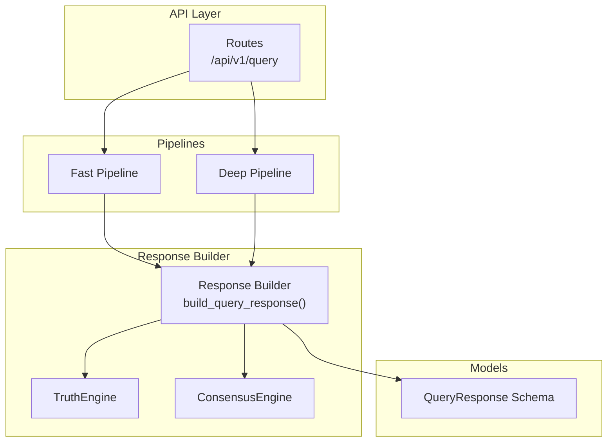
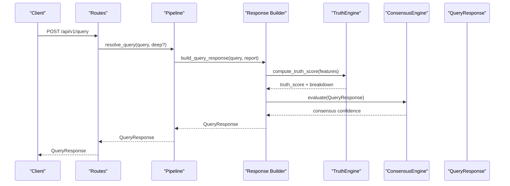
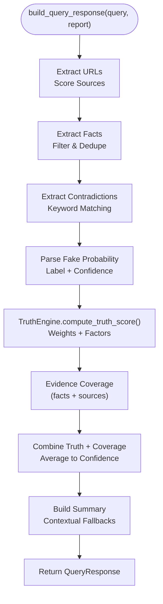
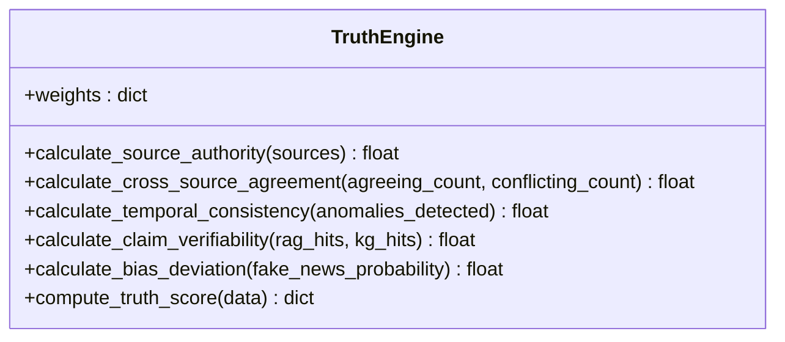
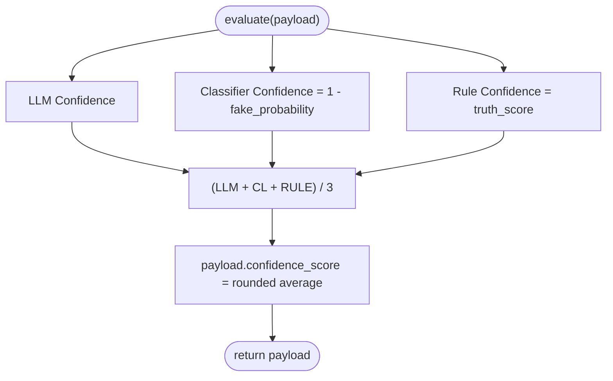
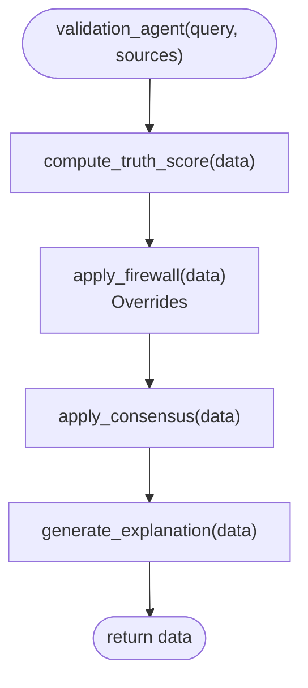
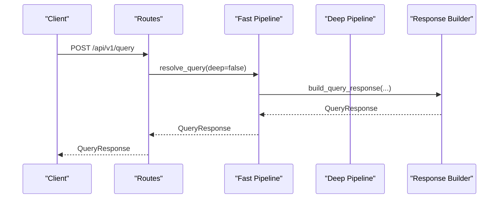
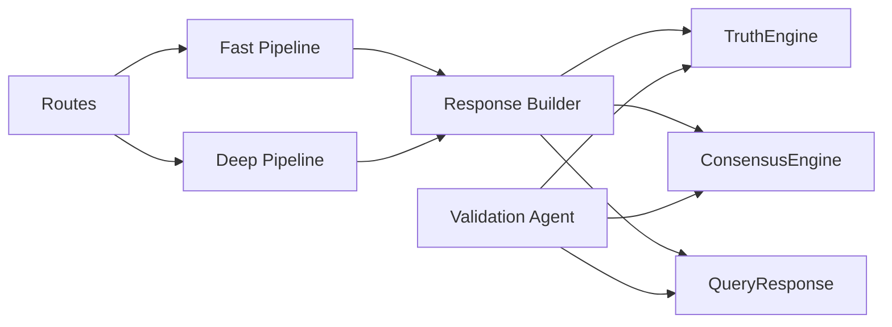

# Response Builder

<cite>
**Referenced Files in This Document**
- [response_builder.py](file://veritas-ai/pipelines/response_builder.py)
- [truth_engine.py](file://veritas-ai/core/truth_engine.py)
- [consensus_engine.py](file://veritas-ai/core/consensus_engine.py)
- [validation.py](file://veritas-ai/app/agents/validation.py)
- [schemas.py](file://veritas-ai/models/schemas.py)
- [routes.py](file://veritas-ai/app/api/routes.py)
- [fast_pipeline.py](file://veritas-ai/pipelines/fast_pipeline.py)
- [deep_pipeline.py](file://veritas-ai/pipelines/deep_pipeline.py)
- [test_response_builder.py](file://veritas-ai/tests/test_response_builder.py)
- [settings.py](file://veritas-ai/config/settings.py)
</cite>

## Table of Contents
1. [Introduction](#introduction)
2. [Project Structure](#project-structure)
3. [Core Components](#core-components)
4. [Architecture Overview](#architecture-overview)
5. [Detailed Component Analysis](#detailed-component-analysis)
6. [Dependency Analysis](#dependency-analysis)
7. [Performance Considerations](#performance-considerations)
8. [Troubleshooting Guide](#troubleshooting-guide)
9. [Conclusion](#conclusion)

## Introduction
This document describes the Response Builder pipeline stage that synthesizes verified information into coherent, trustworthy responses. It explains the truth verification workflow, consensus building across multiple sources, and response formatting strategies. It documents integrations with truth engines and consensus algorithms, including confidence scoring, evidence aggregation, and contradiction resolution. It also covers response templating, contextual adaptation, and output formatting options, along with configuration parameters for response quality thresholds, verbosity controls, and customization options for different response styles.

## Project Structure
The Response Builder sits at the intersection of data extraction, truth scoring, and response synthesis. It integrates with:
- Truth scoring via TruthEngine
- Consensus computation via ConsensusEngine
- Data models via Pydantic schemas
- API routing and pipelines via FastAPI routes and pipeline orchestrators

**Diagram sources**
- [routes.py:46-82](file://veritas-ai/app/api/routes.py#L46-L82)
- [fast_pipeline.py:8-22](file://veritas-ai/pipelines/fast_pipeline.py#L8-L22)
- [deep_pipeline.py:7-17](file://veritas-ai/pipelines/deep_pipeline.py#L7-L17)
- [response_builder.py:111-145](file://veritas-ai/pipelines/response_builder.py#L111-L145)
- [truth_engine.py:3-117](file://veritas-ai/core/truth_engine.py#L3-L117)
- [consensus_engine.py:3-26](file://veritas-ai/core/consensus_engine.py#L3-L26)
- [schemas.py:14-26](file://veritas-ai/models/schemas.py#L14-L26)

**Section sources**
- [routes.py:46-82](file://veritas-ai/app/api/routes.py#L46-L82)
- [fast_pipeline.py:8-22](file://veritas-ai/pipelines/fast_pipeline.py#L8-L22)
- [deep_pipeline.py:7-17](file://veritas-ai/pipelines/deep_pipeline.py#L7-L17)
- [response_builder.py:111-145](file://veritas-ai/pipelines/response_builder.py#L111-L145)
- [truth_engine.py:3-117](file://veritas-ai/core/truth_engine.py#L3-L117)
- [consensus_engine.py:3-26](file://veritas-ai/core/consensus_engine.py#L3-L26)
- [schemas.py:14-26](file://veritas-ai/models/schemas.py#L14-L26)

## Core Components
- Response Builder: Extracts facts, sources, contradictions, and fake probability from raw reports; computes truth and confidence scores; constructs a QueryResponse.
- TruthEngine: Computes a multi-factor truth score from source authority, cross-source agreement, temporal consistency, claim verifiability, and bias deviation.
- ConsensusEngine: Merges LLM confidence, classifier confidence derived from fake probability, and rule-based truth score into a unified confidence.
- QueryResponse Schema: Defines the canonical response structure, including summary, facts, sources, contradictions, fake probability, confidence score, truth score, status, explanation, and timestamp.

Key responsibilities:
- Evidence extraction and deduplication
- Source credibility scoring and filtering
- Fake news probability parsing
- Truth score computation and breakdown
- Confidence aggregation and normalization
- Summary generation and status assignment
- Structured output formatting

**Section sources**
- [response_builder.py:17-145](file://veritas-ai/pipelines/response_builder.py#L17-L145)
- [truth_engine.py:9-117](file://veritas-ai/core/truth_engine.py#L9-L117)
- [consensus_engine.py:8-26](file://veritas-ai/core/consensus_engine.py#L8-L26)
- [schemas.py:5-26](file://veritas-ai/models/schemas.py#L5-L26)

## Architecture Overview
The Response Builder participates in two primary pipelines:
- Fast Pipeline: Minimal retrieval and validation, designed for speed.
- Deep Pipeline: Full multi-agent pipeline execution.

Both converge on the Response Builder to synthesize a QueryResponse.

**Diagram sources**
- [routes.py:46-82](file://veritas-ai/app/api/routes.py#L46-L82)
- [fast_pipeline.py:8-22](file://veritas-ai/pipelines/fast_pipeline.py#L8-L22)
- [deep_pipeline.py:7-17](file://veritas-ai/pipelines/deep_pipeline.py#L7-L17)
- [response_builder.py:111-145](file://veritas-ai/pipelines/response_builder.py#L111-L145)
- [truth_engine.py:78-117](file://veritas-ai/core/truth_engine.py#L78-L117)
- [consensus_engine.py:8-26](file://veritas-ai/core/consensus_engine.py#L8-L26)
- [schemas.py:14-26](file://veritas-ai/models/schemas.py#L14-L26)

## Detailed Component Analysis

### Response Builder: Truth Verification and Response Synthesis
Responsibilities:
- Extract URLs, deduplicate, and score sources by type and credibility.
- Extract facts and contradictions from raw reports.
- Parse fake news probability from labeled outputs.
- Compute truth score via TruthEngine.
- Aggregate evidence coverage with truth score to produce confidence.
- Construct a QueryResponse with summary, facts, sources, contradictions, fake probability, confidence score, truth score, status, and timestamp.

Processing logic highlights:
- Source scoring uses domain heuristics (official, media, social, unknown) with predefined credibility scores.
- Fact extraction filters short or placeholder sentences and limits to a small number of representative statements.
- Contradiction detection uses keywords to identify conflicting statements.
- Fake probability parsing supports “fake/misleading” and “real/true” labels with confidence values.
- Truth score computation aggregates multiple factors with fixed weights.
- Confidence combines truth score and evidence coverage with averaging.
- Summary selection prioritizes verified evidence, contradictions, and fallbacks.

**Diagram sources**
- [response_builder.py:111-145](file://veritas-ai/pipelines/response_builder.py#L111-L145)
- [truth_engine.py:78-117](file://veritas-ai/core/truth_engine.py#L78-L117)

**Section sources**
- [response_builder.py:17-145](file://veritas-ai/pipelines/response_builder.py#L17-L145)

### TruthEngine: Multi-Factor Truth Scoring
Responsibilities:
- Compute source authority from domain characteristics.
- Compute cross-source agreement ratio.
- Apply temporal consistency penalty for anomalies.
- Compute claim verifiability from RAG/KG hits.
- Compute bias deviation from fake news probability.
- Combine weighted factors into a final truth score and breakdown.

Key behaviors:
- Domain-based authority mapping ensures official and reputable media receive higher scores.
- Agreement score normalizes by total contradicting sources.
- Temporal consistency penalizes “breaking,” “urgent,” or “unconfirmed” signals.
- Verifiability increases with more internal memory matches.
- Bias deviation inverses fake probability for truth scaling.
- Final score and breakdown logged for observability.

**Diagram sources**
- [truth_engine.py:3-117](file://veritas-ai/core/truth_engine.py#L3-L117)

**Section sources**
- [truth_engine.py:9-117](file://veritas-ai/core/truth_engine.py#L9-L117)

### ConsensusEngine: Unified Confidence Aggregation
Responsibilities:
- Merge three confidence streams:
  - LLM confidence (from QueryResponse)
  - Classifier confidence (derived from fake probability)
  - Rule-based confidence (truth score)
- Average the three to produce a deterministic consensus confidence mapped back to the QueryResponse.

**Diagram sources**
- [consensus_engine.py:8-26](file://veritas-ai/core/consensus_engine.py#L8-L26)

**Section sources**
- [consensus_engine.py:8-26](file://veritas-ai/core/consensus_engine.py#L8-L26)

### Validation Agent: Truth Scoring, Firewall, Consensus, Explainability
While not the Response Builder itself, the Validation Agent demonstrates the broader truth pipeline that informs response confidence and status:
- Truth scoring mirrors TruthEngine computations.
- Firewall applies deterministic overrides for contradictions, trusted source thresholds, and truth score thresholds.
- Consensus merges LLM, classifier, and rule-based confidences.
- Explainability generates human-readable rationales.

**Diagram sources**
- [validation.py:278-314](file://veritas-ai/app/agents/validation.py#L278-L314)

**Section sources**
- [validation.py:10-314](file://veritas-ai/app/agents/validation.py#L10-L314)

### Response Formatting and Templating
Response Builder constructs a QueryResponse with:
- summary: contextualized human-readable summary based on facts, sources, contradictions, and placeholders.
- facts: curated list of representative statements extracted from the report.
- sources: scored and filtered source list with type and credibility.
- contradictions: identified conflicting statements.
- fake_probability: parsed from labeled outputs.
- confidence_score: combined truth and evidence coverage.
- truth_score: final truth score from TruthEngine.
- status: initial value set to “uncertain”; may be overridden by downstream logic.
- timestamp: UTC ISO string.

Formatting strategies:
- Summary prioritization: verified evidence, contradictions, insufficient evidence, sparse evidence.
- Evidence coverage factor: balances sparsity of facts and breadth of sources.
- Confidence normalization: capped and rounded to three decimals.

**Section sources**
- [response_builder.py:100-145](file://veritas-ai/pipelines/response_builder.py#L100-L145)
- [schemas.py:14-26](file://veritas-ai/models/schemas.py#L14-L26)

### Integration with Pipelines and API
- API routes select either fast or deep pipeline based on request parameters and routing decisions.
- Fast Pipeline executes retrieval, validation, and response generation asynchronously.
- Deep Pipeline delegates to the multi-agent pipeline and returns results.
- Response Builder is invoked by both pipelines to produce a standardized QueryResponse.

**Diagram sources**
- [routes.py:46-82](file://veritas-ai/app/api/routes.py#L46-L82)
- [fast_pipeline.py:8-22](file://veritas-ai/pipelines/fast_pipeline.py#L8-L22)
- [response_builder.py:111-145](file://veritas-ai/pipelines/response_builder.py#L111-L145)

**Section sources**
- [routes.py:46-82](file://veritas-ai/app/api/routes.py#L46-L82)
- [fast_pipeline.py:8-22](file://veritas-ai/pipelines/fast_pipeline.py#L8-L22)
- [deep_pipeline.py:7-17](file://veritas-ai/pipelines/deep_pipeline.py#L7-L17)

## Dependency Analysis
- Response Builder depends on TruthEngine for truth scoring and on Pydantic models for output structure.
- ConsensusEngine depends on QueryResponse fields to compute a unified confidence.
- Validation Agent complements Response Builder by providing a broader truth pipeline with firewall and explainability.
- API routes orchestrate pipeline selection and caching.

**Diagram sources**
- [response_builder.py:111-145](file://veritas-ai/pipelines/response_builder.py#L111-L145)
- [truth_engine.py:78-117](file://veritas-ai/core/truth_engine.py#L78-L117)
- [consensus_engine.py:8-26](file://veritas-ai/core/consensus_engine.py#L8-L26)
- [validation.py:278-314](file://veritas-ai/app/agents/validation.py#L278-L314)
- [routes.py:46-82](file://veritas-ai/app/api/routes.py#L46-L82)

**Section sources**
- [response_builder.py:111-145](file://veritas-ai/pipelines/response_builder.py#L111-L145)
- [truth_engine.py:78-117](file://veritas-ai/core/truth_engine.py#L78-L117)
- [consensus_engine.py:8-26](file://veritas-ai/core/consensus_engine.py#L8-L26)
- [validation.py:278-314](file://veritas-ai/app/agents/validation.py#L278-L314)
- [routes.py:46-82](file://veritas-ai/app/api/routes.py#L46-L82)

## Performance Considerations
- Asynchronous pipelines minimize latency for fast-path queries.
- Evidence coverage factor caps contribution to prevent over-weighting sparse reports.
- Confidence aggregation averages three streams to reduce variance.
- Logging and observability are separated from hot-path computation to avoid blocking.

[No sources needed since this section provides general guidance]

## Troubleshooting Guide
Common issues and resolutions:
- Insufficient verified evidence: summaries indicate lack of verified sources or placeholder markers; adjust retrieval or validation steps.
- Placeholder or simulated sources: Response Builder filters example domains; ensure real sources are present.
- High fake probability: lowers classifier confidence; review NLP labeling and rerun validation.
- Contradictions detected: may influence status and explanation; investigate conflicting claims and KG/graph anomalies.
- Confidence score appears low: check truth score, evidence coverage, and fake probability contributions.

Validation references:
- Tests demonstrate extraction of credible sources and rejection of placeholder sources.
- Tests verify truth score range and fake probability parsing.

**Section sources**
- [test_response_builder.py:9-32](file://veritas-ai/tests/test_response_builder.py#L9-L32)
- [response_builder.py:17-145](file://veritas-ai/pipelines/response_builder.py#L17-L145)

## Conclusion
The Response Builder transforms raw verification reports into structured, trustworthy responses by extracting and validating evidence, computing truth and confidence scores, and applying consensus aggregation. Its integration with TruthEngine and ConsensusEngine ensures robust, multi-source reasoning. The QueryResponse schema provides a consistent output format suitable for downstream consumers, while API routes and pipelines orchestrate efficient execution across fast and deep modes.