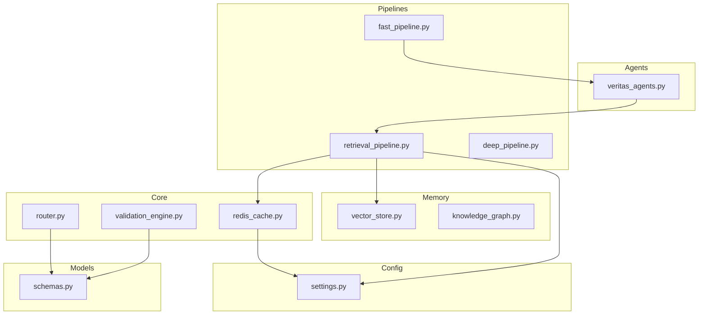
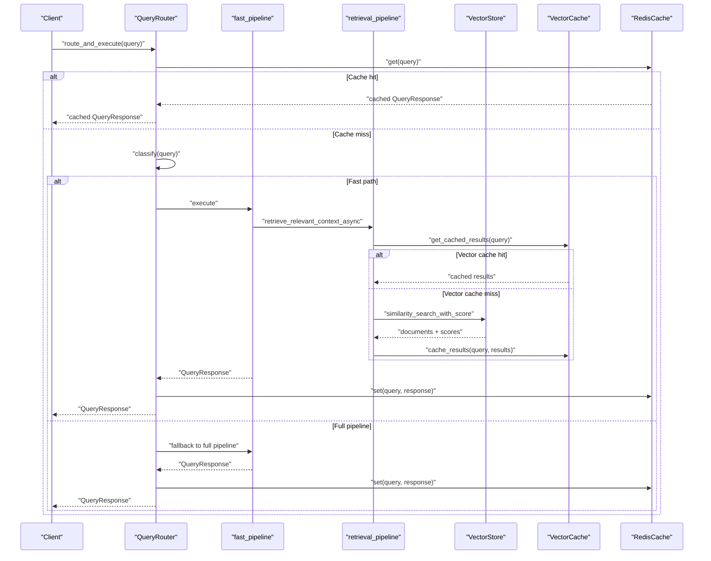
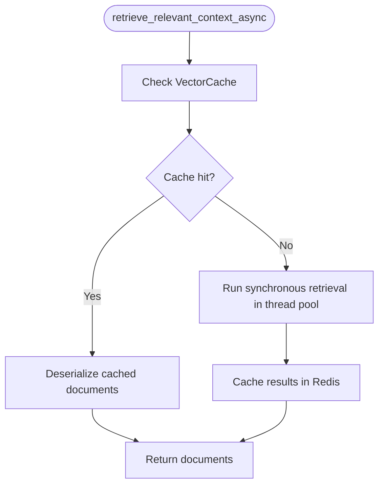
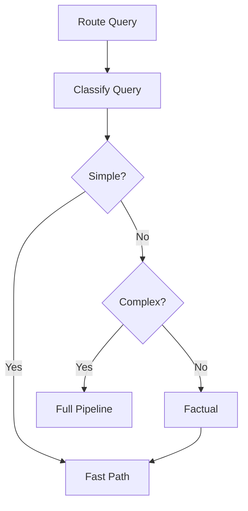
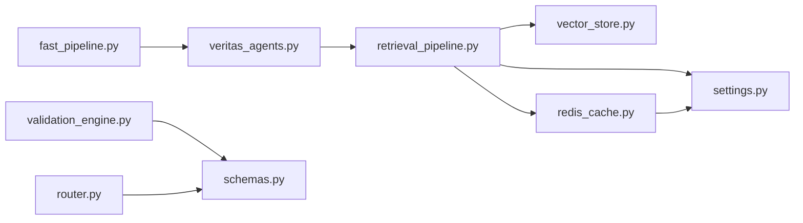

# Retrieval Pipeline

<cite>
**Referenced Files in This Document**
- [retrieval_pipeline.py](file://veritas-ai/pipelines/retrieval_pipeline.py)
- [vector_store.py](file://veritas-ai/memory/vector_store.py)
- [knowledge_graph.py](file://veritas-ai/memory/knowledge_graph.py)
- [settings.py](file://veritas-ai/config/settings.py)
- [redis_cache.py](file://veritas-ai/core/redis_cache.py)
- [schemas.py](file://veritas-ai/models/schemas.py)
- [router.py](file://veritas-ai/core/router.py)
- [fast_pipeline.py](file://veritas-ai/pipelines/fast_pipeline.py)
- [deep_pipeline.py](file://veritas-ai/pipelines/deep_pipeline.py)
- [veritas_agents.py](file://veritas-ai/agents/veritas_agents.py)
- [validation_engine.py](file://veritas-ai/core/validation_engine.py)
</cite>

## Table of Contents
1. [Introduction](#introduction)
2. [Project Structure](#project-structure)
3. [Core Components](#core-components)
4. [Architecture Overview](#architecture-overview)
5. [Detailed Component Analysis](#detailed-component-analysis)
6. [Dependency Analysis](#dependency-analysis)
7. [Performance Considerations](#performance-considerations)
8. [Troubleshooting Guide](#troubleshooting-guide)
9. [Conclusion](#conclusion)
10. [Appendices](#appendices)

## Introduction
This document describes the Retrieval Pipeline that orchestrates knowledge graph and vector store interactions. The current implementation focuses on a vector-only retrieval path with strong caching and async execution patterns. While the repository defines a knowledge graph module and a vector store module, the retrieval pipeline in this codebase primarily uses vector similarity search. The dual-retrieval strategy combining semantic similarity search with structured knowledge graph traversal is not implemented in the referenced files. This document therefore documents the available vector-based retrieval, its configuration, performance characteristics, and integration patterns with caching and routing.

## Project Structure
The retrieval pipeline spans several modules:
- Pipelines: orchestrate retrieval and validation
- Memory: vector store and knowledge graph integrations
- Core: caching, routing, and validation engines
- Config: runtime settings and environment variables
- Models: response schemas

**Diagram sources**
- [retrieval_pipeline.py:1-112](file://veritas-ai/pipelines/retrieval_pipeline.py#L1-L112)
- [vector_store.py:1-27](file://veritas-ai/memory/vector_store.py#L1-L27)
- [knowledge_graph.py:1-160](file://veritas-ai/memory/knowledge_graph.py#L1-L160)
- [redis_cache.py:1-232](file://veritas-ai/core/redis_cache.py#L1-L232)
- [router.py:1-182](file://veritas-ai/core/router.py#L1-L182)
- [settings.py:1-83](file://veritas-ai/config/settings.py#L1-L83)
- [schemas.py:1-88](file://veritas-ai/models/schemas.py#L1-L88)
- [veritas_agents.py:1-44](file://veritas-ai/agents/veritas_agents.py#L1-L44)
- [validation_engine.py:1-18](file://veritas-ai/core/validation_engine.py#L1-L18)

**Section sources**
- [retrieval_pipeline.py:1-112](file://veritas-ai/pipelines/retrieval_pipeline.py#L1-L112)
- [vector_store.py:1-27](file://veritas-ai/memory/vector_store.py#L1-L27)
- [redis_cache.py:1-232](file://veritas-ai/core/redis_cache.py#L1-L232)
- [settings.py:1-83](file://veritas-ai/config/settings.py#L1-L83)

## Core Components
- Vector retrieval functions:
  - Similarity search with optional score returns
  - Async retrieval with Redis-backed vector cache
  - Batch retrieval with exception handling
  - Filtering support via vector store retriever
- Vector store and embeddings:
  - Local Ollama embeddings
  - Persistent Chroma vector store
- Caching:
  - Redis-backed unified cache for query responses
  - Vector-specific cache for embedding results
- Routing:
  - Query classification and path selection
  - Fast path vs full pipeline routing
- Validation:
  - Truth engine integration for claim validation

Key responsibilities:
- Retrieve relevant context from the vector store
- Cache results for improved latency
- Integrate with downstream validation and response generation
- Support batch and filtered retrieval

**Section sources**
- [retrieval_pipeline.py:29-112](file://veritas-ai/pipelines/retrieval_pipeline.py#L29-L112)
- [vector_store.py:8-27](file://veritas-ai/memory/vector_store.py#L8-L27)
- [redis_cache.py:166-232](file://veritas-ai/core/redis_cache.py#L166-L232)
- [router.py:83-182](file://veritas-ai/core/router.py#L83-L182)
- [validation_engine.py:9-18](file://veritas-ai/core/validation_engine.py#L9-L18)

## Architecture Overview
The retrieval pipeline executes within a routing-driven workflow. Queries are classified, optionally served from cache, and routed to either a fast or full pipeline. The fast pipeline integrates retrieval with validation and response generation. The retrieval functions rely on a vector store initialized with local embeddings and are cached via Redis.

**Diagram sources**
- [router.py:99-182](file://veritas-ai/core/router.py#L99-L182)
- [fast_pipeline.py:8-22](file://veritas-ai/pipelines/fast_pipeline.py#L8-L22)
- [retrieval_pipeline.py:48-73](file://veritas-ai/pipelines/retrieval_pipeline.py#L48-L73)
- [redis_cache.py:166-232](file://veritas-ai/core/redis_cache.py#L166-L232)

## Detailed Component Analysis

### Vector Retrieval Functions
- retrieve_relevant_context: performs similarity search against the vector store
- retrieve_relevant_context_with_scores: returns documents with similarity scores
- retrieve_relevant_context_async: async wrapper with Redis-backed vector cache
- retrieve_with_filtering: supports metadata filtering during retrieval
- batch_retrieve: concurrently retrieves for multiple queries
- compute_query_hash: normalizes and hashes queries for cache keys

Processing logic highlights:
- Top-k defaults to settings.RETRIEVAL_K
- Async execution offloads blocking operations to threads
- Vector cache stores serialized documents per query hash
- Filtered retriever supports metadata-based narrowing

**Diagram sources**
- [retrieval_pipeline.py:48-73](file://veritas-ai/pipelines/retrieval_pipeline.py#L48-L73)
- [redis_cache.py:195-219](file://veritas-ai/core/redis_cache.py#L195-L219)

**Section sources**
- [retrieval_pipeline.py:29-112](file://veritas-ai/pipelines/retrieval_pipeline.py#L29-L112)

### Vector Store and Embeddings
- Embeddings: Ollama-based embeddings configured via settings
- Vector store: Chroma with persistent directory and collection name
- Initialization ensures persistence directory exists

Integration patterns:
- Embedding model and base URL are configurable
- Collection name and persist directory are configurable
- Embedding function is injected into the vector store

**Section sources**
- [vector_store.py:8-27](file://veritas-ai/memory/vector_store.py#L8-L27)
- [settings.py:50-54](file://veritas-ai/config/settings.py#L50-L54)

### Knowledge Graph Module
- AsyncKnowledgeGraph provides async Neo4j connectivity with connection pooling
- Supports merging entities and relationships with allowed label and relationship sets
- Provides relationship query for a given entity
- KnowledgeGraph offers a synchronous wrapper for compatibility

Note: The retrieval pipeline in the referenced files does not invoke the knowledge graph module. The KG module is present for potential future integration of structured knowledge graph traversal alongside vector retrieval.

**Section sources**
- [knowledge_graph.py:12-160](file://veritas-ai/memory/knowledge_graph.py#L12-L160)

### Caching Layers
- RedisCache: two-tier cache with local dictionary and Redis backend
- VectorCache: specialized cache for vector retrieval results keyed by normalized query hash
- UnifiedCache: alternative unified cache implementation with graceful Redis fallback

Key behaviors:
- Normalization of queries for consistent hashing
- TTL-based expiration for cached results
- Stats and metrics for cache hit rates and backend availability

**Section sources**
- [redis_cache.py:18-232](file://veritas-ai/core/redis_cache.py#L18-L232)

### Routing and Execution Orchestration
- QueryRouter classifies queries using regex patterns and trigger words
- RouteAndExecute selects fast path for simple queries and full pipeline otherwise
- Metrics track latency for each routing decision

**Diagram sources**
- [router.py:61-82](file://veritas-ai/core/router.py#L61-L82)
- [router.py:125-136](file://veritas-ai/core/router.py#L125-L136)

**Section sources**
- [router.py:83-182](file://veritas-ai/core/router.py#L83-L182)

### Validation Engine Integration
- ValidationEngine is invoked asynchronously via a thread pool to avoid blocking
- Returns a standardized structure consumed by response generation

**Section sources**
- [validation_engine.py:9-18](file://veritas-ai/core/validation_engine.py#L9-L18)

### Response Model
- QueryResponse encapsulates the final structured response with fields for summary, facts, sources, contradictions, probabilities, and confidence/truth scores

**Section sources**
- [schemas.py:14-26](file://veritas-ai/models/schemas.py#L14-L26)

## Dependency Analysis
The retrieval pipeline depends on:
- Vector store initialization and embeddings
- Redis-backed caches for both query responses and vector results
- Settings for runtime configuration (top-k, embedding model, persistence directory)
- Router for path selection and caching

**Diagram sources**
- [retrieval_pipeline.py:1-112](file://veritas-ai/pipelines/retrieval_pipeline.py#L1-L112)
- [vector_store.py:1-27](file://veritas-ai/memory/vector_store.py#L1-L27)
- [redis_cache.py:1-232](file://veritas-ai/core/redis_cache.py#L1-L232)
- [settings.py:1-83](file://veritas-ai/config/settings.py#L1-L83)
- [fast_pipeline.py:1-22](file://veritas-ai/pipelines/fast_pipeline.py#L1-L22)
- [veritas_agents.py:1-44](file://veritas-ai/agents/veritas_agents.py#L1-L44)
- [validation_engine.py:1-18](file://veritas-ai/core/validation_engine.py#L1-L18)
- [router.py:1-182](file://veritas-ai/core/router.py#L1-L182)
- [schemas.py:1-88](file://veritas-ai/models/schemas.py#L1-L88)

**Section sources**
- [retrieval_pipeline.py:1-112](file://veritas-ai/pipelines/retrieval_pipeline.py#L1-L112)
- [vector_store.py:1-27](file://veritas-ai/memory/vector_store.py#L1-L27)
- [redis_cache.py:1-232](file://veritas-ai/core/redis_cache.py#L1-L232)
- [settings.py:1-83](file://veritas-ai/config/settings.py#L1-L83)
- [router.py:1-182](file://veritas-ai/core/router.py#L1-L182)

## Performance Considerations
- Top-k tuning:
  - Adjust settings.RETRIEVAL_K to balance recall and latency
- Embedding model:
  - Configure EMBEDDING_MODEL and OLLAMA_BASE_URL for performance and accuracy trade-offs
- Persistence:
  - Ensure CHROMA_PERSIST_DIRECTORY is on fast storage for I/O-bound operations
- Caching:
  - VectorCache reduces repeated similarity searches for identical queries
  - RedisCache improves end-to-end latency for repeated queries
- Async execution:
  - Retrieval offloads to thread pools to prevent blocking the event loop
- Concurrency:
  - batch_retrieve leverages asyncio.gather for parallel retrieval across queries

[No sources needed since this section provides general guidance]

## Troubleshooting Guide
Common issues and diagnostics:
- Vector store initialization failures:
  - Verify embedding model and base URL in settings
  - Confirm persistence directory permissions
- Redis connectivity:
  - Check REDIS_HOST and REDIS_PORT
  - Inspect cache stats and fallback behavior
- Query routing:
  - Review classification patterns and trigger words
  - Validate cache hit rate and latency metrics
- Retrieval quality:
  - Increase top-k for broader recall
  - Use filtering to constrain results by metadata
  - Normalize queries to improve cache hit rates

**Section sources**
- [settings.py:50-68](file://veritas-ai/config/settings.py#L50-L68)
- [redis_cache.py:30-52](file://veritas-ai/core/redis_cache.py#L30-L52)
- [router.py:99-136](file://veritas-ai/core/router.py#L99-L136)

## Conclusion
The Retrieval Pipeline in this codebase centers on efficient vector similarity search with robust caching and async execution. While the repository includes a knowledge graph module, the current retrieval pipeline does not integrate structured graph traversal. The design emphasizes:
- Configurable vector embeddings and persistent storage
- Multi-tier caching for latency reduction
- Asynchronous execution patterns
- Clear separation between routing, retrieval, validation, and response generation

Future enhancements could include:
- Integrating knowledge graph traversal alongside vector retrieval
- Implementing confidence scoring and cross-modal fusion
- Extending result fusion algorithms for combined rankings

[No sources needed since this section summarizes without analyzing specific files]

## Appendices

### Configuration Options
- Runtime settings:
  - PIPELINE_TIMEOUT_SECONDS, AGENT_TASK_TIMEOUT_SECONDS
  - CACHE_TTL_SECONDS, CACHE_MAX_ENTRIES
  - OLLAMA_BASE_URL, MODEL_NAME, ROUTER_MODEL, FAST_MODEL
  - CHROMA_PERSIST_DIRECTORY, EMBEDDING_MODEL, RETRIEVAL_K
  - REDIS_HOST, REDIS_PORT, REDIS_DB
  - NEO4J_URI, NEO4J_USER, NEO4J_PASSWORD
  - MAX_PARALLEL_TOOLS, ENABLE_STREAMING, STREAM_CHUNK_SIZE

**Section sources**
- [settings.py:21-76](file://veritas-ai/config/settings.py#L21-L76)

### Retrieval Function Reference
- retrieve_relevant_context(query, top_k=None): returns Documents
- retrieve_relevant_context_with_scores(query, top_k=None): returns (Document, score) tuples
- retrieve_relevant_context_async(query, top_k=None, use_cache=True): async Documents
- retrieve_with_filtering(query, filter_metadata=None, top_k=None): Documents with filters
- batch_retrieve(queries, top_k=None): maps queries to lists of Documents
- compute_query_hash(query): normalized SHA-256 hash for caching

**Section sources**
- [retrieval_pipeline.py:29-112](file://veritas-ai/pipelines/retrieval_pipeline.py#L29-L112)