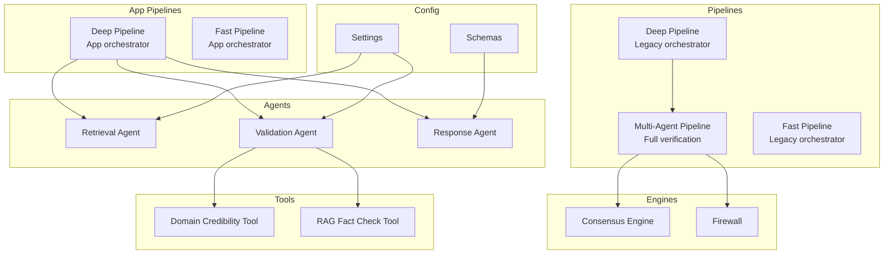
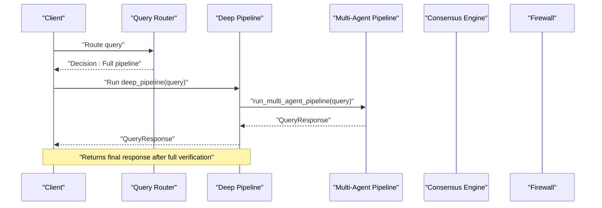
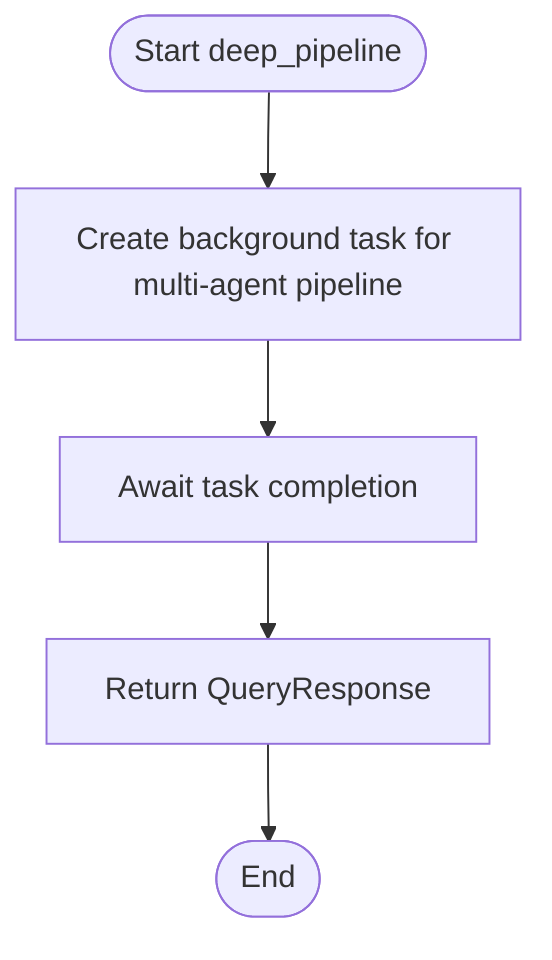
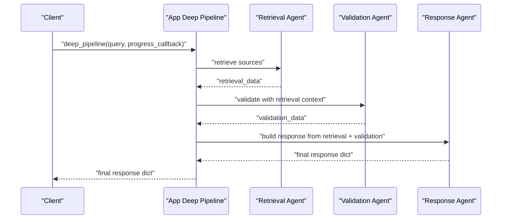
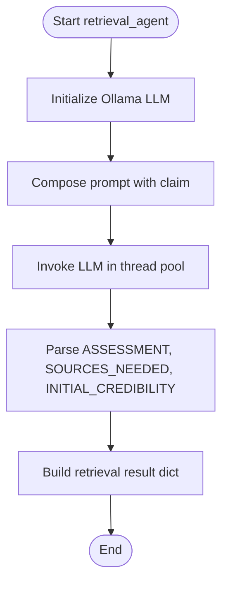
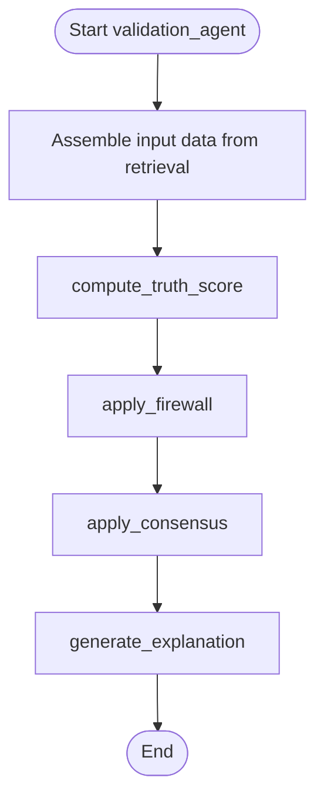
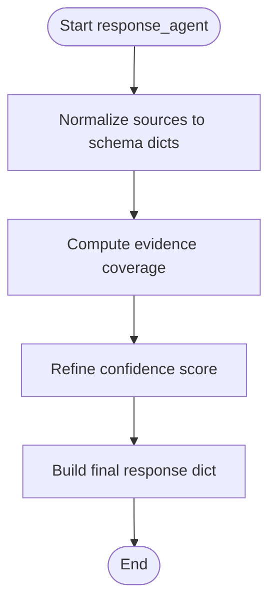
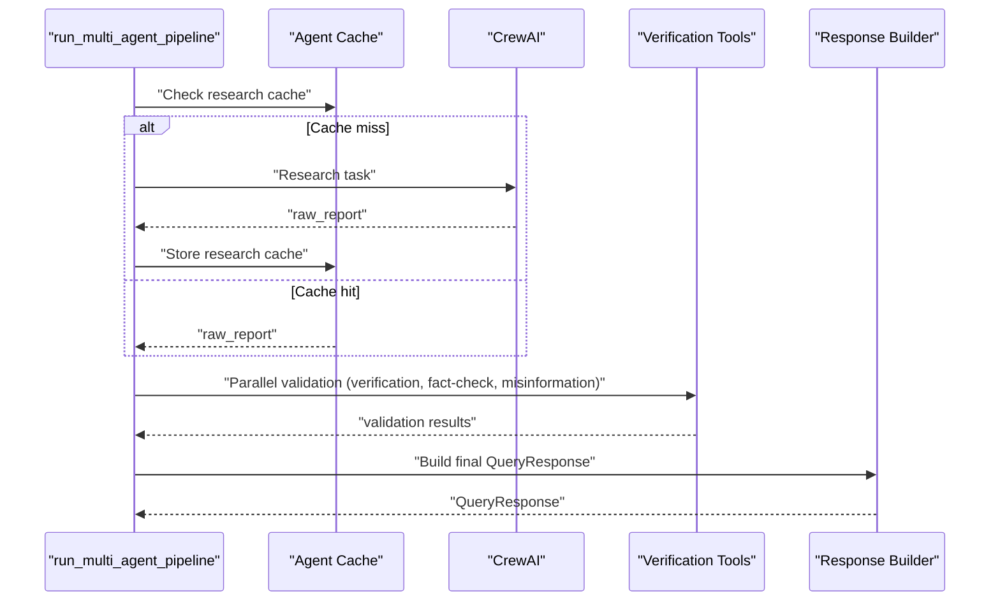
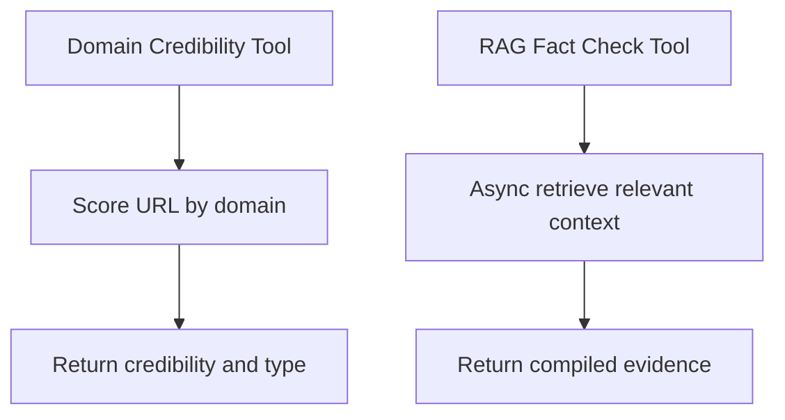
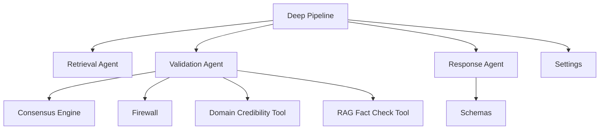

# Deep Pipeline

<cite>
**Referenced Files in This Document**
- [deep_pipeline.py](file://veritas-ai/pipelines/deep_pipeline.py)
- [multi_agent_pipeline.py](file://veritas-ai/pipelines/multi_agent_pipeline.py)
- [fast_pipeline.py](file://veritas-ai/pipelines/fast_pipeline.py)
- [app_deep_pipeline.py](file://veritas-ai/app/pipeline/deep_pipeline.py)
- [app_fast_pipeline.py](file://veritas-ai/app/pipeline/fast_pipeline.py)
- [retrieval_agent.py](file://veritas-ai/app/agents/retrieval.py)
- [validation_agent.py](file://veritas-ai/app/agents/validation.py)
- [response_agent.py](file://veritas-ai/app/agents/response.py)
- [schemas.py](file://veritas-ai/models/schemas.py)
- [settings.py](file://veritas-ai/config/settings.py)
- [router.py](file://veritas-ai/core/router.py)
- [consensus_engine.py](file://veritas-ai/core/consensus_engine.py)
- [firewall.py](file://veritas-ai/core/firewall.py)
- [verification_tools.py](file://veritas-ai/tools/verification_tools.py)
- [main.py](file://veritas-ai/main.py)
- [app_main.py](file://veritas-ai/app/main.py)
</cite>

## Table of Contents
1. [Introduction](#introduction)
2. [Project Structure](#project-structure)
3. [Core Components](#core-components)
4. [Architecture Overview](#architecture-overview)
5. [Detailed Component Analysis](#detailed-component-analysis)
6. [Dependency Analysis](#dependency-analysis)
7. [Performance Considerations](#performance-considerations)
8. [Troubleshooting Guide](#troubleshooting-guide)
9. [Conclusion](#conclusion)
10. [Appendices](#appendices)

## Introduction
This document describes the Deep Pipeline designed for comprehensive multi-pass verification with enhanced accuracy. Compared to the Fast Pipeline, the Deep Pipeline executes a thorough, layered workflow that includes extended source retrieval, multi-layered claim analysis, and extensive evidence evaluation. It emphasizes accuracy and robustness by integrating advanced validation algorithms, expanded source credibility scoring, and detailed response synthesis. The document explains the additional processing stages, accuracy improvements, computational overhead, and decision criteria for selecting the Deep Pipeline versus the Fast Pipeline, including configuration parameters and performance characteristics.

## Project Structure
The Deep Pipeline is implemented in two complementary forms within the repository:
- Legacy multi-agent orchestration pipeline that powers the Deep Pipeline’s comprehensive verification.
- New modular app-level pipeline that orchestrates retrieval, validation, and response building with progress callbacks.

Key modules:
- Pipelines: deep and fast pipeline orchestrators
- Agents: retrieval, validation, and response agents
- Engines: consensus and firewall for final response shaping
- Tools: verification utilities for domain credibility and RAG fact checking
- Configuration: runtime settings and environment controls
- Schemas: typed response model for standardized output

**Diagram sources**
- [deep_pipeline.py:1-17](file://veritas-ai/pipelines/deep_pipeline.py#L1-L17)
- [multi_agent_pipeline.py:209-287](file://veritas-ai/pipelines/multi_agent_pipeline.py#L209-L287)
- [fast_pipeline.py:1-22](file://veritas-ai/pipelines/fast_pipeline.py#L1-L22)
- [app_deep_pipeline.py:13-42](file://veritas-ai/app/pipeline/deep_pipeline.py#L13-L42)
- [app_fast_pipeline.py:13-48](file://veritas-ai/app/pipeline/fast_pipeline.py#L13-L48)
- [retrieval_agent.py:36-100](file://veritas-ai/app/agents/retrieval.py#L36-L100)
- [validation_agent.py:278-313](file://veritas-ai/app/agents/validation.py#L278-L313)
- [response_agent.py:32-72](file://veritas-ai/app/agents/response.py#L32-L72)
- [consensus_engine.py:8-25](file://veritas-ai/core/consensus_engine.py#L8-L25)
- [firewall.py:13-46](file://veritas-ai/core/firewall.py#L13-L46)
- [verification_tools.py:5-51](file://veritas-ai/tools/verification_tools.py#L5-L51)
- [settings.py:20-76](file://veritas-ai/config/settings.py#L20-L76)
- [schemas.py:14-25](file://veritas-ai/models/schemas.py#L14-L25)

**Section sources**
- [deep_pipeline.py:1-17](file://veritas-ai/pipelines/deep_pipeline.py#L1-L17)
- [app_deep_pipeline.py:13-42](file://veritas-ai/app/pipeline/deep_pipeline.py#L13-L42)
- [multi_agent_pipeline.py:209-287](file://veritas-ai/pipelines/multi_agent_pipeline.py#L209-L287)

## Core Components
- Deep Pipeline orchestrator: schedules the multi-agent verification pipeline and returns a final QueryResponse.
- App-level Deep Pipeline: phases retrieval, validation, and response building with progress callbacks.
- Retrieval Agent: identifies initial claim assessment, needed source types, and initial credibility.
- Validation Agent: computes truth score, applies firewall, consensus, and generates explanations.
- Response Agent: synthesizes a unified response dictionary from retrieval and validation outputs.
- Engines: Consensus Engine merges multiple confidence signals; Firewall enforces deterministic overrides.
- Tools: Domain Credibility and RAG Fact Check tools augment validation with external checks.
- Configuration: runtime parameters controlling timeouts, model selection, and parallelism.
- Schemas: strongly typed QueryResponse model for standardized output.

**Section sources**
- [multi_agent_pipeline.py:209-287](file://veritas-ai/pipelines/multi_agent_pipeline.py#L209-L287)
- [app_deep_pipeline.py:13-42](file://veritas-ai/app/pipeline/deep_pipeline.py#L13-L42)
- [retrieval_agent.py:36-100](file://veritas-ai/app/agents/retrieval.py#L36-L100)
- [validation_agent.py:278-313](file://veritas-ai/app/agents/validation.py#L278-L313)
- [response_agent.py:32-72](file://veritas-ai/app/agents/response.py#L32-L72)
- [consensus_engine.py:8-25](file://veritas-ai/core/consensus_engine.py#L8-L25)
- [firewall.py:13-46](file://veritas-ai/core/firewall.py#L13-L46)
- [verification_tools.py:5-51](file://veritas-ai/tools/verification_tools.py#L5-L51)
- [settings.py:20-76](file://veritas-ai/config/settings.py#L20-L76)
- [schemas.py:14-25](file://veritas-ai/models/schemas.py#L14-L25)

## Architecture Overview
The Deep Pipeline extends the Fast Pipeline by replacing single-pass or parallel-fast processing with a multi-stage, multi-agent verification workflow. It emphasizes accuracy through:
- Extended source retrieval informed by an initial claim assessment
- Multi-layered validation across verification, fact-checking, and misinformation analysis
- Consolidation via consensus and firewall to produce a robust final response

**Diagram sources**
- [router.py:99-136](file://veritas-ai/core/router.py#L99-L136)
- [deep_pipeline.py:7-16](file://veritas-ai/pipelines/deep_pipeline.py#L7-L16)
- [multi_agent_pipeline.py:209-287](file://veritas-ai/pipelines/multi_agent_pipeline.py#L209-L287)

## Detailed Component Analysis

### Deep Pipeline Orchestration
The Deep Pipeline delegates to the multi-agent pipeline and awaits completion. It ensures the heavy verification workload runs asynchronously without unnecessary blocking, returning a final QueryResponse when complete.

**Diagram sources**
- [deep_pipeline.py:7-16](file://veritas-ai/pipelines/deep_pipeline.py#L7-L16)

**Section sources**
- [deep_pipeline.py:7-16](file://veritas-ai/pipelines/deep_pipeline.py#L7-L16)

### App-Level Deep Pipeline
The app-level Deep Pipeline coordinates three phases:
- Retrieval: collects sources and initial assessment
- Validation: computes truth score, applies firewall, consensus, and explanation
- Response: synthesizes a unified response dictionary

**Diagram sources**
- [app_deep_pipeline.py:13-42](file://veritas-ai/app/pipeline/deep_pipeline.py#L13-L42)
- [retrieval_agent.py:36-100](file://veritas-ai/app/agents/retrieval.py#L36-L100)
- [validation_agent.py:278-313](file://veritas-ai/app/agents/validation.py#L278-L313)
- [response_agent.py:32-72](file://veritas-ai/app/agents/response.py#L32-L72)

**Section sources**
- [app_deep_pipeline.py:13-42](file://veritas-ai/app/pipeline/deep_pipeline.py#L13-L42)

### Retrieval Agent
The Retrieval Agent:
- Uses an LLM to assess the claim, identify needed source types, and estimate initial credibility
- Returns structured data including assessment, sources needed, and an initial authority score
- Includes fallback behavior on failure

**Diagram sources**
- [retrieval_agent.py:36-100](file://veritas-ai/app/agents/retrieval.py#L36-L100)

**Section sources**
- [retrieval_agent.py:36-100](file://veritas-ai/app/agents/retrieval.py#L36-L100)

### Validation Agent
The Validation Agent:
- Computes a truth score using weighted metrics derived from sources, cross-source agreement, temporal consistency, verifiability, and bias deviation
- Applies Firewall overrides to clamp status deterministically
- Merges confidence via Consensus Engine
- Generates human-readable explanations

**Diagram sources**
- [validation_agent.py:278-313](file://veritas-ai/app/agents/validation.py#L278-L313)
- [consensus_engine.py:8-25](file://veritas-ai/core/consensus_engine.py#L8-L25)
- [firewall.py:13-46](file://veritas-ai/core/firewall.py#L13-L46)

**Section sources**
- [validation_agent.py:92-126](file://veritas-ai/app/agents/validation.py#L92-L126)
- [validation_agent.py:161-198](file://veritas-ai/app/agents/validation.py#L161-L198)
- [validation_agent.py:203-212](file://veritas-ai/app/agents/validation.py#L203-L212)
- [validation_agent.py:217-273](file://veritas-ai/app/agents/validation.py#L217-L273)
- [validation_agent.py:278-313](file://veritas-ai/app/agents/validation.py#L278-L313)

### Response Agent
The Response Agent:
- Builds a human-readable summary based on retrieval and validation outputs
- Normalizes sources into schema-compatible dictionaries
- Computes refined confidence considering evidence coverage
- Produces a final response dictionary with explanation and metadata

**Diagram sources**
- [response_agent.py:32-72](file://veritas-ai/app/agents/response.py#L32-L72)

**Section sources**
- [response_agent.py:9-30](file://veritas-ai/app/agents/response.py#L9-L30)
- [response_agent.py:52-72](file://veritas-ai/app/agents/response.py#L52-L72)

### Multi-Agent Pipeline (Full Verification)
The multi-agent pipeline integrates:
- Research phase with caching and tool-based evidence gathering
- Parallel validation across verification, fact-checking, and misinformation analysis
- Final response building with consensus, explainability, firewall, and alerts

**Diagram sources**
- [multi_agent_pipeline.py:236-287](file://veritas-ai/pipelines/multi_agent_pipeline.py#L236-L287)
- [multi_agent_pipeline.py:146-206](file://veritas-ai/pipelines/multi_agent_pipeline.py#L146-L206)
- [multi_agent_pipeline.py:300-332](file://veritas-ai/pipelines/multi_agent_pipeline.py#L300-L332)

**Section sources**
- [multi_agent_pipeline.py:209-287](file://veritas-ai/pipelines/multi_agent_pipeline.py#L209-L287)
- [multi_agent_pipeline.py:146-206](file://veritas-ai/pipelines/multi_agent_pipeline.py#L146-L206)
- [multi_agent_pipeline.py:300-332](file://veritas-ai/pipelines/multi_agent_pipeline.py#L300-L332)

### Tools: Verification Utilities
- Domain Credibility Tool: Heuristic-based source credibility scoring and categorization
- RAG Fact Check Tool: Asynchronous retrieval of relevant context from vector DB

**Diagram sources**
- [verification_tools.py:5-51](file://veritas-ai/tools/verification_tools.py#L5-L51)

**Section sources**
- [verification_tools.py:5-33](file://veritas-ai/tools/verification_tools.py#L5-L33)
- [verification_tools.py:35-51](file://veritas-ai/tools/verification_tools.py#L35-L51)

## Dependency Analysis
The Deep Pipeline depends on:
- Retrieval Agent for initial claim assessment and source types
- Validation Agent for truth scoring, firewall, consensus, and explanations
- Response Agent for synthesis and schema compliance
- Engines for deterministic finalization
- Tools for external verification
- Configuration for runtime behavior and model selection
- Schemas for standardized output

**Diagram sources**
- [app_deep_pipeline.py:13-42](file://veritas-ai/app/pipeline/deep_pipeline.py#L13-L42)
- [retrieval_agent.py:36-100](file://veritas-ai/app/agents/retrieval.py#L36-L100)
- [validation_agent.py:278-313](file://veritas-ai/app/agents/validation.py#L278-L313)
- [response_agent.py:32-72](file://veritas-ai/app/agents/response.py#L32-L72)
- [consensus_engine.py:8-25](file://veritas-ai/core/consensus_engine.py#L8-L25)
- [firewall.py:13-46](file://veritas-ai/core/firewall.py#L13-L46)
- [verification_tools.py:5-51](file://veritas-ai/tools/verification_tools.py#L5-L51)
- [settings.py:20-76](file://veritas-ai/config/settings.py#L20-L76)
- [schemas.py:14-25](file://veritas-ai/models/schemas.py#L14-L25)

**Section sources**
- [app_deep_pipeline.py:13-42](file://veritas-ai/app/pipeline/deep_pipeline.py#L13-L42)
- [validation_agent.py:278-313](file://veritas-ai/app/agents/validation.py#L278-L313)
- [response_agent.py:32-72](file://veritas-ai/app/agents/response.py#L32-L72)
- [consensus_engine.py:8-25](file://veritas-ai/core/consensus_engine.py#L8-L25)
- [firewall.py:13-46](file://veritas-ai/core/firewall.py#L13-L46)
- [verification_tools.py:5-51](file://veritas-ai/tools/verification_tools.py#L5-L51)
- [settings.py:20-76](file://veritas-ai/config/settings.py#L20-L76)
- [schemas.py:14-25](file://veritas-ai/models/schemas.py#L14-L25)

## Performance Considerations
- Deep Pipeline characteristics:
  - Thorough multi-agent verification increases latency compared to the Fast Pipeline
  - Uses caching for research and agent outputs to reduce repeated work
  - Integrates CPU-intensive scoring in thread pools to avoid blocking
  - Progress callbacks enable streaming UX updates during long-running phases
- Fast Pipeline characteristics:
  - Parallel retrieval and validation minimize latency
  - Single LLM call with lightweight model targets sub-two-second response
- Configuration parameters affecting performance:
  - PIPELINE_TIMEOUT_SECONDS: global request timeout
  - AGENT_TASK_TIMEOUT_SECONDS: per-agent task timeout
  - MAX_PARALLEL_TOOLS: concurrency cap for parallel validations
  - OLLAMA_BASE_URL, MODEL_NAME, FAST_MODEL: model selection impacting latency
  - ENABLE_STREAMING, STREAM_CHUNK_SIZE: streaming behavior
- Decision criteria:
  - Use Deep Pipeline for complex, high-stakes claims requiring robust verification
  - Use Fast Pipeline for simple, routine queries prioritizing speed

[No sources needed since this section provides general guidance]

## Troubleshooting Guide
Common issues and remedies:
- Retrieval Agent failures:
  - Symptom: fallback retrieval result with reduced completeness
  - Action: verify Ollama availability and model configuration; check logs for warnings
- Validation Agent exceptions:
  - Symptom: missing or partial validation fields
  - Action: inspect truth score computation and firewall overrides; ensure sufficient sources
- Response Agent normalization:
  - Symptom: schema mismatch in sources
  - Action: ensure retrieval agent returns structured source dicts; normalize on response build
- Global timeouts:
  - Symptom: 504 timeout errors
  - Action: increase PIPELINE_TIMEOUT_SECONDS; optimize tool calls and parallelism
- Rate limiting:
  - Symptom: 429 responses
  - Action: adjust rate limiter settings or client-side retry with backoff

**Section sources**
- [retrieval_agent.py:90-100](file://veritas-ai/app/agents/retrieval.py#L90-L100)
- [validation_agent.py:304-313](file://veritas-ai/app/agents/validation.py#L304-L313)
- [response_agent.py:40-50](file://veritas-ai/app/agents/response.py#L40-L50)
- [app_main.py:126-148](file://veritas-ai/app/main.py#L126-L148)
- [settings.py:20-28](file://veritas-ai/config/settings.py#L20-L28)

## Conclusion
The Deep Pipeline delivers enhanced accuracy through a comprehensive, multi-stage verification workflow. While it incurs higher computational overhead than the Fast Pipeline, it is well-suited for complex claims where robustness and explainability are paramount. Configuration parameters allow tuning for performance and reliability, while progress callbacks and structured schemas support a responsive, transparent user experience.

[No sources needed since this section summarizes without analyzing specific files]

## Appendices

### Configuration Parameters
- PIPELINE_TIMEOUT_SECONDS: global request timeout
- AGENT_TASK_TIMEOUT_SECONDS: per-agent task timeout
- CACHE_TTL_SECONDS, CACHE_MAX_ENTRIES: cache behavior
- OLLAMA_BASE_URL, MODEL_NAME, FAST_MODEL: model selection
- MAX_PARALLEL_TOOLS: concurrency for parallel validations
- ENABLE_STREAMING, STREAM_CHUNK_SIZE: streaming behavior
- REDIS_HOST, REDIS_PORT, REDIS_DB: cache backend configuration

**Section sources**
- [settings.py:20-76](file://veritas-ai/config/settings.py#L20-L76)

### Data Model: QueryResponse
Fields include query, summary, facts, sources, contradictions, fake_probability, confidence_score, truth_score, status, explanation, and timestamp.

**Section sources**
- [schemas.py:14-25](file://veritas-ai/models/schemas.py#L14-L25)

### Routing and Pipeline Selection
- Query Router classifies queries and selects either Fast Path or Full Pipeline
- Route_and_execute integrates routing with pipeline execution and caching

**Section sources**
- [router.py:51-81](file://veritas-ai/core/router.py#L51-L81)
- [router.py:99-136](file://veritas-ai/core/router.py#L99-L136)
- [router.py:153-180](file://veritas-ai/core/router.py#L153-L180)