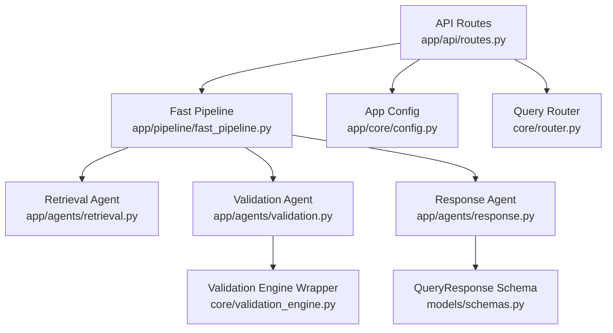
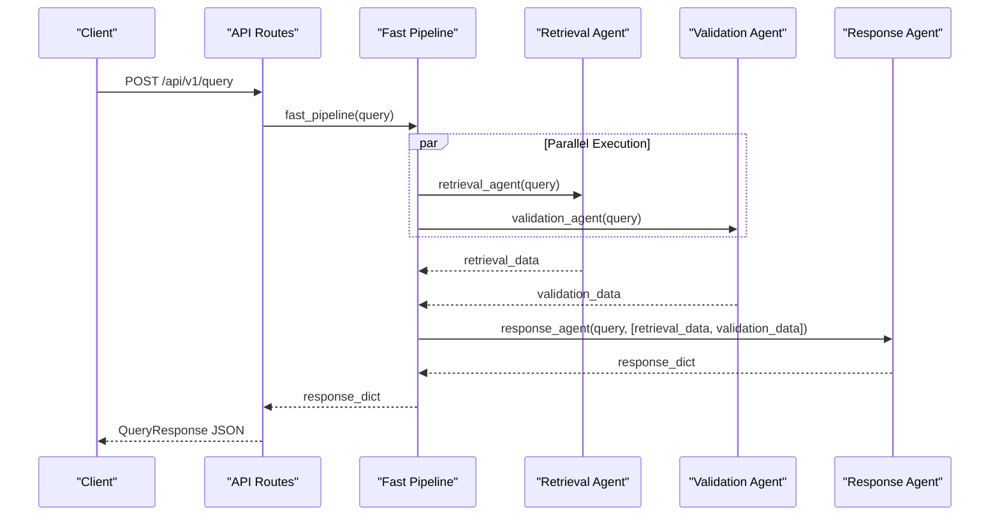
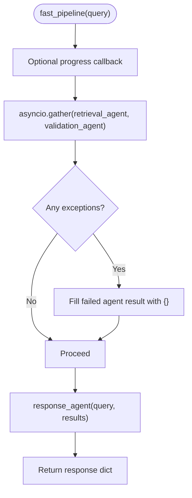
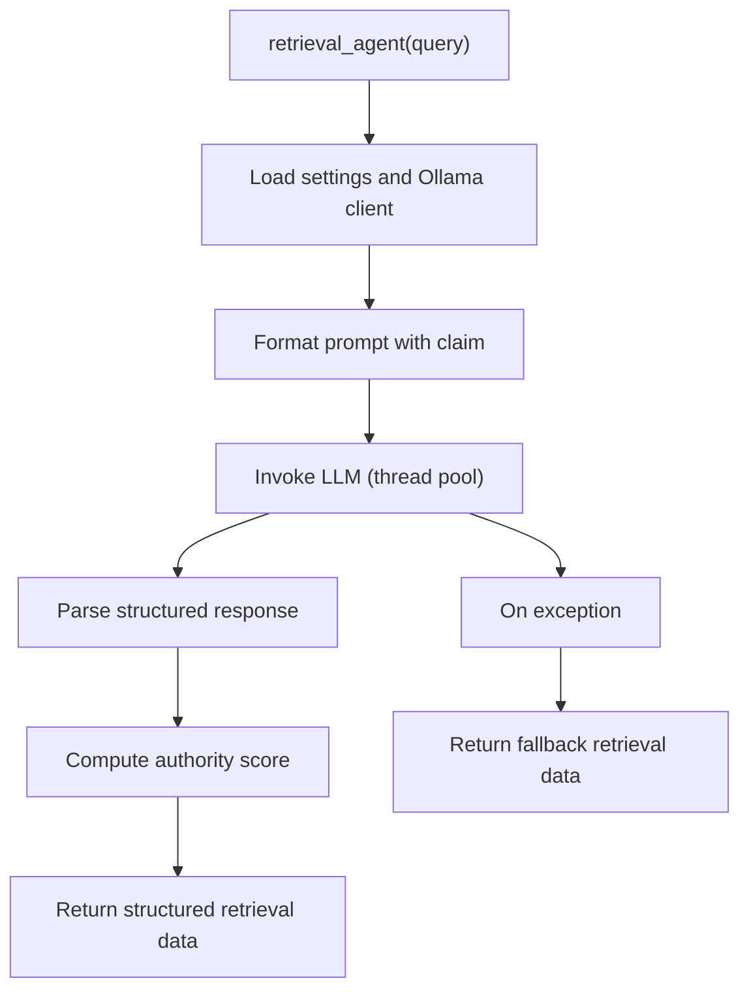
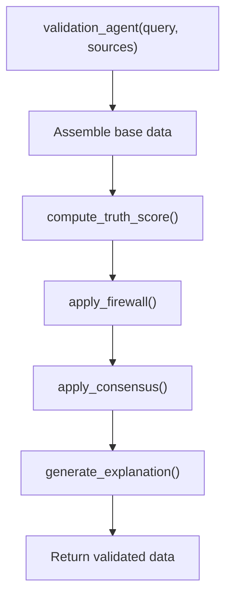
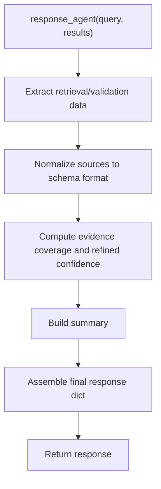
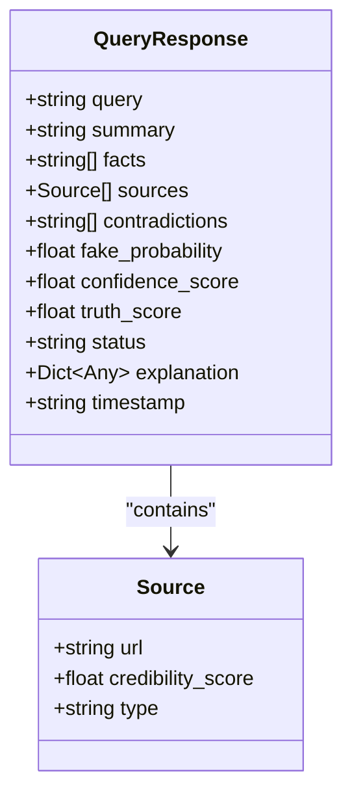
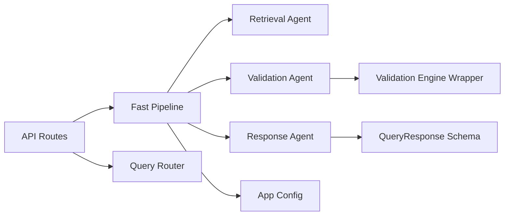

# Fast Pipeline

<cite>
**Referenced Files in This Document**
- [fast_pipeline.py](file://veritas-ai/app/pipeline/fast_pipeline.py)
- [retrieval.py](file://veritas-ai/app/agents/retrieval.py)
- [validation.py](file://veritas-ai/app/agents/validation.py)
- [response.py](file://veritas-ai/app/agents/response.py)
- [schemas.py](file://veritas-ai/models/schemas.py)
- [validation_engine.py](file://veritas-ai/core/validation_engine.py)
- [config.py](file://veritas-ai/app/core/config.py)
- [routes.py](file://veritas-ai/app/api/routes.py)
- [main.py](file://veritas-ai/app/main.py)
- [router.py](file://veritas-ai/core/router.py)
</cite>

## Table of Contents
1. [Introduction](#introduction)
2. [Project Structure](#project-structure)
3. [Core Components](#core-components)
4. [Architecture Overview](#architecture-overview)
5. [Detailed Component Analysis](#detailed-component-analysis)
6. [Dependency Analysis](#dependency-analysis)
7. [Performance Considerations](#performance-considerations)
8. [Troubleshooting Guide](#troubleshooting-guide)
9. [Conclusion](#conclusion)
10. [Appendices](#appendices)

## Introduction
The Fast Pipeline is an optimized processing workflow designed to deliver sub-2-second response times for queries. It retrieves up to a small number of sources, performs streamlined validation through a focused scoring and firewall logic, and produces a concise QueryResponse. The pipeline prioritizes speed by minimizing computational overhead, using lightweight models, and parallelizing independent steps.

Key goals:
- Minimal retrieval and validation to meet strict latency targets
- Parallel execution of retrieval and validation
- Deterministic, rule-based overrides for safety
- Efficient response construction and schema compliance

## Project Structure
The Fast Pipeline lives in the application layer and integrates with agents and configuration. It is invoked by API routes and optionally routed by the Query Router.

**Diagram sources**
- [routes.py:46-81](file://veritas-ai/app/api/routes.py#L46-L81)
- [fast_pipeline.py:13-48](file://veritas-ai/app/pipeline/fast_pipeline.py#L13-L48)
- [retrieval.py:36-101](file://veritas-ai/app/agents/retrieval.py#L36-L101)
- [validation.py:278-314](file://veritas-ai/app/agents/validation.py#L278-L314)
- [response.py:32-73](file://veritas-ai/app/agents/response.py#L32-L73)
- [validation_engine.py:9-17](file://veritas-ai/core/validation_engine.py#L9-L17)
- [schemas.py:14-26](file://veritas-ai/models/schemas.py#L14-L26)
- [config.py:44-49](file://veritas-ai/app/core/config.py#L44-L49)
- [router.py:99-136](file://veritas-ai/core/router.py#L99-L136)

**Section sources**
- [fast_pipeline.py:13-48](file://veritas-ai/app/pipeline/fast_pipeline.py#L13-L48)
- [routes.py:46-81](file://veritas-ai/app/api/routes.py#L46-L81)
- [router.py:99-136](file://veritas-ai/core/router.py#L99-L136)

## Core Components
- Fast Pipeline orchestrator: runs retrieval and validation in parallel, aggregates results, and constructs a final response dictionary.
- Retrieval Agent: identifies initial assessment, source types needed, and initial credibility using a lightweight model.
- Validation Agent: computes truth score, applies firewall overrides, consensus fusion, and explanation generation.
- Response Agent: normalizes sources, computes confidence, and builds a QueryResponse-compatible dictionary.
- Validation Engine Wrapper: executes CPU-intensive truth scoring in a thread pool to remain responsive.
- QueryResponse Schema: defines the canonical response structure with fields for summary, facts, sources, contradictions, probabilities, scores, status, explanation, and timestamp.
- Configuration: sets model names and runtime parameters used by agents.

**Section sources**
- [fast_pipeline.py:13-48](file://veritas-ai/app/pipeline/fast_pipeline.py#L13-L48)
- [retrieval.py:36-101](file://veritas-ai/app/agents/retrieval.py#L36-L101)
- [validation.py:278-314](file://veritas-ai/app/agents/validation.py#L278-L314)
- [response.py:32-73](file://veritas-ai/app/agents/response.py#L32-L73)
- [validation_engine.py:9-17](file://veritas-ai/core/validation_engine.py#L9-L17)
- [schemas.py:14-26](file://veritas-ai/models/schemas.py#L14-L26)
- [config.py:44-49](file://veritas-ai/app/core/config.py#L44-L49)

## Architecture Overview
The Fast Pipeline follows a parallel, two-stage design:
- Stage 1: retrieval and validation run concurrently
- Stage 2: response synthesis and normalization

**Diagram sources**
- [routes.py:100-111](file://veritas-ai/app/api/routes.py#L100-L111)
- [fast_pipeline.py:24-43](file://veritas-ai/app/pipeline/fast_pipeline.py#L24-L43)
- [retrieval.py:36-101](file://veritas-ai/app/agents/retrieval.py#L36-L101)
- [validation.py:278-314](file://veritas-ai/app/agents/validation.py#L278-L314)
- [response.py:32-73](file://veritas-ai/app/agents/response.py#L32-L73)

## Detailed Component Analysis

### Fast Pipeline Orchestration
- Parallelism: Uses asynchronous gathering to run retrieval and validation concurrently.
- Error resilience: Treats agent exceptions as empty results to keep the pipeline moving.
- Progress reporting: Optional callback supports UI updates during processing and generation.
- Output: Returns a dictionary compatible with QueryResponse.

**Diagram sources**
- [fast_pipeline.py:13-48](file://veritas-ai/app/pipeline/fast_pipeline.py#L13-L48)

**Section sources**
- [fast_pipeline.py:13-48](file://veritas-ai/app/pipeline/fast_pipeline.py#L13-L48)

### Retrieval Agent
- Purpose: Produces an initial assessment, identifies source categories needed, and estimates initial credibility.
- Model: Uses a lightweight model selected via configuration for rapid inference.
- Robustness: Falls back gracefully with a neutral assessment and credibility when LLM calls fail.
- Output: Dictionary containing query, assessment, sources needed, initial credibility, and flags indicating retrieval completeness.

**Diagram sources**
- [retrieval.py:36-101](file://veritas-ai/app/agents/retrieval.py#L36-L101)
- [config.py:44-49](file://veritas-ai/app/core/config.py#L44-L49)

**Section sources**
- [retrieval.py:36-101](file://veritas-ai/app/agents/retrieval.py#L36-L101)
- [config.py:44-49](file://veritas-ai/app/core/config.py#L44-L49)

### Validation Agent
- Truth scoring: Computes a weighted score across source authority, cross-source agreement, temporal consistency, claim verifiability, and bias deviation.
- Firewall overrides: Enforces deterministic rules to clamp status based on contradictions, trusted source thresholds, and truth score.
- Consensus fusion: Merges LLM confidence, classifier-derived confidence, and rule-based truth score.
- Explanation generation: Builds human-readable rationales with “why_true/why_false” and a confidence breakdown.
- Threading: Runs CPU-heavy computations in a thread pool to avoid blocking the event loop.

**Diagram sources**
- [validation.py:278-314](file://veritas-ai/app/agents/validation.py#L278-L314)
- [validation_engine.py:9-17](file://veritas-ai/core/validation_engine.py#L9-L17)

**Section sources**
- [validation.py:92-126](file://veritas-ai/app/agents/validation.py#L92-L126)
- [validation.py:161-198](file://veritas-ai/app/agents/validation.py#L161-L198)
- [validation.py:203-212](file://veritas-ai/app/agents/validation.py#L203-L212)
- [validation.py:217-273](file://veritas-ai/app/agents/validation.py#L217-L273)
- [validation_engine.py:9-17](file://veritas-ai/core/validation_engine.py#L9-L17)

### Response Agent
- Normalizes sources: Converts raw source strings into schema-compatible entries when needed.
- Confidence refinement: Adjusts confidence based on evidence coverage derived from facts and sources.
- Summary generation: Chooses a concise, human-readable summary based on validation outcomes and retrieval data.
- Final composition: Assembles a dictionary aligned with QueryResponse fields.

**Diagram sources**
- [response.py:32-73](file://veritas-ai/app/agents/response.py#L32-L73)

**Section sources**
- [response.py:9-30](file://veritas-ai/app/agents/response.py#L9-L30)
- [response.py:32-73](file://veritas-ai/app/agents/response.py#L32-L73)

### QueryResponse Model
The canonical response structure includes:
- query: Original query string
- summary: Human-readable conclusion
- facts: Supporting facts
- sources: List of Source entries with URL, credibility score, and type
- contradictions: Detected contradictory statements
- fake_probability: Probability estimate of being fake
- confidence_score: Confidence in the conclusion
- truth_score: Computed truth score
- status: One of verified, likely_false, uncertain
- explanation: Structured rationale
- timestamp: ISO-format UTC timestamp

**Diagram sources**
- [schemas.py:14-26](file://veritas-ai/models/schemas.py#L14-L26)
- [schemas.py:5-9](file://veritas-ai/models/schemas.py#L5-L9)

**Section sources**
- [schemas.py:14-26](file://veritas-ai/models/schemas.py#L14-L26)
- [schemas.py:5-9](file://veritas-ai/models/schemas.py#L5-L9)

### Configuration Options
- Ollama base URL and model selection for fast inference
- Retrieval K value for vector search
- Parallel tool limits and streaming preferences
- Global timeouts and cache settings

Typical keys used by the Fast Pipeline:
- OLLAMA_BASE_URL
- FAST_MODEL
- MODEL_NAME
- RETRIEVAL_K
- MAX_PARALLEL_TOOLS
- ENABLE_STREAMING

**Section sources**
- [config.py:44-49](file://veritas-ai/app/core/config.py#L44-L49)
- [config.py:50-54](file://veritas-ai/app/core/config.py#L50-L54)
- [config.py:72-76](file://veritas-ai/app/core/config.py#L72-L76)

## Dependency Analysis
The Fast Pipeline depends on:
- Agents for retrieval, validation, and response synthesis
- Configuration for model and runtime parameters
- Schemas for response modeling
- Router for query classification and routing decisions

**Diagram sources**
- [fast_pipeline.py:13-48](file://veritas-ai/app/pipeline/fast_pipeline.py#L13-L48)
- [retrieval.py:36-101](file://veritas-ai/app/agents/retrieval.py#L36-L101)
- [validation.py:278-314](file://veritas-ai/app/agents/validation.py#L278-L314)
- [response.py:32-73](file://veritas-ai/app/agents/response.py#L32-L73)
- [validation_engine.py:9-17](file://veritas-ai/core/validation_engine.py#L9-L17)
- [schemas.py:14-26](file://veritas-ai/models/schemas.py#L14-L26)
- [config.py:44-49](file://veritas-ai/app/core/config.py#L44-L49)
- [routes.py:46-81](file://veritas-ai/app/api/routes.py#L46-L81)
- [router.py:99-136](file://veritas-ai/core/router.py#L99-L136)

**Section sources**
- [routes.py:46-81](file://veritas-ai/app/api/routes.py#L46-L81)
- [router.py:99-136](file://veritas-ai/core/router.py#L99-L136)

## Performance Considerations
- Parallel execution: Retrieval and validation run concurrently to reduce wall-clock time.
- Lightweight models: FAST_MODEL and RETRIEVAL_K tuned for speed.
- Thread pool offloading: CPU-bound truth scoring executed outside the event loop.
- Minimal data shaping: Simplified validation logic avoids heavy graph or KG traversals.
- Graceful fallbacks: On agent failures, the pipeline continues with neutral defaults.
- Caching: Responses are cached to serve subsequent identical queries instantly.
- Global timeouts: Request-level timeout middleware prevents long-hanging requests.

Practical tips:
- Prefer the Fast Pipeline for straightforward factual queries and when sub-2-second latency is required.
- Use the deep pipeline variant for complex, nuanced claims needing broader verification.
- Monitor cache hit rates and adjust TTL/cache sizes for your workload.

**Section sources**
- [fast_pipeline.py:24-43](file://veritas-ai/app/pipeline/fast_pipeline.py#L24-L43)
- [validation_engine.py:15-17](file://veritas-ai/core/validation_engine.py#L15-L17)
- [config.py:31-36](file://veritas-ai/app/core/config.py#L31-L36)
- [main.py:127-148](file://veritas-ai/app/main.py#L127-L148)

## Troubleshooting Guide
Common issues and resolutions:
- Slow responses: Verify that retrieval and validation agents are not blocked by external services. Confirm model availability and network connectivity.
- Empty or neutral summaries: Indicates retrieval fallback or insufficient sources; check the assessment and credibility fields.
- Validation errors: Exceptions in validation are handled gracefully; inspect logs for warnings and retry if needed.
- API timeouts: Global timeout middleware returns a 504; increase PIPELINE_TIMEOUT_SECONDS if necessary.
- Unexpected status overrides: Firewall logic may override status based on contradictions and trusted source counts.

Operational checks:
- Confirm OLLAMA_BASE_URL and FAST_MODEL are set appropriately.
- Ensure cache initialization completes during startup.
- Review progress callbacks for insight into stage timing.

**Section sources**
- [fast_pipeline.py:30-37](file://veritas-ai/app/pipeline/fast_pipeline.py#L30-L37)
- [main.py:127-148](file://veritas-ai/app/main.py#L127-L148)
- [config.py:31-36](file://veritas-ai/app/core/config.py#L31-L36)

## Conclusion
The Fast Pipeline achieves sub-2-second response times by combining parallel execution, lightweight models, and streamlined validation. It is ideal for simple factual queries and environments where speed is paramount. For complex claims requiring deeper verification, the deep pipeline remains available through the router and API.

## Appendices

### Usage Examples
- Direct API call (no auth required):
  - Endpoint: POST /api/v1/query
  - Body: {"query": "Your claim here", "deep": false}
  - Response: QueryResponse JSON

- WebSocket streaming:
  - Use /api/v1/stream-analysis to obtain an authorized WebSocket URL
  - Connect and receive progress events while the Fast Pipeline executes

- Preferred scenarios:
  - Quick fact-checks
  - Real-time dashboards
  - Mobile apps with strict latency budgets
  - Batch verification of straightforward claims

**Section sources**
- [routes.py:100-111](file://veritas-ai/app/api/routes.py#L100-L111)
- [routes.py:131-144](file://veritas-ai/app/api/routes.py#L131-L144)