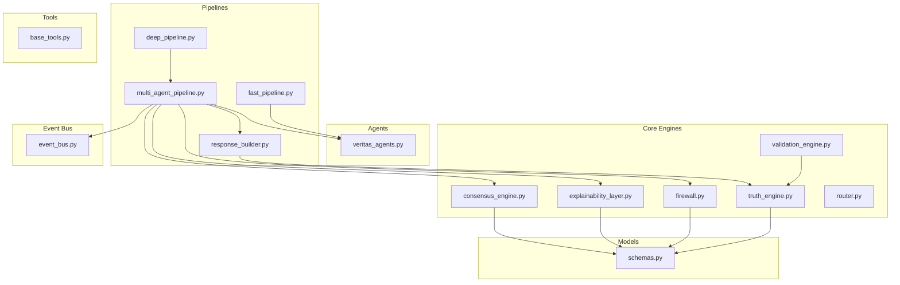
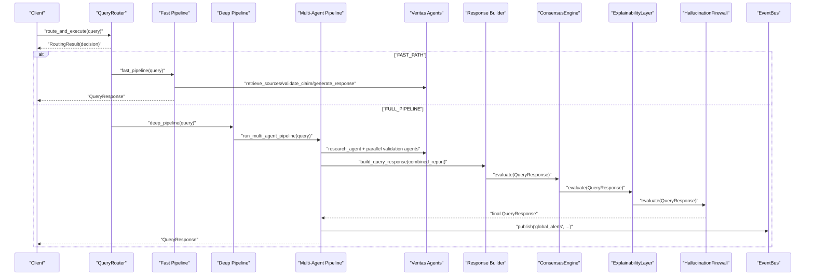
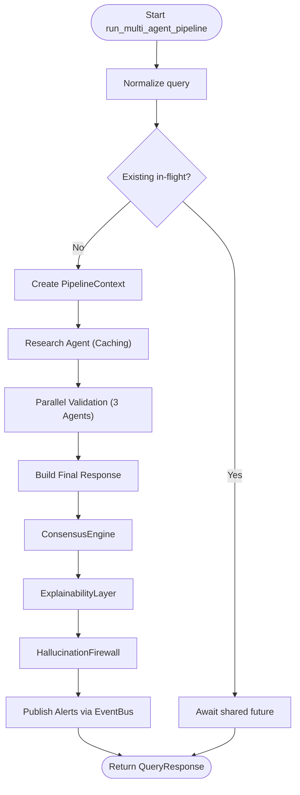
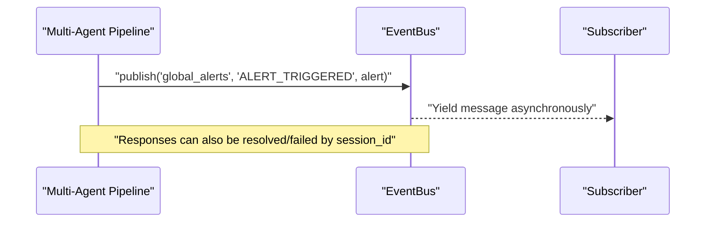
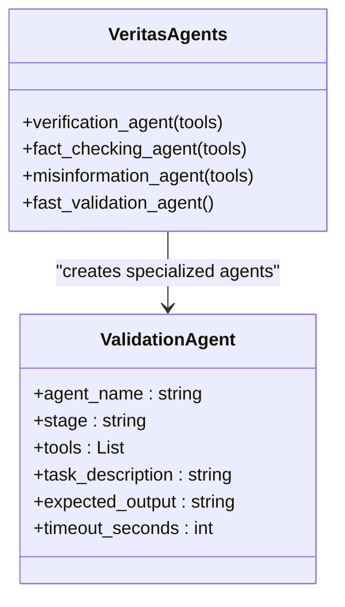
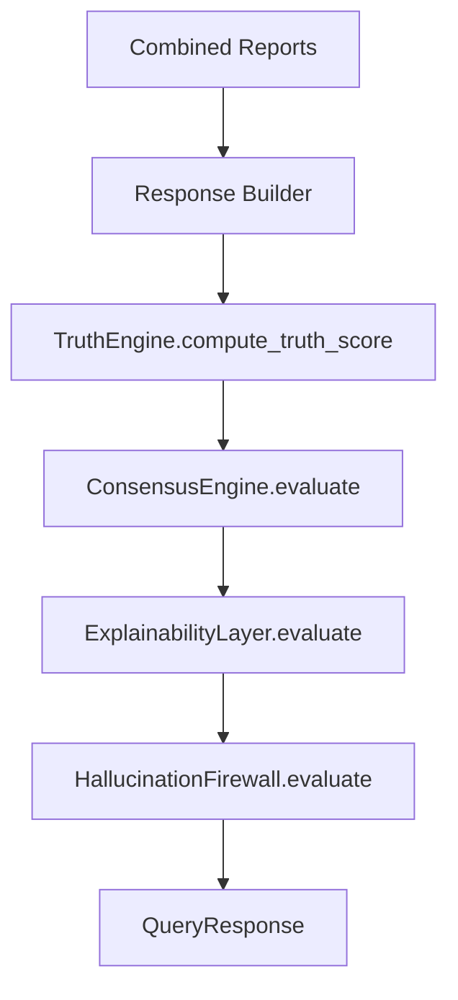
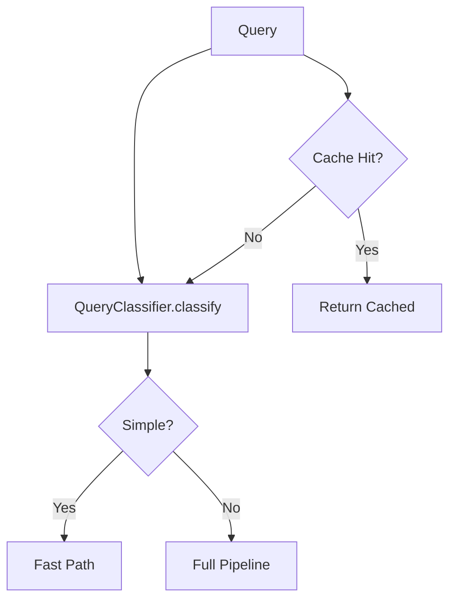
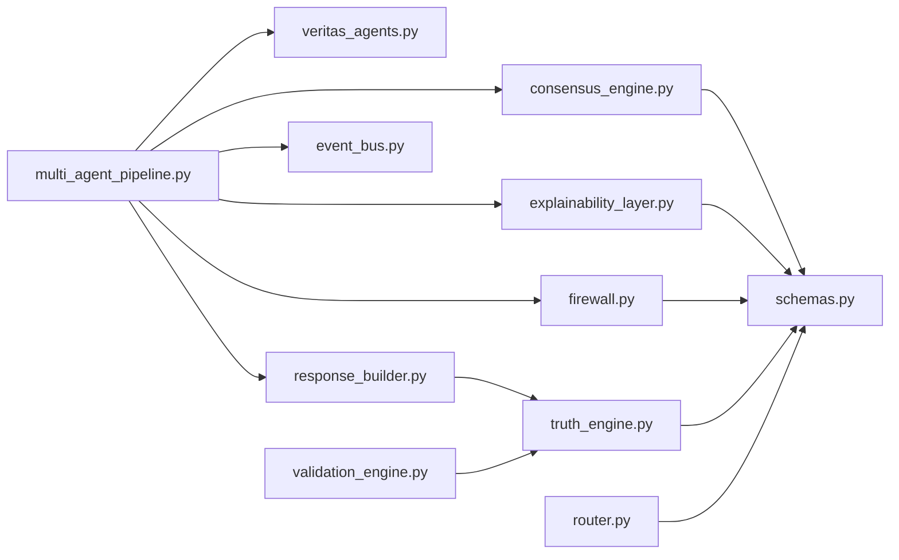

# Multi-Agent Pipeline

<cite>
**Referenced Files in This Document**
- [multi_agent_pipeline.py](file://veritas-ai/pipelines/multi_agent_pipeline.py)
- [event_bus.py](file://veritas-ai/pipelines/event_bus.py)
- [fast_pipeline.py](file://veritas-ai/pipelines/fast_pipeline.py)
- [deep_pipeline.py](file://veritas-ai/pipelines/deep_pipeline.py)
- [router.py](file://veritas-ai/core/router.py)
- [veritas_agents.py](file://veritas-ai/agents/veritas_agents.py)
- [consensus_engine.py](file://veritas-ai/core/consensus_engine.py)
- [explainability_layer.py](file://veritas-ai/core/explainability_layer.py)
- [firewall.py](file://veritas-ai/core/firewall.py)
- [schemas.py](file://veritas-ai/models/schemas.py)
- [response_builder.py](file://veritas-ai/pipelines/response_builder.py)
- [validation_engine.py](file://veritas-ai/core/validation_engine.py)
- [truth_engine.py](file://veritas-ai/core/truth_engine.py)
- [base_tools.py](file://veritas-ai/tools/base_tools.py)
</cite>

## Table of Contents
1. [Introduction](#introduction)
2. [Project Structure](#project-structure)
3. [Core Components](#core-components)
4. [Architecture Overview](#architecture-overview)
5. [Detailed Component Analysis](#detailed-component-analysis)
6. [Dependency Analysis](#dependency-analysis)
7. [Performance Considerations](#performance-considerations)
8. [Troubleshooting Guide](#troubleshooting-guide)
9. [Conclusion](#conclusion)
10. [Appendices](#appendices)

## Introduction
This document explains the Multi-Agent Pipeline that coordinates collaborative agent workflows for complex verification tasks. The system orchestrates distributed processing across specialized agents to verify claims, leveraging parallel execution, shared state, and event-driven coordination. It covers agent specialization, inter-agent communication protocols, shared state management, collaborative decision-making, and scaling strategies for robust, low-latency verification workflows.

## Project Structure
The Multi-Agent Pipeline spans several modules:
- Pipelines: orchestration and execution paths
- Agents: lightweight async utilities for retrieval, validation, and response generation
- Engines: truth computation, consensus, explainability, and safety firewall
- Tools: pluggable capabilities for data collection and verification
- Models: typed data contracts for requests and responses
- Event Bus: asynchronous messaging for alerts and decoupled consumers

**Diagram sources**
- [multi_agent_pipeline.py](file://veritas-ai/pipelines/multi_agent_pipeline.py)
- [fast_pipeline.py](file://veritas-ai/pipelines/fast_pipeline.py)
- [deep_pipeline.py](file://veritas-ai/pipelines/deep_pipeline.py)
- [response_builder.py](file://veritas-ai/pipelines/response_builder.py)
- [veritas_agents.py](file://veritas-ai/agents/veritas_agents.py)
- [consensus_engine.py](file://veritas-ai/core/consensus_engine.py)
- [explainability_layer.py](file://veritas-ai/core/explainability_layer.py)
- [firewall.py](file://veritas-ai/core/firewall.py)
- [truth_engine.py](file://veritas-ai/core/truth_engine.py)
- [validation_engine.py](file://veritas-ai/core/validation_engine.py)
- [router.py](file://veritas-ai/core/router.py)
- [schemas.py](file://veritas-ai/models/schemas.py)
- [base_tools.py](file://veritas-ai/tools/base_tools.py)
- [event_bus.py](file://veritas-ai/pipelines/event_bus.py)

**Section sources**
- [multi_agent_pipeline.py](file://veritas-ai/pipelines/multi_agent_pipeline.py)
- [router.py](file://veritas-ai/core/router.py)
- [schemas.py](file://veritas-ai/models/schemas.py)

## Core Components
- Multi-Agent Pipeline: orchestrates research, parallel validation, and response building with caching, timeouts, and deduplication.
- Event Bus: asynchronous message broker enabling decoupled alert publishing and consumer lifecycle management.
- Router: query classification and routing to fast or full pipelines with local and Redis caching.
- Engines: TruthEngine computes multi-factor truth scores; ConsensusEngine merges heterogeneous signals; ExplainabilityLayer translates results into human-readable explanations; Firewall enforces safety rules.
- Response Builder: extracts facts, sources, contradictions, and fake probability from agent reports and constructs QueryResponse.
- Agents Utilities: lightweight async helpers for retrieval, validation, and response generation.

**Section sources**
- [multi_agent_pipeline.py](file://veritas-ai/pipelines/multi_agent_pipeline.py)
- [event_bus.py](file://veritas-ai/pipelines/event_bus.py)
- [router.py](file://veritas-ai/core/router.py)
- [consensus_engine.py](file://veritas-ai/core/consensus_engine.py)
- [explainability_layer.py](file://veritas-ai/core/explainability_layer.py)
- [firewall.py](file://veritas-ai/core/firewall.py)
- [response_builder.py](file://veritas-ai/pipelines/response_builder.py)
- [truth_engine.py](file://veritas-ai/core/truth_engine.py)
- [validation_engine.py](file://veritas-ai/core/validation_engine.py)
- [veritas_agents.py](file://veritas-ai/agents/veritas_agents.py)
- [schemas.py](file://veritas-ai/models/schemas.py)

## Architecture Overview
The system implements a phased, event-driven pipeline:
- Query routing determines whether to use a fast path or the full multi-agent pipeline.
- The multi-agent pipeline performs research, parallel validation across three specializations, and final response construction.
- Engines apply consensus, explainability, and safety rules to produce a final, auditable response.
- Alerts are published via the event bus to decoupled consumers.

**Diagram sources**
- [router.py](file://veritas-ai/core/router.py)
- [fast_pipeline.py](file://veritas-ai/pipelines/fast_pipeline.py)
- [deep_pipeline.py](file://veritas-ai/pipelines/deep_pipeline.py)
- [multi_agent_pipeline.py](file://veritas-ai/pipelines/multi_agent_pipeline.py)
- [veritas_agents.py](file://veritas-ai/agents/veritas_agents.py)
- [response_builder.py](file://veritas-ai/pipelines/response_builder.py)
- [consensus_engine.py](file://veritas-ai/core/consensus_engine.py)
- [explainability_layer.py](file://veritas-ai/core/explainability_layer.py)
- [firewall.py](file://veritas-ai/core/firewall.py)
- [event_bus.py](file://veritas-ai/pipelines/event_bus.py)

## Detailed Component Analysis

### Multi-Agent Pipeline Orchestration
The pipeline coordinates:
- Deduplication of in-flight queries
- Research phase with caching
- Parallel validation across three specialized agents
- Final response building and engine evaluation
- Progress callbacks and error handling with a fallback response

Key mechanisms:
- Shared context carries session metadata and progress callbacks.
- Async semaphore controls parallel tool usage.
- Redis-based caching reduces repeated work.
- CrewAI tasks encapsulate agent roles and tool usage.

**Diagram sources**
- [multi_agent_pipeline.py](file://veritas-ai/pipelines/multi_agent_pipeline.py)
- [event_bus.py](file://veritas-ai/pipelines/event_bus.py)

**Section sources**
- [multi_agent_pipeline.py](file://veritas-ai/pipelines/multi_agent_pipeline.py)

### Event-Driven Coordination via EventBus
The EventBus provides:
- Topic-based routing to subscribers
- Asynchronous queues per subscriber
- Response resolution/failure handling by session ID
- Graceful shutdown canceling in-flight futures

Usage:
- Publishing alerts to a “global_alerts” topic
- Subscribers iterate messages asynchronously

**Diagram sources**
- [multi_agent_pipeline.py](file://veritas-ai/pipelines/multi_agent_pipeline.py)
- [event_bus.py](file://veritas-ai/pipelines/event_bus.py)

**Section sources**
- [event_bus.py](file://veritas-ai/pipelines/event_bus.py)

### Agent Specialization Patterns and Workload Distribution
Specialized agents operate in parallel:
- Verification Agent: evaluates source credibility and evidence integrity
- Fact Checker: cross-validates claims against multiple sources
- Misinformation Analyzer: detects manipulation and risk indicators

Workload distribution:
- asyncio.gather executes agents concurrently
- Per-agent caching avoids redundant computations
- Semaphore limits concurrent tool usage

**Diagram sources**
- [multi_agent_pipeline.py](file://veritas-ai/pipelines/multi_agent_pipeline.py)

**Section sources**
- [multi_agent_pipeline.py](file://veritas-ai/pipelines/multi_agent_pipeline.py)

### Shared State Management and Caching
Shared state:
- PipelineContext holds session_id, query, raw_report, and partial results
- Progress callbacks enable external reporting

Caching:
- Agent outputs and research results cached with TTL
- Local and Redis cache layers reduce latency and load

Concurrency:
- Semaphore ensures controlled parallelism for tool usage
- In-flight query deduplication prevents duplicate work

**Section sources**
- [multi_agent_pipeline.py](file://veritas-ai/pipelines/multi_agent_pipeline.py)

### Collaborative Decision-Making and Response Construction
The pipeline composes results from multiple agents and applies:
- Response Builder: extracts facts, sources, contradictions, and fake probability
- TruthEngine: computes multi-factor truth score with weighted components
- ConsensusEngine: merges LLM, classifier, and rule-based signals
- ExplainabilityLayer: generates human-readable explanations
- HallucinationFirewall: enforces safety thresholds and status assignment

**Diagram sources**
- [response_builder.py](file://veritas-ai/pipelines/response_builder.py)
- [truth_engine.py](file://veritas-ai/core/truth_engine.py)
- [consensus_engine.py](file://veritas-ai/core/consensus_engine.py)
- [explainability_layer.py](file://veritas-ai/core/explainability_layer.py)
- [firewall.py](file://veritas-ai/core/firewall.py)
- [schemas.py](file://veritas-ai/models/schemas.py)

**Section sources**
- [response_builder.py](file://veritas-ai/pipelines/response_builder.py)
- [truth_engine.py](file://veritas-ai/core/truth_engine.py)
- [consensus_engine.py](file://veritas-ai/core/consensus_engine.py)
- [explainability_layer.py](file://veritas-ai/core/explainability_layer.py)
- [firewall.py](file://veritas-ai/core/firewall.py)
- [schemas.py](file://veritas-ai/models/schemas.py)

### Query Routing and Path Selection
The router classifies queries and selects the optimal path:
- QueryClassifier uses regex heuristics and trigger words
- TTLCache and Redis cache accelerate repeated queries
- route_and_execute integrates fast and full pipelines with metrics and background caching

**Diagram sources**
- [router.py](file://veritas-ai/core/router.py)

**Section sources**
- [router.py](file://veritas-ai/core/router.py)

### Tools and Agent Utilities
- Tools provide pluggable capabilities for data collection and verification.
- Agent utilities offer lightweight async wrappers for retrieval, validation, and response generation.

**Section sources**
- [base_tools.py](file://veritas-ai/tools/base_tools.py)
- [veritas_agents.py](file://veritas-ai/agents/veritas_agents.py)

## Dependency Analysis
Inter-module dependencies:
- Pipelines depend on agents, engines, tools, and models
- Engines depend on models and internal logic
- Router depends on caches and models
- Response Builder depends on TruthEngine and models
- EventBus is consumed by the pipeline for alerting

**Diagram sources**
- [multi_agent_pipeline.py](file://veritas-ai/pipelines/multi_agent_pipeline.py)
- [veritas_agents.py](file://veritas-ai/agents/veritas_agents.py)
- [response_builder.py](file://veritas-ai/pipelines/response_builder.py)
- [consensus_engine.py](file://veritas-ai/core/consensus_engine.py)
- [explainability_layer.py](file://veritas-ai/core/explainability_layer.py)
- [firewall.py](file://veritas-ai/core/firewall.py)
- [event_bus.py](file://veritas-ai/pipelines/event_bus.py)
- [truth_engine.py](file://veritas-ai/core/truth_engine.py)
- [validation_engine.py](file://veritas-ai/core/validation_engine.py)
- [router.py](file://veritas-ai/core/router.py)
- [schemas.py](file://veritas-ai/models/schemas.py)

**Section sources**
- [multi_agent_pipeline.py](file://veritas-ai/pipelines/multi_agent_pipeline.py)
- [router.py](file://veritas-ai/core/router.py)
- [schemas.py](file://veritas-ai/models/schemas.py)

## Performance Considerations
- Parallelism: asyncio.gather and semaphores balance throughput and resource limits.
- Caching: Redis and local caches reduce repeated computation and IO.
- Routing: early classification and cache hits minimize latency.
- Non-blocking execution: thread pools and async I/O prevent blocking during heavy computations.
- Scaling: horizontal scaling of workers and Redis improves concurrency; event bus enables decoupled alert consumers.

[No sources needed since this section provides general guidance]

## Troubleshooting Guide
Common issues and mitigations:
- Timeout errors: increase agent timeouts or reduce tool complexity; monitor semaphore usage.
- Cache misses: ensure Redis connectivity and TTL settings; verify cache keys.
- Duplicate queries: rely on in-flight deduplication; avoid concurrent identical requests.
- Safety overrides: adjust firewall thresholds or investigate contradictions and source credibility.
- Alert delivery: confirm EventBus subscriptions and topic routing.

**Section sources**
- [multi_agent_pipeline.py](file://veritas-ai/pipelines/multi_agent_pipeline.py)
- [event_bus.py](file://veritas-ai/pipelines/event_bus.py)
- [firewall.py](file://veritas-ai/core/firewall.py)

## Conclusion
The Multi-Agent Pipeline delivers a scalable, event-driven verification system. By specializing agents, distributing workload, and applying layered engines for consensus, explainability, and safety, it achieves robust, auditable outcomes. The event bus decouples alerting, while routing and caching optimize performance. These patterns enable extensibility and resilience for complex verification workflows.

[No sources needed since this section summarizes without analyzing specific files]

## Appendices

### Example Collaboration Scenarios
- Parallel verification, fact-checking, and misinformation analysis for a trending claim
- Fast-path routing for straightforward queries with immediate response
- Deep-path routing for complex, multi-source claims requiring extensive validation

[No sources needed since this section provides general guidance]