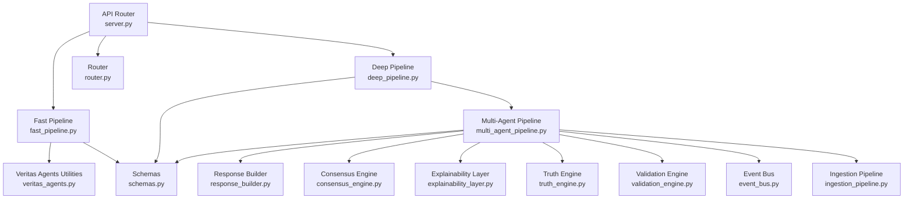
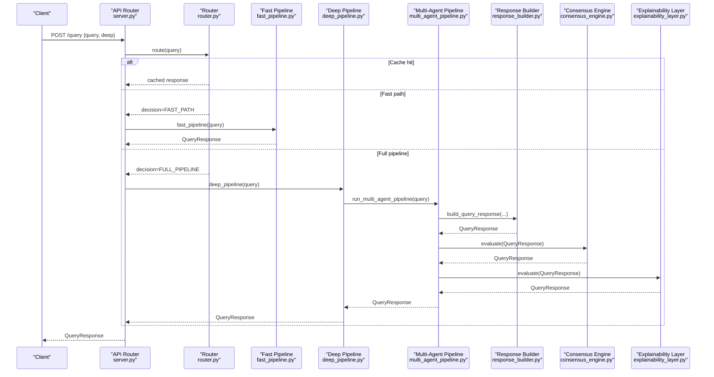
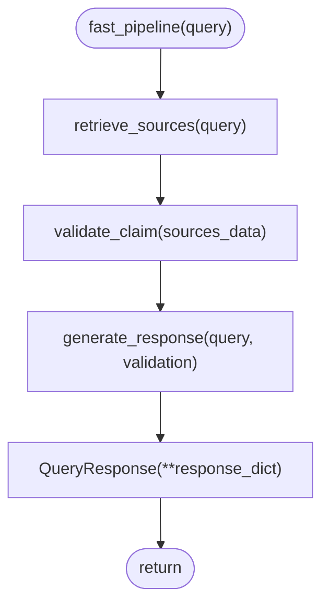
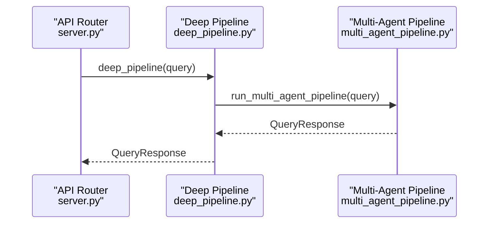
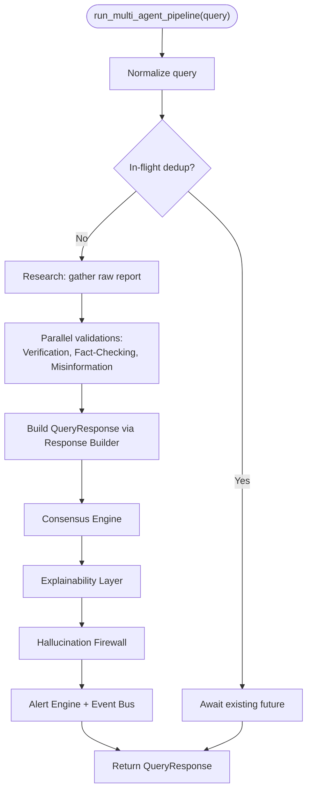
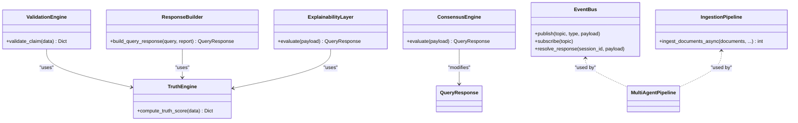
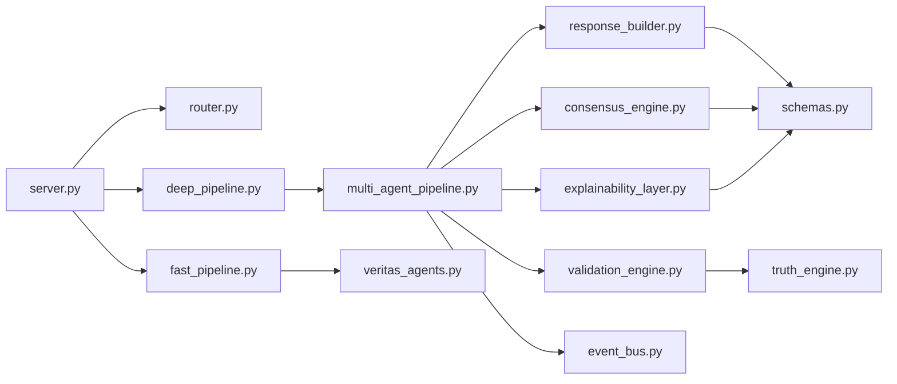

# Pipeline Types & Variants

<cite>
**Referenced Files in This Document**
- [fast_pipeline.py](file://veritas-ai/pipelines/fast_pipeline.py)
- [deep_pipeline.py](file://veritas-ai/pipelines/deep_pipeline.py)
- [multi_agent_pipeline.py](file://veritas-ai/pipelines/multi_agent_pipeline.py)
- [event_bus.py](file://veritas-ai/pipelines/event_bus.py)
- [ingestion_pipeline.py](file://veritas-ai/pipelines/ingestion_pipeline.py)
- [veritas_agents.py](file://veritas-ai/agents/veritas_agents.py)
- [schemas.py](file://veritas-ai/models/schemas.py)
- [router.py](file://veritas-ai/core/router.py)
- [response_builder.py](file://veritas-ai/pipelines/response_builder.py)
- [validation_engine.py](file://veritas-ai/core/validation_engine.py)
- [truth_engine.py](file://veritas-ai/core/truth_engine.py)
- [consensus_engine.py](file://veritas-ai/core/consensus_engine.py)
- [explainability_layer.py](file://veritas-ai/core/explainability_layer.py)
- [server.py](file://veritas-ai/api/server.py)
- [main.py](file://veritas-ai/main.py)
</cite>

## Table of Contents
1. [Introduction](#introduction)
2. [Project Structure](#project-structure)
3. [Core Components](#core-components)
4. [Architecture Overview](#architecture-overview)
5. [Detailed Component Analysis](#detailed-component-analysis)
6. [Dependency Analysis](#dependency-analysis)
7. [Performance Considerations](#performance-considerations)
8. [Troubleshooting Guide](#troubleshooting-guide)
9. [Conclusion](#conclusion)

## Introduction
This document explains the pipeline variants in Veritas AI’s event-driven system: the Fast Pipeline, the Deep Pipeline, and the Multi-Agent Pipeline. It details their architectural differences, processing stages, data transformations, decision-making logic, and selection criteria. It also compares throughput, latency, resource utilization, and accuracy implications across the variants.

## Project Structure
The pipeline system is organized around modular, asynchronous components:
- API entrypoints route queries and select a pipeline variant.
- Fast and Deep pipelines provide distinct processing paths.
- The Multi-Agent Pipeline orchestrates parallel agent workflows and integrates advanced engines for consensus, explainability, and safety.
- Supporting modules handle routing, response building, validation, truth scoring, and event streaming.

**Diagram sources**
- [server.py:53-77](file://veritas-ai/api/server.py#L53-L77)
- [fast_pipeline.py:8-21](file://veritas-ai/pipelines/fast_pipeline.py#L8-L21)
- [deep_pipeline.py:7-16](file://veritas-ai/pipelines/deep_pipeline.py#L7-L16)
- [multi_agent_pipeline.py:209-298](file://veritas-ai/pipelines/multi_agent_pipeline.py#L209-L298)
- [veritas_agents.py:7-41](file://veritas-ai/agents/veritas_agents.py#L7-L41)
- [response_builder.py:111-144](file://veritas-ai/pipelines/response_builder.py#L111-L144)
- [consensus_engine.py:8-25](file://veritas-ai/core/consensus_engine.py#L8-L25)
- [explainability_layer.py:13-51](file://veritas-ai/core/explainability_layer.py#L13-L51)
- [truth_engine.py:78-116](file://veritas-ai/core/truth_engine.py#L78-L116)
- [validation_engine.py:9-17](file://veritas-ai/core/validation_engine.py#L9-L17)
- [event_bus.py:31-50](file://veritas-ai/pipelines/event_bus.py#L31-L50)
- [ingestion_pipeline.py:7-33](file://veritas-ai/pipelines/ingestion_pipeline.py#L7-L33)
- [schemas.py:14-25](file://veritas-ai/models/schemas.py#L14-L25)
- [router.py:99-136](file://veritas-ai/core/router.py#L99-L136)

**Section sources**
- [server.py:53-77](file://veritas-ai/api/server.py#L53-L77)
- [router.py:99-136](file://veritas-ai/core/router.py#L99-L136)

## Core Components
- Fast Pipeline: Minimal retrieval and validation, single-response generation, optimized for sub-2-second latency.
- Deep Pipeline: Runs the full Multi-Agent Pipeline in a background task and returns the final response.
- Multi-Agent Pipeline: Orchestrates research, parallel validations, response building, consensus, explainability, and safety checks.

Key shared components:
- Schemas define the canonical QueryResponse structure.
- Router classifies queries and selects the appropriate path.
- Response Builder extracts facts, sources, contradictions, and computes truth/fake/confidence scores.
- Validation Engine delegates truth scoring to Truth Engine via thread pool.
- Consensus Engine merges LLM, classifier, and rule-based signals.
- Explainability Layer translates numeric scores into human-readable “why” explanations.
- Event Bus enables asynchronous event streaming and response resolution.

**Section sources**
- [fast_pipeline.py:8-21](file://veritas-ai/pipelines/fast_pipeline.py#L8-L21)
- [deep_pipeline.py:7-16](file://veritas-ai/pipelines/deep_pipeline.py#L7-L16)
- [multi_agent_pipeline.py:209-298](file://veritas-ai/pipelines/multi_agent_pipeline.py#L209-L298)
- [schemas.py:14-25](file://veritas-ai/models/schemas.py#L14-L25)
- [router.py:99-136](file://veritas-ai/core/router.py#L99-L136)
- [response_builder.py:111-144](file://veritas-ai/pipelines/response_builder.py#L111-L144)
- [validation_engine.py:9-17](file://veritas-ai/core/validation_engine.py#L9-L17)
- [truth_engine.py:78-116](file://veritas-ai/core/truth_engine.py#L78-L116)
- [consensus_engine.py:8-25](file://veritas-ai/core/consensus_engine.py#L8-L25)
- [explainability_layer.py:13-51](file://veritas-ai/core/explainability_layer.py#L13-L51)
- [event_bus.py:31-50](file://veritas-ai/pipelines/event_bus.py#L31-L50)

## Architecture Overview
The system routes incoming queries through a smart router that decides between cache, fast path, or full pipeline. The Fast Pipeline executes a minimal chain, while the Deep Pipeline delegates to the Multi-Agent Pipeline. The Multi-Agent Pipeline coordinates parallel agents, applies consensus and explainability, and enforces safety via a firewall.

**Diagram sources**
- [server.py:53-77](file://veritas-ai/api/server.py#L53-L77)
- [router.py:99-136](file://veritas-ai/core/router.py#L99-L136)
- [fast_pipeline.py:8-21](file://veritas-ai/pipelines/fast_pipeline.py#L8-L21)
- [deep_pipeline.py:7-16](file://veritas-ai/pipelines/deep_pipeline.py#L7-L16)
- [multi_agent_pipeline.py:209-298](file://veritas-ai/pipelines/multi_agent_pipeline.py#L209-L298)
- [response_builder.py:111-144](file://veritas-ai/pipelines/response_builder.py#L111-L144)
- [consensus_engine.py:8-25](file://veritas-ai/core/consensus_engine.py#L8-L25)
- [explainability_layer.py:13-51](file://veritas-ai/core/explainability_layer.py#L13-L51)

## Detailed Component Analysis

### Fast Pipeline
- Purpose: Sub-2 second latency path with minimal processing.
- Processing stages:
  1. Retrieve sources (minimal wrapper).
  2. Validate claim via ValidationEngine.
  3. Generate concise response dictionary and wrap into QueryResponse.
- Data transformations:
  - Sources are passed to ValidationEngine; truth score and breakdown are extracted.
  - Response builder is bypassed; a lightweight summary is produced.
- Decision-making logic:
  - Intended for simple queries; latency-critical UX.
- Trade-offs:
  - Lower accuracy due to reduced validation depth.
  - Minimal resource usage; suitable for high-throughput, low-latency scenarios.

**Diagram sources**
- [fast_pipeline.py:8-21](file://veritas-ai/pipelines/fast_pipeline.py#L8-L21)
- [veritas_agents.py:7-41](file://veritas-ai/agents/veritas_agents.py#L7-L41)
- [validation_engine.py:9-17](file://veritas-ai/core/validation_engine.py#L9-L17)
- [schemas.py:14-25](file://veritas-ai/models/schemas.py#L14-L25)

**Section sources**
- [fast_pipeline.py:8-21](file://veritas-ai/pipelines/fast_pipeline.py#L8-L21)
- [veritas_agents.py:7-41](file://veritas-ai/agents/veritas_agents.py#L7-L41)
- [validation_engine.py:9-17](file://veritas-ai/core/validation_engine.py#L9-L17)
- [schemas.py:14-25](file://veritas-ai/models/schemas.py#L14-L25)

### Deep Pipeline
- Purpose: Comprehensive multi-pass verification with enhanced accuracy.
- Processing stages:
  1. Run the Multi-Agent Pipeline in a background task.
  2. Await completion and return the final QueryResponse.
- Data transformations:
  - Delegates to the Multi-Agent Pipeline’s response builder and engines.
- Decision-making logic:
  - Used when the caller explicitly requests deep analysis or when router selects full pipeline.
- Trade-offs:
  - Higher latency; more compute resources.
  - Improved accuracy and robustness via parallel validations and explainability.

**Diagram sources**
- [deep_pipeline.py:7-16](file://veritas-ai/pipelines/deep_pipeline.py#L7-L16)
- [multi_agent_pipeline.py:209-298](file://veritas-ai/pipelines/multi_agent_pipeline.py#L209-L298)

**Section sources**
- [deep_pipeline.py:7-16](file://veritas-ai/pipelines/deep_pipeline.py#L7-L16)
- [multi_agent_pipeline.py:209-298](file://veritas-ai/pipelines/multi_agent_pipeline.py#L209-L298)

### Multi-Agent Pipeline
- Purpose: Collaborative agent workflows with parallel validations and rigorous post-processing.
- Processing stages:
  1. Normalize query and deduplicate in-flight queries.
  2. Research phase: gather raw facts and sources.
  3. Parallel validations: verification, fact-checking, misinformation analysis.
  4. Final response construction: combine reports, compute truth score, apply consensus, explainability, and safety.
  5. Optional alert publishing via Event Bus.
- Data transformations:
  - Response Builder extracts facts, sources, contradictions, and computes truth/fake/confidence.
  - Consensus Engine merges LLM, classifier, and rule-based signals.
  - Explainability Layer produces human-readable explanations.
  - Firewall filters unsafe outputs.
- Decision-making logic:
  - Uses CrewAI tasks and agents; parallel execution with semaphores; caching for agent outputs and research.
  - Emits progress callbacks; supports event streaming.
- Trade-offs:
  - Highest accuracy and interpretability.
  - Highest latency and resource usage; requires robust infrastructure.

**Diagram sources**
- [multi_agent_pipeline.py:209-298](file://veritas-ai/pipelines/multi_agent_pipeline.py#L209-L298)
- [response_builder.py:111-144](file://veritas-ai/pipelines/response_builder.py#L111-L144)
- [consensus_engine.py:8-25](file://veritas-ai/core/consensus_engine.py#L8-L25)
- [explainability_layer.py:13-51](file://veritas-ai/core/explainability_layer.py#L13-L51)
- [event_bus.py:31-50](file://veritas-ai/pipelines/event_bus.py#L31-L50)

**Section sources**
- [multi_agent_pipeline.py:209-298](file://veritas-ai/pipelines/multi_agent_pipeline.py#L209-L298)
- [response_builder.py:111-144](file://veritas-ai/pipelines/response_builder.py#L111-L144)
- [consensus_engine.py:8-25](file://veritas-ai/core/consensus_engine.py#L8-L25)
- [explainability_layer.py:13-51](file://veritas-ai/core/explainability_layer.py#L13-L51)
- [event_bus.py:31-50](file://veritas-ai/pipelines/event_bus.py#L31-L50)

### Supporting Engines and Utilities
- Truth Engine: Computes a multi-factor truth score from source authority, cross-source agreement, temporal consistency, verifiability, and bias deviation.
- Validation Engine: Runs TruthEngine in a thread pool to avoid blocking.
- Response Builder: Parses reports, extracts facts/sources/contradictions, computes fake probability and truth score, and constructs QueryResponse.
- Consensus Engine: Merges LLM confidence, classifier confidence, and rule-based truth score.
- Explainability Layer: Produces “why_true/why_false” explanations and confidence breakdown.
- Event Bus: Asynchronous message broker for streaming and response resolution.
- Ingestion Pipeline: Asynchronously ingests documents in batches with chunking.

**Diagram sources**
- [truth_engine.py:78-116](file://veritas-ai/core/truth_engine.py#L78-L116)
- [validation_engine.py:9-17](file://veritas-ai/core/validation_engine.py#L9-L17)
- [response_builder.py:111-144](file://veritas-ai/pipelines/response_builder.py#L111-L144)
- [consensus_engine.py:8-25](file://veritas-ai/core/consensus_engine.py#L8-L25)
- [explainability_layer.py:13-51](file://veritas-ai/core/explainability_layer.py#L13-L51)
- [event_bus.py:31-50](file://veritas-ai/pipelines/event_bus.py#L31-L50)
- [ingestion_pipeline.py:7-33](file://veritas-ai/pipelines/ingestion_pipeline.py#L7-L33)

**Section sources**
- [truth_engine.py:78-116](file://veritas-ai/core/truth_engine.py#L78-L116)
- [validation_engine.py:9-17](file://veritas-ai/core/validation_engine.py#L9-L17)
- [response_builder.py:111-144](file://veritas-ai/pipelines/response_builder.py#L111-L144)
- [consensus_engine.py:8-25](file://veritas-ai/core/consensus_engine.py#L8-L25)
- [explainability_layer.py:13-51](file://veritas-ai/core/explainability_layer.py#L13-L51)
- [event_bus.py:31-50](file://veritas-ai/pipelines/event_bus.py#L31-L50)
- [ingestion_pipeline.py:7-33](file://veritas-ai/pipelines/ingestion_pipeline.py#L7-L33)

## Dependency Analysis
- API layer depends on router for decision-making and on pipeline modules for execution.
- Fast Pipeline depends on Veritas Agents utilities and Validation Engine.
- Deep Pipeline depends on Multi-Agent Pipeline.
- Multi-Agent Pipeline depends on Response Builder, Truth Engine, Consensus Engine, Explainability Layer, Validation Engine, and Event Bus.
- Response Builder depends on Truth Engine and schema models.
- Consensus and Explainability Layers depend on schema models and Truth Engine.
- Event Bus is used by Multi-Agent Pipeline for alerting and response resolution.

**Diagram sources**
- [server.py:53-77](file://veritas-ai/api/server.py#L53-L77)
- [router.py:99-136](file://veritas-ai/core/router.py#L99-L136)
- [fast_pipeline.py:8-21](file://veritas-ai/pipelines/fast_pipeline.py#L8-L21)
- [deep_pipeline.py:7-16](file://veritas-ai/pipelines/deep_pipeline.py#L7-L16)
- [multi_agent_pipeline.py:209-298](file://veritas-ai/pipelines/multi_agent_pipeline.py#L209-L298)
- [veritas_agents.py:7-41](file://veritas-ai/agents/veritas_agents.py#L7-L41)
- [response_builder.py:111-144](file://veritas-ai/pipelines/response_builder.py#L111-L144)
- [consensus_engine.py:8-25](file://veritas-ai/core/consensus_engine.py#L8-L25)
- [explainability_layer.py:13-51](file://veritas-ai/core/explainability_layer.py#L13-L51)
- [validation_engine.py:9-17](file://veritas-ai/core/validation_engine.py#L9-L17)
- [truth_engine.py:78-116](file://veritas-ai/core/truth_engine.py#L78-L116)
- [schemas.py:14-25](file://veritas-ai/models/schemas.py#L14-L25)
- [event_bus.py:31-50](file://veritas-ai/pipelines/event_bus.py#L31-L50)

**Section sources**
- [server.py:53-77](file://veritas-ai/api/server.py#L53-L77)
- [router.py:99-136](file://veritas-ai/core/router.py#L99-L136)
- [fast_pipeline.py:8-21](file://veritas-ai/pipelines/fast_pipeline.py#L8-L21)
- [deep_pipeline.py:7-16](file://veritas-ai/pipelines/deep_pipeline.py#L7-L16)
- [multi_agent_pipeline.py:209-298](file://veritas-ai/pipelines/multi_agent_pipeline.py#L209-L298)

## Performance Considerations
- Fast Pipeline:
  - Designed for sub-2 second latency with minimal steps.
  - Lower CPU and memory footprint; suitable for high RPS with strict SLAs.
- Deep Pipeline:
  - Higher latency due to full agent orchestration and parallel validations.
  - More CPU, memory, and I/O; benefits from async execution and caching.
- Multi-Agent Pipeline:
  - Parallelism reduces wall-clock time; semaphores bound concurrency.
  - Caching of agent outputs and research reduces repeated computation.
  - Event Bus decouples producers/consumers for scalability.
- Response Builder and Engines:
  - Truth Engine and Consensus/Explainability Layers are deterministic and lightweight.
  - Validation Engine uses thread pools to avoid blocking the event loop.
- Throughput vs. Accuracy:
  - Fast Pipeline prioritizes throughput and latency; accuracy may be lower.
  - Deep/Multi-Agent Pipeline improves accuracy and explainability at the cost of latency and resources.

[No sources needed since this section provides general guidance]

## Troubleshooting Guide
- Timeout handling:
  - API enforces a global request timeout; long-running pipelines may hit this threshold.
- Pipeline-level errors:
  - Multi-Agent Pipeline raises a custom error type for safe failures and falls back to a conservative response.
- Cache and routing:
  - Router caches recent queries; ensure cache keys normalize whitespace and casing.
- Event Bus:
  - Verify topics and subscriptions; ensure futures are resolved or canceled during shutdown.
- Validation and truth scoring:
  - If Truth Engine returns neutral scores, check input data (sources, hits, fake probability).
- Response builder:
  - If summaries are empty, verify that facts and sources were extracted from the report.

**Section sources**
- [server.py:127-148](file://veritas-ai/api/server.py#L127-L148)
- [multi_agent_pipeline.py:34-36](file://veritas-ai/pipelines/multi_agent_pipeline.py#L34-L36)
- [multi_agent_pipeline.py:289-294](file://veritas-ai/pipelines/multi_agent_pipeline.py#L289-L294)
- [router.py:99-136](file://veritas-ai/core/router.py#L99-L136)
- [event_bus.py:52-70](file://veritas-ai/pipelines/event_bus.py#L52-L70)
- [truth_engine.py:78-116](file://veritas-ai/core/truth_engine.py#L78-L116)
- [response_builder.py:111-144](file://veritas-ai/pipelines/response_builder.py#L111-L144)

## Conclusion
- Select Fast Pipeline for latency-sensitive, high-throughput scenarios where a concise, quick response suffices.
- Choose Deep/Multi-Agent Pipeline when accuracy, robustness, and explainability are paramount, accepting higher latency and resource usage.
- Use Router and API endpoints to dynamically route queries based on content and user intent.
- The Multi-Agent Pipeline’s parallel validations, consensus fusion, and explainability layers provide a strong foundation for comprehensive verification, while the Fast Pipeline offers a lean alternative for rapid responses.

[No sources needed since this section summarizes without analyzing specific files]