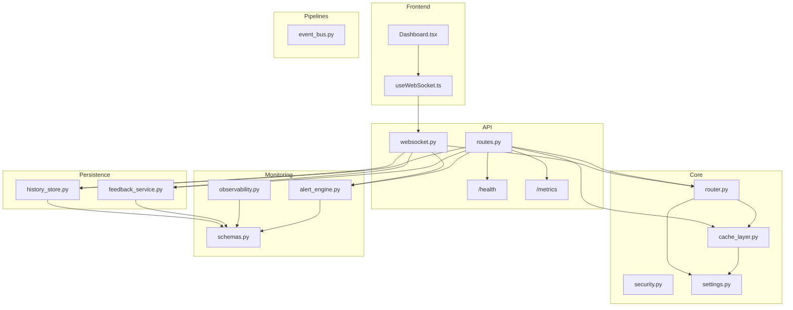
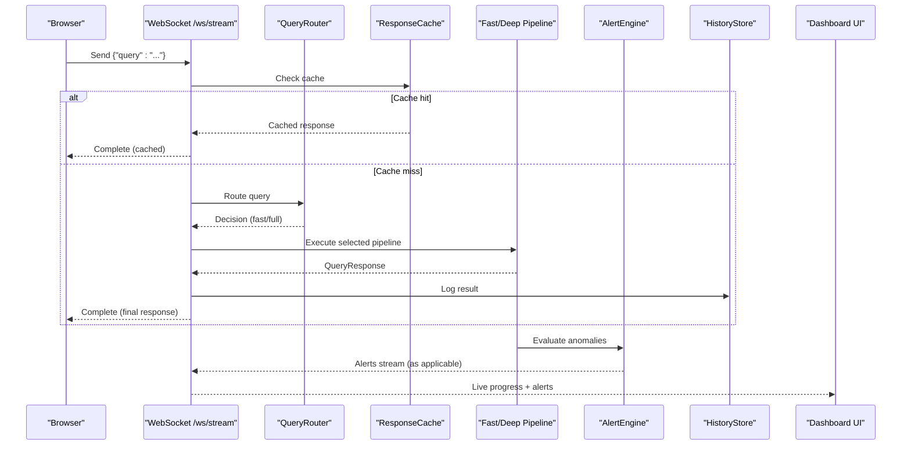
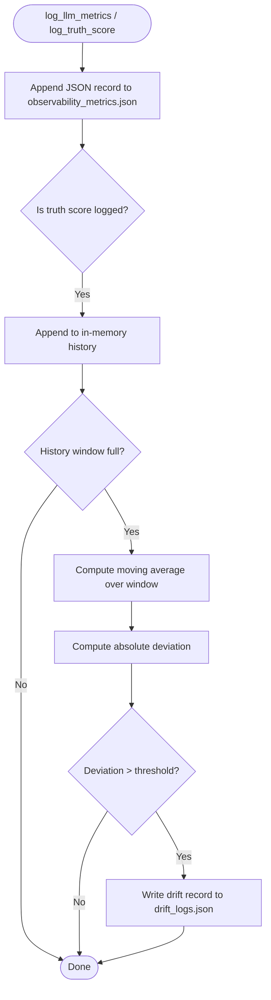
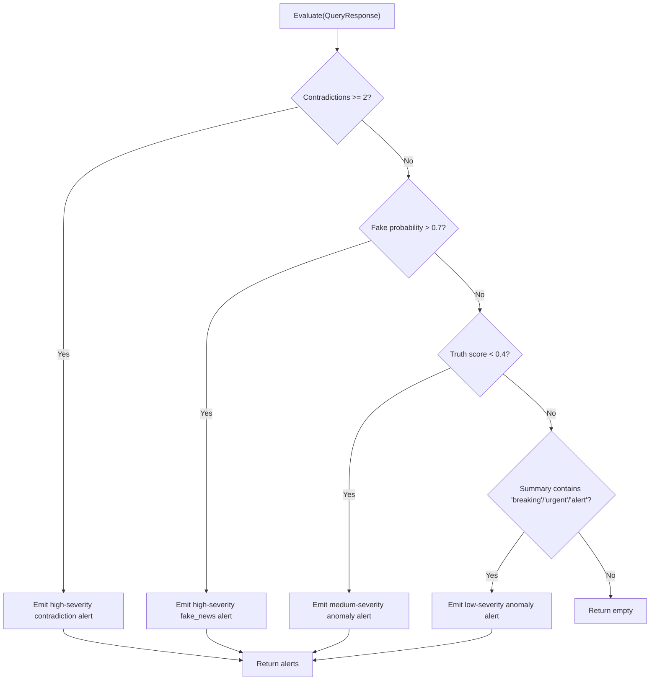
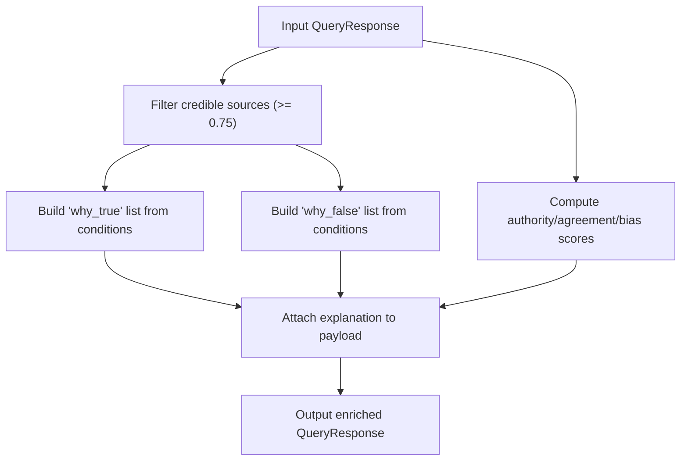
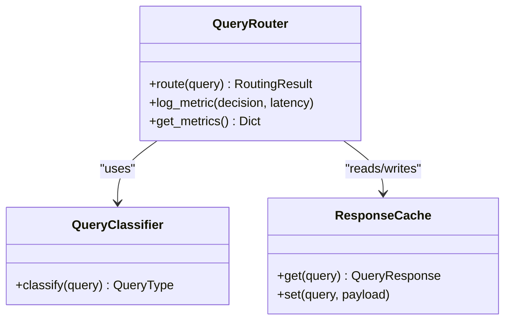
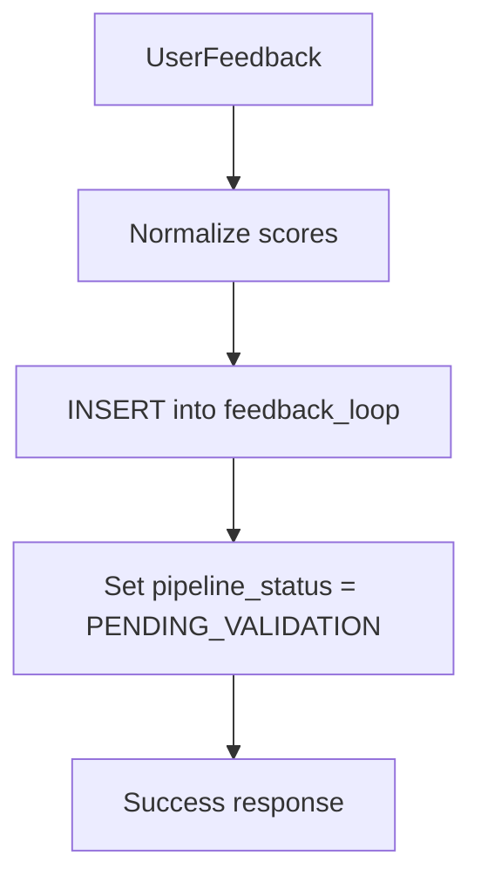
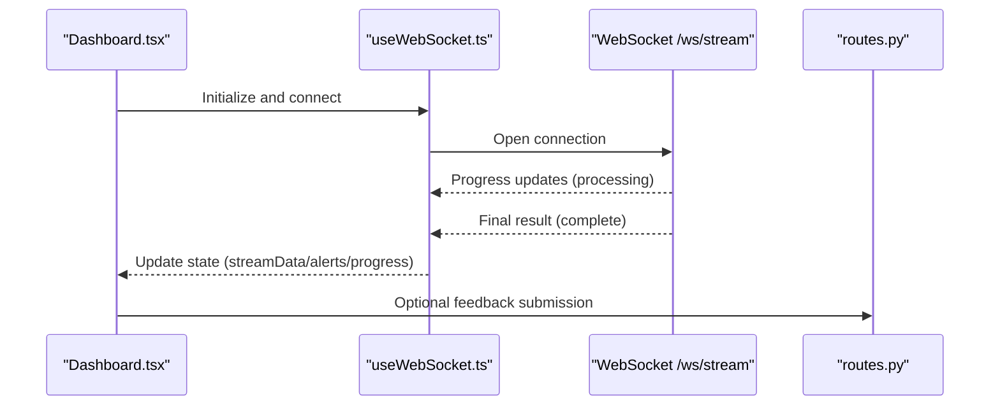
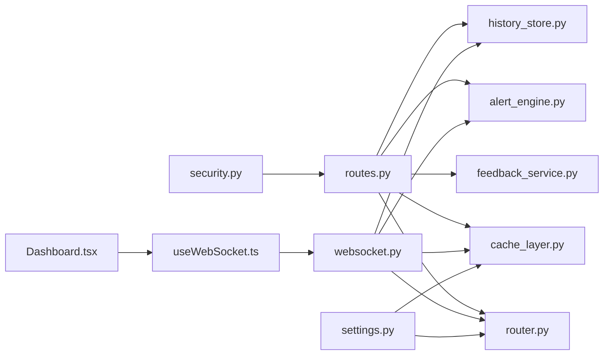

# Observability & Monitoring

<cite>
**Referenced Files in This Document**
- [observability.py](file://veritas-ai/core/observability.py)
- [explainability_layer.py](file://veritas-ai/core/explainability_layer.py)
- [alert_engine.py](file://veritas-ai/core/alert_engine.py)
- [settings.py](file://veritas-ai/config/settings.py)
- [schemas.py](file://veritas-ai/models/schemas.py)
- [event_bus.py](file://veritas-ai/pipelines/event_bus.py)
- [feedback_service.py](file://veritas-ai/feedback/feedback_service.py)
- [history_store.py](file://veritas-ai/core/history_store.py)
- [router.py](file://veritas-ai/core/router.py)
- [routes.py](file://veritas-ai/app/api/routes.py)
- [websocket.py](file://veritas-ai/app/api/websocket.py)
- [useWebSocket.ts](file://veritas-ai/frontend/hooks/useWebSocket.ts)
- [Dashboard.tsx](file://veritas-ai/frontend/components/Dashboard.tsx)
- [page.tsx](file://veritas-ai/frontend/app/dashboard/page.tsx)
- [security.py](file://veritas-ai/core/security.py)
- [cache_layer.py](file://veritas-ai/core/cache_layer.py)
- [main.py](file://veritas-ai/app/main.py)
- [observability_metrics.json](file://veritas-ai/logs/observability_metrics.json)
</cite>

## Table of Contents
1. [Introduction](#introduction)
2. [Project Structure](#project-structure)
3. [Core Components](#core-components)
4. [Architecture Overview](#architecture-overview)
5. [Detailed Component Analysis](#detailed-component-analysis)
6. [Dependency Analysis](#dependency-analysis)
7. [Performance Considerations](#performance-considerations)
8. [Troubleshooting Guide](#troubleshooting-guide)
9. [Conclusion](#conclusion)
10. [Appendices](#appendices)

## Introduction
This document describes Veritas AI’s observability and monitoring framework. It covers telemetry collection for performance metrics, user behavior tracking, and system health monitoring. It documents the explainability layer that renders transparent AI decision-making, the feedback loop for continuous improvement, and the alerting and dashboard systems. It also outlines metrics aggregation patterns, alerting thresholds, and operational dashboards, along with best practices, troubleshooting workflows, and optimization recommendations.

## Project Structure
The observability stack spans backend services, pipelines, frontend dashboards, and persistent stores:
- Backend API and WebSockets orchestrate queries, progress streaming, and alerts.
- Pipelines and routers manage routing and caching.
- Observability logs truth scores and drift events.
- Alert engine emits structured anomalies.
- Frontend displays live progress, alerts, and explanations.
- Feedback and history stores persist user insights and query outcomes.

**Diagram sources**
- [routes.py:1-251](file://veritas-ai/app/api/routes.py#L1-L251)
- [websocket.py:1-253](file://veritas-ai/app/api/websocket.py#L1-L253)
- [router.py:1-182](file://veritas-ai/core/router.py#L1-L182)
- [cache_layer.py:1-41](file://veritas-ai/core/cache_layer.py#L1-L41)
- [event_bus.py:1-74](file://veritas-ai/pipelines/event_bus.py#L1-L74)
- [observability.py:1-75](file://veritas-ai/core/observability.py#L1-L75)
- [alert_engine.py:1-67](file://veritas-ai/core/alert_engine.py#L1-L67)
- [schemas.py:1-88](file://veritas-ai/models/schemas.py#L1-L88)
- [feedback_service.py:1-94](file://veritas-ai/feedback/feedback_service.py#L1-L94)
- [history_store.py:1-106](file://veritas-ai/core/history_store.py#L1-L106)
- [useWebSocket.ts:1-143](file://veritas-ai/frontend/hooks/useWebSocket.ts#L1-L143)
- [Dashboard.tsx:1-312](file://veritas-ai/frontend/components/Dashboard.tsx#L1-L312)
- [page.tsx:1-17](file://veritas-ai/frontend/app/dashboard/page.tsx#L1-L17)
- [security.py:1-129](file://veritas-ai/core/security.py#L1-L129)
- [settings.py:1-83](file://veritas-ai/config/settings.py#L1-L83)

**Section sources**
- [routes.py:1-251](file://veritas-ai/app/api/routes.py#L1-L251)
- [websocket.py:1-253](file://veritas-ai/app/api/websocket.py#L1-L253)
- [router.py:1-182](file://veritas-ai/core/router.py#L1-L182)
- [cache_layer.py:1-41](file://veritas-ai/core/cache_layer.py#L1-L41)
- [event_bus.py:1-74](file://veritas-ai/pipelines/event_bus.py#L1-L74)
- [observability.py:1-75](file://veritas-ai/core/observability.py#L1-L75)
- [alert_engine.py:1-67](file://veritas-ai/core/alert_engine.py#L1-L67)
- [schemas.py:1-88](file://veritas-ai/models/schemas.py#L1-L88)
- [feedback_service.py:1-94](file://veritas-ai/feedback/feedback_service.py#L1-L94)
- [history_store.py:1-106](file://veritas-ai/core/history_store.py#L1-L106)
- [useWebSocket.ts:1-143](file://veritas-ai/frontend/hooks/useWebSocket.ts#L1-L143)
- [Dashboard.tsx:1-312](file://veritas-ai/frontend/components/Dashboard.tsx#L1-L312)
- [page.tsx:1-17](file://veritas-ai/frontend/app/dashboard/page.tsx#L1-L17)
- [security.py:1-129](file://veritas-ai/core/security.py#L1-L129)
- [settings.py:1-83](file://veritas-ai/config/settings.py#L1-L83)

## Core Components
- Observability layer: Logs inference metrics and truth scores, computes drift detection, and persists records to JSONL files.
- Alert engine: Evaluates responses for anomalies and emits structured alerts with severity.
- Explainability layer: Produces human-readable “why true/false” rationales and confidence breakdowns.
- Routing and caching: Classifies queries, selects fast vs. full pipelines, and caches results.
- Feedback and history persistence: Stores user feedback and query outcomes for continuous learning and auditability.
- Frontend dashboard: Streams progress, displays alerts, truth gauges, and explanations.

**Section sources**
- [observability.py:1-75](file://veritas-ai/core/observability.py#L1-L75)
- [alert_engine.py:1-67](file://veritas-ai/core/alert_engine.py#L1-L67)
- [explainability_layer.py:1-52](file://veritas-ai/core/explainability_layer.py#L1-L52)
- [router.py:1-182](file://veritas-ai/core/router.py#L1-L182)
- [cache_layer.py:1-41](file://veritas-ai/core/cache_layer.py#L1-L41)
- [feedback_service.py:1-94](file://veritas-ai/feedback/feedback_service.py#L1-L94)
- [history_store.py:1-106](file://veritas-ai/core/history_store.py#L1-L106)
- [Dashboard.tsx:1-312](file://veritas-ai/frontend/components/Dashboard.tsx#L1-L312)

## Architecture Overview
The system integrates REST and WebSocket endpoints to deliver real-time streaming, progress updates, and alerts. The backend orchestrates routing, caching, pipelines, and persistence, while the frontend renders interactive dashboards and voice capabilities.

**Diagram sources**
- [websocket.py:63-165](file://veritas-ai/app/api/websocket.py#L63-L165)
- [router.py:83-182](file://veritas-ai/core/router.py#L83-L182)
- [cache_layer.py:10-41](file://veritas-ai/core/cache_layer.py#L10-L41)
- [routes.py:46-82](file://veritas-ai/app/api/routes.py#L46-L82)
- [alert_engine.py:20-67](file://veritas-ai/core/alert_engine.py#L20-L67)
- [history_store.py:46-63](file://veritas-ai/core/history_store.py#L46-L63)
- [useWebSocket.ts:15-142](file://veritas-ai/frontend/hooks/useWebSocket.ts#L15-L142)

## Detailed Component Analysis

### Observability Telemetry
- Purpose: Track inference performance and detect truth score drift.
- Data points:
  - LLM inference metrics: latency, prompt/completion tokens, optional confidence.
  - Truth computation: score and breakdown components.
  - Drift detection: moving average over recent scores and threshold-based alerts.
- Storage: JSONL files for metrics and drift logs; in-memory rolling history for drift computation.

**Diagram sources**
- [observability.py:25-72](file://veritas-ai/core/observability.py#L25-L72)

**Section sources**
- [observability.py:1-75](file://veritas-ai/core/observability.py#L1-L75)
- [observability_metrics.json:1-15](file://veritas-ai/logs/observability_metrics.json#L1-L15)

### Alerting Engine
- Purpose: Detect anomalies in structured responses and emit unified alert items.
- Detection rules:
  - High contradiction count.
  - Extreme fake probability.
  - Low truth score.
  - Temporal anomaly keywords in summary.
- Output: Severity-labeled alerts with timestamps.

**Diagram sources**
- [alert_engine.py:26-66](file://veritas-ai/core/alert_engine.py#L26-L66)

**Section sources**
- [alert_engine.py:1-67](file://veritas-ai/core/alert_engine.py#L1-L67)
- [schemas.py:40-49](file://veritas-ai/models/schemas.py#L40-L49)

### Explainability Layer
- Purpose: Translate internal logic and scores into user-readable explanations.
- Inputs: QueryResponse with sources, contradictions, fake probability, and breakdowns.
- Outputs: “Why true,” “Why false,” and confidence breakdown (authority, agreement, bias).

**Diagram sources**
- [explainability_layer.py:13-51](file://veritas-ai/core/explainability_layer.py#L13-L51)

**Section sources**
- [explainability_layer.py:1-52](file://veritas-ai/core/explainability_layer.py#L1-L52)
- [schemas.py:14-26](file://veritas-ai/models/schemas.py#L14-L26)

### Routing, Caching, and Metrics
- Query classification: Regex-based patterns and trigger words.
- Routing decisions: Cache hit, fast path, full pipeline.
- Metrics: Latency buckets per route for averaging and reporting.
- Cache: Local TTL cache plus Redis-backed cache with fallback.

**Diagram sources**
- [router.py:51-151](file://veritas-ai/core/router.py#L51-L151)
- [cache_layer.py:10-41](file://veritas-ai/core/cache_layer.py#L10-L41)

**Section sources**
- [router.py:1-182](file://veritas-ai/core/router.py#L1-L182)
- [cache_layer.py:1-41](file://veritas-ai/core/cache_layer.py#L1-L41)
- [settings.py:21-28](file://veritas-ai/config/settings.py#L21-L28)

### Feedback Loop and Continuous Improvement
- Persistence: SQLite tables for feedback and query history with WAL mode and normalization.
- Feedback ingestion: Normalizes score inputs, inserts structured records with pipeline status.
- Network effect builder: Endpoint to trigger dataset aggregation (referenced in routes).

**Diagram sources**
- [feedback_service.py:15-94](file://veritas-ai/feedback/feedback_service.py#L15-L94)

**Section sources**
- [feedback_service.py:1-94](file://veritas-ai/feedback/feedback_service.py#L1-L94)
- [history_store.py:1-106](file://veritas-ai/core/history_store.py#L1-L106)
- [routes.py:180-196](file://veritas-ai/app/api/routes.py#L180-L196)

### Frontend Streaming and Dashboards
- WebSocket hook: Connects to backend, parses progress, stages, alerts, and final results.
- Dashboard: Renders truth gauge, confidence/bias indicators, “why true/false” lists, and live progress bars.
- Voice: STT/TTS integration via WebSocket endpoints.

**Diagram sources**
- [useWebSocket.ts:15-142](file://veritas-ai/frontend/hooks/useWebSocket.ts#L15-L142)
- [Dashboard.tsx:21-312](file://veritas-ai/frontend/components/Dashboard.tsx#L21-L312)
- [websocket.py:63-165](file://veritas-ai/app/api/websocket.py#L63-L165)
- [routes.py:162-178](file://veritas-ai/app/api/routes.py#L162-L178)

**Section sources**
- [useWebSocket.ts:1-143](file://veritas-ai/frontend/hooks/useWebSocket.ts#L1-L143)
- [Dashboard.tsx:1-312](file://veritas-ai/frontend/components/Dashboard.tsx#L1-L312)
- [page.tsx:1-17](file://veritas-ai/frontend/app/dashboard/page.tsx#L1-L17)

## Dependency Analysis
- API routes depend on router, cache, pipelines, alert engine, feedback, and history stores.
- WebSocket endpoints mirror API flows with streaming progress and voice pipelines.
- Frontend depends on WebSocket messages and typed schemas.
- Security enforces API key validation and rate limiting.
- Settings centralize configuration for timeouts, caches, and streaming.

**Diagram sources**
- [routes.py:1-251](file://veritas-ai/app/api/routes.py#L1-L251)
- [websocket.py:1-253](file://veritas-ai/app/api/websocket.py#L1-L253)
- [router.py:1-182](file://veritas-ai/core/router.py#L1-L182)
- [cache_layer.py:1-41](file://veritas-ai/core/cache_layer.py#L1-L41)
- [alert_engine.py:1-67](file://veritas-ai/core/alert_engine.py#L1-L67)
- [feedback_service.py:1-94](file://veritas-ai/feedback/feedback_service.py#L1-L94)
- [history_store.py:1-106](file://veritas-ai/core/history_store.py#L1-L106)
- [useWebSocket.ts:1-143](file://veritas-ai/frontend/hooks/useWebSocket.ts#L1-L143)
- [Dashboard.tsx:1-312](file://veritas-ai/frontend/components/Dashboard.tsx#L1-L312)
- [security.py:1-129](file://veritas-ai/core/security.py#L1-L129)
- [settings.py:1-83](file://veritas-ai/config/settings.py#L1-L83)

**Section sources**
- [routes.py:1-251](file://veritas-ai/app/api/routes.py#L1-L251)
- [websocket.py:1-253](file://veritas-ai/app/api/websocket.py#L1-L253)
- [router.py:1-182](file://veritas-ai/core/router.py#L1-L182)
- [cache_layer.py:1-41](file://veritas-ai/core/cache_layer.py#L1-L41)
- [alert_engine.py:1-67](file://veritas-ai/core/alert_engine.py#L1-L67)
- [feedback_service.py:1-94](file://veritas-ai/feedback/feedback_service.py#L1-L94)
- [history_store.py:1-106](file://veritas-ai/core/history_store.py#L1-L106)
- [useWebSocket.ts:1-143](file://veritas-ai/frontend/hooks/useWebSocket.ts#L1-L143)
- [Dashboard.tsx:1-312](file://veritas-ai/frontend/components/Dashboard.tsx#L1-L312)
- [security.py:1-129](file://veritas-ai/core/security.py#L1-L129)
- [settings.py:1-83](file://veritas-ai/config/settings.py#L1-L83)

## Performance Considerations
- Caching: TTL-based local cache and Redis-backed cache reduce latency and load.
- Routing: Fast-path for simple queries; full pipeline for complex claims.
- Streaming: WebSocket progress callbacks keep UI responsive; chunked responses configurable.
- Timeouts: Global request timeout enforced; pipeline timeouts configurable.
- Concurrency: Asynchronous event bus supports decoupled processing.

Recommendations:
- Monitor cache hit rates and tune TTL and max entries.
- Profile pipeline stages to identify bottlenecks.
- Scale Redis and adjust pipeline timeouts for production loads.
- Enable structured logging for latency histograms and error distributions.

[No sources needed since this section provides general guidance]

## Troubleshooting Guide
Common scenarios and actions:
- WebSocket disconnects: Automatic reconnect with exponential backoff; inspect frontend logs and backend connectivity.
- Timeout errors: Increase pipeline timeout; review slow stages in progress updates.
- Authentication failures: Verify API key presence and validity; check rate limits.
- Cache misses: Investigate Redis availability; fallback to local cache is automatic.
- Alerts flooding: Review thresholds and payload characteristics; adjust detection rules.
- Drift alerts: Inspect truth score history and external data changes.

Operational runbooks:
- Health checks: Use /health to confirm cache stats and service status.
- Metrics: Use /metrics to retrieve cache statistics and version info.
- Clear cache: Use /cache/clear to reset caches during maintenance.
- Fetch alerts: Use /alerts to retrieve recent anomalies.
- Trigger network effect: Use /trigger-network-effect to rebuild datasets.

**Section sources**
- [websocket.py:81-99](file://veritas-ai/app/api/websocket.py#L81-L99)
- [routes.py:86-98](file://veritas-ai/app/api/routes.py#L86-L98)
- [routes.py:236-251](file://veritas-ai/app/api/routes.py#L236-L251)
- [routes.py:198-210](file://veritas-ai/app/api/routes.py#L198-L210)
- [routes.py:180-196](file://veritas-ai/app/api/routes.py#L180-L196)
- [useWebSocket.ts:81-90](file://veritas-ai/frontend/hooks/useWebSocket.ts#L81-L90)
- [security.py:51-84](file://veritas-ai/core/security.py#L51-L84)
- [settings.py:21-28](file://veritas-ai/config/settings.py#L21-L28)

## Conclusion
Veritas AI’s observability and monitoring framework combines structured telemetry, explainability, and feedback loops to ensure transparency, reliability, and continuous improvement. The system’s modular design enables real-time dashboards, robust alerting, and scalable caching, while configuration-driven settings support operational flexibility across environments.

[No sources needed since this section summarizes without analyzing specific files]

## Appendices

### Metrics Aggregation Patterns
- Inference metrics: Persisted to observability metrics file; can be aggregated by latency and token counts.
- Truth scores: Rolling average drift detection highlights stability issues.
- Cache performance: Hit rates and latency buckets per routing decision.
- Alerts: Severity-weighted counts and recency windows.

**Section sources**
- [observability.py:33-72](file://veritas-ai/core/observability.py#L33-L72)
- [router.py:138-149](file://veritas-ai/core/router.py#L138-L149)
- [routes.py:236-244](file://veritas-ai/app/api/routes.py#L236-L244)

### Alerting Thresholds
- Contradictions: ≥2 triggers high severity.
- Fake probability: >0.7 triggers high severity.
- Truth score: <0.4 triggers medium severity.
- Temporal anomaly: Presence of keywords in summary triggers low severity.

**Section sources**
- [alert_engine.py:29-64](file://veritas-ai/core/alert_engine.py#L29-L64)

### Operational Dashboards
- Real-time progress: Stages and percentage rendered in the dashboard.
- Truth gauge and confidence breakdown: Visualized with color-coded segments.
- Alerts panel: Severity-based grouping with icons and messages.
- Voice controls: Microphone toggle and speech synthesis.

**Section sources**
- [Dashboard.tsx:9-312](file://veritas-ai/frontend/components/Dashboard.tsx#L9-L312)
- [useWebSocket.ts:15-142](file://veritas-ai/frontend/hooks/useWebSocket.ts#L15-L142)

### User Feedback Integration
- Submission endpoint: Validates API key, normalizes feedback, and persists to SQLite.
- Ownership: Owner email derived from API key context.
- Pipeline status: Feedback marked for validation to drive improvements.

**Section sources**
- [routes.py:162-178](file://veritas-ai/app/api/routes.py#L162-L178)
- [feedback_service.py:68-94](file://veritas-ai/feedback/feedback_service.py#L68-L94)
- [security.py:87-109](file://veritas-ai/core/security.py#L87-L109)

### Impact Measurement Systems
- Query history: Stores truth and confidence scores for trend analysis.
- Feedback loop: Tracks corrections and comments to refine scoring and explanations.
- Predictive trends: Endpoint for horizon predictions (requires predictive engine).

**Section sources**
- [history_store.py:46-102](file://veritas-ai/core/history_store.py#L46-L102)
- [routes.py:212-224](file://veritas-ai/app/api/routes.py#L212-L224)

### Monitoring Best Practices
- Instrument all pipeline stages with progress callbacks.
- Centralize configuration via settings for environment-specific tuning.
- Use structured logs and JSONL files for downstream analytics.
- Enforce timeouts and circuit-breaking for resilience.
- Continuously review drift thresholds and alert rules.

**Section sources**
- [settings.py:13-83](file://veritas-ai/config/settings.py#L13-L83)
- [main.py:127-151](file://veritas-ai/app/main.py#L127-L151)

### Performance Profiling and Optimization
- Identify slow stages via progress callbacks and latency fields.
- Optimize heavy modules with lazy loading and background preloading.
- Tune cache TTL and capacity based on workload patterns.
- Scale Redis and monitor hit rates; adjust pipeline timeouts accordingly.

**Section sources**
- [main.py:60-68](file://veritas-ai/app/main.py#L60-L68)
- [router.py:95-180](file://veritas-ai/core/router.py#L95-L180)
- [routes.py:236-244](file://veritas-ai/app/api/routes.py#L236-L244)