# Security & Safety Layer

<cite>
**Referenced Files in This Document**
- [security.py](file://veritas-ai/core/security.py)
- [firewall.py](file://veritas-ai/core/firewall.py)
- [validation_engine.py](file://veritas-ai/core/validation_engine.py)
- [alert_engine.py](file://veritas-ai/core/alert_engine.py)
- [predictive_engine.py](file://veritas-ai/core/predictive_engine.py)
- [schemas.py](file://veritas-ai/models/schemas.py)
- [router.py](file://veritas-ai/core/router.py)
- [settings.py](file://veritas-ai/config/settings.py)
- [history_store.py](file://veritas-ai/core/history_store.py)
- [cache_layer.py](file://veritas-ai/core/cache_layer.py)
- [redis_cache.py](file://veritas-ai/core/redis_cache.py)
- [explainability_layer.py](file://veritas-ai/core/explainability_layer.py)
- [observability.py](file://veritas-ai/core/observability.py)
- [main.py](file://veritas-ai/app/main.py)
</cite>

## Table of Contents
1. [Introduction](#introduction)
2. [Project Structure](#project-structure)
3. [Core Components](#core-components)
4. [Architecture Overview](#architecture-overview)
5. [Detailed Component Analysis](#detailed-component-analysis)
6. [Dependency Analysis](#dependency-analysis)
7. [Performance Considerations](#performance-considerations)
8. [Troubleshooting Guide](#troubleshooting-guide)
9. [Conclusion](#conclusion)
10. [Appendices](#appendices)

## Introduction
This document describes the multi-layered security and safety layer of Veritas AI. It covers the hallucination firewall, content validation engines, threat detection mechanisms, security boundary enforcement, input sanitization, output filtering, alerting, trust scoring, anomaly detection, and compliance-enforcement patterns. It also outlines threat modeling, attack surface analysis, security audit integration, incident response procedures, security metrics collection, and regulatory compliance features.

## Project Structure
The security and safety layer spans several modules:
- Authentication and API key enforcement
- Query routing and caching
- Validation and truth computation
- Hallucination firewall and output filtering
- Alerting and predictive intelligence
- Observability and drift detection
- Persistent history and configuration

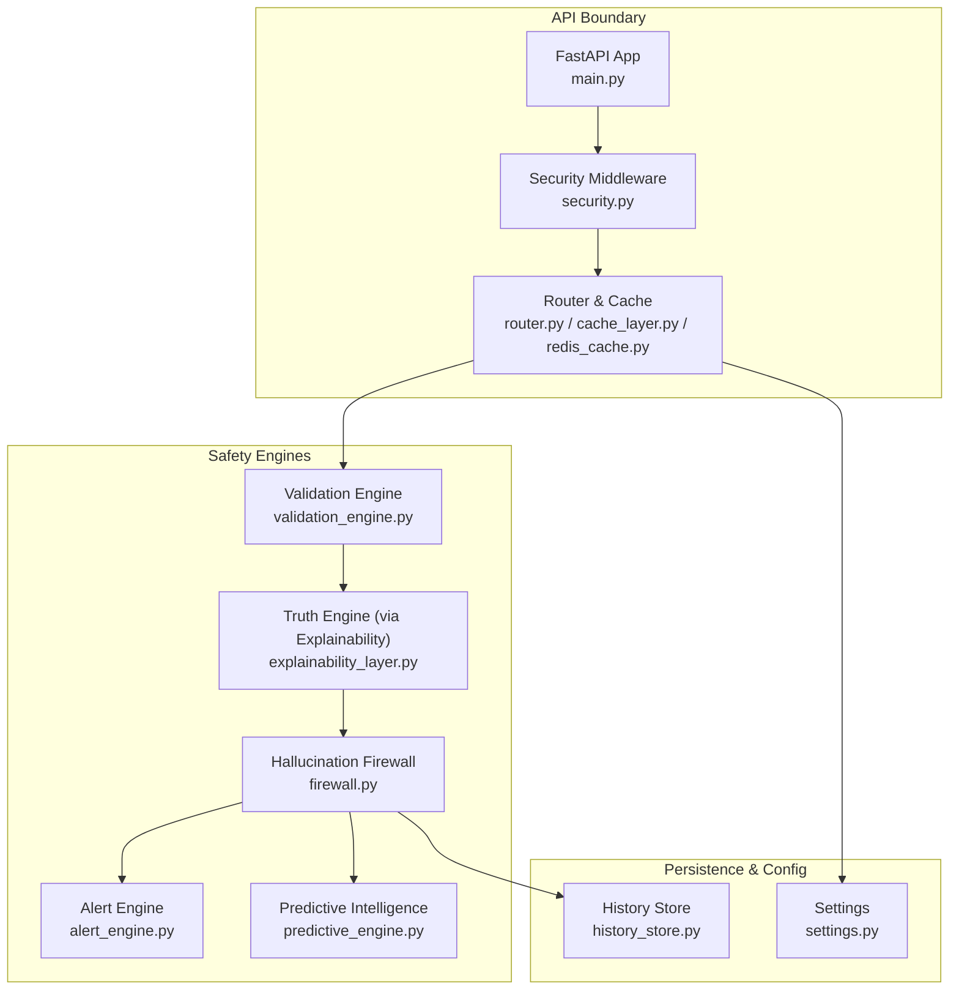

**Diagram sources**
- [main.py:106-208](file://veritas-ai/app/main.py#L106-L208)
- [security.py:51-129](file://veritas-ai/core/security.py#L51-L129)
- [router.py:83-182](file://veritas-ai/core/router.py#L83-L182)
- [cache_layer.py:10-41](file://veritas-ai/core/cache_layer.py#L10-L41)
- [redis_cache.py:18-232](file://veritas-ai/core/redis_cache.py#L18-L232)
- [validation_engine.py:9-18](file://veritas-ai/core/validation_engine.py#L9-L18)
- [explainability_layer.py:4-52](file://veritas-ai/core/explainability_layer.py#L4-L52)
- [firewall.py:4-47](file://veritas-ai/core/firewall.py#L4-L47)
- [alert_engine.py:20-67](file://veritas-ai/core/alert_engine.py#L20-L67)
- [predictive_engine.py:5-63](file://veritas-ai/core/predictive_engine.py#L5-L63)
- [history_store.py:23-106](file://veritas-ai/core/history_store.py#L23-L106)
- [settings.py:13-83](file://veritas-ai/config/settings.py#L13-L83)

**Section sources**
- [main.py:106-208](file://veritas-ai/app/main.py#L106-L208)
- [settings.py:13-83](file://veritas-ai/config/settings.py#L13-L83)

## Core Components
- API key enforcement and rate limiting
- Query classification and routing
- Response caching (local and Redis-backed)
- Truth and validation scoring
- Hallucination firewall and output filtering
- Alert generation and recent alert storage
- Predictive intelligence for trend detection
- Observability and drift detection
- Persistent query history

**Section sources**
- [security.py:51-129](file://veritas-ai/core/security.py#L51-L129)
- [router.py:83-182](file://veritas-ai/core/router.py#L83-L182)
- [cache_layer.py:10-41](file://veritas-ai/core/cache_layer.py#L10-L41)
- [redis_cache.py:18-232](file://veritas-ai/core/redis_cache.py#L18-L232)
- [validation_engine.py:9-18](file://veritas-ai/core/validation_engine.py#L9-L18)
- [explainability_layer.py:4-52](file://veritas-ai/core/explainability_layer.py#L4-L52)
- [firewall.py:4-47](file://veritas-ai/core/firewall.py#L4-L47)
- [alert_engine.py:20-67](file://veritas-ai/core/alert_engine.py#L20-L67)
- [predictive_engine.py:5-63](file://veritas-ai/core/predictive_engine.py#L5-L63)
- [observability.py:6-75](file://veritas-ai/core/observability.py#L6-L75)
- [history_store.py:23-106](file://veritas-ai/core/history_store.py#L23-L106)

## Architecture Overview
The security and safety layer enforces strict boundaries around inputs and outputs, validates content through multiple engines, and filters unsafe or unreliable outputs before returning them to clients. It integrates alerting and predictive intelligence to monitor anomalies and misinformation trends, while observability captures drift and performance metrics.

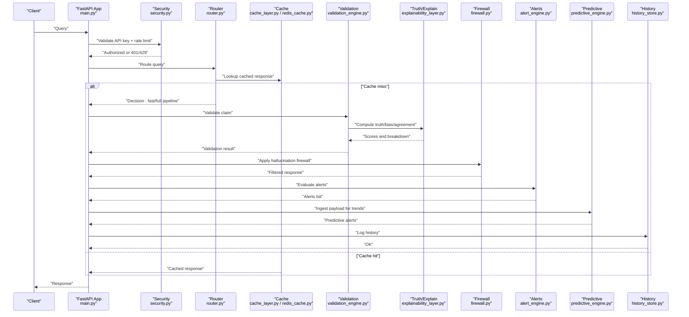

**Diagram sources**
- [main.py:106-208](file://veritas-ai/app/main.py#L106-L208)
- [security.py:51-129](file://veritas-ai/core/security.py#L51-L129)
- [router.py:83-182](file://veritas-ai/core/router.py#L83-L182)
- [cache_layer.py:10-41](file://veritas-ai/core/cache_layer.py#L10-L41)
- [redis_cache.py:18-232](file://veritas-ai/core/redis_cache.py#L18-L232)
- [validation_engine.py:9-18](file://veritas-ai/core/validation_engine.py#L9-L18)
- [explainability_layer.py:4-52](file://veritas-ai/core/explainability_layer.py#L4-L52)
- [firewall.py:4-47](file://veritas-ai/core/firewall.py#L4-L47)
- [alert_engine.py:20-67](file://veritas-ai/core/alert_engine.py#L20-L67)
- [predictive_engine.py:5-63](file://veritas-ai/core/predictive_engine.py#L5-L63)
- [history_store.py:46-63](file://veritas-ai/core/history_store.py#L46-L63)

## Detailed Component Analysis

### API Key Enforcement and Rate Limiting
- Enforces API key presence and validity via a header.
- Provides a fixed-window rate limiter per key tier (free vs enterprise).
- Generates ephemeral keys when none are configured (development mode).
- Logs unauthorized attempts and invalid keys.

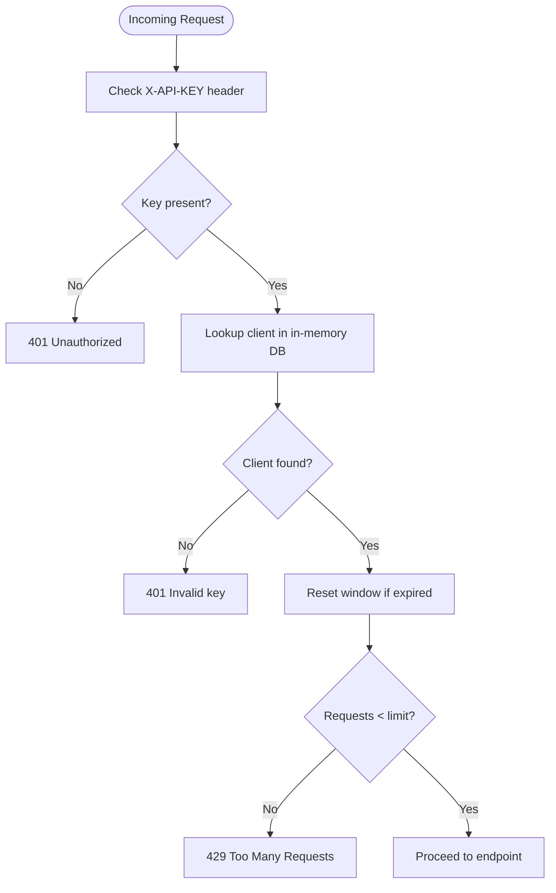

**Diagram sources**
- [security.py:51-84](file://veritas-ai/core/security.py#L51-L84)

**Section sources**
- [security.py:51-129](file://veritas-ai/core/security.py#L51-L129)

### Query Routing and Caching
- Classifies queries as simple/factual/complex using regex heuristics and trigger words.
- Implements a two-tier cache: local TTL cache and Redis-backed cache.
- Routes to fast-path or full multi-agent pipeline based on classification.
- Logs routing metrics and persists cache entries asynchronously.

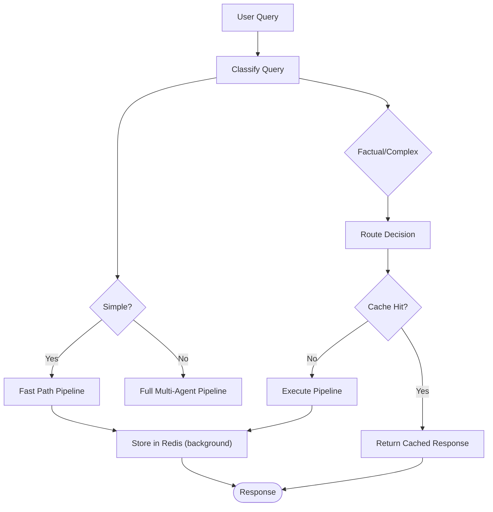

**Diagram sources**
- [router.py:51-182](file://veritas-ai/core/router.py#L51-L182)
- [cache_layer.py:10-41](file://veritas-ai/core/cache_layer.py#L10-L41)
- [redis_cache.py:18-232](file://veritas-ai/core/redis_cache.py#L18-L232)

**Section sources**
- [router.py:83-182](file://veritas-ai/core/router.py#L83-L182)
- [cache_layer.py:10-41](file://veritas-ai/core/cache_layer.py#L10-L41)
- [redis_cache.py:18-232](file://veritas-ai/core/redis_cache.py#L18-L232)

### Validation and Trust Scoring
- Validates claims using a thread-pool executor to avoid blocking the event loop.
- Delegates truth computation to the TruthEngine via the ExplainabilityLayer.
- Produces structured explanations and confidence breakdowns.

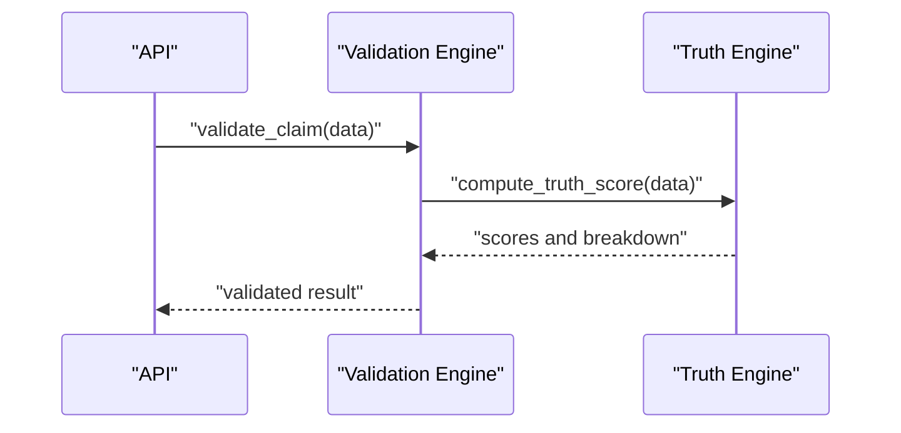

**Diagram sources**
- [validation_engine.py:9-18](file://veritas-ai/core/validation_engine.py#L9-L18)
- [explainability_layer.py:10-52](file://veritas-ai/core/explainability_layer.py#L10-L52)

**Section sources**
- [validation_engine.py:9-18](file://veritas-ai/core/validation_engine.py#L9-L18)
- [explainability_layer.py:4-52](file://veritas-ai/core/explainability_layer.py#L4-L52)

### Hallucination Firewall and Output Filtering
- Applies deterministic rules to filter or downgrade unsafe/unverified outputs.
- Overrides status based on contradiction counts, trusted source thresholds, and truth scores.
- Logs firewall overrides for auditability.

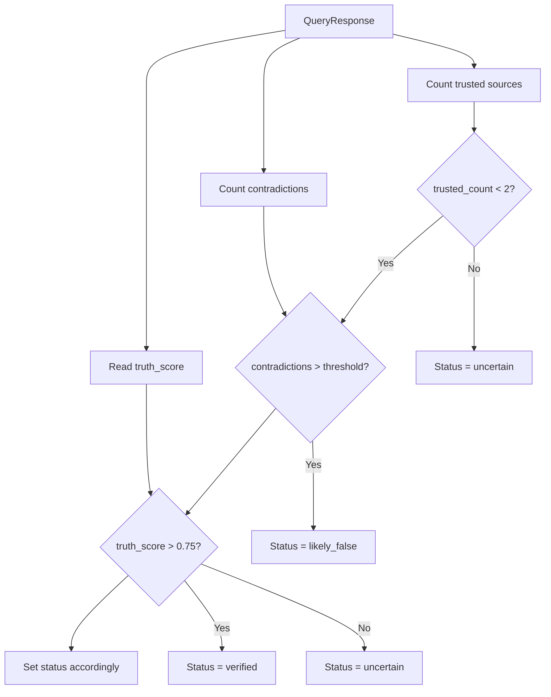

**Diagram sources**
- [firewall.py:13-47](file://veritas-ai/core/firewall.py#L13-L47)

**Section sources**
- [firewall.py:4-47](file://veritas-ai/core/firewall.py#L4-L47)
- [schemas.py:14-26](file://veritas-ai/models/schemas.py#L14-L26)

### Alert Engine and Recent Alerts
- Detects anomalies and suspicious patterns in structured responses.
- Emits alerts with severity and timestamps.
- Maintains a bounded deque of recent alerts for inspection.

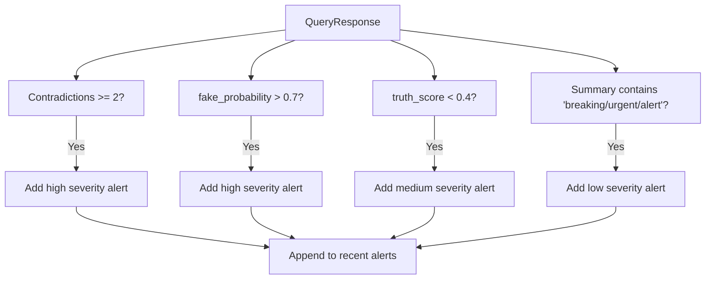

**Diagram sources**
- [alert_engine.py:26-67](file://veritas-ai/core/alert_engine.py#L26-L67)

**Section sources**
- [alert_engine.py:20-67](file://veritas-ai/core/alert_engine.py#L20-L67)

### Predictive Intelligence Engine
- Tracks keyword-topic spikes over a sliding window to detect emerging misinformation trends.
- Emits predictive alerts with risk levels and narratives.

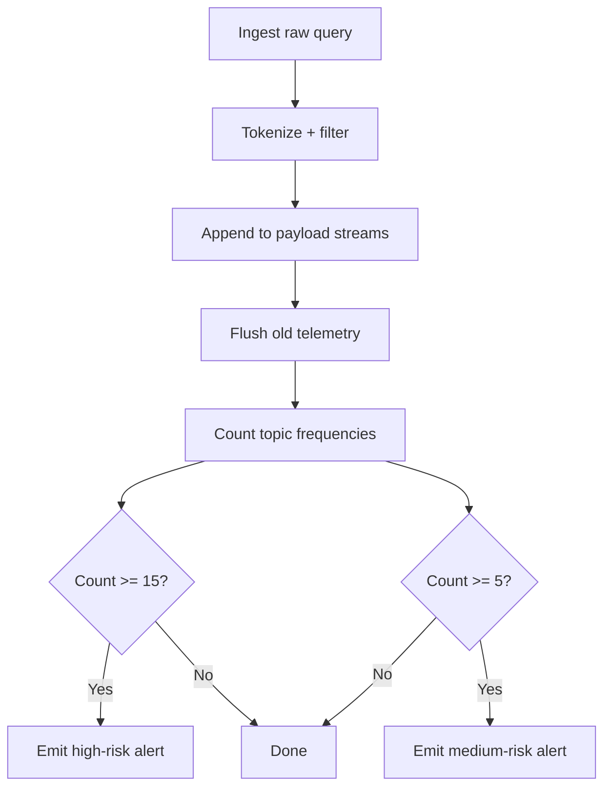

**Diagram sources**
- [predictive_engine.py:14-63](file://veritas-ai/core/predictive_engine.py#L14-L63)

**Section sources**
- [predictive_engine.py:5-63](file://veritas-ai/core/predictive_engine.py#L5-L63)

### Observability and Drift Detection
- Logs inference metrics and truth computations to JSONL files.
- Computes moving average drift for truth scores and emits drift logs when thresholds are exceeded.

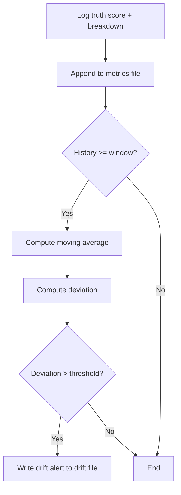

**Diagram sources**
- [observability.py:45-72](file://veritas-ai/core/observability.py#L45-L72)

**Section sources**
- [observability.py:6-75](file://veritas-ai/core/observability.py#L6-L75)

### Persistent History Store
- Initializes a SQLite database for query history.
- Inserts query results with metadata and supports retrieval by owner or public.

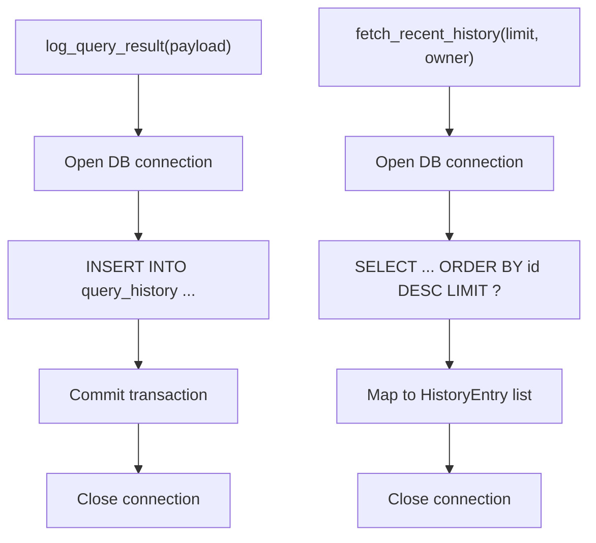

**Diagram sources**
- [history_store.py:46-102](file://veritas-ai/core/history_store.py#L46-L102)

**Section sources**
- [history_store.py:23-106](file://veritas-ai/core/history_store.py#L23-L106)

## Dependency Analysis
- The API layer depends on security enforcement and router for policy enforcement.
- Router coordinates cache and pipeline selection.
- Validation and truth engines feed the hallucination firewall and explainability layer.
- Firewall feeds alerts and history persistence.
- Predictive engine consumes raw queries independently.
- Observability writes to logs and monitors drift.

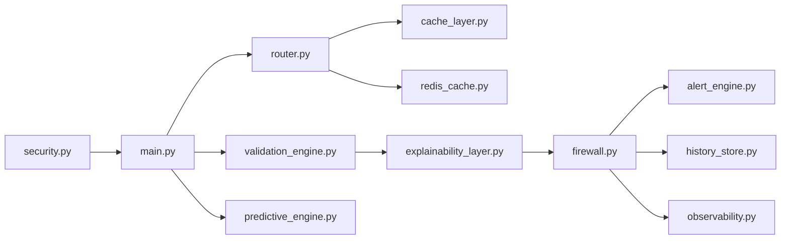

**Diagram sources**
- [main.py:106-208](file://veritas-ai/app/main.py#L106-L208)
- [security.py:51-129](file://veritas-ai/core/security.py#L51-L129)
- [router.py:83-182](file://veritas-ai/core/router.py#L83-L182)
- [cache_layer.py:10-41](file://veritas-ai/core/cache_layer.py#L10-L41)
- [redis_cache.py:18-232](file://veritas-ai/core/redis_cache.py#L18-L232)
- [validation_engine.py:9-18](file://veritas-ai/core/validation_engine.py#L9-L18)
- [explainability_layer.py:4-52](file://veritas-ai/core/explainability_layer.py#L4-L52)
- [firewall.py:4-47](file://veritas-ai/core/firewall.py#L4-L47)
- [alert_engine.py:20-67](file://veritas-ai/core/alert_engine.py#L20-L67)
- [history_store.py:46-102](file://veritas-ai/core/history_store.py#L46-L102)
- [predictive_engine.py:5-63](file://veritas-ai/core/predictive_engine.py#L5-L63)
- [observability.py:6-75](file://veritas-ai/core/observability.py#L6-L75)

**Section sources**
- [schemas.py:14-26](file://veritas-ai/models/schemas.py#L14-L26)

## Performance Considerations
- Asynchronous Redis cache with graceful fallback to local cache reduces latency and improves resilience.
- Thread-pool execution for truth scoring prevents blocking the event loop.
- Fixed-window rate limiting and sliding-window predictive analytics bound resource usage.
- Local TTL cache complements Redis for hot-path responses.
- Streaming and chunked responses are configurable for throughput tuning.

[No sources needed since this section provides general guidance]

## Troubleshooting Guide
- API key errors: Verify X-API-KEY header and tier limits; check warning logs for invalid attempts.
- Rate limit exceeded: Confirm tier-specific limits and reset windows.
- Cache connectivity: Redis failures fall back to local cache; inspect logs for warnings.
- Timeout handling: Global middleware returns 504 on exceeding pipeline timeouts.
- Drift detection: Review drift logs for truth score deviations.
- Alerts: Retrieve recent alerts via the alert engine’s recent list.

**Section sources**
- [security.py:87-129](file://veritas-ai/core/security.py#L87-L129)
- [redis_cache.py:30-56](file://veritas-ai/core/redis_cache.py#L30-L56)
- [main.py:127-151](file://veritas-ai/app/main.py#L127-L151)
- [observability.py:55-72](file://veritas-ai/core/observability.py#L55-L72)
- [alert_engine.py:17-18](file://veritas-ai/core/alert_engine.py#L17-L18)

## Conclusion
Veritas AI’s security and safety layer combines strong API boundary enforcement, intelligent query routing, robust caching, multi-stage validation, deterministic output filtering, proactive alerting, predictive trend detection, and observability-driven drift monitoring. Together, these components form a resilient, auditable, and scalable defense against hallucinations, misinformation, and anomalous behavior.

[No sources needed since this section summarizes without analyzing specific files]

## Appendices

### Threat Modeling and Attack Surface
- Injection vectors: Unsanitized queries routed to external APIs; mitigated by router classification and firewall filtering.
- API abuse: Brute force, rate limit bypass attempts; mitigated by API key enforcement and fixed-window rate limiting.
- Misinformation amplification: Propaganda or fake content; mitigated by fake probability checks, contradiction detection, and predictive trend alerts.
- Denial of service: High-volume queries; mitigated by caching, timeouts, and rate limiting.
- Data exposure: Unauthorized access; mitigated by API key enforcement and CORS configuration.

[No sources needed since this section provides general guidance]

### Compliance and Audit Integration
- Persistent history store enables audit trails for queries and outcomes.
- Observability logs capture drift and performance metrics for continuous monitoring.
- Alert engine records suspicious activity with timestamps and severity for incident review.
- Configuration-driven settings support environment-specific controls (CORS, timeouts, limits).

**Section sources**
- [history_store.py:23-106](file://veritas-ai/core/history_store.py#L23-L106)
- [observability.py:25-72](file://veritas-ai/core/observability.py#L25-L72)
- [alert_engine.py:12-18](file://veritas-ai/core/alert_engine.py#L12-L18)
- [settings.py:69-83](file://veritas-ai/config/settings.py#L69-L83)

### Incident Response Procedures
- Immediate: Inspect recent alerts and drift logs; confirm firewall overrides.
- Forensics: Review history store entries and observability metrics.
- Mitigation: Temporarily adjust thresholds, pause predictive ingestion, or scale caches.
- Recovery: Restore cache connectivity, reinitialize databases, and resume monitoring.

[No sources needed since this section provides general guidance]

### Security Metrics Collection
- Latency, token usage, and confidence scores recorded via observability layer.
- Routing metrics (cache hit, fast path, full pipeline) maintained by router.
- Redis statistics exposed via cache layer for operational insights.

**Section sources**
- [observability.py:33-44](file://veritas-ai/core/observability.py#L33-L44)
- [router.py:138-149](file://veritas-ai/core/router.py#L138-L149)
- [redis_cache.py:146-163](file://veritas-ai/core/redis_cache.py#L146-L163)