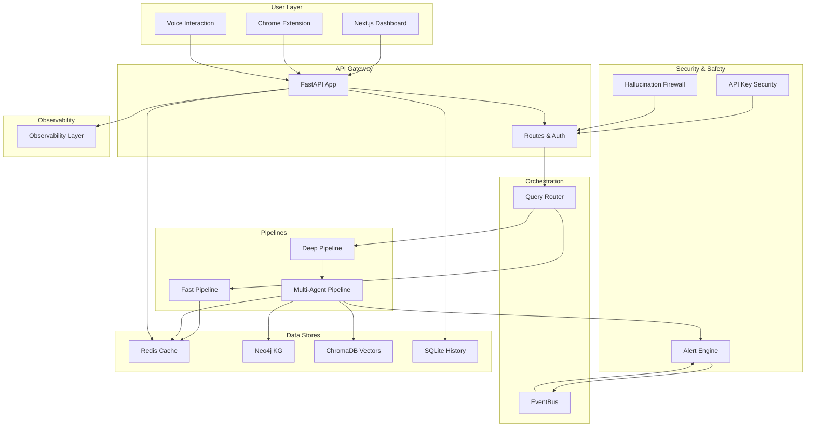
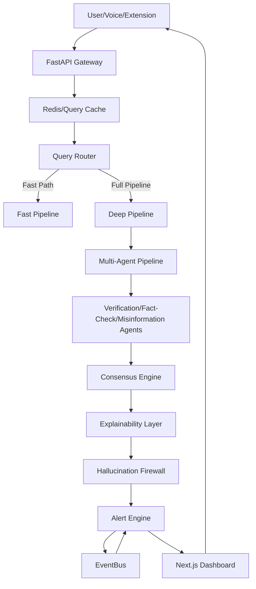
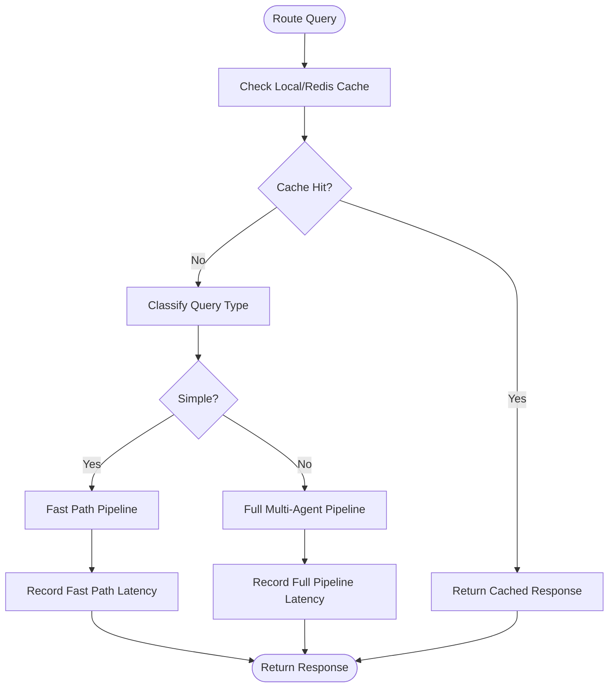
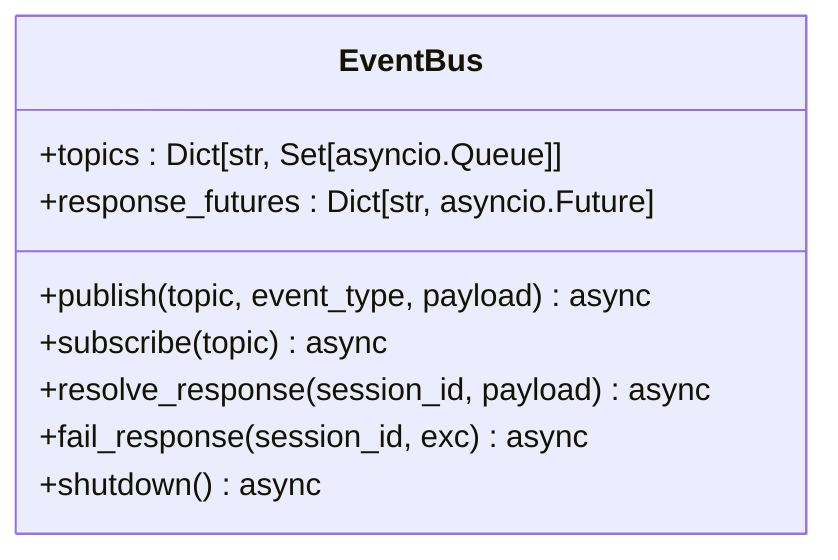
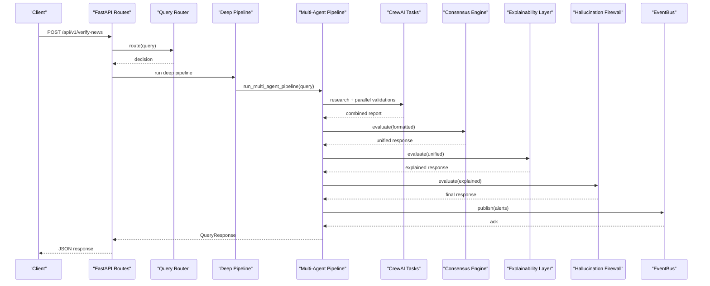
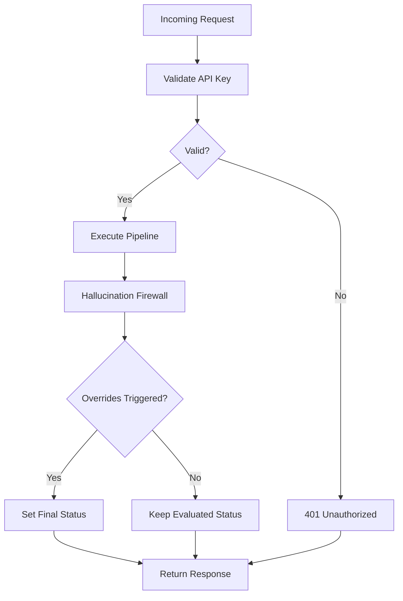
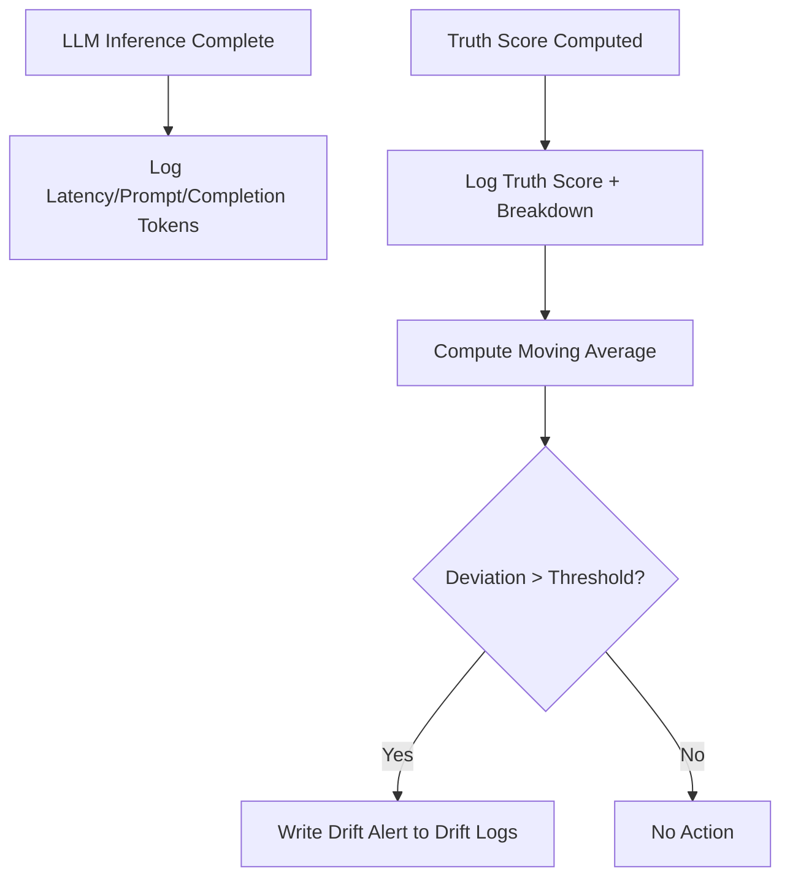
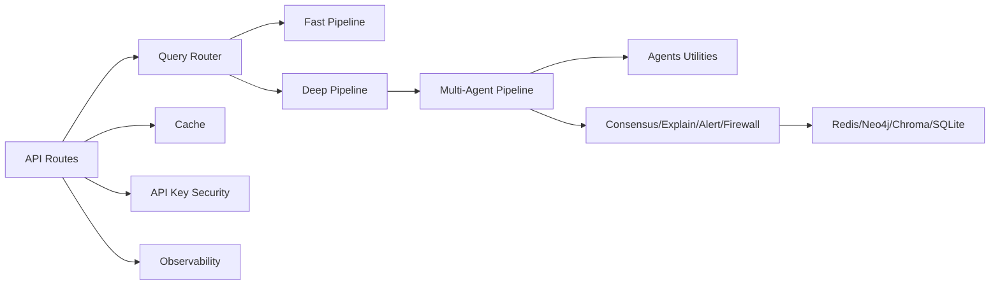

# System Architecture

<cite>
**Referenced Files in This Document**
- [README.md](file://README.md)
- [main.py](file://main.py)
- [app/main.py](file://app/main.py)
- [app/api/routes.py](file://app/api/routes.py)
- [core/router.py](file://core/router.py)
- [pipelines/event_bus.py](file://pipelines/event_bus.py)
- [pipelines/fast_pipeline.py](file://pipelines/fast_pipeline.py)
- [pipelines/deep_pipeline.py](file://pipelines/deep_pipeline.py)
- [pipelines/multi_agent_pipeline.py](file://pipelines/multi_agent_pipeline.py)
- [agents/veritas_agents.py](file://agents/veritas_agents.py)
- [core/firewall.py](file://core/firewall.py)
- [core/security.py](file://core/security.py)
- [core/observability.py](file://core/observability.py)
- [core/history_store.py](file://core/history_store.py)
- [memory/knowledge_graph.py](file://memory/knowledge_graph.py)
- [memory/vector_store.py](file://memory/vector_store.py)
- [docker-compose.yml](file://docker-compose.yml)
- [requirements.txt](file://requirements.txt)
</cite>

## Table of Contents
1. [Introduction](#introduction)
2. [Project Structure](#project-structure)
3. [Core Components](#core-components)
4. [Architecture Overview](#architecture-overview)
5. [Detailed Component Analysis](#detailed-component-analysis)
6. [Dependency Analysis](#dependency-analysis)
7. [Performance Considerations](#performance-considerations)
8. [Troubleshooting Guide](#troubleshooting-guide)
9. [Conclusion](#conclusion)
10. [Appendices](#appendices)

## Introduction
This document describes the event-driven intelligence platform architecture of Veritas AI. The system is designed to verify news claims and misinformation with sub-2-second latency for complex multi-pass verifications. It achieves this through asynchronous agent collaboration, an internal event streaming bus, distributed processing layers, and integrated security and observability controls. The platform supports a user interface, API gateway, agent swarm, and security layers, with robust infrastructure for Redis caching, Neo4j knowledge graph, ChromaDB vector storage, and SQLite session cache.

## Project Structure
The repository is organized into modular components:
- API gateway and routing: FastAPI application with routes and middleware
- Core orchestration: Query router, event bus, and pipeline orchestrators
- Agent swarm: Multi-agent pipeline with CrewAI and Crew tasks
- Security and safety: API key enforcement, hallucination firewall, and alerting
- Data stores: Redis cache, Neo4j KG, ChromaDB vectors, and SQLite history
- Observability: Metrics logging and drift detection
- Frontend: Next.js dashboard and services
- Deployment: Docker Compose for local and production environments



**Diagram sources**
- [app/main.py:106-208](file://app/main.py#L106-L208)
- [app/api/routes.py:18-251](file://app/api/routes.py#L18-L251)
- [core/router.py:83-182](file://core/router.py#L83-L182)
- [pipelines/event_bus.py:6-74](file://pipelines/event_bus.py#L6-L74)
- [pipelines/fast_pipeline.py:8-22](file://pipelines/fast_pipeline.py#L8-L22)
- [pipelines/deep_pipeline.py:7-17](file://pipelines/deep_pipeline.py#L7-L17)
- [pipelines/multi_agent_pipeline.py:209-379](file://pipelines/multi_agent_pipeline.py#L209-L379)
- [core/firewall.py:4-47](file://core/firewall.py#L4-L47)
- [core/security.py:17-129](file://core/security.py#L17-L129)
- [core/observability.py:6-75](file://core/observability.py#L6-L75)
- [core/history_store.py:23-106](file://core/history_store.py#L23-L106)
- [memory/knowledge_graph.py:12-160](file://memory/knowledge_graph.py#L12-L160)
- [memory/vector_store.py:15-27](file://memory/vector_store.py#L15-L27)

**Section sources**
- [README.md:33-59](file://README.md#L33-L59)
- [app/main.py:106-208](file://app/main.py#L106-L208)
- [app/api/routes.py:18-251](file://app/api/routes.py#L18-L251)

## Core Components
- API Gateway and Lifecycle
  - FastAPI application with CORS, timeouts, and global exception handlers
  - Startup/shutdown lifecycle initializes cache, databases, and background model preloading
  - Health endpoint and metrics exposed for monitoring
- Query Router and Path Selection
  - Classifies queries into simple/factual/complex categories
  - Decides between fast-path and full multi-agent pipeline
  - Integrates local TTL cache and Redis cache for instant hits
- Internal Event Streaming Bus
  - In-memory async pub/sub supporting topic-based routing and response futures
  - Used for alert propagation and inter-agent coordination
- Pipelines
  - Fast pipeline: minimal retrieval and validation for sub-2s SLA
  - Deep pipeline: full multi-agent orchestration with parallel validations
- Agent Swarm
  - Research, verification, fact-checking, and misinformation analysis agents
  - Parallel execution with caching and progress callbacks
- Security and Safety
  - API key enforcement with tiers and rate limits
  - Hallucination Firewall enforcing status overrides based on source quality and contradictions
- Observability
  - Logs LLM metrics and truth score drift detection
- Data Stores
  - Redis: query cache and agent output caching
  - Neo4j: async knowledge graph with connection pooling and validation
  - ChromaDB: local persistent vector store for RAG
  - SQLite: query history persistence with WAL mode tuning

**Section sources**
- [app/main.py:31-102](file://app/main.py#L31-L102)
- [core/router.py:83-182](file://core/router.py#L83-L182)
- [pipelines/event_bus.py:6-74](file://pipelines/event_bus.py#L6-L74)
- [pipelines/fast_pipeline.py:8-22](file://pipelines/fast_pipeline.py#L8-L22)
- [pipelines/deep_pipeline.py:7-17](file://pipelines/deep_pipeline.py#L7-L17)
- [pipelines/multi_agent_pipeline.py:107-207](file://pipelines/multi_agent_pipeline.py#L107-L207)
- [core/security.py:51-129](file://core/security.py#L51-L129)
- [core/firewall.py:13-47](file://core/firewall.py#L13-L47)
- [core/observability.py:25-75](file://core/observability.py#L25-L75)
- [memory/knowledge_graph.py:25-132](file://memory/knowledge_graph.py#L25-L132)
- [memory/vector_store.py:15-27](file://memory/vector_store.py#L15-L27)
- [core/history_store.py:23-106](file://core/history_store.py#L23-L106)

## Architecture Overview
Veritas AI employs a topological event-driven stream architecture enabling sub-2-second latency for complex multi-pass verifications. The system separates concerns across:
- User Interface: Next.js dashboard and Chrome extension
- API Gateway: FastAPI with routing, auth, and rate limiting
- Agent Swarm: Asynchronous multi-agent pipeline orchestrated by CrewAI
- Internal Event Bus: Topic-based pub/sub for alerts and coordination
- Security Layers: API key enforcement and hallucination firewall
- Distributed Processing: Parallel validations, caching, and external data stores



**Diagram sources**
- [README.md:37-59](file://README.md#L37-L59)
- [app/api/routes.py:46-82](file://app/api/routes.py#L46-L82)
- [core/router.py:99-136](file://core/router.py#L99-L136)
- [pipelines/fast_pipeline.py:8-22](file://pipelines/fast_pipeline.py#L8-L22)
- [pipelines/deep_pipeline.py:7-17](file://pipelines/deep_pipeline.py#L7-L17)
- [pipelines/multi_agent_pipeline.py:209-332](file://pipelines/multi_agent_pipeline.py#L209-L332)
- [core/firewall.py:13-47](file://core/firewall.py#L13-L47)
- [pipelines/event_bus.py:31-50](file://pipelines/event_bus.py#L31-L50)

## Detailed Component Analysis

### Query Routing and Path Selection
The router classifies incoming queries and selects the optimal execution path. It first checks local and Redis caches, then decides between fast-path and full pipeline based on query characteristics. Metrics are collected for each route to monitor performance.



**Diagram sources**
- [core/router.py:99-136](file://core/router.py#L99-L136)
- [core/router.py:153-182](file://core/router.py#L153-L182)

**Section sources**
- [core/router.py:83-182](file://core/router.py#L83-L182)

### Internal Event Streaming Bus
The EventBus provides in-memory asynchronous pub/sub with topic registration, message publishing, and response futures for session-scoped replies. It supports graceful shutdown and cancellation of pending futures.



**Diagram sources**
- [pipelines/event_bus.py:6-74](file://pipelines/event_bus.py#L6-L74)

**Section sources**
- [pipelines/event_bus.py:6-74](file://pipelines/event_bus.py#L6-L74)

### Multi-Agent Pipeline Execution
The multi-agent pipeline orchestrates research, parallel validations, and response building. It deduplicates in-flight queries, caches agent outputs, and publishes alerts to the event bus upon detection.



**Diagram sources**
- [app/api/routes.py:114-128](file://app/api/routes.py#L114-L128)
- [core/router.py:99-136](file://core/router.py#L99-L136)
- [pipelines/deep_pipeline.py:7-17](file://pipelines/deep_pipeline.py#L7-L17)
- [pipelines/multi_agent_pipeline.py:209-332](file://pipelines/multi_agent_pipeline.py#L209-L332)

**Section sources**
- [pipelines/multi_agent_pipeline.py:107-207](file://pipelines/multi_agent_pipeline.py#L107-L207)
- [pipelines/multi_agent_pipeline.py:209-332](file://pipelines/multi_agent_pipeline.py#L209-L332)

### Security and Hallucination Firewall
The system enforces API key-based access control and applies a deterministic firewall to override statuses based on source quality and contradiction thresholds, preventing hallucinations from reaching the user.



**Diagram sources**
- [core/security.py:51-129](file://core/security.py#L51-L129)
- [core/firewall.py:13-47](file://core/firewall.py#L13-L47)

**Section sources**
- [core/security.py:51-129](file://core/security.py#L51-L129)
- [core/firewall.py:13-47](file://core/firewall.py#L13-L47)

### Observability and Monitoring
The observability layer logs LLM inference metrics and tracks truth score drift using a moving average window. It writes structured logs to JSONL files for downstream analytics.



**Diagram sources**
- [core/observability.py:33-75](file://core/observability.py#L33-L75)

**Section sources**
- [core/observability.py:6-75](file://core/observability.py#L6-L75)

### Data Stores and Integration Patterns
- Redis: query cache and agent output caching with TTL
- Neo4j: async knowledge graph with allowed labels and relationships
- ChromaDB: local persistent vector store for embeddings
- SQLite: query history with WAL mode for durability and concurrency

```mermaid
graph TB
subgraph "Caching"
Redis["Redis"]
end
subgraph "Knowledge"
Neo4j["Neo4j KG"]
end
subgraph "Vectors"
Chroma["ChromaDB Vectors"]
end
subgraph "History"
SQLite["SQLite History"]
end
Redis <- --> API["FastAPI Routes"]
Redis <- --> Router["Query Router"]
Redis <- --> MAP["Multi-Agent Pipeline"]
Neo4j <- --> MAP
Chroma <- --> MAP
SQLite <- --> API
```

**Diagram sources**
- [core/history_store.py:23-106](file://core/history_store.py#L23-L106)
- [memory/knowledge_graph.py:25-132](file://memory/knowledge_graph.py#L25-L132)
- [memory/vector_store.py:15-27](file://memory/vector_store.py#L15-L27)
- [app/api/routes.py:46-82](file://app/api/routes.py#L46-L82)

**Section sources**
- [core/history_store.py:23-106](file://core/history_store.py#L23-L106)
- [memory/knowledge_graph.py:25-132](file://memory/knowledge_graph.py#L25-L132)
- [memory/vector_store.py:15-27](file://memory/vector_store.py#L15-L27)

## Dependency Analysis
The system exhibits clear layering and separation of concerns:
- API layer depends on routing and pipelines
- Routing depends on cache and classification
- Pipelines depend on agents, engines, and tools
- Engines and tools depend on external data stores
- Security and observability are cross-cutting



**Diagram sources**
- [app/api/routes.py:18-251](file://app/api/routes.py#L18-L251)
- [core/router.py:83-182](file://core/router.py#L83-L182)
- [pipelines/fast_pipeline.py:8-22](file://pipelines/fast_pipeline.py#L8-L22)
- [pipelines/deep_pipeline.py:7-17](file://pipelines/deep_pipeline.py#L7-L17)
- [pipelines/multi_agent_pipeline.py:209-332](file://pipelines/multi_agent_pipeline.py#L209-L332)
- [core/security.py:51-129](file://core/security.py#L51-L129)
- [core/observability.py:6-75](file://core/observability.py#L6-L75)

**Section sources**
- [app/api/routes.py:18-251](file://app/api/routes.py#L18-L251)
- [core/router.py:83-182](file://core/router.py#L83-L182)
- [pipelines/multi_agent_pipeline.py:209-332](file://pipelines/multi_agent_pipeline.py#L209-L332)

## Performance Considerations
- Startup and Initialization
  - Parallel initialization of cache and databases
  - Background model preloading to avoid blocking startup
- Caching Strategy
  - Local TTL cache plus Redis cache for hot queries
  - Agent output caching with TTL to reduce repeated computations
- Concurrency and Parallelism
  - Parallel validations across agents
  - Semaphore-controlled tool execution to bound resource usage
- Timeouts and Resilience
  - Per-request timeout middleware
  - Pipeline-level timeouts for agent tasks
- Storage Tuning
  - SQLite WAL mode for improved concurrency
  - Neo4j connection pooling and acquisition timeouts
- Observability-Driven Optimization
  - Metrics logging and drift detection to guide tuning

[No sources needed since this section provides general guidance]

## Troubleshooting Guide
- Health and Readiness
  - Use the health endpoint to verify service readiness and cache availability
- Authentication Issues
  - Ensure the X-API-KEY header is present and valid; check tier limits and reset windows
- Pipeline Failures
  - Inspect logs for timeout errors and fallback responses
  - Verify external services (Redis, Neo4j, Chroma) connectivity
- Cache Problems
  - Clear caches via the cache endpoint and confirm hit rates
- Observability
  - Review metrics and drift logs for performance regressions

**Section sources**
- [app/api/routes.py:86-98](file://app/api/routes.py#L86-L98)
- [core/security.py:51-129](file://core/security.py#L51-L129)
- [pipelines/multi_agent_pipeline.py:289-295](file://pipelines/multi_agent_pipeline.py#L289-L295)
- [core/observability.py:25-75](file://core/observability.py#L25-L75)

## Conclusion
Veritas AI’s event-driven architecture combines asynchronous agent collaboration, an internal event bus, and distributed processing layers to achieve sub-2-second latency for complex verifications. The system integrates Redis, Neo4j, ChromaDB, and SQLite to support caching, knowledge graphs, retrieval, and history. Security through API key enforcement and the hallucination firewall, along with observability and alerting, ensures robust operation. The provided Docker Compose setup simplifies deployment across local and production environments.

[No sources needed since this section summarizes without analyzing specific files]

## Appendices

### API Surface and Endpoints
- GET /api/v1/health: Service health and cache stats
- POST /api/v1/query: Direct query resolution (no auth)
- POST /api/v1/verify-news: Public verification (auth required)
- POST /api/v1/stream-analysis: WebSocket tunnel authorization (auth required)
- GET /api/v1/history: Query history (auth required)
- POST /api/v1/feedback: Submit user feedback (auth required)
- POST /api/v1/trigger-network-effect: Dataset aggregation (auth required)
- GET /api/v1/alerts: Active alerts (auth required)
- GET /api/v1/predictive-trends: Emerging misinformation trends (auth required)
- POST /api/v1/voice/set: Set TTS voice profile
- GET /api/v1/metrics: System metrics
- POST /api/v1/cache/clear: Clear caches

**Section sources**
- [app/api/routes.py:86-251](file://app/api/routes.py#L86-L251)

### Infrastructure Requirements and Deployment Topology
- Backend: FastAPI application with Uvicorn
- Frontend: Next.js dashboard
- Databases:
  - Redis: caching and session data
  - Neo4j: knowledge graph
  - ChromaDB: vector storage
  - SQLite: query history
- Tools: Ollama for embeddings and local models
- Deployment: Docker Compose with health checks and persistent volumes

**Section sources**
- [docker-compose.yml:1-160](file://docker-compose.yml#L1-L160)
- [requirements.txt:1-42](file://requirements.txt#L1-L42)