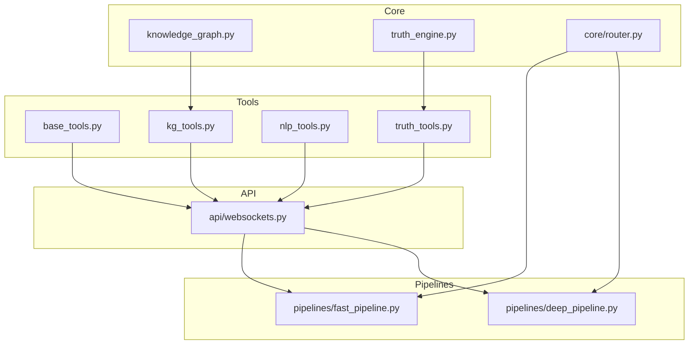
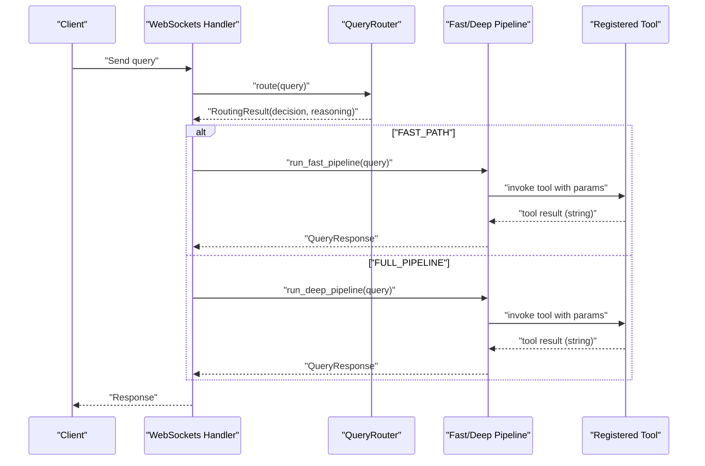
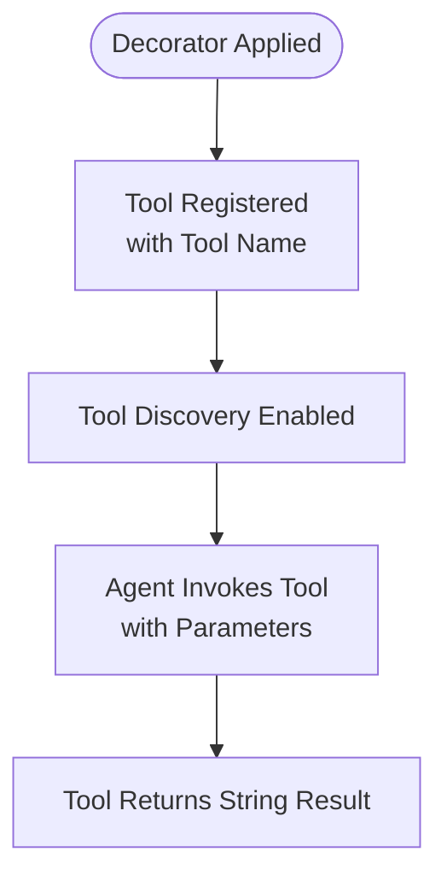
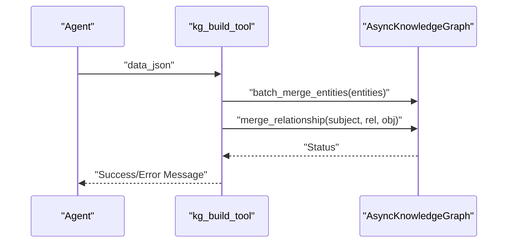
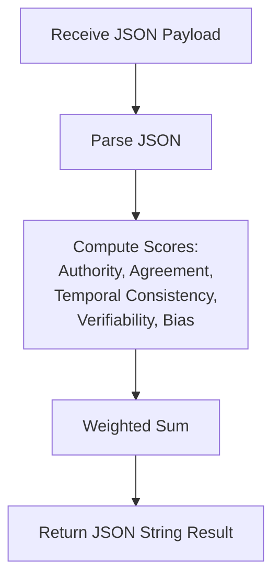
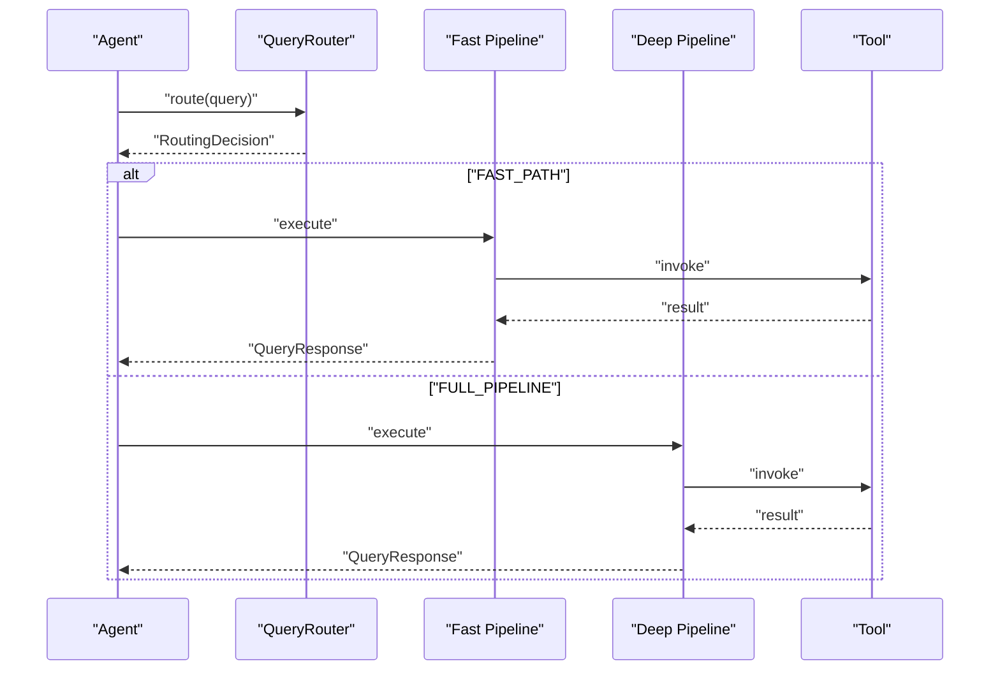
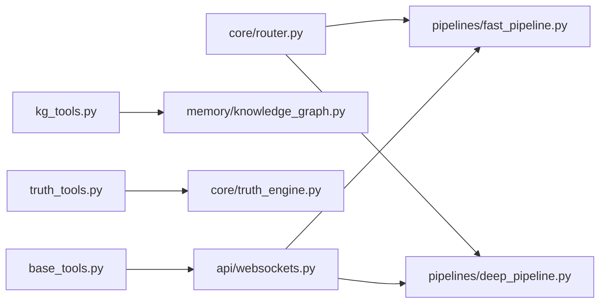

# Base Tool Framework

<cite>
**Referenced Files in This Document**
- [base_tools.py](file://veritas-ai/tools/base_tools.py)
- [kg_tools.py](file://veritas-ai/tools/kg_tools.py)
- [nlp_tools.py](file://veritas-ai/tools/nlp_tools.py)
- [truth_tools.py](file://veritas-ai/tools/truth_tools.py)
- [knowledge_graph.py](file://veritas-ai/memory/knowledge_graph.py)
- [truth_engine.py](file://veritas-ai/core/truth_engine.py)
- [router.py](file://veritas-ai/core/router.py)
- [fast_pipeline.py](file://veritas-ai/pipelines/fast_pipeline.py)
- [deep_pipeline.py](file://veritas-ai/pipelines/deep_pipeline.py)
- [websockets.py](file://veritas-ai/api/websockets.py)
- [settings.py](file://veritas-ai/config/settings.py)
- [main.py](file://veritas-ai/app/main.py)
</cite>

## Table of Contents
1. [Introduction](#introduction)
2. [Project Structure](#project-structure)
3. [Core Components](#core-components)
4. [Architecture Overview](#architecture-overview)
5. [Detailed Component Analysis](#detailed-component-analysis)
6. [Dependency Analysis](#dependency-analysis)
7. [Performance Considerations](#performance-considerations)
8. [Troubleshooting Guide](#troubleshooting-guide)
9. [Conclusion](#conclusion)
10. [Appendices](#appendices)

## Introduction
This document describes the base tool framework that powers Veritas AI’s tool ecosystem. It explains the @tool decorator pattern used to register tools, the standardized interface for tool implementation (input parameters, return types, and error handling), and the tool discovery and execution workflow. It also documents the placeholder system for future tool integration and the semantic search simulation functionality. Finally, it provides guidelines for developing, testing, and debugging tools within the framework.

## Project Structure
The tool framework resides primarily under the tools directory and integrates with core infrastructure such as the Knowledge Graph, Truth Engine, routing, and pipelines.

**Diagram sources**
- [base_tools.py:1-10](file://veritas-ai/tools/base_tools.py#L1-L10)
- [kg_tools.py:1-50](file://veritas-ai/tools/kg_tools.py#L1-L50)
- [nlp_tools.py:1-52](file://veritas-ai/tools/nlp_tools.py#L1-L52)
- [truth_tools.py:1-29](file://veritas-ai/tools/truth_tools.py#L1-L29)
- [knowledge_graph.py:1-160](file://veritas-ai/memory/knowledge_graph.py#L1-L160)
- [truth_engine.py:1-117](file://veritas-ai/core/truth_engine.py#L1-L117)
- [router.py:1-182](file://veritas-ai/core/router.py#L1-L182)
- [fast_pipeline.py:1-22](file://veritas-ai/pipelines/fast_pipeline.py#L1-L22)
- [deep_pipeline.py:1-17](file://veritas-ai/pipelines/deep_pipeline.py#L1-L17)
- [websockets.py:179-211](file://veritas-ai/api/websockets.py#L179-L211)

**Section sources**
- [base_tools.py:1-10](file://veritas-ai/tools/base_tools.py#L1-L10)
- [kg_tools.py:1-50](file://veritas-ai/tools/kg_tools.py#L1-L50)
- [nlp_tools.py:1-52](file://veritas-ai/tools/nlp_tools.py#L1-L52)
- [truth_tools.py:1-29](file://veritas-ai/tools/truth_tools.py#L1-L29)
- [knowledge_graph.py:1-160](file://veritas-ai/memory/knowledge_graph.py#L1-L160)
- [truth_engine.py:1-117](file://veritas-ai/core/truth_engine.py#L1-L117)
- [router.py:1-182](file://veritas-ai/core/router.py#L1-L182)
- [fast_pipeline.py:1-22](file://veritas-ai/pipelines/fast_pipeline.py#L1-L22)
- [deep_pipeline.py:1-17](file://veritas-ai/pipelines/deep_pipeline.py#L1-L17)
- [websockets.py:179-211](file://veritas-ai/api/websockets.py#L179-L211)

## Core Components
- Tool decorators and registration: Tools are registered using the @tool decorator from the LangChain tool library. This enables automatic discovery and invocation within the agent orchestration layer.
- Standardized tool interface:
  - Inputs: Typed parameters (e.g., str, JSON string).
  - Outputs: String responses suitable for downstream processing.
  - Error handling: Explicit error messages returned as strings for predictable downstream handling.
- Placeholder system: A “Search Web Placeholder” tool simulates semantic search and evidence extraction, enabling early-stage integration while backend systems are under construction.
- Semantic search simulation: The placeholder tool returns structured evidence placeholders, allowing pipelines to operate end-to-end during development and testing.

**Section sources**
- [base_tools.py:1-10](file://veritas-ai/tools/base_tools.py#L1-L10)

## Architecture Overview
The tool framework participates in a broader query routing and pipeline execution architecture. Queries are routed to either a fast or full pipeline depending on classification heuristics. Tools are invoked by agents within these pipelines.

**Diagram sources**
- [router.py:99-182](file://veritas-ai/core/router.py#L99-L182)
- [fast_pipeline.py:8-22](file://veritas-ai/pipelines/fast_pipeline.py#L8-L22)
- [deep_pipeline.py:7-17](file://veritas-ai/pipelines/deep_pipeline.py#L7-L17)
- [websockets.py:179-211](file://veritas-ai/api/websockets.py#L179-L211)

## Detailed Component Analysis

### Tool Registration and Decorator Pattern
- Tools are decorated with @tool to register them with the underlying tooling framework.
- The decorator assigns a human-readable tool name and enables automatic discovery and invocation.
- Example registrations:
  - Search Web Placeholder
  - Knowledge Graph Entity Builder
  - Knowledge Graph Validator
  - Clickbait and Fake News Detector
  - Truth Scoring Engine

**Diagram sources**
- [base_tools.py:1-10](file://veritas-ai/tools/base_tools.py#L1-L10)
- [kg_tools.py:1-50](file://veritas-ai/tools/kg_tools.py#L1-L50)
- [nlp_tools.py:1-52](file://veritas-ai/tools/nlp_tools.py#L1-L52)
- [truth_tools.py:1-29](file://veritas-ai/tools/truth_tools.py#L1-L29)

**Section sources**
- [base_tools.py:1-10](file://veritas-ai/tools/base_tools.py#L1-L10)
- [kg_tools.py:1-50](file://veritas-ai/tools/kg_tools.py#L1-L50)
- [nlp_tools.py:1-52](file://veritas-ai/tools/nlp_tools.py#L1-L52)
- [truth_tools.py:1-29](file://veritas-ai/tools/truth_tools.py#L1-L29)

### Standardized Tool Interface
- Input parameters:
  - Strongly typed parameters (e.g., str, JSON string).
  - JSON inputs are parsed with explicit validation.
- Return types:
  - All tools return a string. This ensures consistent handling downstream.
- Error handling:
  - JSON parsing errors return explicit error strings.
  - General exceptions are caught and returned as error messages.

Examples:
- Knowledge Graph Entity Builder expects a JSON payload and returns a status string.
- Truth Scoring Engine expects a JSON payload and returns a JSON stringified result.

**Section sources**
- [kg_tools.py:15-37](file://veritas-ai/tools/kg_tools.py#L15-L37)
- [truth_tools.py:20-28](file://veritas-ai/tools/truth_tools.py#L20-L28)

### Placeholder System for Future Tool Integration
- The Search Web Placeholder simulates semantic search and returns a structured placeholder response.
- This enables end-to-end pipeline testing and integration prior to connecting real APIs or scraping engines.
- The placeholder’s docstring indicates planned integration with News APIs and web scraping.

**Section sources**
- [base_tools.py:3-9](file://veritas-ai/tools/base_tools.py#L3-L9)

### Semantic Search Simulation Functionality
- The placeholder tool returns a deterministic string containing simulated evidence placeholders.
- This allows downstream components (e.g., retrieval, validation, response generation) to operate consistently during development and testing.

**Section sources**
- [base_tools.py:4-9](file://veritas-ai/tools/base_tools.py#L4-L9)

### Knowledge Graph Tools
- Entity Builder:
  - Accepts a JSON payload describing entities and relationships.
  - Validates labels and relationship types against allowed sets.
  - Merges entities and relationships asynchronously into the Knowledge Graph.
- Validator:
  - Queries the Knowledge Graph for relationships of a given entity.
  - Returns a string summary of relationships.

**Diagram sources**
- [kg_tools.py:15-37](file://veritas-ai/tools/kg_tools.py#L15-L37)
- [knowledge_graph.py:114-131](file://veritas-ai/memory/knowledge_graph.py#L114-L131)

**Section sources**
- [kg_tools.py:5-49](file://veritas-ai/tools/kg_tools.py#L5-L49)
- [knowledge_graph.py:12-131](file://veritas-ai/memory/knowledge_graph.py#L12-L131)

### Truth Scoring Engine
- Accepts a JSON payload with specific keys and computes a Truth Score using weighted factors.
- Returns a JSON stringified result containing the score and breakdown.

**Diagram sources**
- [truth_tools.py:20-28](file://veritas-ai/tools/truth_tools.py#L20-L28)
- [truth_engine.py:78-117](file://veritas-ai/core/truth_engine.py#L78-L117)

**Section sources**
- [truth_tools.py:5-28](file://veritas-ai/tools/truth_tools.py#L5-L28)
- [truth_engine.py:3-117](file://veritas-ai/core/truth_engine.py#L3-L117)

### NLP Fake News Detection Tool
- Lazily loads a transformer-based classifier on first use.
- Truncates input text to fit token limits and returns classification results as a string.
- Handles missing dependencies gracefully by returning a message indicating unavailability.

**Section sources**
- [nlp_tools.py:8-52](file://veritas-ai/tools/nlp_tools.py#L8-L52)

### Tool Discovery and Execution Workflow
- Discovery: Tools are discovered via the @tool decorator and registered with the tooling framework.
- Execution: During pipeline execution, agents invoke tools with appropriate parameters. Results are returned as strings for downstream processing.

**Diagram sources**
- [router.py:99-182](file://veritas-ai/core/router.py#L99-L182)
- [fast_pipeline.py:8-22](file://veritas-ai/pipelines/fast_pipeline.py#L8-L22)
- [deep_pipeline.py:7-17](file://veritas-ai/pipelines/deep_pipeline.py#L7-L17)

**Section sources**
- [router.py:99-182](file://veritas-ai/core/router.py#L99-L182)
- [fast_pipeline.py:8-22](file://veritas-ai/pipelines/fast_pipeline.py#L8-L22)
- [deep_pipeline.py:7-17](file://veritas-ai/pipelines/deep_pipeline.py#L7-L17)

### Example: Implementing a Custom Tool Using the Base Framework
Steps to implement a new tool:
1. Define a function with a single typed parameter (e.g., str) and return a string.
2. Decorate the function with @tool and provide a descriptive tool name.
3. Add robust error handling and return explicit error messages as strings.
4. Integrate the tool into the agent orchestration layer so it can be discovered and invoked.

Guidelines:
- Keep inputs simple and strongly typed.
- Always return a string to maintain consistency.
- Validate inputs early and fail fast with clear error messages.
- Avoid blocking operations; prefer asynchronous patterns where applicable.

**Section sources**
- [base_tools.py:1-10](file://veritas-ai/tools/base_tools.py#L1-L10)
- [kg_tools.py:15-37](file://veritas-ai/tools/kg_tools.py#L15-L37)
- [truth_tools.py:20-28](file://veritas-ai/tools/truth_tools.py#L20-L28)

## Dependency Analysis
The tool framework interacts with routing, pipelines, and core services. The following diagram shows key dependencies among components.

**Diagram sources**
- [base_tools.py:1-10](file://veritas-ai/tools/base_tools.py#L1-L10)
- [kg_tools.py:1-50](file://veritas-ai/tools/kg_tools.py#L1-L50)
- [truth_tools.py:1-29](file://veritas-ai/tools/truth_tools.py#L1-L29)
- [knowledge_graph.py:1-160](file://veritas-ai/memory/knowledge_graph.py#L1-L160)
- [truth_engine.py:1-117](file://veritas-ai/core/truth_engine.py#L1-L117)
- [router.py:1-182](file://veritas-ai/core/router.py#L1-L182)
- [fast_pipeline.py:1-22](file://veritas-ai/pipelines/fast_pipeline.py#L1-L22)
- [deep_pipeline.py:1-17](file://veritas-ai/pipelines/deep_pipeline.py#L1-L17)
- [websockets.py:179-211](file://veritas-ai/api/websockets.py#L179-L211)

**Section sources**
- [router.py:1-182](file://veritas-ai/core/router.py#L1-L182)
- [fast_pipeline.py:1-22](file://veritas-ai/pipelines/fast_pipeline.py#L1-L22)
- [deep_pipeline.py:1-17](file://veritas-ai/pipelines/deep_pipeline.py#L1-L17)
- [websockets.py:179-211](file://veritas-ai/api/websockets.py#L179-L211)

## Performance Considerations
- Tool concurrency: The system supports a configurable maximum number of parallel tools to prevent resource exhaustion.
- Streaming: Optional streaming support can improve perceived latency for long-running tools.
- Caching: Responses are cached at multiple layers (local and Redis) to reduce repeated computation.

Recommendations:
- Prefer lightweight tools for fast-path queries.
- Use batching for tools that manipulate the Knowledge Graph.
- Monitor tool execution metrics and adjust concurrency thresholds based on observed performance.

**Section sources**
- [settings.py:73-75](file://veritas-ai/config/settings.py#L73-L75)
- [router.py:90-94](file://veritas-ai/core/router.py#L90-L94)

## Troubleshooting Guide
Common issues and resolutions:
- JSON parsing failures:
  - Symptom: Tools return explicit JSON parse errors.
  - Resolution: Ensure inputs strictly match documented JSON schemas.
- Knowledge Graph connectivity:
  - Symptom: Tools report graph offline or rejected relationships.
  - Resolution: Verify Neo4j credentials and connectivity; check allowed labels and relationship types.
- NLP model availability:
  - Symptom: NLP tool returns unavailability message.
  - Resolution: Install required packages (transformers, torch) or disable NLP-dependent features.
- Tool timeouts:
  - Symptom: Requests timeout during pipeline execution.
  - Resolution: Increase timeout settings or optimize tool logic.

**Section sources**
- [kg_tools.py:34-37](file://veritas-ai/tools/kg_tools.py#L34-L37)
- [knowledge_graph.py:36-38](file://veritas-ai/memory/knowledge_graph.py#L36-L38)
- [nlp_tools.py:19-24](file://veritas-ai/tools/nlp_tools.py#L19-L24)
- [main.py:127-148](file://veritas-ai/app/main.py#L127-L148)

## Conclusion
The base tool framework provides a consistent, discoverable, and extensible foundation for building tools within Veritas AI. By adhering to the standardized interface, leveraging the @tool decorator pattern, and following the error-handling and performance guidelines, developers can implement robust tools that integrate seamlessly with the routing and pipeline layers. The placeholder system and semantic search simulation enable rapid iteration and end-to-end testing during development.

## Appendices
- Tool naming and discovery: Tools are identified by their decorator-assigned names and are discoverable by the agent orchestration layer.
- Pipeline integration: Tools are invoked by agents within fast and deep pipelines, returning string results for downstream processing.

[No sources needed since this section provides general guidance]