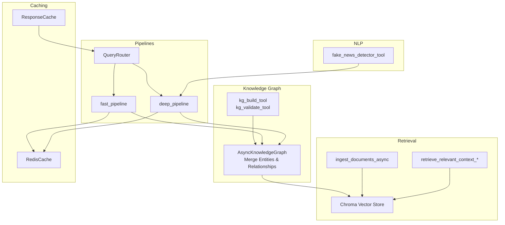
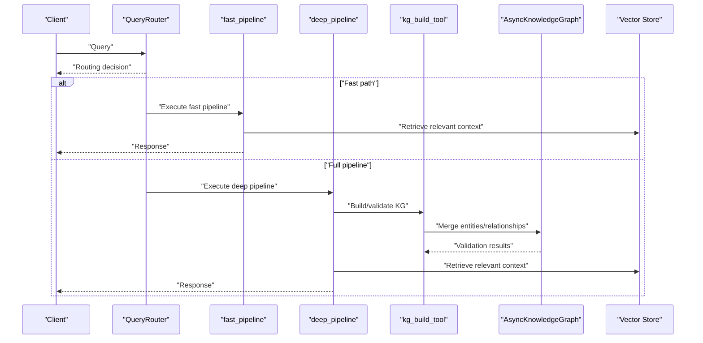
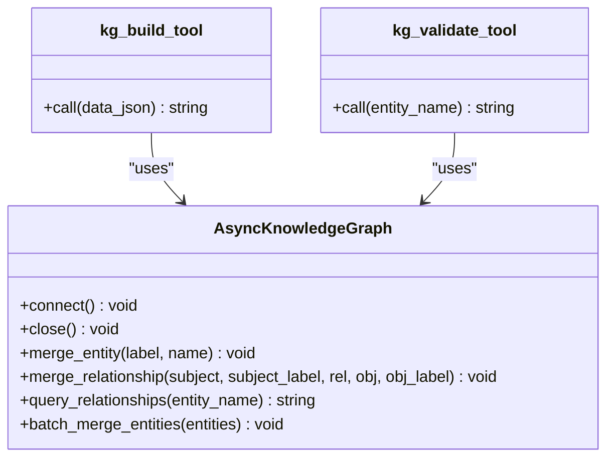
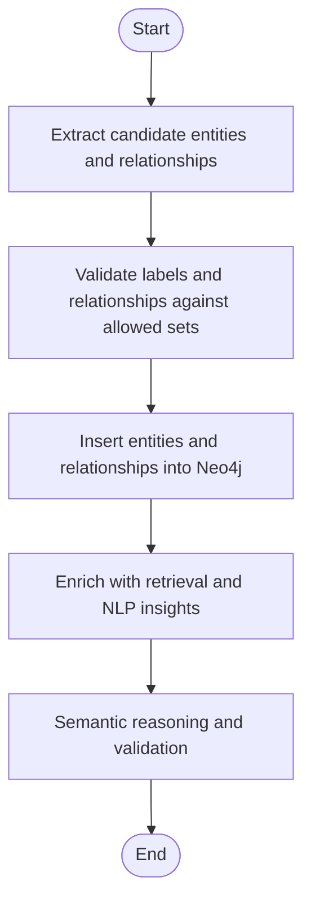
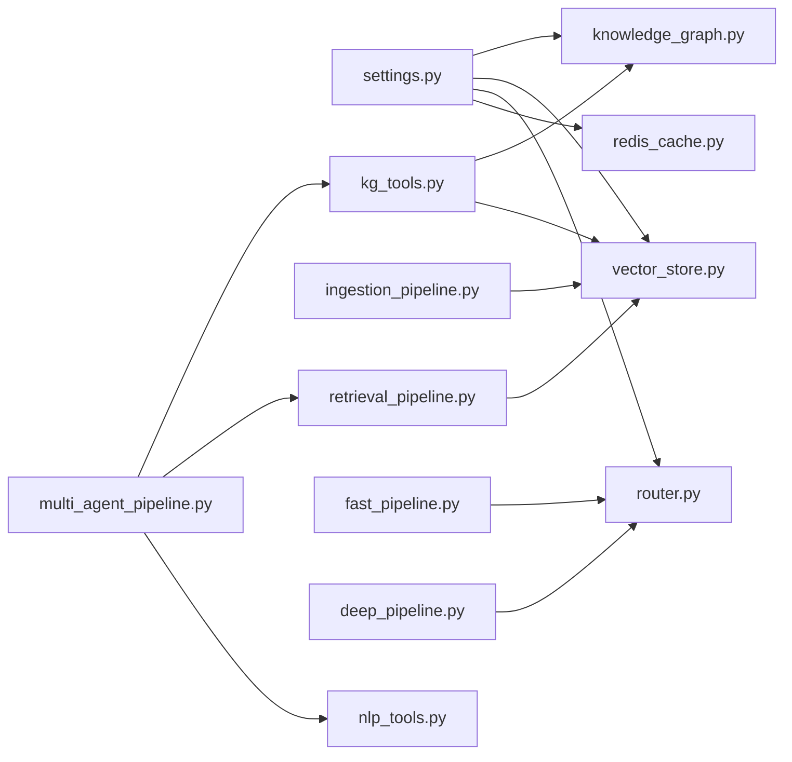

# Knowledge Graph Tools

<cite>
**Referenced Files in This Document**
- [knowledge_graph.py](file://veritas-ai/memory/knowledge_graph.py)
- [kg_tools.py](file://veritas-ai/tools/kg_tools.py)
- [settings.py](file://veritas-ai/config/settings.py)
- [vector_store.py](file://veritas-ai/memory/vector_store.py)
- [ingestion_pipeline.py](file://veritas-ai/pipelines/ingestion_pipeline.py)
- [retrieval_pipeline.py](file://veritas-ai/pipelines/retrieval_pipeline.py)
- [nlp_tools.py](file://veritas-ai/tools/nlp_tools.py)
- [multi_agent_pipeline.py](file://veritas-ai/pipelines/multi_agent_pipeline.py)
- [fast_pipeline.py](file://veritas-ai/pipelines/fast_pipeline.py)
- [deep_pipeline.py](file://veritas-ai/pipelines/deep_pipeline.py)
- [router.py](file://veritas-ai/core/router.py)
- [redis_cache.py](file://veritas-ai/core/redis_cache.py)
- [cache_layer.py](file://veritas-ai/core/cache_layer.py)
- [schemas.py](file://veritas-ai/models/schemas.py)
</cite>

## Table of Contents
1. [Introduction](#introduction)
2. [Project Structure](#project-structure)
3. [Core Components](#core-components)
4. [Architecture Overview](#architecture-overview)
5. [Detailed Component Analysis](#detailed-component-analysis)
6. [Dependency Analysis](#dependency-analysis)
7. [Performance Considerations](#performance-considerations)
8. [Troubleshooting Guide](#troubleshooting-guide)
9. [Conclusion](#conclusion)

## Introduction
This document describes the knowledge graph tools and workflows that power entity extraction, relationship mapping, and semantic reasoning in the system. It explains how structured entities and relationships are ingested into a graph database, validated against supported label and relationship types, and integrated with retrieval and multi-agent verification pipelines. It also covers configuration options, performance characteristics for large-scale operations, and optimization strategies for query execution.

## Project Structure
The knowledge graph functionality spans several modules:
- Memory and persistence: graph driver and entity/relationship storage
- Tooling: LangChain tools to build and validate the knowledge graph
- Pipelines: ingestion of textual content into a vector store and retrieval of relevant context
- Routing and caching: query classification and caching to optimize performance
- Multi-agent orchestration: validation and enrichment of knowledge graph-backed claims

**Diagram sources**
- [knowledge_graph.py:12-160](file://veritas-ai/memory/knowledge_graph.py#L12-L160)
- [kg_tools.py:5-50](file://veritas-ai/tools/kg_tools.py#L5-L50)
- [vector_store.py:15-27](file://veritas-ai/memory/vector_store.py#L15-L27)
- [ingestion_pipeline.py:7-38](file://veritas-ai/pipelines/ingestion_pipeline.py#L7-L38)
- [retrieval_pipeline.py:29-112](file://veritas-ai/pipelines/retrieval_pipeline.py#L29-L112)
- [fast_pipeline.py:8-22](file://veritas-ai/pipelines/fast_pipeline.py#L8-L22)
- [deep_pipeline.py:7-17](file://veritas-ai/pipelines/deep_pipeline.py#L7-L17)
- [router.py:83-182](file://veritas-ai/core/router.py#L83-L182)
- [redis_cache.py:18-232](file://veritas-ai/core/redis_cache.py#L18-L232)
- [cache_layer.py:10-41](file://veritas-ai/core/cache_layer.py#L10-L41)
- [nlp_tools.py:27-52](file://veritas-ai/tools/nlp_tools.py#L27-L52)

**Section sources**
- [knowledge_graph.py:12-160](file://veritas-ai/memory/knowledge_graph.py#L12-L160)
- [kg_tools.py:5-50](file://veritas-ai/tools/kg_tools.py#L5-L50)
- [vector_store.py:15-27](file://veritas-ai/memory/vector_store.py#L15-L27)
- [ingestion_pipeline.py:7-38](file://veritas-ai/pipelines/ingestion_pipeline.py#L7-L38)
- [retrieval_pipeline.py:29-112](file://veritas-ai/pipelines/retrieval_pipeline.py#L29-L112)
- [router.py:83-182](file://veritas-ai/core/router.py#L83-L182)
- [redis_cache.py:18-232](file://veritas-ai/core/redis_cache.py#L18-L232)
- [cache_layer.py:10-41](file://veritas-ai/core/cache_layer.py#L10-L41)
- [nlp_tools.py:27-52](file://veritas-ai/tools/nlp_tools.py#L27-L52)

## Core Components
- AsyncKnowledgeGraph: asynchronous client for Neo4j that merges nodes and relationships, enforces allowed label and relationship sets, and supports batch entity insertion and relationship queries.
- kg_build_tool and kg_validate_tool: LangChain tools to ingest structured entity/relationship JSON and to validate/query relationships for a given entity.
- Vector store and retrieval: Chroma-backed vector store with configurable embedding model and retrieval helpers, including caching and batching.
- Query routing and caching: lightweight regex-based query classification and multi-level caching (local TTL and Redis) to accelerate responses.
- Multi-agent pipelines: fast and deep pipelines that integrate knowledge graph validation and NLP-based misinformation detection.

**Section sources**
- [knowledge_graph.py:12-160](file://veritas-ai/memory/knowledge_graph.py#L12-L160)
- [kg_tools.py:5-50](file://veritas-ai/tools/kg_tools.py#L5-L50)
- [vector_store.py:15-27](file://veritas-ai/memory/vector_store.py#L15-L27)
- [retrieval_pipeline.py:29-112](file://veritas-ai/pipelines/retrieval_pipeline.py#L29-L112)
- [router.py:83-182](file://veritas-ai/core/router.py#L83-L182)
- [redis_cache.py:18-232](file://veritas-ai/core/redis_cache.py#L18-L232)
- [cache_layer.py:10-41](file://veritas-ai/core/cache_layer.py#L10-L41)
- [nlp_tools.py:27-52](file://veritas-ai/tools/nlp_tools.py#L27-L52)

## Architecture Overview
The knowledge graph tools integrate with retrieval and multi-agent verification to form a complete truth and verification pipeline. At a high level:
- Text ingestion produces vector embeddings stored in Chroma.
- Structured knowledge is inserted into Neo4j via tools and validated through graph queries.
- Retrieval pulls semantically similar chunks to inform validation.
- Query routing selects fast or full pipelines, using caches to reduce latency.
- NLP tools complement graph validation with misinformation detection.

**Diagram sources**
- [router.py:99-182](file://veritas-ai/core/router.py#L99-L182)
- [fast_pipeline.py:8-22](file://veritas-ai/pipelines/fast_pipeline.py#L8-L22)
- [deep_pipeline.py:7-17](file://veritas-ai/pipelines/deep_pipeline.py#L7-L17)
- [kg_tools.py:5-50](file://veritas-ai/tools/kg_tools.py#L5-L50)
- [knowledge_graph.py:45-132](file://veritas-ai/memory/knowledge_graph.py#L45-L132)
- [retrieval_pipeline.py:29-112](file://veritas-ai/pipelines/retrieval_pipeline.py#L29-L112)

## Detailed Component Analysis

### Knowledge Graph Storage and Tools
- Allowed types and relationships: enforced sets restrict labels and relationship types to a controlled vocabulary to maintain graph integrity.
- Entity merging: supports single and batch entity insertion with label validation.
- Relationship merging: matches subjects and objects by name and label, then merges directed relationships.
- Validation query: retrieves outgoing relationships for a named entity with a bounded result set.
- Tool integration: kg_build_tool ingests JSON with entities and relationships; kg_validate_tool queries relationships for a given entity.

**Diagram sources**
- [knowledge_graph.py:12-160](file://veritas-ai/memory/knowledge_graph.py#L12-L160)
- [kg_tools.py:5-50](file://veritas-ai/tools/kg_tools.py#L5-L50)

**Section sources**
- [knowledge_graph.py:8-132](file://veritas-ai/memory/knowledge_graph.py#L8-L132)
- [kg_tools.py:5-50](file://veritas-ai/tools/kg_tools.py#L5-L50)

### Entity Recognition and Relationship Mapping
- Entity recognition: performed upstream by the multi-agent pipeline’s research phase; the resulting facts and sources are passed to downstream stages.
- Relationship mapping: constructed by the research and validation agents and ingested via kg_build_tool into the graph with controlled label and relationship sets.
- Semantic reasoning: leveraged during validation and response building; graph validation is explicitly invoked by kg_validate_tool and integrated into multi-agent workflows.

[No sources needed since this diagram shows conceptual workflow, not actual code structure]

**Section sources**
- [multi_agent_pipeline.py:209-332](file://veritas-ai/pipelines/multi_agent_pipeline.py#L209-L332)
- [kg_tools.py:5-50](file://veritas-ai/tools/kg_tools.py#L5-L50)
- [knowledge_graph.py:45-132](file://veritas-ai/memory/knowledge_graph.py#L45-L132)

### Knowledge Representation Formats
- Entities: labeled nodes with a name property; labels are restricted to a predefined set.
- Relationships: directed edges with a type constrained to a predefined set; both subject and object are matched by label and name.
- Validation output: returned as a human-readable string summarizing relationships discovered in the graph for a given entity.

**Section sources**
- [knowledge_graph.py:8-112](file://veritas-ai/memory/knowledge_graph.py#L8-L112)

### Integration with Graph Databases
- Neo4j driver: configured with connection pooling and connectivity verification; credentials and URI are managed via settings.
- Persistence: entities and relationships are merged using Cypher queries; batch operations reduce overhead.

**Section sources**
- [knowledge_graph.py:25-44](file://veritas-ai/memory/knowledge_graph.py#L25-L44)
- [settings.py:64-68](file://veritas-ai/config/settings.py#L64-L68)

### Handling Complex Semantic Relationships
- Multi-agent pipeline orchestrates parallel agents for verification, fact-checking, and misinformation analysis; knowledge graph validation is part of the toolset used by these agents.
- Retrieval augments validation with semantically similar context from the vector store.
- NLP tools complement graph validation by detecting sensationalism and misleading content.

**Section sources**
- [multi_agent_pipeline.py:146-207](file://veritas-ai/pipelines/multi_agent_pipeline.py#L146-L207)
- [retrieval_pipeline.py:29-112](file://veritas-ai/pipelines/retrieval_pipeline.py#L29-L112)
- [nlp_tools.py:27-52](file://veritas-ai/tools/nlp_tools.py#L27-L52)

### Knowledge Enrichment and Cross-Source Linking
- Retrieval pipeline: splits documents into chunks, embeds them, and stores them in Chroma; retrieval supports filtering and caching.
- Multi-agent pipeline: gathers sources from multiple providers and enriches reports with validation outputs; graph validation is used to cross-check claims.
- Cross-linking: achieved by matching entities across sources and inserting them into the graph with relationships; kg_validate_tool surfaces explicit relationships for a given entity.

**Section sources**
- [ingestion_pipeline.py:7-38](file://veritas-ai/pipelines/ingestion_pipeline.py#L7-L38)
- [retrieval_pipeline.py:29-112](file://veritas-ai/pipelines/retrieval_pipeline.py#L29-L112)
- [multi_agent_pipeline.py:209-332](file://veritas-ai/pipelines/multi_agent_pipeline.py#L209-L332)
- [kg_tools.py:5-50](file://veritas-ai/tools/kg_tools.py#L5-L50)

### Configuration Options
- Knowledge Graph: Neo4j URI, user, and password.
- Vector store: embedding model name and Chroma persistence directory.
- Retrieval: number of results to return (top-k).
- Caching: TTL and maximum entries for response cache; Redis host/port/database.
- Performance: maximum parallel tools, streaming enablement, and chunk sizes.

**Section sources**
- [settings.py:50-76](file://veritas-ai/config/settings.py#L50-L76)
- [settings.py:64-68](file://veritas-ai/config/settings.py#L64-L68)

## Dependency Analysis
The following diagram highlights key dependencies among components involved in knowledge graph operations.

**Diagram sources**
- [settings.py:50-76](file://veritas-ai/config/settings.py#L50-L76)
- [knowledge_graph.py:25-44](file://veritas-ai/memory/knowledge_graph.py#L25-L44)
- [vector_store.py:15-27](file://veritas-ai/memory/vector_store.py#L15-L27)
- [router.py:99-182](file://veritas-ai/core/router.py#L99-L182)
- [redis_cache.py:30-52](file://veritas-ai/core/redis_cache.py#L30-L52)
- [kg_tools.py:5-50](file://veritas-ai/tools/kg_tools.py#L5-L50)
- [ingestion_pipeline.py:7-38](file://veritas-ai/pipelines/ingestion_pipeline.py#L7-L38)
- [retrieval_pipeline.py:29-112](file://veritas-ai/pipelines/retrieval_pipeline.py#L29-L112)
- [fast_pipeline.py:8-22](file://veritas-ai/pipelines/fast_pipeline.py#L8-L22)
- [deep_pipeline.py:7-17](file://veritas-ai/pipelines/deep_pipeline.py#L7-L17)
- [multi_agent_pipeline.py:209-332](file://veritas-ai/pipelines/multi_agent_pipeline.py#L209-L332)
- [nlp_tools.py:27-52](file://veritas-ai/tools/nlp_tools.py#L27-L52)

**Section sources**
- [settings.py:50-76](file://veritas-ai/config/settings.py#L50-L76)
- [knowledge_graph.py:25-44](file://veritas-ai/memory/knowledge_graph.py#L25-L44)
- [vector_store.py:15-27](file://veritas-ai/memory/vector_store.py#L15-L27)
- [router.py:99-182](file://veritas-ai/core/router.py#L99-L182)
- [redis_cache.py:30-52](file://veritas-ai/core/redis_cache.py#L30-L52)
- [kg_tools.py:5-50](file://veritas-ai/tools/kg_tools.py#L5-L50)
- [ingestion_pipeline.py:7-38](file://veritas-ai/pipelines/ingestion_pipeline.py#L7-L38)
- [retrieval_pipeline.py:29-112](file://veritas-ai/pipelines/retrieval_pipeline.py#L29-L112)
- [fast_pipeline.py:8-22](file://veritas-ai/pipelines/fast_pipeline.py#L8-L22)
- [deep_pipeline.py:7-17](file://veritas-ai/pipelines/deep_pipeline.py#L7-L17)
- [multi_agent_pipeline.py:209-332](file://veritas-ai/pipelines/multi_agent_pipeline.py#L209-L332)
- [nlp_tools.py:27-52](file://veritas-ai/tools/nlp_tools.py#L27-L52)

## Performance Considerations
- Asynchronous graph operations: batch entity merging reduces round-trips; async sessions minimize blocking.
- Retrieval batching: chunking and batched embedding insertion prevent CPU saturation and tensor collisions.
- Caching layers: local TTL cache plus Redis cache significantly reduce latency for repeated queries and retrieval results.
- Query routing: early classification avoids expensive full pipelines for simple queries.
- Concurrency controls: semaphores and parallel gathering of tasks balance throughput and resource usage.
- Embedding and vector store tuning: configurable embedding model and top-k retrieval help tune accuracy vs. latency.

[No sources needed since this section provides general guidance]

## Troubleshooting Guide
- Neo4j connectivity: connection attempts verify connectivity; failures are logged and the driver remains unset.
- Validation warnings: unsupported labels or relationships are rejected with warnings; ensure inputs conform to allowed sets.
- JSON parsing errors: kg_build_tool returns explicit errors when the payload fails strict JSON parsing.
- Retrieval cache misses: vector cache falls back to recomputation and populates cache asynchronously; check Redis availability.
- Pipeline timeouts: multi-agent pipeline and Crew tasks enforce timeouts; failures are captured and surfaced as fallback responses.
- NLP model availability: fake news detector gracefully handles missing transformers and returns a message indicating unavailability.

**Section sources**
- [knowledge_graph.py:25-44](file://veritas-ai/memory/knowledge_graph.py#L25-L44)
- [knowledge_graph.py:48-75](file://veritas-ai/memory/knowledge_graph.py#L48-L75)
- [kg_tools.py:34-37](file://veritas-ai/tools/kg_tools.py#L34-L37)
- [retrieval_pipeline.py:53-71](file://veritas-ai/pipelines/retrieval_pipeline.py#L53-L71)
- [multi_agent_pipeline.py:60-72](file://veritas-ai/pipelines/multi_agent_pipeline.py#L60-L72)
- [nlp_tools.py:19-25](file://veritas-ai/tools/nlp_tools.py#L19-L25)

## Conclusion
The knowledge graph tools provide a robust foundation for entity extraction, relationship mapping, and semantic reasoning. They integrate tightly with retrieval and multi-agent verification pipelines, leveraging caching and asynchronous operations to achieve low-latency, scalable performance. Configuration options allow tuning for accuracy and throughput, while built-in safeguards ensure resilient operation under varied conditions.