# NLP Processing Tools

<cite>
**Referenced Files in This Document**
- [nlp_tools.py](file://veritas-ai/tools/nlp_tools.py)
- [llm.py](file://veritas-ai/models/llm.py)
- [schemas.py](file://veritas-ai/models/schemas.py)
- [router.py](file://veritas-ai/core/router.py)
- [settings.py](file://veritas-ai/config/settings.py)
- [fast_pipeline.py](file://veritas-ai/pipelines/fast_pipeline.py)
- [deep_pipeline.py](file://veritas-ai/pipelines/deep_pipeline.py)
- [validation.py](file://veritas-ai/app/agents/validation.py)
- [retrieval.py](file://veritas-ai/app/agents/retrieval.py)
- [knowledge_graph.py](file://veritas-ai/memory/knowledge_graph.py)
- [vector_store.py](file://veritas-ai/memory/vector_store.py)
- [emotion.py](file://veritas-ai/app/voice/emotion.py)
- [kg_tools.py](file://veritas-ai/tools/kg_tools.py)
</cite>

## Table of Contents
1. [Introduction](#introduction)
2. [Project Structure](#project-structure)
3. [Core Components](#core-components)
4. [Architecture Overview](#architecture-overview)
5. [Detailed Component Analysis](#detailed-component-analysis)
6. [Dependency Analysis](#dependency-analysis)
7. [Performance Considerations](#performance-considerations)
8. [Troubleshooting Guide](#troubleshooting-guide)
9. [Conclusion](#conclusion)
10. [Appendices](#appendices)

## Introduction
This document describes the NLP processing tools and workflows within the Veritas AI system. It focuses on text preprocessing, tokenization, and normalization practices; sentiment and clickbait/fake news detection; entity recognition and knowledge graph integration; and the orchestration of language model pipelines. It also covers configuration options, performance optimization techniques, and integration patterns with retrieval, validation, and explainability layers.

## Project Structure
The NLP-related capabilities are distributed across several modules:
- Tools expose NLP functions as LangChain-compatible tools.
- Models define LLM initialization and observability hooks.
- Pipelines coordinate retrieval, validation, and response generation.
- Agents implement retrieval, validation, and explainability logic.
- Memory stores provide vector and graph-backed knowledge.
- Config centralizes runtime settings for models, caches, and performance.

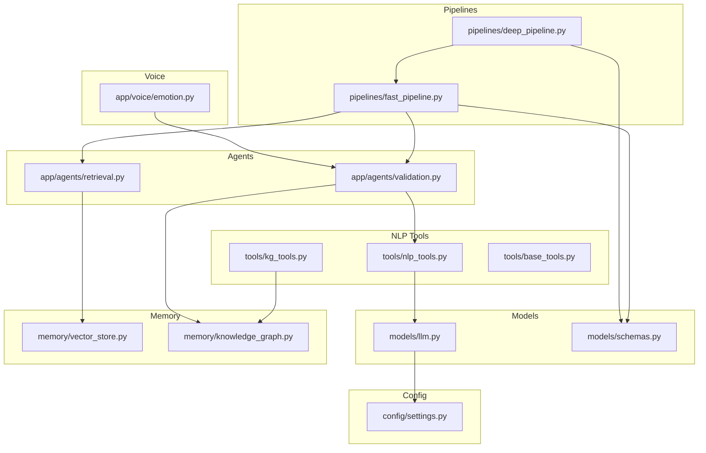

**Diagram sources**
- [nlp_tools.py:1-52](file://veritas-ai/tools/nlp_tools.py#L1-L52)
- [kg_tools.py:1-49](file://veritas-ai/tools/kg_tools.py#L1-L49)
- [llm.py:1-61](file://veritas-ai/models/llm.py#L1-L61)
- [schemas.py:1-88](file://veritas-ai/models/schemas.py#L1-L88)
- [fast_pipeline.py:1-22](file://veritas-ai/pipelines/fast_pipeline.py#L1-L22)
- [deep_pipeline.py:1-17](file://veritas-ai/pipelines/deep_pipeline.py#L1-L17)
- [retrieval.py:1-101](file://veritas-ai/app/agents/retrieval.py#L1-L101)
- [validation.py:1-314](file://veritas-ai/app/agents/validation.py#L1-L314)
- [vector_store.py:1-27](file://veritas-ai/memory/vector_store.py#L1-L27)
- [knowledge_graph.py:1-160](file://veritas-ai/memory/knowledge_graph.py#L1-L160)
- [settings.py:1-83](file://veritas-ai/config/settings.py#L1-L83)
- [emotion.py:1-52](file://veritas-ai/app/voice/emotion.py#L1-L52)

**Section sources**
- [nlp_tools.py:1-52](file://veritas-ai/tools/nlp_tools.py#L1-L52)
- [llm.py:1-61](file://veritas-ai/models/llm.py#L1-L61)
- [schemas.py:1-88](file://veritas-ai/models/schemas.py#L1-L88)
- [fast_pipeline.py:1-22](file://veritas-ai/pipelines/fast_pipeline.py#L1-L22)
- [deep_pipeline.py:1-17](file://veritas-ai/pipelines/deep_pipeline.py#L1-L17)
- [retrieval.py:1-101](file://veritas-ai/app/agents/retrieval.py#L1-L101)
- [validation.py:1-314](file://veritas-ai/app/agents/validation.py#L1-L314)
- [vector_store.py:1-27](file://veritas-ai/memory/vector_store.py#L1-L27)
- [knowledge_graph.py:1-160](file://veritas-ai/memory/knowledge_graph.py#L1-L160)
- [settings.py:1-83](file://veritas-ai/config/settings.py#L1-L83)
- [emotion.py:1-52](file://veritas-ai/app/voice/emotion.py#L1-L52)

## Core Components
- NLP Tools
  - Fake news and clickbait detection via a transformer-based text classifier.
  - Knowledge graph ingestion and validation tools.
- LLM Integration
  - Local LLM initialization with observability callback and SQLite caching.
- Pipelines
  - Fast path: minimal retrieval and validation.
  - Deep path: multi-agent pipeline executed in a background task.
- Agents
  - Retrieval agent: identifies sources and initial credibility.
  - Validation agent: computes truth score, applies firewall, consensus, and explainability.
- Memory
  - Vector store backed by Ollama embeddings and Chroma.
  - Asynchronous Neo4j knowledge graph with batching and connection pooling.
- Configuration
  - Centralized settings for models, caches, and performance tuning.

**Section sources**
- [nlp_tools.py:1-52](file://veritas-ai/tools/nlp_tools.py#L1-L52)
- [kg_tools.py:1-49](file://veritas-ai/tools/kg_tools.py#L1-L49)
- [llm.py:1-61](file://veritas-ai/models/llm.py#L1-L61)
- [fast_pipeline.py:1-22](file://veritas-ai/pipelines/fast_pipeline.py#L1-L22)
- [deep_pipeline.py:1-17](file://veritas-ai/pipelines/deep_pipeline.py#L1-L17)
- [retrieval.py:1-101](file://veritas-ai/app/agents/retrieval.py#L1-L101)
- [validation.py:1-314](file://veritas-ai/app/agents/validation.py#L1-L314)
- [vector_store.py:1-27](file://veritas-ai/memory/vector_store.py#L1-L27)
- [knowledge_graph.py:1-160](file://veritas-ai/memory/knowledge_graph.py#L1-L160)
- [settings.py:1-83](file://veritas-ai/config/settings.py#L1-L83)

## Architecture Overview
The NLP processing architecture integrates tool-based classification, retrieval-driven fact-checking, and validation with explainability. Routing selects between fast and full pipelines, while memory systems support retrieval and knowledge graph operations.

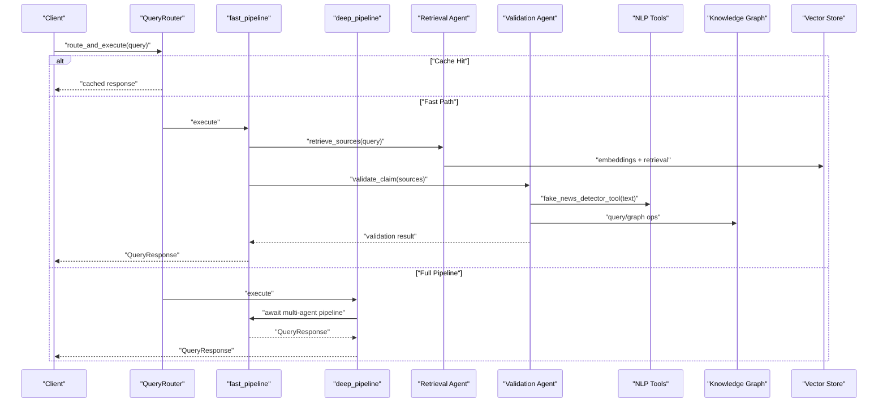

**Diagram sources**
- [router.py:99-181](file://veritas-ai/core/router.py#L99-L181)
- [fast_pipeline.py:8-22](file://veritas-ai/pipelines/fast_pipeline.py#L8-L22)
- [deep_pipeline.py:7-17](file://veritas-ai/pipelines/deep_pipeline.py#L7-L17)
- [retrieval.py:36-101](file://veritas-ai/app/agents/retrieval.py#L36-L101)
- [validation.py:278-314](file://veritas-ai/app/agents/validation.py#L278-L314)
- [nlp_tools.py:27-51](file://veritas-ai/tools/nlp_tools.py#L27-L51)
- [knowledge_graph.py:88-112](file://veritas-ai/memory/knowledge_graph.py#L88-L112)
- [vector_store.py:15-27](file://veritas-ai/memory/vector_store.py#L15-L27)

## Detailed Component Analysis

### Text Preprocessing, Tokenization, and Normalization
- Preprocessing
  - Text truncation is applied prior to classification to fit model token limits.
  - Query classification uses lightweight regex patterns and trigger words to normalize intent and route appropriately.
- Tokenization and Normalization
  - Embedding and vector store initialization use Ollama embeddings with configurable model and base URL.
  - Knowledge graph operations normalize entity labels and relationships to supported sets.

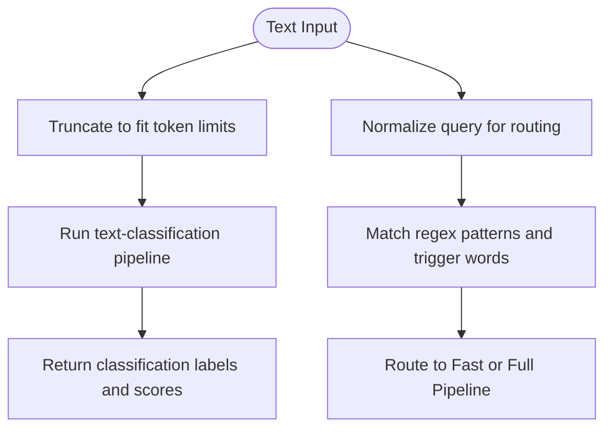

**Diagram sources**
- [nlp_tools.py:37-51](file://veritas-ai/tools/nlp_tools.py#L37-L51)
- [router.py:61-81](file://veritas-ai/core/router.py#L61-L81)
- [vector_store.py:8-13](file://veritas-ai/memory/vector_store.py#L8-L13)

**Section sources**
- [nlp_tools.py:37-51](file://veritas-ai/tools/nlp_tools.py#L37-L51)
- [router.py:32-81](file://veritas-ai/core/router.py#L32-L81)
- [vector_store.py:8-13](file://veritas-ai/memory/vector_store.py#L8-L13)

### Sentiment Analysis and Emotion Detection
- Keyword-based emotion detection maps text to categories (urgent, concerned, positive, negative, neutral) and adjusts TTS voice parameters accordingly.
- This provides a lightweight, deterministic sentiment signal integrated with voice synthesis.

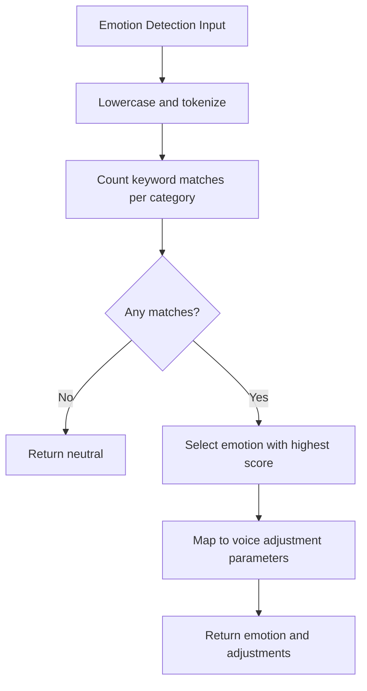

**Diagram sources**
- [emotion.py:26-52](file://veritas-ai/app/voice/emotion.py#L26-L52)

**Section sources**
- [emotion.py:1-52](file://veritas-ai/app/voice/emotion.py#L1-L52)

### Fake News and Clickbait Detection
- The NLP tool initializes a transformer-based text classifier on demand and returns classification labels and confidence scores after truncating input text.
- Error handling gracefully degrades when the model is unavailable.

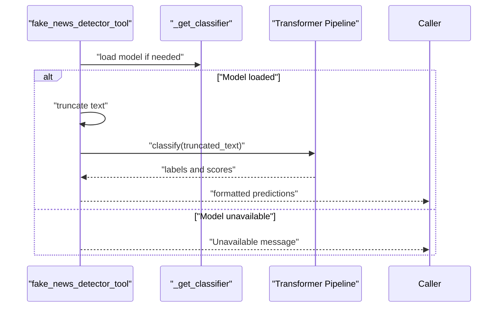

**Diagram sources**
- [nlp_tools.py:8-25](file://veritas-ai/tools/nlp_tools.py#L8-L25)
- [nlp_tools.py:27-51](file://veritas-ai/tools/nlp_tools.py#L27-L51)

**Section sources**
- [nlp_tools.py:1-52](file://veritas-ai/tools/nlp_tools.py#L1-L52)

### Entity Recognition and Knowledge Graph Integration
- The knowledge graph supports merging entities and relationships with validation against allowed label sets and relationship types.
- Batch operations reduce overhead for bulk ingestion.
- Tools enable building and validating the knowledge graph from structured JSON inputs.

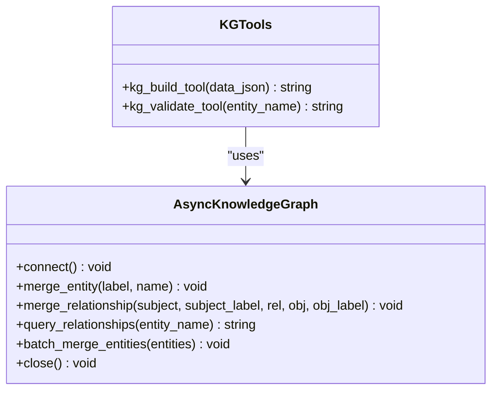

**Diagram sources**
- [knowledge_graph.py:12-131](file://veritas-ai/memory/knowledge_graph.py#L12-L131)
- [kg_tools.py:1-49](file://veritas-ai/tools/kg_tools.py#L1-L49)

**Section sources**
- [knowledge_graph.py:1-160](file://veritas-ai/memory/knowledge_graph.py#L1-L160)
- [kg_tools.py:1-49](file://veritas-ai/tools/kg_tools.py#L1-L49)

### Linguistic Pattern Matching and Routing
- Regex-based classifiers quickly categorize queries as simple, factual, or complex, enabling fast-path routing for straightforward questions.
- Trigger words related to misinformation further influence routing decisions.

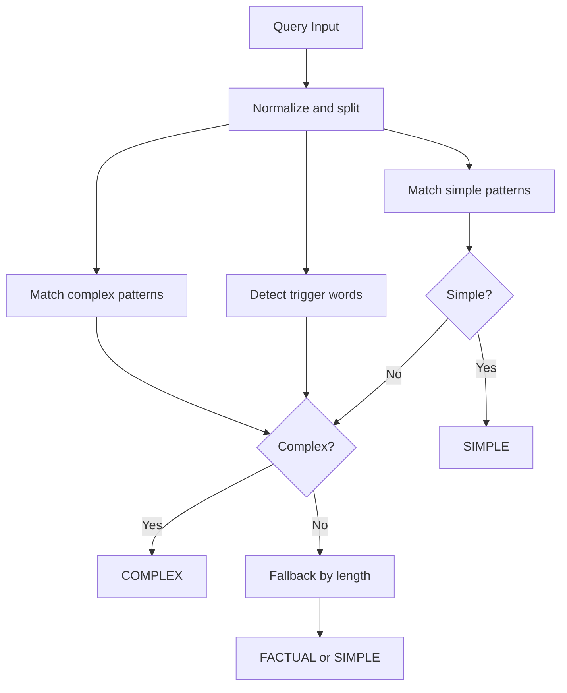

**Diagram sources**
- [router.py:51-81](file://veritas-ai/core/router.py#L51-L81)
- [router.py:83-136](file://veritas-ai/core/router.py#L83-L136)

**Section sources**
- [router.py:1-182](file://veritas-ai/core/router.py#L1-L182)

### Retrieval and Validation Agents
- Retrieval agent synthesizes a preliminary assessment and identifies source types needed, returning an initial credibility score.
- Validation agent computes a truth score using weighted factors, applies a firewall override, consensus fusion, and generates an explanation.

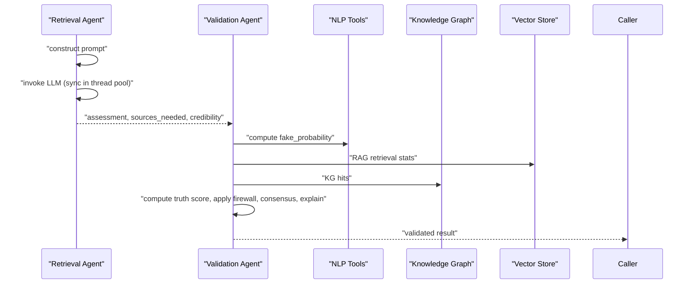

**Diagram sources**
- [retrieval.py:36-101](file://veritas-ai/app/agents/retrieval.py#L36-L101)
- [validation.py:278-314](file://veritas-ai/app/agents/validation.py#L278-L314)
- [nlp_tools.py:27-51](file://veritas-ai/tools/nlp_tools.py#L27-L51)
- [knowledge_graph.py:88-112](file://veritas-ai/memory/knowledge_graph.py#L88-L112)
- [vector_store.py:15-27](file://veritas-ai/memory/vector_store.py#L15-L27)

**Section sources**
- [retrieval.py:1-101](file://veritas-ai/app/agents/retrieval.py#L1-L101)
- [validation.py:1-314](file://veritas-ai/app/agents/validation.py#L1-L314)

### Pipelines and Orchestration
- Fast pipeline executes retrieval, validation, and response generation with a target sub-two-second runtime.
- Deep pipeline delegates to the fast pipeline within a background task for full multi-agent analysis.

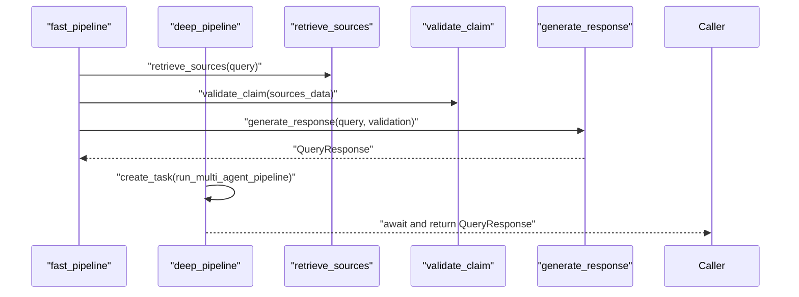

**Diagram sources**
- [fast_pipeline.py:8-22](file://veritas-ai/pipelines/fast_pipeline.py#L8-L22)
- [deep_pipeline.py:7-17](file://veritas-ai/pipelines/deep_pipeline.py#L7-L17)

**Section sources**
- [fast_pipeline.py:1-22](file://veritas-ai/pipelines/fast_pipeline.py#L1-L22)
- [deep_pipeline.py:1-17](file://veritas-ai/pipelines/deep_pipeline.py#L1-L17)

### LLM Integration and Observability
- LLM initialization uses Ollama with configurable base URL and model name.
- Observability callback captures latency, token usage, and confidence metrics.
- Global SQLite cache persists identical queries across agent logic.

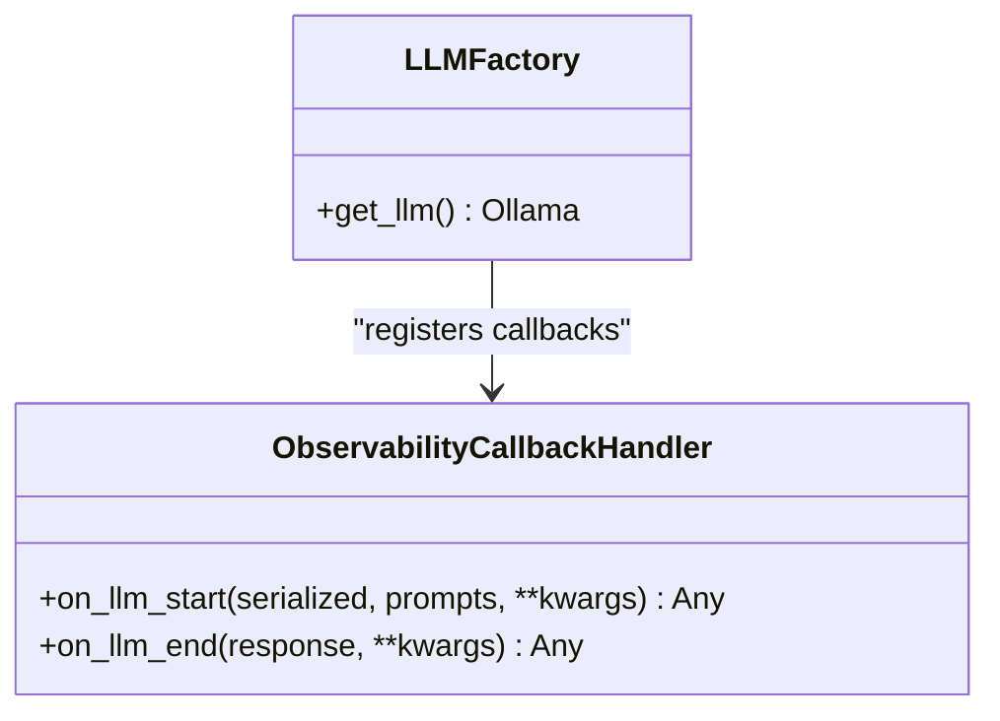

**Diagram sources**
- [llm.py:11-60](file://veritas-ai/models/llm.py#L11-L60)

**Section sources**
- [llm.py:1-61](file://veritas-ai/models/llm.py#L1-L61)
- [settings.py:42-48](file://veritas-ai/config/settings.py#L42-L48)

## Dependency Analysis
Key dependencies and coupling:
- Tools depend on transformers for classification and LangChain for tool decoration.
- Agents depend on LLMs for retrieval prompts and on memory stores for RAG and KG.
- Pipelines depend on agents and schemas for orchestration and response modeling.
- Router depends on TTL and Redis caches for fast-path acceleration.

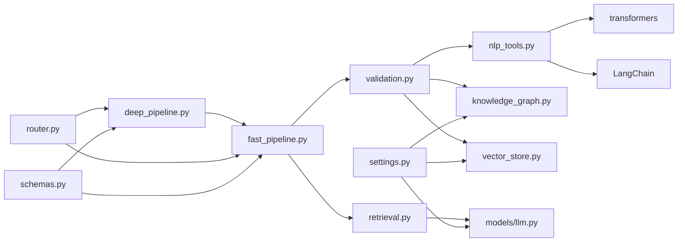

**Diagram sources**
- [nlp_tools.py:1-52](file://veritas-ai/tools/nlp_tools.py#L1-L52)
- [validation.py:1-314](file://veritas-ai/app/agents/validation.py#L1-L314)
- [knowledge_graph.py:1-160](file://veritas-ai/memory/knowledge_graph.py#L1-L160)
- [vector_store.py:1-27](file://veritas-ai/memory/vector_store.py#L1-L27)
- [retrieval.py:1-101](file://veritas-ai/app/agents/retrieval.py#L1-L101)
- [fast_pipeline.py:1-22](file://veritas-ai/pipelines/fast_pipeline.py#L1-L22)
- [deep_pipeline.py:1-17](file://veritas-ai/pipelines/deep_pipeline.py#L1-L17)
- [router.py:1-182](file://veritas-ai/core/router.py#L1-L182)
- [schemas.py:1-88](file://veritas-ai/models/schemas.py#L1-L88)
- [settings.py:1-83](file://veritas-ai/config/settings.py#L1-L83)

**Section sources**
- [nlp_tools.py:1-52](file://veritas-ai/tools/nlp_tools.py#L1-L52)
- [validation.py:1-314](file://veritas-ai/app/agents/validation.py#L1-L314)
- [knowledge_graph.py:1-160](file://veritas-ai/memory/knowledge_graph.py#L1-L160)
- [vector_store.py:1-27](file://veritas-ai/memory/vector_store.py#L1-L27)
- [retrieval.py:1-101](file://veritas-ai/app/agents/retrieval.py#L1-L101)
- [fast_pipeline.py:1-22](file://veritas-ai/pipelines/fast_pipeline.py#L1-L22)
- [deep_pipeline.py:1-17](file://veritas-ai/pipelines/deep_pipeline.py#L1-L17)
- [router.py:1-182](file://veritas-ai/core/router.py#L1-L182)
- [schemas.py:1-88](file://veritas-ai/models/schemas.py#L1-L88)
- [settings.py:1-83](file://veritas-ai/config/settings.py#L1-L83)

## Performance Considerations
- Model and Token Limits
  - Text truncation ensures compatibility with transformer token limits.
- Caching
  - SQLite LLM cache prevents repeated identical queries.
  - Router caches include local TTL and Redis layers for fast-path acceleration.
- Concurrency and Threading
  - CPU-intensive scoring runs in a thread pool to avoid blocking.
  - Async I/O for vector store and knowledge graph operations.
- Resource Pooling
  - Knowledge graph driver pools connections and enforces timeouts.
- Streaming and Parallelism
  - Streaming chunk size and maximum parallel tools configurable for throughput control.

[No sources needed since this section provides general guidance]

## Troubleshooting Guide
- Transformers Unavailable
  - Symptom: Classification tool reports unavailability.
  - Action: Install required packages or verify environment availability.
- Tensor Errors
  - Symptom: Classification raises tensor errors.
  - Action: Reduce input length or adjust truncation strategy.
- Knowledge Graph Offline
  - Symptom: Queries report offline status.
  - Action: Verify Neo4j connectivity and credentials.
- Retrieval Agent Fallback
  - Symptom: Retrieval agent fails and returns fallback.
  - Action: Check LLM availability and prompt formatting.
- Router Metrics
  - Symptom: Unexpected routing behavior.
  - Action: Inspect router metrics and cache keys.

**Section sources**
- [nlp_tools.py:19-25](file://veritas-ai/tools/nlp_tools.py#L19-L25)
- [nlp_tools.py:50-51](file://veritas-ai/tools/nlp_tools.py#L50-L51)
- [knowledge_graph.py:36-38](file://veritas-ai/memory/knowledge_graph.py#L36-L38)
- [retrieval.py:90-100](file://veritas-ai/app/agents/retrieval.py#L90-L100)
- [router.py:138-149](file://veritas-ai/core/router.py#L138-L149)

## Conclusion
The NLP processing tools integrate lightweight classification, retrieval-driven validation, and explainability into a robust pipeline. Configuration enables local model usage, caching, and performance tuning. Memory systems support scalable retrieval and knowledge graph operations. Together, these components provide a practical foundation for natural language understanding and linguistic analysis.

[No sources needed since this section summarizes without analyzing specific files]

## Appendices

### Configuration Options
- LLM and Model Selection
  - Ollama base URL and model names for LLM and router/fast models.
- Vector Store and Embeddings
  - Embedding model and Chroma persistence directory.
- Caching and Performance
  - Pipeline and task timeouts, cache TTL and max entries, streaming settings, and parallel tool limits.
- External Services
  - Redis host/port/db, Neo4j URI/user/password, and API keys for external collectors.

**Section sources**
- [settings.py:20-76](file://veritas-ai/config/settings.py#L20-L76)
- [settings.py:55-68](file://veritas-ai/config/settings.py#L55-L68)

### Output Formats
- QueryResponse schema defines standardized fields for summaries, facts, sources, contradictions, probabilities, confidence, truth scores, status, explanations, and timestamps.

**Section sources**
- [schemas.py:14-26](file://veritas-ai/models/schemas.py#L14-L26)

### Integration Patterns
- Tool-based NLP classification can be invoked from agents or pipelines.
- Retrieval and validation agents collaborate with vector store and knowledge graph.
- Router orchestrates fast versus full pipelines based on query characteristics.

**Section sources**
- [nlp_tools.py:27-51](file://veritas-ai/tools/nlp_tools.py#L27-L51)
- [retrieval.py:36-101](file://veritas-ai/app/agents/retrieval.py#L36-L101)
- [validation.py:278-314](file://veritas-ai/app/agents/validation.py#L278-L314)
- [router.py:99-181](file://veritas-ai/core/router.py#L99-L181)