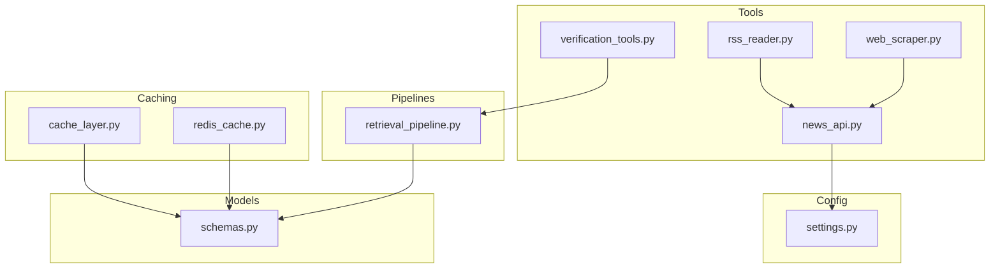
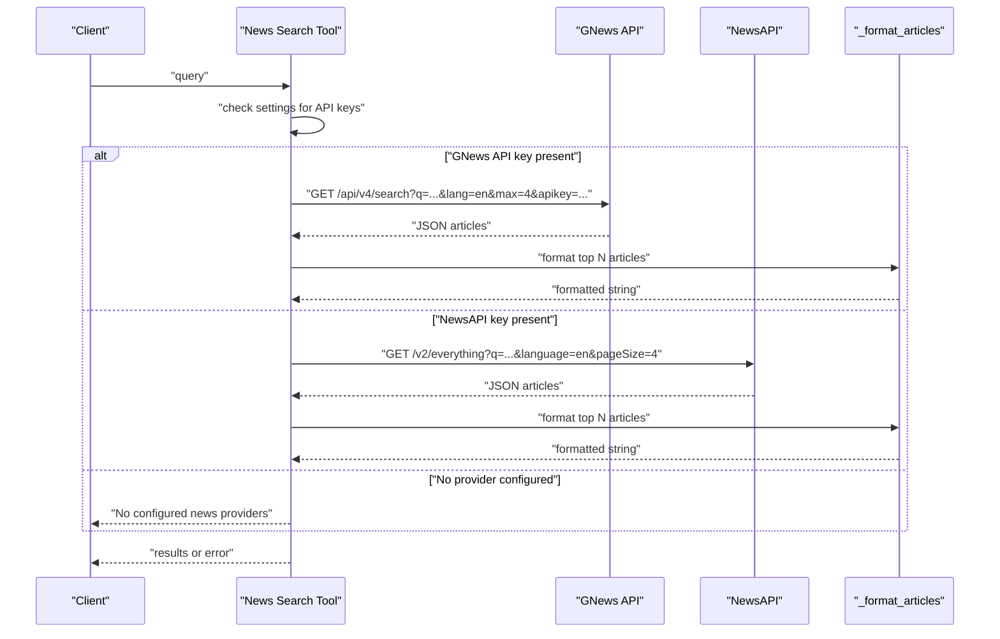
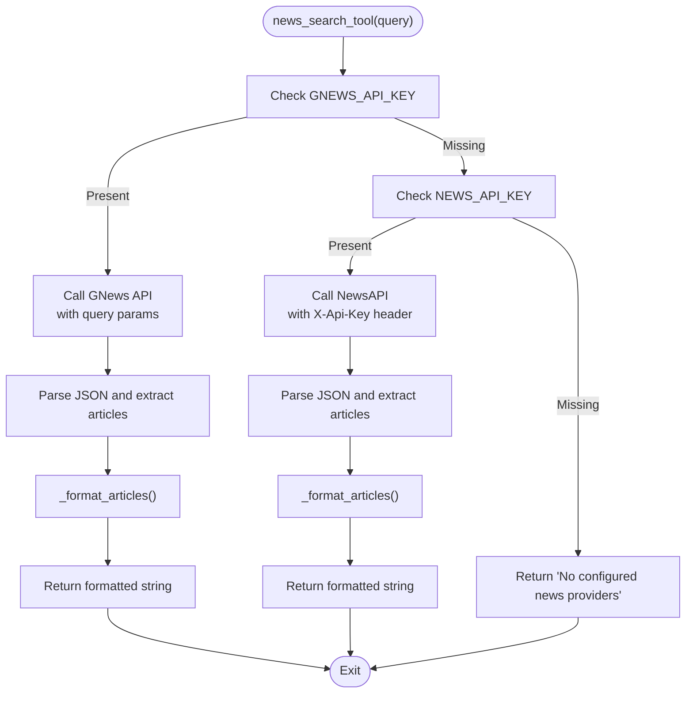
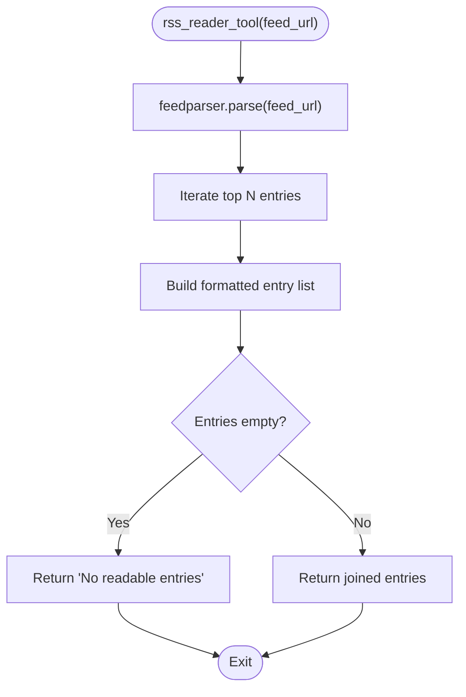
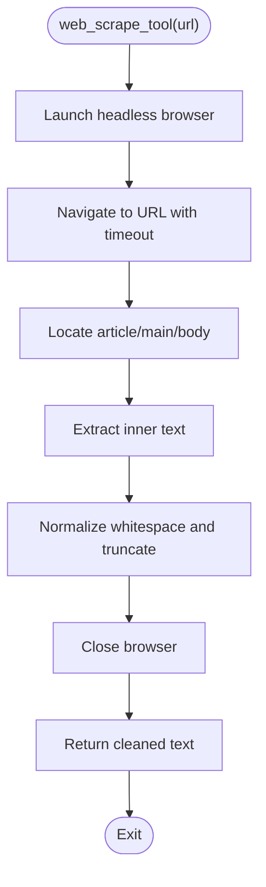
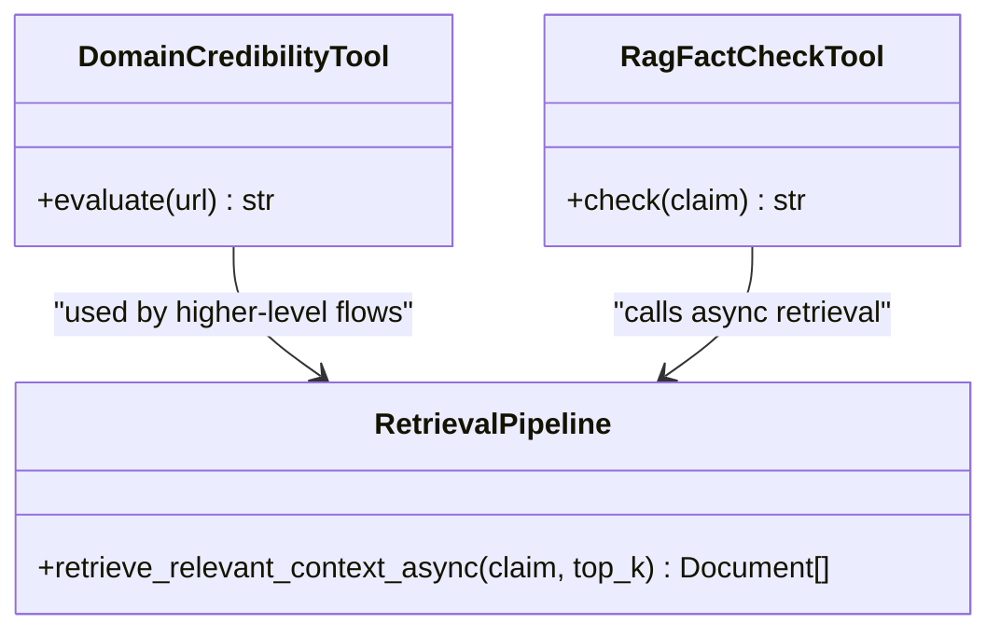
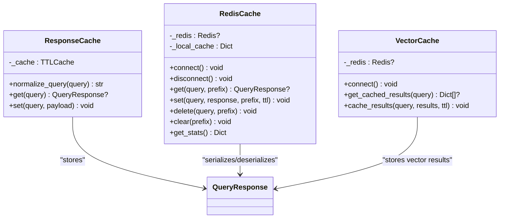
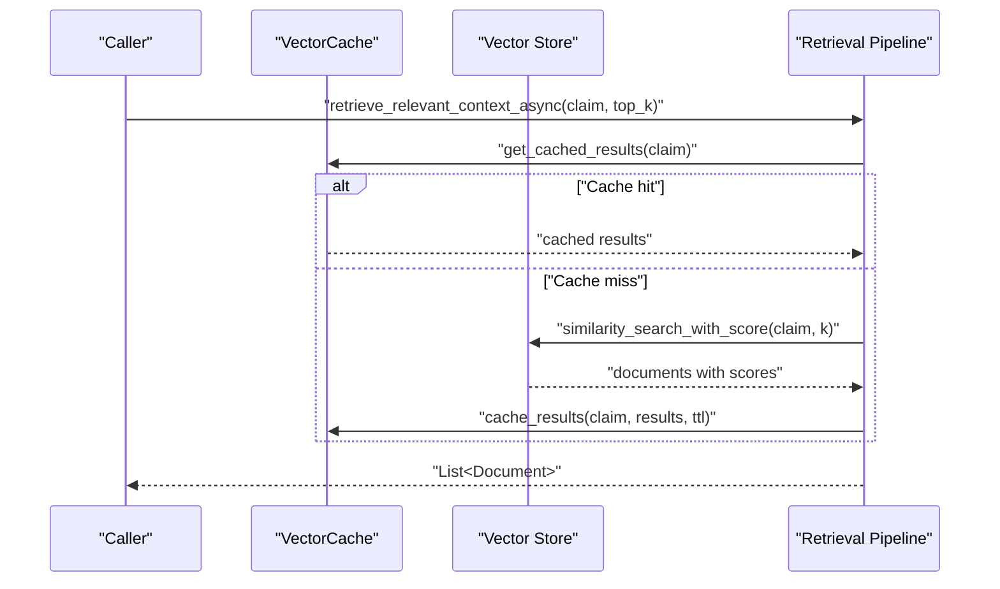
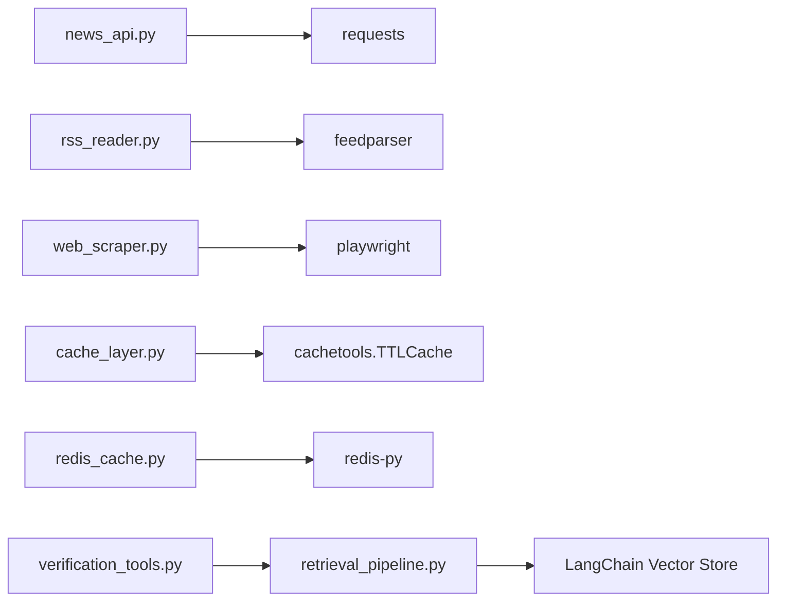

# News API Integration

<cite>
**Referenced Files in This Document**
- [news_api.py](file://veritas-ai/tools/news_api.py)
- [rss_reader.py](file://veritas-ai/tools/rss_reader.py)
- [web_scraper.py](file://veritas-ai/tools/web_scraper.py)
- [verification_tools.py](file://veritas-ai/tools/verification_tools.py)
- [settings.py](file://veritas-ai/config/settings.py)
- [cache_layer.py](file://veritas-ai/core/cache_layer.py)
- [redis_cache.py](file://veritas-ai/core/redis_cache.py)
- [router.py](file://veritas-ai/core/router.py)
- [retrieval_pipeline.py](file://veritas-ai/pipelines/retrieval_pipeline.py)
- [schemas.py](file://veritas-ai/models/schemas.py)
- [page.tsx](file://veritas-ai/frontend/app/developers/page.tsx)
</cite>

## Table of Contents
1. [Introduction](#introduction)
2. [Project Structure](#project-structure)
3. [Core Components](#core-components)
4. [Architecture Overview](#architecture-overview)
5. [Detailed Component Analysis](#detailed-component-analysis)
6. [Dependency Analysis](#dependency-analysis)
7. [Performance Considerations](#performance-considerations)
8. [Troubleshooting Guide](#troubleshooting-guide)
9. [Conclusion](#conclusion)
10. [Appendices](#appendices)

## Introduction
This document explains the news API integration tools designed for real-time news aggregation and source verification. It covers supported external providers, authentication mechanisms, data retrieval patterns, and how results are formatted and consumed. It also documents configuration options for API keys, query parameters, response processing, caching strategies, and fallback mechanisms. Practical examples show how to query news by topic, location, and timeframe using the available tools.

## Project Structure
The news integration spans several modules:
- Tools: External provider integrations (news, RSS, web scraping) and source credibility evaluation
- Configuration: Environment-driven settings for API keys and runtime behavior
- Caching: Local and Redis-backed caches for query responses and vector embeddings
- Pipelines: Retrieval and verification pipelines that consume cached and live data
- Models: Typed response schemas for structured outputs

**Diagram sources**
- [news_api.py:1-48](file://veritas-ai/tools/news_api.py#L1-L48)
- [rss_reader.py:1-26](file://veritas-ai/tools/rss_reader.py#L1-L26)
- [web_scraper.py:1-35](file://veritas-ai/tools/web_scraper.py#L1-L35)
- [verification_tools.py:1-52](file://veritas-ai/tools/verification_tools.py#L1-L52)
- [settings.py:1-83](file://veritas-ai/config/settings.py#L1-L83)
- [cache_layer.py:1-41](file://veritas-ai/core/cache_layer.py#L1-L41)
- [redis_cache.py:1-232](file://veritas-ai/core/redis_cache.py#L1-L232)
- [retrieval_pipeline.py:1-112](file://veritas-ai/pipelines/retrieval_pipeline.py#L1-L112)
- [schemas.py:1-88](file://veritas-ai/models/schemas.py#L1-L88)

**Section sources**
- [news_api.py:1-48](file://veritas-ai/tools/news_api.py#L1-L48)
- [settings.py:60-63](file://veritas-ai/config/settings.py#L60-L63)

## Core Components
- News Search Tool: Queries two external providers (GNews and NewsAPI) and formats results
- RSS Reader Tool: Parses RSS feeds and extracts summaries for official sources
- Web Scraper Tool: Extracts main article content from URLs using headless browser automation
- Verification Tools: Domain credibility scoring and RAG-based fact checking
- Configuration: API keys and runtime settings
- Caching: Local TTL cache and Redis-backed cache for query responses and vector results
- Retrieval Pipeline: Vector DB retrieval with optional caching and filtering
- Schemas: Structured response models for unified output

**Section sources**
- [news_api.py:18-47](file://veritas-ai/tools/news_api.py#L18-L47)
- [rss_reader.py:4-25](file://veritas-ai/tools/rss_reader.py#L4-L25)
- [web_scraper.py:4-34](file://veritas-ai/tools/web_scraper.py#L4-L34)
- [verification_tools.py:5-51](file://veritas-ai/tools/verification_tools.py#L5-L51)
- [settings.py:60-63](file://veritas-ai/config/settings.py#L60-L63)
- [cache_layer.py:10-40](file://veritas-ai/core/cache_layer.py#L10-L40)
- [redis_cache.py:18-232](file://veritas-ai/core/redis_cache.py#L18-L232)
- [retrieval_pipeline.py:29-72](file://veritas-ai/pipelines/retrieval_pipeline.py#L29-L72)
- [schemas.py:5-26](file://veritas-ai/models/schemas.py#L5-L26)

## Architecture Overview
The news integration follows a layered approach:
- Tool layer: External provider calls and content extraction
- Config layer: Provider credentials and runtime parameters
- Caching layer: Response and vector result caching
- Retrieval layer: Vector DB-based context retrieval
- Model layer: Structured outputs for downstream consumers

**Diagram sources**
- [news_api.py:18-47](file://veritas-ai/tools/news_api.py#L18-L47)

## Detailed Component Analysis

### News Search Tool
- Purpose: Aggregates recent news for a given query from external providers
- Providers:
  - GNews: Uses a dedicated endpoint with query, language, and max article parameters
  - NewsAPI: Uses an “everything” endpoint with language and page size
- Authentication:
  - GNews: Query parameter API key
  - NewsAPI: Header-based API key
- Formatting: Limits to top N articles and formats title, URL, and description
- Fallback: Returns a message if neither provider is configured

**Diagram sources**
- [news_api.py:18-47](file://veritas-ai/tools/news_api.py#L18-L47)

**Section sources**
- [news_api.py:18-47](file://veritas-ai/tools/news_api.py#L18-L47)

### RSS Reader Tool
- Purpose: Fetches and parses RSS feeds to extract recent entries
- Behavior: Parses top N entries, extracts title, link, and summary
- Robustness: Handles parsing errors and empty feeds gracefully

**Diagram sources**
- [rss_reader.py:4-25](file://veritas-ai/tools/rss_reader.py#L4-L25)

**Section sources**
- [rss_reader.py:4-25](file://veritas-ai/tools/rss_reader.py#L4-L25)

### Web Scraper Tool
- Purpose: Extracts main textual content from a URL using a headless browser
- Strategy: Prefers article/main tags, falls back to body; trims whitespace and caps length

**Diagram sources**
- [web_scraper.py:4-34](file://veritas-ai/tools/web_scraper.py#L4-L34)

**Section sources**
- [web_scraper.py:4-34](file://veritas-ai/tools/web_scraper.py#L4-L34)

### Verification Tools
- Domain Credibility Evaluator:
  - Heuristic classification by TLD and domain substring matching
  - Returns a score and categorized type
- RAG Fact Checker:
  - Asynchronously retrieves relevant context from a vector database
  - Compiles evidence with relevance scores

**Diagram sources**
- [verification_tools.py:5-51](file://veritas-ai/tools/verification_tools.py#L5-L51)
- [retrieval_pipeline.py:48-72](file://veritas-ai/pipelines/retrieval_pipeline.py#L48-L72)

**Section sources**
- [verification_tools.py:5-51](file://veritas-ai/tools/verification_tools.py#L5-L51)
- [retrieval_pipeline.py:48-72](file://veritas-ai/pipelines/retrieval_pipeline.py#L48-L72)

### Configuration Options
- API Keys:
  - GNEWS_API_KEY: Used as a query parameter for GNews
  - NEWS_API_KEY: Used as an X-Api-Key header for NewsAPI
- Runtime Settings:
  - CACHE_TTL_SECONDS and CACHE_MAX_ENTRIES for response caching
  - REDIS_HOST, REDIS_PORT for Redis connectivity
  - RETRIEVAL_K for vector similarity top-k

**Section sources**
- [settings.py:60-63](file://veritas-ai/config/settings.py#L60-L63)
- [settings.py:25-26](file://veritas-ai/config/settings.py#L25-L26)
- [settings.py:55-59](file://veritas-ai/config/settings.py#L55-L59)
- [settings.py](file://veritas-ai/config/settings.py#L53)

### Caching Strategies
- Local TTL Cache:
  - Normalizes queries, hashes them, and stores QueryResponse with TTL
- Redis Cache:
  - Provides distributed caching with JSON serialization and TTL
  - Maintains a local in-memory cache for hot reads
  - Includes vector embedding cache for retrieval results

**Diagram sources**
- [cache_layer.py:10-40](file://veritas-ai/core/cache_layer.py#L10-L40)
- [redis_cache.py:18-232](file://veritas-ai/core/redis_cache.py#L18-L232)

**Section sources**
- [cache_layer.py:10-40](file://veritas-ai/core/cache_layer.py#L10-L40)
- [redis_cache.py:18-232](file://veritas-ai/core/redis_cache.py#L18-L232)

### Retrieval Pipeline and Source Ranking
- Vector Retrieval:
  - Retrieves top-k documents from a vector store
  - Supports optional metadata filtering
  - Caches retrieval results in Redis for reuse
- Source Ranking:
  - Domain credibility scoring is available via the verification tools
  - The structured Source model supports storing URL, score, and type

**Diagram sources**
- [retrieval_pipeline.py:48-72](file://veritas-ai/pipelines/retrieval_pipeline.py#L48-L72)
- [redis_cache.py:166-218](file://veritas-ai/core/redis_cache.py#L166-L218)

**Section sources**
- [retrieval_pipeline.py:29-72](file://veritas-ai/pipelines/retrieval_pipeline.py#L29-L72)
- [schemas.py:5-9](file://veritas-ai/models/schemas.py#L5-L9)

### Response Processing and Data Models
- QueryResponse:
  - Fields include query, summary, facts, sources, contradictions, and quality metrics
  - Sources carry URL, credibility_score, and type
- Source:
  - Enforces credible types and numeric score bounds

**Section sources**
- [schemas.py:14-26](file://veritas-ai/models/schemas.py#L14-L26)
- [schemas.py:5-9](file://veritas-ai/models/schemas.py#L5-L9)

## Dependency Analysis
External dependencies and integration points:
- HTTP clients: requests for REST APIs, feedparser for RSS, Playwright for scraping
- Caching: cachetools for local TTL cache, redis-py for Redis
- Vector DB: Chroma via LangChain retriever
- Configuration: Pydantic settings loaded from environment

**Diagram sources**
- [news_api.py:1-4](file://veritas-ai/tools/news_api.py#L1-L4)
- [rss_reader.py:1-3](file://veritas-ai/tools/rss_reader.py#L1-L3)
- [web_scraper.py:1-3](file://veritas-ai/tools/web_scraper.py#L1-L3)
- [cache_layer.py:1-8](file://veritas-ai/core/cache_layer.py#L1-L8)
- [redis_cache.py:1-13](file://veritas-ai/core/redis_cache.py#L1-L13)
- [retrieval_pipeline.py:1-9](file://veritas-ai/pipelines/retrieval_pipeline.py#L1-L9)
- [verification_tools.py:1-4](file://veritas-ai/tools/verification_tools.py#L1-L4)

**Section sources**
- [news_api.py:1-4](file://veritas-ai/tools/news_api.py#L1-L4)
- [rss_reader.py:1-3](file://veritas-ai/tools/rss_reader.py#L1-L3)
- [web_scraper.py:1-3](file://veritas-ai/tools/web_scraper.py#L1-L3)
- [cache_layer.py:1-8](file://veritas-ai/core/cache_layer.py#L1-L8)
- [redis_cache.py:1-13](file://veritas-ai/core/redis_cache.py#L1-L13)
- [retrieval_pipeline.py:1-9](file://veritas-ai/pipelines/retrieval_pipeline.py#L1-L9)
- [verification_tools.py:1-4](file://veritas-ai/tools/verification_tools.py#L1-L4)

## Performance Considerations
- Timeouts: HTTP calls use short timeouts to prevent blocking
- Pagination limits: Tools cap number of returned items to reduce payload size
- Caching: Both local TTL cache and Redis cache minimize repeated external calls
- Async retrieval: Vector DB retrieval is offloaded to threads and optionally cached
- Parallelism: Batch retrieval supports concurrent queries

[No sources needed since this section provides general guidance]

## Troubleshooting Guide
Common issues and remedies:
- Missing API keys: Configure GNEWS_API_KEY or NEWS_API_KEY; otherwise the tool reports no providers
- Network errors: Short timeouts and exception handling return informative messages
- RSS parsing failures: Empty or malformed feeds are handled gracefully
- Web scraping failures: Headless browser exceptions are caught and reported
- Cache connectivity: Redis failures fall back to local cache; stats are available for diagnostics

**Section sources**
- [news_api.py:25-34](file://veritas-ai/tools/news_api.py#L25-L34)
- [news_api.py:36-45](file://veritas-ai/tools/news_api.py#L36-L45)
- [rss_reader.py:10-25](file://veritas-ai/tools/rss_reader.py#L10-L25)
- [web_scraper.py:10-34](file://veritas-ai/tools/web_scraper.py#L10-L34)
- [redis_cache.py:30-51](file://veritas-ai/core/redis_cache.py#L30-L51)
- [redis_cache.py:74-82](file://veritas-ai/core/redis_cache.py#L74-L82)
- [redis_cache.py:146-163](file://veritas-ai/core/redis_cache.py#L146-L163)

## Conclusion
The news API integration provides a robust, configurable, and resilient system for real-time news aggregation and source verification. It supports multiple external providers, formats results consistently, and integrates caching and retrieval layers to ensure reliability and performance. The verification tools enable source credibility assessment and RAG-backed fact checking, enabling trustworthy downstream applications.

[No sources needed since this section summarizes without analyzing specific files]

## Appendices

### API Endpoints and Authentication
- Verify News Endpoint (frontend example):
  - Method: POST
  - Path: /api/v1/verify-news
  - Auth: Requires X-API-KEY header
  - Example request body: {"query": "Is climate change accelerating?"}

**Section sources**
- [page.tsx:6-31](file://veritas-ai/frontend/app/developers/page.tsx#L6-L31)
- [page.tsx:143-148](file://veritas-ai/frontend/app/developers/page.tsx#L143-L148)

### Querying Examples
- By topic: Use a focused query string in the news search tool
- By location: Include geographic terms in the query string
- By timeframe: Use provider-specific parameters where applicable; for the current tools, adjust query wording to target recency

Note: The included tools primarily support topic-based queries and do not expose explicit location or date-range filters. For advanced filtering, integrate provider-specific parameters or extend the tools accordingly.

**Section sources**
- [news_api.py:25-45](file://veritas-ai/tools/news_api.py#L25-L45)