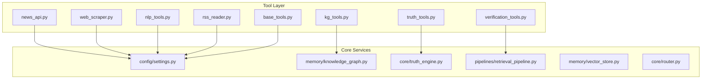
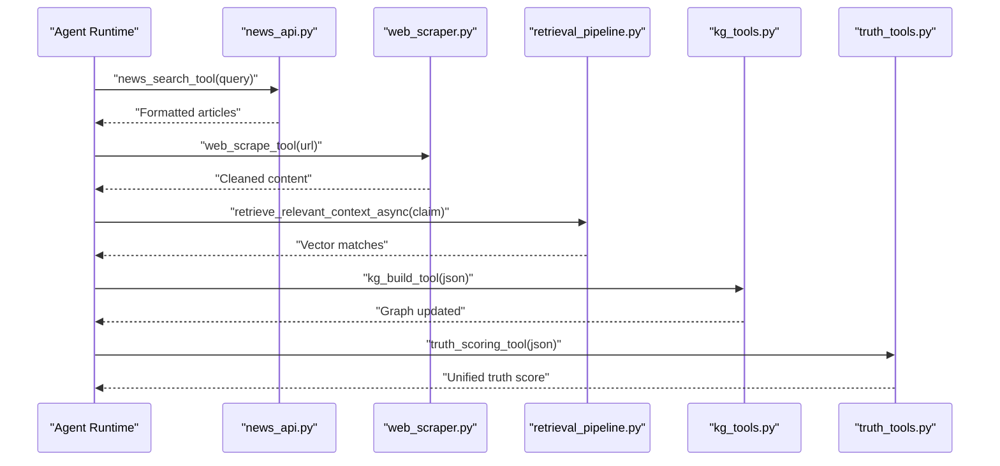
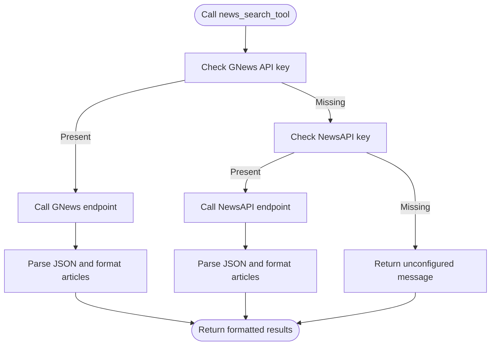
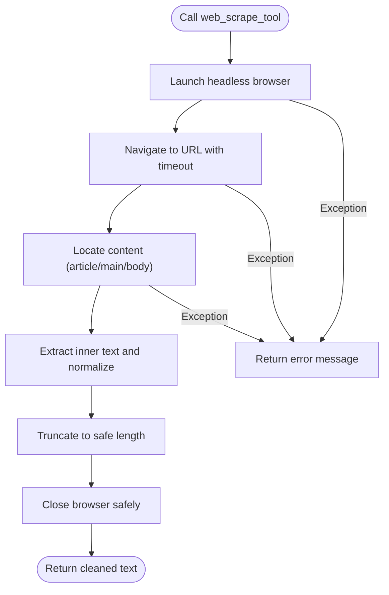
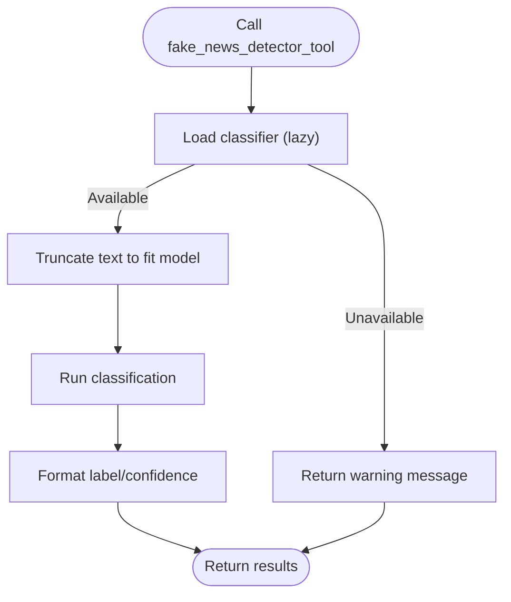
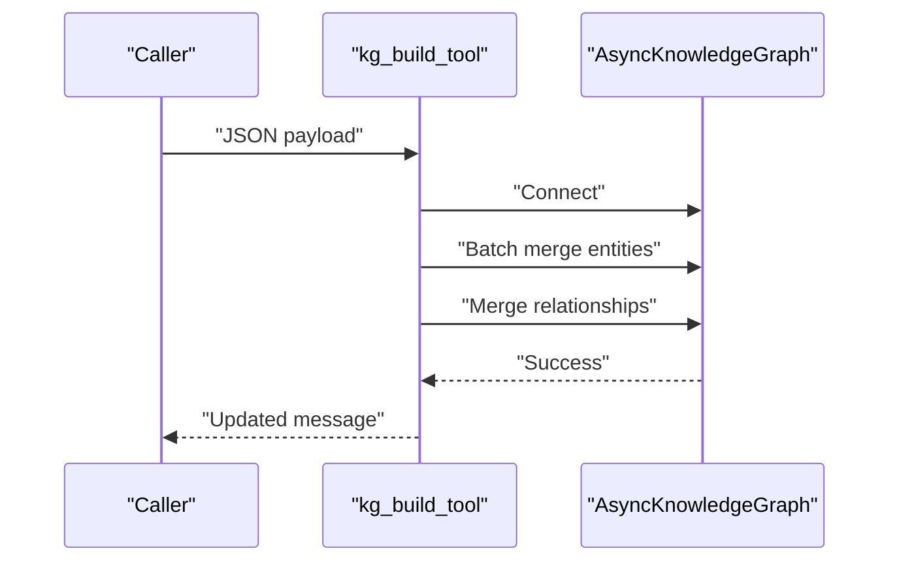
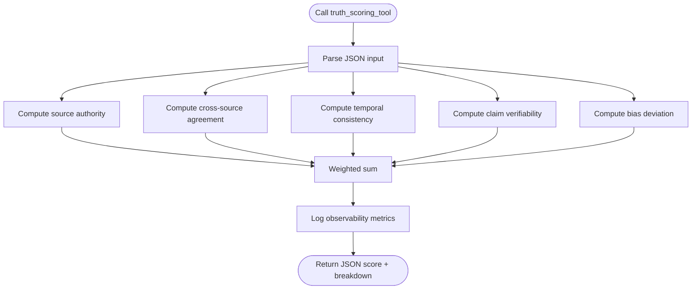
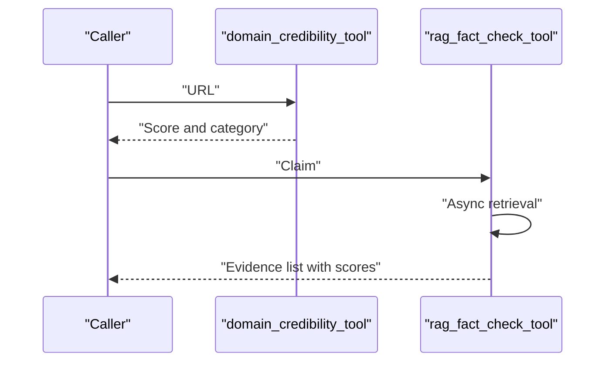
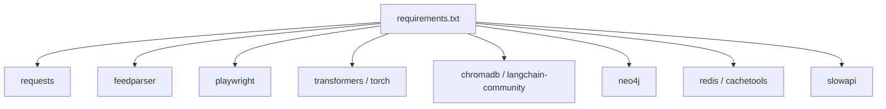

# Tools & Integrations

<cite>
**Referenced Files in This Document**
- [base_tools.py](file://veritas-ai/tools/base_tools.py)
- [news_api.py](file://veritas-ai/tools/news_api.py)
- [web_scraper.py](file://veritas-ai/tools/web_scraper.py)
- [nlp_tools.py](file://veritas-ai/tools/nlp_tools.py)
- [kg_tools.py](file://veritas-ai/tools/kg_tools.py)
- [truth_tools.py](file://veritas-ai/tools/truth_tools.py)
- [verification_tools.py](file://veritas-ai/tools/verification_tools.py)
- [rss_reader.py](file://veritas-ai/tools/rss_reader.py)
- [knowledge_graph.py](file://veritas-ai/memory/knowledge_graph.py)
- [settings.py](file://veritas-ai/config/settings.py)
- [truth_engine.py](file://veritas-ai/core/truth_engine.py)
- [retrieval_pipeline.py](file://veritas-ai/pipelines/retrieval_pipeline.py)
- [vector_store.py](file://veritas-ai/memory/vector_store.py)
- [requirements.txt](file://veritas-ai/requirements.txt)
- [router.py](file://veritas-ai/core/router.py)
</cite>

## Table of Contents
1. [Introduction](#introduction)
2. [Project Structure](#project-structure)
3. [Core Components](#core-components)
4. [Architecture Overview](#architecture-overview)
5. [Detailed Component Analysis](#detailed-component-analysis)
6. [Dependency Analysis](#dependency-analysis)
7. [Performance Considerations](#performance-considerations)
8. [Troubleshooting Guide](#troubleshooting-guide)
9. [Conclusion](#conclusion)
10. [Appendices](#appendices)

## Introduction
This document describes the tool ecosystem powering Veritas AI’s external service integrations and specialized utilities. It focuses on:
- The base tool framework and common patterns for extending tool functionality
- Real-time news aggregation and source verification
- Web scraping for content extraction and preprocessing
- Natural language processing for fake news detection and sentiment-like classification
- Knowledge graph tools for entity extraction and relationship mapping
- Verification tools for cross-referencing claims against authoritative sources
- Implementation examples, configuration options, and integration patterns
- Error handling strategies, rate limiting considerations, and fallback mechanisms

## Project Structure
The tools are organized under a dedicated module and integrate with configuration, memory, retrieval, and truth engines. The following diagram highlights the primary modules involved in the tool ecosystem.

**Diagram sources**
- [news_api.py:1-48](file://veritas-ai/tools/news_api.py#L1-L48)
- [web_scraper.py:1-35](file://veritas-ai/tools/web_scraper.py#L1-L35)
- [nlp_tools.py:1-52](file://veritas-ai/tools/nlp_tools.py#L1-L52)
- [kg_tools.py:1-50](file://veritas-ai/tools/kg_tools.py#L1-L50)
- [truth_tools.py:1-29](file://veritas-ai/tools/truth_tools.py#L1-L29)
- [verification_tools.py:1-52](file://veritas-ai/tools/verification_tools.py#L1-L52)
- [rss_reader.py:1-26](file://veritas-ai/tools/rss_reader.py#L1-L26)
- [base_tools.py:1-10](file://veritas-ai/tools/base_tools.py#L1-L10)
- [settings.py:1-83](file://veritas-ai/config/settings.py#L1-L83)
- [knowledge_graph.py:1-160](file://veritas-ai/memory/knowledge_graph.py#L1-L160)
- [truth_engine.py:1-117](file://veritas-ai/core/truth_engine.py#L1-L117)
- [retrieval_pipeline.py:1-112](file://veritas-ai/pipelines/retrieval_pipeline.py#L1-L112)
- [vector_store.py:1-27](file://veritas-ai/memory/vector_store.py#L1-L27)
- [router.py:1-182](file://veritas-ai/core/router.py#L1-L182)

**Section sources**
- [requirements.txt:1-42](file://veritas-ai/requirements.txt#L1-L42)

## Core Components
This section outlines the foundational patterns and shared capabilities across tools:
- Decorated tool interface: Tools are exposed via a decorator that integrates them into the agent tool ecosystem.
- Configuration-driven behavior: Many tools rely on environment-backed settings for API keys, endpoints, and runtime parameters.
- Error handling: Tools return structured messages on failure, enabling robust orchestration.
- Asynchronous operations: Some tools leverage async patterns for scalable retrieval and graph updates.

Key patterns:
- Tool registration and invocation: Tools are decorated and callable by the agent runtime.
- Environment configuration: Centralized settings manage API keys, timeouts, and feature toggles.
- Async graph operations: Knowledge graph tools operate asynchronously to maintain responsiveness.
- Retrieval caching: Vector retrieval is cached to reduce latency and external load.

**Section sources**
- [base_tools.py:1-10](file://veritas-ai/tools/base_tools.py#L1-L10)
- [settings.py:60-76](file://veritas-ai/config/settings.py#L60-L76)
- [kg_tools.py:1-50](file://veritas-ai/tools/kg_tools.py#L1-L50)
- [retrieval_pipeline.py:48-72](file://veritas-ai/pipelines/retrieval_pipeline.py#L48-L72)

## Architecture Overview
The tool ecosystem orchestrates external services and internal memory systems to deliver verifiable insights. The high-level flow is:

**Diagram sources**
- [news_api.py:18-48](file://veritas-ai/tools/news_api.py#L18-L48)
- [web_scraper.py:4-35](file://veritas-ai/tools/web_scraper.py#L4-L35)
- [retrieval_pipeline.py:48-72](file://veritas-ai/pipelines/retrieval_pipeline.py#L48-L72)
- [kg_tools.py:5-50](file://veritas-ai/tools/kg_tools.py#L5-L50)
- [truth_tools.py:5-29](file://veritas-ai/tools/truth_tools.py#L5-L29)

## Detailed Component Analysis

### Base Tool Framework
- Purpose: Provides a standardized decorator and placeholder for tool creation.
- Pattern: Use the decorator to register tools; return human-readable strings or structured JSON for downstream consumption.
- Extension guide:
  - Add a new tool function decorated with the tool decorator.
  - Accept typed parameters aligned with the agent’s schema.
  - Return a string summary or JSON payload; keep outputs concise and actionable.

Implementation reference:
- [base_tools.py:1-10](file://veritas-ai/tools/base_tools.py#L1-L10)

**Section sources**
- [base_tools.py:1-10](file://veritas-ai/tools/base_tools.py#L1-L10)

### News API Integration
- Functionality: Aggregates recent news articles using configurable providers.
- Providers:
  - GNews: Requires an API key; returns up to a fixed number of articles.
  - NewsAPI: Requires an API key via a header; returns paginated results.
- Output: Formatted article list with title, URL, and description.
- Fallback: If no provider is configured, returns a message indicating unavailability.

**Diagram sources**
- [news_api.py:18-48](file://veritas-ai/tools/news_api.py#L18-L48)

**Section sources**
- [news_api.py:1-48](file://veritas-ai/tools/news_api.py#L1-L48)
- [settings.py:60-63](file://veritas-ai/config/settings.py#L60-L63)

### Web Scraper
- Functionality: Extracts main textual content from a given URL using a headless browser.
- Preprocessing: Applies heuristics to select article/main/body content, normalizes whitespace, and truncates output.
- Robustness: Ensures browser cleanup in finally blocks; returns error messages on failure.

**Diagram sources**
- [web_scraper.py:4-35](file://veritas-ai/tools/web_scraper.py#L4-L35)

**Section sources**
- [web_scraper.py:1-35](file://veritas-ai/tools/web_scraper.py#L1-L35)

### NLP Tools: Fake News Detection
- Functionality: Uses a transformer-based classifier to assess textual content for fake/misleading indicators.
- Model loading: Lazily initialized with a warning fallback if dependencies are missing.
- Input handling: Truncates long inputs to fit token limits; returns per-prediction labels and confidence.
- Error handling: Gracefully degrades with a warning when the model is unavailable.

**Diagram sources**
- [nlp_tools.py:8-52](file://veritas-ai/tools/nlp_tools.py#L8-L52)

**Section sources**
- [nlp_tools.py:1-52](file://veritas-ai/tools/nlp_tools.py#L1-L52)

### Knowledge Graph Tools
- Entity Builder:
  - Accepts structured JSON with entities and relationships.
  - Merges entities in batches and creates relationships asynchronously.
  - Validates labels and relationship types against allowed sets.
- Validator:
  - Queries the graph for explicit relationships of a given entity.
  - Returns a compact string representation of mapped connections.

**Diagram sources**
- [kg_tools.py:5-50](file://veritas-ai/tools/kg_tools.py#L5-L50)
- [knowledge_graph.py:12-132](file://veritas-ai/memory/knowledge_graph.py#L12-L132)

**Section sources**
- [kg_tools.py:1-50](file://veritas-ai/tools/kg_tools.py#L1-L50)
- [knowledge_graph.py:1-160](file://veritas-ai/memory/knowledge_graph.py#L1-L160)

### Truth Scoring Engine
- Functionality: Computes a unified truth score from five factors: source authority, cross-source agreement, temporal consistency, claim verifiability, and bias deviation.
- Inputs: Strictly formatted JSON containing source URLs, counts, flags, and probabilities.
- Output: JSON with the final score and a breakdown of factor scores.

**Diagram sources**
- [truth_tools.py:5-29](file://veritas-ai/tools/truth_tools.py#L5-L29)
- [truth_engine.py:78-117](file://veritas-ai/core/truth_engine.py#L78-L117)

**Section sources**
- [truth_tools.py:1-29](file://veritas-ai/tools/truth_tools.py#L1-L29)
- [truth_engine.py:1-117](file://veritas-ai/core/truth_engine.py#L1-L117)

### Verification Tools Suite
- Domain Credibility Evaluator:
  - Heuristic scoring based on TLD and known domains; returns a score and category.
- RAG Fact Checker:
  - Retrieves relevant context from the vector store asynchronously.
  - Compiles evidence with relevance scores.

**Diagram sources**
- [verification_tools.py:5-52](file://veritas-ai/tools/verification_tools.py#L5-L52)
- [retrieval_pipeline.py:48-72](file://veritas-ai/pipelines/retrieval_pipeline.py#L48-L72)

**Section sources**
- [verification_tools.py:1-52](file://veritas-ai/tools/verification_tools.py#L1-L52)
- [retrieval_pipeline.py:1-112](file://veritas-ai/pipelines/retrieval_pipeline.py#L1-L112)

### RSS Reader
- Functionality: Parses RSS feeds and returns a limited number of entries with titles, links, and summaries.
- Robustness: Handles malformed feeds gracefully and returns informative messages.

**Section sources**
- [rss_reader.py:1-26](file://veritas-ai/tools/rss_reader.py#L1-L26)

## Dependency Analysis
External dependencies and their roles:
- HTTP clients and parsers: requests, feedparser
- Browser automation: playwright
- NLP: transformers, torch
- Vector storage and embeddings: chromadb, langchain community
- Graph database: neo4j
- Caching and concurrency: redis, cachetools, aiohttp
- Rate limiting: slowapi

**Diagram sources**
- [requirements.txt:1-42](file://veritas-ai/requirements.txt#L1-L42)

**Section sources**
- [requirements.txt:1-42](file://veritas-ai/requirements.txt#L1-L42)

## Performance Considerations
- Asynchronous retrieval: Vector retrieval uses async execution with optional caching to minimize latency.
- Local caching: Query router caches results in both local and Redis layers to accelerate repeated queries.
- Batch graph operations: Knowledge graph tools merge entities in batches to reduce transaction overhead.
- Timeout controls: HTTP calls and browser navigation enforce timeouts to prevent stalls.
- Token limits: NLP tools truncate inputs to fit model constraints.

Recommendations:
- Tune retrieval K and cache TTL according to workload.
- Monitor Neo4j connection pool sizing and query patterns.
- Apply rate limiting at the edge using slowapi for upstream services.
- Consider parallelism limits for tool execution to avoid resource contention.

**Section sources**
- [retrieval_pipeline.py:48-72](file://veritas-ai/pipelines/retrieval_pipeline.py#L48-L72)
- [router.py:83-182](file://veritas-ai/core/router.py#L83-L182)
- [knowledge_graph.py:25-44](file://veritas-ai/memory/knowledge_graph.py#L25-L44)
- [nlp_tools.py:38-40](file://veritas-ai/tools/nlp_tools.py#L38-L40)
- [settings.py:20-28](file://veritas-ai/config/settings.py#L20-L28)

## Troubleshooting Guide
Common issues and resolutions:
- Missing API keys:
  - Symptom: Tools report unconfigured providers.
  - Resolution: Set environment variables for the respective providers and restart the service.
  - References: [news_api.py:25-47](file://veritas-ai/tools/news_api.py#L25-L47), [settings.py:60-63](file://veritas-ai/config/settings.py#L60-L63)
- NLP model unavailable:
  - Symptom: Transformer model load warnings and degraded behavior.
  - Resolution: Install transformers and torch per requirements.
  - References: [nlp_tools.py:16-25](file://veritas-ai/tools/nlp_tools.py#L16-L25), [requirements.txt:19-22](file://veritas-ai/requirements.txt#L19-L22)
- Graph connectivity errors:
  - Symptom: Knowledge graph operations fail.
  - Resolution: Verify Neo4j URI, credentials, and network access; check connection pool settings.
  - References: [knowledge_graph.py:25-44](file://veritas-ai/memory/knowledge_graph.py#L25-L44), [settings.py:64-67](file://veritas-ai/config/settings.py#L64-L67)
- RSS parsing failures:
  - Symptom: Empty or error messages from RSS reader.
  - Resolution: Validate feed URL and network reachability.
  - References: [rss_reader.py:10-25](file://veritas-ai/tools/rss_reader.py#L10-L25)
- RAG retrieval timeouts:
  - Symptom: Slow or failing retrieval.
  - Resolution: Increase timeouts, ensure vector store persistence, and verify embeddings configuration.
  - References: [retrieval_pipeline.py:48-72](file://veritas-ai/pipelines/retrieval_pipeline.py#L48-L72), [vector_store.py:15-27](file://veritas-ai/memory/vector_store.py#L15-L27)

**Section sources**
- [news_api.py:25-47](file://veritas-ai/tools/news_api.py#L25-L47)
- [nlp_tools.py:16-25](file://veritas-ai/tools/nlp_tools.py#L16-L25)
- [knowledge_graph.py:25-44](file://veritas-ai/memory/knowledge_graph.py#L25-L44)
- [rss_reader.py:10-25](file://veritas-ai/tools/rss_reader.py#L10-L25)
- [retrieval_pipeline.py:48-72](file://veritas-ai/pipelines/retrieval_pipeline.py#L48-L72)
- [vector_store.py:15-27](file://veritas-ai/memory/vector_store.py#L15-L27)
- [settings.py:64-67](file://veritas-ai/config/settings.py#L64-L67)

## Conclusion
The Veritas AI tool ecosystem combines external service integrations with internal memory and reasoning engines to produce robust, verifiable insights. By adhering to the documented patterns—decorated tools, configuration-driven behavior, asynchronous operations, and resilient error handling—the system remains extensible and operationally sound. Operators should focus on environment configuration, dependency installation, and monitoring to achieve reliable performance.

## Appendices

### Configuration Options
- API keys and providers:
  - NEWS_API_KEY, GNEWS_API_KEY
- Vector and embedding settings:
  - CHROMA_PERSIST_DIRECTORY, EMBEDDING_MODEL, OLLAMA_BASE_URL
- Knowledge Graph:
  - NEO4J_URI, NEO4J_USER, NEO4J_PASSWORD
- Performance and limits:
  - PIPELINE_TIMEOUT_SECONDS, MAX_PARALLEL_TOOLS, RETRIEVAL_K
- Security and streaming:
  - ENABLE_STREAMING, STREAM_CHUNK_SIZE

**Section sources**
- [settings.py:20-76](file://veritas-ai/config/settings.py#L20-L76)

### Integration Patterns
- Tool invocation:
  - Use the decorator to expose tools; ensure inputs are validated and outputs are structured.
- Retrieval and caching:
  - Prefer async retrieval with cache-aware logic to reduce latency.
- Graph ingestion:
  - Use batch operations for entities and explicit relationship merging for scalability.
- Truth scoring:
  - Provide strictly formatted JSON inputs to compute a unified score.

**Section sources**
- [base_tools.py:1-10](file://veritas-ai/tools/base_tools.py#L1-L10)
- [retrieval_pipeline.py:48-72](file://veritas-ai/pipelines/retrieval_pipeline.py#L48-L72)
- [kg_tools.py:15-37](file://veritas-ai/tools/kg_tools.py#L15-L37)
- [truth_tools.py:19-28](file://veritas-ai/tools/truth_tools.py#L19-L28)