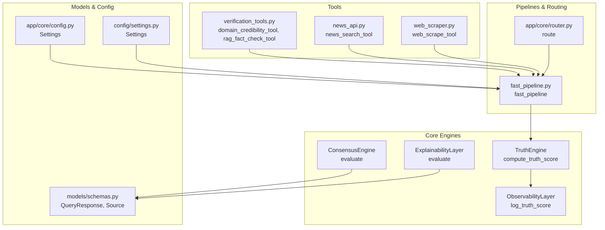
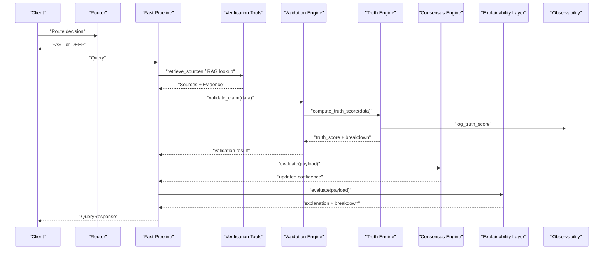
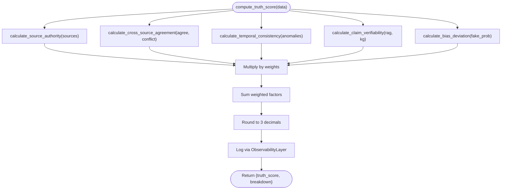
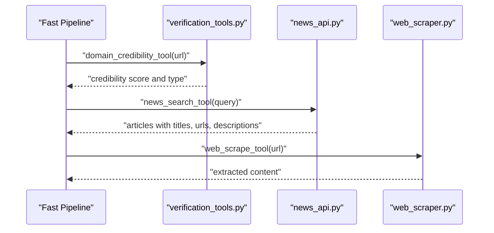
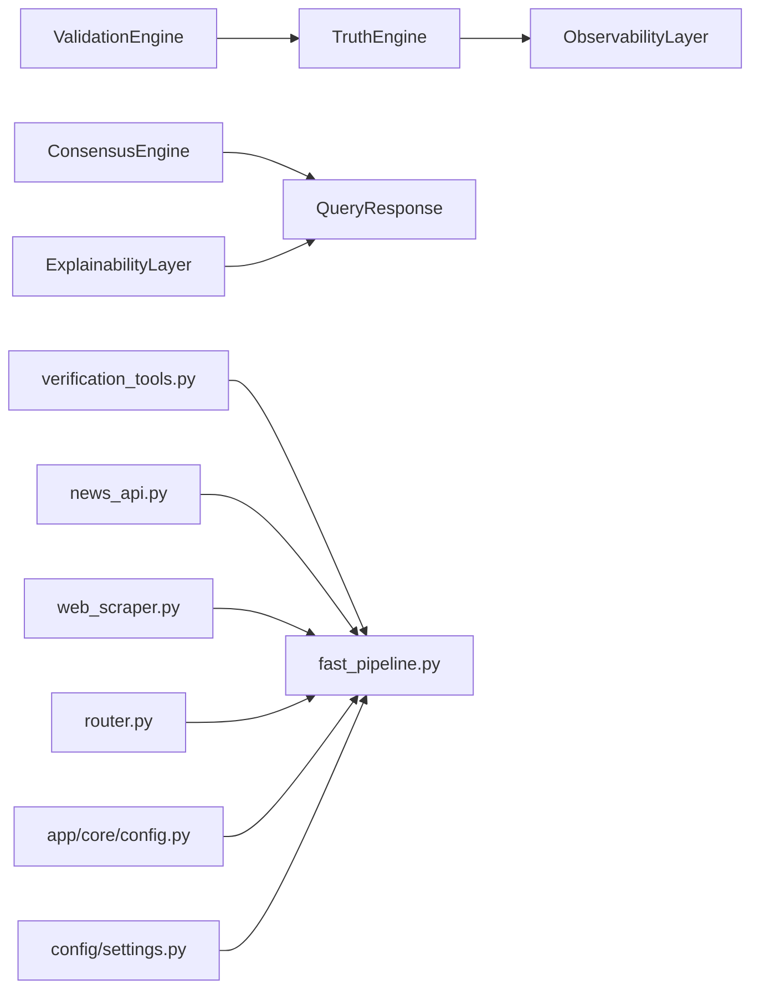

# Verification Tools

<cite>
**Referenced Files in This Document**
- [validation_engine.py](file://veritas-ai/core/validation_engine.py)
- [truth_engine.py](file://veritas-ai/core/truth_engine.py)
- [consensus_engine.py](file://veritas-ai/core/consensus_engine.py)
- [explainability_layer.py](file://veritas-ai/core/explainability_layer.py)
- [schemas.py](file://veritas-ai/models/schemas.py)
- [router.py](file://veritas-ai/app/core/router.py)
- [config.py](file://veritas-ai/app/core/config.py)
- [settings.py](file://veritas-ai/config/settings.py)
- [observability.py](file://veritas-ai/core/observability.py)
- [verification_tools.py](file://veritas-ai/tools/verification_tools.py)
- [news_api.py](file://veritas-ai/tools/news_api.py)
- [web_scraper.py](file://veritas-ai/tools/web_scraper.py)
- [fast_pipeline.py](file://veritas-ai/pipelines/fast_pipeline.py)
- [main.py](file://veritas-ai/main.py)
</cite>

## Table of Contents
1. [Introduction](#introduction)
2. [Project Structure](#project-structure)
3. [Core Components](#core-components)
4. [Architecture Overview](#architecture-overview)
5. [Detailed Component Analysis](#detailed-component-analysis)
6. [Dependency Analysis](#dependency-analysis)
7. [Performance Considerations](#performance-considerations)
8. [Troubleshooting Guide](#troubleshooting-guide)
9. [Conclusion](#conclusion)
10. [Appendices](#appendices)

## Introduction
This document describes the verification tools suite responsible for cross-referencing claims against authoritative sources and executing fact-checking workflows. It explains the verification algorithms, source credibility assessment, evidence evaluation mechanisms, integration with external verification services, handling of conflicting information, confidence scoring, decision-making logic, configuration options, audit trails, explanation generation, and reporting capabilities.

## Project Structure
The verification suite centers around core engines and tools that collaborate to assess truthfulness, derive confidence, and produce explainable results. Key areas include:
- Truth computation and scoring
- Consensus fusion across modalities
- Explainability and audit trail generation
- External integrations (news APIs, web scraping)
- Pipelines and routing
- Configuration and observability

**Diagram sources**
- [truth_engine.py:78-117](file://veritas-ai/core/truth_engine.py#L78-L117)
- [consensus_engine.py:8-26](file://veritas-ai/core/consensus_engine.py#L8-L26)
- [explainability_layer.py:13-52](file://veritas-ai/core/explainability_layer.py#L13-L52)
- [observability.py:45-72](file://veritas-ai/core/observability.py#L45-L72)
- [verification_tools.py:5-52](file://veritas-ai/tools/verification_tools.py#L5-L52)
- [news_api.py:18-48](file://veritas-ai/tools/news_api.py#L18-L48)
- [web_scraper.py:4-35](file://veritas-ai/tools/web_scraper.py#L4-L35)
- [fast_pipeline.py:8-22](file://veritas-ai/pipelines/fast_pipeline.py#L8-L22)
- [router.py:10-19](file://veritas-ai/app/core/router.py#L10-L19)
- [schemas.py:14-26](file://veritas-ai/models/schemas.py#L14-L26)
- [config.py:19-88](file://veritas-ai/app/core/config.py#L19-L88)
- [settings.py:13-83](file://veritas-ai/config/settings.py#L13-L83)

**Section sources**
- [main.py:1-141](file://veritas-ai/main.py#L1-L141)
- [fast_pipeline.py:8-22](file://veritas-ai/pipelines/fast_pipeline.py#L8-L22)
- [router.py:10-19](file://veritas-ai/app/core/router.py#L10-L19)

## Core Components
- TruthEngine: Computes a multi-factor truth score from source authority, cross-source agreement, temporal consistency, claim verifiability, and bias deviation. Provides a breakdown and logs metrics.
- ConsensusEngine: Fuses LLM confidence, classifier-derived confidence, and truth score into a unified confidence measure.
- ExplainabilityLayer: Produces human-readable explanations ("why true/false") and a confidence breakdown based on trustable sources, contradictions, and bias.
- ObservabilityLayer: Logs truth computations and detects drift in truth scores over time.
- Tools: Domain credibility evaluator, RAG fact checker, news search, and web scraper integrate external and internal evidence.
- Schemas: Define the canonical request/response structures for queries, including sources, contradictions, confidence, and truth scores.
- Configuration: Centralized settings for runtime behavior, API keys, vector DB, Redis, and performance tuning.

**Section sources**
- [truth_engine.py:3-117](file://veritas-ai/core/truth_engine.py#L3-L117)
- [consensus_engine.py:3-26](file://veritas-ai/core/consensus_engine.py#L3-L26)
- [explainability_layer.py:4-52](file://veritas-ai/core/explainability_layer.py#L4-L52)
- [observability.py:6-75](file://veritas-ai/core/observability.py#L6-L75)
- [verification_tools.py:1-52](file://veritas-ai/tools/verification_tools.py#L1-L52)
- [news_api.py:1-48](file://veritas-ai/tools/news_api.py#L1-L48)
- [web_scraper.py:1-35](file://veritas-ai/tools/web_scraper.py#L1-L35)
- [schemas.py:5-26](file://veritas-ai/models/schemas.py#L5-L26)
- [config.py:19-88](file://veritas-ai/app/core/config.py#L19-L88)
- [settings.py:13-83](file://veritas-ai/config/settings.py#L13-L83)

## Architecture Overview
The verification workflow integrates retrieval, validation, consensus, and explanation layers. External services (news APIs, web scraping) augment internal RAG and knowledge graph signals.

**Diagram sources**
- [router.py:10-19](file://veritas-ai/app/core/router.py#L10-L19)
- [fast_pipeline.py:8-22](file://veritas-ai/pipelines/fast_pipeline.py#L8-L22)
- [validation_engine.py:9-18](file://veritas-ai/core/validation_engine.py#L9-L18)
- [truth_engine.py:78-117](file://veritas-ai/core/truth_engine.py#L78-L117)
- [consensus_engine.py:8-26](file://veritas-ai/core/consensus_engine.py#L8-L26)
- [explainability_layer.py:13-52](file://veritas-ai/core/explainability_layer.py#L13-L52)
- [observability.py:45-72](file://veritas-ai/core/observability.py#L45-L72)

## Detailed Component Analysis

### TruthEngine: Multi-Factor Truth Scoring
- Inputs: sources, agreeing and conflicting counts, temporal anomalies, RAG hits, KG hits, fake news probability.
- Factors:
  - Source authority: domain-based heuristic mapping to scores.
  - Cross-source agreement: ratio of agreements to total.
  - Temporal consistency: penalty for anomalies.
  - Claim verifiability: based on internal memory hits.
  - Bias deviation: inverse of fake news probability.
- Output: weighted truth score and per-factor breakdown; logs metrics via observability.

**Diagram sources**
- [truth_engine.py:19-117](file://veritas-ai/core/truth_engine.py#L19-L117)
- [observability.py:45-72](file://veritas-ai/core/observability.py#L45-L72)

**Section sources**
- [truth_engine.py:3-117](file://veritas-ai/core/truth_engine.py#L3-L117)
- [observability.py:45-72](file://veritas-ai/core/observability.py#L45-L72)

### Validation Engine: Async Wrapper Around TruthEngine
- Wraps TruthEngine.compute_truth_score in a thread pool executor to avoid blocking the event loop.
- Returns the same structure as TruthEngine.

**Section sources**
- [validation_engine.py:1-18](file://veritas-ai/core/validation_engine.py#L1-L18)

### ConsensusEngine: Unified Confidence Fusion
- Combines:
  - LLM confidence (raw inference)
  - Classifier confidence (inverted fake probability)
  - Truth score (mathematical pipeline)
- Computes average consensus and updates payload confidence.

**Section sources**
- [consensus_engine.py:3-26](file://veritas-ai/core/consensus_engine.py#L3-L26)

### ExplainabilityLayer: Human-Readable Explanations
- Builds:
  - "Why true": trusted authoritative sources, low fake probability, absence of contradictions.
  - "Why false": presence of contradictions, high bias, lack of trusted sources.
  - Confidence breakdown: authority, agreement, bias.
- Uses TruthEngine calculations for consistency.

**Section sources**
- [explainability_layer.py:4-52](file://veritas-ai/core/explainability_layer.py#L4-L52)
- [truth_engine.py:19-77](file://veritas-ai/core/truth_engine.py#L19-L77)

### Tools: External and Internal Evidence Integration
- Domain Credibility Evaluator: Heuristic-based score and categorization by domain type.
- RAG Fact Checker: Asynchronously retrieves relevant context from vector DB and compiles evidence.
- News Search API: Fetches recent articles from configured providers (GNews or NewsAPI).
- Web Content Scraper: Extracts main text from a given URL.

**Diagram sources**
- [verification_tools.py:5-52](file://veritas-ai/tools/verification_tools.py#L5-L52)
- [news_api.py:18-48](file://veritas-ai/tools/news_api.py#L18-L48)
- [web_scraper.py:4-35](file://veritas-ai/tools/web_scraper.py#L4-L35)
- [fast_pipeline.py:8-22](file://veritas-ai/pipelines/fast_pipeline.py#L8-L22)

**Section sources**
- [verification_tools.py:1-52](file://veritas-ai/tools/verification_tools.py#L1-L52)
- [news_api.py:1-48](file://veritas-ai/tools/news_api.py#L1-L48)
- [web_scraper.py:1-35](file://veritas-ai/tools/web_scraper.py#L1-L35)

### Pipelines and Routing
- Fast pipeline: Minimal retrieval and validation, designed for speed.
- Router: Decides between fast and deep pipelines based on query complexity and keywords.

**Section sources**
- [fast_pipeline.py:1-22](file://veritas-ai/pipelines/fast_pipeline.py#L1-L22)
- [router.py:10-19](file://veritas-ai/app/core/router.py#L10-L19)

### Configuration Options
- Runtime and performance:
  - Pipeline timeouts, agent task timeouts, cache TTL and max entries, history/alerts limits.
  - Parallel tool execution limit, streaming enablement, chunk size.
- External services:
  - Ollama/LLM endpoints and model names.
  - Vector DB persistence and embedding model.
  - Redis host/port/db.
  - News API keys for GNews and NewsAPI.
  - Neo4j connection for knowledge graph.
- Security and CORS.
- Derived helpers for CSV parsing and Redis URL construction.

**Section sources**
- [config.py:19-88](file://veritas-ai/app/core/config.py#L19-L88)
- [settings.py:13-83](file://veritas-ai/config/settings.py#L13-L83)

### Audit Trails and Reporting
- ObservabilityLayer logs truth computations and detects drift via moving averages.
- Schema includes explanation and timestamp for traceability.
- Health endpoint and structured error responses support monitoring.

**Section sources**
- [observability.py:6-75](file://veritas-ai/core/observability.py#L6-L75)
- [schemas.py:14-26](file://veritas-ai/models/schemas.py#L14-L26)
- [main.py:125-135](file://veritas-ai/main.py#L125-L135)

## Dependency Analysis
Key dependencies and coupling:
- TruthEngine depends on observability for logging.
- ValidationEngine depends on TruthEngine.
- ConsensusEngine and ExplainabilityLayer depend on QueryResponse schema.
- Tools integrate with pipelines and routers.
- Configuration is consumed by main app, pipelines, and tools.

**Diagram sources**
- [truth_engine.py:110-111](file://veritas-ai/core/truth_engine.py#L110-L111)
- [validation_engine.py:7-17](file://veritas-ai/core/validation_engine.py#L7-L17)
- [consensus_engine.py:10-23](file://veritas-ai/core/consensus_engine.py#L10-L23)
- [explainability_layer.py:13-52](file://veritas-ai/core/explainability_layer.py#L13-L52)
- [schemas.py:14-26](file://veritas-ai/models/schemas.py#L14-L26)
- [verification_tools.py:3](file://veritas-ai/tools/verification_tools.py#L3)
- [news_api.py:3](file://veritas-ai/tools/news_api.py#L3)
- [web_scraper.py:2](file://veritas-ai/tools/web_scraper.py#L2)
- [fast_pipeline.py:4-6](file://veritas-ai/pipelines/fast_pipeline.py#L4-L6)
- [router.py:5-7](file://veritas-ai/app/core/router.py#L5-L7)
- [config.py:19-88](file://veritas-ai/app/core/config.py#L19-L88)
- [settings.py:13-83](file://veritas-ai/config/settings.py#L13-L83)

**Section sources**
- [validation_engine.py:4-17](file://veritas-ai/core/validation_engine.py#L4-L17)
- [truth_engine.py:110-111](file://veritas-ai/core/truth_engine.py#L110-L111)
- [consensus_engine.py:8-26](file://veritas-ai/core/consensus_engine.py#L8-L26)
- [explainability_layer.py:13-52](file://veritas-ai/core/explainability_layer.py#L13-L52)
- [schemas.py:14-26](file://veritas-ai/models/schemas.py#L14-L26)
- [verification_tools.py:3](file://veritas-ai/tools/verification_tools.py#L3)
- [news_api.py:3](file://veritas-ai/tools/news_api.py#L3)
- [web_scraper.py:2](file://veritas-ai/tools/web_scraper.py#L2)
- [fast_pipeline.py:4-6](file://veritas-ai/pipelines/fast_pipeline.py#L4-L6)
- [router.py:5-7](file://veritas-ai/app/core/router.py#L5-L7)
- [config.py:19-88](file://veritas-ai/app/core/config.py#L19-L88)
- [settings.py:13-83](file://veritas-ai/config/settings.py#L13-L83)

## Performance Considerations
- Asynchronous retrieval and validation reduce latency.
- Thread pool execution avoids blocking the event loop during heavy computations.
- Lightweight fast pipeline targets sub-second responses for simple queries.
- Streaming and chunk size configurable for client-side rendering.
- Parallel tool execution capped to balance throughput and resource usage.

[No sources needed since this section provides general guidance]

## Troubleshooting Guide
- Validation errors: Structured ErrorResponse returned for request validation failures.
- Unhandled exceptions: Centralized handler returns a generic 500 response with error details.
- Rate limiting: Custom handler logs suspicious traffic and returns rate limit exceeded responses.
- Observability: Truth score drift detection logs anomalies for monitoring and alerting.
- Health checks: Endpoint confirms service availability and version.

**Section sources**
- [main.py:99-119](file://veritas-ai/main.py#L99-L119)
- [main.py:84-88](file://veritas-ai/main.py#L84-L88)
- [observability.py:55-72](file://veritas-ai/core/observability.py#L55-L72)
- [main.py:125-135](file://veritas-ai/main.py#L125-L135)

## Conclusion
The verification tools suite combines domain-aware source credibility, cross-source agreement, temporal consistency, verifiability, and bias deviation into a robust truth scoring mechanism. Consensus fusion and explainability layers deliver actionable confidence and rationale. External integrations and internal RAG/KG enhance evidence evaluation. Configuration supports flexible deployment, while observability and health endpoints provide operational insight.

## Appendices

### Decision-Making Logic Summary
- Verified: Strong support from authoritative sources, low bias, no contradictions, high truth score.
- Likely False: Contradictions present, high bias, insufficient trusted sources.
- Uncertain: Mixed signals, moderate scores, limited evidence.

**Section sources**
- [schemas.py:23](file://veritas-ai/models/schemas.py#L23)
- [explainability_layer.py:23-38](file://veritas-ai/core/explainability_layer.py#L23-L38)

### Confidence Scoring System
- Inputs: LLM confidence, classifier confidence (1 − fake probability), truth score.
- Method: Arithmetic mean across three modalities.
- Output: Rounded to three decimals, stored in QueryResponse.

**Section sources**
- [consensus_engine.py:10-23](file://veritas-ai/core/consensus_engine.py#L10-L23)
- [schemas.py:21](file://veritas-ai/models/schemas.py#L21)

### Evidence Evaluation Mechanisms
- Internal memory: RAG hits and KG hits inform verifiability.
- External sources: News APIs and web scraping enrich context.
- Domain heuristics: Official, media, and social domains receive categorical scores.

**Section sources**
- [truth_engine.py:59-70](file://veritas-ai/core/truth_engine.py#L59-L70)
- [news_api.py:18-48](file://veritas-ai/tools/news_api.py#L18-L48)
- [web_scraper.py:4-35](file://veritas-ai/tools/web_scraper.py#L4-L35)
- [verification_tools.py:5-34](file://veritas-ai/tools/verification_tools.py#L5-L34)

### Handling Conflicting Information
- Cross-source agreement ratio normalizes conflicting reports.
- Contradictions recorded in QueryResponse for downstream explanation and decision-making.
- Explainability highlights contradictions as reasons for doubt.

**Section sources**
- [truth_engine.py:44-51](file://veritas-ai/core/truth_engine.py#L44-L51)
- [schemas.py:19](file://veritas-ai/models/schemas.py#L19)
- [explainability_layer.py:32-37](file://veritas-ai/core/explainability_layer.py#L32-L37)

### Configuration Options for Verification Workflows
- Thresholds and weights:
  - Weights for truth score factors are defined in TruthEngine.
  - Bias threshold influences "why false" reasoning in ExplainabilityLayer.
- Source prioritization:
  - Domain heuristics prioritize official and media over social.
- Evidence weightage:
  - Verifiability increases with higher RAG/KG hits.
- Operational tuning:
  - Pipeline timeouts, cache sizes, parallel tool limits, streaming options.

**Section sources**
- [truth_engine.py:11-17](file://veritas-ai/core/truth_engine.py#L11-L17)
- [truth_engine.py:72-76](file://veritas-ai/core/truth_engine.py#L72-L76)
- [explainability_layer.py:26-35](file://veritas-ai/core/explainability_layer.py#L26-L35)
- [config.py:31-36](file://veritas-ai/app/core/config.py#L31-L36)
- [config.py:73-76](file://veritas-ai/app/core/config.py#L73-L76)
- [settings.py:21-28](file://veritas-ai/config/settings.py#L21-L28)
- [settings.py:73-75](file://veritas-ai/config/settings.py#L73-L75)