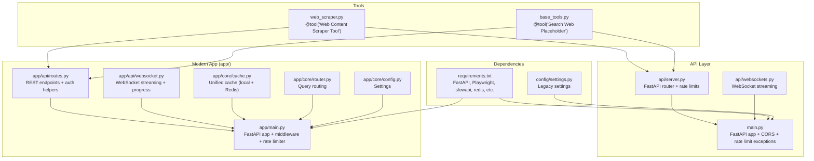
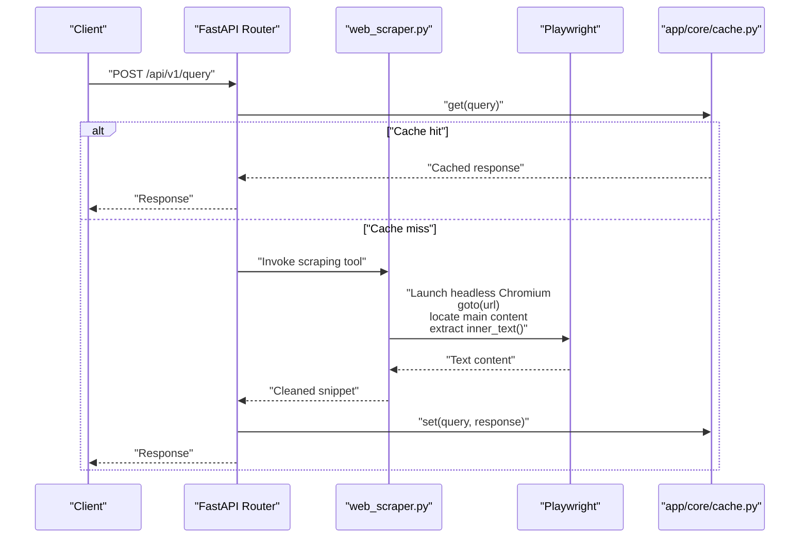
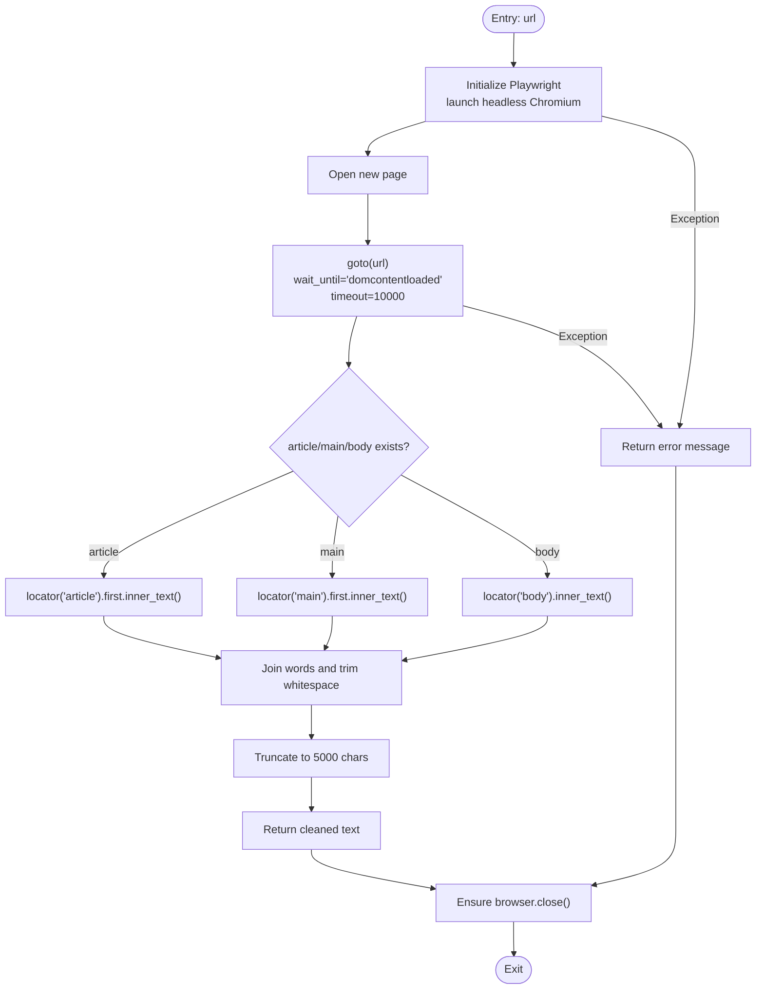
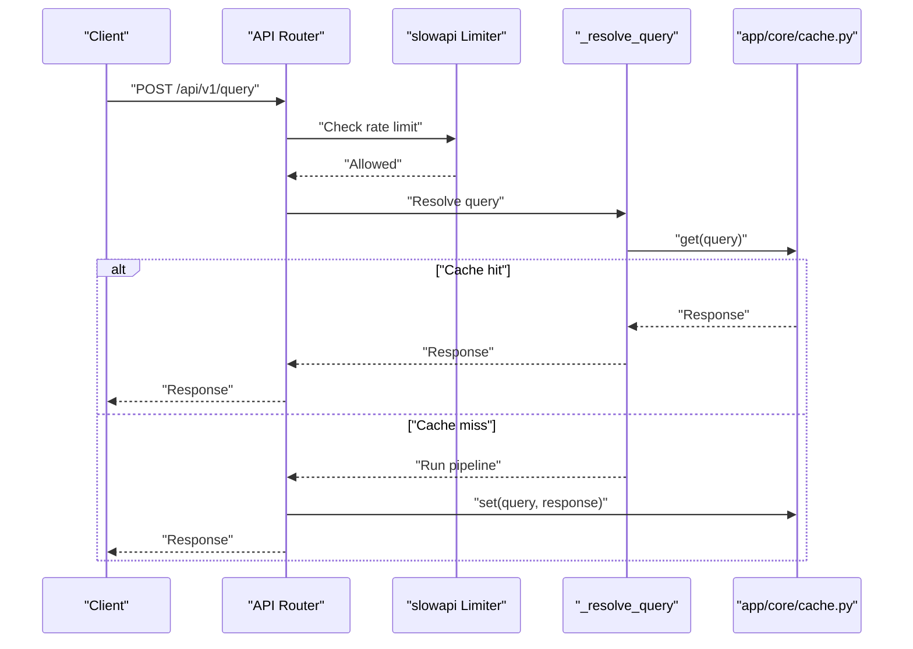
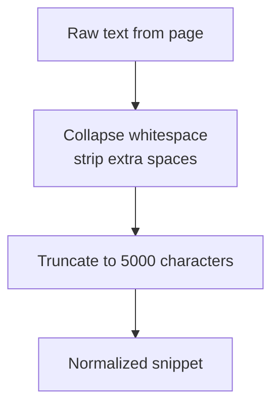
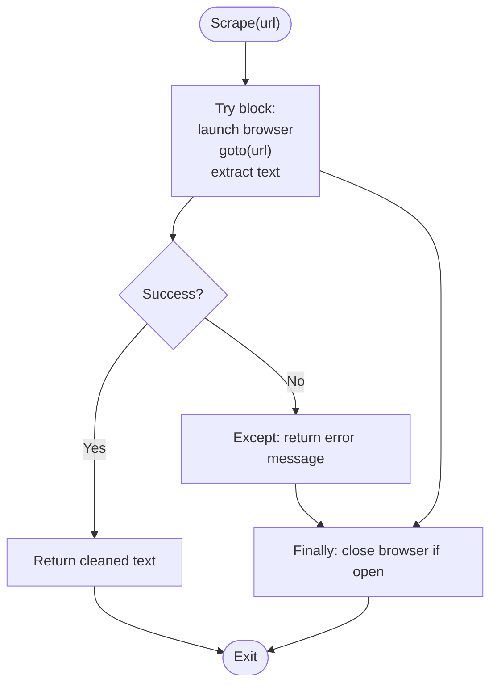
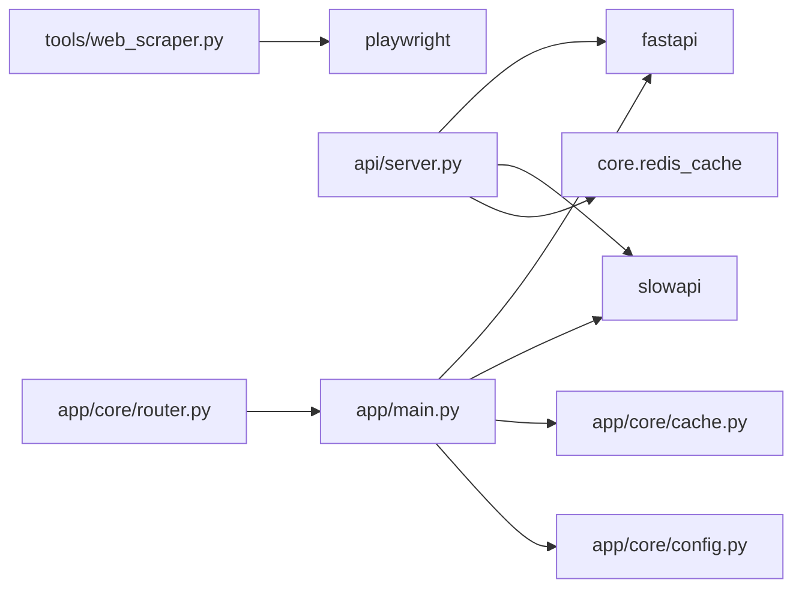

# Web Scraping Tools

<cite>
**Referenced Files in This Document**
- [web_scraper.py](file://veritas-ai/tools/web_scraper.py)
- [base_tools.py](file://veritas-ai/tools/base_tools.py)
- [settings.py](file://veritas-ai/config/settings.py)
- [main.py](file://veritas-ai/main.py)
- [server.py](file://veritas-ai/api/server.py)
- [websockets.py](file://veritas-ai/api/websockets.py)
- [requirements.txt](file://veritas-ai/requirements.txt)
- [app/main.py](file://veritas-ai/app/main.py)
- [app/api/routes.py](file://veritas-ai/app/api/routes.py)
- [app/api/websocket.py](file://veritas-ai/app/api/websocket.py)
- [app/core/config.py](file://veritas-ai/app/core/config.py)
- [app/core/cache.py](file://veritas-ai/app/core/cache.py)
- [app/core/router.py](file://veritas-ai/app/core/router.py)
</cite>

## Table of Contents
1. [Introduction](#introduction)
2. [Project Structure](#project-structure)
3. [Core Components](#core-components)
4. [Architecture Overview](#architecture-overview)
5. [Detailed Component Analysis](#detailed-component-analysis)
6. [Dependency Analysis](#dependency-analysis)
7. [Performance Considerations](#performance-considerations)
8. [Troubleshooting Guide](#troubleshooting-guide)
9. [Conclusion](#conclusion)
10. [Appendices](#appendices)

## Introduction
This document describes the web scraping tools implementation with a focus on content extraction and preprocessing. It explains the scraping architecture, URL handling, content parsing mechanisms, integration with web frameworks, and the extraction of structured data from unstructured web content. It also documents the preprocessing pipeline for cleaning and normalizing scraped content, configuration options for user agents and request headers, rate limiting, error handling for network failures and parsing errors, and practical examples of scraping different content types within the broader tool ecosystem.

## Project Structure
The web scraping capability is implemented as a LangChain tool that integrates with a Playwright-driven browser automation stack. The tool is designed to be invoked from higher-level pipelines and APIs, which route queries to either fast or deep processing modes depending on query characteristics. The system exposes REST and WebSocket endpoints for query execution and streaming, with built-in caching and rate limiting.

**Diagram sources**
- [web_scraper.py:1-35](file://veritas-ai/tools/web_scraper.py#L1-L35)
- [base_tools.py:1-10](file://veritas-ai/tools/base_tools.py#L1-L10)
- [server.py:1-285](file://veritas-ai/api/server.py#L1-L285)
- [websockets.py:1-234](file://veritas-ai/api/websockets.py#L1-L234)
- [main.py:1-141](file://veritas-ai/main.py#L1-L141)
- [app/main.py:1-208](file://veritas-ai/app/main.py#L1-L208)
- [app/api/routes.py:1-251](file://veritas-ai/app/api/routes.py#L1-L251)
- [app/api/websocket.py:1-253](file://veritas-ai/app/api/websocket.py#L1-L253)
- [app/core/cache.py:1-172](file://veritas-ai/app/core/cache.py#L1-L172)
- [app/core/router.py:1-19](file://veritas-ai/app/core/router.py#L1-L19)
- [app/core/config.py:1-88](file://veritas-ai/app/core/config.py#L1-L88)
- [requirements.txt:1-42](file://veritas-ai/requirements.txt#L1-L42)
- [settings.py:1-83](file://veritas-ai/config/settings.py#L1-L83)

**Section sources**
- [web_scraper.py:1-35](file://veritas-ai/tools/web_scraper.py#L1-L35)
- [server.py:1-285](file://veritas-ai/api/server.py#L1-L285)
- [websockets.py:1-234](file://veritas-ai/api/websockets.py#L1-L234)
- [main.py:1-141](file://veritas-ai/main.py#L1-L141)
- [app/main.py:1-208](file://veritas-ai/app/main.py#L1-L208)
- [app/api/routes.py:1-251](file://veritas-ai/app/api/routes.py#L1-L251)
- [app/api/websocket.py:1-253](file://veritas-ai/app/api/websocket.py#L1-L253)
- [app/core/cache.py:1-172](file://veritas-ai/app/core/cache.py#L1-L172)
- [app/core/router.py:1-19](file://veritas-ai/app/core/router.py#L1-L19)
- [app/core/config.py:1-88](file://veritas-ai/app/core/config.py#L1-L88)
- [requirements.txt:1-42](file://veritas-ai/requirements.txt#L1-L42)
- [settings.py:1-83](file://veritas-ai/config/settings.py#L1-L83)

## Core Components
- Web Content Scraper Tool: A LangChain tool that uses Playwright to navigate a URL, locate primary content areas, extract text, normalize whitespace, and return a trimmed snippet. It includes basic exception handling and ensures the browser is closed in all cases.
- Base Tools: Provides a placeholder tool for web search, indicating future integration with real APIs and scraping architectures.
- API Layer: Exposes REST endpoints and WebSocket streams with rate limiting and CORS policies. Legacy integration points remain for backward compatibility.
- Modern App (app/): The new clean architecture with unified caching, routing, and streaming. It replaces legacy modules and centralizes configuration and middleware.
- Configuration and Settings: Centralized settings via Pydantic settings, including performance, security, and infrastructure options.

Key implementation references:
- Tool definition and scraping logic: [web_scraper.py:4-35](file://veritas-ai/tools/web_scraper.py#L4-L35)
- Placeholder tool: [base_tools.py:3-9](file://veritas-ai/tools/base_tools.py#L3-L9)
- REST endpoints and rate limiting: [server.py:81-106](file://veritas-ai/api/server.py#L81-L106), [app/api/routes.py:100-129](file://veritas-ai/app/api/routes.py#L100-L129)
- WebSocket streaming: [websockets.py:112-234](file://veritas-ai/api/websockets.py#L112-L234), [app/api/websocket.py:63-165](file://veritas-ai/app/api/websocket.py#L63-L165)
- Caching and routing: [app/core/cache.py:15-172](file://veritas-ai/app/core/cache.py#L15-L172), [app/core/router.py:10-19](file://veritas-ai/app/core/router.py#L10-L19)
- Settings and environment: [app/core/config.py:19-88](file://veritas-ai/app/core/config.py#L19-L88), [settings.py:13-83](file://veritas-ai/config/settings.py#L13-L83)

**Section sources**
- [web_scraper.py:1-35](file://veritas-ai/tools/web_scraper.py#L1-L35)
- [base_tools.py:1-10](file://veritas-ai/tools/base_tools.py#L1-L10)
- [server.py:1-285](file://veritas-ai/api/server.py#L1-L285)
- [websockets.py:1-234](file://veritas-ai/api/websockets.py#L1-L234)
- [app/main.py:1-208](file://veritas-ai/app/main.py#L1-L208)
- [app/api/routes.py:1-251](file://veritas-ai/app/api/routes.py#L1-L251)
- [app/api/websocket.py:1-253](file://veritas-ai/app/api/websocket.py#L1-L253)
- [app/core/cache.py:1-172](file://veritas-ai/app/core/cache.py#L1-L172)
- [app/core/router.py:1-19](file://veritas-ai/app/core/router.py#L1-L19)
- [app/core/config.py:1-88](file://veritas-ai/app/core/config.py#L1-L88)
- [settings.py:1-83](file://veritas-ai/config/settings.py#L1-L83)

## Architecture Overview
The scraping tool is a LangChain decorator-wrapped function that orchestrates Playwright to render pages and extract text. Requests reach the API layer, which applies rate limits and forwards to pipelines. Responses are cached and streamed to clients via WebSocket. The modern app module consolidates configuration, middleware, and routing for improved maintainability.

**Diagram sources**
- [app/api/routes.py:46-82](file://veritas-ai/app/api/routes.py#L46-L82)
- [app/core/cache.py:66-115](file://veritas-ai/app/core/cache.py#L66-L115)
- [web_scraper.py:10-35](file://veritas-ai/tools/web_scraper.py#L10-L35)

**Section sources**
- [app/api/routes.py:1-251](file://veritas-ai/app/api/routes.py#L1-L251)
- [app/core/cache.py:1-172](file://veritas-ai/app/core/cache.py#L1-L172)
- [web_scraper.py:1-35](file://veritas-ai/tools/web_scraper.py#L1-L35)

## Detailed Component Analysis

### Web Content Scraper Tool
- Purpose: Extract readable text from a given URL using Playwright.
- URL handling: Navigates to the URL with a DOMContentLoaded wait and a timeout.
- Content parsing: Heuristic selection among article, main, or body elements; extracts inner text; normalizes whitespace; truncates to a fixed length.
- Error handling: Catches exceptions and returns a descriptive message; ensures browser closure in finally block.
- Integration: Designed as a LangChain tool for use in agent workflows and pipelines.

**Diagram sources**
- [web_scraper.py:10-35](file://veritas-ai/tools/web_scraper.py#L10-L35)

**Section sources**
- [web_scraper.py:1-35](file://veritas-ai/tools/web_scraper.py#L1-L35)

### API Integration and Rate Limiting
- REST endpoints: Provide query resolution with optional deep mode, history, feedback, and metrics.
- WebSocket streaming: Supports progress updates and real-time response delivery.
- Rate limiting: Applied per endpoint using slowapi; exceptions are handled centrally.
- CORS: Configured globally for cross-origin support.

**Diagram sources**
- [app/api/routes.py:81-129](file://veritas-ai/app/api/routes.py#L81-L129)
- [app/main.py:177-198](file://veritas-ai/app/main.py#L177-L198)
- [app/core/cache.py:66-115](file://veritas-ai/app/core/cache.py#L66-L115)

**Section sources**
- [app/api/routes.py:1-251](file://veritas-ai/app/api/routes.py#L1-L251)
- [app/main.py:1-208](file://veritas-ai/app/main.py#L1-L208)
- [app/core/cache.py:1-172](file://veritas-ai/app/core/cache.py#L1-L172)

### Preprocessing Pipeline
- Text normalization: Whitespace collapsing and trimming.
- Content length control: Fixed-length truncation to manage downstream processing.
- Future enhancements: Additional cleaning steps, entity extraction, and metadata tagging can be layered after the initial extraction.

**Diagram sources**
- [web_scraper.py:25-26](file://veritas-ai/tools/web_scraper.py#L25-L26)

**Section sources**
- [web_scraper.py:1-35](file://veritas-ai/tools/web_scraper.py#L1-L35)

### Configuration Options
- Environment-driven settings: Application name, environment, API prefixes, timeouts, cache sizes, and streaming options.
- Security and performance: CORS origins, rate limiting, and streaming chunk size.
- Infrastructure: Redis connectivity, vector DB, and external API keys.

Examples of relevant settings:
- Performance and timeouts: [app/core/config.py:31-37](file://veritas-ai/app/core/config.py#L31-L37)
- Streaming and parallelism: [app/core/config.py:73-76](file://veritas-ai/app/core/config.py#L73-L76)
- Legacy settings (compatibility): [settings.py:20-29](file://veritas-ai/config/settings.py#L20-L29)

Note: The current scraping tool does not expose user agent or request header customization. These can be added by extending the Playwright configuration within the tool.

**Section sources**
- [app/core/config.py:1-88](file://veritas-ai/app/core/config.py#L1-L88)
- [settings.py:1-83](file://veritas-ai/config/settings.py#L1-L83)

### Error Handling
- Network failures: Playwright navigation and content extraction are wrapped in try-except; exceptions return a descriptive message.
- Browser lifecycle: Ensures browser closure in finally block to prevent resource leaks.
- API-level resilience: Global exception handlers and rate limit exception handlers provide consistent error responses.

**Diagram sources**
- [web_scraper.py:10-35](file://veritas-ai/tools/web_scraper.py#L10-L35)

**Section sources**
- [web_scraper.py:1-35](file://veritas-ai/tools/web_scraper.py#L1-L35)
- [app/main.py:112-119](file://veritas-ai/app/main.py#L112-L119)

### Examples of Scraping Different Content Types
- Articles and official statements: The tool prioritizes article and main elements, making it suitable for news articles, press releases, and formal documents.
- General web pages: Falls back to body content when specialized selectors are absent.
- Integration with pipelines: The extracted snippet can feed into downstream verification and summarization pipelines.

Practical references:
- Selector heuristics: [web_scraper.py:17-23](file://veritas-ai/tools/web_scraper.py#L17-L23)
- Integration points: [app/api/routes.py:46-82](file://veritas-ai/app/api/routes.py#L46-L82), [app/api/websocket.py:115-148](file://veritas-ai/app/api/websocket.py#L115-L148)

**Section sources**
- [web_scraper.py:1-35](file://veritas-ai/tools/web_scraper.py#L1-L35)
- [app/api/routes.py:1-251](file://veritas-ai/app/api/routes.py#L1-L251)
- [app/api/websocket.py:1-253](file://veritas-ai/app/api/websocket.py#L1-L253)

## Dependency Analysis
The scraping tool depends on Playwright for rendering and content extraction. The API layer depends on FastAPI, slowapi for rate limiting, and Redis for caching. The modern app module centralizes configuration and middleware, reducing coupling and improving cohesion.

**Diagram sources**
- [web_scraper.py:1-35](file://veritas-ai/tools/web_scraper.py#L1-L35)
- [server.py:1-285](file://veritas-ai/api/server.py#L1-L285)
- [app/main.py:1-208](file://veritas-ai/app/main.py#L1-L208)
- [app/core/cache.py:1-172](file://veritas-ai/app/core/cache.py#L1-L172)
- [app/core/router.py:1-19](file://veritas-ai/app/core/router.py#L1-L19)
- [requirements.txt:14-17](file://veritas-ai/requirements.txt#L14-L17)

**Section sources**
- [requirements.txt:1-42](file://veritas-ai/requirements.txt#L1-L42)
- [web_scraper.py:1-35](file://veritas-ai/tools/web_scraper.py#L1-L35)
- [server.py:1-285](file://veritas-ai/api/server.py#L1-L285)
- [app/main.py:1-208](file://veritas-ai/app/main.py#L1-L208)
- [app/core/cache.py:1-172](file://veritas-ai/app/core/cache.py#L1-L172)
- [app/core/router.py:1-19](file://veritas-ai/app/core/router.py#L1-L19)

## Performance Considerations
- Headless browser overhead: Launching and closing a Chromium instance per request adds latency. Consider pooling or reusing contexts if throughput demands increase.
- Content truncation: Limiting output reduces downstream processing costs and improves response times.
- Caching: Unified cache (local + Redis) accelerates repeated queries and reduces scraping frequency.
- Rate limiting: Per-endpoint limits protect resources and ensure fair usage.
- Streaming: WebSocket endpoints provide progress updates and reduce perceived latency for long-running tasks.

[No sources needed since this section provides general guidance]

## Troubleshooting Guide
Common issues and resolutions:
- Navigation timeouts: Increase timeout or retry with a simplified selector.
- Empty content: Verify the page renders JavaScript; consider increasing wait conditions.
- Resource leaks: Ensure browser instances are closed; the tool’s finally block handles this.
- Rate limit exceeded: Adjust client-side throttling or request frequency.
- CORS errors: Confirm allowed origins and credentials configuration.
- Cache misses: Validate Redis availability and connectivity; fallback to local cache is automatic.

**Section sources**
- [web_scraper.py:10-35](file://veritas-ai/tools/web_scraper.py#L10-L35)
- [app/main.py:90-96](file://veritas-ai/app/main.py#L90-L96)
- [app/core/cache.py:43-65](file://veritas-ai/app/core/cache.py#L43-L65)

## Conclusion
The web scraping tools implementation leverages Playwright through a LangChain tool to extract readable content from URLs, with robust preprocessing and integration into the broader API and streaming ecosystem. The modern app architecture centralizes configuration, caching, and routing, enabling scalable and maintainable content ingestion. While the current tool focuses on heuristic-based extraction, future enhancements can include configurable user agents, request headers, and richer content normalization.

[No sources needed since this section summarizes without analyzing specific files]

## Appendices
- Example environment variables and settings: [app/core/config.py:19-88](file://veritas-ai/app/core/config.py#L19-L88), [settings.py:13-83](file://veritas-ai/config/settings.py#L13-L83)
- Dependencies overview: [requirements.txt:1-42](file://veritas-ai/requirements.txt#L1-L42)