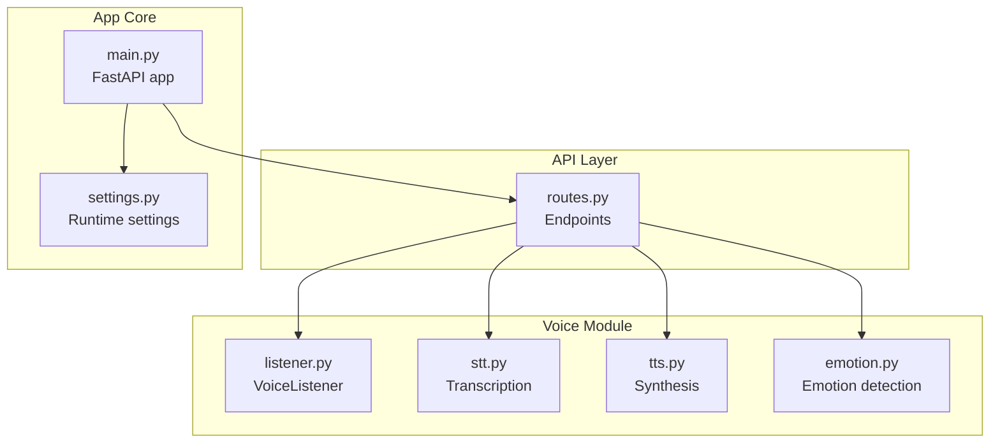
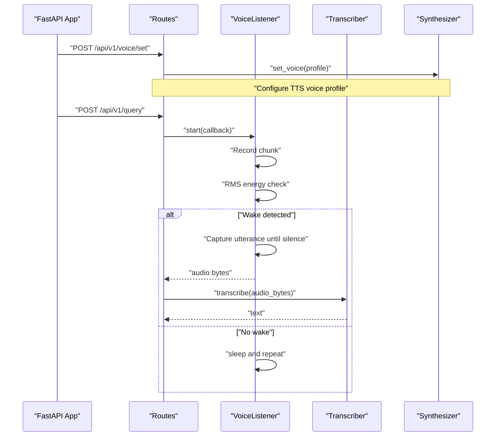
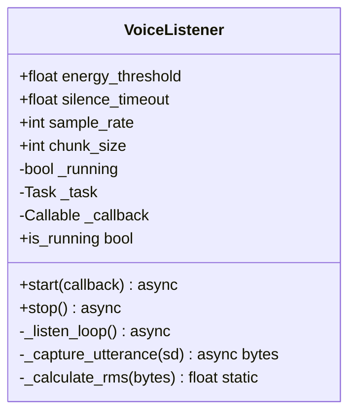
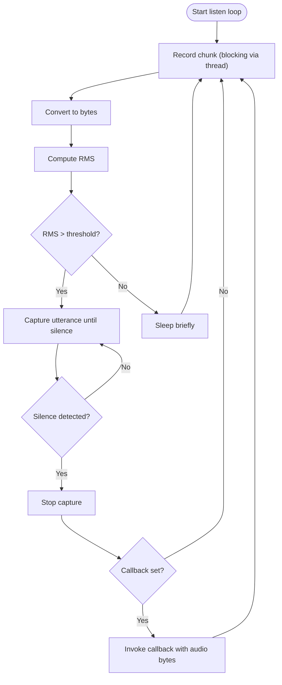
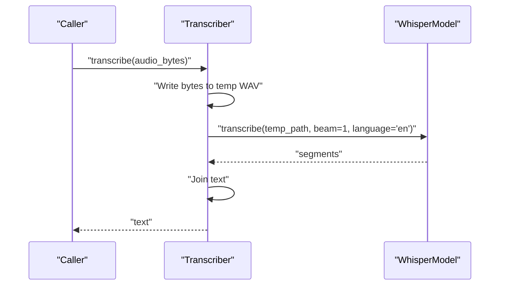
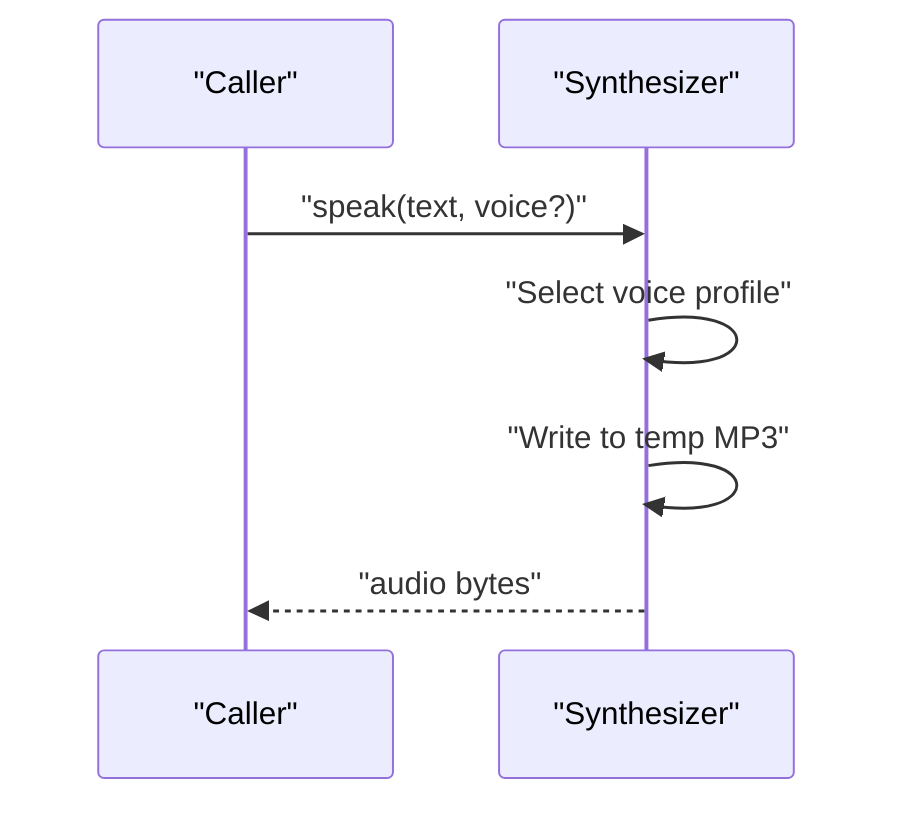
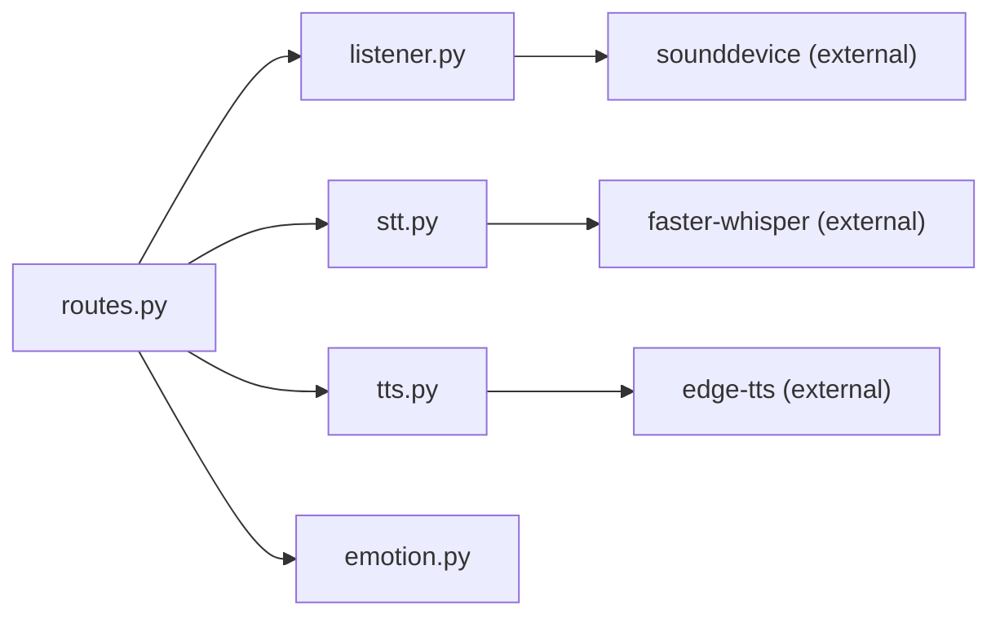

# Audio Processing & Capture

<cite>
**Referenced Files in This Document**
- [listener.py](file://veritas-ai/app/voice/listener.py)
- [stt.py](file://veritas-ai/app/voice/stt.py)
- [tts.py](file://veritas-ai/app/voice/tts.py)
- [emotion.py](file://veritas-ai/app/voice/emotion.py)
- [routes.py](file://veritas-ai/app/api/routes.py)
- [settings.py](file://veritas-ai/config/settings.py)
- [main.py](file://veritas-ai/app/main.py)
</cite>

## Table of Contents
1. [Introduction](#introduction)
2. [Project Structure](#project-structure)
3. [Core Components](#core-components)
4. [Architecture Overview](#architecture-overview)
5. [Detailed Component Analysis](#detailed-component-analysis)
6. [Dependency Analysis](#dependency-analysis)
7. [Performance Considerations](#performance-considerations)
8. [Troubleshooting Guide](#troubleshooting-guide)
9. [Conclusion](#conclusion)
10. [Appendices](#appendices)

## Introduction
This document describes the audio processing and capture system with a focus on real-time microphone input handling, speech activity detection, and integration points for speech-to-text and text-to-speech. It documents the VoiceListener class for continuous audio capture, buffer management, and energy-based voice activity detection, along with transcription and synthesis capabilities. Guidance is included for configuring silence thresholds, managing audio format and sample-rate adaptation, and integrating with external systems such as browser-based recording and WebRTC audio processing.

## Project Structure
The audio subsystem resides under the voice module and integrates with the FastAPI application via routes. Configuration is centralized in settings.

**Diagram sources**
- [listener.py](file://veritas-ai/app/voice/listener.py)
- [stt.py](file://veritas-ai/app/voice/stt.py)
- [tts.py](file://veritas-ai/app/voice/tts.py)
- [emotion.py](file://veritas-ai/app/voice/emotion.py)
- [routes.py](file://veritas-ai/app/api/routes.py)
- [settings.py](file://veritas-ai/config/settings.py)
- [main.py](file://veritas-ai/app/main.py)

**Section sources**
- [main.py](file://veritas-ai/app/main.py)
- [routes.py](file://veritas-ai/app/api/routes.py)
- [settings.py](file://veritas-ai/config/settings.py)

## Core Components
- VoiceListener: Real-time microphone capture with energy-based wake detection and continuous recording until silence.
- Speech-to-text (STT): Asynchronous transcription using Faster-Whisper with lazy model loading and temporary file I/O.
- Text-to-speech (TTS): Asynchronous synthesis using Edge-TTS with configurable voice profiles.
- Emotion detection: Keyword-based emotion classification mapped to voice parameter adjustments.

Key responsibilities:
- Microphone capture and buffering with configurable sample rate and chunk size.
- Voice activity detection via RMS energy thresholding and silence timeout logic.
- Asynchronous transcription and synthesis to avoid blocking the event loop.
- Emotion-aware voice synthesis adjustments.

**Section sources**
- [listener.py](file://veritas-ai/app/voice/listener.py)
- [stt.py](file://veritas-ai/app/voice/stt.py)
- [tts.py](file://veritas-ai/app/voice/tts.py)
- [emotion.py](file://veritas-ai/app/voice/emotion.py)

## Architecture Overview
The system combines a background audio listener with STT/TTS pipelines and exposes endpoints for voice configuration and synthesis.

**Diagram sources**
- [routes.py](file://veritas-ai/app/api/routes.py)
- [listener.py](file://veritas-ai/app/voice/listener.py)
- [stt.py](file://veritas-ai/app/voice/stt.py)
- [tts.py](file://veritas-ai/app/voice/tts.py)

## Detailed Component Analysis

### VoiceListener: Real-time Audio Capture and VAD
The VoiceListener class performs continuous background capture using sounddevice, computes RMS energy per chunk, and triggers capture when energy exceeds a threshold. It then records subsequent chunks until silence persists beyond a configured timeout.

Implementation highlights:
- Initialization parameters: energy threshold, silence timeout, sample rate, chunk size.
- RMS energy calculation from 16-bit PCM chunks.
- Asynchronous capture loop using asyncio.to_thread to avoid blocking the event loop.
- Wake detection: energy threshold crossing.
- Utterance capture: continues until silence_count reaches max_silence_chunks; caps total duration.
- Thread-safe lifecycle: start/stop with task management and cancellation.

**Diagram sources**
- [listener.py](file://veritas-ai/app/voice/listener.py)

**Diagram sources**
- [listener.py](file://veritas-ai/app/voice/listener.py)

Operational parameters and defaults:
- Sample rate: 16000 Hz.
- Chunk size: 1024 frames.
- Silence timeout: 2.0 seconds.
- Energy threshold: 1000.0 (adjustable).

Voice activity detection logic:
- Wake detection uses a single RMS threshold.
- Silence detection uses a lower threshold (approx. 30% of wake threshold) and counts consecutive silent chunks up to a maximum determined by silence_timeout and chunk_size.
- Maximum utterance duration is capped to approximately 10 seconds.

Buffer management:
- Chunks are accumulated in memory until silence or timeout.
- Returned audio is a concatenated byte buffer.

Automatic gain control:
- Not implemented in VoiceListener; amplitude normalization occurs outside this module.

Audio format and channel processing:
- Input format: 16-bit signed integers.
- Channels: mono (channels=1).
- No explicit resampling or format conversion is performed within VoiceListener.

Integration points:
- Exposes a module-level singleton for convenience.
- Provides a callback interface for downstream processing (e.g., transcription).

**Section sources**
- [listener.py](file://veritas-ai/app/voice/listener.py)

### Speech-to-Text (Faster-Whisper)
The STT module lazily loads a Faster-Whisper model on first use and transcribes audio bytes asynchronously by writing to a temporary WAV file. It returns transcribed text and handles errors gracefully.

Key behaviors:
- Lazy-loading with a global lock to ensure thread-safe initialization.
- Uses a small beam size and English language assumption for speed.
- Writes audio bytes to a temporary file because the underlying library expects a file path.
- Runs transcription in a thread pool to avoid blocking the event loop.

**Diagram sources**
- [stt.py](file://veritas-ai/app/voice/stt.py)

Configuration and behavior:
- Model: tiny, compute type int8, device cpu.
- Language: English.
- Beam size: 1 for faster decoding.

**Section sources**
- [stt.py](file://veritas-ai/app/voice/stt.py)

### Text-to-Speech (Edge-TTS)
The TTS module supports multiple voice profiles and generates MP3 audio asynchronously. It writes synthesized audio to a temporary file and returns the bytes.

Highlights:
- Voice profiles mapped by name to service-specific identifiers.
- Global current voice can be changed via set_voice.
- Asynchronous generation with temporary file cleanup.

**Diagram sources**
- [tts.py](file://veritas-ai/app/voice/tts.py)

**Section sources**
- [tts.py](file://veritas-ai/app/voice/tts.py)

### Emotion Detection and Voice Adjustment
The emotion module performs keyword-based emotion classification and maps emotions to voice parameter adjustments. While not directly part of audio capture, it complements TTS by selecting appropriate voice characteristics.

Behavior:
- Emotion keywords define scoring for urgent, concerned, positive, negative.
- Neutral is default when no keywords match.
- Voice adjustment dictionary provides rate and pitch deltas per emotion.

**Section sources**
- [emotion.py](file://veritas-ai/app/voice/emotion.py)

## Dependency Analysis
The voice components are loosely coupled and primarily depend on third-party libraries for audio I/O and ML inference. The FastAPI routes integrate these components and expose configuration endpoints.

**Diagram sources**
- [routes.py](file://veritas-ai/app/api/routes.py)
- [listener.py](file://veritas-ai/app/voice/listener.py)
- [stt.py](file://veritas-ai/app/voice/stt.py)
- [tts.py](file://veritas-ai/app/voice/tts.py)

**Section sources**
- [routes.py](file://veritas-ai/app/api/routes.py)
- [listener.py](file://veritas-ai/app/voice/listener.py)
- [stt.py](file://veritas-ai/app/voice/stt.py)
- [tts.py](file://veritas-ai/app/voice/tts.py)

## Performance Considerations
- Event loop safety: All blocking operations (sounddevice recording, file I/O) are executed in threads via asyncio.to_thread to keep the event loop responsive.
- Model loading: Faster-Whisper model is lazily loaded and reused across invocations to reduce startup overhead.
- Buffer sizing: Chunk size and sample rate directly impact latency and CPU usage. Smaller chunks reduce latency but increase overhead; larger chunks improve stability but increase delay.
- Silence timeout: Controls maximum recording length and affects responsiveness to silence.
- I/O patterns: Temporary files are used for Faster-Whisper transcription; ensure fast storage for minimal disk I/O bottlenecks.

[No sources needed since this section provides general guidance]

## Troubleshooting Guide
Common issues and resolutions:
- Missing audio backend:
  - Symptom: Listener reports missing sounddevice installation.
  - Action: Install sounddevice per the logged suggestion.
- Missing transcription engine:
  - Symptom: STT module reports missing faster-whisper installation.
  - Action: Install faster-whisper per the logged suggestion.
- Missing synthesis engine:
  - Symptom: TTS module reports missing edge-tts installation.
  - Action: Install edge-tts per the logged suggestion.
- Audio hardware errors:
  - Symptom: Exceptions during recording or playback.
  - Action: Verify microphone permissions, device availability, and driver compatibility. Adjust sample rate and chunk size to reduce load.
- Performance bottlenecks:
  - Symptom: High CPU usage or dropped frames.
  - Action: Reduce chunk size or sample rate; disable heavy post-processing; ensure model is loaded once and reused.
- Latency concerns:
  - Symptom: Delay between speech and transcription.
  - Action: Lower chunk size and silence timeout; ensure adequate CPU headroom; avoid synchronous I/O in hot paths.

**Section sources**
- [listener.py](file://veritas-ai/app/voice/listener.py)
- [stt.py](file://veritas-ai/app/voice/stt.py)
- [tts.py](file://veritas-ai/app/voice/tts.py)

## Conclusion
The audio processing and capture system centers around a robust VoiceListener that continuously monitors microphone input, detects voice activity using RMS energy thresholds, and captures utterances until silence. Transcription and synthesis are integrated asynchronously to maintain responsiveness, while emotion detection enables expressive voice output. The system is designed for real-time operation with configurable parameters for latency and reliability.

[No sources needed since this section summarizes without analyzing specific files]

## Appendices

### Integration Examples and Cross-Platform Notes
- Browser MediaRecorder API:
  - Capture microphone input in the browser and send audio frames to a WebSocket or HTTP endpoint for transcription.
  - Ensure consistent sample rate and format; if adapting to 16 kHz and mono, configure the browser constraints accordingly.
- WebRTC audio processing:
  - Use WebRTC’s audio track manipulation to apply echo cancellation and noise suppression before sending to the backend.
  - Align sample rate and channel configuration with VoiceListener expectations.
- Cross-platform audio capture:
  - On platforms where sounddevice is unavailable, consider alternative backends or pre-recorded audio files for testing.
  - Validate device permissions and handle permission prompts gracefully.

[No sources needed since this section provides general guidance]

### Configuration Reference
- Runtime settings:
  - Pipeline timeouts, streaming behavior, and chunk sizes are managed via settings.
- VoiceListener parameters:
  - energy_threshold, silence_timeout, sample_rate, chunk_size.
- STT/TTS:
  - Voice profiles and model selection are exposed via routes and module APIs.

**Section sources**
- [settings.py](file://veritas-ai/config/settings.py)
- [routes.py](file://veritas-ai/app/api/routes.py)
- [listener.py](file://veritas-ai/app/voice/listener.py)
- [tts.py](file://veritas-ai/app/voice/tts.py)
- [stt.py](file://veritas-ai/app/voice/stt.py)