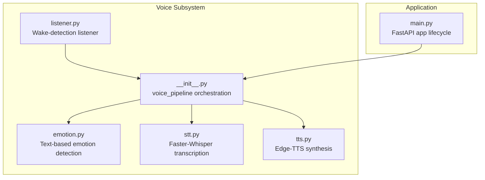
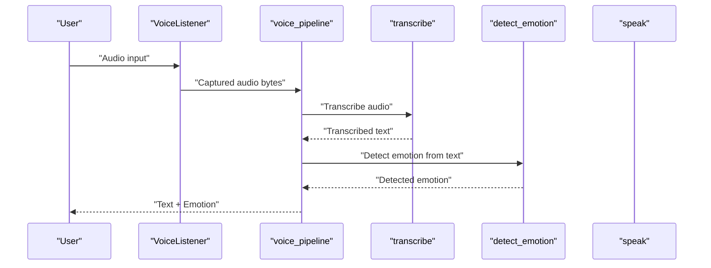
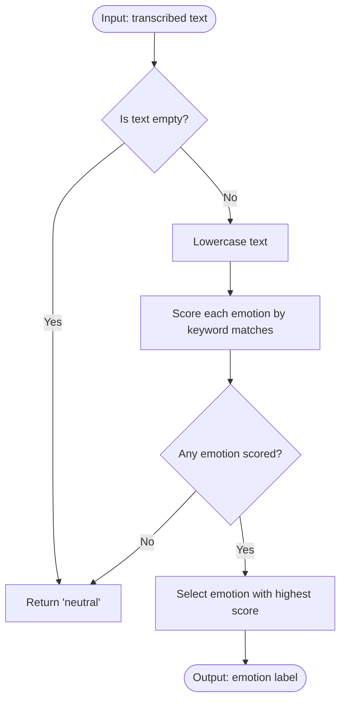
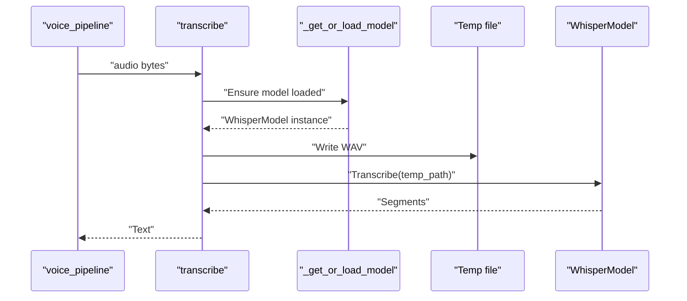
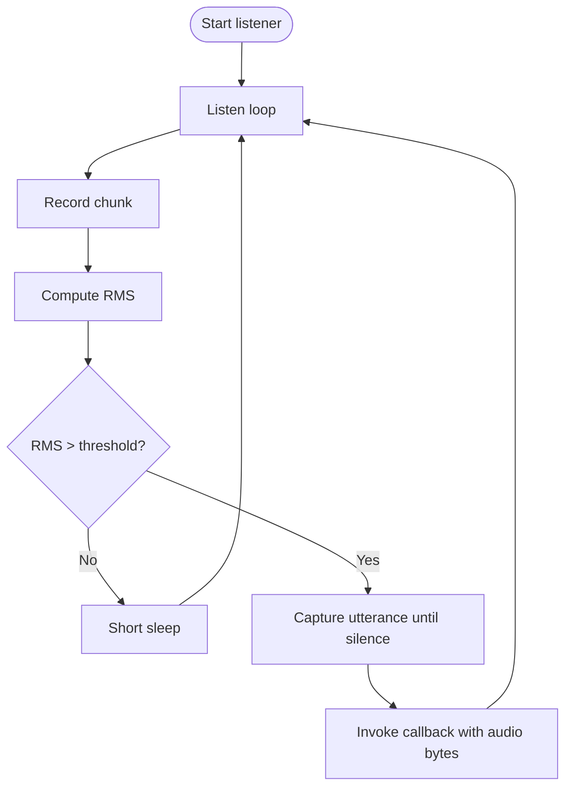
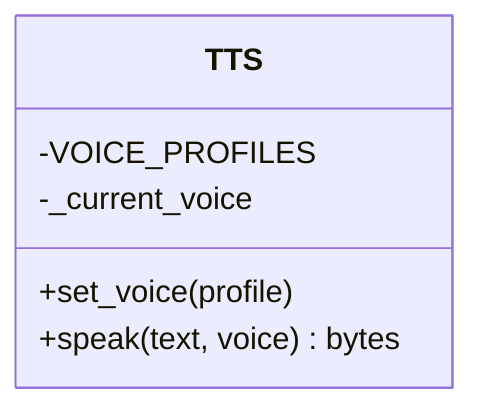
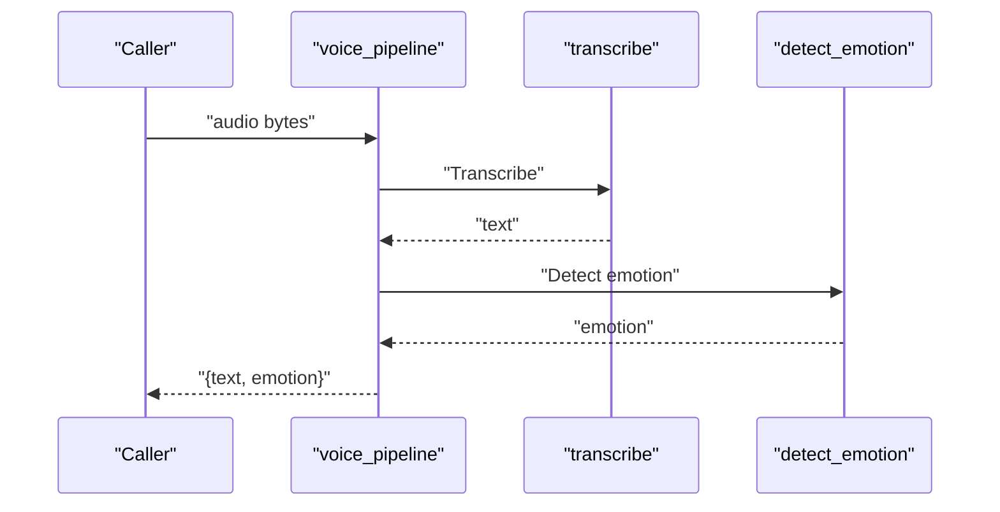
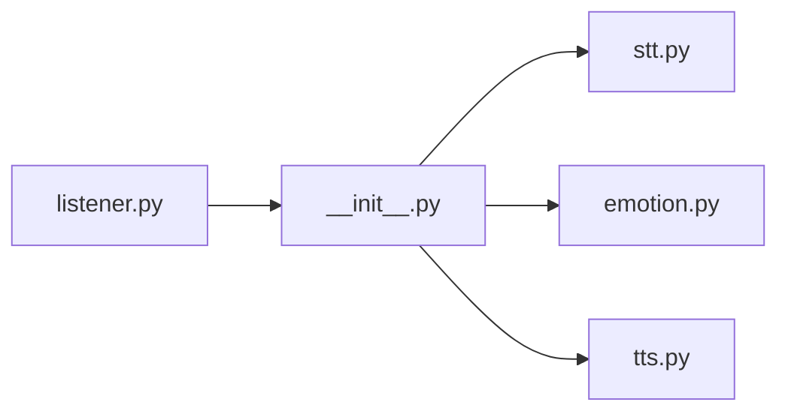

# Emotional Analysis & Tone Detection

<cite>
**Referenced Files in This Document**
- [emotion.py](file://veritas-ai/app/voice/emotion.py)
- [stt.py](file://veritas-ai/app/voice/stt.py)
- [tts.py](file://veritas-ai/app/voice/tts.py)
- [listener.py](file://veritas-ai/app/voice/listener.py)
- [__init__.py](file://veritas-ai/app/voice/__init__.py)
- [main.py](file://veritas-ai/app/main.py)
</cite>

## Table of Contents
1. [Introduction](#introduction)
2. [Project Structure](#project-structure)
3. [Core Components](#core-components)
4. [Architecture Overview](#architecture-overview)
5. [Detailed Component Analysis](#detailed-component-analysis)
6. [Dependency Analysis](#dependency-analysis)
7. [Performance Considerations](#performance-considerations)
8. [Troubleshooting Guide](#troubleshooting-guide)
9. [Conclusion](#conclusion)
10. [Appendices](#appendices)

## Introduction
This document describes the emotional analysis and tone detection subsystem focused on interpreting sentiment from speech patterns. The current implementation performs text-based emotion detection using keyword matching and maps detected emotions to prosody adjustments for text-to-speech synthesis. It integrates with a broader voice pipeline that includes speech-to-text, continuous audio capture, and text-to-speech synthesis. The system is designed for real-time responsiveness and provides a foundation for future enhancements such as audio-based acoustic feature extraction and machine learning classification.

## Project Structure
The voice subsystem resides under veritas-ai/app/voice and comprises:
- Emotion detection from text
- Speech-to-text transcription
- Continuous microphone listener with wake detection
- Text-to-speech synthesis
- A high-level voice pipeline orchestrating these components

**Diagram sources**
- [emotion.py:1-53](file://veritas-ai/app/voice/emotion.py#L1-L53)
- [stt.py:1-60](file://veritas-ai/app/voice/stt.py#L1-L60)
- [tts.py:1-68](file://veritas-ai/app/voice/tts.py#L1-L68)
- [listener.py:1-169](file://veritas-ai/app/voice/listener.py#L1-L169)
- [__init__.py:1-20](file://veritas-ai/app/voice/__init__.py#L1-L20)
- [main.py:1-208](file://veritas-ai/app/main.py#L1-L208)

**Section sources**
- [emotion.py:1-53](file://veritas-ai/app/voice/emotion.py#L1-L53)
- [stt.py:1-60](file://veritas-ai/app/voice/stt.py#L1-L60)
- [tts.py:1-68](file://veritas-ai/app/voice/tts.py#L1-L68)
- [listener.py:1-169](file://veritas-ai/app/voice/listener.py#L1-L169)
- [__init__.py:1-20](file://veritas-ai/app/voice/__init__.py#L1-L20)
- [main.py:1-208](file://veritas-ai/app/main.py#L1-L208)

## Core Components
- Emotion detection from text: Keyword-based scoring across predefined categories and mapping to prosody adjustments.
- Speech-to-text: Asynchronous transcription using Faster-Whisper with lazy model loading.
- Continuous listener: Energy-based wake detection and audio capture with silence timeout.
- Text-to-speech: Asynchronous synthesis using Edge-TTS with configurable voice profiles.
- Voice pipeline: Orchestration of listener-triggered audio capture, transcription, emotion detection, and result packaging.

**Section sources**
- [emotion.py:26-52](file://veritas-ai/app/voice/emotion.py#L26-L52)
- [stt.py:15-60](file://veritas-ai/app/voice/stt.py#L15-L60)
- [listener.py:11-169](file://veritas-ai/app/voice/listener.py#L11-L169)
- [tts.py:22-68](file://veritas-ai/app/voice/tts.py#L22-L68)
- [__init__.py:8-19](file://veritas-ai/app/voice/__init__.py#L8-L19)

## Architecture Overview
The voice pipeline transforms raw audio into emotion-aware text and prosody-adjusted speech. The continuous listener captures audio upon wake triggers, which are then processed asynchronously to minimize latency. Emotion detection operates on transcribed text and influences downstream TTS prosody.

**Diagram sources**
- [listener.py:47-107](file://veritas-ai/app/voice/listener.py#L47-L107)
- [__init__.py:8-19](file://veritas-ai/app/voice/__init__.py#L8-L19)
- [stt.py:52-60](file://veritas-ai/app/voice/stt.py#L52-L60)
- [emotion.py:26-47](file://veritas-ai/app/voice/emotion.py#L26-L47)

## Detailed Component Analysis

### Emotion Detection from Text
- Purpose: Classify perceived tone into categories based on keyword matches within transcribed text.
- Methodology: Exact-case-insensitive substring matching against category-specific keyword lists. Score accumulation yields the dominant emotion; absence of matches defaults to neutral.
- Output: Emotion label suitable for driving prosody adjustments.

**Diagram sources**
- [emotion.py:26-47](file://veritas-ai/app/voice/emotion.py#L26-L47)

**Section sources**
- [emotion.py:7-23](file://veritas-ai/app/voice/emotion.py#L7-L23)
- [emotion.py:26-47](file://veritas-ai/app/voice/emotion.py#L26-L47)

### Speech-to-Text (STT)
- Purpose: Convert captured audio bytes into text for downstream emotion analysis.
- Implementation: Lazy-loading of a lightweight Whisper model, synchronous transcription executed in a thread pool to remain non-blocking, temporary file usage for model input, and robust error handling.
- Performance: Model initialization occurs once; subsequent calls reuse the cached model.

**Diagram sources**
- [stt.py:15-27](file://veritas-ai/app/voice/stt.py#L15-L27)
- [stt.py:30-49](file://veritas-ai/app/voice/stt.py#L30-L49)
- [stt.py:52-60](file://veritas-ai/app/voice/stt.py#L52-L60)

**Section sources**
- [stt.py:15-27](file://veritas-ai/app/voice/stt.py#L15-L27)
- [stt.py:30-49](file://veritas-ai/app/voice/stt.py#L30-L49)
- [stt.py:52-60](file://veritas-ai/app/voice/stt.py#L52-L60)

### Continuous Listener (Wake Detection)
- Purpose: Continuously monitor microphone input and capture audio when energy thresholds are exceeded.
- Implementation: Periodic recording in chunks, RMS energy calculation, wake detection, and capture continuation until silence is detected. Uses a background task and structured cancellation for safe shutdown.
- Parameters: Energy threshold, silence timeout, sample rate, and chunk size.

**Diagram sources**
- [listener.py:73-117](file://veritas-ai/app/voice/listener.py#L73-L117)
- [listener.py:118-160](file://veritas-ai/app/voice/listener.py#L118-L160)

**Section sources**
- [listener.py:22-36](file://veritas-ai/app/voice/listener.py#L22-L36)
- [listener.py:37-46](file://veritas-ai/app/voice/listener.py#L37-L46)
- [listener.py:73-117](file://veritas-ai/app/voice/listener.py#L73-L117)
- [listener.py:118-160](file://veritas-ai/app/voice/listener.py#L118-L160)

### Text-to-Speech (TTS)
- Purpose: Generate speech audio from text using neural voices.
- Implementation: Asynchronous generation via Edge-TTS, configurable voice profiles, temporary file handling, and error-safe cleanup.
- Prosody mapping: Emotion labels are mapped to prosody adjustments (e.g., speech rate and pitch deltas) for expressive synthesis.

**Diagram sources**
- [tts.py:22-68](file://veritas-ai/app/voice/tts.py#L22-L68)

**Section sources**
- [tts.py:10-16](file://veritas-ai/app/voice/tts.py#L10-L16)
- [tts.py:22-68](file://veritas-ai/app/voice/tts.py#L22-L68)

### Voice Pipeline Orchestration
- Purpose: Provide a single async entry point for the voice I/O chain.
- Behavior: Transcribes audio to text, detects emotion from the text, and returns both results.

**Diagram sources**
- [__init__.py:8-19](file://veritas-ai/app/voice/__init__.py#L8-L19)
- [stt.py:52-60](file://veritas-ai/app/voice/stt.py#L52-L60)
- [emotion.py:26-47](file://veritas-ai/app/voice/emotion.py#L26-L47)

**Section sources**
- [__init__.py:8-19](file://veritas-ai/app/voice/__init__.py#L8-L19)

## Dependency Analysis
- Internal dependencies:
  - voice_pipeline depends on transcribe, detect_emotion, and exposes listener for wake-triggered capture.
  - Emotion detection relies on keyword dictionaries and voice adjustment mappings.
  - STT depends on a third-party model loader and filesystem for temporary files.
  - TTS depends on a third-party synthesizer and filesystem for temporary files.
- External dependencies:
  - sounddevice for microphone I/O in the listener.
  - faster-whisper for transcription.
  - edge-tts for speech synthesis.

**Diagram sources**
- [listener.py:1-169](file://veritas-ai/app/voice/listener.py#L1-L169)
- [__init__.py:1-20](file://veritas-ai/app/voice/__init__.py#L1-L20)
- [stt.py:1-60](file://veritas-ai/app/voice/stt.py#L1-L60)
- [emotion.py:1-53](file://veritas-ai/app/voice/emotion.py#L1-L53)
- [tts.py:1-68](file://veritas-ai/app/voice/tts.py#L1-L68)

**Section sources**
- [listener.py:1-169](file://veritas-ai/app/voice/listener.py#L1-L169)
- [__init__.py:1-20](file://veritas-ai/app/voice/__init__.py#L1-L20)
- [stt.py:1-60](file://veritas-ai/app/voice/stt.py#L1-L60)
- [emotion.py:1-53](file://veritas-ai/app/voice/emotion.py#L1-L53)
- [tts.py:1-68](file://veritas-ai/app/voice/tts.py#L1-L68)

## Performance Considerations
- Asynchronous design: All heavy operations (STT, TTS) run off the main event loop using thread pools to maintain responsiveness.
- Lazy model loading: The STT model is initialized on first use and reused, reducing cold-start overhead.
- Minimal memory footprint: Emotion detection uses in-memory keyword lists and simple counting, avoiding external dependencies.
- Real-time constraints:
  - Listener chunk size and sleep intervals balance CPU usage and responsiveness.
  - Silence detection prevents capturing unnecessary noise and reduces processing load.
- Recommendations for enhancement:
  - Introduce batching for transcription and emotion scoring to amortize costs across multiple utterances.
  - Add caching for recent transcription results to avoid repeated work.
  - Consider downsampling or windowing for real-time audio features if extending to acoustic analysis.

[No sources needed since this section provides general guidance]

## Troubleshooting Guide
- Missing dependencies:
  - sounddevice: Required for microphone I/O in the listener. Install the package and ensure audio devices are available.
  - faster-whisper: Required for transcription. Install the package; model loading logs indicate readiness.
  - edge-tts: Required for speech synthesis. Install the package; ensure network connectivity for voice downloads.
- Error handling:
  - STT: Temporary file cleanup ensures resources are released even on errors; check logs for transcription failures.
  - TTS: Similar cleanup for temporary files; verify voice profile names and availability.
  - Listener: Graceful shutdown cancels tasks; errors are logged and retried after a delay.
- Logging:
  - Enable appropriate log levels to diagnose startup, runtime, and shutdown issues.

**Section sources**
- [stt.py:24-26](file://veritas-ai/app/voice/stt.py#L24-L26)
- [stt.py:44-46](file://veritas-ai/app/voice/stt.py#L44-L46)
- [tts.py:59-61](file://veritas-ai/app/voice/tts.py#L59-L61)
- [listener.py:77-80](file://veritas-ai/app/voice/listener.py#L77-L80)
- [listener.py:114-116](file://veritas-ai/app/voice/listener.py#L114-L116)

## Conclusion
The current system provides a practical, real-time voice pipeline with text-based emotion detection and prosody-driven speech synthesis. It leverages asynchronous I/O and lazy initialization to meet performance targets while remaining extensible. Future work can incorporate acoustic feature extraction and ML-based classification to improve accuracy and robustness across diverse contexts.

[No sources needed since this section summarizes without analyzing specific files]

## Appendices

### Emotion Scoring and Confidence Thresholds
- Scoring mechanism: Exact-case-insensitive substring match counts per emotion category; higher count wins; ties default to neutral.
- Confidence interpretation: Treat the difference between top two scores as a relative confidence indicator; zero or tie implies low confidence.
- Thresholds: Define minimum score thresholds to force neutral when evidence is weak; tune based on domain requirements.

[No sources needed since this section provides general guidance]

### Temporal Emotion Tracking
- Strategy: Maintain a sliding window of recent utterances and aggregate emotion scores; apply smoothing or majority voting to reduce jitter.
- Integration: Feed the aggregated emotion to TTS prosody mapping for sustained affective expression.

[No sources needed since this section provides general guidance]

### Cultural Considerations in Tone Interpretation
- Keyword sets should reflect domain-specific and culturally relevant terminology; consider multilingual support and context-dependent semantics.
- Tone mapping: Adjust prosody mappings to align with cultural norms for expressiveness and formality.

[No sources needed since this section provides general guidance]

### Accuracy Optimization Techniques
- Feature engineering: Extend to acoustic features (zero-crossing rate, spectral centroid, MFCCs) and prosodic measures (pitch variance, speech rate).
- Machine learning: Train classifiers on labeled datasets; use ensemble methods and cross-validation for robustness.
- Calibration: Incorporate user feedback loops to recalibrate keyword weights and prosody mappings.

[No sources needed since this section provides general guidance]