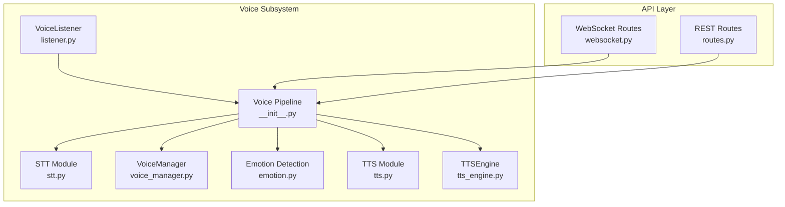
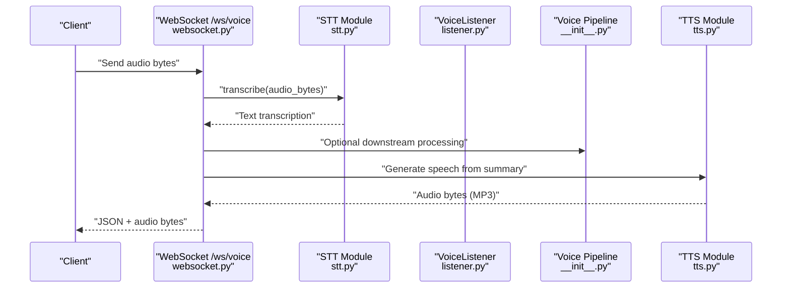
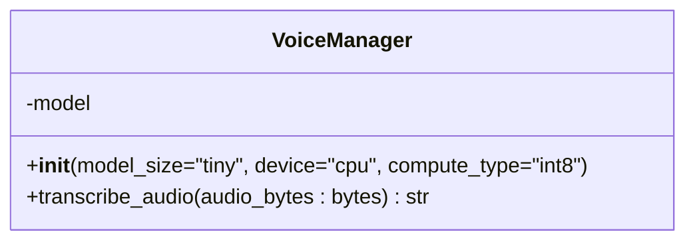
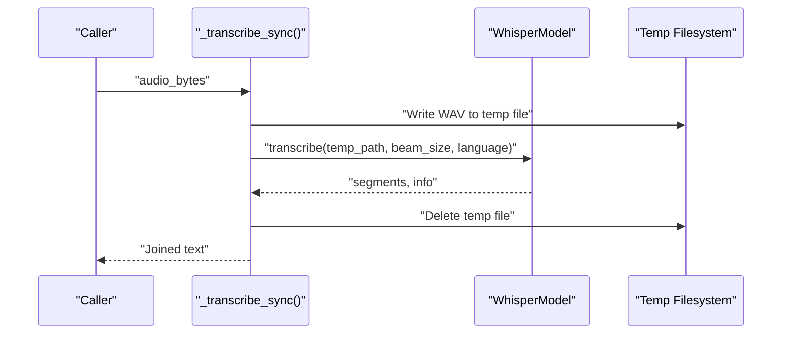
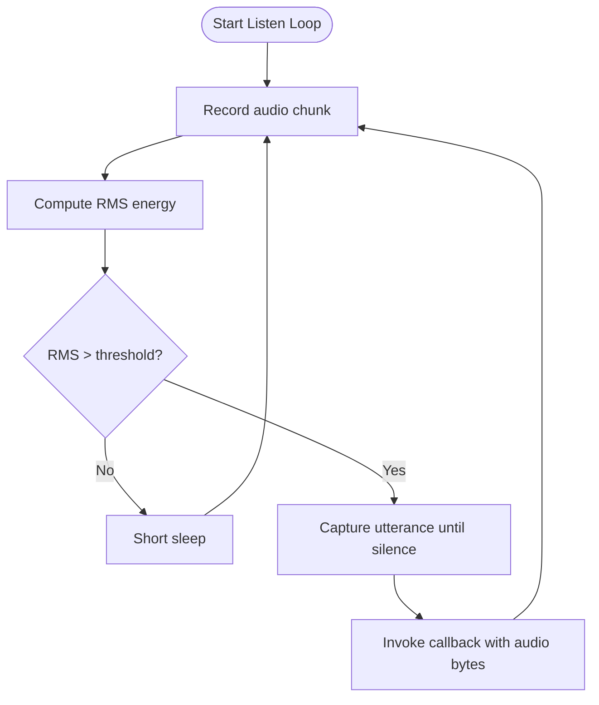
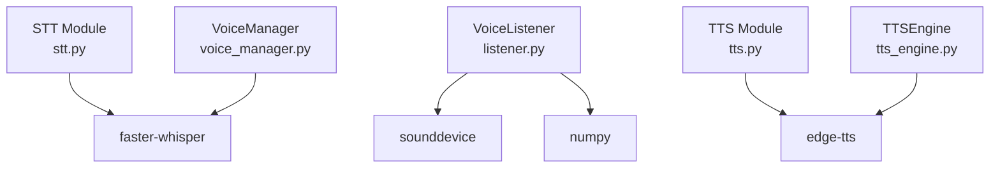

# Speech Recognition (STT)

<cite>
**Referenced Files in This Document**
- [voice_manager.py](file://veritas-ai/voice/voice_manager.py)
- [stt.py](file://veritas-ai/app/voice/stt.py)
- [listener.py](file://veritas-ai/app/voice/listener.py)
- [websocket.py](file://veritas-ai/app/api/websocket.py)
- [routes.py](file://veritas-ai/app/api/routes.py)
- [__init__.py](file://veritas-ai/app/voice/__init__.py)
- [emotion.py](file://veritas-ai/app/voice/emotion.py)
- [tts.py](file://veritas-ai/app/voice/tts.py)
- [tts_engine.py](file://veritas-ai/voice/tts_engine.py)
- [requirements.txt](file://veritas-ai/requirements.txt)
</cite>

## Table of Contents
1. [Introduction](#introduction)
2. [Project Structure](#project-structure)
3. [Core Components](#core-components)
4. [Architecture Overview](#architecture-overview)
5. [Detailed Component Analysis](#detailed-component-analysis)
6. [Dependency Analysis](#dependency-analysis)
7. [Performance Considerations](#performance-considerations)
8. [Troubleshooting Guide](#troubleshooting-guide)
9. [Conclusion](#conclusion)
10. [Appendices](#appendices)

## Introduction
This document provides comprehensive documentation for the Speech-to-Text (STT) system within the Veritas AI voice pipeline. It focuses on real-time audio transcription using Faster Whisper, detailing the VoiceManager class implementation, asynchronous transcription workflows, audio byte processing, and thread-safe execution patterns. It also covers model initialization parameters (device selection, compute types), performance optimization strategies, error handling and fallback behaviors, transcription accuracy techniques, audio format requirements, preprocessing steps, integration patterns with the broader voice system, and practical guidance for latency and memory management in real-time speech processing.

## Project Structure
The voice subsystem is organized around three primary areas:
- Real-time audio capture and wake detection
- Speech-to-text transcription using Faster Whisper
- Text-to-speech synthesis and voice pipeline orchestration

**Diagram sources**
- [listener.py:11-169](file://veritas-ai/app/voice/listener.py#L11-L169)
- [stt.py:15-60](file://veritas-ai/app/voice/stt.py#L15-L60)
- [voice_manager.py:11-38](file://veritas-ai/voice/voice_manager.py#L11-L38)
- [__init__.py:8-20](file://veritas-ai/app/voice/__init__.py#L8-L20)
- [emotion.py:26-53](file://veritas-ai/app/voice/emotion.py#L26-L53)
- [tts.py:32-68](file://veritas-ai/app/voice/tts.py#L32-L68)
- [tts_engine.py:12-30](file://veritas-ai/voice/tts_engine.py#L12-L30)
- [websocket.py:169-253](file://veritas-ai/app/api/websocket.py#L169-L253)
- [routes.py:226-234](file://veritas-ai/app/api/routes.py#L226-L234)

**Section sources**
- [listener.py:11-169](file://veritas-ai/app/voice/listener.py#L11-L169)
- [stt.py:15-60](file://veritas-ai/app/voice/stt.py#L15-L60)
- [voice_manager.py:11-38](file://veritas-ai/voice/voice_manager.py#L11-L38)
- [__init__.py:8-20](file://veritas-ai/app/voice/__init__.py#L8-L20)
- [emotion.py:26-53](file://veritas-ai/app/voice/emotion.py#L26-L53)
- [tts.py:32-68](file://veritas-ai/app/voice/tts.py#L32-L68)
- [tts_engine.py:12-30](file://veritas-ai/voice/tts_engine.py#L12-L30)
- [websocket.py:169-253](file://veritas-ai/app/api/websocket.py#L169-L253)
- [routes.py:226-234](file://veritas-ai/app/api/routes.py#L226-L234)

## Core Components
- VoiceManager: Provides a thread-safe, async transcription interface backed by Faster Whisper. It supports configurable model sizes and compute types, with graceful fallback when dependencies are missing.
- STT module: Offers a lazy-loaded, singleton-style Faster Whisper model with thread-pool transcription and temporary file handling for audio inputs.
- VoiceListener: Implements continuous microphone listening with energy-based wake detection and captures audio chunks until silence thresholds are met.
- Voice pipeline: Orchestrates STT, emotion detection, and returns structured results for downstream processing.
- TTS modules: Provide asynchronous text-to-speech generation with Edge-TTS, supporting voice profiles and temporary file cleanup.

Key implementation highlights:
- Asynchronous transcription via asyncio.to_thread to avoid blocking the event loop.
- Thread-safe model loading and locking for the STT module’s singleton.
- Graceful degradation when dependencies are unavailable (e.g., faster-whisper, sounddevice, edge-tts).
- Emotion detection from text keywords to influence voice synthesis characteristics.

**Section sources**
- [voice_manager.py:11-38](file://veritas-ai/voice/voice_manager.py#L11-L38)
- [stt.py:15-60](file://veritas-ai/app/voice/stt.py#L15-L60)
- [listener.py:11-169](file://veritas-ai/app/voice/listener.py#L11-L169)
- [__init__.py:8-20](file://veritas-ai/app/voice/__init__.py#L8-L20)
- [emotion.py:26-53](file://veritas-ai/app/voice/emotion.py#L26-L53)
- [tts.py:32-68](file://veritas-ai/app/voice/tts.py#L32-L68)
- [tts_engine.py:12-30](file://veritas-ai/voice/tts_engine.py#L12-L30)

## Architecture Overview
The STT system integrates with the broader voice pipeline and API layer to enable real-time audio transcription and synthesis.

**Diagram sources**
- [websocket.py:169-253](file://veritas-ai/app/api/websocket.py#L169-L253)
- [stt.py:52-60](file://veritas-ai/app/voice/stt.py#L52-L60)
- [__init__.py:8-20](file://veritas-ai/app/voice/__init__.py#L8-L20)
- [tts.py:32-68](file://veritas-ai/app/voice/tts.py#L32-L68)

## Detailed Component Analysis

### VoiceManager: Faster Whisper Integration
VoiceManager encapsulates a Faster Whisper model with configurable device and compute type. It exposes an async transcribe method that runs transcription in a separate thread to remain responsive.

Implementation patterns:
- Conditional import and fallback: If Faster Whisper is not installed, the model is set to None and transcription returns empty text.
- Async transcription: Uses asyncio.to_thread to execute synchronous transcription logic safely.
- Thread safety: The STT module uses a lock for model initialization; VoiceManager relies on the event loop and thread boundaries to avoid contention.

Model initialization parameters:
- model_size: Selects the Whisper model variant (e.g., tiny, small, medium).
- device: CPU or GPU device selection.
- compute_type: Quantization/compute precision (e.g., int8, float16).

Asynchronous transcription workflow:
- Audio bytes are passed to a synchronous transcription function executed in a thread pool.
- Segments are joined into a single text output.

Error handling:
- Exceptions during transcription are caught and logged; an empty string is returned to maintain resilience.

Thread-safe execution:
- VoiceManager delegates blocking operations to threads, preventing event loop blocking.
- The STT module uses a lock around model initialization to avoid race conditions.

Practical notes:
- Device and compute type selection affects latency and accuracy trade-offs.
- Using smaller models (e.g., tiny) reduces memory and improves latency at the cost of accuracy.

**Section sources**
- [voice_manager.py:11-38](file://veritas-ai/voice/voice_manager.py#L11-L38)

#### Class Diagram: VoiceManager

**Diagram sources**
- [voice_manager.py:11-38](file://veritas-ai/voice/voice_manager.py#L11-L38)

### STT Module: Lazy-Loaded Faster Whisper
The STT module provides a singleton-style model loader and thread-safe transcription.

Key behaviors:
- Lazy loading: The model is created on first use to reduce startup overhead.
- Thread-safe initialization: An asyncio.Lock guards model creation.
- Temporary file handling: Audio bytes are written to a temporary WAV file for Faster Whisper compatibility.
- Beam search tuning: A conservative beam size is used to balance speed and accuracy.
- Logging: Errors are logged and empty strings are returned to prevent failures from crashing the system.

Asynchronous transcription:
- The transcription function runs in a thread pool to keep the event loop responsive.
- Audio bytes are validated before processing; empty inputs return empty text.

Error handling and fallback:
- Missing dependencies raise an ImportError with guidance to install faster-whisper.
- Exceptions during transcription are caught and logged; returns empty text.

Accuracy optimization techniques:
- Use appropriate model sizes for the target domain and latency budget.
- Adjust beam size and language hints when available.
- Ensure audio quality and format meet expectations.

**Section sources**
- [stt.py:15-60](file://veritas-ai/app/voice/stt.py#L15-L60)

#### Sequence Diagram: STT Transcription Flow

**Diagram sources**
- [stt.py:30-60](file://veritas-ai/app/voice/stt.py#L30-L60)

### VoiceListener: Continuous Microphone Listener
VoiceListener continuously monitors microphone input for wake triggers and captures audio until silence is detected.

Key behaviors:
- Energy-based wake detection: RMS energy threshold determines wake events.
- Utterance capture: Captures audio chunks until silence thresholds are met or maximum duration is reached.
- Thread-safe recording: Uses asyncio.to_thread to call blocking sounddevice operations.
- Graceful degradation: If sounddevice is not installed, logging indicates the issue and the listener stops.

Integration:
- Provides audio bytes to callbacks for downstream processing (e.g., STT).

**Section sources**
- [listener.py:11-169](file://veritas-ai/app/voice/listener.py#L11-L169)

#### Flowchart: Wake Detection and Capture

**Diagram sources**
- [listener.py:73-160](file://veritas-ai/app/voice/listener.py#L73-L160)

### Voice Pipeline Orchestration
The voice pipeline composes STT, emotion detection, and optional downstream processing into a cohesive flow.

Responsibilities:
- Transcribe audio bytes to text.
- Detect emotion from the resulting text.
- Return a structured dictionary containing transcription and emotion metadata.

Integration points:
- Used by WebSocket endpoints to process voice queries and return both text and synthesized audio.

**Section sources**
- [__init__.py:8-20](file://veritas-ai/app/voice/__init__.py#L8-L20)

### Emotion Detection
Provides keyword-based emotion classification from text, enabling voice synthesis adjustments.

Behavior:
- Keyword matching across predefined emotion categories.
- Returns dominant emotion or neutral if none match.
- Supplies voice adjustment parameters for TTS synthesis.

**Section sources**
- [emotion.py:26-53](file://veritas-ai/app/voice/emotion.py#L26-L53)

### TTS Modules: Edge-TTS Integration
Two TTS implementations are available:
- tts.py: Function-based async TTS with voice profiles and temporary file handling.
- tts_engine.py: Class-based TTSEngine with similar behavior.

Behavior:
- Generate speech from text using Edge-TTS.
- Return MP3 audio bytes asynchronously.
- Graceful fallback when dependencies are missing.

**Section sources**
- [tts.py:32-68](file://veritas-ai/app/voice/tts.py#L32-L68)
- [tts_engine.py:12-30](file://veritas-ai/voice/tts_engine.py#L12-L30)

## Dependency Analysis
External dependencies relevant to STT:
- faster-whisper: Speech recognition backend.
- sounddevice: Microphone capture for VoiceListener.
- edge-tts: Text-to-speech synthesis.
- numpy: Numerical operations for audio processing.

**Diagram sources**
- [requirements.txt:35-39](file://veritas-ai/requirements.txt#L35-L39)
- [stt.py:20](file://veritas-ai/app/voice/stt.py#L20)
- [voice_manager.py:5](file://veritas-ai/voice/voice_manager.py#L5)
- [listener.py:76](file://veritas-ai/app/voice/listener.py#L76)
- [tts.py:44](file://veritas-ai/app/voice/tts.py#L44)
- [tts_engine.py:4](file://veritas-ai/voice/tts_engine.py#L4)

**Section sources**
- [requirements.txt:35-39](file://veritas-ai/requirements.txt#L35-L39)
- [stt.py:20](file://veritas-ai/app/voice/stt.py#L20)
- [voice_manager.py:5](file://veritas-ai/voice/voice_manager.py#L5)
- [listener.py:76](file://veritas-ai/app/voice/listener.py#L76)
- [tts.py:44](file://veritas-ai/app/voice/tts.py#L44)
- [tts_engine.py:4](file://veritas-ai/voice/tts_engine.py#L4)

## Performance Considerations
Latency optimization:
- Use smaller model sizes (e.g., tiny) for lower latency; larger models (small, medium) improve accuracy at the cost of throughput.
- Keep transcription in a thread pool to avoid blocking the event loop.
- Minimize temporary file I/O by using in-memory buffers when compatible with the backend.

Memory management:
- Delete temporary files immediately after transcription to prevent accumulation.
- Avoid holding large audio buffers in memory; stream chunks and process incrementally.
- Reuse a single model instance (singleton pattern) to reduce initialization overhead.

Device and compute type:
- Prefer GPU when available for improved throughput; fallback to CPU gracefully.
- Use int8 compute type for reduced memory footprint; float16 for higher precision when supported.

Audio format and preprocessing:
- Ensure audio is mono, 16-bit PCM, and sampled at 16 kHz for optimal compatibility with Faster Whisper.
- Normalize volume and remove noise to improve transcription accuracy.
- Validate audio length and silence thresholds to avoid unnecessary processing.

Real-time constraints:
- Tune wake detection thresholds and capture durations to minimize idle time.
- Use non-blocking I/O and async patterns throughout the pipeline.

[No sources needed since this section provides general guidance]

## Troubleshooting Guide
Common issues and resolutions:
- Faster Whisper not installed: The STT module raises an ImportError with installation guidance; ensure the dependency is present.
- Sounddevice not installed: VoiceListener logs an error and stops; install sounddevice for microphone support.
- Edge-TTS not installed: TTS modules return empty audio bytes; install edge-tts for speech synthesis.
- Transcription errors: Exceptions are caught and logged; verify audio format and model availability.
- Empty transcription results: Validate audio input and ensure sufficient signal strength.

Fallback behaviors:
- Missing dependencies: Components log warnings and degrade gracefully (empty results).
- Model initialization failures: Initialization is guarded by locks; subsequent attempts reuse the singleton instance.

**Section sources**
- [stt.py:24-27](file://veritas-ai/app/voice/stt.py#L24-L27)
- [listener.py:77-80](file://veritas-ai/app/voice/listener.py#L77-L80)
- [tts.py:59-61](file://veritas-ai/app/voice/tts.py#L59-L61)
- [voice_manager.py:16-18](file://veritas-ai/voice/voice_manager.py#L16-L18)

## Conclusion
The STT system leverages Faster Whisper with thread-safe, asynchronous execution to deliver real-time speech transcription. It integrates seamlessly with voice capture, emotion detection, and text-to-speech synthesis, providing a robust foundation for voice-enabled applications. By tuning model sizes, device selection, and compute types, developers can balance latency and accuracy. Proper error handling and fallbacks ensure resilient operation even when dependencies are unavailable.

[No sources needed since this section summarizes without analyzing specific files]

## Appendices

### Integration Patterns
- WebSocket voice endpoint: Receives audio bytes, transcribes to text, optionally processes through the pipeline, synthesizes speech, and returns both text and audio.
- REST voice endpoint: Allows setting TTS voice profiles via a dedicated endpoint.

**Section sources**
- [websocket.py:169-253](file://veritas-ai/app/api/websocket.py#L169-L253)
- [routes.py:226-234](file://veritas-ai/app/api/routes.py#L226-L234)

### Audio Format Requirements
- Mono, 16-bit PCM samples at 16 kHz.
- Ensure adequate signal strength and minimal background noise.
- Validate audio duration and silence thresholds to optimize capture windows.

[No sources needed since this section provides general guidance]