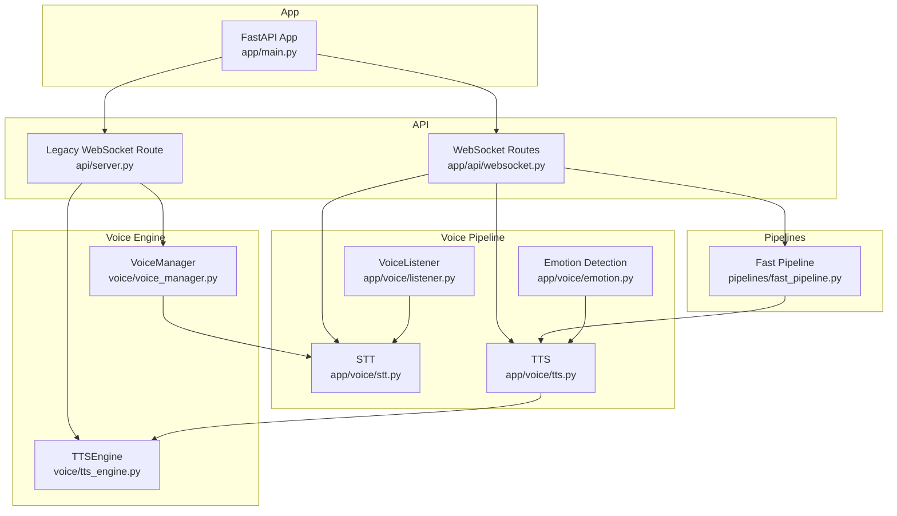
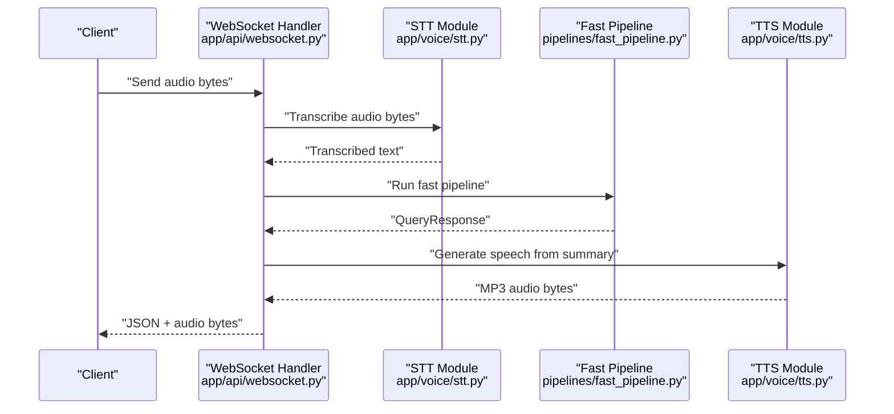
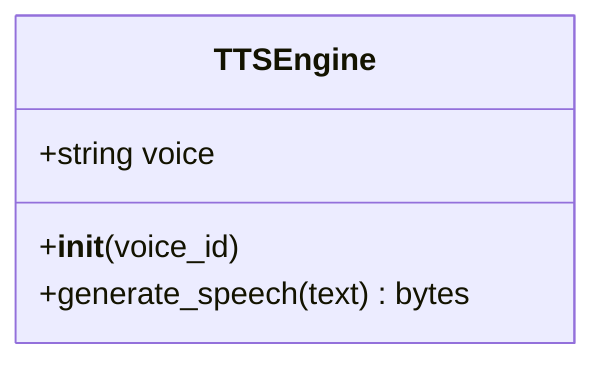
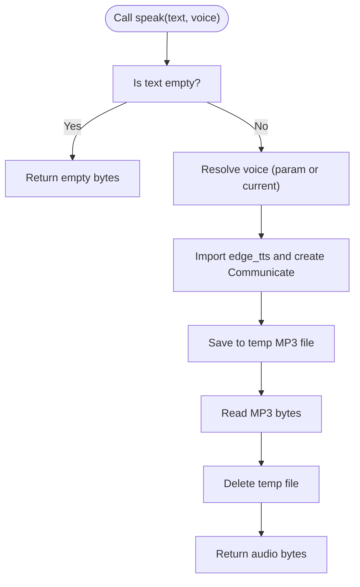
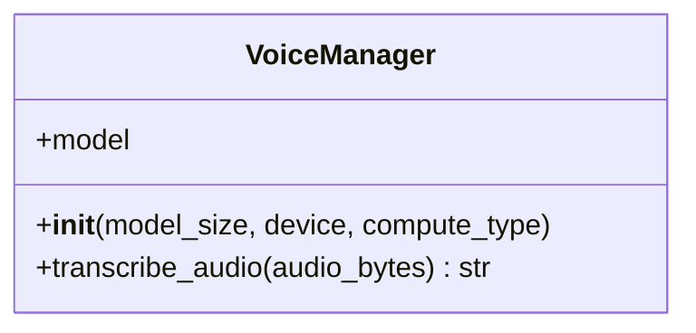
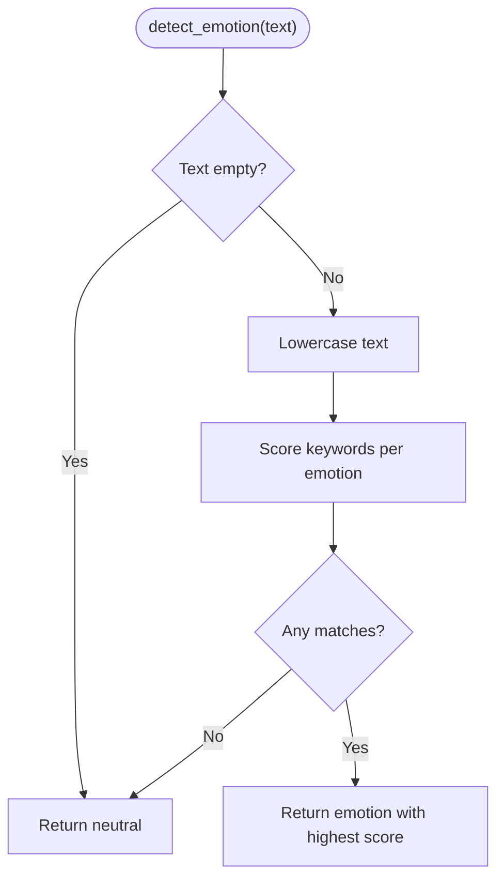
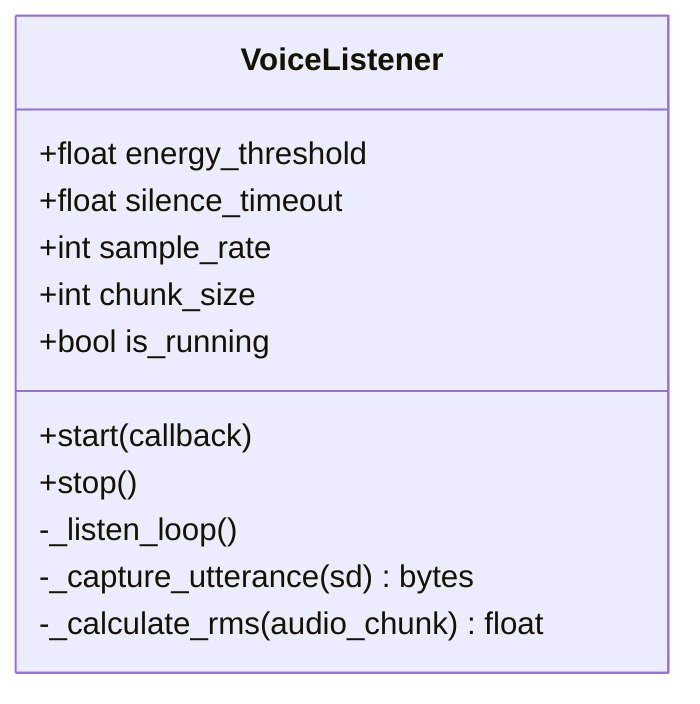
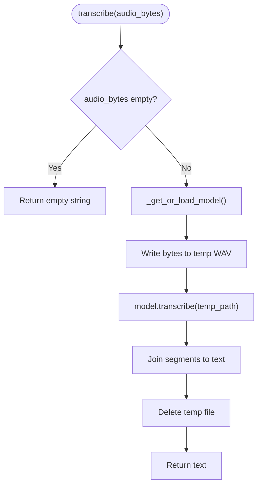
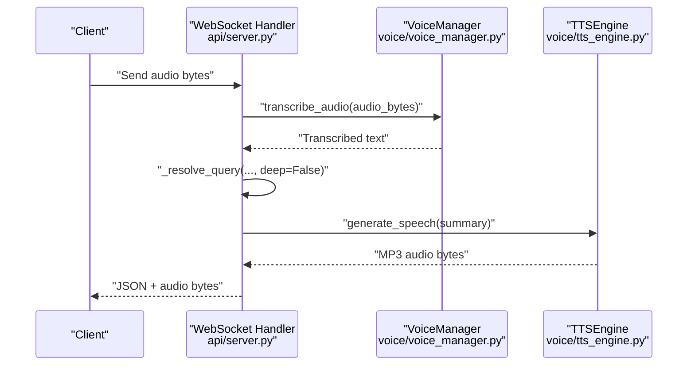
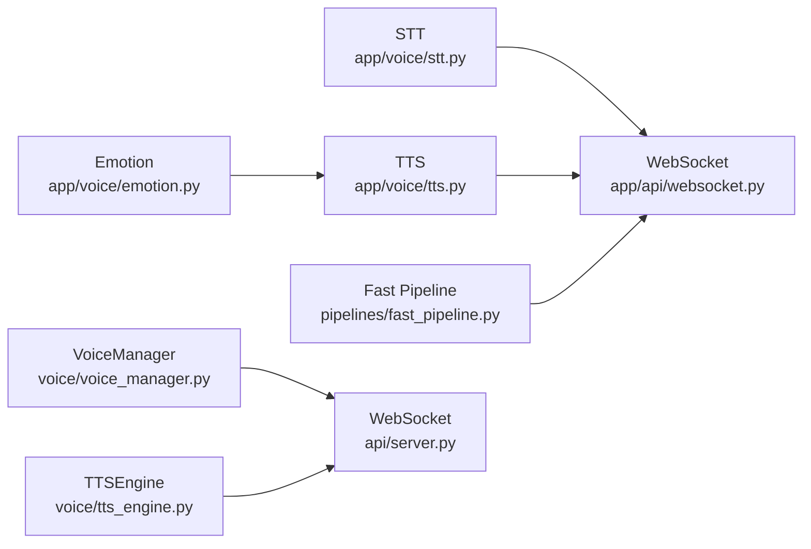

# Text-to-Speech (TTS)

<cite>
**Referenced Files in This Document**
- [tts_engine.py](file://veritas-ai/voice/tts_engine.py)
- [tts.py](file://veritas-ai/app/voice/tts.py)
- [voice_manager.py](file://veritas-ai/voice/voice_manager.py)
- [emotion.py](file://veritas-ai/app/voice/emotion.py)
- [listener.py](file://veritas-ai/app/voice/listener.py)
- [stt.py](file://veritas-ai/app/voice/stt.py)
- [websocket.py](file://veritas-ai/app/api/websocket.py)
- [server.py](file://veritas-ai/api/server.py)
- [fast_pipeline.py](file://veritas-ai/pipelines/fast_pipeline.py)
- [main.py](file://veritas-ai/app/main.py)
</cite>

## Table of Contents
1. [Introduction](#introduction)
2. [Project Structure](#project-structure)
3. [Core Components](#core-components)
4. [Architecture Overview](#architecture-overview)
5. [Detailed Component Analysis](#detailed-component-analysis)
6. [Dependency Analysis](#dependency-analysis)
7. [Performance Considerations](#performance-considerations)
8. [Troubleshooting Guide](#troubleshooting-guide)
9. [Conclusion](#conclusion)
10. [Appendices](#appendices)

## Introduction
This document describes the Text-to-Speech (TTS) synthesis system responsible for generating natural speech from text input. It covers voice selection, prosody control, audio quality, and the end-to-end synthesis workflow from text preprocessing to audio generation. It also documents integration patterns with the VoiceManager for seamless speech processing, supported audio formats and sampling rates, examples of voice customization and speed adjustments, and performance optimization techniques including caching and real-time synthesis. Browser compatibility and Web Audio API integration patterns for client-side speech synthesis are included.

## Project Structure
The TTS system spans several modules:
- Voice engine and manager: TTS engine and voice manager for STT/TTS orchestration
- Voice pipeline: STT transcription, emotion detection, and TTS synthesis
- Web APIs: WebSocket endpoints for real-time voice processing
- Pipelines: Fast and deep response pipelines feeding TTS
- Application entry: FastAPI app lifecycle and routing

**Diagram sources**
- [tts_engine.py:1-30](file://veritas-ai/voice/tts_engine.py#L1-L30)
- [voice_manager.py:1-38](file://veritas-ai/voice/voice_manager.py#L1-L38)
- [tts.py:1-68](file://veritas-ai/app/voice/tts.py#L1-L68)
- [stt.py:1-60](file://veritas-ai/app/voice/stt.py#L1-L60)
- [emotion.py:1-53](file://veritas-ai/app/voice/emotion.py#L1-L53)
- [listener.py:1-169](file://veritas-ai/app/voice/listener.py#L1-L169)
- [websocket.py:174-252](file://veritas-ai/app/api/websocket.py#L174-L252)
- [server.py:241-284](file://veritas-ai/api/server.py#L241-L284)
- [fast_pipeline.py:1-22](file://veritas-ai/pipelines/fast_pipeline.py#L1-L22)
- [main.py:1-208](file://veritas-ai/app/main.py#L1-L208)

**Section sources**
- [tts_engine.py:1-30](file://veritas-ai/voice/tts_engine.py#L1-L30)
- [tts.py:1-68](file://veritas-ai/app/voice/tts.py#L1-L68)
- [voice_manager.py:1-38](file://veritas-ai/voice/voice_manager.py#L1-L38)
- [emotion.py:1-53](file://veritas-ai/app/voice/emotion.py#L1-L53)
- [listener.py:1-169](file://veritas-ai/app/voice/listener.py#L1-L169)
- [stt.py:1-60](file://veritas-ai/app/voice/stt.py#L1-L60)
- [websocket.py:174-252](file://veritas-ai/app/api/websocket.py#L174-L252)
- [server.py:241-284](file://veritas-ai/api/server.py#L241-L284)
- [fast_pipeline.py:1-22](file://veritas-ai/pipelines/fast_pipeline.py#L1-L22)
- [main.py:1-208](file://veritas-ai/app/main.py#L1-L208)

## Core Components
- TTSEngine: Asynchronous TTS engine using Microsoft Edge TTS to produce MP3 audio bytes from text. Supports voice profile selection via a predefined mapping.
- TTS module: Provides a module-level speak function and set_voice for selecting voices. Returns MP3 audio bytes asynchronously.
- VoiceManager: Manages STT transcription using Faster-Whisper when available, with lazy initialization and thread-based transcription to avoid blocking the event loop.
- Emotion detection: Keyword-based emotion classification mapped to prosody adjustments (e.g., rate and pitch).
- VoiceListener: Continuous microphone listener with energy-based wake detection and capture of audio chunks.
- STT module: Transcribes audio bytes to text using Faster-Whisper with lazy model loading and temporary file handling.
- WebSocket routes: Real-time voice processing endpoints that orchestrate STT, pipeline, and TTS, returning audio bytes to clients.
- Fast pipeline: Lightweight response pipeline designed for quick synthesis suitable for real-time scenarios.

**Section sources**
- [tts_engine.py:1-30](file://veritas-ai/voice/tts_engine.py#L1-L30)
- [tts.py:1-68](file://veritas-ai/app/voice/tts.py#L1-L68)
- [voice_manager.py:1-38](file://veritas-ai/voice/voice_manager.py#L1-L38)
- [emotion.py:1-53](file://veritas-ai/app/voice/emotion.py#L1-L53)
- [listener.py:1-169](file://veritas-ai/app/voice/listener.py#L1-L169)
- [stt.py:1-60](file://veritas-ai/app/voice/stt.py#L1-L60)
- [websocket.py:174-252](file://veritas-ai/app/api/websocket.py#L174-L252)
- [fast_pipeline.py:1-22](file://veritas-ai/pipelines/fast_pipeline.py#L1-L22)

## Architecture Overview
The TTS synthesis system integrates STT, response pipelines, and TTS into a cohesive real-time voice workflow. Two primary integration patterns exist:
- New WebSocket route: Orchestrates STT, fast pipeline, and TTS, returning text and audio bytes to the client.
- Legacy WebSocket route: Uses VoiceManager for STT and TTSEngine for TTS, returning structured JSON and audio bytes.

**Diagram sources**
- [websocket.py:174-252](file://veritas-ai/app/api/websocket.py#L174-L252)
- [stt.py:1-60](file://veritas-ai/app/voice/stt.py#L1-L60)
- [fast_pipeline.py:1-22](file://veritas-ai/pipelines/fast_pipeline.py#L1-L22)
- [tts.py:1-68](file://veritas-ai/app/voice/tts.py#L1-L68)

**Section sources**
- [websocket.py:174-252](file://veritas-ai/app/api/websocket.py#L174-L252)
- [server.py:241-284](file://veritas-ai/api/server.py#L241-L284)

## Detailed Component Analysis

### TTSEngine
Asynchronous TTS engine backed by Microsoft Edge TTS. It selects a voice profile by ID and generates MP3 audio bytes from text. The engine writes audio to a temporary file, reads the bytes, and cleans up the temporary file.

**Diagram sources**
- [tts_engine.py:1-30](file://veritas-ai/voice/tts_engine.py#L1-L30)

**Section sources**
- [tts_engine.py:1-30](file://veritas-ai/voice/tts_engine.py#L1-L30)

### TTS Module (Module-level API)
Provides:
- Voice selection via set_voice(profile) using a profile map
- Asynchronous speak(text, voice=None) that returns MP3 audio bytes
- Graceful handling of missing dependencies and exceptions

**Diagram sources**
- [tts.py:1-68](file://veritas-ai/app/voice/tts.py#L1-L68)

**Section sources**
- [tts.py:1-68](file://veritas-ai/app/voice/tts.py#L1-L68)

### VoiceManager
Manages STT transcription using Faster-Whisper with lazy initialization and thread-based execution to avoid blocking the event loop. Provides transcribe_audio(audio_bytes) returning text.

**Diagram sources**
- [voice_manager.py:1-38](file://veritas-ai/voice/voice_manager.py#L1-L38)

**Section sources**
- [voice_manager.py:1-38](file://veritas-ai/voice/voice_manager.py#L1-L38)

### Emotion Detection
Performs keyword-based emotion detection from text and maps emotions to prosody adjustments (e.g., rate and pitch). This enables tone modulation for synthesized speech.

**Diagram sources**
- [emotion.py:1-53](file://veritas-ai/app/voice/emotion.py#L1-L53)

**Section sources**
- [emotion.py:1-53](file://veritas-ai/app/voice/emotion.py#L1-L53)

### VoiceListener
Continuous microphone listener with energy-based wake detection. Captures audio chunks after a wake trigger and pipes full utterances to a callback. Useful for real-time voice capture workflows.

**Diagram sources**
- [listener.py:1-169](file://veritas-ai/app/voice/listener.py#L1-L169)

**Section sources**
- [listener.py:1-169](file://veritas-ai/app/voice/listener.py#L1-L169)

### STT Module
Transcribes audio bytes to text using Faster-Whisper with lazy model loading and temporary file handling. Provides a thread-safe async wrapper for transcription.

**Diagram sources**
- [stt.py:1-60](file://veritas-ai/app/voice/stt.py#L1-L60)

**Section sources**
- [stt.py:1-60](file://veritas-ai/app/voice/stt.py#L1-L60)

### WebSocket Integration
Two WebSocket endpoints demonstrate real-time voice processing:
- New route: app/api/websocket.py orchestrates STT, fast pipeline, and TTS, sending JSON metadata and audio bytes.
- Legacy route: api/server.py uses VoiceManager and TTSEngine to return structured results and audio bytes.

**Diagram sources**
- [server.py:241-284](file://veritas-ai/api/server.py#L241-L284)
- [voice_manager.py:1-38](file://veritas-ai/voice/voice_manager.py#L1-L38)
- [tts_engine.py:1-30](file://veritas-ai/voice/tts_engine.py#L1-L30)

**Section sources**
- [websocket.py:174-252](file://veritas-ai/app/api/websocket.py#L174-L252)
- [server.py:241-284](file://veritas-ai/api/server.py#L241-L284)

## Dependency Analysis
- TTS depends on Microsoft Edge TTS for audio generation and produces MP3 audio bytes.
- VoiceManager optionally depends on Faster-Whisper for STT transcription.
- Emotion detection influences voice selection and prosody adjustments.
- WebSocket handlers depend on STT, pipelines, and TTS modules.
- Fast pipeline provides a lightweight path for quick synthesis.

**Diagram sources**
- [tts.py:1-68](file://veritas-ai/app/voice/tts.py#L1-L68)
- [stt.py:1-60](file://veritas-ai/app/voice/stt.py#L1-L60)
- [emotion.py:1-53](file://veritas-ai/app/voice/emotion.py#L1-L53)
- [fast_pipeline.py:1-22](file://veritas-ai/pipelines/fast_pipeline.py#L1-L22)
- [websocket.py:174-252](file://veritas-ai/app/api/websocket.py#L174-L252)
- [voice_manager.py:1-38](file://veritas-ai/voice/voice_manager.py#L1-L38)
- [tts_engine.py:1-30](file://veritas-ai/voice/tts_engine.py#L1-L30)
- [server.py:241-284](file://veritas-ai/api/server.py#L241-L284)

**Section sources**
- [tts.py:1-68](file://veritas-ai/app/voice/tts.py#L1-L68)
- [stt.py:1-60](file://veritas-ai/app/voice/stt.py#L1-L60)
- [emotion.py:1-53](file://veritas-ai/app/voice/emotion.py#L1-L53)
- [fast_pipeline.py:1-22](file://veritas-ai/pipelines/fast_pipeline.py#L1-L22)
- [websocket.py:174-252](file://veritas-ai/app/api/websocket.py#L174-L252)
- [voice_manager.py:1-38](file://veritas-ai/voice/voice_manager.py#L1-L38)
- [tts_engine.py:1-30](file://veritas-ai/voice/tts_engine.py#L1-L30)
- [server.py:241-284](file://veritas-ai/api/server.py#L241-L284)

## Performance Considerations
- Asynchronous design: All TTS and STT operations are asynchronous to avoid blocking the event loop.
- Thread-based transcription: STT transcription runs in a thread pool to keep the main loop responsive.
- Lazy model loading: Faster-Whisper model is loaded on first use to reduce cold-start latency.
- Temporary file cleanup: Ensures temporary files are removed after audio generation/transcription.
- Fast pipeline: Optimized for quick response times suitable for real-time voice synthesis.
- Caching strategies: While not explicitly implemented in the TTS modules, the application includes a cache layer and Redis cache initialization for broader caching opportunities.

[No sources needed since this section provides general guidance]

## Troubleshooting Guide
Common issues and resolutions:
- Missing edge-tts: The TTS module logs an error and returns empty bytes if edge-tts is not installed. Install the dependency to enable TTS.
- Missing faster-whisper: VoiceManager logs a warning and disables STT if faster-whisper is not installed. Install the dependency to enable transcription.
- Transcription errors: STT transcription catches exceptions and logs errors, returning an empty string. Verify audio format and ensure proper audio bytes are sent.
- WebSocket disconnects: WebSocket handlers gracefully handle disconnections and log messages for debugging.
- Audio format and sampling: The STT module writes a temporary WAV file for Faster-Whisper. Ensure audio bytes represent valid audio data compatible with the STT model.

**Section sources**
- [tts.py:59-64](file://veritas-ai/app/voice/tts.py#L59-L64)
- [voice_manager.py:16-18](file://veritas-ai/voice/voice_manager.py#L16-L18)
- [stt.py:24-26](file://veritas-ai/app/voice/stt.py#L24-L26)
- [server.py:283-284](file://veritas-ai/api/server.py#L283-L284)

## Conclusion
The TTS synthesis system provides a robust, asynchronous foundation for converting text to speech with voice selection and emotion-aware prosody adjustments. It integrates seamlessly with STT, pipelines, and WebSocket endpoints to support real-time voice workflows. The design emphasizes non-blocking operations, lazy initialization, and thread-safe transcription to maintain responsiveness. Future enhancements can focus on advanced prosody controls, caching strategies for repeated phrases, and expanded browser compatibility for client-side audio playback.

[No sources needed since this section summarizes without analyzing specific files]

## Appendices

### Voice Selection Options
- Profiles supported by the TTS module include multiple voices with distinct characteristics.
- Profiles supported by the legacy TTSEngine include a subset of voices.

**Section sources**
- [tts.py:10-16](file://veritas-ai/app/voice/tts.py#L10-L16)
- [tts_engine.py:6-10](file://veritas-ai/voice/tts_engine.py#L6-L10)

### Prosody Control Parameters
- Emotion detection maps to prosody adjustments (e.g., rate and pitch) for expressive speech synthesis.
- Voice selection can be dynamically adjusted based on detected emotion.

**Section sources**
- [emotion.py:16-23](file://veritas-ai/app/voice/emotion.py#L16-L23)
- [tts.py:22-29](file://veritas-ai/app/voice/tts.py#L22-L29)

### Audio Formats and Sampling Rates
- TTS output format: MP3 audio bytes.
- STT input format: WAV audio bytes written to a temporary file for Faster-Whisper.
- Listener defaults to 16 kHz sample rate and mono audio chunks.

**Section sources**
- [tts.py:46-51](file://veritas-ai/app/voice/tts.py#L46-L51)
- [stt.py:34-41](file://veritas-ai/app/voice/stt.py#L34-L41)
- [listener.py:22-32](file://veritas-ai/app/voice/listener.py#L22-L32)

### Examples of Voice Customization and Speed Adjustment
- Voice customization: Use set_voice(profile) to select among supported profiles.
- Speed adjustment: Combine emotion detection with voice selection to influence perceived speed and tone.

**Section sources**
- [tts.py:22-29](file://veritas-ai/app/voice/tts.py#L22-L29)
- [emotion.py:50-52](file://veritas-ai/app/voice/emotion.py#L50-L52)

### Real-Time Synthesis Capabilities
- WebSocket endpoints support continuous real-time voice processing.
- Fast pipeline ensures quick response times suitable for interactive experiences.

**Section sources**
- [websocket.py:174-252](file://veritas-ai/app/api/websocket.py#L174-L252)
- [fast_pipeline.py:8-13](file://veritas-ai/pipelines/fast_pipeline.py#L8-L13)

### Browser Compatibility and Web Audio API Integration
- The frontend includes a dashboard component using browser speech recognition APIs for capturing user speech.
- For client-side playback of synthesized audio, use the Web Audio API to decode and play MP3 audio bytes returned by the WebSocket endpoints.

[No sources needed since this section provides general guidance]