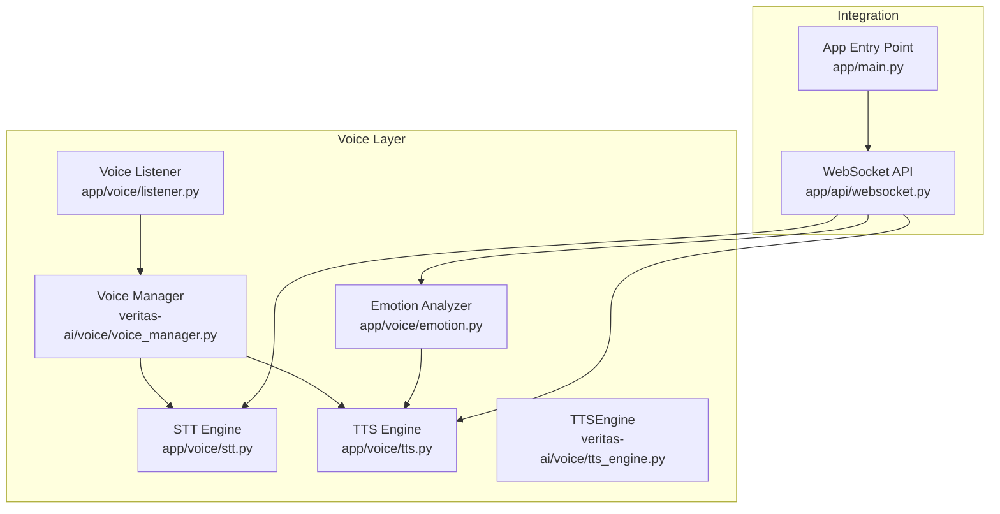
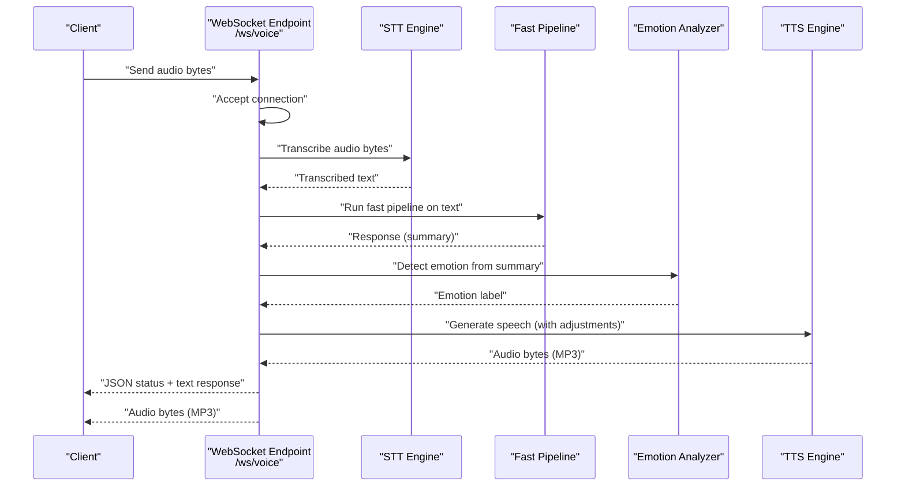
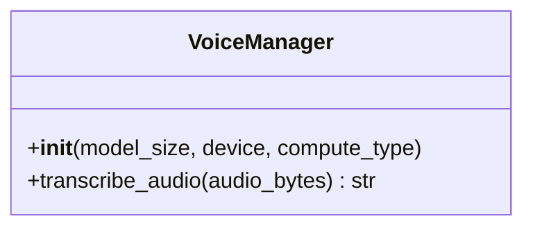
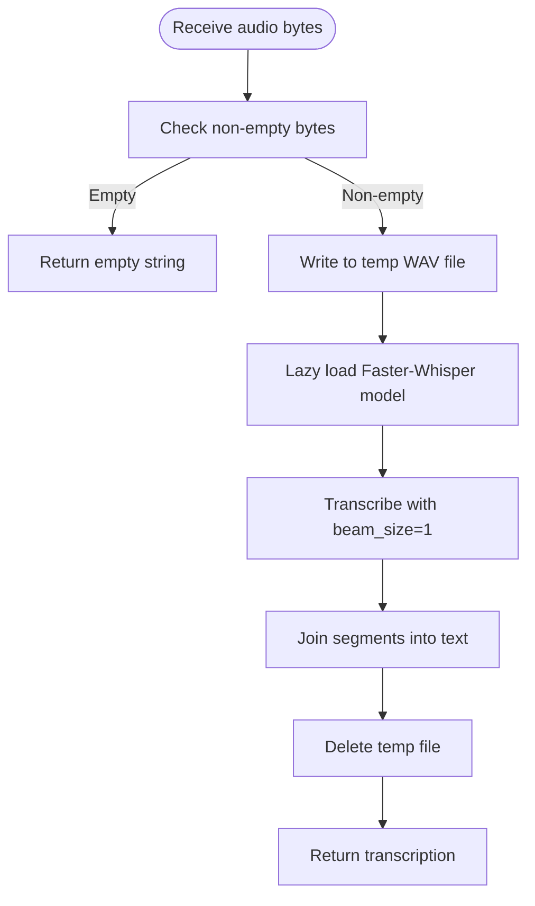
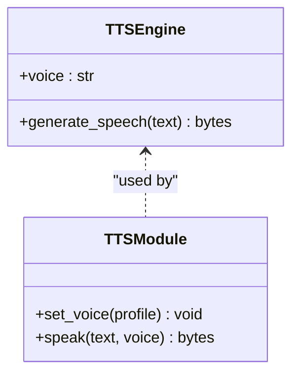
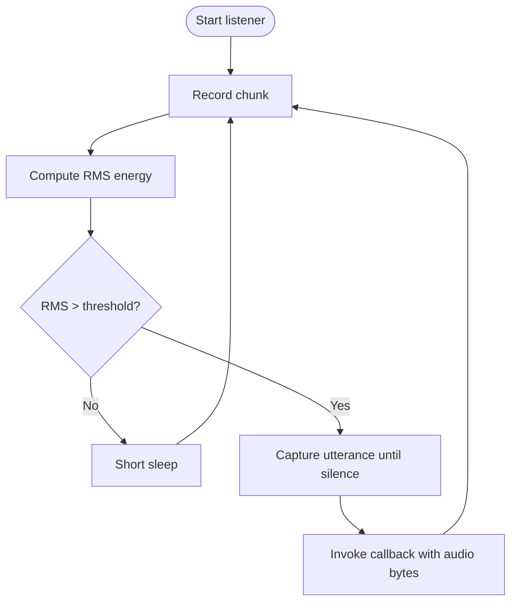
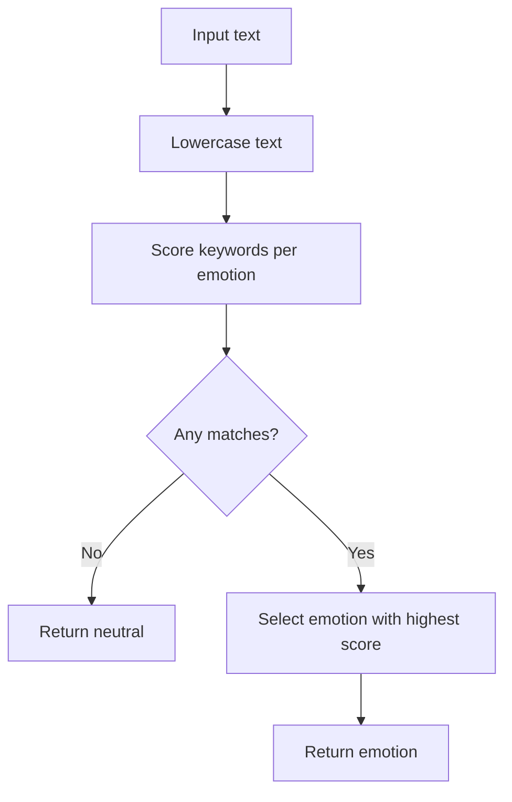
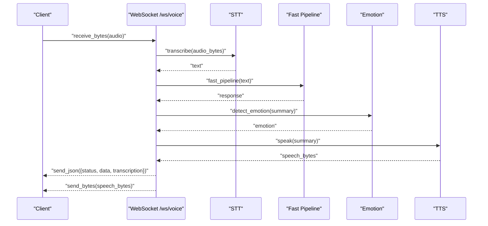
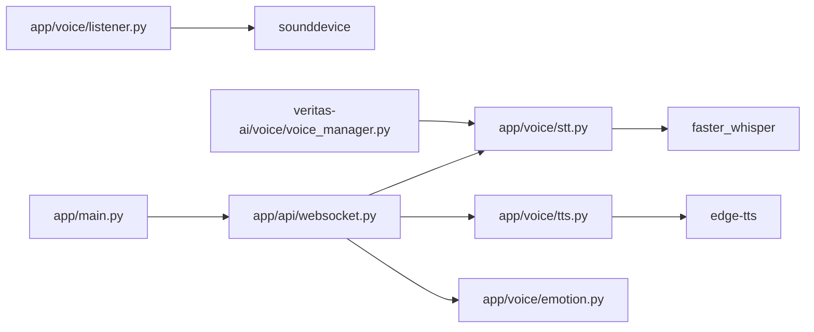
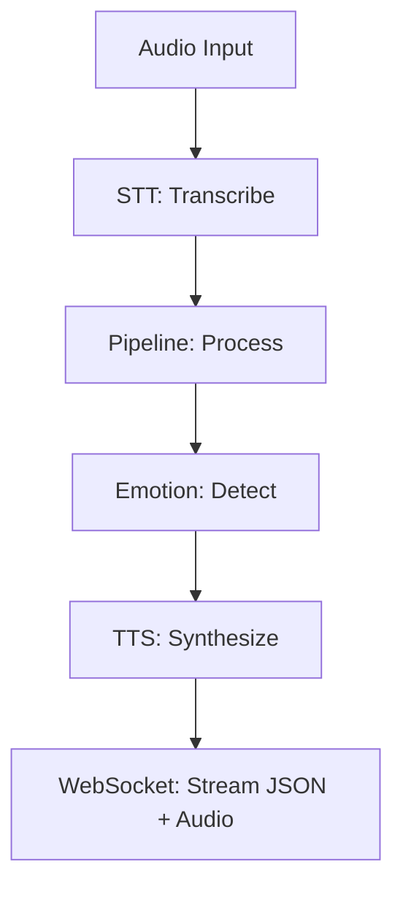

# Voice System

<cite>
**Referenced Files in This Document**
- [voice_manager.py](file://veritas-ai/voice/voice_manager.py)
- [stt.py](file://veritas-ai/app/voice/stt.py)
- [tts.py](file://veritas-ai/app/voice/tts.py)
- [listener.py](file://veritas-ai/app/voice/listener.py)
- [emotion.py](file://veritas-ai/app/voice/emotion.py)
- [tts_engine.py](file://veritas-ai/voice/tts_engine.py)
- [websocket.py](file://veritas-ai/app/api/websocket.py)
- [main.py](file://veritas-ai/app/main.py)
</cite>

## Table of Contents
1. [Introduction](#introduction)
2. [Project Structure](#project-structure)
3. [Core Components](#core-components)
4. [Architecture Overview](#architecture-overview)
5. [Detailed Component Analysis](#detailed-component-analysis)
6. [Dependency Analysis](#dependency-analysis)
7. [Performance Considerations](#performance-considerations)
8. [Troubleshooting Guide](#troubleshooting-guide)
9. [Conclusion](#conclusion)
10. [Appendices](#appendices)

## Introduction
This document describes Veritas AI’s voice interaction system, focusing on speech-to-text (STT), text-to-speech (TTS), and basic emotion analysis. It explains how the voice manager orchestrates speech processing workflows, how audio streams are captured and managed, and how the STT and TTS engines operate asynchronously to minimize latency. It also covers the listener component’s audio capture, noise filtering, and speech activity detection, and outlines the emotion analysis system for sentiment detection and tone interpretation. Finally, it documents the Web Speech API integration patterns, browser compatibility considerations, and performance optimization techniques for end-to-end voice workflows from audio input through verification processing to synthesized responses.

## Project Structure
The voice system is organized under the application module with clear separation of concerns:
- Voice engines: STT and TTS implementations
- Listener: continuous audio capture and wake detection
- Emotion analyzer: keyword-based sentiment classification
- Voice manager: orchestrator for STT/TTS and optional integration points
- WebSocket integration: real-time audio streaming and response delivery

**Diagram sources**
- [stt.py:1-60](file://veritas-ai/app/voice/stt.py#L1-L60)
- [tts.py:1-68](file://veritas-ai/app/voice/tts.py#L1-L68)
- [listener.py:1-169](file://veritas-ai/app/voice/listener.py#L1-L169)
- [emotion.py:1-53](file://veritas-ai/app/voice/emotion.py#L1-L53)
- [voice_manager.py:1-38](file://veritas-ai/voice/voice_manager.py#L1-L38)
- [tts_engine.py:1-30](file://veritas-ai/voice/tts_engine.py#L1-L30)
- [websocket.py:1-253](file://veritas-ai/app/api/websocket.py#L1-L253)
- [main.py:1-208](file://veritas-ai/app/main.py#L1-L208)

**Section sources**
- [stt.py:1-60](file://veritas-ai/app/voice/stt.py#L1-L60)
- [tts.py:1-68](file://veritas-ai/app/voice/tts.py#L1-L68)
- [listener.py:1-169](file://veritas-ai/app/voice/listener.py#L1-L169)
- [emotion.py:1-53](file://veritas-ai/app/voice/emotion.py#L1-L53)
- [voice_manager.py:1-38](file://veritas-ai/voice/voice_manager.py#L1-L38)
- [tts_engine.py:1-30](file://veritas-ai/voice/tts_engine.py#L1-L30)
- [websocket.py:1-253](file://veritas-ai/app/api/websocket.py#L1-L253)
- [main.py:1-208](file://veritas-ai/app/main.py#L1-L208)

## Core Components
- Voice Manager: Initializes and coordinates STT/TTS engines with lazy model loading and thread-safe transcription.
- STT Engine: Asynchronous transcription using Faster-Whisper with temporary file handling and thread pool execution.
- TTS Engine: Asynchronous speech synthesis using Edge-TTS with voice profiles and temporary file handling.
- Voice Listener: Continuous microphone capture with RMS-based energy detection and silence detection for utterance segmentation.
- Emotion Analyzer: Keyword-based emotion detection mapped to voice adjustment parameters.
- WebSocket Integration: Real-time audio streaming pipeline from STT to pipeline processing to TTS and audio delivery.

**Section sources**
- [voice_manager.py:11-38](file://veritas-ai/voice/voice_manager.py#L11-L38)
- [stt.py:15-60](file://veritas-ai/app/voice/stt.py#L15-L60)
- [tts.py:10-68](file://veritas-ai/app/voice/tts.py#L10-L68)
- [listener.py:11-169](file://veritas-ai/app/voice/listener.py#L11-L169)
- [emotion.py:7-53](file://veritas-ai/app/voice/emotion.py#L7-L53)
- [websocket.py:169-253](file://veritas-ai/app/api/websocket.py#L169-L253)

## Architecture Overview
The voice system integrates asynchronous STT and TTS with a WebSocket endpoint to support real-time voice interactions. The listener can feed audio to the WebSocket pipeline, or the pipeline can be invoked directly with audio bytes. Emotion analysis influences voice synthesis parameters.

**Diagram sources**
- [websocket.py:169-253](file://veritas-ai/app/api/websocket.py#L169-L253)
- [stt.py:52-60](file://veritas-ai/app/voice/stt.py#L52-L60)
- [tts.py:32-68](file://veritas-ai/app/voice/tts.py#L32-L68)
- [emotion.py:26-53](file://veritas-ai/app/voice/emotion.py#L26-L53)

## Detailed Component Analysis

### Voice Manager
The Voice Manager initializes the STT engine using Faster-Whisper with configurable model size, device, and compute type. It provides an asynchronous transcription method that executes the heavy computation in a thread pool to avoid blocking the event loop. It gracefully handles missing dependencies by disabling STT and logging a warning.

**Diagram sources**
- [voice_manager.py:11-38](file://veritas-ai/voice/voice_manager.py#L11-L38)

**Section sources**
- [voice_manager.py:11-38](file://veritas-ai/voice/voice_manager.py#L11-L38)

### STT Engine (Faster-Whisper)
The STT engine lazily loads the Faster-Whisper model on first use, logs model loading, and transcribes audio bytes by writing them to a temporary WAV file. It runs transcription in a thread pool to keep the event loop responsive and cleans up temporary files afterward. It supports English transcription with a beam size tuned for speed.

**Diagram sources**
- [stt.py:15-60](file://veritas-ai/app/voice/stt.py#L15-L60)

**Section sources**
- [stt.py:1-60](file://veritas-ai/app/voice/stt.py#L1-L60)

### TTS Engine (Edge-TTS)
The TTS engine exposes a synchronous voice selection mechanism and an asynchronous speech generation method. It supports predefined voice profiles and generates MP3 audio via Edge-TTS, saving to a temporary file and returning the bytes. It logs debug information and handles missing dependencies gracefully.

**Diagram sources**
- [tts_engine.py:12-30](file://veritas-ai/voice/tts_engine.py#L12-L30)
- [tts.py:22-68](file://veritas-ai/app/voice/tts.py#L22-L68)

**Section sources**
- [tts_engine.py:1-30](file://veritas-ai/voice/tts_engine.py#L1-L30)
- [tts.py:1-68](file://veritas-ai/app/voice/tts.py#L1-L68)

### Voice Listener
The Voice Listener continuously records audio chunks at a fixed sample rate and calculates RMS energy to detect loud sounds as wake triggers. Upon detection, it captures a full utterance bounded by silence thresholds and maximum duration, then invokes a callback with the collected audio bytes. It manages lifecycle with start/stop and uses thread-safe recording to avoid blocking the event loop.

**Diagram sources**
- [listener.py:73-161](file://veritas-ai/app/voice/listener.py#L73-L161)

**Section sources**
- [listener.py:11-169](file://veritas-ai/app/voice/listener.py#L11-L169)

### Emotion Analyzer
The emotion analyzer performs keyword-based emotion detection from text, mapping matches to categories such as urgent, concerned, positive, negative, and neutral. It also provides voice adjustment parameters (e.g., rate and pitch) aligned with detected emotions for TTS synthesis.

**Diagram sources**
- [emotion.py:26-48](file://veritas-ai/app/voice/emotion.py#L26-L48)

**Section sources**
- [emotion.py:1-53](file://veritas-ai/app/voice/emotion.py#L1-L53)

### WebSocket Integration for Voice
The WebSocket endpoint accepts audio bytes, transcribes them, runs the fast pipeline, detects emotion, and synthesizes speech. It streams progress updates and sends both JSON metadata and synthesized audio bytes to the client.

**Diagram sources**
- [websocket.py:169-253](file://veritas-ai/app/api/websocket.py#L169-L253)
- [stt.py:52-60](file://veritas-ai/app/voice/stt.py#L52-L60)
- [tts.py:32-68](file://veritas-ai/app/voice/tts.py#L32-L68)
- [emotion.py:26-53](file://veritas-ai/app/voice/emotion.py#L26-L53)

**Section sources**
- [websocket.py:169-253](file://veritas-ai/app/api/websocket.py#L169-L253)

## Dependency Analysis
- STT depends on Faster-Whisper and sounddevice for the listener; both are imported lazily with graceful fallbacks.
- TTS depends on Edge-TTS; it writes to temporary files and reads the resulting MP3 bytes.
- Voice Manager optionally wraps STT for orchestration and delegates transcription to the STT module.
- WebSocket routes import STT, TTS, and emotion modules to build the end-to-end pipeline.
- App entry point configures middleware and routes, ensuring the voice pipeline is reachable via WebSocket.

**Diagram sources**
- [stt.py:15-27](file://veritas-ai/app/voice/stt.py#L15-L27)
- [listener.py:76-80](file://veritas-ai/app/voice/listener.py#L76-L80)
- [tts.py:44-61](file://veritas-ai/app/voice/tts.py#L44-L61)
- [voice_manager.py:4-18](file://veritas-ai/voice/voice_manager.py#L4-L18)
- [websocket.py:14-15](file://veritas-ai/app/api/websocket.py#L14-L15)
- [main.py:203-208](file://veritas-ai/app/main.py#L203-L208)

**Section sources**
- [stt.py:1-60](file://veritas-ai/app/voice/stt.py#L1-L60)
- [tts.py:1-68](file://veritas-ai/app/voice/tts.py#L1-L68)
- [listener.py:1-169](file://veritas-ai/app/voice/listener.py#L1-L169)
- [voice_manager.py:1-38](file://veritas-ai/voice/voice_manager.py#L1-L38)
- [websocket.py:1-253](file://veritas-ai/app/api/websocket.py#L1-L253)
- [main.py:1-208](file://veritas-ai/app/main.py#L1-L208)

## Performance Considerations
- Asynchronous execution: STT and TTS run in thread pools to avoid blocking the event loop, enabling concurrent handling of multiple requests.
- Lazy model loading: Faster-Whisper and Edge-TTS are loaded on first use to reduce cold-start latency.
- Temporary file handling: Both STT and TTS write to temporary files and clean them up after use to manage disk I/O efficiently.
- Thread-safe recording: The listener uses blocking recordings executed in threads to maintain responsiveness.
- Beam size tuning: STT uses a smaller beam size for faster transcription at the cost of marginal accuracy.
- Voice profiles: Predefined voices enable quick switching without reinitialization overhead.
- WebSocket streaming: Progress updates and incremental responses improve perceived performance.

[No sources needed since this section provides general guidance]

## Troubleshooting Guide
Common issues and resolutions:
- Missing dependencies:
  - Faster-Whisper or sounddevice: The system logs errors and disables related functionality. Install the packages to enable STT or listener features.
  - Edge-TTS: Logs an error and returns empty audio bytes. Install the package to enable TTS.
- Empty or failed transcription:
  - Ensure audio bytes are valid and non-empty. The STT module writes to a temporary file; verify permissions and disk availability.
- No audio output:
  - Verify TTS voice selection and that the generated MP3 bytes are non-empty. Check for exceptions during synthesis.
- Listener not triggering:
  - Adjust energy threshold and silence timeout parameters. Confirm microphone access and OS permissions.
- Emotion mismatch:
  - Review keyword mappings and ensure input text aligns with expected patterns.

**Section sources**
- [stt.py:24-26](file://veritas-ai/app/voice/stt.py#L24-L26)
- [tts.py:59-61](file://veritas-ai/app/voice/tts.py#L59-L61)
- [listener.py:77-80](file://veritas-ai/app/voice/listener.py#L77-L80)
- [emotion.py:31-32](file://veritas-ai/app/voice/emotion.py#L31-L32)

## Conclusion
Veritas AI’s voice system combines asynchronous STT and TTS engines with a robust listener and emotion analyzer to deliver a responsive, real-time voice interaction experience. The WebSocket pipeline orchestrates end-to-end processing from audio input to synthesized responses, while lazy loading and thread pools optimize startup and runtime performance. The emotion analyzer enhances synthesis by adjusting prosody parameters based on detected sentiment.

[No sources needed since this section summarizes without analyzing specific files]

## Appendices

### End-to-End Voice Workflow
This workflow outlines the complete pipeline from audio input to response delivery:
- Audio input: Captured by the listener or sent via WebSocket.
- STT: Transcribe audio bytes to text using Faster-Whisper.
- Pipeline: Process text through the fast pipeline to produce a structured response.
- Emotion: Detect emotion from the summary and adjust voice parameters.
- TTS: Synthesize speech from the summary using Edge-TTS.
- Delivery: Stream JSON metadata and synthesized audio bytes to the client.

**Diagram sources**
- [listener.py:11-169](file://veritas-ai/app/voice/listener.py#L11-L169)
- [websocket.py:169-253](file://veritas-ai/app/api/websocket.py#L169-L253)
- [stt.py:52-60](file://veritas-ai/app/voice/stt.py#L52-L60)
- [emotion.py:26-53](file://veritas-ai/app/voice/emotion.py#L26-L53)
- [tts.py:32-68](file://veritas-ai/app/voice/tts.py#L32-L68)