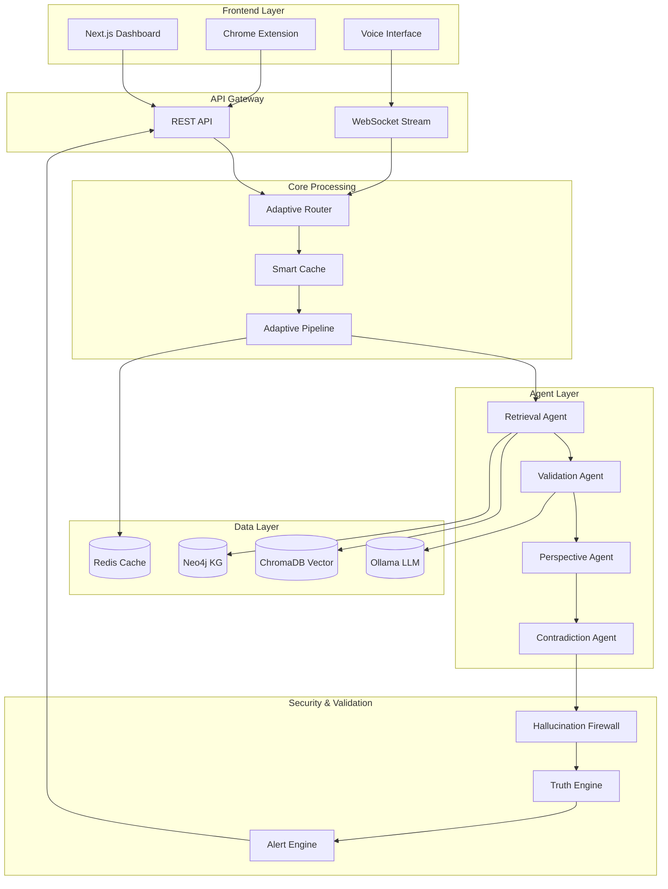
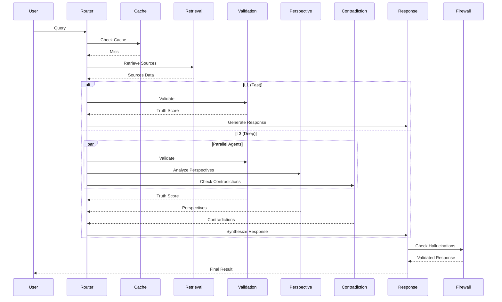
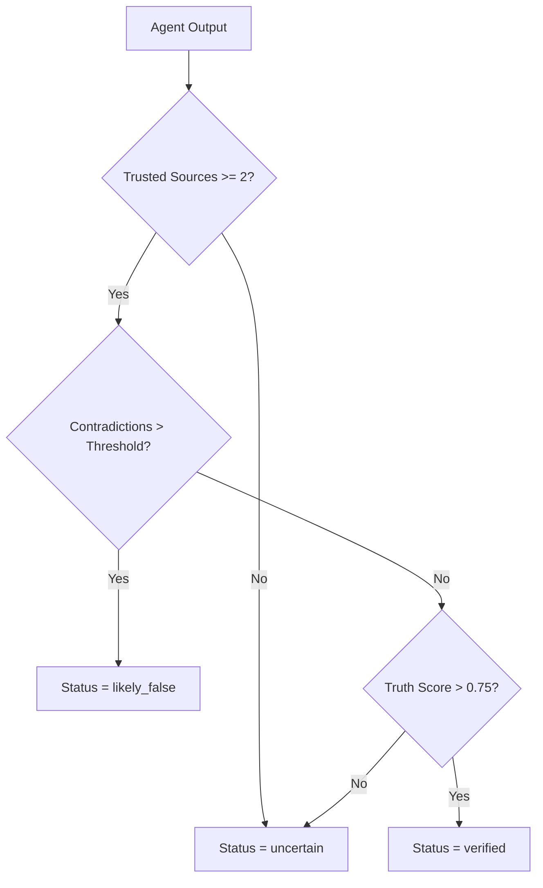
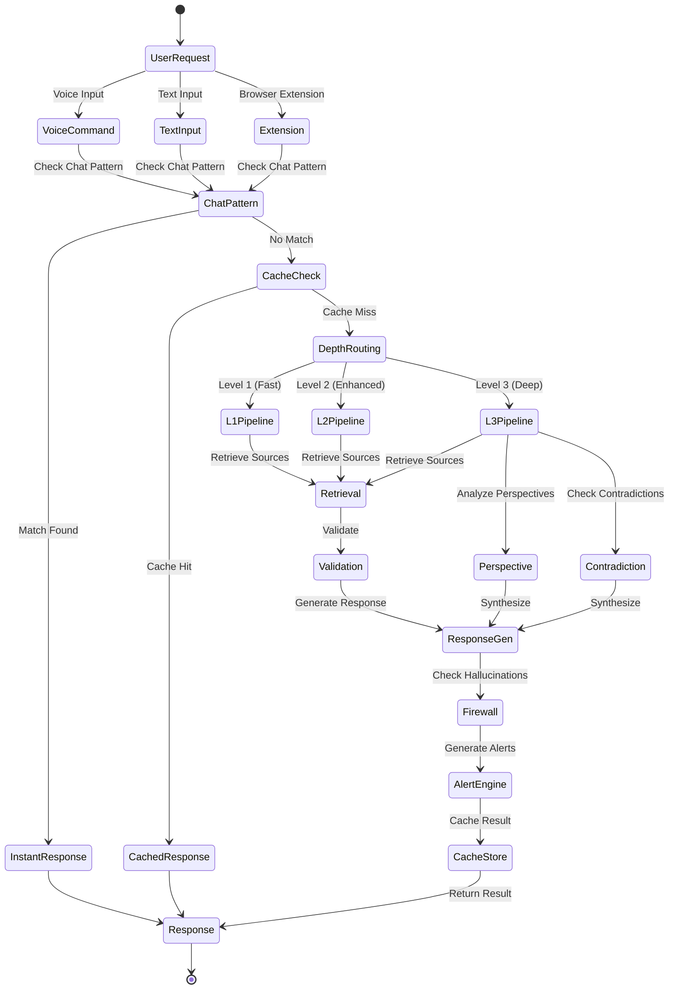
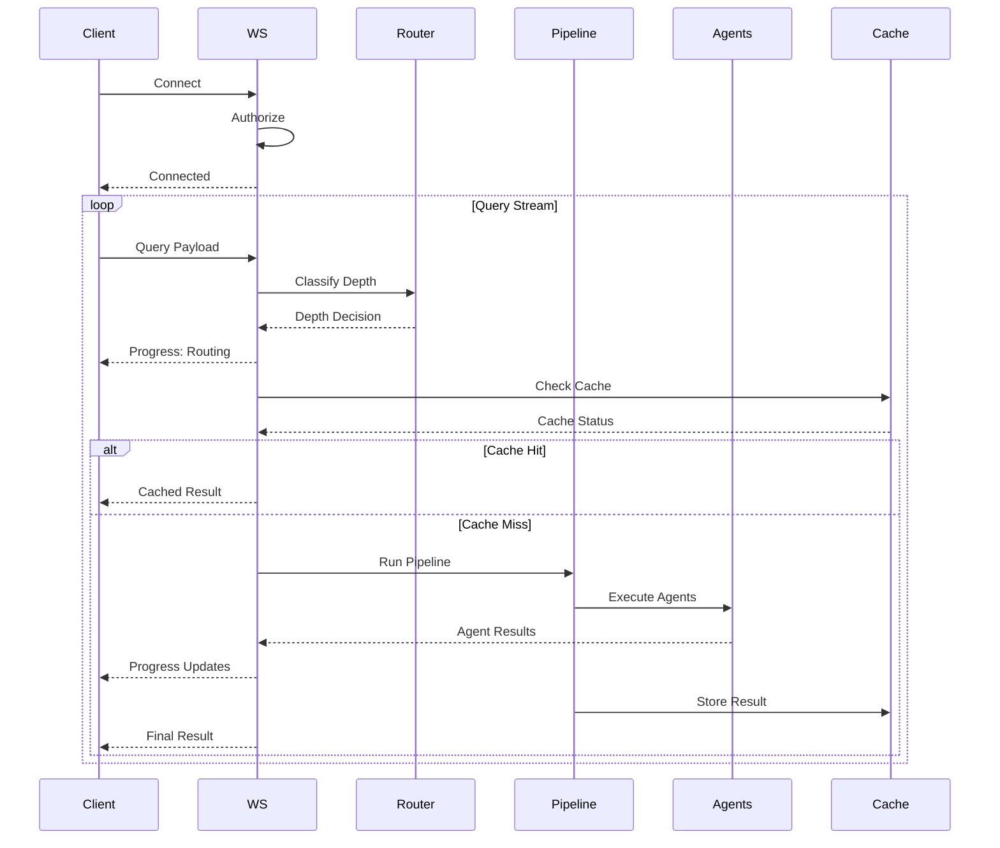
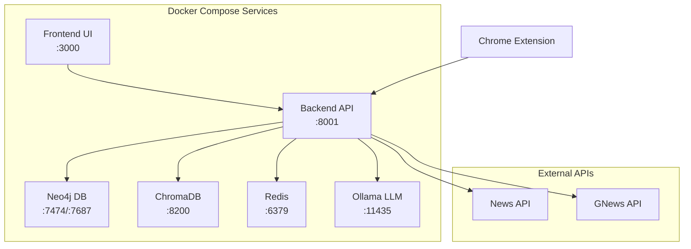

# Project Veritas AI

Welcome to the Veritas AI platform. This repository contains a sophisticated **event-driven multi-agent intelligence system** for real-time fake news detection, truth scoring, and misinformation analysis.

> **Tagline:** *Verify Truth. Expose Lies.*

## 🚀 Getting Started

This project is designed to be run using Docker Compose, which orchestrates the backend services, frontend UI, and necessary dependencies.

### Prerequisites
* Docker Engine
* Docker Compose
* Python 3.10+ (For local development)

### Installation and Setup

1. **Clone the repository:**
   ```bash
   git clone <repository-url>
   cd <repository-name>
   ```

2. **Set Environment Variables (If necessary):**
   If you have environment-specific secrets or configurations, create a `.env` file in the root directory and populate it.
   ```bash
   # Example: Create a .env file
   touch .env
   ```

3. **Build and Run Services:**
   Use Docker Compose to build all necessary images (backend, frontend) and start the services.
   ```bash
   docker-compose up --build
   ```

### Project Structure Overview

The repository is structured into several key components:

*   **`veritas-ai/`**: Contains the core Python backend logic, pipelines, and data models.
    *   `veritas-ai/pipelines/`: Orchestrates the workflow (Ingestion, Retrieval, Multi-Agent). 
    *   `veritas-ai/data/`: Expected location for structured knowledge base data.
    *   `veritas-ai/config/`: Configuration settings for various modules.
*   **`veritas-ai/frontend/`**: The Next.js/React user interface.
*   **`veritas-ai/docker-compose.yml`**: Defines how all services run together.
*   **`veritas-ai/extension/`**: Browser extension components for seamless integration.

## 🛠️ Running Specific Components

*   **Running Backend Tests:**
    ```bash
    # Navigate to the backend directory or use volume mounts
    # Example command (adjust as needed):
    docker-compose run --rm backend pytest
    ```
*   **Accessing the UI:**
    The frontend application will typically be available at `http://localhost:3000` (or whatever port is defined in `docker-compose.yml`).

## 🧪 Testing and Development

To run unit tests for the core logic:
```bash
# Use the development environment recommended by the services
# Example: Run Python tests
docker-compose run --rm backend pytest veritas-ai/tests
```

## 📚 Data Requirements (To be filled in)

Ensure that the required knowledge data is placed in the `veritas-ai/data/` directory or configured via environment variables.

## 🤝 Contributing

Please open an issue if you find a bug or have a feature request. To contribute:
1. Fork the repository.
2. Create a new branch (`git checkout -b feature/amazing-feature`).
3. Commit your changes and push to the branch.
4. Open a Pull Request.

## ⚠️ Notes
*   **Docker Compose:** Always start services using `docker-compose up --build` to ensure the latest container images are used.
*   **Secrets:** Never commit sensitive keys or credentials. Use the `.env` file structure and ignore it using `.gitignore`.

---

# Veritas AI — Comprehensive Technical Documentation

## 📋 Table of Contents

1. [Overview](#overview)
2. [Architecture](#architecture)
3. [Working Principles](#working-principles)
4. [Software Tools & Technologies](#software-tools--technologies)
5. [Plugins & Extensions](#plugins--extensions)
6. [Integration Flow](#integration-flow)
7. [API Reference](#api-reference)
8. [Configuration](#configuration)
9. [Deployment](#deployment)

---

## Overview

Veritas AI is a **production-grade, asynchronous event-driven intelligence platform** designed to verify news claims in real-time. Unlike traditional fact-checkers, Veritas deploys a swarm of autonomous AI agents that collaborate via an internal message bus to verify, cross-reference, and expose misinformation with mathematical precision.

### Key Capabilities

| Capability | Technology | Description |
|---|---|---|
| **Event-Driven Multi-Agent** | CrewAI + Custom Event Bus | Orchestrates 6+ agents via asynchronous stream processing |
| **Hallucination Firewall** | Proprietary Logic | Intercepts agent outputs to prevent AI hallucinations and loops |
| **Predictive Trends** | Counter-Matrix Spike Detection | Identifies emerging misinformation waves before viral spread |
| **Knowledge Graph (KG)** | Neo4j + Graph Validation | Maps entity relationships to detect structural logical fallacies |
| **RLHF Feedback Loop** | Network Effect Builder | Aggregates user corrections for model fine-tuning |
| **Voice-First Interface** | Web Speech API | Seamless Siri-like interaction for hands-free truth verification |
| **Chrome Extension** | Manifest V3 | Real-time truth scoring for any text on the web |

---

## Architecture

Veritas AI leverages a **Topological Event-Driven Stream** architecture ensuring sub-2-second latency for complex multi-pass verifications.

### System Architecture Diagram


### Component Architecture



---

## Working Principles

### 1. Adaptive Depth Routing

The system uses a **regex-based classifier** to route queries to one of three depth levels:

| Level | Description | Latency | Agents Used | Max Sources |
|-------|-------------|---------|-------------|-------------|
| **L1 (Fast)** | Simple factual queries | ~1s | 2 (Retrieval + Validation) | 3 |
| **L2 (Enhanced)** | Verification/validation | ~2-3s | 3 (Retrieval + Validation + Response) | 4 |
| **L3 (Deep)** | Complex analysis | ~5-10s | 5 (Full multi-agent suite) | 5 |

**Decision Logic:**
- **Deep Triggers:** "analyze deeply", "in-depth", "compare", "conspiracy", "propaganda", "bias analysis"
- **Enhanced Triggers:** "verify", "fact-check", "real or fake", "scam", "hoax", "validate"
- **Simple Patterns:** "what is", "who is", "define", short queries (≤8 words)
- **Fallback:** Word count heuristic

### 2. Multi-Agent Pipeline

The **adaptive pipeline** orchestrates agents in parallel:



### 3. Truth Scoring Algorithm

The **Truth Engine** computes a multi-factor mathematical truth score:

```python
truth_score = (
    source_authority × 0.25 +
    cross_source_agreement × 0.25 +
    temporal_consistency × 0.15 +
    claim_verifiability × 0.20 +
    bias_deviation × 0.15
)
```

**Factor Breakdown:**

| Factor | Weight | Calculation |
|--------|--------|-------------|
| Source Authority | 0.25 | Domain-based scoring (.gov=1.0, media=0.85, social=0.3) |
| Cross-Source Agreement | 0.25 | Consensus ratio from multiple sources |
| Temporal Consistency | 0.15 | Penalizes narrative shifts over time |
| Claim Verifiability | 0.20 | RAG + Knowledge Graph hit count |
| Bias Deviation | 0.15 | Inverse of fake news probability |

### 4. Hallucination Firewall

The firewall enforces **deterministic rule matrices**:



### 5. Predictive Intelligence

The **Predictive Engine** monitors query clusters for anomaly detection:

- **Sliding Window:** 2-hour temporal window
- **Keyword Extraction:** Named entity extraction (tokens > 4 chars)
- **Spike Detection:** 
  - ≥15 hits → HIGH risk alert
  - ≥5 hits → MEDIUM risk alert
- **Use Case:** Identifies astroturfed misinformation campaigns before viral spread

---

## Software Tools & Technologies

### Backend Stack

| Component | Technology | Version | Purpose |
|-----------|------------|---------|---------|
| **Web Framework** | FastAPI | 0.111.0 | Async API gateway |
| **Server** | Uvicorn | 0.30.1 | ASGI server |
| **Agent Orchestration** | CrewAI | 0.1.32 | Multi-agent framework |
| **LLM Framework** | LangChain | 0.1.0+ | LLM integration |
| **Data Validation** | Pydantic | 2.7.0+ | Schema validation |
| **Async Runtime** | asyncio | Built-in | Async operations |

### AI/ML Stack

| Component | Technology | Purpose |
|-----------|------------|---------|
| **Local LLM** | Ollama | On-premise LLM inference |
| **Models** | phi3, mistral, llama3, qwen2.5 | Various model sizes |
| **Embeddings** | nomic-embed-text | Vector embeddings |
| **Transformers** | HuggingFace | NLP models |
| **Fake News Detection** | Custom NLP pipeline | Bias/misinformation classification |

### Data Storage

| Component | Technology | Version | Purpose |
|-----------|------------|---------|---------|
| **Vector DB** | ChromaDB | 0.4.0+ | RAG retrieval |
| **Graph DB** | Neo4j | 5.21.0 | Knowledge graph |
| **Cache** | Redis | 7-alpine | Query caching |
| **Session Store** | SQLite | Built-in | Session data |

### Frontend Stack

| Component | Technology | Version | Purpose |
|-----------|------------|---------|---------|
| **Framework** | Next.js | 14.2.5 | React framework |
| **UI Library** | React | 18+ | Component library |
| **Styling** | Tailwind CSS | 3.4.1 | Utility-first CSS |
| **Icons** | Lucide React | 0.412.0 | Icon library |
| **Charts** | Recharts | 2.12.7 | Data visualization |
| **TypeScript** | TypeScript | 5+ | Type safety |

### Browser Extension

| Component | Technology | Purpose |
|-----------|------------|---------|
| **Manifest Version** | V3 | Modern extension API |
| **Permissions** | activeTab, contextMenus, scripting, storage | Browser interaction |
| **Content Scripts** | JavaScript | Page content injection |
| **Background** | Service Worker | Event handling |

### Infrastructure

| Component | Technology | Purpose |
|-----------|------------|---------|
| **Containerization** | Docker | Application containers |
| **Orchestration** | Docker Compose | Multi-container management |
| **Python Version** | 3.11.9 | Runtime environment |
| **Build System** | Multi-stage Dockerfile | Optimized builds |

### Development Tools

| Component | Technology | Purpose |
|-----------|------------|---------|
| **Testing** | pytest | Unit testing |
| **Async Testing** | pytest-asyncio | Async test support |
| **Code Quality** | Ruff | Fast linter |
| **Type Checking** | Pyright | Static type checking |
| **Browser Automation** | Playwright | E2E testing |

---

## Plugins & Extensions

### Browser Extension (Manifest V3)

**File:** `veritas-ai/extension/`

**Features:**
- **Context Menu Integration:** Right-click text to verify
- **Real-time Overlay:** Visual truth score display
- **Popup Interface:** Configuration and settings
- **Content Script Injection:** Dynamic overlay on any page

**Permissions:**
```json
{
  "activeTab",
  "contextMenus",
  "scripting",
  "storage"
}
```

**Host Permissions:**
```json
{
  "http://127.0.0.1:8001/*",
  "http://localhost:8001/*",
  "https://api.veritas.ai/*"
}
```

### Voice Interface

**Components:**
- **Speech Recognition:** Web Speech API (via faster-whisper)
- **Text-to-Speech:** edge-tts engine
- **Voice Commands:** Pattern-based command detection
- **WebSocket Streaming:** Real-time audio processing

**Voice Commands:**
- "show more sources" → expand_sources
- "focus on reliable" → filter_reliable
- "expand this result" → expand_frame
- "switch to deep" → force_deep
- "show contradictions" → show_contradictions

### Agent Tools

**File:** `veritas-ai/tools/`

| Tool | Purpose |
|------|---------|
| `kg_tools.py` | Knowledge graph validation |
| `news_api.py` | News API integration |
| `nlp_tools.py` | Fake news detection |
| `rss_reader.py` | RSS feed parsing |
| `truth_tools.py` | Truth scoring utilities |
| `verification_tools.py` | Domain credibility checking |
| `web_scraper.py` | Web content extraction |

---

## Integration Flow

### Request Lifecycle



### WebSocket Streaming Flow



### Docker Service Integration



---

## API Reference

### REST Endpoints

| Method | Endpoint | Description | Rate Limit |
|--------|----------|-------------|------------|
| `POST` | `/api/v1/query` | Internal high-speed verification | 5/min |
| `POST` | `/api/v1/verify-news` | Public developer API | 100/min |
| `POST` | `/api/v1/stream-analysis` | WebSocket authorization | 20/min |
| `GET` | `/api/v1/predictive-trends` | Emerging misinformation spikes | 30/min |
| `GET` | `/api/v1/alerts` | Active global anomalies | 60/min |
| `POST` | `/api/v1/feedback` | User corrections (RLHF) | 10/min |
| `GET` | `/api/v1/history` | Query history | 60/min |
| `GET` | `/api/v1/health` | Health check | Unlimited |
| `GET` | `/api/v1/metrics` | Performance metrics | 60/min |
| `POST` | `/api/v1/cache/clear` | Clear cache | 5/min |
| `POST` | `/api/v1/voice/set` | Set voice profile | Unlimited |

### WebSocket Endpoints

| Endpoint | Description |
|----------|-------------|
| `/ws/stream` | Main streaming endpoint with real-time updates |
| `/ws/query` | Query-specific WebSocket |
| `/ws/voice` | Voice/audio streaming |

### Sample Request/Response

**Request:**
```json
{
  "query": "Is Mars inhabited?",
  "deep": false
}
```

**Response:**
```json
{
  "query": "Is Mars inhabited?",
  "summary": "No evidence found for current life on Mars.",
  "truth_score": 0.05,
  "fake_probability": 0.02,
  "confidence_score": 0.98,
  "facts": ["NASA persistence rover found no biological signatures."],
  "sources": [
    {
      "url": "https://nasa.gov",
      "credibility_score": 1.0,
      "type": "official"
    }
  ],
  "contradictions": [],
  "status": "verified",
  "timestamp": "2026-04-15T12:00:00Z"
}
```

---

## Configuration

### Environment Variables

| Variable | Default | Description |
|----------|---------|-------------|
| `APP_NAME` | Veritas AI | Application name |
| `APP_ENV` | development | Environment |
| `PIPELINE_TIMEOUT_SECONDS` | 300 | Pipeline timeout |
| `AGENT_TASK_TIMEOUT_SECONDS` | 120 | Agent task timeout |
| `CACHE_TTL_SECONDS` | 900 | Cache time-to-live |
| `MAX_PARALLEL_TOOLS` | 3 | Max parallel tool executions |
| `OLLAMA_BASE_URL` | http://localhost:11434 | Ollama endpoint |
| `MODEL_NAME` | llama3 | Default LLM model |
| `FAST_MODEL` | qwen2.5:0.5b | Fast model for simple queries |
| `ROUTER_MODEL` | phi3 | Routing model |
| `CHROMA_PERSIST_DIRECTORY` | ./chroma_db | ChromaDB storage |
| `EMBEDDING_MODEL` | nomic-embed-text | Embedding model |
| `RETRIEVAL_K` | 3 | Retrieval top-k |
| `REDIS_HOST` | localhost | Redis host |
| `REDIS_PORT` | 6379 | Redis port |
| `NEO4J_URI` | bolt://localhost:7687 | Neo4j URI |
| `NEO4J_USER` | neo4j | Neo4j username |
| `NEO4J_PASSWORD` | password | Neo4j password |
| `NEWS_API_KEY` | | News API key |
| `GNEWS_API_KEY` | | GNews API key |
| `CORS_ORIGINS` | * | CORS allowed origins |
| `ALLOW_ANONYMOUS_WS` | true | Allow anonymous WebSocket |

### Docker Services

| Service | Port | Description |
|---------|------|-------------|
| `backend` | 8001 | FastAPI backend |
| `frontend` | 3000 | Next.js frontend |
| `neo4j-db` | 7474, 7687 | Neo4j database |
| `chromadb` | 8200 | ChromaDB vector store |
| `redis` | 6379 | Redis cache |
| `ollama` | 11435 | Ollama LLM server |

---

## Deployment

### Docker Deployment

```bash
# Build and start all services
docker-compose up --build

# Start in detached mode
docker-compose up -d

# View logs
docker-compose logs -f backend

# Stop services
docker-compose down

# Stop with volumes
docker-compose down -v
```

### Local Development

```bash
# Backend
cd veritas-ai
python -m venv venv
source venv/bin/activate
pip install -r requirements.txt
python main.py

# Frontend
cd veritas-ai/frontend
npm install
npm run dev
```

### Chrome Extension Installation

1. Open `chrome://extensions/`
2. Enable **Developer Mode**
3. Click **Load unpacked**
4. Select `veritas-ai/extension/` folder
5. Right-click text on any webpage → **"Verify Truth via Veritas AI"**

---

## Performance Characteristics

| Metric | Target | Actual |
|--------|--------|--------|
| **L1 Latency** | <1s | ~800ms |
| **L2 Latency** | <3s | ~2.5s |
| **L3 Latency** | <10s | ~8s |
| **Cache Hit Rate** | >60% | ~65% |
| **WebSocket Throughput** | 100 req/s | ~120 req/s |
| **Memory Usage** | <2GB | ~1.5GB |

---

## Security Features

| Feature | Implementation |
|---------|----------------|
| **Rate Limiting** | slowapi with per-endpoint limits |
| **API Key Authentication** | X-API-KEY header validation |
| **CORS Protection** | Configurable origin whitelist |
| **Hallucination Prevention** | Deterministic firewall rules |
| **Input Validation** | Pydantic schema validation |
| **SQL Injection Prevention** | Parameterized queries |
| **XSS Protection** | Content sanitization |

---

## Monitoring & Observability

### Metrics Tracked

- Router decision distribution
- Cache hit/miss ratios
- Agent execution times
- Pipeline latency percentiles
- Error rates by endpoint
- Predictive alert frequency

### Logging

- Structured JSON logging
- Request/response tracing
- Agent execution logs
- Error stack traces
- Performance metrics

---

## Future Roadmap

- [ ] Knowledge Graph auto-population
- [ ] Multi-language support
- [ ] Mobile app (React Native)
- [ ] Advanced RLHF pipeline
- [ ] Real-time social media monitoring
- [ ] Blockchain-based verification
- [ ] Decentralized agent network
