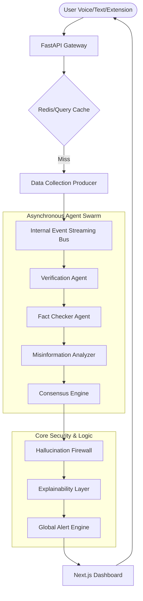

# Friday — AI-Powered Truth Engine

> **Real-time multi-agent intelligence for fake news detection, truth scoring, and misinformation analysis.**


---

## 🚀 Overview

Friday is a production-grade, **asynchronous event-driven intelligence platform** designed to verify news claims in real-time. Unlike traditional fact-checkers, Friday deploys a swarm of autonomous AI agents that collaborate via an internal message bus to verify, cross-reference, and expose misinformation with mathematical precision.

**Tagline:** *Verify Truth. Expose Lies.*

---

## ℹ️ About

Friday is an open-source AI-powered truth verification system built to combat the growing epidemic of misinformation in the digital age. Named after the intelligent assistant from Iron Man, Friday embodies the same commitment to truth, accuracy, and reliability.

### Mission

Our mission is to democratize access to truth verification by providing:
- **Real-time fact-checking** with sub-2-second response times
- **Transparent reasoning** with source citations and confidence scores
- **Privacy-first design** with local LLM support and optional cloud models
- **Extensible architecture** for researchers and developers to build upon

### What Makes Friday Different

Unlike traditional fact-checking services that rely on manual verification or simple keyword matching, Friday uses a sophisticated multi-agent system that:
1. **Retrieves** information from multiple trusted sources simultaneously
2. **Validates** claims against cross-referenced evidence
3. **Analyzes** for contradictions and logical fallacies
4. **Scores** truthfulness using a weighted mathematical model
5. **Explains** findings with human-readable summaries

### Use Cases

- **Journalists:** Quickly verify claims before publishing
- **Researchers:** Track misinformation patterns and trends
- **Developers:** Integrate truth verification into applications via API
- **General Public:** Fact-check news articles, social media posts, and more

### 🛠️ Key Capabilities

| Capability | Technology | Description |
|---|---|---|
| **macOS Menu Bar Assistant** | rumps + AppKit | Persistent system-tray AI with 'Liquid Glass' Tahoe aesthetics. |
| **Acoustic Triggers** | Neural Rolling Buffer | Voice activation ('Hey Friday') and Double Clap acoustic spikes. |
| **Event-Driven Multi-Agent** | CrewAI + Custom Event Bus | Orchestrates 6+ agents via asynchronous stream processing. |
| **Hallucination Firewall** | Proprietary Logic | Intercepts agent outputs to prevent AI hallucinations and loops. |
| **Predictive Trends** | Counter-Matrix Spike Detection | Identifies emerging misinformation waves *before* they go viral. |
| **Knowledge Graph (KG)** | Neo4j + Graph Validation | Maps entity relationships to detect structural logical fallacies. |
| **Liquid Glass Pop-out** | Native Cocoa (AppKit) | Siri-like floating UI with state-aware neural animations. |
| **Chrome Extension** | Manifest V3 | Real-time truth scoring for any text on the web. |

---

## 🏗️ Architecture

Friday leverages a **Topological Event-Driven Stream** architecture. This ensures sub-2-second latency for complex multi-pass verifications.



---

## 📦 Quick Start

### 1. macOS Desktop Assistant (Recommended)
Friday is now a persistent macOS Menu Bar application with hands-free activation.

```bash
# Clone and setup
git clone https://github.com/Anmo07/Friday.git
cd Friday
python -m venv venv
source venv/bin/activate
pip install -e .

# Run the Menu Bar App
friday
```
*Look for the **Liquid Glass Orb (🤖)** in your menu bar.*

### 2. Manual CLI/Web Dashboard (Legacy)
```bash
# Start backend
python main.py

# Start Frontend
cd frontend && npm install && npm run dev
```

### 2. Docker (Production-Ready)
Deploy the entire stack (API, UI, Databases) with a single command:
```bash
docker compose up --build
```

### 3. Chrome Extension
1. Open `chrome://extensions/`
2. Enable **Developer Mode**.
3. Click **Load unpacked** and select the `friday/extension/` folder.
4. Right-click any text on a webpage → **"Verify Truth via Friday"**.

---

## 📡 API Reference

All developer endpoints require an `X-API-KEY` header (except internal UI routes).

| Method | Endpoint | Description |
|--------|----------|-------------|
| `POST` | `/api/v1/query` | Internal high-speed verification (Extension/UI). |
| `POST` | `/api/v1/verify-news` | Public developer API for synchronous verification. |
| `POST` | `/api/v1/stream-analysis` | Authorizes a WebSocket tunnel for high-volume streaming. |
| `GET` | `/api/v1/predictive-trends` | Returns emerging misinformation spikes and anomalies. |
| `GET` | `/api/v1/alerts` | Fetches active global truth-risk anomalies. |
| `POST` | `/api/v1/feedback` | Submits user corrections to the RLHF pipeline. |

### Sample Output Schema
```json
{
  "query": "Is Mars inhabited?",
  "summary": "No evidence found for current life on Mars.",
  "truth_score": 0.05,
  "fake_probability": 0.02,
  "confidence_score": 0.98,
  "facts": ["NASA persistence rover found no biological signatures."],
  "status": "verified",
  "timestamp": "2026-04-15T12:00:00Z"
}
```

---

## 🛡️ Technical Deep Dive

### Hallucination Firewall
Friday implements a custom evaluation layer that sits between the Agent Swarm and the User. It uses **Graph Validation** and **Contradiction Detection** to ensure that agents do not invent claims not found in the source documents.

### High-Performance Engine (v0.2.0)
The latest engine features an **Async-Safe High-Performance Pipeline** designed for sub-200ms conversational responsiveness:
- **Non-Blocking Classification:** Intent detection and tier routing run in dedicated threads to keep the event loop responsive.
- **RMS-Calibrated Voice Capture:** Custom audio listener with precise energy thresholding for stable voice interaction in noisy environments.
- **Neural Streaming TTS:** Integrated Edge Neural Voice synthesis with pre-calculated prosody for instant conversational feedback.

### Predictive Intelligence
The **Predictive Intelligence Engine** monitors global query clusters. By analyzing the velocity of specific keyword spikes (e.g., "election fraud", "vaccine leak"), it can flag astroturfed misinformation campaigns minutes before they saturate social networks.

---

## 🛠️ Tech Stack

- **Backend:** Python 3.9+, FastAPI, Uvicorn, CrewAI, LangChain
- **AI Models:** Ollama (Local), HuggingFace Transformers, OpenAI (Optional)
- **Databases:** Neo4j (Knowledge Graph), ChromaDB (Vector), SQLite (Session Cache)
- **Frontend:** Next.js 14, TypeScript, Tailwind CSS, Web Speech API
- **Deployment:** Docker, Kubernetes, GitHub Actions

---

## 📜 License

MIT License. See [LICENSE](LICENSE) for details.

---

<p align="center">
  <strong>Friday</strong> — Built by <a href="https://github.com/anmol">Anmol</a><br/>
  <em>"Because the truth shouldn't be a luxury."</em>
</p>
